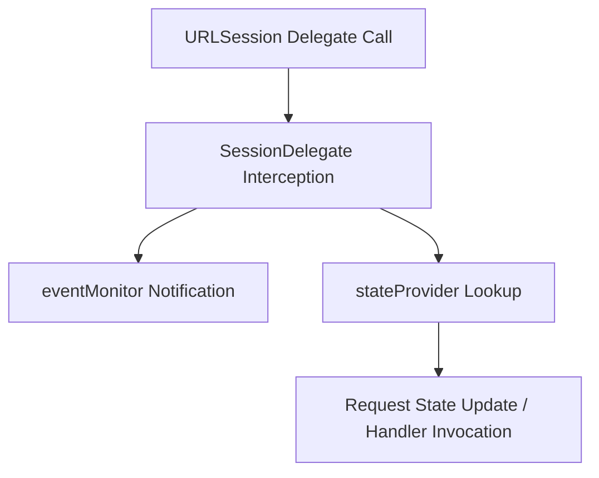

# Event Monitoring

<details>
<summary>Relevant source files</summary>

The following files were used as context for generating this wiki page:

- [Source/Features/EventMonitor.swift](https://github.com/Alamofire/Alamofire/blob/main/Source/Features/EventMonitor.swift)
- [Tests/NSLoggingEventMonitor.swift](https://github.com/Alamofire/Alamofire/blob/main/Tests/NSLoggingEventMonitor.swift)
- [Source/Core/Request.swift](https://github.com/Alamofire/Alamofire/blob/main/Source/Core/Request.swift)
- [Source/Core/SessionDelegate.swift](https://github.com/Alamofire/Alamofire/blob/main/Source/Core/SessionDelegate.swift)
- [Tests/InspectorEventMonitor.swift](https://github.com/Alamofire/Alamofire/blob/main/Tests/InspectorEventMonitor.swift)
- [docs/Classes/ClosureEventMonitor.html](https://github.com/Alamofire/Alamofire/blob/main/docs/Classes/ClosureEventMonitor.html)
</details>

## Overview

Event monitoring in Alamofire provides a robust mechanism for tracking and intercepting network lifecycle events across both sessions and individual requests. By conforming to the `EventMonitor` protocol, developers can observe granular operations ranging from URLSession delegate callbacks and task metrics to request state transitions, retries, and response parsing. This architecture solves the challenge of deep network visibility and debugging by decoupling logging and diagnostic tooling from core networking logic. Key design decisions include thread-safe dispatch queue configuration and composite monitoring structures, enabling clean separation of concerns and seamless integration of custom diagnostic observers.

Sources: [Source/Features/EventMonitor.swift:27-32](https://github.com/Alamofire/Alamofire/blob/main/Source/Features/EventMonitor.swift#L27-L32), [Source/Features/EventMonitor.swift:314-320](https://github.com/Alamofire/Alamofire/blob/main/Source/Features/EventMonitor.swift#L314-L320), [Source/Core/Request.swift:1067-1095](https://github.com/Alamofire/Alamofire/blob/main/Source/Core/Request.swift#L1067-L1095)

## Core EventMonitor Architecture and Protocol

### Overview

The core event monitoring architecture in Alamofire centers around the `EventMonitor` protocol, which outlines the comprehensive lifetime events occurring within Alamofire sessions and requests. Conforming types gain access to a wide array of hooks covering `URLSessionDelegate` protocols as well as request lifecycle states. Each monitor instance must declare a `DispatchQueue` on which its event methods will be invoked, ensuring thread safety and control over execution contexts.

Sources: [Source/Features/EventMonitor.swift:27-31](https://github.com/Alamofire/Alamofire/blob/main/Source/Features/EventMonitor.swift#L27-L31)

Protocol extensions provide default empty implementations for all required methods and establish a default dispatch queue configuration of `.main` for composite structures.

Sources: [Source/Features/EventMonitor.swift:225-228](https://github.com/Alamofire/Alamofire/blob/main/Source/Features/EventMonitor.swift#L225-L228), [Source/Features/EventMonitor.swift:230-312](https://github.com/Alamofire/Alamofire/blob/main/Source/Features/EventMonitor.swift#L230-L312)

### CompositeEventMonitor Structure

To support multi-monitor setups, Alamofire provides the `CompositeEventMonitor` final class, which conforms to `EventMonitor` and can contain multiple underlying monitors.

Sources: [Source/Features/EventMonitor.swift:314-315](https://github.com/Alamofire/Alamofire/blob/main/Source/Features/EventMonitor.swift#L314-L315)

```swift
public final class CompositeEventMonitor: EventMonitor {
    public let queue: DispatchQueue
    public var monitors: [any EventMonitor] {
        _monitors.read(\.self)
    }

    let _monitors: Protected<[any EventMonitor]>

    init(queue: DispatchQueue = DispatchQueue(label: "org.alamofire.compositeEventMonitor"), monitors: [any EventMonitor]) {
        self.queue = queue
        _monitors = Protected(monitors)
    }

    func performEvent(_ event: sending @escaping (any EventMonitor) -> Void) {
        _monitors.read { monitors in
            for monitor in monitors {
                monitor.queue.async { event(monitor) }
            }
        }
    }
    // ...
}
```

Sources: [Source/Features/EventMonitor.swift:315-342](https://github.com/Alamofire/Alamofire/blob/main/Source/Features/EventMonitor.swift#L315-L342)

When an event triggers on the `CompositeEventMonitor`, its internal `performEvent(_:)` method reads the thread-safe `Protected` array of monitors and asynchronously dispatches the event onto each individual monitor's designated `queue`.

Sources: [Source/Features/EventMonitor.swift:322-342](https://github.com/Alamofire/Alamofire/blob/main/Source/Features/EventMonitor.swift#L322-L342)

> [!NOTE]
> `CompositeEventMonitor` uses a default serial dispatch queue labeled `"org.alamofire.compositeEventMonitor"` when initialized without explicit parameters, preventing race conditions when modifying or reading the underlying monitor collection.

Sources: [Source/Features/EventMonitor.swift:331-334](https://github.com/Alamofire/Alamofire/blob/main/Source/Features/EventMonitor.swift#L331-L334)

## URLSession Lifecycle Event Dispatching

### Overview

Alamofire connects native `URLSession` delegate callbacks to its internal architecture through `SessionDelegate`. This class implements standard Foundation delegate protocols—including `URLSessionDelegate`, `URLSessionTaskDelegate`, `URLSessionDataDelegate`, and `URLSessionDownloadDelegate`—capturing system events, notifying active `EventMonitor` instances, and driving internal request state progression.

Sources: [Source/Core/SessionDelegate.swift:27-28](https://github.com/Alamofire/Alamofire/blob/main/Source/Core/SessionDelegate.swift#L27-L28), [Source/Core/SessionDelegate.swift:73-87](https://github.com/Alamofire/Alamofire/blob/main/Source/Core/SessionDelegate.swift#L73-L87), [Source/Core/SessionDelegate.swift:91-236](https://github.com/Alamofire/Alamofire/blob/main/Source/Core/SessionDelegate.swift#L91-L236), [Source/Core/SessionDelegate.swift:240-285](https://github.com/Alamofire/Alamofire/blob/main/Source/Core/SessionDelegate.swift#L240-L285), [Source/Core/SessionDelegate.swift:320-394](https://github.com/Alamofire/Alamofire/blob/main/Source/Core/SessionDelegate.swift#L320-L394)

### SessionDelegate Event Capture Workflow

When `URLSession` invokes a task-level or data-level delegate method, `SessionDelegate` intercepts the call, forwards diagnostic data to the registered `eventMonitor`, and coordinates with the `stateProvider` to update or resolve associated `Request` instances.

Sources: [Source/Core/SessionDelegate.swift:31-32](https://github.com/Alamofire/Alamofire/blob/main/Source/Core/SessionDelegate.swift#L31-L32), [Source/Core/SessionDelegate.swift:95-120](https://github.com/Alamofire/Alamofire/blob/main/Source/Core/SessionDelegate.swift#L95-L120), [Source/Core/SessionDelegate.swift:241-258](https://github.com/Alamofire/Alamofire/blob/main/Source/Core/SessionDelegate.swift#L241-L258)



Sources: [Source/Core/SessionDelegate.swift:95-120](https://github.com/Alamofire/Alamofire/blob/main/Source/Core/SessionDelegate.swift#L95-L120), [Source/Core/SessionDelegate.swift:214-220](https://github.com/Alamofire/Alamofire/blob/main/Source/Core/SessionDelegate.swift#L214-L220)

For instance, when task metrics are collected, `urlSession(_:task:didFinishCollecting:)` executes the following call chain: `eventMonitor?.urlSession(_:task:didFinishCollecting:)` → `stateProvider?.request(for: task)?.didGatherMetrics(metrics)` → `stateProvider?.didGatherMetricsForTask(task)`.

Sources: [Source/Core/SessionDelegate.swift:214-220](https://github.com/Alamofire/Alamofire/blob/main/Source/Core/SessionDelegate.swift#L214-L220)

> [!WARNING]
> If a delegate callback encounters a task identifier with a missing `stateProvider`, `SessionDelegate` triggers an assertion failure via `assertionFailure("StateProvider is nil for task \(task.taskIdentifier).")`, indicating an unmanaged or prematurely deallocated session context.

Sources: [Source/Core/SessionDelegate.swift:48-52](https://github.com/Alamofire/Alamofire/blob/main/Source/Core/SessionDelegate.swift#L48-L52)

### Supported URLSession Delegate Protocols and Mappings

`SessionDelegate` conforms to multiple `URLSession` delegate interfaces to handle distinct phases of network traffic. The primary protocols and their key event handlers are mapped below.

| Protocol | Representative Method | Primary Action & Event Monitoring |
| :--- | :--- | :--- |
| `URLSessionDelegate` | `urlSession(_:didBecomeInvalidWithError:)` | Forwards invalidation to `eventMonitor`, cancels active requests via `stateProvider`, and executes session cleanup closures. |
| `URLSessionTaskDelegate` | `urlSession(_:task:didReceive:completionHandler:)` | Evaluates server trust and credential challenges, notifying `eventMonitor` and feeding error states back to tasks. |
| `URLSessionTaskDelegate` | `urlSession(_:task:didCompleteWithError:)` | Triggers task completion, propagating `AFError` mapping and finishing request lifecycles. |
| `URLSessionDataDelegate` | `urlSession(_:dataTask:didReceive:completionHandler:)` | Dispatches response headers to `DataRequest` or `DataStreamRequest` and invokes response disposition handlers. |
| `URLSessionDownloadDelegate` | `urlSession(_:downloadTask:didFinishDownloadingTo:)` | Moves temporary download files to their designated target paths, managing intermediate directories and overwrite options. |

Sources: [Source/Core/SessionDelegate.swift:73-86](https://github.com/Alamofire/Alamofire/blob/main/Source/Core/SessionDelegate.swift#L73-L86), [Source/Core/SessionDelegate.swift:95-120](https://github.com/Alamofire/Alamofire/blob/main/Source/Core/SessionDelegate.swift#L95-L120), [Source/Core/SessionDelegate.swift:222-230](https://github.com/Alamofire/Alamofire/blob/main/Source/Core/SessionDelegate.swift#L222-L230), [Source/Core/SessionDelegate.swift:241-258](https://github.com/Alamofire/Alamofire/blob/main/Source/Core/SessionDelegate.swift#L241-L258), [Source/Core/SessionDelegate.swift:357-393](https://github.com/Alamofire/Alamofire/blob/main/Source/Core/SessionDelegate.swift#L357-L393)

> [!TIP]
> When handling authentication challenges for server trust or client certificates, `SessionDelegate` returns a `ChallengeEvaluation` tuple containing the disposition, optional credential, and optional `AFError`, ensuring uniform disposition routing back to `completionHandler`.

Sources: [Source/Core/SessionDelegate.swift:91-120](https://github.com/Alamofire/Alamofire/blob/main/Source/Core/SessionDelegate.swift#L91-L120)

## Request State Transition Monitoring

### Overview

Alamofire's `Request` class governs request lifecycles via an internal state machine. Request lifecycle operations—including `resume()`, `suspend()`, and `cancel()`—coordinate state updates on the underlying serial queue and trigger specific event monitor notifications such as `requestDidResume`, `request(_:didResumeTask:)`, `requestDidSuspend`, `request(_:didSuspendTask:)`, `requestDidCancel`, and `request(_:didCancelTask:)`. 

Sources: [Source/Features/EventMonitor.swift:136-153](https://github.com/Alamofire/Alamofire/blob/main/Source/Features/EventMonitor.swift#L136-L153), [Source/Core/Request.swift:29-64](https://github.com/Alamofire/Alamofire/blob/main/Source/Core/Request.swift#L29-L64), [Source/Core/Request.swift:714-791](https://github.com/Alamofire/Alamofire/blob/main/Source/Core/Request.swift#L714-L791)

The state machine explicitly validates permissible transitions through `canTransitionTo(_:)`, ensuring robust handling when requests move between operational phases.

Sources: [Source/Core/Request.swift:49-64](https://github.com/Alamofire/Alamofire/blob/main/Source/Core/Request.swift#L49-L64)

### Request Lifecycle States and Transitions

The `Request.State` enumeration defines the discrete phases of a request's lifecycle. Each state governs whether subsequent control flow actions like cancellation, suspension, or resumption are legally permitted.

| State | Description | Permitted Transitions |
| :--- | :--- | :--- |
| `.initialized` | Initial state of the `Request` upon instantiation. | Any state except `.initialized`. |
| `.resumed` | State set when `resume()` is called, causing associated tasks to be resumed. | `.cancelled`, `.suspended`, `.finished` |
| `.suspended` | State set when `suspend()` is called, causing associated tasks to be suspended. | `.cancelled`, `.resumed`, `.finished` |
| `.cancelled` | State set when `cancel()` is called. Permanent terminal state. | None (terminal). |
| `.finished` | State set when all response serialization completion closures have been dispatched. | None (terminal). |

Sources: [Source/Core/Request.swift:32-64](https://github.com/Alamofire/Alamofire/blob/main/Source/Core/Request.swift#L32-L64)

> [!WARNING]
> Unlike `.resumed` or `.suspended`, once a request enters the `.cancelled` or `.finished` state, it can no longer transition to any other operational state. Attempting invalid transitions like `.finished` back to `.initialized` or `.cancelled` to `.resumed` returns `false` via `canTransitionTo(_:)`.

Sources: [Source/Core/Request.swift:42-64](https://github.com/Alamofire/Alamofire/blob/main/Source/Core/Request.swift#L42-L64)

### State Transition Call Chain

When `resume()` is invoked on a `Request`, execution flows through a precise sequence of internal methods: `resume()` → `mutableState.write` (updates state to `.resumed` and dispatches `didResume()`) → `underlyingQueue.async` executing `didResume()` → `eventMonitor?.requestDidResume(self)`. If an underlying task exists, `task.resume()` is called and `underlyingQueue.async` triggers `didResumeTask(task)` → `eventMonitor?.request(self, didResumeTask: task)`.

Sources: [Source/Core/Request.swift:424-439](https://github.com/Alamofire/Alamofire/blob/main/Source/Core/Request.swift#L424-L439), [Source/Core/Request.swift:768-791](https://github.com/Alamofire/Alamofire/blob/main/Source/Core/Request.swift#L768-L791)

> [!NOTE]
> During a cancellation event via `cancel()`, if a task has already completed (`task.state == .completed`), cancellation returns early because the underlying delegate callbacks are already in flight and manual task cancellation has no effect.

Sources: [Source/Core/Request.swift:714-739](https://github.com/Alamofire/Alamofire/blob/main/Source/Core/Request.swift#L714-L739)

### Retry Lifecycle Monitoring

When a request encounters an error, `retryOrFinish(error:)` evaluates whether to retry the request or finalize execution. If retried, `prepareForRetry()` increments the `retryCount` mutable property, invokes `reset()` to clear previous errors, progress counters, and serialization queues, and fires `eventMonitor?.requestIsRetrying(self)`.

Sources: [Source/Core/Request.swift:253-256](https://github.com/Alamofire/Alamofire/blob/main/Source/Core/Request.swift#L253-L256), [Source/Core/Request.swift:529-575](https://github.com/Alamofire/Alamofire/blob/main/Source/Core/Request.swift#L529-L575), [Source/Core/Request.swift:665-677](https://github.com/Alamofire/Alamofire/blob/main/Source/Core/Request.swift#L665-L677)

## Metrics and cURL Handler Logging

### Overview

Alamofire captures performance metrics and generates executable cURL command representations through dedicated telemetry hooks within the `Request` and `EventMonitor` architectures. When `URLSessionTask` metrics become available, they flow into both the event monitoring layer and the request's internal metrics storage.

Sources: [Source/Features/EventMonitor.swift:61-62](https://github.com/Alamofire/Alamofire/blob/main/Source/Features/EventMonitor.swift#L61-L62), [Source/Core/Request.swift:243-251](https://github.com/Alamofire/Alamofire/blob/main/Source/Core/Request.swift#L243-L251)

### Task Metrics Collection Call Chain

Task performance data is gathered and deduped through a specific sequence of internal functions: `didGatherMetrics(_:)` → `mutableState.write` (compares `mutableState.metrics.last` against incoming metrics to prevent duplicate entries from newer Network.framework-based `URLSession` instances running with classic loading mode disabled) → `mutableState.metrics.append(metrics)` → `eventMonitor?.request(self, didGatherMetrics: metrics)`.

Sources: [Source/Core/Request.swift:479-491](https://github.com/Alamofire/Alamofire/blob/main/Source/Core/Request.swift#L479-L491)

> [!NOTE]
> Newer Network.framework-based `URLSession` instances (`useClassicLoadingMode == false`) can issue duplicate metrics delegate callbacks. Alamofire guards against this by checking whether `mutableState.metrics.last` matches the incoming metrics before appending.

Sources: [Source/Core/Request.swift:482-488](https://github.com/Alamofire/Alamofire/blob/main/Source/Core/Request.swift#L482-L488)

### cURL Handler and Command Generation

The cURL generation subsystem constructs a complete, executable command string from the request's parameters, HTTP methods, headers, body data, credentials, and cookies. 

Sources: [Source/Core/Request.swift:1179-1247](https://github.com/Alamofire/Alamofire/blob/main/Source/Core/Request.swift#L1179-L1247)

| Component | Source Reference | Behavior & Handling |
| :--- | :--- | :--- |
| HTTP Method & URL | `request.httpMethod`, `url.absoluteString` | Appends `-X [METHOD]` and the quoted destination URL. |
| Credentials | `delegate?.sessionConfiguration.urlCredentialStorage` | Extracts basic authentication via `-u user:password` from storage or direct credentials. |
| Cookies | `configuration.httpCookieStorage` | Formats stored cookies into a single `-b "name=value"` header string. |
| Headers | `request.headers`, session configuration | Injects custom headers using `-H "Name: Value"` with escaped quotation marks. |
| HTTP Body | `request.httpBody` | Decodes UTF-8 body data and appends it via `-d "body"`. |

Sources: [Source/Core/Request.swift:1186-1244](https://github.com/Alamofire/Alamofire/blob/main/Source/Core/Request.swift#L1186-L1244)

> [!TIP]
> You can register a cURL description callback asynchronously using `cURLDescription(on:calling:)` or `cURLDescription(calling:)`. If the `URLRequest` has already been created, the handler fires immediately on the specified queue; otherwise, it is stored as a `cURLHandler` inside `MutableState` and invoked as soon as request creation finishes.

Sources: [Source/Core/Request.swift:104-105](https://github.com/Alamofire/Alamofire/blob/main/Source/Core/Request.swift#L104-L105), [Source/Core/Request.swift:908-935](https://github.com/Alamofire/Alamofire/blob/main/Source/Core/Request.swift#L908-L935)

## Custom Event Monitor Implementations

### Overview

Concrete monitoring patterns in Alamofire enable lightweight telemetry and diagnostic tracking without requiring full custom class conformances. The framework provides specialized implementations such as `ClosureEventMonitor` for property-based closure assignment and custom diagnostic monitors like `InspectorEventMonitor` and `NSLoggingEventMonitor` for test and logging environments.

Sources: [Tests/NSLoggingEventMonitor.swift:28-35](https://github.com/Alamofire/Alamofire/blob/main/Tests/NSLoggingEventMonitor.swift#L28-L35), [Tests/InspectorEventMonitor.swift:28-51](https://github.com/Alamofire/Alamofire/blob/main/Tests/InspectorEventMonitor.swift#L28-L51), [docs/Classes/ClosureEventMonitor.html:573-583](https://github.com/Alamofire/Alamofire/blob/main/docs/Classes/ClosureEventMonitor.html#L573-L583)

### ClosureEventMonitor Usage Pattern

`ClosureEventMonitor` conforms to `EventMonitor` and is marked `@unchecked Sendable`. It exposes optional properties corresponding to URL session and request lifecycle events, allowing callers to assign closures directly without subclassing.

Sources: [docs/Classes/ClosureEventMonitor.html:573-583](https://github.com/Alamofire/Alamofire/blob/main/docs/Classes/ClosureEventMonitor.html#L573-L583)

```swift
let monitor = ClosureEventMonitor()
monitor.requestDidResume = { request in
    print("Request resumed: \(request)")
}
monitor.requestDidCompleteTaskWithError = { request, task, error in
    print("Task completed with error: \(error?.localizedDescription ?? "None")")
}
```

Sources: [docs/Classes/ClosureEventMonitor.html:1200-1224](https://github.com/Alamofire/Alamofire/blob/main/docs/Classes/ClosureEventMonitor.html#L1200-L1224), [docs/Classes/ClosureEventMonitor.html:1282-1305](https://github.com/Alamofire/Alamofire/blob/main/docs/Classes/ClosureEventMonitor.html#L1282-L1305)

### Diagnostic Test Monitors

Test suites implement specialized monitors like `InspectorEventMonitor` and `NSLoggingEventMonitor` to verify event delivery and pipe telemetry into system logs or thread-safe buffers. `InspectorEventMonitor` maintains a thread-safe timeline using a `Protected<[TimelineEvent]>` wrapper, recording the date, event name, and monitor label for every triggered callback via `#function`.

Sources: [Tests/NSLoggingEventMonitor.swift:28-40](https://github.com/Alamofire/Alamofire/blob/main/Tests/NSLoggingEventMonitor.swift#L28-L40), [Tests/InspectorEventMonitor.swift:28-64](https://github.com/Alamofire/Alamofire/blob/main/Tests/InspectorEventMonitor.swift#L28-L64)

| Monitor Class | Queue Label | Storage Mechanism | Purpose |
| :--- | :--- | :--- | :--- |
| `NSLoggingEventMonitor` | `org.alamofire.nsLoggingEventMonitorQueue` | `NSLog` | Pipes session and request lifecycle events to system logging. |
| `InspectorEventMonitor` | `org.alamofire.inspectorEventMonitor` | `Protected<[TimelineEvent]>` | Buffers events into an inspectable timeline for unit testing. |

Sources: [Tests/NSLoggingEventMonitor.swift:28-29](https://github.com/Alamofire/Alamofire/blob/main/Tests/NSLoggingEventMonitor.swift#L28-L29), [Tests/InspectorEventMonitor.swift:28-51](https://github.com/Alamofire/Alamofire/blob/main/Tests/InspectorEventMonitor.swift#L28-L51)

> [!TIP]
> When testing asynchronous event delivery with `InspectorEventMonitor`, call the `pendingEvents()` method to await pending work on the monitor's underlying serial dispatch queue before asserting against the recorded timeline.

Sources: [Tests/InspectorEventMonitor.swift:53-55](https://github.com/Alamofire/Alamofire/blob/main/Tests/InspectorEventMonitor.swift#L53-L55)

## Related

- [[Session Management]]
- [[Request Lifecycle]]

