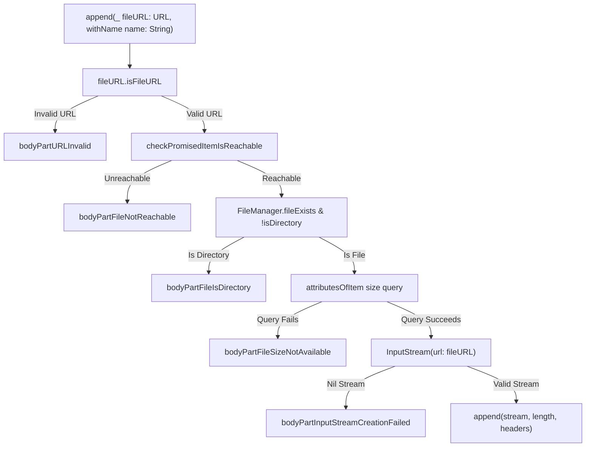
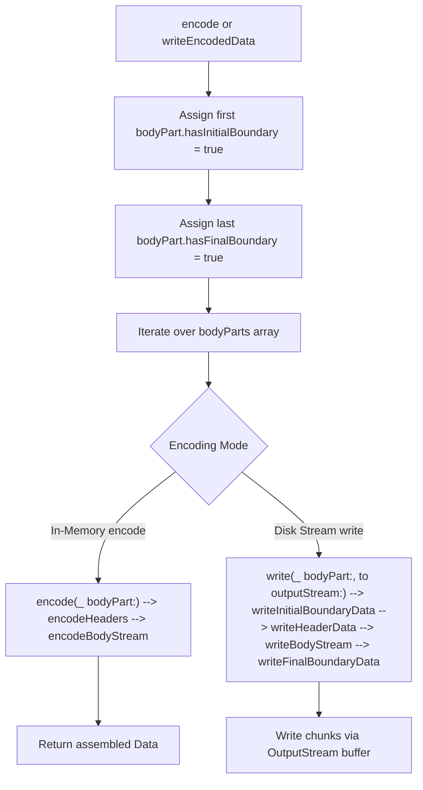

# Multipart Form Data

<details>
<summary>Relevant source files</summary>

The following files were used as context for generating this wiki page:

- [Source/Features/MultipartFormData.swift](https://github.com/Alamofire/Alamofire/blob/main/Source/Features/MultipartFormData.swift)
- [Source/Core/Session.swift](https://github.com/Alamofire/Alamofire/blob/main/Source/Core/Session.swift)
- [docs/docsets/Alamofire.docset/Contents/Resources/Documents/Classes/MultipartFormData.html](https://github.com/Alamofire/Alamofire/blob/main/docs/docsets/Alamofire.docset/Contents/Resources/Documents/Classes/MultipartFormData.html)
- [docs/Classes/MultipartFormData.html](https://github.com/Alamofire/Alamofire/blob/main/docs/Classes/MultipartFormData.html)
</details>

## Overview

### Overview Details

The `MultipartFormData` component in Alamofire constructs standard `multipart/form-data` payloads within HTTP or HTTPS request bodies, adhering to RFC-2388, RFC-2045, and W3C form specifications.

Sources: [Source/Features/MultipartFormData.swift:33-44](https://github.com/Alamofire/Alamofire/blob/main/Source/Features/MultipartFormData.swift#L33-L44)

It provides an expressive API to append individual body parts sourced from in-memory data, local files, or custom input streams, automatically managing content disposition headers and MIME type resolutions via system utilities.

Sources: [Source/Features/MultipartFormData.swift:94-101](https://github.com/Alamofire/Alamofire/blob/main/Source/Features/MultipartFormData.swift#L94-L101), [Source/Features/MultipartFormData.swift:148-308](https://github.com/Alamofire/Alamofire/blob/main/Source/Features/MultipartFormData.swift#L148-L308)

To handle diverse payload scales efficiently, it embodies a dual-strategy design: smaller payloads are encoded directly into contiguous memory for maximum performance, while large datasets such as video content must be streamed or written directly to disk using input and output streams to prevent application memory exhaustion.

Sources: [Source/Features/MultipartFormData.swift:320-369](https://github.com/Alamofire/Alamofire/blob/main/Source/Features/MultipartFormData.swift#L320-L369)

Integrated closely with Alamofire's `Session` and `UploadRequest` dispatch pipeline, `MultipartFormData` supports automatic threshold-based routing where payloads exceeding a specified byte limit are transparently written to disk before upload.

Sources: [Source/Core/Session.swift:939-1029](https://github.com/Alamofire/Alamofire/blob/main/Source/Core/Session.swift#L939-L1029)

## Public API and Initialization

### Initialization and Properties

The `MultipartFormData` class is initialized using a designated constructor that accepts an optional `FileManager` instance (defaulting to `FileManager.default`) and an optional boundary string.

Sources: [Source/Features/MultipartFormData.swift:119-122](https://github.com/Alamofire/Alamofire/blob/main/Source/Features/MultipartFormData.swift#L119-L122)

If no boundary string is supplied, a random boundary is generated automatically via `BoundaryGenerator.randomBoundary()`.

Sources: [Source/Features/MultipartFormData.swift:121](https://github.com/Alamofire/Alamofire/blob/main/Source/Features/MultipartFormData.swift#L121)

The class exposes several key properties: `encodingMemoryThreshold` (a static constant set to `10_000_000` bytes), `contentType` (an open lazy property evaluating to `"multipart/form-data; boundary=\(self.boundary)"`), `contentLength` (a computed property summing the `bodyContentLength` of all appended body parts), and `boundary` (a constant string separating body parts).

Sources: [Source/Features/MultipartFormData.swift:94-105](https://github.com/Alamofire/Alamofire/blob/main/Source/Features/MultipartFormData.swift#L94-L105)

Appending form fields, files, and streams is performed through overloaded `append` methods that construct appropriate `HTTPHeaders` containing `Content-Disposition` and `Content-Type` fields.

Sources: [Source/Features/MultipartFormData.swift:148-154](https://github.com/Alamofire/Alamofire/blob/main/Source/Features/MultipartFormData.swift#L148-L154), [Source/Features/MultipartFormData.swift:305-308](https://github.com/Alamofire/Alamofire/blob/main/Source/Features/MultipartFormData.swift#L305-L308)

When appending raw `Data`, the method creates an `InputStream` from the data and routes it alongside its byte count.

Sources: [Source/Features/MultipartFormData.swift:148-154](https://github.com/Alamofire/Alamofire/blob/main/Source/Features/MultipartFormData.swift#L148-L154)

File URLs undergo rigorous validation checks prior to stream creation and appending.

Sources: [Source/Features/MultipartFormData.swift:198-267](https://github.com/Alamofire/Alamofire/blob/main/Source/Features/MultipartFormData.swift#L198-L267)

### File Validation Call Chain

When a local file URL is appended via `append(_:withName:)`, Alamofire executes a precise validation and inspection sequence before wrapping the file in a body part.

Sources: [Source/Features/MultipartFormData.swift:172-182](https://github.com/Alamofire/Alamofire/blob/main/Source/Features/MultipartFormData.swift#L172-L182)



Sources: [Source/Features/MultipartFormData.swift:172-267](https://github.com/Alamofire/Alamofire/blob/main/Source/Features/MultipartFormData.swift#L172-L267)

### Append Overloads Reference

| Method Signature | Parameters | Purpose & Default Behavior |
| --- | --- | --- |
| `append(_:withName:fileName:mimeType:)` | `Data`, `String`, `String?`, `String?` | Encodes raw in-memory `Data` into a body part with optional filename and MIME type. |
| `append(_:withName:)` | `URL`, `String` | Inspects a file URL, infers its filename and MIME type from path extensions, and validates its reachability and size. |
| `append(_:withName:fileName:mimeType:)` | `URL`, `String`, `String`, `String` | Validates a file URL through 5 sequential checks and appends its file stream and size. |
| `append(_:withLength:name:fileName:mimeType:)` | `InputStream`, `UInt64`, `String`, `String`, `String` | Constructs content headers and appends a custom input stream with a known length. |
| `append(_:withLength:headers:)` | `InputStream`, `UInt64`, `HTTPHeaders` | Appends a custom input stream and length directly paired with explicit `HTTPHeaders`. |

Sources: [Source/Features/MultipartFormData.swift:148-308](https://github.com/Alamofire/Alamofire/blob/main/Source/Features/MultipartFormData.swift#L148-L308)

> [!CAUTION]
> Passing a file URL that points to a directory will immediately trigger the `bodyPartFileIsDirectory` failure reason, halting successful form assembly.

Sources: [Source/Features/MultipartFormData.swift:234-237](https://github.com/Alamofire/Alamofire/blob/main/Source/Features/MultipartFormData.swift#L234-L237)

> [!NOTE]
> File URL reachability checks (`checkPromisedItemIsReachable`) are conditionally compiled out on Linux, Windows, Android, and FreeBSD platforms where promised items are unsupported.

Sources: [Source/Features/MultipartFormData.swift:214-225](https://github.com/Alamofire/Alamofire/blob/main/Source/Features/MultipartFormData.swift#L214-L225)

## Boundary Generation and Formatting

### Boundary Generation Details

The construction of `multipart/form-data` requires precise boundary formatting to separate individual body parts according to standard specifications.

Sources: [Source/Features/MultipartFormData.swift:33-40](https://github.com/Alamofire/Alamofire/blob/main/Source/Features/MultipartFormData.swift#L33-L40)

Alamofire handles this through nested helper types within `MultipartFormData`: `EncodingCharacters`, which defines the Carriage Return Line Feed separator (`\r\n`), and `BoundaryGenerator`, which creates cryptographic-grade random boundary identifiers and formats them for initial, encapsulated, or final stream positions.

Sources: [Source/Features/MultipartFormData.swift:48-76](https://github.com/Alamofire/Alamofire/blob/main/Source/Features/MultipartFormData.swift#L48-L76)

### Boundary Generation and Formatting Call Chain

When constructing multipart payloads, Alamofire invokes boundary generation and text formatting routines in a structured execution path.

Sources: [Source/Features/MultipartFormData.swift:57-75](https://github.com/Alamofire/Alamofire/blob/main/Source/Features/MultipartFormData.swift#L57-L75)

```mermaid
graph TD
    A[MultipartFormData.init] -->|boundary nil| B[BoundaryGenerator.randomBoundary]
    B --> C[Generate two UInt32 random values]
    C --> D[Format string: alamofire.boundary.%08x%08x]
    E[encode or write] --> F[BoundaryGenerator.boundaryData]
    F --> G{BoundaryType}
    G -->|initial| H[--boundary\r\n]
    G -->|encapsulated| I[\r\n--boundary\r\n]
    G -->|final| J[\r\n--boundary--\r\n]
    H --> K["Data(utf8)"]
    I --> K
    J --> K
```

Sources: [Source/Features/MultipartFormData.swift:57-75](https://github.com/Alamofire/Alamofire/blob/main/Source/Features/MultipartFormData.swift#L57-L75), [Source/Features/MultipartFormData.swift:119-121](https://github.com/Alamofire/Alamofire/blob/main/Source/Features/MultipartFormData.swift#L119-L121)

### Boundary Types Reference

| Boundary Type Case | Generated Text Pattern | Description & Usage |
| --- | --- | --- |
| `.initial` | `--\(boundary)\r\n` | Prepended to the very first body part in the multipart form data. |
| `.encapsulated` | `\r\n--\(boundary)\r\n` | Inserted between all subsequent body parts following the first part. |
| `.final` | `\r\n--\(boundary)--\r\n` | Appended immediately following the final body part to terminate the multipart stream. |

Sources: [Source/Features/MultipartFormData.swift:53-75](https://github.com/Alamofire/Alamofire/blob/main/Source/Features/MultipartFormData.swift#L53-L75)

> [!NOTE]
> The `contentType` property dynamically computes its value using the active instance boundary string via the template `"multipart/form-data; boundary=\(self.boundary)"`.

Sources: [Source/Features/MultipartFormData.swift:98](https://github.com/Alamofire/Alamofire/blob/main/Source/Features/MultipartFormData.swift#L98)

## Payload Stream Encoding and Assembly

### Stream Encoding Assembly Details

Once body parts are appended to `MultipartFormData`, they must be assembled and encoded into either a contiguous in-memory `Data` structure or streamed directly to disk.

Sources: [Source/Features/MultipartFormData.swift:320-369](https://github.com/Alamofire/Alamofire/blob/main/Source/Features/MultipartFormData.swift#L320-L369)

Alamofire handles this via two primary paths: `encode()` for small payloads and `writeEncodedData(to:)` for streaming large datasets like video or multi-gigabyte files.

Sources: [Source/Features/MultipartFormData.swift:320-369](https://github.com/Alamofire/Alamofire/blob/main/Source/Features/MultipartFormData.swift#L320-L369)

### Encoding and Assembly Call Chain

The execution pipeline processes each body part sequentially, managing boundaries, header serialization, and stream reading or output stream writing.

Sources: [Source/Features/MultipartFormData.swift:325-368](https://github.com/Alamofire/Alamofire/blob/main/Source/Features/MultipartFormData.swift#L325-L368)



Sources: [Source/Features/MultipartFormData.swift:325-368](https://github.com/Alamofire/Alamofire/blob/main/Source/Features/MultipartFormData.swift#L325-L368), [Source/Features/MultipartFormData.swift:373-438](https://github.com/Alamofire/Alamofire/blob/main/Source/Features/MultipartFormData.swift#L373-L438)

### In-Memory vs. Stream-Based Encoding Mechanics

The encoding mechanism varies depending on whether memory conservation is required.

Sources: [Source/Features/MultipartFormData.swift:320-369](https://github.com/Alamofire/Alamofire/blob/main/Source/Features/MultipartFormData.swift#L320-L369)

The in-memory `encode()` method validates any existing `bodyPartError`, sets boundary flags on the first and last elements, and calls `encode(_:)` on each part to accumulate a contiguous `Data` instance.

Sources: [Source/Features/MultipartFormData.swift:320-336](https://github.com/Alamofire/Alamofire/blob/main/Source/Features/MultipartFormData.swift#L320-L336)

Conversely, `writeEncodedData(to:)` checks file validity, instantiates an `OutputStream`, opens it with a deferred close, and streams chunks using a fixed `streamBufferSize` of 1024 bytes.

Sources: [Source/Features/MultipartFormData.swift:129-130](https://github.com/Alamofire/Alamofire/blob/main/Source/Features/MultipartFormData.swift#L129-L130), [Source/Features/MultipartFormData.swift:345-369](https://github.com/Alamofire/Alamofire/blob/main/Source/Features/MultipartFormData.swift#L345-L369)

```swift
let multipartData = MultipartFormData()
multipartData.append("Hello Alamofire".data(using: .utf8)!, withName: "greeting")

do {
    // In-memory encoding for small payloads
    let encodedData = try multipartData.encode()
    
    // Stream-based disk writing for large payloads
    let fileURL = FileManager.default.temporaryDirectory.appendingPathComponent("upload.multipart")
    try multipartData.writeEncodedData(to: fileURL)
} catch {
    print("Multipart encoding failed: \(error)")
}
```

Sources: [Source/Features/MultipartFormData.swift:320-369](https://github.com/Alamofire/Alamofire/blob/main/Source/Features/MultipartFormData.swift#L320-L369)

### Design Trade-offs

| Design Choice | Benefit | Cost |
| --- | --- | --- |
| In-memory `encode()` | Simple implementation, fast synchronous return for small request payloads. | High memory footprint; risks out-of-memory crashes on large payloads. |
| Stream-based `writeEncodedData(to:)` | Highly memory-efficient; safely handles gigabyte-sized files and streams. | Requires disk I/O and temporary file management. |
| Fixed 1024-byte stream buffer | Optimal read/write performance alignment with Foundation stream guidelines. | Increased iteration count for very large datasets compared to larger custom buffers. |

Sources: [Source/Features/MultipartFormData.swift:33-37](https://github.com/Alamofire/Alamofire/blob/main/Source/Features/MultipartFormData.swift#L33-L37), [Source/Features/MultipartFormData.swift:125-130](https://github.com/Alamofire/Alamofire/blob/main/Source/Features/MultipartFormData.swift#L125-L130), [Source/Features/MultipartFormData.swift:312-369](https://github.com/Alamofire/Alamofire/blob/main/Source/Features/MultipartFormData.swift#L312-L369)

> [!CAUTION]
> Attempting to call `writeEncodedData(to:)` when the target file URL already exists will throw an `outputStreamFileAlreadyExists` error.

Sources: [Source/Features/MultipartFormData.swift:350-355](https://github.com/Alamofire/Alamofire/blob/main/Source/Features/MultipartFormData.swift#L350-L355)

> [!WARNING]
> During `encodeBodyStream(for:)`, Alamofire strictly verifies that the number of bytes read from the stream matches `bodyContentLength`. Mismatches throw an `UnexpectedInputStreamLength` error, preventing corrupted multipart boundaries.

Sources: [Source/Features/MultipartFormData.swift:422-427](https://github.com/Alamofire/Alamofire/blob/main/Source/Features/MultipartFormData.swift#L422-L427)

## Session Integration and Upload Dispatch

### Dispatch Architecture

Alamofire's `Session` coordinates how multipart form data payloads are prepared, dispatched, and transferred across the network.

Sources: [Source/Core/Session.swift:935-949](https://github.com/Alamofire/Alamofire/blob/main/Source/Core/Session.swift#L935-L949)

Depending on the size of the payload relative to a specified memory threshold, the session automatically branches between in-memory encoding and stream-backed disk handling to prevent out-of-memory terminations on resource-constrained platforms.

Sources: [Source/Core/Session.swift:945-949](https://github.com/Alamofire/Alamofire/blob/main/Source/Core/Session.swift#L945-L949)

The `Session` class exposes several `upload` method overloads specifically for `MultipartFormData`.

Sources: [Source/Core/Session.swift:966-1121](https://github.com/Alamofire/Alamofire/blob/main/Source/Core/Session.swift#L966-L1121)

These accept either a building closure `(MultipartFormData) -> Void`, a prebuilt `MultipartFormData` instance, or an explicit `encodingMemoryThreshold` byte limit (defaulting to `MultipartFormData.encodingMemoryThreshold`).

Sources: [Source/Core/Session.swift:966-1121](https://github.com/Alamofire/Alamofire/blob/main/Source/Core/Session.swift#L966-L1121)

```swift
AF.upload(
    multipartFormData: { multipartFormData in
        multipartFormData.append("value".data(using: .utf8)!, withName: "field")
    },
    to: "https://httpbin.org/post",
    usingThreshold: 10_240_000
)
.uploadProgress { progress in
    print("Upload Progress: \(progress.fractionCompleted)")
}
.responseDecodable(of: UploadResponse.self) { response in
    debugPrint(response)
}
```

Sources: [Source/Core/Session.swift:966-987](https://github.com/Alamofire/Alamofire/blob/main/Source/Core/Session.swift#L966-L987)

When an upload request is created, it follows a specific sequence of internal calls through the session queues: `upload(multipartFormData:to:usingThreshold:...)` → `MultipartUpload` initialization → `performUploadRequest(_:)` → `performSetupOperations(for:convertible:shouldCreateTask:)` → `upload.createUploadable()` → `didCreateURLRequest(_:for:)` → `request.task(for:using:)`.

Sources: [Source/Core/Session.swift:1076-1078](https://github.com/Alamofire/Alamofire/blob/main/Source/Core/Session.swift#L1076-L1078), [Source/Core/Session.swift:1220-1233](https://github.com/Alamofire/Alamofire/blob/main/Source/Core/Session.swift#L1220-L1233), [Source/Core/Session.swift:1291-1301](https://github.com/Alamofire/Alamofire/blob/main/Source/Core/Session.swift#L1291-L1301)

During `performUploadRequest(_:)`, the session ensures work runs on the `requestQueue` before evaluating request adaptation and invoking `createUploadable()` to handle the transition between memory-backed and disk-backed upload data.

Sources: [Source/Core/Session.swift:1220-1233](https://github.com/Alamofire/Alamofire/blob/main/Source/Core/Session.swift#L1220-L1233)

> [!NOTE]
> If `createUploadable()` fails during `performUploadRequest(_:)` — for instance, if writing to disk encounters a storage error — the session catches the error, dispatches `.createUploadableFailed(error:)` to the root queue, and terminates setup without creating a network task.

Sources: [Source/Core/Session.swift:1224-1232](https://github.com/Alamofire/Alamofire/blob/main/Source/Core/Session.swift#L1224-L1232)

## Usage Specifications and Class Reference

### Reference Specifications

The `MultipartFormData` class constructs `multipart/form-data` payloads for HTTP and HTTPS body transmission according to RFC-2388, RFC-2045, and W3C specifications.

Sources: [docs/Classes/MultipartFormData.html:581-594](https://github.com/Alamofire/Alamofire/blob/main/docs/Classes/MultipartFormData.html#L581-L594)

`MultipartFormData` exposes properties and static constants to configure boundary segmentation, inspect total content length, and manage header definitions.

Sources: [docs/Classes/MultipartFormData.html:615-719](https://github.com/Alamofire/Alamofire/blob/main/docs/Classes/MultipartFormData.html#L615-L719)

| Property / Constant | Type | Modifier | Description |
| :--- | :--- | :--- | :--- |
| `encodingMemoryThreshold` | `UInt64` | `public static let` | Default memory threshold used when encoding `MultipartFormData`, in bytes. |
| `contentType` | `String` | `open lazy var` | The `Content-Type` header value containing the boundary used to generate the multipart form data. |
| `contentLength` | `UInt64` | `public var` (get) | The content length of all body parts used to generate the form data, excluding boundaries. |
| `boundary` | `String` | `public let` | The boundary string used to separate body parts in the encoded form data. |

Sources: [docs/Classes/MultipartFormData.html:615-719](https://github.com/Alamofire/Alamofire/blob/main/docs/Classes/MultipartFormData.html#L615-L719)

Instances are initialized via `init(fileManager:boundary:)`, accepting an optional `FileManager` (defaulting to `.default`) and an optional custom boundary string.

Sources: [docs/Classes/MultipartFormData.html:752-755](https://github.com/Alamofire/Alamofire/blob/main/docs/Classes/MultipartFormData.html#L752-L755)

The class provides multiple `append` overloads for different data sources: `append(_:withName:fileName:mimeType:)` for `Data` values, `append(_:withName:)` and `append(_:withName:fileName:mimeType:)` for file `URL` references, and `append(_:withLength:name:fileName:mimeType:)` and `append(_:withLength:headers:)` for `InputStream` objects.

Sources: [docs/Classes/MultipartFormData.html:832-835](https://github.com/Alamofire/Alamofire/blob/main/docs/Classes/MultipartFormData.html#L832-L835), [docs/Classes/MultipartFormData.html:927-930](https://github.com/Alamofire/Alamofire/blob/main/docs/Classes/MultipartFormData.html#L927-L930), [docs/Classes/MultipartFormData.html:994-997](https://github.com/Alamofire/Alamofire/blob/main/docs/Classes/MultipartFormData.html#L994-L997), [docs/Classes/MultipartFormData.html:1086-1090](https://github.com/Alamofire/Alamofire/blob/main/docs/Classes/MultipartFormData.html#L1086-L1090), [docs/Classes/MultipartFormData.html:1191-1193](https://github.com/Alamofire/Alamofire/blob/main/docs/Classes/MultipartFormData.html#L1191-L1193)

Once body parts are appended, form data can be serialized through two primary methods: `encode()` to encode all appended body parts into a single `Data` value in memory, and `writeEncodedData(to:)` to write all appended body parts directly to a file `URL` using input and output streams for memory efficiency.

Sources: [docs/Classes/MultipartFormData.html:1285-1287](https://github.com/Alamofire/Alamofire/blob/main/docs/Classes/MultipartFormData.html#L1285-L1287), [docs/Classes/MultipartFormData.html:1324-1327](https://github.com/Alamofire/Alamofire/blob/main/docs/Classes/MultipartFormData.html#L1324-L1327)

> [!WARNING]
> The `encode()` method loads all appended body parts into memory simultaneously and should only be used for small datasets.

Sources: [docs/Classes/MultipartFormData.html:1270-1272](https://github.com/Alamofire/Alamofire/blob/main/docs/Classes/MultipartFormData.html#L1270-L1272)

For large datasets, developers must use `writeEncodedData(to:)` or session-managed uploads.

Sources: [docs/Classes/MultipartFormData.html:1272-1274](https://github.com/Alamofire/Alamofire/blob/main/docs/Classes/MultipartFormData.html#L1272-L1274)

## Related

- [[Session And Requests]]

