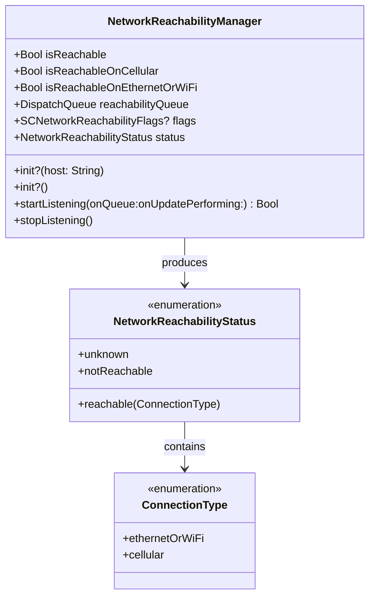
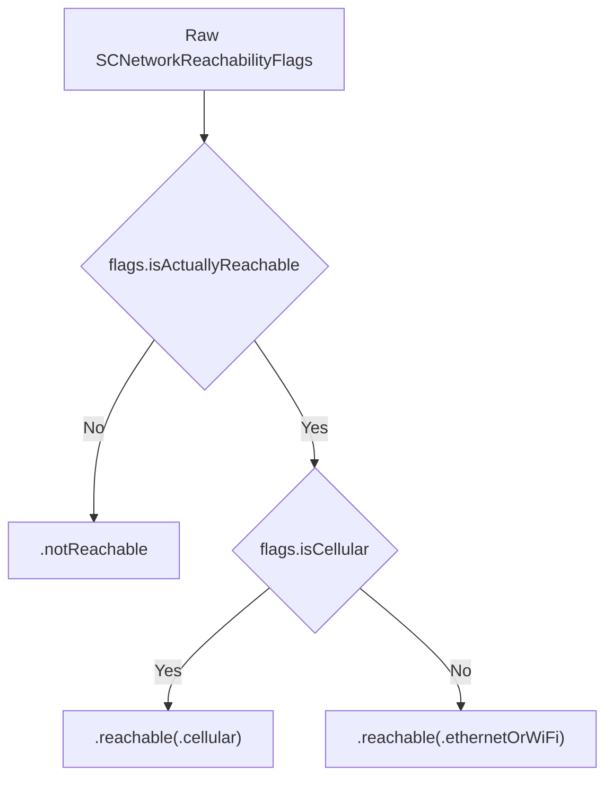
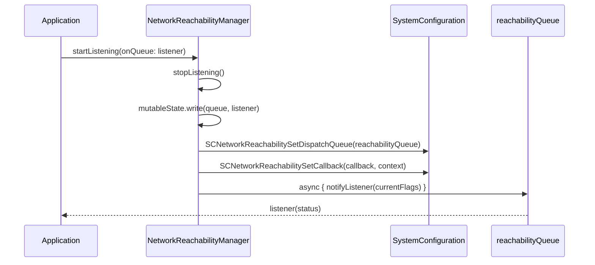

# Network Reachability

<details>
<summary>Relevant source files</summary>

The following files were used as context for generating this wiki page:

- [Source/Features/NetworkReachabilityManager.swift](https://github.com/Alamofire/Alamofire/blob/main/Source/Features/NetworkReachabilityManager.swift)
- [docs/Classes/NetworkReachabilityManager.html](https://github.com/Alamofire/Alamofire/blob/main/docs/Classes/NetworkReachabilityManager.html)
- [docs/docsets/Alamofire.docset/Contents/Resources/Documents/Classes/NetworkReachabilityManager.html](https://github.com/Alamofire/Alamofire/blob/main/docs/docsets/Alamofire.docset/Contents/Resources/Documents/Classes/NetworkReachabilityManager.html)
- [Tests/NetworkReachabilityManagerTests.swift](https://github.com/Alamofire/Alamofire/blob/main/Tests/NetworkReachabilityManagerTests.swift)
- [docs/Classes/NetworkReachabilityManager/NetworkReachabilityStatus.html](https://github.com/Alamofire/Alamofire/blob/main/docs/Classes/NetworkReachabilityManager/NetworkReachabilityStatus.html)
- [docs/docsets/Alamofire.docset/Contents/Resources/Documents/Classes/NetworkReachabilityManager/NetworkReachabilityStatus.html](https://github.com/Alamofire/Alamofire/blob/main/docs/docsets/Alamofire.docset/Contents/Resources/Documents/Classes/NetworkReachabilityManager/NetworkReachabilityStatus.html)
</details>

## Overview

### Introduction

The `NetworkReachabilityManager` subsystem provides host and address reachability observation capabilities for cellular and WiFi network interfaces on platforms supporting the `SystemConfiguration` framework. Designed as an open, thread-safe class conforming to `@unchecked Sendable`, it wraps low-level C-based SystemConfiguration APIs into modern Swift idioms, exposing reachability status changes through asynchronous closures dispatched on custom or main queues.

Sources: [Source/Features/NetworkReachabilityManager.swift:25-41](https://github.com/Alamofire/Alamofire/blob/main/Source/Features/NetworkReachabilityManager.swift#L25-L41)

> [!CAUTION]
> As of macOS 14.4, iOS 17.4, watchOS 9.4, tvOS 17.4, and visionOS 1.4, `NetworkReachabilityManager` is deprecated in favor of `NWPathMonitor`.

Sources: [Source/Features/NetworkReachabilityManager.swift:36-40](https://github.com/Alamofire/Alamofire/blob/main/Source/Features/NetworkReachabilityManager.swift#L36-L40)

The subsystem solves the problem of detecting underlying connectivity shifts, enabling applications to provide background context when network operations fail or to automatically trigger retries when connection availability is restored. Architecturally, it relies on an internal serial `DispatchQueue` (`org.alamofire.reachabilityQueue`) to serialize state modifications and notifications, paired with thread-safe protected mutable state storage.

Sources: [Source/Features/NetworkReachabilityManager.swift:33-35](https://github.com/Alamofire/Alamofire/blob/main/Source/Features/NetworkReachabilityManager.swift#L33-L35), [Source/Features/NetworkReachabilityManager.swift:93-94](https://github.com/Alamofire/Alamofire/blob/main/Source/Features/NetworkReachabilityManager.swift#L93-L94), [Source/Features/NetworkReachabilityManager.swift:121-121](https://github.com/Alamofire/Alamofire/blob/main/Source/Features/NetworkReachabilityManager.swift#L121-L121)

## Public Interface and Properties

### API Overview

The `NetworkReachabilityManager` class exposes a set of computed properties and factory initializers to inspect connectivity state across cellular, Ethernet, and WiFi interfaces.

Sources: [Source/Features/NetworkReachabilityManager.swift:74-105](https://github.com/Alamofire/Alamofire/blob/main/Source/Features/NetworkReachabilityManager.swift#L74-L105)



Sources: [Source/Features/NetworkReachabilityManager.swift:41-68](https://github.com/Alamofire/Alamofire/blob/main/Source/Features/NetworkReachabilityManager.swift#L41-L68), [Source/Features/NetworkReachabilityManager.swift:74-105](https://github.com/Alamofire/Alamofire/blob/main/Source/Features/NetworkReachabilityManager.swift#L74-L105)

### Core Properties

| Property | Type | Description |
| :--- | :--- | :--- |
| `default` | `NetworkReachabilityManager?` | Shared instance monitoring the zero address with a `.main` listener queue. |
| `isReachable` | `Bool` | Evaluates whether the network is reachable on cellular or Ethernet/WiFi. |
| `isReachableOnCellular` | `Bool` | Evaluates whether the connection type is `.cellular`. |
| `isReachableOnEthernetOrWiFi` | `Bool` | Evaluates whether the connection type is `.ethernetOrWiFi`. |
| `reachabilityQueue` | `DispatchQueue` | Dedicated serial queue (`org.alamofire.reachabilityManager`) handling updates. |
| `flags` | `SCNetworkReachabilityFlags?` | Retrieves live flags from the underlying `SCNetworkReachability` instance. |
| `status` | `NetworkReachabilityStatus` | Computes the current reachability status from active flags. |

Sources: [Source/Features/NetworkReachabilityManager.swift:74-105](https://github.com/Alamofire/Alamofire/blob/main/Source/Features/NetworkReachabilityManager.swift#L74-L105)

## Initialization and Target Configuration

### Scope Setup

`NetworkReachabilityManager` provides two convenience initializers to target specific routing scopes via SystemConfiguration:

1. **Host-Based Initialization (`init?(host:)`):** Creates an instance using `SCNetworkReachabilityCreateWithName`. The host string must strictly exclude URL schemes (e.g., `https://`).
2. **Address-Based Initialization (`init?()`):** Creates an instance monitoring the zero address (`0.0.0.0`), configured with `sockaddr` family `AF_INET`. This special token instructs SystemConfiguration to monitor the general routing status of the device across both IPv4 and IPv6.

Sources: [Source/Features/NetworkReachabilityManager.swift:131-150](https://github.com/Alamofire/Alamofire/blob/main/Source/Features/NetworkReachabilityManager.swift#L131-L150)

### Initialization Usage

```swift
// Example: Initializing and checking host reachability
if let manager = NetworkReachabilityManager(host: "store.apple.com") {
    print("Host manager initialized. Reachable: \(manager.isReachable)")
}

// Example: Initializing the zero-address router
let defaultManager = NetworkReachabilityManager.default
```

Sources: [Source/Features/NetworkReachabilityManager.swift:131-150](https://github.com/Alamofire/Alamofire/blob/main/Source/Features/NetworkReachabilityManager.swift#L131-L150), [Tests/NetworkReachabilityManagerTests.swift:40-54](https://github.com/Alamofire/Alamofire/blob/main/Tests/NetworkReachabilityManagerTests.swift#L40-L54)

## Status Evaluation and Flag Interpretation

### Status Mapping

The internal `NetworkReachabilityStatus` structure categorizes raw `SCNetworkReachabilityFlags` into discrete connectivity states.

Sources: [Source/Features/NetworkReachabilityManager.swift:43-68](https://github.com/Alamofire/Alamofire/blob/main/Source/Features/NetworkReachabilityManager.swift#L43-L68)



Sources: [Source/Features/NetworkReachabilityManager.swift:51-59](https://github.com/Alamofire/Alamofire/blob/main/Source/Features/NetworkReachabilityManager.swift#L51-L59)

### Flag Invariants

The conversion logic relies on extension properties defined on `SCNetworkReachabilityFlags`:

- `isReachable`: Evaluates whether `.reachable` is contained within the flags.
- `isConnectionRequired`: Evaluates whether `.connectionRequired` is present.
- `canConnectAutomatically`: Evaluates whether `.connectionOnDemand` or `.connectionOnTraffic` is set.
- `canConnectWithoutUserInteraction`: Requires `canConnectAutomatically` to be true while `.interventionRequired` is absent.
- `isActuallyReachable`: Defined as `isReachable && (!isConnectionRequired || canConnectWithoutUserInteraction)`.

Sources: [Source/Features/NetworkReachabilityManager.swift:266-271](https://github.com/Alamofire/Alamofire/blob/main/Source/Features/NetworkReachabilityManager.swift#L266-L271)

> [!NOTE]
> If `isActuallyReachable` evaluates to `false`, `NetworkReachabilityStatus` resolves to `.notReachable`, regardless of whether `.reachable` is present.

Sources: [Source/Features/NetworkReachabilityManager.swift:51-53](https://github.com/Alamofire/Alamofire/blob/main/Source/Features/NetworkReachabilityManager.swift#L51-L53)

## Call-Chain Execution Walkthrough: Starting and Dispatched Listening

### Execution Sequence

When an application begins observing reachability via `startListening(onQueue:onUpdatePerforming:)`, execution follows a deterministic control path:

1. **Teardown Existing State:** `stopListening()` is invoked to clear existing callbacks, dispatches, and cached previous status.
2. **State Storage Write:** The provided `DispatchQueue` and `Listener` closure are stored within `mutableState` using a thread-safe wrapper.
3. **Context Wrapping:** A `WeakManager` instance wrapping `self` is created and passed unmanaged into an `SCNetworkReachabilityContext` structure to prevent strong retain cycles between the C callback mechanism and the Swift manager.
4. **Queue and Callback Registration:** `SCNetworkReachabilitySetDispatchQueue` binds notifications to `reachabilityQueue`, and `SCNetworkReachabilitySetCallback` assigns the static C callback closure.
5. **Initial State Dispatch:** If `flags` are immediately available, an asynchronous block is dispatched onto `reachabilityQueue` to invoke `self.notifyListener(currentFlags)`, ensuring the listener receives the initial state.

Sources: [Source/Features/NetworkReachabilityManager.swift:172-222](https://github.com/Alamofire/Alamofire/blob/main/Source/Features/NetworkReachabilityManager.swift#L172-L222)



Sources: [Source/Features/NetworkReachabilityManager.swift:172-222](https://github.com/Alamofire/Alamofire/blob/main/Source/Features/NetworkReachabilityManager.swift#L172-L222)

## Listener Notification and Thread Safety

### Notification Handling

Incoming flag updates from SystemConfiguration trigger the C callback, which extracts the `WeakManager` from the opaque context info pointer and invokes `manager?.notifyListener(flags)`. 

Sources: [Source/Features/NetworkReachabilityManager.swift:204-209](https://github.com/Alamofire/Alamofire/blob/main/Source/Features/NetworkReachabilityManager.swift#L204-L209)

Inside `notifyListener(_:)`:
1. `let newStatus = NetworkReachabilityStatus(flags)` computes the new state.
2. `mutableState.write` acquires protection to evaluate change filtering:
   ```swift
   guard state.previousStatus != newStatus else { return }
   state.previousStatus = newStatus
   let listener = state.listener
   state.listenerQueue?.async { listener?(newStatus) }
   ```
3. If the status has changed, `previousStatus` is updated, and the listener closure is dispatched asynchronously onto the user-configured `listenerQueue`.

Sources: [Source/Features/NetworkReachabilityManager.swift:242-253](https://github.com/Alamofire/Alamofire/blob/main/Source/Features/NetworkReachabilityManager.swift#L242-L253)

## Design Trade-Offs

### Architectural Choices

| Design Choice | Benefit | Cost |
| :--- | :--- | :--- |
| **C-Based SystemConfiguration APIs** | Direct access to low-level operating system routing and reachability states. | Platform dependency; requires availability checks (`#if canImport(SystemConfiguration)`) and deprecation warnings in modern OS versions. |
| **`WeakManager` Context Bridge** | Breaks strong retain cycles between C API contexts and Swift class instances. | Requires manual unmanaged retain/release bridging (`Unmanaged.passUnretained`). |
| **Dedicated Serial Reachability Queue** | Serializes flag evaluation and callback delivery, preventing concurrent state corruption. | Introduces minor scheduling overhead for status checks. |

Sources: [Source/Features/NetworkReachabilityManager.swift:25-41](https://github.com/Alamofire/Alamofire/blob/main/Source/Features/NetworkReachabilityManager.swift#L25-L41), [Source/Features/NetworkReachabilityManager.swift:93-94](https://github.com/Alamofire/Alamofire/blob/main/Source/Features/NetworkReachabilityManager.swift#L93-L94), [Source/Features/NetworkReachabilityManager.swift:181-209](https://github.com/Alamofire/Alamofire/blob/main/Source/Features/NetworkReachabilityManager.swift#L181-L209)

## Complete Usage Example

### Implementation Code

The following runnable example demonstrates how to initialize a `NetworkReachabilityManager` for a specific host, start listening for connectivity changes, and handle status updates on a designated queue.

Sources: [Source/Features/NetworkReachabilityManager.swift:131-135](https://github.com/Alamofire/Alamofire/blob/main/Source/Features/NetworkReachabilityManager.swift#L131-L135), [Source/Features/NetworkReachabilityManager.swift:172-222](https://github.com/Alamofire/Alamofire/blob/main/Source/Features/NetworkReachabilityManager.swift#L172-L222)

```swift
import Foundation
import Alamofire

final class NetworkMonitorService {
    private let reachabilityManager = NetworkReachabilityManager(host: "api.example.com")

    func startMonitoring() {
        guard let manager = reachabilityManager else {
            print("Failed to create NetworkReachabilityManager.")
            return
        }

        manager.startListening(onQueue: .main) { status in
            switch status {
            case .unknown:
                print("Network reachability is unknown.")
            case .notReachable:
                print("Network is not reachable.")
            case .reachable(let connectionType):
                switch connectionType {
                case .cellular:
                    print("Network reachable via Cellular.")
                case .ethernetOrWiFi:
                    print("Network reachable via Ethernet or WiFi.")
                }
            }
        }
    }

    func stopMonitoring() {
        reachabilityManager?.stopListening()
    }
}
```

Sources: [Source/Features/NetworkReachabilityManager.swift:131-135](https://github.com/Alamofire/Alamofire/blob/main/Source/Features/NetworkReachabilityManager.swift#L131-L135), [Source/Features/NetworkReachabilityManager.swift:172-222](https://github.com/Alamofire/Alamofire/blob/main/Source/Features/NetworkReachabilityManager.swift#L172-L222), [Source/Features/NetworkReachabilityManager.swift:224-233](https://github.com/Alamofire/Alamofire/blob/main/Source/Features/NetworkReachabilityManager.swift#L224-L233)

## Related

- [[Retry Policies]]

