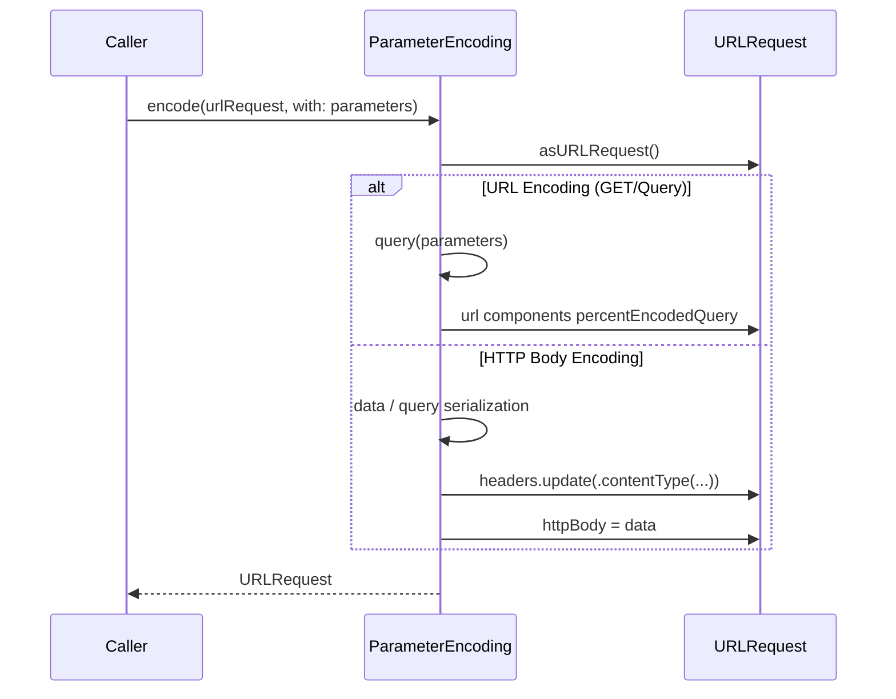

# Parameter Encoding

<details>
<summary>Relevant source files</summary>

The following files were used as context for generating this wiki page:

- [Source/Core/ParameterEncoder.swift](https://github.com/Alamofire/Alamofire/blob/main/Source/Core/ParameterEncoder.swift)
- [Source/Core/ParameterEncoding.swift](https://github.com/Alamofire/Alamofire/blob/main/Source/Core/ParameterEncoding.swift)
- [Tests/ParameterEncodingTests.swift](https://github.com/Alamofire/Alamofire/blob/main/Tests/ParameterEncodingTests.swift)
- [Tests/ParameterEncoderTests.swift](https://github.com/Alamofire/Alamofire/blob/main/Tests/ParameterEncoderTests.swift)
- [docs/docsets/Alamofire.docset/Contents/Resources/Documents/Protocols/ParameterEncoder.html](https://github.com/Alamofire/Alamofire/blob/main/docs/docsets/Alamofire.docset/Contents/Resources/Documents/Protocols/ParameterEncoder.html)
- [docs/docsets/Alamofire.docset/Contents/Resources/Documents/Protocols/ParameterEncoding.html](https://github.com/Alamofire/Alamofire/blob/main/docs/docsets/Alamofire.docset/Contents/Resources/Documents/Protocols/ParameterEncoding.html)
- [docs/Protocols/ParameterEncoder.html](https://github.com/Alamofire/Alamofire/blob/main/docs/Protocols/ParameterEncoder.html)
</details>

## Overview

Parameter encoding handles the serialization and mapping of request parameters into `URLRequest` instances, bridging high-level data models and low-level networking primitives. Alamofire provides robust abstraction layers through both modern type-safe `Encodable` encoders and flexible dictionary-based encoding protocols, supporting diverse data formats such as JSON payloads and URL-encoded form data. These mechanisms handle critical details such as percent-escaping rules, content-type header injection, collection formatting, and deterministic key sorting to ensure consistent network requests. Sources: [Source/Core/ParameterEncoder.swift:27-39](https://github.com/Alamofire/Alamofire/blob/main/Source/Core/ParameterEncoder.swift#L27-L39), [Source/Core/ParameterEncoding.swift:30-41](https://github.com/Alamofire/Alamofire/blob/main/Source/Core/ParameterEncoding.swift#L30-L41)

## ParameterEncoding Protocol and Legacy Encoding

### Overview

The `ParameterEncoding` protocol defines the contract for serializing dictionary-based parameters and applying them to a `URLRequest`. Conforming implementations transform parameters into either query components appended to the request URL or serialized data blocks assigned directly to the HTTP body. Alamofire supplies two primary legacy dictionary-based encoders: `URLEncoding` and `JSONEncoding`. Sources: [Source/Core/ParameterEncoding.swift:30-41](https://github.com/Alamofire/Alamofire/blob/main/Source/Core/ParameterEncoding.swift#L30-L41), [Source/Core/ParameterEncoding.swift:59-240](https://github.com/Alamofire/Alamofire/blob/main/Source/Core/ParameterEncoding.swift#L59-L240)



Sources: [Source/Core/ParameterEncoding.swift:163-187](https://github.com/Alamofire/Alamofire/blob/main/Source/Core/ParameterEncoding.swift#L163-L187), [Source/Core/ParameterEncoding.swift:275-297](https://github.com/Alamofire/Alamofire/blob/main/Source/Core/ParameterEncoding.swift#L275-L297)

### Protocol Definition and Parameters Typealias

The foundational `Parameters` typealias models dynamic request payloads as a dictionary mapping string keys to arbitrary `Sendable` values. The `ParameterEncoding` protocol requires types to implement a single throwing function, `encode(_:with:)`, which accepts any `URLRequestConvertible` instance and an optional `Parameters` dictionary, returning a fully configured `URLRequest`.

```swift
public typealias Parameters = [String: any Any & Sendable]

public protocol ParameterEncoding: Sendable {
    func encode(_ urlRequest: any URLRequestConvertible, with parameters: Parameters?) throws -> URLRequest
}
```

Sources: [Source/Core/ParameterEncoding.swift:27-41](https://github.com/Alamofire/Alamofire/blob/main/Source/Core/ParameterEncoding.swift#L27-L41)

### URLEncoding Mechanics and Options

`URLEncoding` creates URL-encoded query strings from parameter dictionaries. Depending on its configured destination, the encoded query string is appended to the existing URL query or assigned to the request's HTTP body. When parameters are placed in the HTTP body, the `Content-Type` header is automatically updated to `application/x-www-form-urlencoded; charset=utf-8`.

> [!NOTE]
> Key-value pairs are sorted alphabetically by key before building the query string to guarantee deterministic request representations and stable caching keys.

Sources: [Source/Core/ParameterEncoding.swift:45-58](https://github.com/Alamofire/Alamofire/blob/main/Source/Core/ParameterEncoding.swift#L45-L58), [Source/Core/ParameterEncoding.swift:230-238](https://github.com/Alamofire/Alamofire/blob/main/Source/Core/ParameterEncoding.swift#L230-L238)

The encoder's helper options govern collection formatting and boolean representation:

| Helper Type | Cases / Options | Default Value | Purpose |
| :--- | :--- | :--- | :--- |
| `Destination` | `.methodDependent`, `.queryString`, `.httpBody` | `.methodDependent` | Determines whether parameters go into the URL query or HTTP body based on HTTP method or explicit setting. |
| `ArrayEncoding` | `.brackets`, `.noBrackets`, `.indexInBrackets`, `.custom` | `.brackets` | Controls how array indices and keys are formatted (e.g. `foo[]=1` vs `foo[0]=1`). |
| `BoolEncoding` | `.numeric`, `.literal` | `.numeric` | Serializes booleans as `1`/`0` or `true`/`false` string literals. |

Sources: [Source/Core/ParameterEncoding.swift:64-122](https://github.com/Alamofire/Alamofire/blob/main/Source/Core/ParameterEncoding.swift#L64-L122)

### JSONEncoding Mechanics and Error Handling

`JSONEncoding` utilizes Foundation's `JSONSerialization` to transform parameter dictionaries or arbitrary JSON-compatible objects into JSON data payloads. If `JSONSerialization.isValidJSONObject` validation fails, the encoder throws an `AFError.parameterEncoderFailed` wrapping a `JSONEncoding.Error.invalidJSONObject` failure reason.

> [!CAUTION]
> Passing non-Objective-C-representable types inside your parameters dictionary triggers `JSONEncoding.Error.invalidJSONObject`, causing request generation to fail immediately before dispatch.

Sources: [Source/Core/ParameterEncoding.swift:243-252](https://github.com/Alamofire/Alamofire/blob/main/Source/Core/ParameterEncoding.swift#L243-L252), [Source/Core/ParameterEncoding.swift:280-282](https://github.com/Alamofire/Alamofire/blob/main/Source/Core/ParameterEncoding.swift#L280-L282)

When writing JSON payloads, `JSONEncoding` updates the request `Content-Type` header to `application/json` (if absent) and assigns the serialized `Data` to `urlRequest.httpBody`.

```swift
public struct JSONEncoding: ParameterEncoding {
    public enum Error: Swift.Error {
        case invalidJSONObject
    }

    public let options: JSONSerialization.WritingOptions

    public init(options: JSONSerialization.WritingOptions = []) {
        self.options = options
    }

    public func encode(_ urlRequest: any URLRequestConvertible, with parameters: Parameters?) throws -> URLRequest {
        var urlRequest = try urlRequest.asURLRequest()
        guard let parameters else { return urlRequest }
        guard JSONSerialization.isValidJSONObject(parameters) else {
            throw AFError.parameterEncoderFailed(reason: .jsonEncodingFailed(error: Error.invalidJSONObject))
        }
        let data = try JSONSerialization.data(withJSONObject: parameters, options: options)
        if urlRequest.headers["Content-Type"] == nil {
            urlRequest.headers.update(.contentType("application/json"))
        }
        urlRequest.httpBody = data
        return urlRequest
    }
}
```

Sources: [Source/Core/ParameterEncoding.swift:245-296](https://github.com/Alamofire/Alamofire/blob/main/Source/Core/ParameterEncoding.swift#L245-L296)

## ParameterEncoder Protocol for Encodable Types

### Overview

Alamofire provides a type-safe parameter encoding interface through the `ParameterEncoder` protocol, designed specifically for Swift's `Encodable` types. Conforming types serialize model instances directly into a `URLRequest` by implementing the `encode(_:into:)` method, throwing an instance of `AFError.parameterEncoderFailed` with an associated `ParameterEncoderFailureReason` when encoding fails.

Sources: [Source/Core/ParameterEncoder.swift:27-39](https://github.com/Alamofire/Alamofire/blob/main/Source/Core/ParameterEncoder.swift#L27-L39), [docs/Protocols/ParameterEncoder.html:581-607](https://github.com/Alamofire/Alamofire/blob/main/docs/Protocols/ParameterEncoder.html#L581-L607)

### JSONParameterEncoder

`JSONParameterEncoder` serializes any `Encodable` and `Sendable` type into JSON body data using an underlying `JSONEncoder`. If the request lacks a `Content-Type` header, it sets it to `application/json` automatically.

| Static Factory Property / Method | Underlying Configuration | Description |
| :--- | :--- | :--- |
| `JSONParameterEncoder.default` | `JSONEncoder()` | Returns an encoder with default parameters. |
| `JSONParameterEncoder.prettyPrinted` | `JSONEncoder` with `.prettyPrinted` output formatting | Returns an encoder formatted for readability. |
| `JSONParameterEncoder.sortedKeys` | `JSONEncoder` with `.sortedKeys` output formatting | Returns an encoder with sorted keys for deterministic payload output (available on macOS 10.13+, iOS 11.0+, tvOS 11.0+, watchOS 4.0+). |

Sources: [Source/Core/ParameterEncoder.swift:41-63](https://github.com/Alamofire/Alamofire/blob/main/Source/Core/ParameterEncoder.swift#L41-L63), [docs/docsets/Alamofire.docset/Contents/Resources/Documents/Protocols/ParameterEncoder.html:674-751](https://github.com/Alamofire/Alamofire/blob/main/docs/docsets/Alamofire.docset/Contents/Resources/Documents/Protocols/ParameterEncoder.html#L674-L751)

> [!NOTE]
> If the `parameters` argument passed to `encode` is `nil`, `JSONParameterEncoder` immediately returns the unmodified request without attempting serialization.

Sources: [Source/Core/ParameterEncoder.swift:75-77](https://github.com/Alamofire/Alamofire/blob/main/Source/Core/ParameterEncoder.swift#L75-L77)

### URLEncodedFormParameterEncoder

`URLEncodedFormParameterEncoder` encodes types as URL-encoded query strings via `URLEncodedFormEncoder`. Depending on its `Destination` configuration, it attaches the string to the request URL or its HTTP body, setting the `Content-Type` header to `application/x-www-form-urlencoded; charset=utf-8` when placing parameters in the body and no header exists.

| Destination Case | Behavior Description |
| :--- | :--- |
| `.methodDependent` | Appends the encoded query string to any existing query string for `.get`, `.head`, and `.delete` requests; sets it to `httpBody` for all other methods. |
| `.queryString` | Always applies the encoded query string to the `URLRequest` URL. |
| `.httpBody` | Always applies the encoded query string to the `httpBody` of the `URLRequest`. |

Sources: [Source/Core/ParameterEncoder.swift:108-138](https://github.com/Alamofire/Alamofire/blob/main/Source/Core/ParameterEncoder.swift#L108-L138), [docs/docsets/Alamofire.docset/Contents/Resources/Documents/Protocols/ParameterEncoder.html:813-853](https://github.com/Alamofire/Alamofire/blob/main/docs/docsets/Alamofire.docset/Contents/Resources/Documents/Protocols/ParameterEncoder.html#L813-L853)

> [!WARNING]
> When using `URLEncodedFormParameterEncoder`, the request must contain a valid `url` and `method` property; otherwise, it throws a missing required component error wrapped inside `AFError.parameterEncoderFailed`.

Sources: [Source/Core/ParameterEncoder.swift:165-173](https://github.com/Alamofire/Alamofire/blob/main/Source/Core/ParameterEncoder.swift#L165-L173)

### Encoder Extension Shortcuts

The `ParameterEncoder` protocol features convenient static extensions enabling clean syntax when passing encoders directly into request builders.

```swift
let encoder = JSONParameterEncoder.prettyPrinted
let request = try encoder.encode(myModel, into: urlRequest)
```

Sources: [Source/Core/ParameterEncoder.swift:95-106](https://github.com/Alamofire/Alamofire/blob/main/Source/Core/ParameterEncoder.swift#L95-L106), [Source/Core/ParameterEncoder.swift:199-213](https://github.com/Alamofire/Alamofire/blob/main/Source/Core/ParameterEncoder.swift#L199-L213)

## URL and Query String Encoding Flow

### Overview

Query parameter serialization for legacy dictionary structures is coordinated through `URLEncoding`. This mechanism recursively transforms nested dictionaries, arrays, numbers, and boolean types into percent-escaped key-value pairs compliant with RFC 3986. Parameters are ordered alphabetically by their keys using sorted iteration before being joined with ampersands into a final query string or HTTP body.

Sources: [Source/Core/ParameterEncoding.swift:189-238](https://github.com/Alamofire/Alamofire/blob/main/Source/Core/ParameterEncoding.swift#L189-L238)

### Encoding Execution Walkthrough

When `URLEncoding.encode(_:with:)` is invoked on a request with parameters, it executes a specific validation and transformation sequence:

1. `urlRequest.asURLRequest()` — Normalizes the convertible input into a concrete `URLRequest`.
2. `destination.encodesParametersInURL(for: method)` — Evaluates whether the HTTP method and destination combination mandates placing parameters in the URL query string or the HTTP body.
3. `query(parameters)` — Iterates over sorted dictionary keys, invoking `queryComponents(fromKey:value:)` recursively to build component tuples.
4. `components.map { "\($0)=\($1)" }.joined(separator: "&")` — Joins individual key-value pairs with ampersands.
5. Assignment — Either assigns the string to `urlComponents.percentEncodedQuery` (updating `urlRequest.url`) or encodes it as UTF-8 data into `urlRequest.httpBody` alongside setting the `Content-Type` header to `application/x-www-form-urlencoded; charset=utf-8`.

Sources: [Source/Core/ParameterEncoding.swift:163-186](https://github.com/Alamofire/Alamofire/blob/main/Source/Core/ParameterEncoding.swift#L163-L186)

> [!NOTE]
> If a request utilizes URL query parameter encoding and lacks a `url` property entirely, `URLEncoding` throws an `AFError.parameterEncodingFailed(reason: .missingURL)` error.

Sources: [Source/Core/ParameterEncoding.swift:169-171](https://github.com/Alamofire/Alamofire/blob/main/Source/Core/ParameterEncoding.swift#L169-L171)

### Configuration Enums for Collections and Booleans

`URLEncoding` provides nested enumeration types to control how arrays and booleans are formatted during query string generation.

| Helper Enum | Case Name | Description / Output Behavior |
| :--- | :--- | :--- |
| `ArrayEncoding` | `.brackets` | Appends an empty set of square brackets (`[]`) to the key for every array value (e.g., `foo[]=1&foo[]=2`). This is the default. |
| `ArrayEncoding` | `.noBrackets` | Omits brackets entirely, encoding the key as-is. |
| `ArrayEncoding` | `.indexInBrackets` | Appends square brackets containing the zero-based item index, matching jQuery and Node.js conventions (e.g., `foo[0]=1&foo[1]=2`). |
| `ArrayEncoding` | `.custom` | Invokes a user-provided closure taking `(String, Int)` to format the array key. |
| `BoolEncoding` | `.numeric` | Encodes `true` as `1` and `false` as `0`. This is the default. |
| `BoolEncoding` | `.literal` | Encodes `true` and `false` as string literals (`"true"` and `"false"`). |

Sources: [Source/Core/ParameterEncoding.swift:83-122](https://github.com/Alamofire/Alamofire/blob/main/Source/Core/ParameterEncoding.swift#L83-L122)

> [!WARNING]
> `NSNumber` values are inspected via Objective-C type encoding (`objCType`) to determine if they represent booleans. On Linux platforms running swift-corelibs-foundation, this relies on checking whether the type signature matches `"c"`.

Sources: [Source/Core/ParameterEncoding.swift:207-210](https://github.com/Alamofire/Alamofire/blob/main/Source/Core/ParameterEncoding.swift#L207-L210), [Source/Core/ParameterEncoding.swift:343-349](https://github.com/Alamofire/Alamofire/blob/main/Source/Core/ParameterEncoding.swift#L343-L349)

## JSON Request Payload Encoding Mechanics

### Overview

Transforming Swift `Encodable` structures and raw dictionaries into HTTP JSON request bodies is handled by `JSONParameterEncoder` and `JSONEncoding`. These types serialize data into `Data` payloads using Foundation's `JSONEncoder` or `JSONSerialization`, automatically updating the `URLRequest` with the appropriate `application/json` content type header if none is already specified.

Sources: [Source/Core/ParameterEncoder.swift:41-93](https://github.com/Alamofire/Alamofire/blob/main/Source/Core/ParameterEncoder.swift#L41-L93), [Source/Core/ParameterEncoding.swift:243-330](https://github.com/Alamofire/Alamofire/blob/main/Source/Core/ParameterEncoding.swift#L243-L330)

### JSON Request Encoding Call-Chain Execution Walkthrough

When encoding an `Encodable` parameter type into a request via `JSONParameterEncoder`, execution follows a distinct sequence:

1. `encode(_:into:)` — Receives optional parameters and a target `URLRequest`, returning the unmodified request immediately if parameters are `nil`.
2. `encoder.encode(parameters)` — Uses the underlying `JSONEncoder` instance to convert the generic `Encodable` model into raw `Data`.
3. Request Mutation — Assigns the generated data to `request.httpBody`.
4. Header Check — Inspects `request.headers["Content-Type"]`; if missing, updates headers with `.contentType("application/json")`.
5. Error Translation — Catches any encoding failure and throws an `AFError.parameterEncoderFailed(reason: .jsonEncodingFailed(error: error))` wrapped error.

Sources: [Source/Core/ParameterEncoder.swift:75-92](https://github.com/Alamofire/Alamofire/blob/main/Source/Core/ParameterEncoder.swift#L75-L92)

> [!WARNING]
> When using `JSONEncoding` with raw dictionaries, the encoder verifies validity via `JSONSerialization.isValidJSONObject(_:)` before attempting serialization. If unrepresentable types are encountered, it throws an `AFError.parameterEncoderFailed(reason: .jsonEncodingFailed(error: Error.invalidJSONObject))` error.

Sources: [Source/Core/ParameterEncoding.swift:245-283](https://github.com/Alamofire/Alamofire/blob/main/Source/Core/ParameterEncoding.swift#L245-L283)

### JSON Encoder Configurations and Factory Options

`JSONParameterEncoder` provides convenient static factory properties pre-configured with specific output formatting options.

| Static Property / Method | Underlying Configuration | Description |
| :--- | :--- | :--- |
| `JSONParameterEncoder.default` | `JSONEncoder()` | Creates an encoder with standard default formatting. |
| `JSONParameterEncoder.prettyPrinted` | `JSONEncoder` with `.prettyPrinted` output formatting | Formats JSON data with line breaks and indentations for readability. |
| `JSONParameterEncoder.sortedKeys` | `JSONEncoder` with `.sortedKeys` output formatting | Orders dictionary keys alphabetically in the resulting JSON output. |
| `JSONEncoding.default` | `JSONSerialization.WritingOptions = []` | Dictionary-based JSON encoding with default writing options. |
| `JSONEncoding.prettyPrinted` | `JSONSerialization.WritingOptions = .prettyPrinted` | Dictionary-based JSON encoding with pretty-printing enabled. |

Sources: [Source/Core/ParameterEncoder.swift:44-63](https://github.com/Alamofire/Alamofire/blob/main/Source/Core/ParameterEncoder.swift#L44-L63), [Source/Core/ParameterEncoding.swift:255-271](https://github.com/Alamofire/Alamofire/blob/main/Source/Core/ParameterEncoding.swift#L255-L271)

### JSON Parameter Encoding Design Trade-Offs

| Design Choice | Benefit | Cost |
| :--- | :--- | :--- |
| **Protocol-based `ParameterEncoder` abstraction** | Decouples parameter serialization logic from request transport mechanics, allowing interchangeable JSON and form encoders. | Adds protocol dispatch overhead and indirection during request construction. |
| **Automatic `Content-Type` injection (`application/json`)** | Eliminates boilerplate code by ensuring requests carrying JSON bodies automatically declare their media type when absent. | May inadvertently overwrite or mask missing header configurations if explicit header omission was intended. |
| **Pre-flight `JSONSerialization.isValidJSONObject` check** | Fails fast with clear descriptive errors before invoking underlying serialization routines when invalid Objective-C types are passed. | Requires an initial structural traversal of dictionary hierarchies, adding validation overhead for large payloads. |

Sources: [Source/Core/ParameterEncoder.swift:27-39](https://github.com/Alamofire/Alamofire/blob/main/Source/Core/ParameterEncoder.swift#L27-L39), [Source/Core/ParameterEncoder.swift:83-86](https://github.com/Alamofire/Alamofire/blob/main/Source/Core/ParameterEncoder.swift#L83-L86), [Source/Core/ParameterEncoding.swift:280-283](https://github.com/Alamofire/Alamofire/blob/main/Source/Core/ParameterEncoding.swift#L280-L283)

> [!NOTE]
> `JSONParameterEncoder` can be initialized with any custom `JSONEncoder` instance, permitting custom coding strategies for dates, keys, and data formatting.

Sources: [Source/Core/ParameterEncoder.swift:68-73](https://github.com/Alamofire/Alamofire/blob/main/Source/Core/ParameterEncoder.swift#L68-L73)

## Test Suite and Encoding Validation

### Overview

Alamofire's parameter encoding test suite provides exhaustive validation for URL query parameters, form body serialization, JSON payloads, and custom `Encodable` models. Tests cover complex nested structures, collection array styles, boolean representations, and percent-escaping rules under RFC 3986.

Sources: [Tests/ParameterEncodingTests.swift:35-527](https://github.com/Alamofire/Alamofire/blob/main/Tests/ParameterEncodingTests.swift#L35-L527), [Tests/ParameterEncoderTests.swift:28-1109](https://github.com/Alamofire/Alamofire/blob/main/Tests/ParameterEncoderTests.swift#L28-L1109)

### Class Inheritance and Manual Encoding Models

The test suite validates how `URLEncodedFormEncoder` handles Swift class hierarchies, inheritance models, and manual `Encodable` implementations. The test models include:

- `EncodableSuperclass`: Base class defining properties `one`, `two`, and `three`.
- `EncodableSubclass`: Inherits from `EncodableSuperclass`, adding `four` and `five` via explicit `encode(to:)` implementation overrides.
- `ManuallyEncodableSubclass`: Overrides `encode(to:)` to utilize nested containers, super encoders, and unkeyed containers.
- `ManuallyEncodableStruct`: Implements custom `encode(to:)` routing with multiple nested container types.

Sources: [Tests/ParameterEncoderTests.swift:1146-1225](https://github.com/Alamofire/Alamofire/blob/main/Tests/ParameterEncoderTests.swift#L1146-L1225)

> [!TIP]
> When testing class inheritance with `URLEncodedFormEncoder`, subclass implementations must explicitly call `super.encode(to: encoder)` before acquiring their own keyed container to ensure superclass properties are correctly serialized.

Sources: [Tests/ParameterEncoderTests.swift:1160-1161](https://github.com/Alamofire/Alamofire/blob/main/Tests/ParameterEncoderTests.swift#L1160-L1161)

### Key Sorting and JSON Object Conversions

Tests verify that key sorting options and JSON object conversions behave correctly across dictionary and array types.

| Test Case / Class | Target Behavior / Configuration | Validated Output / Assertion |
| :--- | :--- | :--- |
| `SortedKeysJSONParameterEncoderTests` | `JSONParameterEncoder.sortedKeys` | Encodes dictionary keys in alphabetical order: `{"a":"a","p":"p","z":"z"}`. |
| `JSONParameterEncodingTestCase` | `JSONParameterEncoding.default` with complex dictionaries | Verifies `request.httpBody?.asJSONObject() as? NSObject` matches the source dictionary. |
| `JSONParameterEncodingTestCase` | `JSONParameterEncoding.default` with root arrays | Confirms array payloads serialize successfully to `application/json` bodies. |
| `URLEncodedFormEncoderTests` | `URLEncodedFormEncoder(alphabetizeKeyValuePairs: false)` | Encodes struct properties in implementation order rather than alphabetical order. |

Sources: [Tests/ParameterEncodingTests.swift:548-586](https://github.com/Alamofire/Alamofire/blob/main/Tests/ParameterEncodingTests.swift#L548-L586), [Tests/ParameterEncoderTests.swift:108-123](https://github.com/Alamofire/Alamofire/blob/main/Tests/ParameterEncoderTests.swift#L108-L123), [Tests/ParameterEncoderTests.swift:465-476](https://github.com/Alamofire/Alamofire/blob/main/Tests/ParameterEncoderTests.swift#L465-L476)

## Related

- [[URL Encoded Form Encoder]]
- [[Session And Requests]]

