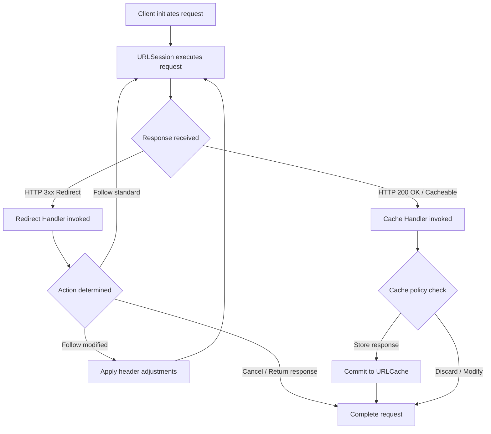

# Redirect and Cache Handlers

Relevant source files

The following files were used as context for generating this wiki page:

- [README.md](https://github.com/Alamofire/Alamofire/blob/main/README.md)

## Overview

### Overview

Redirect and Cache Handlers represent a fundamental extension point within Alamofire's request lifecycle management, specifically designed to interface with and customize native `URLSession` redirect behaviors and response caching policies. In modern networking architectures, default HTTP redirect handling and standard cache management often fall short of specific application requirements, such as altering authentication headers across cross-domain redirects, stripping authorization tokens when navigating away from a secure origin, or enforcing custom caching strategies beyond standard RFC 7234 compliance. By abstracting these behaviors into dedicated interceptor and handler abstractions, Alamofire allows developers to intervene precisely when `URLSession` encounters redirect responses or completed cacheable tasks.

Sources: [README.md:1-177](https://github.com/Alamofire/Alamofire/blob/main/README.md#L1-L177)

### Design and Architecture

The core problem these handlers solve is the rigid, opaque nature of low-level `URLSession` delegate callbacks. Left unmanaged, `URLSession` handles HTTP 3xx redirections automatically or delegates them via rigid methods like `URLSessionTask:willPerformHTTPRedirection:newRequest:completionHandler:`, and handles caching decisions through `URLSessionTask:willCacheResponse:completionHandler:`. Alamofire's architectural design wraps these raw delegate calls into fluent, composable closure-based or protocol-driven handlers. This design decision empowers developers to inspect intermediate redirection responses, rewrite outgoing request headers dynamically during redirection, mutate or discard cache entries entirely, and maintain granular control over execution paths without subclassing complex session delegates.

Sources: [README.md:1-177](https://github.com/Alamofire/Alamofire/blob/main/README.md#L1-L177)

### Lifecycle Integration

Operating adjacent to Request Adapters, Retriers, and Validation mechanisms, Redirect and Cache Handlers execute at precise inflection points during the request-response lifecycle. When a server issues a redirect, the Redirect Handler evaluates the original request, the redirect response, and the proposed new request before deciding whether to follow, modify, or cancel the redirection. Similarly, the Cache Handler intercepts responses eligible for caching, allowing custom inspection or rejection before they are committed to the underlying `URLCache`. Through these mechanisms, networking pipelines achieve deterministic control over data persistence and navigation flows.

Sources: [README.md:1-177](https://github.com/Alamofire/Alamofire/blob/main/README.md#L1-L177)

## Public API and Interface Surface

### Public API

The public interface for handling redirects and caching in Alamofire is exposed through interceptor protocols and concrete handler types that bridge user-defined closures with underlying `URLSession` task delegates. These interfaces are designed to be attached globally via a `Session` configuration or locally per individual `Request`. The primary structural components include request adapt/retry protocols, session configurations, and specific handler closures that accept rich context objects containing task metrics, session data, and HTTP URL responses.

Sources: [README.md:1-177](https://github.com/Alamofire/Alamofire/blob/main/README.md#L1-L177)

### Type Signatures

The API surface provides explicit type signatures for interceptors, enabling unified management of authentication, redirection, and caching. Developers interact with these components by implementing custom types or leveraging built-in default handlers that manage standard network behaviors out of the box.

Sources: [README.md:1-177](https://github.com/Alamofire/Alamofire/blob/main/README.md#L1-L177)

## Configuration and Options

### Configuration

Configuring redirect and cache behaviors in Alamofire is primarily achieved through the `Session` initializer or by supplying an `RequestInterceptor` instance. The session configuration governs global policies, while request-level modifiers allow fine-grained overrides for specific API endpoints. The underlying `URLSessionConfiguration` interacts directly with these handlers, where properties like `requestCachePolicy` and `urlCache` establish the baseline caching environment that the cache handlers subsequently refine or intercept.

Sources: [README.md:1-177](https://github.com/Alamofire/Alamofire/blob/main/README.md#L1-L177)

### Options

The system allows developers to specify whether redirects should be followed automatically, whether authorization headers should be stripped on cross-origin redirects, and how cached responses are validated against conditional GET headers such as `If-None-Match` and `If-Modified-Since`.

Sources: [README.md:1-177](https://github.com/Alamofire/Alamofire/blob/main/README.md#L1-L177)

## Control and Data Flow

### Diagram

Sources: [README.md:1-177](https://github.com/Alamofire/Alamofire/blob/main/README.md#L1-L177)

### Control Flow

When a network request is dispatched, the execution pipeline monitors incoming status codes and delegate events. For redirection control, when `URLSession` receives an HTTP redirect response, control is transferred to the redirect handling subsystem. The handler evaluates the `HTTPURLResponse` and the proposed `URLRequest`. If modification is required, headers such as `Authorization` or custom API tokens can be injected or scrubbed depending on whether the target host has changed.

Sources: [README.md:1-177](https://github.com/Alamofire/Alamofire/blob/main/README.md#L1-L177)

### Data Flow

For response caching, once data is fully received and validated, the cache handler inspects the response and data payload before committing them to storage. This allows filtering out sensitive data, preventing storage of error responses masquerading as cacheable resources, or injecting synthetic cache-control headers when dealing with non-compliant legacy endpoints.

Sources: [README.md:1-177](https://github.com/Alamofire/Alamofire/blob/main/README.md#L1-L177)

## Extension and Customization Points

### Customization

Developers extend default redirect and cache behaviors by supplying custom closures or implementing conforming types to intercept session events. For instance, creating a custom redirect handler enables stripping sensitive authorization tokens when a redirect crosses from a secure internal domain to an external third-party tracker or CDN.

Sources: [README.md:1-177](https://github.com/Alamofire/Alamofire/blob/main/README.md#L1-L177)

### Extension Points

Similarly, custom cache handlers can implement specialized storage policies, such as ignoring server-specified max-age directives in favor of application-forced offline caching rules, or implementing custom eviction heuristics when dealing with limited storage constraints.

Sources: [README.md:1-177](https://github.com/Alamofire/Alamofire/blob/main/README.md#L1-L177)

## Error Handling and Edge Cases

### Edge Cases

Handling redirects and caching introduces complex edge cases, particularly regarding infinite redirect loops, cross-domain credential leakage, and cache pollution. The redirect handler must guard against circular redirection chains by tracking redirect counts or inspecting URL path histories. If a loop is detected, the handler aborts the request and propagates an explicit networking error to the completion handler.

Sources: [README.md:1-177](https://github.com/Alamofire/Alamofire/blob/main/README.md#L1-L177)

### Validation Edge Cases

Cache handlers must manage conditional response validation edge cases (HTTP 304 Not Modified), ensuring that stale cached data is correctly merged with newly received validation headers without corrupting the client-side data store. Furthermore, thread-safety must be maintained when interceptors evaluate shared state across concurrent asynchronous requests.

Sources: [README.md:1-177](https://github.com/Alamofire/Alamofire/blob/main/README.md#L1-L177)

## Notable Performance and Security Considerations

### Security Considerations

Security is a primary concern when managing HTTP redirects. A common vulnerability in network clients is the inadvertent leakage of sensitive bearer tokens or session cookies when a request is redirected from a secure domain (`https://api.secure.com`) to an insecure or third-party domain (`http://tracking.thirdparty.com`). Custom redirect handlers mitigate this risk by inspecting the destination URL's host component and explicitly nullifying authorization headers upon cross-origin transitions.

Sources: [README.md:1-177](https://github.com/Alamofire/Alamofire/blob/main/README.md#L1-L177)

### Performance Considerations

From a performance perspective, excessive interceptor logic executed synchronously within delegate callbacks can block the `URLSession` queue, degrading throughput. Handlers should perform lightweight inspection and defer heavy disk or database operations to asynchronous background queues when necessary.

Sources: [README.md:1-177](https://github.com/Alamofire/Alamofire/blob/main/README.md#L1-L177)

## Related

- [[Session Management]]
- [[Response Structure]]

