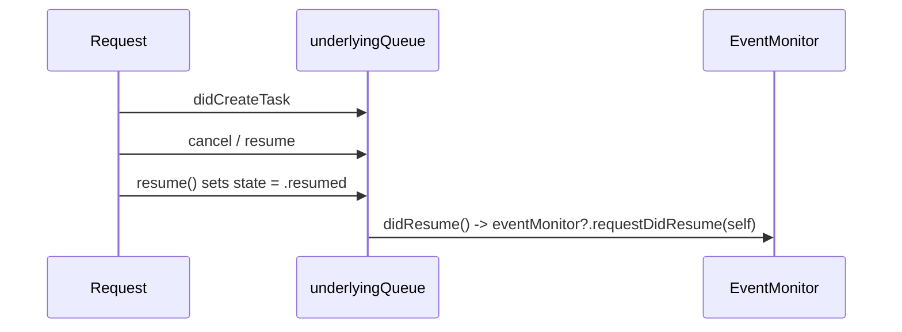
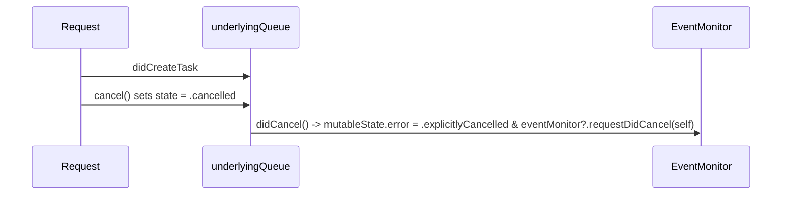
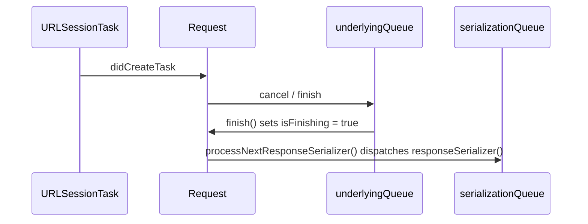

# Request Lifecycle

Relevant source files

The following files were used as context for generating this wiki page:

- [Source/Core/Request.swift](https://github.com/Alamofire/Alamofire/blob/main/Source/Core/Request.swift)
- [docs/Classes/Request.html](https://github.com/Alamofire/Alamofire/blob/main/docs/Classes/Request.html)

## Overview

`Request` serves as the common superclass for all Alamofire request types, acting as the central orchestrator for network activity, delegate coordination, and callback management. It coordinates the end-to-end network workflow by bridging high-level client interactions with low-level `URLSessionTask` execution. By encapsulating internal state representation, thread-safe property access, request adaptation, response serialization, and error recovery policies into a unified structure, it eliminates boilerplate and ensures consistent execution semantics across all request types.

Sources: [Source/Core/Request.swift:27-29](https://github.com/Alamofire/Alamofire/blob/main/Source/Core/Request.swift#L27-L29)

## State Management and Protected Properties

### Overview

`Request` manages its internal state representation, mutable property storage, and thread-safe access through a dedicated `MutableState` structure wrapped in a `Protected` container [Source/Core/Request.swift:93-144](https://github.com/Alamofire/Alamofire/blob/main/Source/Core/Request.swift#L93-L144). This design isolates mutable variables and collections from concurrent modifications across arbitrary threads and the internal serial execution queues.

Sources: [Source/Core/Request.swift:93-144](https://github.com/Alamofire/Alamofire/blob/main/Source/Core/Request.swift#L93-L144)

### State Representation and Transitions

The request lifecycle state is represented by the nested `State` enumeration [Source/Core/Request.swift:32-47](https://github.com/Alamofire/Alamofire/blob/main/Source/Core/Request.swift#L32-L47). The state machine governs transitions via `canTransitionTo(_:)`, ensuring that once a request enters terminal states like `.cancelled`, it cannot transition back or into other active states [Source/Core/Request.swift:49-63](https://github.com/Alamofire/Alamofire/blob/main/Source/Core/Request.swift#L49-L63).

| State Case | Description | Valid Subsequent Transitions |
| :--- | :--- | :--- |
| `.initialized` | Initial state of the `Request` upon instantiation [Source/Core/Request.swift:33-34](https://github.com/Alamofire/Alamofire/blob/main/Source/Core/Request.swift#L33-L34). | `.resumed`, `.suspended`, `.cancelled`, `.finished` [Source/Core/Request.swift:52-61](https://github.com/Alamofire/Alamofire/blob/main/Source/Core/Request.swift#L52-L61) |
| `.resumed` | Set when `resume()` is called; associated tasks are resumed [Source/Core/Request.swift:35-37](https://github.com/Alamofire/Alamofire/blob/main/Source/Core/Request.swift#L35-L37). | `.suspended`, `.cancelled`, `.finished`, `.resumed` (disallowed) [Source/Core/Request.swift:56-61](https://github.com/Alamofire/Alamofire/blob/main/Source/Core/Request.swift#L56-L61) |
| `.suspended` | Set when `suspend()` is called; associated tasks are suspended [Source/Core/Request.swift:38-40](https://github.com/Alamofire/Alamofire/blob/main/Source/Core/Request.swift#L38-L40). | `.resumed`, `.cancelled`, `.finished`, `.suspended` (disallowed) [Source/Core/Request.swift:56-61](https://github.com/Alamofire/Alamofire/blob/main/Source/Core/Request.swift#L56-L61) |
| `.cancelled` | Set when `cancel()` is called; terminal state preventing further transitions [Source/Core/Request.swift:41-44](https://github.com/Alamofire/Alamofire/blob/main/Source/Core/Request.swift#L41-L44). | None [Source/Core/Request.swift:54-55](https://github.com/Alamofire/Alamofire/blob/main/Source/Core/Request.swift#L54-L55) |
| `.finished` | Set when all response serialization completion closures clear and enqueue [Source/Core/Request.swift:45-47](https://github.com/Alamofire/Alamofire/blob/main/Source/Core/Request.swift#L45-L47). | None [Source/Core/Request.swift:54-55](https://github.com/Alamofire/Alamofire/blob/main/Source/Core/Request.swift#L54-L55) |

Sources: [Source/Core/Request.swift:32-63](https://github.com/Alamofire/Alamofire/blob/main/Source/Core/Request.swift#L32-L63)

### Protected Property Storage

All runtime variables that change during request execution—including task references, metric logs, serialization queues, and handler closures—reside inside `MutableState` [Source/Core/Request.swift:93-141](https://github.com/Alamofire/Alamofire/blob/main/Source/Core/Request.swift#L93-L141). Public properties expose read-only snapshots or thread-safe write access via `mutableState.read` and `mutableState.write` primitives [Source/Core/Request.swift:143-264](https://github.com/Alamofire/Alamofire/blob/main/Source/Core/Request.swift#L143-L264).

Sources: [Source/Core/Request.swift:93-264](https://github.com/Alamofire/Alamofire/blob/main/Source/Core/Request.swift#L93-L264)

## Task Initialization and Delegation

### Overview

The request lifecycle transitions from state initialization into URL request creation, adaptation, and task instantiation [Source/Core/Request.swift:300-422](https://github.com/Alamofire/Alamofire/blob/main/Source/Core/Request.swift#L300-L422). `Request` exposes internal event APIs that execute exclusively on the `underlyingQueue` to manage `URLRequest` creation, task creation hooks, and delegation routines back to the `SessionDelegate` [Source/Core/Request.swift:294-422](https://github.com/Alamofire/Alamofire/blob/main/Source/Core/Request.swift#L294-L422).

Sources: [Source/Core/Request.swift:294-422](https://github.com/Alamofire/Alamofire/blob/main/Source/Core/Request.swift#L294-L422)

### URLRequest Preparation and Adaptation Flow

When an initial URL request is created or adapted, specific event hooks record the request state and notify any active event monitors or custom handlers [Source/Core/Request.swift:300-336](https://github.com/Alamofire/Alamofire/blob/main/Source/Core/Request.swift#L300-L336). 

The call-chain execution walkthrough for URL request creation proceeds as follows:
`didCreateInitialURLRequest(_:)` or `didAdaptInitialRequest(_:to:)` appends the request to `mutableState.requests` → triggers `eventMonitor?.request(self, didCreateInitialURLRequest: request)` (or the corresponding adaptation event) [Source/Core/Request.swift:300-336](https://github.com/Alamofire/Alamofire/blob/main/Source/Core/Request.swift#L300-L336) → `didCreateURLRequest(_:)` accesses `mutableState.urlRequestHandler` and dispatches the request to its designated queue asynchronously [Source/Core/Request.swift:360-372](https://github.com/Alamofire/Alamofire/blob/main/Source/Core/Request.swift#L360-L372) → `callCURLHandlerIfNecessary()` executes any pending cURL description handlers [Source/Core/Request.swift:375-383](https://github.com/Alamofire/Alamofire/blob/main/Source/Core/Request.swift#L375-L383).

> [!NOTE]
> If URL request creation or adaptation fails, `didFailToCreateURLRequest(with:)` and `didFailToAdaptURLRequest(_:withError:)` set the internal `error` property, trigger event monitoring callbacks, and immediately invoke `retryOrFinish(error:)` to evaluate retry policies [Source/Core/Request.swift:313-355](https://github.com/Alamofire/Alamofire/blob/main/Source/Core/Request.swift#L313-L355).

Sources: [Source/Core/Request.swift:300-383](https://github.com/Alamofire/Alamofire/blob/main/Source/Core/Request.swift#L300-L383)

### Task Creation and Delegation Routines

Once a `URLSessionTask` is instantiated, `didCreateTask(_:)` registers the task and synchronizes its runtime state with the request's current lifecycle state [Source/Core/Request.swift:388-422](https://github.com/Alamofire/Alamofire/blob/main/Source/Core/Request.swift#L388-L422).

| Task Creation Event / Hook | Target Queue | Purpose & Action |
| :--- | :--- | :--- |
| `didCreateTask(_:)` | `underlyingQueue` | Appends the task to `mutableState.tasks`, dispatches `urlSessionTaskHandler`, notifies the `eventMonitor`, and applies state-based task actions [Source/Core/Request.swift:388-421](https://github.com/Alamofire/Alamofire/blob/main/Source/Core/Request.swift#L388-L421). |
| `task(for:using:)` | Any Queue | Abstract factory method overridden by subclasses to create specific `URLSessionTask` instances; traps via `fatalError` if unoverridden [Source/Core/Request.swift:700-702](https://github.com/Alamofire/Alamofire/blob/main/Source/Core/Request.swift#L700-L702). |
| `didGatherMetrics(_:)` | `underlyingQueue` | Appends gathered `URLSessionTaskMetrics` while filtering out duplicate callbacks issued by Network.framework-based sessions [Source/Core/Request.swift:479-491](https://github.com/Alamofire/Alamofire/blob/main/Source/Core/Request.swift#L479-L491). |
| `didCompleteTask(_:with:)` | `underlyingQueue` | Records completion errors, executes enqueued validators synchronously, notifies monitors, and initiates retry or finish logic [Source/Core/Request.swift:515-526](https://github.com/Alamofire/Alamofire/blob/main/Source/Core/Request.swift#L515-L526). |

Sources: [Source/Core/Request.swift:388-526](https://github.com/Alamofire/Alamofire/blob/main/Source/Core/Request.swift#L700-L702)

## Lifecycle Control and State Transitions

### Overview

The `Request` lifecycle state machine manages transitions between initialized, resumed, suspended, cancelled, and finished states [Source/Core/Request.swift:32-64](https://github.com/Alamofire/Alamofire/blob/main/Source/Core/Request.swift#L32-L64). Public methods like `cancel()`, `suspend()`, and `resume()` enforce valid state transitions through `canTransitionTo(_:)` before dispatching asynchronous work on the `underlyingQueue` [Source/Core/Request.swift:50-63](https://github.com/Alamofire/Alamofire/blob/main/Source/Core/Request.swift#L50-L63), [Source/Core/Request.swift:714-791](https://github.com/Alamofire/Alamofire/blob/main/Source/Core/Request.swift#L714-L791).

Sources: [Source/Core/Request.swift:32-64](https://github.com/Alamofire/Alamofire/blob/main/Source/Core/Request.swift#L32-L64), [Source/Core/Request.swift:714-791](https://github.com/Alamofire/Alamofire/blob/main/Source/Core/Request.swift#L714-L791)

### State Machine Transition Rules

The `State` enum defines five distinct phases and specifies allowable transitions via `canTransitionTo(_:)` [Source/Core/Request.swift:32-63](https://github.com/Alamofire/Alamofire/blob/main/Source/Core/Request.swift#L32-L63). Once a request enters `.cancelled` or `.finished`, it cannot transition to any other state [Source/Core/Request.swift:54-55](https://github.com/Alamofire/Alamofire/blob/main/Source/Core/Request.swift#L54-L55).

| From State | To State | Allowed? | Behavior / Rule |
| :--- | :--- | :--- | :--- |
| `.initialized` | Any State | Allowed | Initial state can transition to resumed, suspended, cancelled, or finished [Source/Core/Request.swift:52-53](https://github.com/Alamofire/Alamofire/blob/main/Source/Core/Request.swift#L52-L53). |
| Any State | `.initialized` | Prohibited | Cannot transition backwards to initialized [Source/Core/Request.swift:54](https://github.com/Alamofire/Alamofire/blob/main/Source/Core/Request.swift#L54). |
| `.cancelled` | Any State | Prohibited | Terminal state; once cancelled, no further state changes are permitted [Source/Core/Request.swift:42-43](https://github.com/Alamofire/Alamofire/blob/main/Source/Core/Request.swift#L42-L43), [Source/Core/Request.swift:54](https://github.com/Alamofire/Alamofire/blob/main/Source/Core/Request.swift#L54). |
| `.finished` | Any State | Prohibited | Terminal response serialization state; cannot transition away [Source/Core/Request.swift:54](https://github.com/Alamofire/Alamofire/blob/main/Source/Core/Request.swift#L54). |
| `.resumed` | `.cancelled` | Allowed | Cancels active task and sets error to `AFError.explicitlyCancelled` [Source/Core/Request.swift:56](https://github.com/Alamofire/Alamofire/blob/main/Source/Core/Request.swift#L56), [Source/Core/Request.swift:461](https://github.com/Alamofire/Alamofire/blob/main/Source/Core/Request.swift#L461). |
| `.suspended` | `.cancelled` | Allowed | Cancels suspended task and records explicit cancellation [Source/Core/Request.swift:56](https://github.com/Alamofire/Alamofire/blob/main/Source/Core/Request.swift#L56), [Source/Core/Request.swift:461](https://github.com/Alamofire/Alamofire/blob/main/Source/Core/Request.swift#L461). |
| `.resumed` | `.suspended` | Allowed | Suspends execution and updates task state [Source/Core/Request.swift:56](https://github.com/Alamofire/Alamofire/blob/main/Source/Core/Request.swift#L56). |
| `.suspended` | `.resumed` | Allowed | Resumes execution and updates task state [Source/Core/Request.swift:56](https://github.com/Alamofire/Alamofire/blob/main/Source/Core/Request.swift#L56). |

Sources: [Source/Core/Request.swift:32-63](https://github.com/Alamofire/Alamofire/blob/main/Source/Core/Request.swift#L32-L63), [Source/Core/Request.swift:461](https://github.com/Alamofire/Alamofire/blob/main/Source/Core/Request.swift#L461)

### Execution Trace: Resume Path

When `resume()` is called on a request, the execution proceeds through specific internal coordination steps [Source/Core/Request.swift:768-791](https://github.com/Alamofire/Alamofire/blob/main/Source/Core/Request.swift#L768-L791). 

The call-chain execution walkthrough for resume proceeds as follows:
1. `didCreateTask` instantiates or registers the underlying task [Source/Core/Request.swift:388-422](https://github.com/Alamofire/Alamofire/blob/main/Source/Core/Request.swift#L388-L422).
2. `cancel` or state transition invokes `cancel()` which triggers `didCancel()` (or `resume()` invokes `didResume()`) [Source/Core/Request.swift:425-429](https://github.com/Alamofire/Alamofire/blob/main/Source/Core/Request.swift#L425-L429), [Source/Core/Request.swift:768-791](https://github.com/Alamofire/Alamofire/blob/main/Source/Core/Request.swift#L768-L791).
3. `resume` updates `mutableState.state = .resumed` and dispatches `didResume()` on `underlyingQueue` [Source/Core/Request.swift:769-775](https://github.com/Alamofire/Alamofire/blob/main/Source/Core/Request.swift#L769-L775).
4. `didResume` executes on `underlyingQueue` to notify the event monitor via `eventMonitor?.requestDidResume(self)` [Source/Core/Request.swift:425-429](https://github.com/Alamofire/Alamofire/blob/main/Source/Core/Request.swift#L425-L429).

Sources: [Source/Core/Request.swift:388-429](https://github.com/Alamofire/Alamofire/blob/main/Source/Core/Request.swift#L388-L429), [Source/Core/Request.swift:768-791](https://github.com/Alamofire/Alamofire/blob/main/Source/Core/Request.swift#L768-L791)

### Execution Trace: Cancellation Path

When a request is cancelled mid-flight, state cleanup and task interruption follow a strict sequence [Source/Core/Request.swift:714-741](https://github.com/Alamofire/Alamofire/blob/main/Source/Core/Request.swift#L714-L741).

The call-chain execution walkthrough for cancellation proceeds as follows:
1. `didCreateTask` registers the active session task [Source/Core/Request.swift:388-422](https://github.com/Alamofire/Alamofire/blob/main/Source/Core/Request.swift#L388-L422).
2. `cancel` transitions state to `.cancelled` and dispatches `didCancel()` [Source/Core/Request.swift:715-720](https://github.com/Alamofire/Alamofire/blob/main/Source/Core/Request.swift#L715-L720).
3. `didCancel` updates `mutableState.error` to `AFError.explicitlyCancelled` if no other error exists and notifies `eventMonitor?.requestDidCancel(self)` [Source/Core/Request.swift:457-465](https://github.com/Alamofire/Alamofire/blob/main/Source/Core/Request.swift#L457-L465).

> [!WARNING]
> When cancelling a request that already possesses an active task, Alamofire explicitly calls `task.resume()` prior to `task.cancel()` if the task was suspended, ensuring that underlying `URLSessionTaskMetrics` are properly gathered before termination [Source/Core/Request.swift:416-418](https://github.com/Alamofire/Alamofire/blob/main/Source/Core/Request.swift#L416-L418), [Source/Core/Request.swift:734-736](https://github.com/Alamofire/Alamofire/blob/main/Source/Core/Request.swift#L734-L736).

Sources: [Source/Core/Request.swift:388-422](https://github.com/Alamofire/Alamofire/blob/main/Source/Core/Request.swift#L388-L422), [Source/Core/Request.swift:457-465](https://github.com/Alamofire/Alamofire/blob/main/Source/Core/Request.swift#L457-L465), [Source/Core/Request.swift:714-741](https://github.com/Alamofire/Alamofire/blob/main/Source/Core/Request.swift#L714-L741)

## Response Serialization and Retry Lifecycle

### Overview

Response serialization and retry evaluation govern how a `Request` transitions from raw network task completion into parsed model data or error handling. When a `URLSessionTask` finishes, Alamofire evaluates whether to retry the request through its delegate or initiate the sequential response serializer pipeline.

Sources: [Source/Core/Request.swift:515-558](https://github.com/Alamofire/Alamofire/blob/main/Source/Core/Request.swift#L515-L558)

### Execution Trace: Response Serialization and Retry Path

The response serialization and retry lifecycle proceeds through a deterministic sequence of internal handlers [Source/Core/Request.swift:388-422](https://github.com/Alamofire/Alamofire/blob/main/Source/Core/Request.swift#L388-L422), [Source/Core/Request.swift:714-741](https://github.com/Alamofire/Alamofire/blob/main/Source/Core/Request.swift#L714-L741), [Source/Core/Request.swift:563-582](https://github.com/Alamofire/Alamofire/blob/main/Source/Core/Request.swift#L563-L582), [Source/Core/Request.swift:613-650](https://github.com/Alamofire/Alamofire/blob/main/Source/Core/Request.swift#L613-L650).

1. `didCreateTask` registers the active session task and monitors its execution lifecycle on `underlyingQueue` [Source/Core/Request.swift:388-422](https://github.com/Alamofire/Alamofire/blob/main/Source/Core/Request.swift#L388-L422).
2. `cancel` (or task failure completion) triggers `finish()` when retry is rejected or unavailable, setting `mutableState.isFinishing = true` [Source/Core/Request.swift:714-741](https://github.com/Alamofire/Alamofire/blob/main/Source/Core/Request.swift#L714-L741), [Source/Core/Request.swift:563-582](https://github.com/Alamofire/Alamofire/blob/main/Source/Core/Request.swift#L563-L582).
3. `finish` invokes `processNextResponseSerializer()` to begin executing response handlers [Source/Core/Request.swift:563-582](https://github.com/Alamofire/Alamofire/blob/main/Source/Core/Request.swift#L563-L582).
4. `processNextResponseSerializer` inspects enqueued serializers, dispatches the current serializer on `serializationQueue`, or clears state and executes completion handlers once exhausted [Source/Core/Request.swift:613-650](https://github.com/Alamofire/Alamofire/blob/main/Source/Core/Request.swift#L613-L650).

Sources: [Source/Core/Request.swift:388-422](https://github.com/Alamofire/Alamofire/blob/main/Source/Core/Request.swift#L388-L422), [Source/Core/Request.swift:563-582](https://github.com/Alamofire/Alamofire/blob/main/Source/Core/Request.swift#L563-L582), [Source/Core/Request.swift:613-650](https://github.com/Alamofire/Alamofire/blob/main/Source/Core/Request.swift#L613-L650)

### Retry Evaluation and Response Disposition

When a task finishes with an error, `retryOrFinish(error:)` consults the request delegate to decide whether to attempt a retry or finalize the request [Source/Core/Request.swift:543-558](https://github.com/Alamofire/Alamofire/blob/main/Source/Core/Request.swift#L543-L558).

| Retry Result Case | Action Taken | Source Reference |
| :--- | :--- | :--- |
| `.doNotRetry` | Calls `self.finish()` to begin response serialization and finalize the request. | [Source/Core/Request.swift:549-551](https://github.com/Alamofire/Alamofire/blob/main/Source/Core/Request.swift#L549-L551) |
| `.doNotRetryWithError(retryError)` | Converts `retryError` to an `AFError` and calls `self.finish(error:)`. | [Source/Core/Request.swift:552-553](https://github.com/Alamofire/Alamofire/blob/main/Source/Core/Request.swift#L552-L553) |
| `.retry`, `.retryWithDelay` | Invokes `delegate.retryRequest(_:withDelay:)` to trigger a re-attempt after the specified delay. | [Source/Core/Request.swift:554-556](https://github.com/Alamofire/Alamofire/blob/main/Source/Core/Request.swift#L554-L556) |

Sources: [Source/Core/Request.swift:543-558](https://github.com/Alamofire/Alamofire/blob/main/Source/Core/Request.swift#L543-L558)

> [!NOTE]
> During sequential response serialization, `mutableState.responseSerializers` and `mutableState.responseSerializerCompletions` are fully cleared prior to invoking completion closures. This prevents re-entrancy bugs if a completion handler triggers request cancellation or re-adds response handlers [Source/Core/Request.swift:625-632](https://github.com/Alamofire/Alamofire/blob/main/Source/Core/Request.swift#L625-L632).

Sources: [Source/Core/Request.swift:613-650](https://github.com/Alamofire/Alamofire/blob/main/Source/Core/Request.swift#L613-L650)

### Design Trade-Offs in Response Processing

| Design Choice | Benefit | Cost | Source Reference |
| :--- | :--- | :--- | :--- |
| **Protected Mutable State with Closure Isolation** | Thread-safe reads and writes without deadlocks across concurrent callbacks. | Minor locking overhead during frequent state checks. | [Source/Core/Request.swift:143-144](https://github.com/Alamofire/Alamofire/blob/main/Source/Core/Request.swift#L143-L144), [Source/Core/Request.swift:613-647](https://github.com/Alamofire/Alamofire/blob/main/Source/Core/Request.swift#L613-L647) |
| **Sequential Serializer Processing via Index Tracking** | Ensures predictable ordering of decoders and custom response handlers. | Serializers must complete serially rather than parsing concurrently. | [Source/Core/Request.swift:616-623](https://github.com/Alamofire/Alamofire/blob/main/Source/Core/Request.swift#L616-L623) |

Sources: [Source/Core/Request.swift:143-144](https://github.com/Alamofire/Alamofire/blob/main/Source/Core/Request.swift#L143-L144), [Source/Core/Request.swift:613-647](https://github.com/Alamofire/Alamofire/blob/main/Source/Core/Request.swift#L613-L647)

## Public API and Callback Queues

### Overview

The `Request` public API exposes external interface methods, configuration hooks, and callback registration mechanisms designed to be callable from any queue [Source/Core/Request.swift:704-706](https://github.com/Alamofire/Alamofire/blob/main/Source/Core/Request.swift#L704-L706). These methods include state manipulation (`resume()`, `suspend()`, `cancel()`) [Source/Core/Request.swift:713-791](https://github.com/Alamofire/Alamofire/blob/main/Source/Core/Request.swift#L713-L791), credential binding (`authenticate(username:password:persistence:)`, `authenticate(with:)`) [Source/Core/Request.swift:804-820](https://github.com/Alamofire/Alamofire/blob/main/Source/Core/Request.swift#L804-L820), progress observation (`downloadProgress(queue:closure:)`, `uploadProgress(queue:closure:)`) [Source/Core/Request.swift:833-854](https://github.com/Alamofire/Alamofire/blob/main/Source/Core/Request.swift#L833-L854), and lifecycle hook registrations [Source/Core/Request.swift:898-1095](https://github.com/Alamofire/Alamofire/blob/main/Source/Core/Request.swift#L898-1095).

Sources: [Source/Core/Request.swift:704-706](https://github.com/Alamofire/Alamofire/blob/main/Source/Core/Request.swift#L704-L706), [Source/Core/Request.swift:713-895](https://github.com/Alamofire/Alamofire/blob/main/Source/Core/Request.swift#L713-L895), [Source/Core/Request.swift:898-1095](https://github.com/Alamofire/Alamofire/blob/main/Source/Core/Request.swift#L898-1095)

### Public Callback Registration Methods

| Method Signature | Default Queue / Parameters | Purpose | Source Reference |
| :--- | :--- | :--- | :--- |
| `downloadProgress(queue:closure:)` | `queue: DispatchQueue = .main` | Registers a periodic callback for download progress updates. | [Source/Core/Request.swift:833-837](https://github.com/Alamofire/Alamofire/blob/main/Source/Core/Request.swift#L833-L837) |
| `uploadProgress(queue:closure:)` | `queue: DispatchQueue = .main` | Registers a periodic callback for upload progress updates. | [Source/Core/Request.swift:850-854](https://github.com/Alamofire/Alamofire/blob/main/Source/Core/Request.swift#L850-L854) |
| `redirect(using:)` | `handler: any RedirectHandler` | Sets the custom redirect handler for the request instance. | [Source/Core/Request.swift:867-874](https://github.com/Alamofire/Alamofire/blob/main/Source/Core/Request.swift#L867-L874) |
| `cacheResponse(using:)` | `handler: any CachedResponseHandler` | Sets the cached response handler for the request instance. | [Source/Core/Request.swift:887-894](https://github.com/Alamofire/Alamofire/blob/main/Source/Core/Request.swift#L887-L894) |
| `cURLDescription(on:calling:)` | `queue: DispatchQueue`, `handler: @Sendable (String) -> Void` | Sets a handler to receive the cURL command representation asynchronously. | [Source/Core/Request.swift:909-919](https://github.com/Alamofire/Alamofire/blob/main/Source/Core/Request.swift#L909-L919) |
| `onURLRequestCreation(on:perform:)` | `queue: DispatchQueue = .main`, `handler: (URLRequest) -> Void` | Observes every `URLRequest` creation, including initial and adapted requests. | [Source/Core/Request.swift:948-958](https://github.com/Alamofire/Alamofire/blob/main/Source/Core/Request.swift#L948-L958) |
| `onURLSessionTaskCreation(on:perform:)` | `queue: DispatchQueue = .main`, `handler: (URLSessionTask) -> Void` | Observes `URLSessionTask` creations for file providers and advanced integrations. | [Source/Core/Request.swift:973-983](https://github.com/Alamofire/Alamofire/blob/main/Source/Core/Request.swift#L973-L983) |

Sources: [Source/Core/Request.swift:833-837](https://github.com/Alamofire/Alamofire/blob/main/Source/Core/Request.swift#L833-L837), [Source/Core/Request.swift:850-854](https://github.com/Alamofire/Alamofire/blob/main/Source/Core/Request.swift#L850-L854), [Source/Core/Request.swift:867-874](https://github.com/Alamofire/Alamofire/blob/main/Source/Core/Request.swift#L867-L874), [Source/Core/Request.swift:887-894](https://github.com/Alamofire/Alamofire/blob/main/Source/Core/Request.swift#L887-L894), [Source/Core/Request.swift:909-919](https://github.com/Alamofire/Alamofire/blob/main/Source/Core/Request.swift#L909-L919), [Source/Core/Request.swift:948-958](https://github.com/Alamofire/Alamofire/blob/main/Source/Core/Request.swift#L948-L958), [Source/Core/Request.swift:973-983](https://github.com/Alamofire/Alamofire/blob/main/Source/Core/Request.swift#L973-L983)

> [!WARNING]
> Attempting to set the `redirectHandler` or `cachedResponseHandler` more than once via `redirect(using:)` or `cacheResponse(using:)` triggers a logic precondition failure and crashes the application [Source/Core/Request.swift:869](https://github.com/Alamofire/Alamofire/blob/main/Source/Core/Request.swift#L869), [Source/Core/Request.swift:889](https://github.com/Alamofire/Alamofire/blob/main/Source/Core/Request.swift#L889).

Sources: [Source/Core/Request.swift:867-874](https://github.com/Alamofire/Alamofire/blob/main/Source/Core/Request.swift#L867-L874), [Source/Core/Request.swift:887-894](https://github.com/Alamofire/Alamofire/blob/main/Source/Core/Request.swift#L887-L894)

## Related

- [[Session Management]]
- [[Session And Requests]]
- [[Request Interceptors]]

