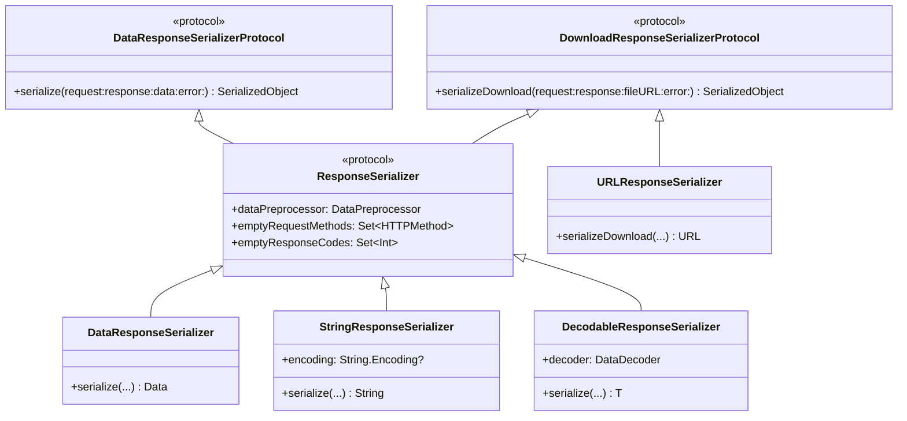

# Response Serialization

<details>
<summary>Relevant source files</summary>

The following files were used as context for generating this wiki page:

- [Source/Core/DataRequest.swift](https://github.com/Alamofire/Alamofire/blob/main/Source/Core/DataRequest.swift)
- [Source/Features/Concurrency.swift](https://github.com/Alamofire/Alamofire/blob/main/Source/Features/Concurrency.swift)
- [Source/Features/ResponseSerialization.swift](https://github.com/Alamofire/Alamofire/blob/main/Source/Features/ResponseSerialization.swift)
- [Source/Core/Request.swift](https://github.com/Alamofire/Alamofire/blob/main/Source/Core/Request.swift)
- [docs/Classes/DecodableResponseSerializer.html](https://github.com/Alamofire/Alamofire/blob/main/docs/Classes/DecodableResponseSerializer.html)
- [Source/Core/DataStreamRequest.swift](https://github.com/Alamofire/Alamofire/blob/main/Source/Core/DataStreamRequest.swift)
- [Source/Core/DownloadRequest.swift](https://github.com/Alamofire/Alamofire/blob/main/Source/Core/DownloadRequest.swift)
</details>

## Overview

Response serialization in Alamofire bridges the gap between raw transport data and strongly typed domain models by transforming network payloads into structured objects. Operating as an extensible pipeline step, response serializers process raw server bytes, evaluate success criteria, and handle response validation errors. The architecture centers around robust protocols that decouple the ingestion of HTTP data or downloaded files from domain-specific decoding logic, enabling consistent handling across in-memory data, string conversions, and complex decodable types.

Sources: [Source/Features/ResponseSerialization.swift:27-61](https://github.com/Alamofire/Alamofire/blob/main/Source/Features/ResponseSerialization.swift#L27-L61), [Source/Core/DataRequest.swift:243-310](https://github.com/Alamofire/Alamofire/blob/main/Source/Core/DataRequest.swift#L243-L310)

## Serializer Protocol Hierarchy and Built-In Types

### Overview

Alamofire establishes a rigorous protocol hierarchy for response serialization that separates in-memory data serialization from file-based download serialization, uniting both paradigms under a common configuration interface. At the base of this hierarchy are two fundamental protocols: `DataResponseSerializerProtocol`, which defines the requirement to serialize raw response `Data` into a `SerializedObject`, and `DownloadResponseSerializerProtocol`, which governs the transformation of downloaded response files residing on disk into structured objects. Both protocols require conformance to `Sendable` and make use of the `SerializedObject` associated type.

Sources: [Source/Features/ResponseSerialization.swift:27-61](https://github.com/Alamofire/Alamofire/blob/main/Source/Features/ResponseSerialization.swift#L27-L61)

### Protocol Hierarchy and Response Serializers

The comprehensive `ResponseSerializer` protocol inherits from both `DataResponseSerializerProtocol` and `DownloadResponseSerializerProtocol`, while adding essential properties that dictate how raw server responses and HTTP metadata are preprocessed and evaluated. Conforming types gain access to built-in extensions that supply default values, including `defaultDataPreprocessor` set to `PassthroughPreprocessor`, `defaultEmptyRequestMethods` set to `[.head]`, and `defaultEmptyResponseCodes` containing status codes `204` and `205`. Furthermore, an automatic extension bridges any `DownloadResponseSerializerProtocol` type that also conforms to `DataResponseSerializerProtocol`, granting file serialization for free by reading disk data via `Data(contentsOf:)` and routing it straight through the data response serializer.

Sources: [Source/Features/ResponseSerialization.swift:63-71](https://github.com/Alamofire/Alamofire/blob/main/Source/Features/ResponseSerialization.swift#L63-L71), [Source/Features/ResponseSerialization.swift:153-176](https://github.com/Alamofire/Alamofire/blob/main/Source/Features/ResponseSerialization.swift#L153-L176)



Sources: [Source/Features/ResponseSerialization.swift:27-71](https://github.com/Alamofire/Alamofire/blob/main/Source/Features/ResponseSerialization.swift#L27-L71), [Source/Features/ResponseSerialization.swift:181-198](https://github.com/Alamofire/Alamofire/blob/main/Source/Features/ResponseSerialization.swift#L181-L198), [Source/Features/ResponseSerialization.swift:210-509](https://github.com/Alamofire/Alamofire/blob/main/Source/Features/ResponseSerialization.swift#L210-L509)

### Built-In Response Serializers and Type Conformance

Alamofire provides several concrete built-in serializers that handle standard data types, file references, and Codable models out of the box. Each built-in serializer implements specific error checks, empty response handling, and decoding rules.

| Serializer Name | Conformance | Serialized Output Type | Default Configuration & Behavior |
| :--- | :--- | :--- | :--- |
| `URLResponseSerializer` | `DownloadResponseSerializerProtocol` | `URL` | Performs error checking and ensures `fileURL` presence without reading bytes into memory. |
| `DataResponseSerializer` | `ResponseSerializer` | `Data` | Returns raw `Data` as-is after preprocessing; throws if data is nil/empty unless allowed by status codes or request methods. |
| `StringResponseSerializer` | `ResponseSerializer` | `String` | Decodes response data into a `String` using response text encoding or falling back to `.isoLatin1`. |
| `JSONResponseSerializer` *(Deprecated)* | `ResponseSerializer` | `Any` | Decodes response using `JSONSerialization.ReadingOptions.allowFragments`. Deprecated in favor of `DecodableResponseSerializer`. |
| `DecodableResponseSerializer<T>` | `ResponseSerializer` | `T: Decodable & Sendable` | Decodes response data via any `DataDecoder` (defaulting to `JSONDecoder()`). Supports `EmptyResponse` and `Empty` types. |

Sources: [Source/Features/ResponseSerialization.swift:181-198](https://github.com/Alamofire/Alamofire/blob/main/Source/Features/ResponseSerialization.swift#L181-L198), [Source/Features/ResponseSerialization.swift:210-403](https://github.com/Alamofire/Alamofire/blob/main/Source/Features/ResponseSerialization.swift#L210-L403), [Source/Features/ResponseSerialization.swift:462-509](https://github.com/Alamofire/Alamofire/blob/main/Source/Features/ResponseSerialization.swift#L462-L509)

> [!NOTE]
> `JSONDecoder` and `PropertyListDecoder` do not conform to `Sendable` on Apple platforms prior to macOS 13 or iOS 16. To prevent data races, instances passed to a `DecodableResponseSerializer` should not be shared across threads or requests. Developers should instantiate a fresh serializer and decoder for every request.

Sources: [Source/Features/ResponseSerialization.swift:458-461](https://github.com/Alamofire/Alamofire/blob/main/Source/Features/ResponseSerialization.swift#L458-L461)

### Empty Response Protocols and Decoders

To accommodate HTTP responses that lack body payloads (such as `204 No Content` or `205 Reset Content`), Alamofire defines the `EmptyResponse` protocol alongside the concrete `Empty` structure. Types conforming to `EmptyResponse` must implement the static `emptyValue()` method. When a response is empty but permitted by request methods or status codes, `DecodableResponseSerializer` checks whether the target type `T` conforms to `EmptyResponse` or equals `Empty`, successfully returning the designated empty value rather than triggering a decoding failure.

```swift
public protocol DataDecoder: Sendable {
    func decode<D: Decodable>(_ type: D.Type, from data: Data) throws -> D
}

extension JSONDecoder: DataDecoder {}
extension PropertyListDecoder: DataDecoder {}
```

Sources: [Source/Features/ResponseSerialization.swift:407-446](https://github.com/Alamofire/Alamofire/blob/main/Source/Features/ResponseSerialization.swift#L407-L446), [Source/Features/ResponseSerialization.swift:489-499](https://github.com/Alamofire/Alamofire/blob/main/Source/Features/ResponseSerialization.swift#L489-L499)

> [!WARNING]
> If a decoded type *does not* conform to `EmptyResponse` and is not `Empty`, receiving an empty response body on an allowed empty status code or request method will still throw an `.invalidEmptyResponse` error.

Sources: [Source/Features/ResponseSerialization.swift:494-497](https://github.com/Alamofire/Alamofire/blob/main/Source/Features/ResponseSerialization.swift#L494-L497)

## Data Preprocessing and Decoding Strategies

### Overview

Data preprocessing and decoding strategies in Alamofire govern how raw response bytes are transformed before they reach a concrete serializer or decoder. The `DataPreprocessor` protocol defines a single method, `preprocess(_:)`, allowing custom interceptors to mutate data prior to parsing. Built-in implementations include `PassthroughPreprocessor`, which returns data unchanged, and `GoogleXSSIPreprocessor`, which checks for Google's `)]}',\n` XSSI prefix and strips it when present.

Sources: [Source/Features/ResponseSerialization.swift:73-96](https://github.com/Alamofire/Alamofire/blob/main/Source/Features/ResponseSerialization.swift#L73-L96)

### Preprocessor and Decoder Reference

The framework supplies dedicated helper extensions and conformance bridges for custom preprocessing and decoding operations.

| Implementation | Type / Protocol | Purpose / Default Behavior |
| :--- | :--- | :--- |
| `PassthroughPreprocessor` | `DataPreprocessor` struct | Passes raw `Data` through without modifications (accessible via `.passthrough`). |
| `GoogleXSSIPreprocessor` | `DataPreprocessor` struct | Strips 6 bytes if `)]}',\n` header is detected (accessible via `.googleXSSI`). |
| `DataDecoder` | Protocol (`Sendable`) | Abstraction enabling custom decoders to parse `Data` into `Decodable` models. |
| `JSONDecoder` | `DataDecoder` extension | Conforms out-of-the-box to `DataDecoder` for JSON parsing. |
| `PropertyListDecoder` | `DataDecoder` extension | Conforms out-of-the-box to `DataDecoder` for plist parsing. |

Sources: [Source/Features/ResponseSerialization.swift:80-106](https://github.com/Alamofire/Alamofire/blob/main/Source/Features/ResponseSerialization.swift#L80-L106), [Source/Features/ResponseSerialization.swift:430-445](https://github.com/Alamofire/Alamofire/blob/main/Source/Features/ResponseSerialization.swift#L430-L445)

> [!TIP]
> Use `GoogleXSSIPreprocessor` combined with custom data preprocessors when consuming JSON APIs protected against cross-site script inclusion attacks.

Sources: [Source/Features/ResponseSerialization.swift:88-96](https://github.com/Alamofire/Alamofire/blob/main/Source/Features/ResponseSerialization.swift#L88-L96)

### Decoding Execution Walkthrough

When `DecodableResponseSerializer` processes an incoming response, execution proceeds through a precise validation and decoding sequence:

1. `serialize(request:response:data:error:)` verifies that the underlying `error` is `nil`.
2. It checks whether `data` is non-nil and non-empty.
3. If data is nil or empty, it evaluates `emptyResponseAllowed(forRequest:response:)`; if permitted, it checks for `EmptyResponse` or `Empty` conformance to return an empty value.
4. If data is present, it invokes `dataPreprocessor.preprocess(data)` to clean the raw bytes.
5. Finally, it passes the preprocessed data to `decoder.decode(T.self, from: data)` and catches decoding failures as `AFError.responseSerializationFailed(reason: .decodingFailed(error:))`.

Sources: [Source/Features/ResponseSerialization.swift:486-508](https://github.com/Alamofire/Alamofire/blob/main/Source/Features/ResponseSerialization.swift#L486-L508)

> [!WARNING]
> Preprocessing occurs *after* empty response checks. If a server returns a zero-length body, preprocessors are bypassed entirely in favor of empty response resolution.

Sources: [Source/Features/ResponseSerialization.swift:489-499](https://github.com/Alamofire/Alamofire/blob/main/Source/Features/ResponseSerialization.swift#L489-L499)

## Request Serialization Execution Lifecycle

### Overview

Response serialization execution in Alamofire coordinates how response handlers are appended, queued, processed, and completed across concurrent dispatch queues. When a request completes its underlying `URLSessionTask`, it transitions through task completion, validation, and serialization phases managed by `Request` and its subclasses.

Sources: [Source/Core/Request.swift:515-526](https://github.com/Alamofire/Alamofire/blob/main/Source/Core/Request.swift#L515-L526), [Source/Core/DataRequest.swift:243-308](https://github.com/Alamofire/Alamofire/blob/main/Source/Core/DataRequest.swift#L243-L308)

### Serialization Execution Walkthrough

The serialization lifecycle flows through a precise sequence of internal method calls to guarantee thread safety and correct ordering:

1. `didCompleteTask(_:with:)` triggers validation closures and calls `retryOrFinish(error:)`.
2. `retryOrFinish(error:)` consults the delegate via `retryResult(for:dueTo:completion:)`; if no retry occurs, it invokes `finish()`.
3. `finish(error:)` sets `isFinishing = true` and invokes `processNextResponseSerializer()`.
4. `processNextResponseSerializer()` checks `isResponseSerializerEnqueued`. If false, it fetches the next closure from `responseSerializers` at index `responseSerializerCompletions.count`, sets `isResponseSerializerEnqueued = true`, and dispatches it asynchronously to `serializationQueue`.
5. When the serializer block finishes, it calls `responseSerializerDidComplete(completion:)`, which resets `isResponseSerializerEnqueued = false`, appends the completion closure, and loops back to `processNextResponseSerializer()`.
6. Once all serializers are exhausted, `mutableState.state` transitions to `.finished`, `finishHandlers` are executed via `cleanup()`, and queued completion handlers are dispatched on their target queues.

Sources: [Source/Core/Request.swift:515-662](https://github.com/Alamofire/Alamofire/blob/main/Source/Core/Request.swift#L515-L662)

> [!NOTE]
> Response serializers are removed from `mutableState.responseSerializers` and completions are cleared *prior* to executing completion closures. This prevents re-entrancy issues if a completion handler triggers `cancel()` or initiates a new request state change.

Sources: [Source/Core/Request.swift:625-632](https://github.com/Alamofire/Alamofire/blob/main/Source/Core/Request.swift#L625-L632)

### Request State Machine Reference

The `Request.State` enum defines the legal states and allowable transitions during the request and serialization lifecycle.

| State | Value / Description | Allowed Transitions To |
| :--- | :--- | :--- |
| `.initialized` | Initial state of the `Request`. | Any state except `.initialized`. |
| `.resumed` | State set when `resume()` is called on tasks. | `.suspended`, `.cancelled`, `.finished`. |
| `.suspended` | State set when `suspend()` is called on tasks. | `.resumed`, `.cancelled`, `.finished`. |
| `.cancelled` | Terminal state set when `cancel()` is called. | None (terminal). |
| `.finished` | State set when all response serialization completes. | None (terminal). |

Sources: [Source/Core/Request.swift:32-63](https://github.com/Alamofire/Alamofire/blob/main/Source/Core/Request.swift#L32-L63)

## Stream Response Serialization Mechanics

### Overview

`DataStreamRequest` handles chunked and streaming HTTP responses by flowing incoming `Data` chunks through a `Handler` closure. Unlike standard requests that wait for complete body delivery, streaming requests dispatch incremental `Event` values as bytes arrive from the network task.

Sources: [Source/Core/DataStreamRequest.swift:27-55](https://github.com/Alamofire/Alamofire/blob/main/Source/Core/DataStreamRequest.swift#L27-L55)

### Streaming Serializers and Event Flow

The streaming pipeline defines the `DataStreamSerializer` protocol alongside built-in concrete implementations that transform raw chunks before they reach the consumer's closure.

| Serializer Type | Associated Object Type | Behavior |
| :--- | :--- | :--- |
| `PassthroughStreamSerializer` | `Data` | Performs no serialization; passes raw chunk data through unchanged. |
| `StringStreamSerializer` | `String` | Decodes incoming stream data into a UTF8 string. |
| `DecodableStreamSerializer<T>` | `T` (`Decodable`) | Preprocesses data via `DataPreprocessor` and decodes using `DataDecoder`. |

Sources: [Source/Core/DataStreamRequest.swift:518-573](https://github.com/Alamofire/Alamofire/blob/main/Source/Core/DataStreamRequest.swift#L518-L573)

Data streams flow through the `DataStreamRequest.Event` enum, representing either an active chunk result or final completion.

```swift
public enum Event<Success, Failure: Error>: Sendable where Success: Sendable, Failure: Sendable {
    case stream(Result<Success, Failure>)
    case complete(Completion)
}
```

Sources: [Source/Core/DataStreamRequest.swift:48-55](https://github.com/Alamofire/Alamofire/blob/main/Source/Core/DataStreamRequest.swift#L48-L55)

### Incremental Completion Handling Walkthrough

`DataStreamRequest` tracks active streams and defers completion events until all enqueued stream handlers finish processing. The incremental completion lifecycle executes via this call chain:

1. `didReceive(data:)` retrieves active stream parsers from `streamMutableState`, increments `numberOfExecutingStreams`, and dispatches parsing blocks onto `serializationQueue` or `underlyingQueue`.
2. Each parser processes the chunk, marshals the result on `underlyingQueue`, and invokes `updateAndCompleteIfPossible()`.
3. `updateAndCompleteIfPossible()` decrements `numberOfExecutingStreams` and checks whether `numberOfExecutingStreams == 0` alongside non-empty `enqueuedCompletionEvents`.
4. Once executing streams reach zero, `enqueuedCompletionEvents` are fetched, dispatched to `underlyingQueue`, and cleared from mutable state.
5. `enqueueCompletion(on:stream:)` constructs a `Completion` struct containing request, response, metrics, and error properties, and invokes the stream handler with `.complete(completion)`.

Sources: [Source/Core/DataStreamRequest.swift:159-174](https://github.com/Alamofire/Alamofire/blob/main/Source/Core/DataStreamRequest.swift#L159-L174), [Source/Core/DataStreamRequest.swift:301-320](https://github.com/Alamofire/Alamofire/blob/main/Source/Core/DataStreamRequest.swift#L301-L320), [Source/Core/DataStreamRequest.swift:450-460](https://github.com/Alamofire/Alamofire/blob/main/Source/Core/DataStreamRequest.swift#L450-L460)

> [!WARNING]
> If `automaticallyCancelOnStreamError` is set to `true`, any failure thrown during stream data serialization automatically invokes `cancel()` on the request.

Sources: [Source/Core/DataStreamRequest.swift:85-86](https://github.com/Alamofire/Alamofire/blob/main/Source/Core/DataStreamRequest.swift#L85-L86), [Source/Core/DataStreamRequest.swift:391-393](https://github.com/Alamofire/Alamofire/blob/main/Source/Core/DataStreamRequest.swift#L391-L393)

## Async Sequence and Concurrency Serialization

### Async Iterator Integration and Background Queue Streaming Response Handling

### Overview

Alamofire integrates Swift Concurrency with streaming and request lifecycle events through `StreamOf<Element>`, an asynchronous sequence backed by `AsyncStream`. This type bridges callback-driven progress, URL request creation, cURL description generation, and stream events into `AsyncSequence` and `AsyncIteratorProtocol` conformances.

Sources: [Source/Features/Concurrency.swift:31-109](https://github.com/Alamofire/Alamofire/blob/main/Source/Features/Concurrency.swift#L31-L109), [Source/Features/Concurrency.swift:913-966](https://github.com/Alamofire/Alamofire/blob/main/Source/Features/Concurrency.swift#L913-L966)

### Async Iterator and Token Deinitialization

The `StreamOf` structure relies on a nested `Iterator` type that conforms to `AsyncIteratorProtocol`. To guarantee clean cancellation and termination when iteration ends or tasks are discarded, the iterator manages a private reference-counted `Token` class whose `deinit` triggers cleanup logic.

```swift
public struct Iterator: AsyncIteratorProtocol {
    private final class Token {
        private let onDeinit: () -> Void

        init(onDeinit: @escaping () -> Void) {
            self.onDeinit = onDeinit
        }

        deinit {
            onDeinit()
        }
    }

    private var iterator: AsyncStream<Element>.AsyncIterator
    private let token: Token

    init(iterator: AsyncStream<Element>.AsyncIterator, onCancellation: @escaping () -> Void) {
        self.iterator = iterator
        token = Token(onDeinit: onCancellation)
    }

    public mutating func next() async -> Element? {
        await iterator.next()
    }
}
```

Sources: [Source/Features/Concurrency.swift:941-965](https://github.com/Alamofire/Alamofire/blob/main/Source/Features/Concurrency.swift#L941-L965)

### Background Queue Streaming Mechanics

Stream completion queues are coordinated using a static concurrent dispatch queue combined with request-specific target queues. When handling background streaming responses, Alamofire creates dedicated queues per request ID to manage completion events safely.

```swift
extension DispatchQueue {
    fileprivate static let singleEventQueue = DispatchQueue(label: "org.alamofire.concurrencySingleEventQueue",
                                                            attributes: .concurrent)

    fileprivate static func streamCompletionQueue(forRequestID id: UUID) -> DispatchQueue {
        DispatchQueue(label: "org.alamofire.concurrencyStreamCompletionQueue-\(id)", target: .singleEventQueue)
    }
}
```

Sources: [Source/Features/Concurrency.swift:898-905](https://github.com/Alamofire/Alamofire/blob/main/Source/Features/Concurrency.swift#L898-L905)

Data stream tasks, WebSocket tasks, and request event streams route callbacks through these queues, yielding elements into the stream continuation and finishing the sequence upon encountering `.complete` or `.completed` events.

Sources: [Source/Features/Concurrency.swift:667-674](https://github.com/Alamofire/Alamofire/blob/main/Source/Features/Concurrency.swift#L667-L674), [Source/Features/Concurrency.swift:842-852](https://github.com/Alamofire/Alamofire/blob/main/Source/Features/Concurrency.swift#L842-L852)

> [!NOTE]
> Like standard instances of `AsyncStream`, `StreamOf` does not support multiple concurrent or sequential iterations. Multiple iteration attempts can result in lost values or unexpected sequencing behavior.

Sources: [Source/Features/Concurrency.swift:908-911](https://github.com/Alamofire/Alamofire/blob/main/Source/Features/Concurrency.swift#L908-L911)

## Related

- [[Response Structure]]
- [[Response Validation]]

