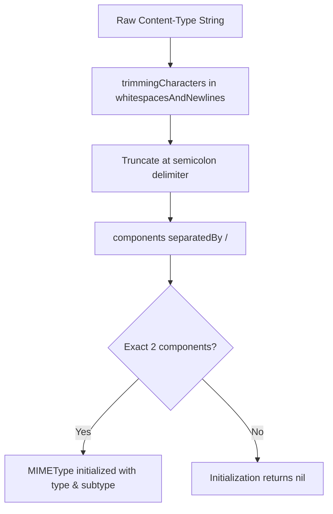

# Response Validation

<details>
<summary>Relevant source files</summary>

The following files were used as context for generating this wiki page:

- [Source/Features/Validation.swift](https://github.com/Alamofire/Alamofire/blob/main/Source/Features/Validation.swift)
- [Tests/ValidationTests.swift](https://github.com/Alamofire/Alamofire/blob/main/Tests/ValidationTests.swift)
- [docs/docsets/Alamofire.docset/Contents/Resources/Documents/Classes/DataRequest.html](https://github.com/Alamofire/Alamofire/blob/main/docs/docsets/Alamofire.docset/Contents/Resources/Documents/Classes/DataRequest.html)
</details>

## Overview

Response validation provides a mechanism to inspect server responses and ensure that incoming status codes and content types satisfy expected criteria before response serializers process the payload. By chaining validation handlers onto request instances, developers can automatically catch unexpected server states and propagate descriptive `AFError` instances through the request pipeline.

Sources: [Source/Features/Validation.swift:27-142](https://github.com/Alamofire/Alamofire/blob/main/Source/Features/Validation.swift#L27-L142), [Tests/ValidationTests.swift:29-141](https://github.com/Alamofire/Alamofire/blob/main/Tests/ValidationTests.swift#L29-L141)

## Validation Public API Surface

### Validation Public Surface

The public API surface for validation is exposed via extension methods on `DataRequest` (alongside parallel extensions on `DownloadRequest` and `DataStreamRequest`), enabling fluent method chaining to enforce response correctness. These methods allow developers to attach status code checks, acceptable content type constraints, custom validation closures, or trigger default validation rules directly within the request builder chain.

> [!NOTE]
> All validation chaining methods are marked with `@discardableResult`, allowing them to be attached directly to request builders without capturing the intermediate return value.

| Method Signature | Parameters | Return Type | Description |
| :--- | :--- | :--- | :--- |
| `validate(_ validation: @escaping Validation)` | `validation`: `DataRequest.Validation` closure taking `URLRequest?`, `HTTPURLResponse`, and `Data?` | `Self` | Validates the request using a custom closure. |
| `validate<S: Sequence>(statusCode acceptableStatusCodes: S)` | `acceptableStatusCodes`: Any `Sequence` of `Int` status codes conforming to `Sendable` | `Self` | Validates that the response has a status code contained within the provided sequence. |
| `validate<S: Sequence>(contentType acceptableContentTypes: @escaping @Sendable @autoclosure () -> S)` | `acceptableContentTypes`: An autoclosure returning a sequence of `String` content types | `Self` | Validates that the response content type matches one of the specified acceptable types or wildcards. |
| `validate()` | None | `Self` | Validates that the status code falls within the default acceptable range (`200..<300`) and the content type matches the `Accept` HTTP header. |

Sources: [Source/Features/Validation.swift:146-194](https://github.com/Alamofire/Alamofire/blob/main/Source/Features/Validation.swift#L146-L194), [docs/docsets/Alamofire.docset/Contents/Resources/Documents/Classes/DataRequest.html:647-699](https://github.com/Alamofire/Alamofire/blob/main/docs/docsets/Alamofire.docset/Contents/Resources/Documents/Classes/DataRequest.html#L647-L699)

### Call-Chain Execution Walkthrough

When a developer invokes a convenience validation method like `validate(statusCode:)` on a `DataRequest`, the request delegates execution through an internal chaining flow:

1. `validate(statusCode:acceptableStatusCodes)` calls the underlying closure-accepting overload `validate(_ validation: Validation)`.
2. Within this closure, `self.validate(statusCode:acceptableStatusCodes, response:response)` is executed against the incoming `HTTPURLResponse`.
3. The helper method checks whether `acceptableStatusCodes.contains(response.statusCode)` evaluates to true.
4. **Decisive Branch:** If true, it returns `.success(())`. If false, it constructs an `.unacceptableStatusCode(code:)` error reason inside an `AFError.responseValidationFailed(reason:)` wrapper and returns `.failure(...)`.
5. The resulting `ValidationResult` is handed down to the response handler pipeline, where subsequent response serializers inspect the state before executing.

Sources: [Source/Features/Validation.swift:81-91](https://github.com/Alamofire/Alamofire/blob/main/Source/Features/Validation.swift#L81-L91), [Source/Features/Validation.swift:158-164](https://github.com/Alamofire/Alamofire/blob/main/Source/Features/Validation.swift#L158-L164)

### Full Worked Example

The following example demonstrates chaining multiple public validation methods onto a `DataRequest` before passing the validated payload into a `responseDecodable` completion handler:

```swift
AF.request("https://httpbin.org/json")
    .validate(statusCode: 200..<300)
    .validate(contentType: ["application/json"])
    .validate { request, response, data in
        // Custom validation closure inspecting the payload directly
        guard let data, !data.isEmpty else {
            let reason = AFError.ResponseValidationFailureReason.dataFileNil
            return .failure(AFError.responseValidationFailed(reason: reason))
        }
        return .success(())
    }
    .responseDecodable(of: MyModel.self) { response in
        switch response.result {
        case .success(let model):
            print("Successfully validated and decoded model: \(model)")
        case .failure(let error):
            print("Validation or decoding failed with error: \(error)")
        }
    }
```

Sources: [Source/Features/Validation.swift:146-194](https://github.com/Alamofire/Alamofire/blob/main/Source/Features/Validation.swift#L146-L194), [docs/docsets/Alamofire.docset/Contents/Resources/Documents/Classes/DataRequest.html:1438-1444](https://github.com/Alamofire/Alamofire/blob/main/docs/docsets/Alamofire.docset/Contents/Resources/Documents/Classes/DataRequest.html#L1438-L1444)

## Status Code Validation Mechanics

### Overview

Status code validation ensures that server responses fall within a predetermined set of HTTP status codes before data serialization executes. Alamofire provides dedicated validation methods across `DataRequest`, `DataStreamRequest`, and `DownloadRequest` that accept any conforming `Sequence` of integer status codes, ranging from single exact matches to continuous ranges or arbitrary collections.

Sources: [Source/Features/Validation.swift:81-91](https://github.com/Alamofire/Alamofire/blob/main/Source/Features/Validation.swift#L81-L91), [Source/Features/Validation.swift:158-164](https://github.com/Alamofire/Alamofire/blob/main/Source/Features/Validation.swift#L158-L164), [Source/Features/Validation.swift:210-214](https://github.com/Alamofire/Alamofire/blob/main/Source/Features/Validation.swift#L210-L214), [Source/Features/Validation.swift:265-269](https://github.com/Alamofire/Alamofire/blob/main/Source/Features/Validation.swift#L265-L269)

### Mechanics and Execution Flow

When a request executes, status code validation inspects the `HTTPURLResponse` property `statusCode` against the user-supplied sequence using the internal helper method `validate(statusCode:response:)`.

1. `validate(statusCode acceptableStatusCodes: S, response: HTTPURLResponse)` receives the sequence of integers and the response instance.
2. The method calls `acceptableStatusCodes.contains(response.statusCode)`.
3. **Decisive Branch:** If the sequence contains the code, the function returns `ValidationResult.success(())`. If the check fails, it wraps the code in an `ErrorReason.unacceptableStatusCode(code:)` enumeration case, nests it inside `AFError.responseValidationFailed(reason:)`, and returns `ValidationResult.failure(...)`.

Sources: [Source/Features/Validation.swift:81-91](https://github.com/Alamofire/Alamofire/blob/main/Source/Features/Validation.swift#L81-L91)

> [!NOTE]
> Passing an empty collection (such as `[]`) to `validate(statusCode:)` guarantees that every incoming response will fail validation, regardless of the server's HTTP status code.

Sources: [Source/Features/Validation.swift:81-91](https://github.com/Alamofire/Alamofire/blob/main/Source/Features/Validation.swift#L81-L91), [Tests/ValidationTests.swift:104-140](https://github.com/Alamofire/Alamofire/blob/main/Tests/ValidationTests.swift#L104-L140)

### Supported Sequence Types and Collections

Because status code parameters constrain `S.Iterator.Element == Int` and require `S: Sendable`, developers can supply various sequence types interchangeably across request builders.

| Sequence Type / Example | Target Values | Behavior |
| :--- | :--- | :--- |
| `200..<300` (`Range<Int>`) | `200` through `299` | Validates standard successful HTTP responses. |
| `[200, 201, 204]` (`Array<Int>`) | Exact discrete codes | Restricts acceptance to specific success states. |
| `[200]` (`Array<Int>`) | Exact match for OK | Rejects all other codes, including other 2xx responses. |
| `[]` (`Array<Int>`) | None | Unconditionally fails validation for all responses. |

Sources: [Source/Features/Validation.swift:158-164](https://github.com/Alamofire/Alamofire/blob/main/Source/Features/Validation.swift#L158-L164), [Tests/ValidationTests.swift:31-140](https://github.com/Alamofire/Alamofire/blob/main/Tests/ValidationTests.swift#L31-L140)

## Content Type Validation Logic

### Overview

Content type validation ensures that a server response's `Content-Type` header conforms to an acceptable set of MIME types before downstream handlers execute. Alamofire handles this via the nested `MIMEType` struct and associated validation methods on `DataRequest`, `DataStreamRequest`, and `DownloadRequest`.

Sources: [Source/Features/Validation.swift:35-65](https://github.com/Alamofire/Alamofire/blob/main/Source/Features/Validation.swift#L35-L65), [Source/Features/Validation.swift:175-179](https://github.com/Alamofire/Alamofire/blob/main/Source/Features/Validation.swift#L175-L179), [Source/Features/Validation.swift:225-229](https://github.com/Alamofire/Alamofire/blob/main/Source/Features/Validation.swift#L225-L229), [Source/Features/Validation.swift:280-293](https://github.com/Alamofire/Alamofire/blob/main/Source/Features/Validation.swift#L280-L293)

### Parsing and Matching Logic

The parsing process decomposes raw header strings into structured components, supporting parameters, wildcards, and exact subtype matches.



Sources: [Source/Features/Validation.swift:41-55](https://github.com/Alamofire/Alamofire/blob/main/Source/Features/Validation.swift#L41-L55)

The `matches(_:)` method evaluates compatibility across exact types, wildcard subtypes, wildcard main types, and universal wildcards.

| Match Case Pattern | Evaluated Condition | Example Match |
| :--- | :--- | :--- |
| `(mime.type, mime.subtype)` | Exact match on type and subtype | `application/json` matches `application/json` |
| `(mime.type, "*")` | Wildcard subtype | `application/json` matches `application/*` |
| `("*", mime.subtype)` | Wildcard main type | `application/json` matches `*/json` |
| `("*", "*")` | Universal wildcard | `application/json` matches `*/*` |

Sources: [Source/Features/Validation.swift:57-64](https://github.com/Alamofire/Alamofire/blob/main/Source/Features/Validation.swift#L57-L64)

### Execution Walkthrough

When `validate(contentType:response:)` or its overloaded variants execute, the validation pipeline follows a precise path:

1. `validate(contentType acceptableContentTypes: S, response: HTTPURLResponse)` attempts to read `response.mimeType` and initialize a `MIMEType(responseContentType)` instance.
2. **Missing MIME Type Branch:** If the response lacks a MIME type or initialization fails, the validator iterates over `acceptableContentTypes`, checking if any entry initializes successfully and satisfies `mimeType.isWildcard`. If a wildcard acceptable type exists, it returns `.success(())`; otherwise, it returns `.failure(AFError.responseValidationFailed(reason: .missingContentType(acceptableContentTypes:...)))`.
3. **Provided MIME Type Branch:** If a response MIME type is successfully parsed, the validator iterates over `acceptableContentTypes`, checking if any acceptable type initializes into an `acceptableMIMEType` where `acceptableMIMEType.matches(responseMIMEType)` evaluates to `true`.
4. If a match occurs, it returns `.success(())`. If no match is found, it returns `.failure(AFError.responseValidationFailed(reason: .unacceptableContentType(acceptableContentTypes:responseContentType:)))`.

Sources: [Source/Features/Validation.swift:105-141](https://github.com/Alamofire/Alamofire/blob/main/Source/Features/Validation.swift#L105-L141)

> [!NOTE]
> For `DataRequest` and `DownloadRequest`, empty responses (such as HTTP 204 No Content where data is nil or empty, or file size is zero) bypass content type validation entirely via `isEmpty` checks, succeeding automatically regardless of acceptable content type constraints.

Sources: [Source/Features/Validation.swift:95-103](https://github.com/Alamofire/Alamofire/blob/main/Source/Features/Validation.swift#L95-L103), [Source/Features/Validation.swift:281-292](https://github.com/Alamofire/Alamofire/blob/main/Source/Features/Validation.swift#L281-L292), [Tests/ValidationTests.swift:377-408](https://github.com/Alamofire/Alamofire/blob/main/Tests/ValidationTests.swift#L377-L408)

## Automatic and Custom Validation Options

### Overview

Alamofire provides both automated validation defaults and extensible custom closure hooks to inspect responses before serialization. Developers can trigger pre-configured checks or supply arbitrary evaluation closures across `DataRequest`, `DataStreamRequest`, and `DownloadRequest`.

Sources: [Source/Features/Validation.swift:146-194](https://github.com/Alamofire/Alamofire/blob/main/Source/Features/Validation.swift#L146-L194), [Source/Features/Validation.swift:196-244](https://github.com/Alamofire/Alamofire/blob/main/Source/Features/Validation.swift#L196-L244), [Source/Features/Validation.swift:248-308](https://github.com/Alamofire/Alamofire/blob/main/Source/Features/Validation.swift#L248-L308)

### Automatic Validation Defaults

Calling `.validate()` with no parameters on a `DataRequest` executes a composite check combining status code validation against the default acceptable range with content type validation derived from the request's `Accept` HTTP header field.

```swift
let contentTypes: @Sendable () -> [String] = { [unowned self] in
    acceptableContentTypes
}
return validate(statusCode: acceptableStatusCodes).validate(contentType: contentTypes())
```

Sources: [Source/Features/Validation.swift:188-193](https://github.com/Alamofire/Alamofire/blob/main/Source/Features/Validation.swift#L188-L193)

The internal default properties governing automatic validation resolve as follows:

| Property Name | Type | Default Value | Purpose |
| :--- | :--- | :--- | :--- |
| `acceptableStatusCodes` | `Range<Int>` | `200..<300` | Standard HTTP success range checked during automatic validation |
| `acceptableContentTypes` | `[String]` | Header components or `["*/*"]` | Content types extracted from the `Accept` header or falling back to a universal wildcard |

Sources: [Source/Features/Validation.swift:69-77](https://github.com/Alamofire/Alamofire/blob/main/Source/Features/Validation.swift#L69-L77)

### Custom Closure Validation Hooks

When built-in status and content type checks are insufficient, developers can provide custom validation closures matching the request type's `Validation` typealias. These closures receive request context, response headers, and payload references, returning a `ValidationResult`.

```swift
public typealias Validation = @Sendable (URLRequest?, HTTPURLResponse, Data?) -> ValidationResult
```

Sources: [Source/Features/Validation.swift:147-149](https://github.com/Alamofire/Alamofire/blob/main/Source/Features/Validation.swift#L147-L149)

> [!WARNING]
> When chaining multiple custom validators on a request, validation short-circuits upon encountering the first failure. Subsequent validators in the chain are ignored, and their closure bodies never execute.

Sources: [Tests/ValidationTests.swift:806-817](https://github.com/Alamofire/Alamofire/blob/main/Tests/ValidationTests.swift#L806-L817)

### Custom Validation Implementation Example

The following example demonstrates implementing custom validation extensions on `DataRequest` and `DownloadRequest` to enforce that non-empty payload data or valid local files exist before proceeding to response serialization.

```swift
private enum ValidationError: Error {
    case missingData, missingFile, fileReadFailed
}

extension DataRequest {
    func validateDataExists() -> Self {
        validate { _, _, data in
            guard data != nil else { return .failure(ValidationError.missingData) }
            return .success(())
        }
    }
}

extension DownloadRequest {
    func validateDataExists() -> Self {
        validate { [unowned self] _, _, _ in
            guard let validFileURL = fileURL else { return .failure(ValidationError.missingFile) }

            do {
                _ = try Data(contentsOf: validFileURL)
                return .success(())
            } catch {
                return .failure(ValidationError.fileReadFailed)
            }
        }
    }
}
```

Sources: [Source/Features/Validation.swift:248-292](https://github.com/Alamofire/Alamofire/blob/main/Source/Features/Validation.swift#L248-L292), [Tests/ValidationTests.swift:708-742](https://github.com/Alamofire/Alamofire/blob/main/Tests/ValidationTests.swift#L708-L742)

## Validation Error Handling and Lifecycle

### Overview

Validation failures flow through Alamofire via the `ValidationResult` typealias, defined as a standard Swift `Result<Void, any (Error & Sendable)>`. When any built-in validation step encounters an unacceptable status code, missing content type, or mismatched MIME type, it constructs a concrete `AFError` wrapping a specific `AFError.ResponseValidationFailureReason` and wraps it in a `.failure` case.

Sources: [Source/Features/Validation.swift:30-34](https://github.com/Alamofire/Alamofire/blob/main/Source/Features/Validation.swift#L30-L34), [Source/Features/Validation.swift:88-90](https://github.com/Alamofire/Alamofire/blob/main/Source/Features/Validation.swift#L88-L90), [Source/Features/Validation.swift:119-124](https://github.com/Alamofire/Alamofire/blob/main/Source/Features/Validation.swift#L119-L124)

### Validation Failure Call-Chain Execution

When a response arrives and validation executes, control flows through a precise sequence of evaluation and error packaging functions. 

1. `validate(statusCode:response:)` or `validate(contentType:response:)` evaluates the `HTTPURLResponse` properties against acceptable criteria.
2. Upon failure, it instantiates an `ErrorReason` enum case containing context such as the offending status code or sorted acceptable content types.
3. It packages the reason into `AFError.responseValidationFailed(reason:)`.
4. It wraps the `AFError` inside a `.failure` `ValidationResult` and returns it to the request handler chain.
5. Subsequent response handlers inspect `resp.error`, exposing the propagated `AFError` instance for inspection or downcasting.

Sources: [Source/Features/Validation.swift:81-91](https://github.com/Alamofire/Alamofire/blob/main/Source/Features/Validation.swift#L81-L91), [Source/Features/Validation.swift:119-141](https://github.com/Alamofire/Alamofire/blob/main/Source/Features/Validation.swift#L119-L141), [Tests/ValidationTests.swift:97-100](https://github.com/Alamofire/Alamofire/blob/main/Tests/ValidationTests.swift#L97-L100)

### Validation Error Reasons Reference

Alamofire defines specific underlying error reasons when response validation fails. Each maps to distinct failure conditions during status code or content type inspection.

| Error Reason Case | Associated Values | Trigger Condition |
| :--- | :--- | :--- |
| `unacceptableStatusCode` | `code: Int` | Response status code falls outside the provided acceptable sequence range |
| `missingContentType` | `acceptableContentTypes: [String]` | Response lacks a `Content-Type` header and no wildcard is acceptable |
| `unacceptableContentType` | `acceptableContentTypes: [String]`, `responseContentType: String` | Response MIME type does not match any acceptable content type pattern |
| `dataFileNil` | None | Download request validation expected a file URL but received `nil` |
| `dataFileReadFailed` | `at: URL` | Download request failed to read resource values or file contents from disk |

Sources: [Source/Features/Validation.swift:88-90](https://github.com/Alamofire/Alamofire/blob/main/Source/Features/Validation.swift#L88-L90), [Source/Features/Validation.swift:119-122](https://github.com/Alamofire/Alamofire/blob/main/Source/Features/Validation.swift#L119-L122), [Source/Features/Validation.swift:133-138](https://github.com/Alamofire/Alamofire/blob/main/Source/Features/Validation.swift#L133-L138), [Source/Features/Validation.swift:282-291](https://github.com/Alamofire/Alamofire/blob/main/Source/Features/Validation.swift#L282-L291)

> [!IMPORTANT]
> When content type validation fails due to missing or unacceptable types, Alamofire automatically sorts the `acceptableContentTypes` array alphabetically before embedding it into the `AFError` reason case. Tests asserting on error properties must compare against sorted collections.

Sources: [Source/Features/Validation.swift:120-120](https://github.com/Alamofire/Alamofire/blob/main/Source/Features/Validation.swift#L120-L120), [Source/Features/Validation.swift:134-135](https://github.com/Alamofire/Alamofire/blob/main/Source/Features/Validation.swift#L134-L135), [Tests/ValidationTests.swift:312-333](https://github.com/Alamofire/Alamofire/blob/main/Tests/ValidationTests.swift#L312-L333)

## Related

- [[Response Structure]]
- [[Error Handling]]

