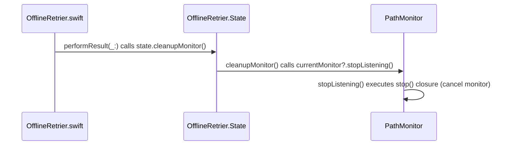

# Retry Policies

<details>
<summary>Relevant source files</summary>

The following files were used as context for generating this wiki page:

- [Source/Features/OfflineRetrier.swift](https://github.com/Alamofire/Alamofire/blob/main/Source/Features/OfflineRetrier.swift)
- [Source/Features/RetryPolicy.swift](https://github.com/Alamofire/Alamofire/blob/main/Source/Features/RetryPolicy.swift)
- [docs/docsets/Alamofire.docset/Contents/Resources/Documents/Protocols/RequestInterceptor.html](https://github.com/Alamofire/Alamofire/blob/main/docs/docsets/Alamofire.docset/Contents/Resources/Documents/Protocols/RequestInterceptor.html)
- [docs/Protocols/RequestInterceptor.html](https://github.com/Alamofire/Alamofire/blob/main/docs/Protocols/RequestInterceptor.html)
</details>

## Overview

Alamofire provides robust request retry mechanisms to handle transient network failures, server errors, and offline connectivity scenarios gracefully. Through customizable retry policies and network monitors, applications can automatically reattempt failed requests using calculated backoff strategies and reachability listeners without tightly coupling retry logic to business code.

Sources: [Source/Features/OfflineRetrier.swift:29-76](https://github.com/Alamofire/Alamofire/blob/main/Source/Features/OfflineRetrier.swift#L29-L76), [Source/Features/RetryPolicy.swift:27-403](https://github.com/Alamofire/Alamofire/blob/main/Source/Features/RetryPolicy.swift#L27-L403)

## RetryPolicy Core Interface and Defaults

### RetryPolicy Core Interface and Defaults

The `RetryPolicy` class serves as the concrete implementation of automatic request re-attempt behavior in Alamofire, conforming to the `@unchecked Sendable` and `RequestInterceptor` protocols. Structurally, `RequestInterceptor` inherits from both `RequestAdapter` and `RequestRetrier`, establishing a unified interface for modifying requests prior to dispatch and deciding whether to re-execute them after a failure.

Sources: [Source/Features/RetryPolicy.swift:29-29](https://github.com/Alamofire/Alamofire/blob/main/Source/Features/RetryPolicy.swift#L29-L29), [docs/Protocols/RequestInterceptor.html:577-577](https://github.com/Alamofire/Alamofire/blob/main/docs/Protocols/RequestInterceptor.html#L577-L577)

### Default Configuration Properties

`RetryPolicy` exposes several static constants that define its default limits, exponential backoff parameters, and criteria for retryable HTTP methods, HTTP status codes, and URL error codes.

| Constant Name | Type | Default Value | Purpose |
| --- | --- | --- | --- |
| `defaultRetryLimit` | `UInt` | `2` | Total number of times a request is allowed to be retried. |
| `defaultExponentialBackoffBase` | `UInt` | `2` | Base multiplier for exponential backoff calculations (must be at least 2). |
| `defaultExponentialBackoffScale` | `Double` | `0.5` | Scale factor applied to the computed backoff duration. |
| `defaultRetryableHTTPMethods` | `Set<HTTPMethod>` | `[.delete, .get, .head, .options, .put, .trace]` | Set of HTTP methods eligible for automatic retry. |
| `defaultRetryableHTTPStatusCodes` | `Set<Int>` | `[408, 500, 502, 503, 504]` | Set of HTTP status codes triggering a retry. |
| `defaultRetryableURLErrorCodes` | `Set<URLError.Code>` | See source code | Set of URL error codes (such as `.timedOut`, `.networkConnectionLost`, etc.) that trigger a retry. |

Sources: [Source/Features/RetryPolicy.swift:31-56](https://github.com/Alamofire/Alamofire/blob/main/Source/Features/RetryPolicy.swift#L31-L56)

> [!WARNING]
> The `exponentialBackoffBase` property is guarded by an explicit precondition check requiring its value to be greater than or equal to `2`. Passing a base value less than `2` triggers an immediate runtime precondition failure.

Sources: [Source/Features/RetryPolicy.swift:298-298](https://github.com/Alamofire/Alamofire/blob/main/Source/Features/RetryPolicy.swift#L298-L298)

### Execution Walkthrough and Decision Flow

When a request encounters an error, the session invokes the policy via `retry(_:for:dueTo:completion:)`. The evaluation path flows through specific checks to determine whether to execute a retry or abort:

1. **Retry Limit and Predicate Evaluation:** The method first evaluates `request.retryCount < retryLimit` alongside `shouldRetry(request:dueTo:)`.
2. **Method Filtering (`shouldRetry`)**: Extracts `request.request?.method` and checks if it exists within `retryableHTTPMethods`. If absent, it immediately returns `false`.
3. **Status Code Matching**: Checks if `request.response?.statusCode` matches any entry in `retryableHTTPStatusCodes`. If matched, it returns `true`.
4. **Error Code Extraction**: If no matching status code is present, it extracts the `URLError.Code` from either direct `URLError` casting or underlying AFError matching (`(error as? URLError)?.code ?? (error.asAFError?.underlyingError as? URLError)?.code`).
5. **URL Error Verification**: Validates whether the extracted error code resides within `retryableURLErrorCodes`.
6. **Completion Dispatch**: If all conditions succeed, `retry(_:for:dueTo:completion:)` computes the backoff delay via `pow(Double(exponentialBackoffBase), Double(request.retryCount)) * exponentialBackoffScale` and invokes `completion(.retryWithDelay(...))`. Otherwise, it invokes `completion(.doNotRetry)`.

Sources: [Source/Features/RetryPolicy.swift:308-339](https://github.com/Alamofire/Alamofire/blob/main/Source/Features/RetryPolicy.swift#L308-L339)

## ConnectionLostRetryPolicy Network Isolation

### ConnectionLostRetryPolicy Initialization and Configuration

`ConnectionLostRetryPolicy` inherits from `RetryPolicy` and specializes its parameters to target dropped network connections. By overriding the superclass initializer, it narrows its scope specifically to `.networkConnectionLost` while ignoring general status code errors.

| Parameter | Type | Default Value | Purpose |
| --- | --- | --- | --- |
| `retryLimit` | `UInt` | `RetryPolicy.defaultRetryLimit` (`2`) | Maximum number of allowed retry attempts. |
| `exponentialBackoffBase` | `UInt` | `RetryPolicy.defaultExponentialBackoffBase` (`2`) | Base multiplier for exponential backoff calculation. |
| `exponentialBackoffScale` | `Double` | `RetryPolicy.defaultExponentialBackoffScale` (`0.5`) | Scale factor applied to the backoff duration. |
| `retryableHTTPMethods` | `Set<HTTPMethod>` | `RetryPolicy.defaultRetryableHTTPMethods` | Allowed idempotent HTTP methods. |

Sources: [Source/Features/RetryPolicy.swift:380-403](https://github.com/Alamofire/Alamofire/blob/main/Source/Features/RetryPolicy.swift#L380-L403)

### Call-Chain Execution Walkthrough

When an active request fails due to connectivity loss, execution flows through specialized inheritance routing:

1. **Instantiation & Delegation**: `ConnectionLostRetryPolicy(retryLimit:exponentialBackoffBase:exponentialBackoffScale:retryableHTTPMethods:)` invokes `super.init(...)`.
2. **Superclass Parameter Injection**: Passes `retryLimit`, `exponentialBackoffBase`, `exponentialBackoffScale`, and `retryableHTTPMethods`, while explicitly locking `retryableHTTPStatusCodes` to an empty set (`[]`) and `retryableURLErrorCodes` to `[.networkConnectionLost]`.
3. **Interceptor Evaluation**: When a request fails, `retry(_:for:dueTo:completion:)` evaluates `request.retryCount < retryLimit` and delegates decision making to `shouldRetry(request:dueTo:)`.
4. **Method & Error Matching**: `shouldRetry` confirms the HTTP method is allowed and verifies that the error code matches `.networkConnectionLost`.
5. **Backoff and Completion**: If validated, `retry(_:for:dueTo:completion:)` calculates delay using `pow(Double(exponentialBackoffBase), Double(request.retryCount)) * exponentialBackoffScale` and invokes `completion(.retryWithDelay(...))`.

Sources: [Source/Features/RetryPolicy.swift:308-339](https://github.com/Alamofire/Alamofire/blob/main/Source/Features/RetryPolicy.swift#L308-L339), [Source/Features/RetryPolicy.swift:392-402](https://github.com/Alamofire/Alamofire/blob/main/Source/Features/RetryPolicy.swift#L392-L402)

> [!NOTE]
> `ConnectionLostRetryPolicy` passes an empty `Set<Int>` for `retryableHTTPStatusCodes`. Consequently, HTTP error status codes like `500` or `504` will never trigger a retry under this policy, isolating retries strictly to `.networkConnectionLost` URL errors.

Sources: [Source/Features/RetryPolicy.swift:400-400](https://github.com/Alamofire/Alamofire/blob/main/Source/Features/RetryPolicy.swift#L400-L400)

### RequestInterceptor Extension Factory Helpers

The `RequestInterceptor` protocol is extended to provide factory properties and static methods for `ConnectionLostRetryPolicy`:

* `ConnectionLostRetryPolicy.connectionLostRetryPolicy`: Provides a default `ConnectionLostRetryPolicy` instance.
* `ConnectionLostRetryPolicy.connectionLostRetryPolicy(retryLimit:exponentialBackoffBase:exponentialBackoffScale:retryableHTTPMethods:)`: Returns a customized `ConnectionLostRetryPolicy` configured with user-specified limits and methods.

Sources: [Source/Features/RetryPolicy.swift:405-430](https://github.com/Alamofire/Alamofire/blob/main/Source/Features/RetryPolicy.swift#L405-L430)

## OfflineRetrier Network Monitoring Lifecycle

### Overview

`OfflineRetrier` manages network reachability listener lifecycles via `NWPathMonitor` wrapper abstractions (`PathMonitor`) to coordinate request retries when connectivity is restored. When a request encounters an offline error, the retrier buffers pending completion blocks, instantiates and starts a path monitor on a dedicated dispatch queue (`org.alamofire.offlineRetrier.monitorQueue`), and establishes a timeout work item. Once reachability updates or a timeout occurs, monitor resources are torn down and completions are dispatched.

Sources: [Source/Features/OfflineRetrier.swift:29-61](https://github.com/Alamofire/Alamofire/blob/main/Source/Features/OfflineRetrier.swift#L29-L61), [Source/Features/OfflineRetrier.swift:121-180](https://github.com/Alamofire/Alamofire/blob/main/Source/Features/OfflineRetrier.swift#L121-L180), [Source/Features/OfflineRetrier.swift:245-283](https://github.com/Alamofire/Alamofire/blob/main/Source/Features/OfflineRetrier.swift#L245-L283)

### Call-Chain Execution Walkthrough (`PerformResult -> StopListening`)

When evaluating network outcome results or timing out, execution strictly follows the verified call chain `performResult` -> `cleanupMonitor` -> `stopListening`:

1. `performResult(_:)`: Initiated when path availability is confirmed or the maximum wait timer fires, acquiring a thread-safe write lock on `state`, extracting all `pendingCompletions`, calling `state.cleanupMonitor()`, and asynchronously dispatching the retry result to each completion handler.
Sources: [Source/Features/OfflineRetrier.swift:147-158](https://github.com/Alamofire/Alamofire/blob/main/Source/Features/OfflineRetrier.swift#L147-L158)
2. `cleanupMonitor()`: Invoked directly within `performResult` under the write lock, emptying `pendingCompletions.removeAll()`, cancelling `timeoutWorkItem?.cancel()` and setting it to `nil`, calling `currentMonitor?.stopListening()`, and clearing `currentMonitor = nil`.
Sources: [Source/Features/OfflineRetrier.swift:173-180](https://github.com/Alamofire/Alamofire/blob/main/Source/Features/OfflineRetrier.swift#L173-L180)
3. `stopListening()`: Called by `cleanupMonitor()`, executing the underlying `stop()` closure defined on `PathMonitor`, which invokes `pathMonitor.cancel()` and clears `pathMonitor.pathUpdateHandler`.
Sources: [Source/Features/OfflineRetrier.swift:260-262](https://github.com/Alamofire/Alamofire/blob/main/Source/Features/OfflineRetrier.swift#L260-L262), [Source/Features/OfflineRetrier.swift:278-281](https://github.com/Alamofire/Alamofire/blob/main/Source/Features/OfflineRetrier.swift#L278-L281)



Sources: [Source/Features/OfflineRetrier.swift:147-158](https://github.com/Alamofire/Alamofire/blob/main/Source/Features/OfflineRetrier.swift#L147-L158), [Source/Features/OfflineRetrier.swift:173-180](https://github.com/Alamofire/Alamofire/blob/main/Source/Features/OfflineRetrier.swift#L173-L180), [Source/Features/OfflineRetrier.swift:260-262](https://github.com/Alamofire/Alamofire/blob/main/Source/Features/OfflineRetrier.swift#L260-L262)

> [!WARNING]
> `OfflineRetrier` reuses its dedicated serial queue `org.alamofire.offlineRetrier.monitorQueue` both for scheduling path updates and for executing timeout work items via `asyncAfter`. Re-entrant locking or synchronous dispatches on this queue from within monitor callbacks will result in deadlocks.

Sources: [Source/Features/OfflineRetrier.swift:49-49](https://github.com/Alamofire/Alamofire/blob/main/Source/Features/OfflineRetrier.swift#L49-L49), [Source/Features/OfflineRetrier.swift:164-172](https://github.com/Alamofire/Alamofire/blob/main/Source/Features/OfflineRetrier.swift#L164-L172)

### Component Properties and Constants Reference

| Property Name | Type | Default Value | Purpose |
| --- | --- | --- | --- |
| `defaultWait` | `DispatchTimeInterval` | `.seconds(5)` | Default duration to wait for connectivity restoration before timing out. |
| `defaultURLErrorOfflineCodes` | `Set<URLError.Code>` | `[.notConnectedToInternet]` | Default set of URL error codes classified as offline conditions. |
| `defaultIsOfflineError` | `@Sendable (any Error) -> Bool` | Checks underlying errors and `URLError.Code` | Predicate closure evaluating whether an error indicates offline status. |

Sources: [Source/Features/OfflineRetrier.swift:32-47](https://github.com/Alamofire/Alamofire/blob/main/Source/Features/OfflineRetrier.swift#L32-L47)

### Design Trade-Offs

| Design Choice | Benefit | Cost |
| --- | --- | --- |
| Dynamic `PathMonitor` re-instantiation per failure | Ensures fresh network path evaluation state for every independent failure event. | Allocates new monitor and queue resources per batch of concurrent offline failures. |
| Centralized `monitorQueue` serial dispatching | Serializes reachability callbacks and timeout checks, preventing race conditions. | Couples all offline monitor instances to a shared global serial queue. |
| Thread-safe `Protected<State>` wrapper | Prevents data races when appending completions or mutating monitoring state across threads. | Introduces synchronization overhead during retry evaluation and cleanup. |

Sources: [Source/Features/OfflineRetrier.swift:49-61](https://github.com/Alamofire/Alamofire/blob/main/Source/Features/OfflineRetrier.swift#L49-L61), [Source/Features/OfflineRetrier.swift:63-76](https://github.com/Alamofire/Alamofire/blob/main/Source/Features/OfflineRetrier.swift#L63-L76), [Source/Features/OfflineRetrier.swift:121-146](https://github.com/Alamofire/Alamofire/blob/main/Source/Features/OfflineRetrier.swift#L121-L146)

## RequestInterceptor Protocol Integration

### RequestInterceptor Protocol Integration

`RequestInterceptor` combines both `RequestAdapter` and `RequestRetrier` functionalities into a unified protocol. Both `RetryPolicy` and `OfflineRetrier` conform to `RequestInterceptor`, allowing them to be passed seamlessly wherever an interceptor is expected in a `Session` configuration.

Sources: [Source/Features/OfflineRetrier.swift:31-31](https://github.com/Alamofire/Alamofire/blob/main/Source/Features/OfflineRetrier.swift#L31-L31), [Source/Features/RetryPolicy.swift:29-29](https://github.com/Alamofire/Alamofire/blob/main/Source/Features/RetryPolicy.swift#L29-L29)

### Protocol Extensions and Factory Methods

Alamofire extends `RequestInterceptor` where `Self` matches specific policy types, providing convenient static properties and factory methods for clean initialization.

| Extension Target | Static Property / Method | Parameters | Return Type |
| --- | --- | --- | --- |
| `RetryPolicy` | `retryPolicy` | None | `RetryPolicy` |
| `RetryPolicy` | `retryPolicy(...)` | `retryLimit`, `exponentialBackoffBase`, `exponentialBackoffScale`, `retryableHTTPMethods`, `retryableHTTPStatusCodes`, `retryableURLErrorCodes` | `RetryPolicy` |
| `ConnectionLostRetryPolicy` | `connectionLostRetryPolicy` | None | `ConnectionLostRetryPolicy` |
| `ConnectionLostRetryPolicy` | `connectionLostRetryPolicy(...)` | `retryLimit`, `exponentialBackoffBase`, `exponentialBackoffScale`, `retryableHTTPMethods` | `ConnectionLostRetryPolicy` |
| `OfflineRetrier` | `offlineRetrier(...)` | `monitor`, `maximumWait`, `isOfflineError` | `OfflineRetrier` |
| `OfflineRetrier` | `offlineRetrier(...)` | `requiredInterfaceType`, `maximumWait`, `isOfflineError` | `OfflineRetrier` |
| `OfflineRetrier` | `offlineRetrier(...)` | `prohibitedInterfaceTypes`, `maximumWait`, `isOfflineError` | `OfflineRetrier` |

Sources: [Source/Features/OfflineRetrier.swift:184-243](https://github.com/Alamofire/Alamofire/blob/main/Source/Features/OfflineRetrier.swift#L184-L243), [Source/Features/RetryPolicy.swift:342-373](https://github.com/Alamofire/Alamofire/blob/main/Source/Features/RetryPolicy.swift#L342-L373), [Source/Features/RetryPolicy.swift:405-430](https://github.com/Alamofire/Alamofire/blob/main/Source/Features/RetryPolicy.swift#L405-L430)

> [!NOTE]
> Static factory methods on `RequestInterceptor` extensions rely on constrained protocol extensions (matching specific policy types), enabling dot-syntax shorthand like `.retryPolicy` or `.offlineRetrier()` when configuring a `Session`.

Sources: [Source/Features/OfflineRetrier.swift:184-184](https://github.com/Alamofire/Alamofire/blob/main/Source/Features/OfflineRetrier.swift#L184-L184), [Source/Features/RetryPolicy.swift:342-342](https://github.com/Alamofire/Alamofire/blob/main/Source/Features/RetryPolicy.swift#L342-L342), [Source/Features/RetryPolicy.swift:405-405](https://github.com/Alamofire/Alamofire/blob/main/Source/Features/RetryPolicy.swift#L405-L405)

## Transient Failure Handling Strategies

### Overview

Alamofire provides distinct retry strategies that process transient failures using either deterministic math-based backoff timers or event-driven system network path monitoring.

Sources: [Source/Features/OfflineRetrier.swift:31-31](https://github.com/Alamofire/Alamofire/blob/main/Source/Features/OfflineRetrier.swift#L31-L31), [Source/Features/RetryPolicy.swift:29-29](https://github.com/Alamofire/Alamofire/blob/main/Source/Features/RetryPolicy.swift#L29-L29)

### Decision Evaluation and Backoff Mechanisms

When a request encounters an error, the `retry(_:for:dueTo:completion:)` method evaluates whether the request qualifies for retry and calculates the delay before re-issuing the request. 

For standard `RetryPolicy` instances, backoff intervals are calculated using exponential backoff scaling:

$$\text{delay} = \text{exponentialBackoffBase}^{\text{request.retryCount}} \times \text{exponentialBackoffScale}$$

In code, this is calculated using `pow(Double(exponentialBackoffBase), Double(request.retryCount)) * exponentialBackoffScale`. 

In contrast, `OfflineRetrier` defers the completion callback until the system notifies `NWPathMonitor` that a network path is available (`.pathAvailable`), or until `maximumWait` expires (`.timeout`).

```
Request Failure
       │
       ├──► RetryPolicy / ConnectionLostRetryPolicy
       │          │
       │          ├──► Check: retryCount < retryLimit && shouldRetry()
       │          │          │
       │          │          ├──► True  ──► completion(.retryWithDelay(pow(base, count) * scale))
       │          │          └──► False ──► completion(.doNotRetry)
       │
       └──► OfflineRetrier
                  │
                  ├──► Check: isOfflineError(error)
                  │          │
                  │          ├──► False ──► completion(.doNotRetry)
                  │          └──► True  ──► Start NWPathMonitor + Timeout Timer
                  │                               │
                  │                               ├──► Path Available ──► completion(.retry)
                  │                               └──► Timeout        ──► completion(.doNotRetry)
```

Sources: [Source/Features/OfflineRetrier.swift:121-146](https://github.com/Alamofire/Alamofire/blob/main/Source/Features/OfflineRetrier.swift#L121-L146), [Source/Features/RetryPolicy.swift:308-317](https://github.com/Alamofire/Alamofire/blob/main/Source/Features/RetryPolicy.swift#L308-L317)

### Retry Policy Variant Comparison

The table below outlines the decision mechanisms, criteria, and delay models across Alamofire's retry implementations.

| Retrier Implementation | Retry Decision Criteria | Delay Calculation / Event Mechanism | Default Error Target |
| --- | --- | --- | --- |
| `RetryPolicy` | `request.retryCount < retryLimit` AND `shouldRetry(request:dueTo:)` evaluates `true` | `pow(Double(base), Double(count)) * scale` | HTTP Status Codes: `408`, `500`, `502`, `503`, `504`; `URLError` codes in `defaultRetryableURLErrorCodes` |
| `ConnectionLostRetryPolicy` | `request.retryCount < retryLimit` AND HTTP method is idempotent AND error is `.networkConnectionLost` | `pow(Double(base), Double(count)) * scale` | `URLError.networkConnectionLost` |
| `OfflineRetrier` | `isOfflineError(error)` evaluates `true` | Event-driven: waits for `NWPathMonitor` path status change (`.pathAvailable`) up to `maximumWait` | `URLError.notConnectedToInternet` |

Sources: [Source/Features/OfflineRetrier.swift:33-47](https://github.com/Alamofire/Alamofire/blob/main/Source/Features/OfflineRetrier.swift#L33-L47), [Source/Features/OfflineRetrier.swift:121-146](https://github.com/Alamofire/Alamofire/blob/main/Source/Features/OfflineRetrier.swift#L121-L146), [Source/Features/RetryPolicy.swift:50-56](https://github.com/Alamofire/Alamofire/blob/main/Source/Features/RetryPolicy.swift#L50-L56), [Source/Features/RetryPolicy.swift:58-241](https://github.com/Alamofire/Alamofire/blob/main/Source/Features/RetryPolicy.swift#L58-L241), [Source/Features/RetryPolicy.swift:308-317](https://github.com/Alamofire/Alamofire/blob/main/Source/Features/RetryPolicy.swift#L308-L317), [Source/Features/RetryPolicy.swift:380-403](https://github.com/Alamofire/Alamofire/blob/main/Source/Features/RetryPolicy.swift#L380-L403)

### Decision Call-Chain Execution

When `RetryPolicy.retry(_:for:dueTo:completion:)` executes, it evaluates request criteria through a specific call path:

1. **Limit Verification**: Checks if `request.retryCount < retryLimit`. If false, directly invokes `completion(.doNotRetry)`.
2. **Method Inspection**: `shouldRetry(request:dueTo:)` inspects `request.request?.method`. If `retryableHTTPMethods` does not contain the method, it returns `false`.
3. **HTTP Status Evaluation**: Inspects `request.response?.statusCode`. If present and contained within `retryableHTTPStatusCodes`, returns `true`.
4. **URLError Extraction**: If status code matching fails, extracts the error code via `(error as? URLError)?.code` or inspects underlying errors via `(error.asAFError?.underlyingError as? URLError)?.code`.
5. **URLError Evaluation**: Checks if the resolved `URLError.Code` exists within `retryableURLErrorCodes`.
6. **Backoff Math Execution**: If `shouldRetry` returns `true`, computes delay using `pow(Double(exponentialBackoffBase), Double(request.retryCount)) * exponentialBackoffScale` and invokes `completion(.retryWithDelay(delay))`.

Sources: [Source/Features/RetryPolicy.swift:308-340](https://github.com/Alamofire/Alamofire/blob/main/Source/Features/RetryPolicy.swift#L308-L340)

> [!WARNING]
> `ConnectionLostRetryPolicy` overrides `retryableHTTPStatusCodes` to an empty set (`[]`) and `retryableURLErrorCodes` to `[.networkConnectionLost]`. Passing a non-idempotent HTTP method (such as `POST`) will cause `shouldRetry()` to return `false`, bypassing retry.

Sources: [Source/Features/RetryPolicy.swift:326-327](https://github.com/Alamofire/Alamofire/blob/main/Source/Features/RetryPolicy.swift#L326-L327), [Source/Features/RetryPolicy.swift:380-403](https://github.com/Alamofire/Alamofire/blob/main/Source/Features/RetryPolicy.swift#L380-L403)

## Related

- [[Request Interceptors]]
- [[Network Reachability]]

