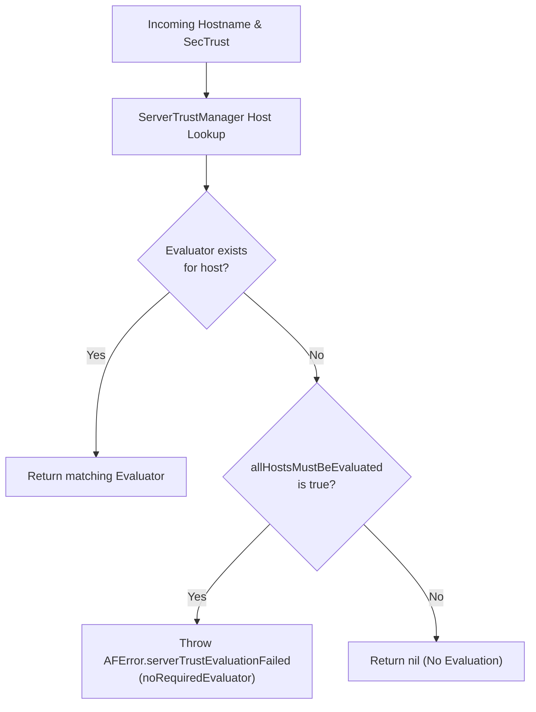
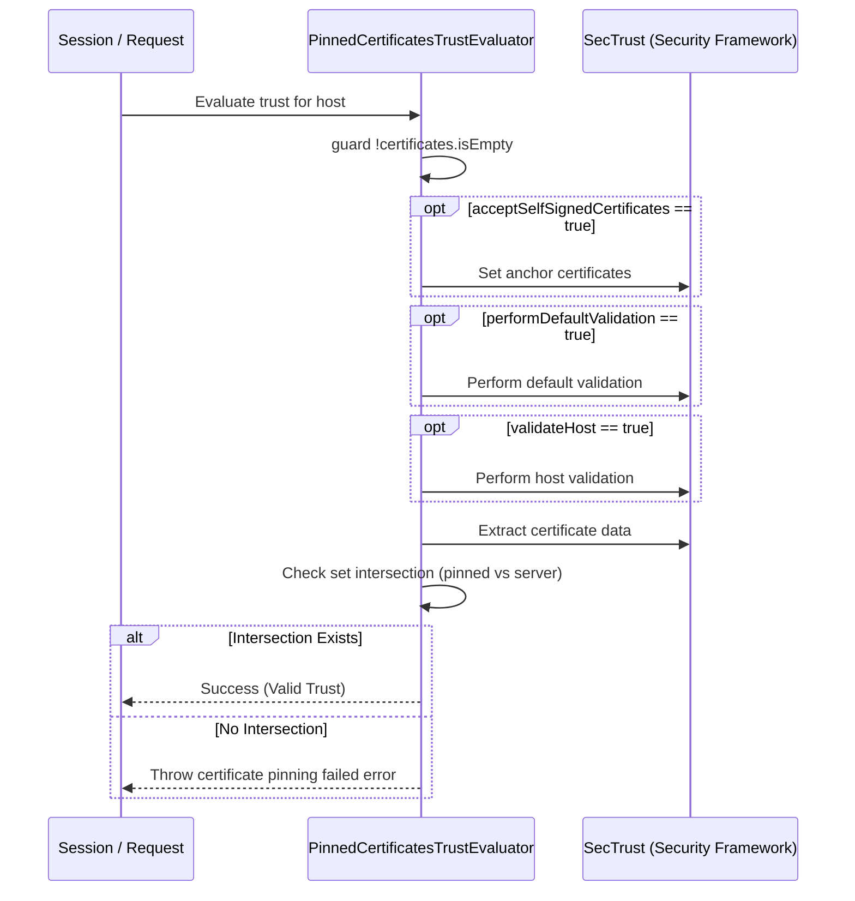

# Server Trust Evaluation

<details>
<summary>Relevant source files</summary>

The following files were used as context for generating this wiki page:

- [Source/Features/ServerTrustEvaluation.swift](https://github.com/Alamofire/Alamofire/blob/main/Source/Features/ServerTrustEvaluation.swift)
- [docs/Protocols/ServerTrustEvaluating.html](https://github.com/Alamofire/Alamofire/blob/main/docs/Protocols/ServerTrustEvaluating.html)
- [docs/docsets/Alamofire.docset/Contents/Resources/Documents/Protocols/ServerTrustEvaluating.html](https://github.com/Alamofire/Alamofire/blob/main/docs/docsets/Alamofire.docset/Contents/Resources/Documents/Protocols/ServerTrustEvaluating.html)
- [docs/docsets/Alamofire.docset/Contents/Resources/Documents/Classes/ServerTrustManager.html](https://github.com/Alamofire/Alamofire/blob/main/docs/docsets/Alamofire.docset/Contents/Resources/Documents/Classes/ServerTrustManager.html)
- [docs/docsets/Alamofire.docset/Contents/Resources/Documents/Classes.html](https://github.com/Alamofire/Alamofire/blob/main/docs/docsets/Alamofire.docset/Contents/Resources/Documents/Classes.html)
</details>

## Overview

Server Trust Evaluation in Alamofire provides a robust, extensible mechanism for validating TLS server certificate chains during network requests. Operating on Apple's `Security` framework primitives (`SecTrust`, `SecCertificate`, `SecKey`, and `SecPolicy`), this subsystem bridges network security challenges with application-level validation policies.
Sources: [Source/Features/ServerTrustEvaluation.swift:30-93](https://github.com/Alamofire/Alamofire/blob/main/Source/Features/ServerTrustEvaluation.swift#L30-L93)

By decoupling trust logic from network transport, developers can enforce precise cryptographic guarantees—such as default OS validation, strict certificate pinning, public key hashing, and certificate revocation checks—on a per-host basis.
Sources: [Source/Features/ServerTrustEvaluation.swift:30-93](https://github.com/Alamofire/Alamofire/blob/main/Source/Features/ServerTrustEvaluation.swift#L30-L93)

The architecture centers around the protocol governing trust evaluation. The `ServerTrustManager` class coordinates host-to-evaluator mappings, ensuring that requests to different endpoints (e.g., a production API versus a staging environment or third-party web service) adhere to appropriate security constraints. If a host lacks an explicit evaluator mapping, `ServerTrustManager` consults its `allHostsMustBeEvaluated` configuration flag to determine whether to enforce fallback behavior or throw an error.
Sources: [Source/Features/ServerTrustEvaluation.swift:30-93](https://github.com/Alamofire/Alamofire/blob/main/Source/Features/ServerTrustEvaluation.swift#L30-L93)

By encapsulating complex CoreFoundation security interactions into type-safe Swift APIs and extensions on `SecTrust` and `SecPolicy`, Alamofire mitigates common man-in-the-middle (MITM) vulnerabilities. This design allows applications to adopt advanced security postures—such as pinning specific certificates or keys embedded within the app bundle—while providing graceful error reporting when validation fails.
Sources: [Source/Features/ServerTrustEvaluation.swift:30-93](https://github.com/Alamofire/Alamofire/blob/main/Source/Features/ServerTrustEvaluation.swift#L30-L93)

## Host Mapping and `ServerTrustManager`

The `ServerTrustManager` class is responsible for managing the mapping between specific host strings and their corresponding evaluator implementations. Because modern mobile applications frequently communicate with multiple distinct backend services, each potentially utilizing different leaf, intermediate, or root certificates, per-host policy mapping is essential for maintaining flexible security boundaries.
Sources: [Source/Features/ServerTrustEvaluation.swift:31-77](https://github.com/Alamofire/Alamofire/blob/main/Source/Features/ServerTrustEvaluation.swift#L31-L77)

During a network challenge, the session queries `ServerTrustManager` using the target hostname. The manager inspects its internal `evaluators` dictionary. If a matching evaluator is found, it is returned to perform the validation. If no matching evaluator exists for the host, the manager evaluates the `allHostsMustBeEvaluated` boolean property. When `allHostsMustBeEvaluated` is set to `true` (the default), an error is thrown with a `.noRequiredEvaluator(host: host)` reason; otherwise, it returns `nil`.
Sources: [Source/Features/ServerTrustEvaluation.swift:31-77](https://github.com/Alamofire/Alamofire/blob/main/Source/Features/ServerTrustEvaluation.swift#L31-L77)


Sources: [Source/Features/ServerTrustEvaluation.swift:31-77](https://github.com/Alamofire/Alamofire/blob/main/Source/Features/ServerTrustEvaluation.swift#L31-L77)

> [!IMPORTANT]
> When `allHostsMustBeEvaluated` is `true`, attempting to connect to any host without an explicitly registered evaluator will fail at the trust evaluation phase. Ensure all target domains are mapped or `allHostsMustBeEvaluated` is explicitly set to `false` if unmapped hosts should bypass custom evaluation.
Sources: [Source/Features/ServerTrustEvaluation.swift:31-77](https://github.com/Alamofire/Alamofire/blob/main/Source/Features/ServerTrustEvaluation.swift#L31-L77)

## The Trust Evaluation Protocol

At the core of Alamofire's security subsystem lies the trust evaluation protocol, which conforms to `Sendable` to ensure safe concurrent execution across asynchronous tasks. The protocol declares a throwing method accepting a CoreFoundation `SecTrust` reference and the target `String` host.
Sources: [Source/Features/ServerTrustEvaluation.swift:79-93](https://github.com/Alamofire/Alamofire/blob/main/Source/Features/ServerTrustEvaluation.swift#L79-L93)

```swift
public protocol ServerTrustEvaluating: Sendable {
    #if !canImport(Security)
    // Implement this once other platforms have API for evaluating server trusts.
    #else
    func evaluate(_ trust: SecTrust, forHost host: String) throws
    #endif
}
```
Sources: [Source/Features/ServerTrustEvaluation.swift:79-93](https://github.com/Alamofire/Alamofire/blob/main/Source/Features/ServerTrustEvaluation.swift#L79-L93)

Conforming types implement this method to execute custom validation logic, throwing an error whenever a certificate chain, public key, or hostname fails validation.
Sources: [Source/Features/ServerTrustEvaluation.swift:79-93](https://github.com/Alamofire/Alamofire/blob/main/Source/Features/ServerTrustEvaluation.swift#L79-L93)

## Built-In Trust Evaluators

Alamofire provides several concrete implementations of trust evaluators, each tailored for different security requirements and deployment scenarios.
Sources: [Source/Features/ServerTrustEvaluation.swift:98-448](https://github.com/Alamofire/Alamofire/blob/main/Source/Features/ServerTrustEvaluation.swift#L98-L448)

| Evaluator Class | Description | Default Parameters |
| :--- | :--- | :--- |
| `DefaultTrustEvaluator` | Uses standard OS trust evaluation and optional hostname validation. | `validateHost: true` |
| `RevocationTrustEvaluator` | Validates trust chains and checks certificate revocation status via OCSP or CRL. | `performDefaultValidation: true`, `validateHost: true`, `options: .any` |
| `PinnedCertificatesTrustEvaluator` | Validates server trust against specific certificate data files bundled with the app. | `certificates: Bundle.main.af.certificates`, `acceptSelfSignedCertificates: false`, `performDefaultValidation: true`, `validateHost: true` |
| `PublicKeysTrustEvaluator` | Validates server trust by matching server public keys against bundled `SecKey` objects. | `keys: Bundle.main.af.publicKeys`, `performDefaultValidation: true`, `validateHost: true` |
| `CompositeTrustEvaluator` | Chains multiple evaluators together; all must succeed for validation to pass. | `evaluators: [any ServerTrustEvaluating]` |
| `DisabledTrustEvaluator` | Bypasses all trust evaluation, considering any server trust valid. | *None* |
Sources: [Source/Features/ServerTrustEvaluation.swift:98-448](https://github.com/Alamofire/Alamofire/blob/main/Source/Features/ServerTrustEvaluation.swift#L98-L448)

> [!CAUTION]
> `DisabledTrustEvaluator` and setting `acceptSelfSignedCertificates: true` in `PinnedCertificatesTrustEvaluator` completely disable cryptographic verification protections. They **must never** be used in production environments as they leave applications vulnerable to active Man-in-the-Middle (MITM) attacks.
Sources: [Source/Features/ServerTrustEvaluation.swift:98-448](https://github.com/Alamofire/Alamofire/blob/main/Source/Features/ServerTrustEvaluation.swift#L98-L448)

## Execution Walkthrough: `PinnedCertificatesTrustEvaluator`

To understand how evaluators interact with the underlying Security framework, consider the execution flow of `PinnedCertificatesTrustEvaluator`.
Sources: [Source/Features/ServerTrustEvaluation.swift:258-284](https://github.com/Alamofire/Alamofire/blob/main/Source/Features/ServerTrustEvaluation.swift#L258-L284)

1. **Certificate Availability Check:** The evaluator first inspects its `certificates` array. If the array is empty, it immediately throws an error indicating no certificates were found.
Sources: [Source/Features/ServerTrustEvaluation.swift:258-262](https://github.com/Alamofire/Alamofire/blob/main/Source/Features/ServerTrustEvaluation.swift#L258-L262)
2. **Anchor Configuration (Optional):** If `acceptSelfSignedCertificates` is `true`, anchor certificates are updated on the trust object. This replaces system anchors and configures the trust object to trust only the provided certificate array as anchor roots.
Sources: [Source/Features/ServerTrustEvaluation.swift:263-266](https://github.com/Alamofire/Alamofire/blob/main/Source/Features/ServerTrustEvaluation.swift#L263-L266)
3. **Default Validation:** If `performDefaultValidation` is `true`, standard SSL policy evaluation executes against the trust object.
Sources: [Source/Features/ServerTrustEvaluation.swift:267-270](https://github.com/Alamofire/Alamofire/blob/main/Source/Features/ServerTrustEvaluation.swift#L267-L270)
4. **Host Validation:** If `validateHost` is `true`, hostname-specific validation applies to verify that the certificate matches the target domain.
Sources: [Source/Features/ServerTrustEvaluation.swift:271-274](https://github.com/Alamofire/Alamofire/blob/main/Source/Features/ServerTrustEvaluation.swift#L271-L274)
5. **Pinning Comparison:** The evaluator extracts certificate data from both the server trust chain and the pinned collection, converting them into `Set` structures. It computes whether the sets intersect. If no intersection is found, pinning failure is thrown.
Sources: [Source/Features/ServerTrustEvaluation.swift:275-284](https://github.com/Alamofire/Alamofire/blob/main/Source/Features/ServerTrustEvaluation.swift#L275-L284)


Sources: [Source/Features/ServerTrustEvaluation.swift:258-284](https://github.com/Alamofire/Alamofire/blob/main/Source/Features/ServerTrustEvaluation.swift#L258-L284)

## Revocation Options and Policy Constants

`RevocationTrustEvaluator` accepts an `Options` option set that wraps CoreFoundation revocation policy constants. These options configure how Apple's security APIs check whether server certificates have been revoked by their issuing Certificate Authority (CA).
Sources: [Source/Features/ServerTrustEvaluation.swift:128-143](https://github.com/Alamofire/Alamofire/blob/main/Source/Features/ServerTrustEvaluation.swift#L128-L143)

| Option Constant | Raw Value Binding | Purpose |
| :--- | :--- | :--- |
| `RevocationTrustEvaluator.Options.crl` | `kSecRevocationCRLMethod` | Perform revocation checking using the CRL (Certification Revocation List) method. |
| `RevocationTrustEvaluator.Options.networkAccessDisabled` | `kSecRevocationNetworkAccessDisabled` | Consult only locally cached replies; do not initiate network access. |
| `RevocationTrustEvaluator.Options.ocsp` | `kSecRevocationOCSPMethod` | Perform revocation checking using OCSP (Online Certificate Status Protocol). |
| `RevocationTrustEvaluator.Options.preferCRL` | `kSecRevocationPreferCRL` | Prefer CRL revocation checking over OCSP (OCSP is preferred by default). |
| `RevocationTrustEvaluator.Options.requirePositiveResponse` | `kSecRevocationRequirePositiveResponse` | Require a positive response to pass; failure to reach the revocation server is considered fatal. |
| `RevocationTrustEvaluator.Options.any` | `kSecRevocationUseAnyAvailableMethod` | Perform either OCSP or CRL checking according to certificate specifications and `preferCRL`. |
Sources: [Source/Features/ServerTrustEvaluation.swift:128-143](https://github.com/Alamofire/Alamofire/blob/main/Source/Features/ServerTrustEvaluation.swift#L128-L143)

## Composite Evaluation and Array Extensions

Alamofire extends arrays of evaluators to support composite validation workflows. The `CompositeTrustEvaluator` delegates its evaluation directly to an internal array of evaluators using an extension on collections of evaluators:
Sources: [Source/Features/ServerTrustEvaluation.swift:403-468](https://github.com/Alamofire/Alamofire/blob/main/Source/Features/ServerTrustEvaluation.swift#L403-L468)

```swift
extension [ServerTrustEvaluating] {
    public func evaluate(_ trust: SecTrust, forHost host: String) throws {
        for evaluator in self {
            try evaluator.evaluate(trust, forHost: host)
        }
    }
}
```
Sources: [Source/Features/ServerTrustEvaluation.swift:452-468](https://github.com/Alamofire/Alamofire/blob/main/Source/Features/ServerTrustEvaluation.swift#L452-L468)

During evaluation, each evaluator in the array executes sequentially. If any evaluator throws an error, the chain terminates immediately and the error propagates up to the caller. This enables modular security policies, such as combining default certificate validation with strict public key pinning and revocation checks.
Sources: [Source/Features/ServerTrustEvaluation.swift:403-468](https://github.com/Alamofire/Alamofire/blob/main/Source/Features/ServerTrustEvaluation.swift#L403-L468)

## Design Trade-Offs

The architecture of Alamofire's Server Trust Evaluation subsystem balances security rigor against operational flexibility through distinct design choices:
Sources: [Source/Features/ServerTrustEvaluation.swift:30-497](https://github.com/Alamofire/Alamofire/blob/main/Source/Features/ServerTrustEvaluation.swift#L30-L497)

| Design Choice | Benefit | Cost |
| :--- | :--- | :--- |
| **Protocol-Oriented Evaluators** | High extensibility; allows custom, domain-specific validation rules beyond built-in classes. | Requires boilerplate implementation for custom verification logic. |
| **Per-Host Dictionary Mapping (`ServerTrustManager`)** | Granular security control; different endpoints can enforce pinning, default validation, or disabled checks independently. | Requires explicit configuration for every target domain when `allHostsMustBeEvaluated` is enabled. |
| **Direct Security Framework Wrapping (`SecTrust`, `SecPolicy`)** | Leverages native, highly optimized OS-level cryptographic routines. | Platform-dependent implementation requiring conditional compilation (`#if canImport(Security)`). |
| **Set Intersection Pinning (`PinnedCertificatesTrustEvaluator`)** | Simple, efficient validation of certificate data without manual chain traversal. | Strict binary matching requires application updates whenever server certificates rotate. |
Sources: [Source/Features/ServerTrustEvaluation.swift:30-497](https://github.com/Alamofire/Alamofire/blob/main/Source/Features/ServerTrustEvaluation.swift#L30-L497)

## Usage Example

The following example demonstrates how to configure a custom `Session` with a `ServerTrustManager` that applies certificate pinning to a production domain while using default evaluation for a staging server.
Sources: [Source/Features/ServerTrustEvaluation.swift:31-52](https://github.com/Alamofire/Alamofire/blob/main/Source/Features/ServerTrustEvaluation.swift#L31-L52)

```swift
import Alamofire
import Foundation

// 1. Load bundled certificates for pinning
let evaluators: [String: any ServerTrustEvaluating] = [
    "api.example.com": PinnedCertificatesTrustEvaluator(
        certificates: Bundle.main.af.certificates,
        acceptSelfSignedCertificates: false,
        performDefaultValidation: true,
        validateHost: true
    ),
    "staging.example.com": DefaultTrustEvaluator(validateHost: true)
]

// 2. Initialize the ServerTrustManager
let trustManager = ServerTrustManager(
    allHostsMustBeEvaluated: true,
    evaluators: evaluators
)

// 3. Configure the Session with the trust manager
let session = Session(serverTrustManager: trustManager)

// 4. Perform a network request using the custom session
session.request("https://api.example.com/data")
    .validate()
    .responseDecodable(of: MyModel.self) { response in
        switch response.result {
        case .success(let model):
            print("Successfully fetched model with verified trust: \(model)")
        case .failure(let error):
            print("Request failed due to trust evaluation or network error: \(error)")
        }
    }
```
Sources: [Source/Features/ServerTrustEvaluation.swift:31-52](https://github.com/Alamofire/Alamofire/blob/main/Source/Features/ServerTrustEvaluation.swift#L31-L52)

## Related

- [[Session Management]]

