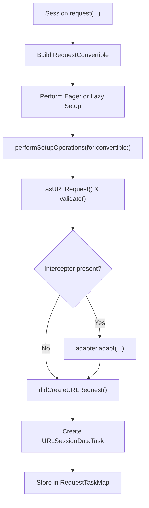
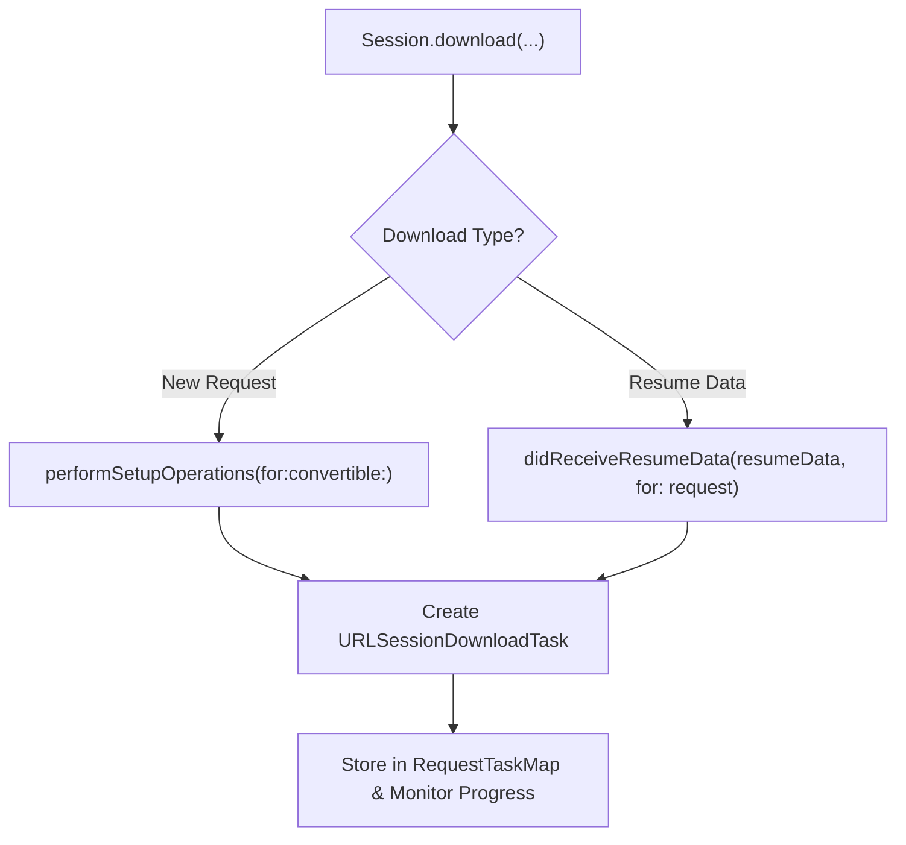
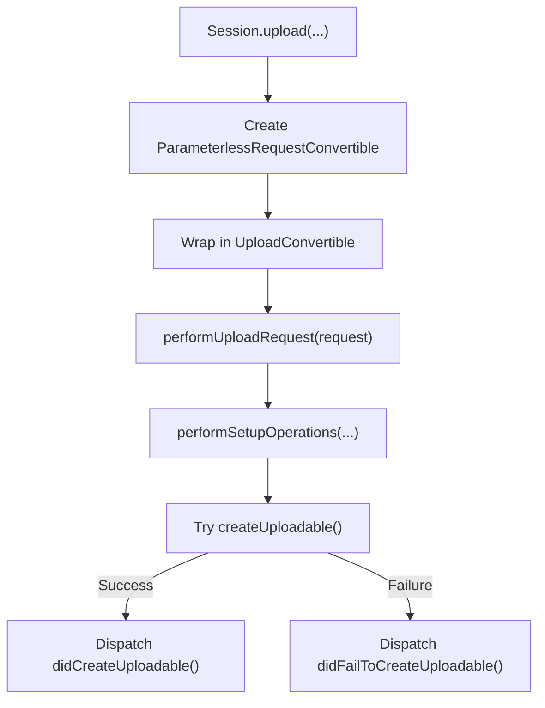

# Session And Requests

<details>
<summary>Relevant source files</summary>

The following files were used as context for generating this wiki page:

- [Source/Core/Session.swift](https://github.com/Alamofire/Alamofire/blob/main/Source/Core/Session.swift)
- [docs/Classes/Session.html](https://github.com/Alamofire/Alamofire/blob/main/docs/Classes/Session.html)
</details>

## Overview

### Overview Introduction

Alamofire's `Session` class and its associated request types form the backbone of the framework's networking architecture. Acting as a high-level wrapper and coordinator around Apple's `URLSession` and `URLSessionTask`, `Session` creates, tracks, and manages the entire lifecycle of all request variants (`DataRequest`, `DataStreamRequest`, `DownloadRequest`, `UploadRequest`, and `WebSocketRequest`). It centralizes cross-cutting concerns such as request interception, server trust evaluation, redirect handling, response caching, event monitoring, and concurrency management across serial dispatch queues.

Sources: [Source/Core/Session.swift:27-30](https://github.com/Alamofire/Alamofire/blob/main/Source/Core/Session.swift#L27-L30), [docs/Classes/Session.html:582-584](https://github.com/Alamofire/Alamofire/blob/main/docs/Classes/Session.html#L582-L584)

The system is designed around clean separation of concerns, decoupling parameter encoding, request adaptation, transport dispatch, validation, response serialization, and retry logic. By maintaining a thread-safe internal registry (`MutableState`) protected via synchronization primitives, `Session` maps active `Request` instances to underlying `URLSessionTask`s. This architecture eliminates race conditions between rapid state changes (such as resume, suspend, and cancel) while providing developers with expressive, type-safe APIs for every category of HTTP and streaming data transfer.

Sources: [Source/Core/Session.swift:89-98](https://github.com/Alamofire/Alamofire/blob/main/Source/Core/Session.swift#L89-L98), [Source/Core/Session.swift:1291-1301](https://github.com/Alamofire/Alamofire/blob/main/Source/Core/Session.swift#L1291-L1301)

---

## Data Requests

### Data Requests Overview

Data requests (`DataRequest`) handle standard HTTP interactions where the response payload is accumulated into memory as raw `Data` or deserialized into domain models. `Session` exposes multiple overloads for creating `DataRequest` instances, accepting raw parameters, `Encodable` models, or fully custom `URLRequestConvertible` types.

Sources: [docs/Classes/Session.html:1625-1627](https://github.com/Alamofire/Alamofire/blob/main/docs/Classes/Session.html#L1625-L1627), [docs/Classes/Session.html:1769-1772](https://github.com/Alamofire/Alamofire/blob/main/docs/Classes/Session.html#L1769-L1772)

When a data request is initiated, parameters are encoded into the outgoing `URLRequest` via a `ParameterEncoder` or `ParameterEncoding` implementation. If an interceptor is present on the session or request, the initial request passes through request adapters before task creation.

Sources: [Source/Core/Session.swift:318-334](https://github.com/Alamofire/Alamofire/blob/main/Source/Core/Session.swift#L318-L334), [Source/Core/Session.swift:1265-1286](https://github.com/Alamofire/Alamofire/blob/main/Source/Core/Session.swift#L1265-L1286)



Sources: [Source/Core/Session.swift:318-407](https://github.com/Alamofire/Alamofire/blob/main/Source/Core/Session.swift#L318-L407), [Source/Core/Session.swift:1199-1203](https://github.com/Alamofire/Alamofire/blob/main/Source/Core/Session.swift#L1199-L1203)

### Request Construction APIs

`Session` provides several entry points for creating `DataRequest` instances depending on the parameter type and encoding requirements.

| API Signature | Purpose / Parameter Source | Default Value | Sources |
|---|---|---|---|
| `request(_:method:parameters:encoding:headers:interceptor:shouldAutomaticallyResume:requestModifier:)` | Traditional dictionary-based parameters (`Parameters` / `[String: Any]`) | `GET`, `URLEncoding.default`, `nil` | [Source/Core/Session.swift:318-334](https://github.com/Alamofire/Alamofire/blob/main/Source/Core/Session.swift#L318-L334) |
| `request(_:method:parameters:encoder:headers:interceptor:shouldAutomaticallyResume:requestModifier:)` | Generic `Encodable` parameters | `GET`, `URLEncodedFormParameterEncoder.default`, `nil` | [Source/Core/Session.swift:367-383](https://github.com/Alamofire/Alamofire/blob/main/Source/Core/Session.swift#L367-L383) |
| `request(_:interceptor:shouldAutomaticallyResume:)` | Direct prebuilt `URLRequestConvertible` implementation | `nil` interceptor | [Source/Core/Session.swift:393-407](https://github.com/Alamofire/Alamofire/blob/main/Source/Core/Session.swift#L393-L407) |

> [!NOTE]
> All data requests default to `.lazy` setup timing in Alamofire 5.11+, meaning lifetime methods and task creation are deferred until `.resume()` is explicitly called or a response handler is attached (if `startRequestsImmediately` is enabled).

Sources: [Source/Core/Session.swift:35-45](https://github.com/Alamofire/Alamofire/blob/main/Source/Core/Session.swift#L35-L45), [Source/Core/Session.swift:393-407](https://github.com/Alamofire/Alamofire/blob/main/Source/Core/Session.swift#L393-L407)

---

## Data Stream Requests

### Data Stream Requests Overview

Data stream requests (`DataStreamRequest`) are designed for chunked or streaming HTTP responses (such as Server-Sent Events or streaming JSON) where data chunks are processed incrementally as they arrive rather than accumulating in memory.

Sources: [docs/Classes/Session.html:2001-2003](https://github.com/Alamofire/Alamofire/blob/main/docs/Classes/Session.html#L2001-2003)

The `streamRequest` methods mirror data request creation but accept stream-specific configuration parameters such as `automaticallyCancelOnStreamError`.

Sources: [Source/Core/Session.swift:431-517](https://github.com/Alamofire/Alamofire/blob/main/Source/Core/Session.swift#L431-L517)

```swift
// Example: Creating and handling a DataStreamRequest
let request = AF.streamRequest("https://httpbin.org/stream/3", automaticallyCancelOnStreamError: true)
    .responseStream { stream in
        switch stream.event {
        case let .stream(result):
            switch result {
            case let .success(data):
                print("Received data chunk: \(data.count) bytes")
            case let .failure(error):
                print("Stream error: \(error)")
            }
        case let .complete(completion):
            print("Stream completed with metrics: \(completion)")
        }
    }
```

Sources: [Source/Core/Session.swift:431-517](https://github.com/Alamofire/Alamofire/blob/main/Source/Core/Session.swift#L431-L517)

### Stream Request Overloads

| API Method | Parameters / Encodable Support | Error Handling Flag | Sources |
|---|---|---|---|
| `streamRequest(_:method:parameters:encoder:headers:automaticallyCancelOnStreamError:interceptor:shouldAutomaticallyResume:requestModifier:)` | `Encodable` generic parameters | `automaticallyCancelOnStreamError: Bool` | [Source/Core/Session.swift:431-451](https://github.com/Alamofire/Alamofire/blob/main/Source/Core/Session.swift#L431-L451) |
| `streamRequest(_:method:headers:automaticallyCancelOnStreamError:interceptor:shouldAutomaticallyResume:requestModifier:)` | Parameterless URL convertible | `automaticallyCancelOnStreamError: Bool` | [Source/Core/Session.swift:469-487](https://github.com/Alamofire/Alamofire/blob/main/Source/Core/Session.swift#L469-L487) |
| `streamRequest(_:automaticallyCancelOnStreamError:interceptor:shouldAutomaticallyResume:)` | Raw `URLRequestConvertible` | `automaticallyCancelOnStreamError: Bool` | [Source/Core/Session.swift:501-517](https://github.com/Alamofire/Alamofire/blob/main/Source/Core/Session.swift#L501-L517) |

> [!WARNING]
> Setting `automaticallyCancelOnStreamError: true` ensures that any error thrown during stream data serialization immediately cancels the underlying `URLSessionTask` and tears down the stream pipeline.

Sources: [Source/Core/Session.swift:431-517](https://github.com/Alamofire/Alamofire/blob/main/Source/Core/Session.swift#L431-L517)

---

## Download Requests

### Download Requests Overview

Download requests (`DownloadRequest`) manage file downloads by writing incoming server data directly to disk, avoiding the memory overhead associated with holding large files (such as videos or archives) in RAM. `Session` supports creating downloads from standard request components, prebuilt convertibles, or resume data from previously cancelled downloads.

Sources: [Source/Core/Session.swift:612-731](https://github.com/Alamofire/Alamofire/blob/main/Source/Core/Session.swift#L612-L731)



Sources: [Source/Core/Session.swift:612-731](https://github.com/Alamofire/Alamofire/blob/main/Source/Core/Session.swift#L612-L731), [Source/Core/Session.swift:1235-1244](https://github.com/Alamofire/Alamofire/blob/main/Source/Core/Session.swift#L1235-L1244)

### Download Creation Variants

| Method | Description | Destination Handling | Sources |
|---|---|---|---|
| `download(_:method:parameters:encoding:headers:interceptor:shouldAutomaticallyResume:requestModifier:to:)` | Dictionary parameters download | Custom or default destination closure | [Source/Core/Session.swift:612-629](https://github.com/Alamofire/Alamofire/blob/main/Source/Core/Session.swift#L612-L629) |
| `download(_:method:parameters:encoder:headers:interceptor:shouldAutomaticallyResume:requestModifier:to:)` | Encodable parameters download | Custom or default destination closure | [Source/Core/Session.swift:649-666](https://github.com/Alamofire/Alamofire/blob/main/Source/Core/Session.swift#L649-L666) |
| `download(_:interceptor:shouldAutomaticallyResume:to:)` | URLRequestConvertible download | Custom or default destination closure | [Source/Core/Session.swift:678-694](https://github.com/Alamofire/Alamofire/blob/main/Source/Core/Session.swift#L678-L694) |
| `download(resumingWith:interceptor:shouldAutomaticallyResume:to:)` | Resumes a cancelled download using `resumeData` | Custom or default destination closure | [Source/Core/Session.swift:715-731](https://github.com/Alamofire/Alamofire/blob/main/Source/Core/Session.swift#L715-L731) |

> [!CAUTION]
> On certain OS versions (iOS 10–10.2, macOS 10.12–10.12.2), `resumeData` generated by background `URLSessionConfiguration` instances is corrupted due to an underlying Apple bug and will fail to resume.

Sources: [Source/Core/Session.swift:702-706](https://github.com/Alamofire/Alamofire/blob/main/Source/Core/Session.swift#L702-L706)

---

## Upload Requests

### Upload Requests Overview

Upload requests (`UploadRequest`) handle sending data payloads to a server using `URLSessionUploadTask`. Alamofire supports four distinct upload data sources: in-memory `Data`, local files (`URL`), `InputStream` instances, and complex `MultipartFormData` builders.

Sources: [Source/Core/Session.swift:734-1153](https://github.com/Alamofire/Alamofire/blob/main/Source/Core/Session.swift#L734-1153)

During upload performance setup, `UploadRequest` invokes `request.upload.createUploadable()` on the `requestQueue`. If successful, the resulting `Uploadable` is dispatched to the root queue; if creation fails, the request fails immediately with `.createUploadableFailed`.

Sources: [Source/Core/Session.swift:1220-1233](https://github.com/Alamofire/Alamofire/blob/main/Source/Core/Session.swift#L1220-L1233)



Sources: [Source/Core/Session.swift:734-1153](https://github.com/Alamofire/Alamofire/blob/main/Source/Core/Session.swift#L734-L1153), [Source/Core/Session.swift:1220-1233](https://github.com/Alamofire/Alamofire/blob/main/Source/Core/Session.swift#L1220-L1233)

### Upload Source Types and Memory Considerations

| Upload Source | API Method Signature Summary | Memory / Disk Behavior | Sources |
|---|---|---|---|
| `Data` | `upload(_:to:method:headers:interceptor:shouldAutomaticallyResume:fileManager:requestModifier:)` | Loaded entirely in RAM; suitable for small payloads | [Source/Core/Session.swift:779-797](https://github.com/Alamofire/Alamofire/blob/main/Source/Core/Session.swift#L779-L797) |
| File (`URL`) | `upload(_:to:method:headers:interceptor:shouldAutomaticallyResume:fileManager:requestModifier:)` | Read directly from disk by `URLSession` | [Source/Core/Session.swift:837-855](https://github.com/Alamofire/Alamofire/blob/main/Source/Core/Session.swift#L837-L855) |
| `InputStream` | `upload(_:to:method:headers:interceptor:fileManager:requestModifier:)` | Streamed chunk-by-chunk | [Source/Core/Session.swift:899-912](https://github.com/Alamofire/Alamofire/blob/main/Source/Core/Session.swift#L899-L912) |
| `MultipartFormData` | `upload(multipartFormData:to:usingThreshold:method:headers:interceptor:fileManager:requestModifier:)` | In-memory if below `encodingMemoryThreshold`, streams to disk if exceeded | [Source/Core/Session.swift:966-987](https://github.com/Alamofire/Alamofire/blob/main/Source/Core/Session.swift#L966-L987) |

> [!IMPORTANT]
> When uploading large payloads such as video content via `MultipartFormData`, always configure an appropriate `encodingMemoryThreshold` (default is `MultipartFormData.encodingMemoryThreshold`) to prevent excessive memory consumption and potential app termination by the operating system.

Sources: [Source/Core/Session.swift:939-949](https://github.com/Alamofire/Alamofire/blob/main/Source/Core/Session.swift#L939-L949)

---

## WebSocket Requests

### WebSocket Requests Overview

WebSocket requests (`WebSocketRequest`) are supported on Apple platforms running macOS 10.15+, iOS 13+, tvOS 13+, and watchOS 6+ where `URLSessionWebSocketTask` is available. They allow bidirectional message passing over WebSockets integrated within Alamofire's session lifecycle and request management system.

Sources: [Source/Core/Session.swift:519-589](https://github.com/Alamofire/Alamofire/blob/main/Source/Core/Session.swift#L519-L589)

```swift
// Example: Creating a WebSocketRequest using SPI
#if canImport(Darwin) && !canImport(FoundationNetworking)
if #available(macOS 10.15, iOS 13, tvOS 13, watchOS 6, *) {
    let webSocket = AF.webSocketRequest(to: "wss://echo.websocket.events")
    webSocket.resume()
}
#endif
```

Sources: [Source/Core/Session.swift:519-589](https://github.com/Alamofire/Alamofire/blob/main/Source/Core/Session.swift#L519-L589)

### WebSocket Request APIs

| API Signature | Parameters / Encodable Support | Platform Availability | Sources |
|---|---|---|---|
| `webSocketRequest(to:configuration:headers:interceptor:shouldAutomaticallyResume:requestModifier:)` | Parameterless URL convertible | macOS 10.15+, iOS 13+, tvOS 13+, watchOS 6+ | [Source/Core/Session.swift:521-538](https://github.com/Alamofire/Alamofire/blob/main/Source/Core/Session.swift#L521-L538) |
| `webSocketRequest(to:configuration:parameters:encoder:headers:interceptor:shouldAutomaticallyResume:requestModifier:)` | Generic `Encodable` query/body parameters | macOS 10.15+, iOS 13+, tvOS 13+, watchOS 6+ | [Source/Core/Session.swift:541-570](https://github.com/Alamofire/Alamofire/blob/main/Source/Core/Session.swift#L541-L570) |
| `webSocketRequest(performing:configuration:interceptor:shouldAutomaticallyResume:)` | Custom `URLRequestConvertible` | macOS 10.15+, iOS 13+, tvOS 13+, watchOS 6+ | [Source/Core/Session.swift:572-588](https://github.com/Alamofire/Alamofire/blob/main/Source/Core/Session.swift#L572-L588) |

> [!NOTE]
> WebSocket request methods are marked with `@_spi(WebSocket)` and are conditionally compiled out on platforms lacking `URLSessionWebSocketTask` support (such as FoundationNetworking on Linux).

Sources: [Source/Core/Session.swift:519-589](https://github.com/Alamofire/Alamofire/blob/main/Source/Core/Session.swift#L519-L589)

## Related

- [[Request Lifecycle]]
- [[Response Serialization]]
- [[Multipart Form Data]]
- [[Swift Concurrency Integration]]
- [[Session Management]]

