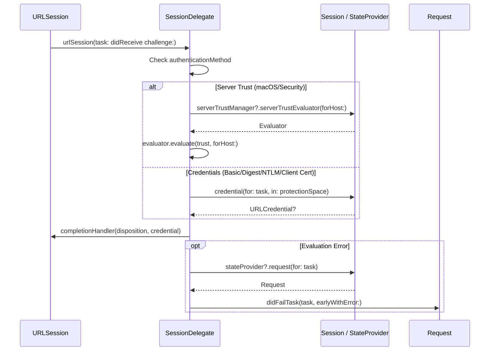

# Session Management

<details>
<summary>Relevant source files</summary>

The following files were used as context for generating this wiki page:

- [Source/Core/Session.swift](https://github.com/Alamofire/Alamofire/blob/main/Source/Core/Session.swift)
- [Source/Core/SessionDelegate.swift](https://github.com/Alamofire/Alamofire/blob/main/Source/Core/SessionDelegate.swift)
- [docs/docsets/Alamofire.docset/Contents/Resources/Documents/Classes/Session.html](https://github.com/Alamofire/Alamofire/blob/main/docs/docsets/Alamofire.docset/Contents/Resources/Documents/Classes/Session.html)
</details>

## Overview

Alamofire's session management architecture centers around the `Session` class, which serves as the primary driver for creating, configuring, and managing `Request` instances throughout their entire execution lifecycle. By wrapping underlying Foundation networking components, `Session` coordinates request queuing, parameter encoding, interception, server trust evaluations, redirect handling, and response caching. Sources: [Source/Core/Session.swift:27-29](https://github.com/Alamofire/Alamofire/blob/main/Source/Core/Session.swift#L27-L29), [docs/docsets/Alamofire.docset/Contents/Resources/Documents/Classes/Session.html:582-584](https://github.com/Alamofire/Alamofire/blob/main/docs/docsets/Alamofire.docset/Contents/Resources/Documents/Classes/Session.html#L582-L584)

The session architecture delegates low-level protocol callbacks to an associated `SessionDelegate` instance, bridging asynchronous `URLSession` events directly to individual active requests and maintaining thread-safe state synchronization across dedicated serial queues. Sources: [Source/Core/Session.swift:53-56](https://github.com/Alamofire/Alamofire/blob/main/Source/Core/Session.swift#L53-L56), [Source/Core/SessionDelegate.swift:27-28](https://github.com/Alamofire/Alamofire/blob/main/Source/Core/SessionDelegate.swift#L27-L28)

## Session Initialization and Configuration

### Session Initialization and Configuration

The creation of a `Session` instance involves instantiating and aligning an underlying `URLSession`, an associated `SessionDelegate`, a serial root dispatch queue, and optional worker queues for request generation and response serialization. Sources: [Source/Core/Session.swift:53-72](https://github.com/Alamofire/Alamofire/blob/main/Source/Core/Session.swift#L53-L72), [Source/Core/Session.swift:133-144](https://github.com/Alamofire/Alamofire/blob/main/Source/Core/Session.swift#L133-L144)

### Initialization Initializers and Parameters

`Session` provides two designated paths for initialization. The convenience initializer accepts a `URLSessionConfiguration` and handles the creation of the underlying `URLSession` and delegate queue automatically, making it the recommended approach for most production use cases. Alternatively, a designated initializer accepts a pre-configured `URLSession` alongside a matching `rootQueue`. Sources: [Source/Core/Session.swift:100-144](https://github.com/Alamofire/Alamofire/blob/main/Source/Core/Session.swift#L100-L144), [Source/Core/Session.swift:201-233](https://github.com/Alamofire/Alamofire/blob/main/Source/Core/Session.swift#L201-L233)

| Parameter | Type | Default Value | Purpose |
| :--- | :--- | :--- | :--- |
| `configuration` | `URLSessionConfiguration` | `URLSessionConfiguration.af.default` | Configuration object used to build the underlying `URLSession`. |
| `delegate` | `SessionDelegate` | `SessionDelegate()` | Delegate instance handling `URLSessionDelegate` callbacks. |
| `rootQueue` | `DispatchQueue` | `DispatchQueue(label: "org.alamofire.session.rootQueue")` | Serial queue governing all internal callbacks and state updates. |
| `startRequestsImmediately` | `Bool` | `true` | Automatically calls `.resume()` on requests once a response handler is added. |
| `requestSetup` | `RequestSetup` | `.lazy` | Controls whether request setup happens `.lazy` or `.eager`. |
| `requestQueue` | `DispatchQueue?` | `nil` | Dedicated queue for asynchronous `URLRequest` creation. |
| `serializationQueue` | `DispatchQueue?` | `nil` | Dedicated queue for response serialization operations. |
| `interceptor` | `RequestInterceptor?` | `nil` | Global interceptor applied to all created requests. |
| `serverTrustManager` | `ServerTrustManager?` | `nil` | Manager handling server trust evaluations and pinning. |
| `redirectHandler` | `RedirectHandler?` | `nil` | Handler providing custom request redirection logic. |
| `cachedResponseHandler` | `CachedResponseHandler?` | `nil` | Handler customizing cached response handling behaviors. |
| `eventMonitors` | `[EventMonitor]` | `[AlamofireNotifications()]` | Array of monitors observing session and request telemetry. |

Sources: [Source/Core/Session.swift:133-144](https://github.com/Alamofire/Alamofire/blob/main/Source/Core/Session.swift#L133-L144), [Source/Core/Session.swift:201-233](https://github.com/Alamofire/Alamofire/blob/main/Source/Core/Session.swift#L201-L233)

> [!WARNING]
> Background `URLSessionConfiguration` instances are explicitly unsupported by Alamofire. Passing a configuration with a non-nil `identifier` triggers an immediate runtime precondition failure during session initialization. Sources: [Source/Core/Session.swift:145-146](https://github.com/Alamofire/Alamofire/blob/main/Source/Core/Session.swift#L145-L146), [Source/Core/Session.swift:213](https://github.com/Alamofire/Alamofire/blob/main/Source/Core/Session.swift#L213)

### Initialization Call Walkthrough

When initializing a session via `init(configuration:delegate:rootQueue:...)`, execution follows a strict setup sequence:

1. `precondition(configuration.identifier == nil)` verifies that the configuration is not a background session type. Sources: [Source/Core/Session.swift:213](https://github.com/Alamofire/Alamofire/blob/main/Source/Core/Session.swift#L213)
2. A serial root queue (`serialRootQueue`) is established, wrapping or preserving the incoming `rootQueue` target. Sources: [Source/Core/Session.swift:216-217](https://github.com/Alamofire/Alamofire/blob/main/Source/Core/Session.swift#L216-L217)
3. An `OperationQueue` with a `maxConcurrentOperationCount` of 1 is created using the serial root queue as its underlying queue and named `\(serialRootQueue.label).sessionDelegate`. Sources: [Source/Core/Session.swift:218](https://github.com/Alamofire/Alamofire/blob/main/Source/Core/Session.swift#L218)
4. A standard `URLSession` is instantiated with the configuration, delegate, and operation queue. Sources: [Source/Core/Session.swift:219](https://github.com/Alamofire/Alamofire/blob/main/Source/Core/Session.swift#L219)
5. `self.init(session:delegate:rootQueue:...)` is called, where queue targets and component bindings are finalized. Sources: [Source/Core/Session.swift:150-164](https://github.com/Alamofire/Alamofire/blob/main/Source/Core/Session.swift#L150-L164), [Source/Core/Session.swift:221-233](https://github.com/Alamofire/Alamofire/blob/main/Source/Core/Session.swift#L221-L233)

> [!CAUTION]
> When utilizing the designated initializer `init(session:delegate:rootQueue:...)`, the `URLSession` must be instantiated with a delegate queue whose `underlyingQueue` precisely matches the passed `rootQueue`. A mismatch traps the app via precondition check. Sources: [Source/Core/Session.swift:147-148](https://github.com/Alamofire/Alamofire/blob/main/Source/Core/Session.swift#L147-L148)

### Configuration Trade-Offs

| Design Choice | Benefit | Cost |
| :--- | :--- | :--- |
| **Serial Root Queue (`rootQueue`)** | Ensures thread-safe synchronization for internal states and task maps without lock contention. | Serializes all state updates, risking latency if heavy work runs directly on it. |
| **Separate Request and Serialization Queues** | Offloads expensive URL construction and data parsing from the primary root and main queues. | Increases thread overhead and thread-switch complexity across request lifecycles. |
| **Lazy Request Setup (`.lazy`)** | Avoids race conditions between request creation and initial state management (`resume()`). | Defers initialization routines until execution is explicitly unpaused or triggered. |

Sources: [Source/Core/Session.swift:35-45](https://github.com/Alamofire/Alamofire/blob/main/Source/Core/Session.swift#L35-L45), [Source/Core/Session.swift:56-72](https://github.com/Alamofire/Alamofire/blob/main/Source/Core/Session.swift#L56-L72)

### Custom Session Initialization Example

```swift
let customQueue = DispatchQueue(label: "com.example.app.sessionRootQueue", qos: .utility)
let sessionDelegate = SessionDelegate()

let customSession = Session(
    configuration: URLSessionConfiguration.af.default,
    delegate: sessionDelegate,
    rootQueue: customQueue,
    startRequestsImmediately: true,
    requestSetup: .lazy,
    requestQueue: DispatchQueue(label: "com.example.app.requestQueue", target: customQueue),
    serializationQueue: DispatchQueue(label: "com.example.app.serializationQueue", target: customQueue)
)
```

Sources: [Source/Core/Session.swift:56-72](https://github.com/Alamofire/Alamofire/blob/main/Source/Core/Session.swift#L56-L72), [Source/Core/Session.swift:201-233](https://github.com/Alamofire/Alamofire/blob/main/Source/Core/Session.swift#L201-L233), [Source/Core/SessionDelegate.swift:39-41](https://github.com/Alamofire/Alamofire/blob/main/Source/Core/SessionDelegate.swift#L39-L41)

## Session Delegate Event Dispatching

### Overview

Alamofire decouples low-level `URLSessionDelegate` callbacks from specific request handlers through `SessionDelegate` and its bidirectional link to `SessionStateProvider`. When raw network events fire on Foundation's background thread pool, `SessionDelegate` catches the delegation methods, queries the active session state provider to map the incoming `URLSessionTask` to its corresponding `Request` subclass, and fans out the event into application-level request methods. Sources: [Source/Core/SessionDelegate.swift:27-56](https://github.com/Alamofire/Alamofire/blob/main/Source/Core/SessionDelegate.swift#L27-L56)

### Authentication Challenge Routing

When a task encounters a server challenge, `urlSession(_:task:didReceive:completionHandler:)` intercepts the notification and evaluates the protection space authentication method. Sources: [Source/Core/SessionDelegate.swift:95-120](https://github.com/Alamofire/Alamofire/blob/main/Source/Core/SessionDelegate.swift#L95-L120)



Sources: [Source/Core/SessionDelegate.swift:95-120](https://github.com/Alamofire/Alamofire/blob/main/Source/Core/SessionDelegate.swift#L95-L120)

### Delegate Call-Chain Execution Walkthrough

The handling of incoming data tasks demonstrates the precise routing pipeline from a raw session callback down to specific response handlers:

1. Foundation invokes `urlSession(_:dataTask:didReceive:completionHandler:)` upon receiving initial response headers. Sources: [Source/Core/SessionDelegate.swift:241-244](https://github.com/Alamofire/Alamofire/blob/main/Source/Core/SessionDelegate.swift#L241-L244)
2. The method records the event via `eventMonitor?.urlSession(session, dataTask:dataTask, didReceive: response)`. Sources: [Source/Core/SessionDelegate.swift:245](https://github.com/Alamofire/Alamofire/blob/main/Source/Core/SessionDelegate.swift#L245)
3. The raw `URLResponse` is cast to an `HTTPURLResponse`; if the cast fails, completion falls back to `.allow`. Sources: [Source/Core/SessionDelegate.swift:247](https://github.com/Alamofire/Alamofire/blob/main/Source/Core/SessionDelegate.swift#L247)
4. `request(for:dataTask, as: DataRequest.self)` queries the `stateProvider` to locate and type-cast the associated request object. Sources: [Source/Core/SessionDelegate.swift:48-55](https://github.com/Alamofire/Alamofire/blob/main/Source/Core/SessionDelegate.swift#L48-L55), [Source/Core/SessionDelegate.swift:249-251](https://github.com/Alamofire/Alamofire/blob/main/Source/Core/SessionDelegate.swift#L249-L251)
5. If matched as a `DataRequest` or `DataStreamRequest`, control delegates to `request.didReceiveResponse(response, completionHandler: completionHandler)`. Sources: [Source/Core/SessionDelegate.swift:249-252](https://github.com/Alamofire/Alamofire/blob/main/Source/Core/SessionDelegate.swift#L249-L252)
6. If no matching request type is found, an `assertionFailure` triggers and the completion handler allows the task. Sources: [Source/Core/SessionDelegate.swift:253-256](https://github.com/Alamofire/Alamofire/blob/main/Source/Core/SessionDelegate.swift#L253-L256)

> [!WARNING]
> `SessionDelegate` methods rely on `stateProvider` being non-nil during callback execution. If a callback arrives after session deinitialization has broken the provider binding, lookups return `nil` or trap via assertion failures. Sources: [Source/Core/SessionDelegate.swift:49-51](https://github.com/Alamofire/Alamofire/blob/main/Source/Core/SessionDelegate.swift#L49-L51)

### Delegate Callback Routing Reference

| `URLSessionDelegate` Method | Target Request Subclass | Routed Handler / Action |
| :--- | :--- | :--- |
| `urlSession(_:task:didReceive:completionHandler:)` | Any `Request` | Evaluates server trust or credential authentication challenges. |
| `urlSession(_:task:didSendBodyData:...)` | `UploadRequest` / `Request` | `updateUploadProgress(totalBytesSent:totalBytesExpectedToSend:)` |
| `urlSession(_:task:needNewBodyStream:)` | `UploadRequest` | `request.inputStream()` supplied to completion handler. |
| `urlSession(_:task:willPerformHTTPRedirection:newRequest:...)` | Any `Request` | Custom `RedirectHandler` execution or default request pass-through. |
| `urlSession(_:task:didFinishCollecting:)` | Any `Request` | `request.didGatherMetrics(metrics)` and `stateProvider?.didGatherMetricsForTask(task)`. |
| `urlSession(_:task:didCompleteWithError:)` | Any `Request` | `stateProvider?.didCompleteTask(task)` followed by `request.didCompleteTask(task, with:)`. |
| `urlSession(_:dataTask:didReceive:response:...)` | `DataRequest` or `DataStreamRequest` | `request.didReceiveResponse(response, completionHandler:)`. |
| `urlSession(_:dataTask:didReceive data:)` | `DataRequest` or `DataStreamRequest` | `request.didReceive(data: data)`. |
| `urlSession(_:dataTask:willCacheResponse:...)` | Any `Request` | Custom `CachedResponseHandler` evaluation. |
| `urlSession(_:webSocketTask:didOpenWithProtocol:)` | `WebSocketRequest` | `request.didConnect(protocol:)`. |
| `urlSession(_:webSocketTask:didCloseWith:reason:)` | `WebSocketRequest` | `request.didDisconnect(closeCode:reason:)`. |
| `urlSession(_:downloadTask:didResumeAtOffset:...)` | `DownloadRequest` | `downloadRequest.updateDownloadProgress(bytesWritten:totalBytesExpectedToWrite:)`. |
| `urlSession(_:downloadTask:didWriteData:...)` | `DownloadRequest` | `downloadRequest.updateDownloadProgress(bytesWritten:bytesWritten:totalBytesExpectedToWrite:)`. |
| `urlSession(_:downloadTask:didFinishDownloadingTo:)` | `DownloadRequest` | Destination resolution, file manager relocation, and `didFinishDownloading(using:with:)`. |

Sources: [Source/Core/SessionDelegate.swift:95-393](https://github.com/Alamofire/Alamofire/blob/main/Source/Core/SessionDelegate.swift#L95-L393)

## Active Request Task Mapping

### Overview

Maintaining active request and task state mappings across sessions is core to how Alamofire bridges high-level `Request` objects with low-level `URLSessionTask` instances. Within `Session`, this state is encapsulated inside a protected `MutableState` structure managed on the serial `rootQueue`. Sources: [Source/Core/Session.swift:89-96](https://github.com/Alamofire/Alamofire/blob/main/Source/Core/Session.swift#L89-L96)

### Mutable State Structure and Task Association

The `Session.MutableState` structure tracks three primary properties: `requestTaskMap` (an instance of `RequestTaskMap`), `activeRequests` (a `Set<Request>`), and `waitingCompletions` (mapping `URLSessionTask` instances to completion closures awaiting metrics). Sources: [Source/Core/Session.swift:89-96](https://github.com/Alamofire/Alamofire/blob/main/Source/Core/Session.swift#L89-L96)

When a `URLRequest` is successfully generated and ready to execute, `didCreateURLRequest(_:for:)` or `didReceiveResumeData(_:for:)` runs on `rootQueue`, creates the underlying `URLSessionTask`, and maps it by storing `mutableState.write { $0.requestTaskMap[request] = task }`. Sources: [Source/Core/Session.swift:1291-1312](https://github.com/Alamofire/Alamofire/blob/main/Source/Core/Session.swift#L1291-L1312)

> [!NOTE]
> Direct interaction with underlying `URLSessionTask` instances bypassing Alamofire's internal maps will break task tracking and state lookup logic. Sources: [Source/Core/Session.swift:47-52](https://github.com/Alamofire/Alamofire/blob/main/Source/Core/Session.swift#L47-L52)

### Querying and Disassociating State

To resolve requests from incoming `URLSessionTask` delegates, `Session` conforms to `SessionStateProvider`, providing synchronized lookup methods executing on `rootQueue`:

- `request(for task: URLSessionTask) -> Request?`: Queries `mutableState.read { $0.requestTaskMap[task] }`. Sources: [Source/Core/Session.swift:1386-1390](https://github.com/Alamofire/Alamofire/blob/main/Source/Core/Session.swift#L1386-L1390)
- `didGatherMetricsForTask(_ task: URLSessionTask)`: Disassociates task mappings when metrics are collected and executes any pending completion handlers stored in `waitingCompletions`. Sources: [Source/Core/Session.swift:1392-1407](https://github.com/Alamofire/Alamofire/blob/main/Source/Core/Session.swift#L1392-L1407)
- `didCompleteTask(_ task: URLSessionTask, completion: @escaping () -> Void)`: Disassociates the task or stores the completion block in `waitingCompletions` if metrics collection is still pending. Sources: [Source/Core/Session.swift:1409-1424](https://github.com/Alamofire/Alamofire/blob/main/Source/Core/Session.swift#L1409-L1424)

### Session State Provider Reference

| Method Signature | Dispatch Precondition | Purpose |
| :--- | :--- | :--- |
| `request(for: URLSessionTask)` | `onQueue(rootQueue)` | Retrieves the active `Request` associated with a `URLSessionTask`. | Sources: [Source/Core/Session.swift:1386-1390](https://github.com/Alamofire/Alamofire/blob/main/Source/Core/Session.swift#L1386-L1390)
| `didGatherMetricsForTask(URLSessionTask)` | `onQueue(rootQueue)` | Triggers disassociation and flushes waiting completion handlers after metrics collection. | Sources: [Source/Core/Session.swift:1392-1407](https://github.com/Alamofire/Alamofire/blob/main/Source/Core/Session.swift#L1392-L1407)
| `didCompleteTask(URLSessionTask, completion: () -> Void)` | `onQueue(rootQueue)` | Manages task completion disassociation or defers completion until metrics arrive. | Sources: [Source/Core/Session.swift:1409-1424](https://github.com/Alamofire/Alamofire/blob/main/Source/Core/Session.swift#L1409-L1424)
| `credential(for:in:)` | `onQueue(rootQueue)` | Resolves credentials from the request mapping or configuration storage. | Sources: [Source/Core/Session.swift:1426-1431](https://github.com/Alamofire/Alamofire/blob/main/Source/Core/Session.swift#L1426-L1431)
| `cancelRequestsForSessionInvalidation(with:)` | `onQueue(rootQueue)` | Cancels all active requests upon session invalidation. | Sources: [Source/Core/Session.swift:1433-1440](https://github.com/Alamofire/Alamofire/blob/main/Source/Core/Session.swift#L1433-L1440)

## Request Lifecycle and Mass Actions

### Overview

Managing request lifecycles, bulk operations, and retry sequences across a `Session` involves coordinated state changes across the `rootQueue`, `requestQueue`, and internal mutable state blocks. When requests are created or retried, Alamofire evaluates their setup criteria, executes request adaptation, handles task creation, and manages active request collections. Sources: [Source/Core/Session.swift:1166-1287](https://github.com/Alamofire/Alamofire/blob/main/Source/Core/Session.swift#L1166-L1287), [Source/Core/Session.swift:1365-1380](https://github.com/Alamofire/Alamofire/blob/main/Source/Core/Session.swift#L1365-L1380)

Sources: [Source/Core/Session.swift:1166-1287](https://github.com/Alamofire/Alamofire/blob/main/Source/Core/Session.swift#L1166-L1287)

### Request Lifecycle Execution Walkthrough

The initiation and setup of a request follows an explicit sequence across queues and state checks:

1. `perform(_:forRetry:)` — Dispatches asynchronously to `rootQueue`, locks `mutableState` to verify the request is not cancelled, and inserts it into `activeRequests` (or proceeds if `isRetrying` is true) before dispatching to `requestQueue`. Sources: [Source/Core/Session.swift:1166-1197](https://github.com/Alamofire/Alamofire/blob/main/Source/Core/Session.swift#L1166-L1197)
2. `performDataRequest(_:)` / `performUploadRequest(_:)` — Executes on `requestQueue` asserting queue preconditions and invoking `performSetupOperations(for:convertible:shouldCreateTask:)`. Sources: [Source/Core/Session.swift:1199-1244](https://github.com/Alamofire/Alamofire/blob/main/Source/Core/Session.swift#L1199-L1244)
3. `convertible.asURLRequest()` — Builds and validates the initial `URLRequest`. If validation fails, it dispatches `.didFailToCreateURLRequest` to `rootQueue`. Sources: [Source/Core/Session.swift:1246-1260](https://github.com/Alamofire/Alamofire/blob/main/Source/Core/Session.swift#L1246-L1260)
4. `adapter.adapt(_:using:)` — If an interceptor or adapter is present, the initial request is passed to the adapter with a `RequestAdapterState`. If adaptation succeeds and validates, the adapted request is used; otherwise, `.didFailToAdaptURLRequest` is triggered. Sources: [Source/Core/Session.swift:1265-1286](https://github.com/Alamofire/Alamofire/blob/main/Source/Core/Session.swift#L1265-L1286)
5. `didCreateURLRequest(_:for:)` — Runs back on `rootQueue`, instantiates the underlying `URLSessionTask`, updates the `requestTaskMap`, and calls `request.didCreateTask(task)`. Sources: [Source/Core/Session.swift:1291-1301](https://github.com/Alamofire/Alamofire/blob/main/Source/Core/Session.swift#L1291-L1301)

> [!TIP]
> During rapid resume, suspend, and resume cycles, the insertion check `mutableState.activeRequests.insert(request).inserted` protects against enqueuing multiple concurrent perform operations for the same request instance unless an explicit retry is underway. Sources: [Source/Core/Session.swift:1168-1173](https://github.com/Alamofire/Alamofire/blob/main/Source/Core/Session.swift#L1168-L1173)

Sources: [Source/Core/Session.swift:1166-1301](https://github.com/Alamofire/Alamofire/blob/main/Source/Core/Session.swift#L1166-L1301)

### Mass Actions and Bulk Operations

`Session` exposes bulk APIs to query or terminate all active requests concurrently:

- `withAllRequests(perform:)`: Dispatches to `rootQueue` and yields the current `Set<Request>` stored in `activeRequests` to the provided closure. Sources: [Source/Core/Session.swift:257-261](https://github.com/Alamofire/Alamofire/blob/main/Source/Core/Session.swift#L257-L261)
- `cancelAllRequests(completingOnQueue:completion:)`: Invokes `withAllRequests` to iterate over all active requests, calls `.cancel()` on each, and asynchronously executes the completion handler on the specified queue. Sources: [Source/Core/Session.swift:272-279](https://github.com/Alamofire/Alamofire/blob/main/Source/Core/Session.swift#L272-L279)

> [!WARNING]
> Bulk cancellation is asynchronous and non-blocking; requests that are near completion when cancelled may finish successfully before cancellation takes effect. Sources: [Source/Core/Session.swift:263-268](https://github.com/Alamofire/Alamofire/blob/main/Source/Core/Session.swift#L263-L268)

Sources: [Source/Core/Session.swift:248-279](https://github.com/Alamofire/Alamofire/blob/main/Source/Core/Session.swift#L248-L279)

### Retry Handling and Lifecycle State Changes

When requests encounter errors, the `RequestDelegate` implementation coordinates retries through `retryResult(for:dueTo:completion:)` and `retryRequest(_:withDelay:)`. If a retrier is configured, its result determines whether to retry or fail with `AFError.requestRetryFailed`. When a retry is executed, `request.prepareForRetry()` is called before re-invoking `perform(request, forRetry: true)` on the `rootQueue`. Sources: [Source/Core/Session.swift:1349-1380](https://github.com/Alamofire/Alamofire/blob/main/Source/Core/Session.swift#L1349-L1380)

Sources: [Source/Core/Session.swift:1345-1381](https://github.com/Alamofire/Alamofire/blob/main/Source/Core/Session.swift#L1345-L1381)

## Upload and Stream Processing

### Overview

Alamofire's `Session` provides specialized factory methods and underlying dispatch handling for data uploadables, stream conversions, and upload request processing. Upload requests encapsulate payloads through the `Upload` structure, which bridges `URLRequestConvertible` components and `UploadableConvertible` instances to generate `UploadRequest.Uploadable` payloads during execution. Sources: [Source/Core/Session.swift:735-760](https://github.com/Alamofire/Alamofire/blob/main/Source/Core/Session.swift#L735-L760)

Sources: [Source/Core/Session.swift:735-760](https://github.com/Alamofire/Alamofire/blob/main/Source/Core/Session.swift#L735-L760)

### Uploadable Creation and Processing Walkthrough

When an upload request is dispatched on the `requestQueue`, `performUploadRequest(_:)` initiates setup operations with a custom closure that constructs the underlying uploadable. Sources: [Source/Core/Session.swift:1220-1233](https://github.com/Alamofire/Alamofire/blob/main/Source/Core/Session.swift#L1220-L1233)

The uploadable creation and dispatch process follows this precise call chain:
1. `performUploadRequest(_:)` → Asserts execution precondition on `requestQueue` and calls `performSetupOperations(for:convertible:shouldCreateTask:)` with a closure. Sources: [Source/Core/Session.swift:1220-1223](https://github.com/Alamofire/Alamofire/blob/main/Source/Core/Session.swift#L1220-L1223)
2. `shouldCreateTask` closure → Executes `try request.upload.createUploadable()` to materialize the binary payload. Sources: [Source/Core/Session.swift:1224-1225](https://github.com/Alamofire/Alamofire/blob/main/Source/Core/Session.swift#L1224-L1225)
3. Branching on creation outcome:
   - **Success:** Dispatches `request.didCreateUploadable(uploadable)` asynchronously to `rootQueue` and returns `true`, allowing `performSetupOperations` to proceed to URL request creation. Sources: [Source/Core/Session.swift:1226-1227](https://github.com/Alamofire/Alamofire/blob/main/Source/Core/Session.swift#L1226-L1227)
   - **Failure:** Catches the error, converts it via `asAFError(or: .createUploadableFailed(error:))`, dispatches `request.didFailToCreateUploadable(with:)` to `rootQueue`, and returns `false` to abort task creation. Sources: [Source/Core/Session.swift:1228-1231](https://github.com/Alamofire/Alamofire/blob/main/Source/Core/Session.swift#L1228-L1231)

> [!WARNING]
> If `createUploadable()` throws an error during upload setup, task creation is aborted, and the failure is dispatched to the root queue without initiating a network task. Sources: [Source/Core/Session.swift:1224-1232](https://github.com/Alamofire/Alamofire/blob/main/Source/Core/Session.swift#L1224-L1232)

Sources: [Source/Core/Session.swift:1220-1233](https://github.com/Alamofire/Alamofire/blob/main/Source/Core/Session.swift#L1220-L1233)

### Stream Conversions and Body Stream Management

During active upload tasks, `SessionDelegate` coordinates body stream lifecycles via `urlSession(_:task:needNewBodyStream:)`. When an upload task requires a new body stream (such as during redirection or authentication retries), the delegate queries the request and invokes `request.inputStream()` to supply the fresh stream. Sources: [Source/Core/SessionDelegate.swift:186-198](https://github.com/Alamofire/Alamofire/blob/main/Source/Core/SessionDelegate.swift#L186-L198)

> [!NOTE]
> The `needNewBodyStream` delegate callback enforces that the associated task must map to an active `UploadRequest`, triggering an assertion failure if a non-upload task requests a new body stream. Sources: [Source/Core/SessionDelegate.swift:191-195](https://github.com/Alamofire/Alamofire/blob/main/Source/Core/SessionDelegate.swift#L191-L195)

Sources: [Source/Core/SessionDelegate.swift:186-198](https://github.com/Alamofire/Alamofire/blob/main/Source/Core/SessionDelegate.swift#L186-L198)

### Upload Payload Types and Methods

`Session` provides overloaded `upload` factory variants supporting multiple input payload formats, defaulting to HTTP `.post` method and `.default` `FileManager` instances. Sources: [Source/Core/Session.swift:764-1121](https://github.com/Alamofire/Alamofire/blob/main/Source/Core/Session.swift#L764-L1121)

| Payload Type | Source Parameter Signature | Default HTTP Method | Key Configuration Parameters |
| --- | `upload(_:to:method:headers:interceptor:shouldAutomaticallyResume:fileManager:requestModifier:)` | `.post` | `Data`, `URLConvertible`, `FileManager` | Sources: [Source/Core/Session.swift:779-786](https://github.com/Alamofire/Alamofire/blob/main/Source/Core/Session.swift#L779-L786)
| File URL | `upload(_:to:method:headers:interceptor:shouldAutomaticallyResume:fileManager:requestModifier:)` | `.post` | `URL` (fileURL), `URLConvertible`, `FileManager` | Sources: [Source/Core/Session.swift:837-844](https://github.com/Alamofire/Alamofire/blob/main/Source/Core/Session.swift#L837-L844)
| Input Stream | `upload(_:to:method:headers:interceptor:fileManager:requestModifier:)` | `.post` | `InputStream`, `URLConvertible`, `FileManager` | Sources: [Source/Core/Session.swift:899-905](https://github.com/Alamofire/Alamofire/blob/main/Source/Core/Session.swift#L899-L905)
| Multipart Form Data | `upload(multipartFormData:to:usingThreshold:method:headers:interceptor:fileManager:requestModifier:)` | `.post` | Closure / `MultipartFormData`, `encodingMemoryThreshold`, `FileManager` | Sources: [Source/Core/Session.swift:966-973](https://github.com/Alamofire/Alamofire/blob/main/Source/Core/Session.swift#L966-L973)

Sources: [Source/Core/Session.swift:764-1121](https://github.com/Alamofire/Alamofire/blob/main/Source/Core/Session.swift#L764-L1121)

## Related

- [[Request Lifecycle]]
- [[Event Monitoring]]

