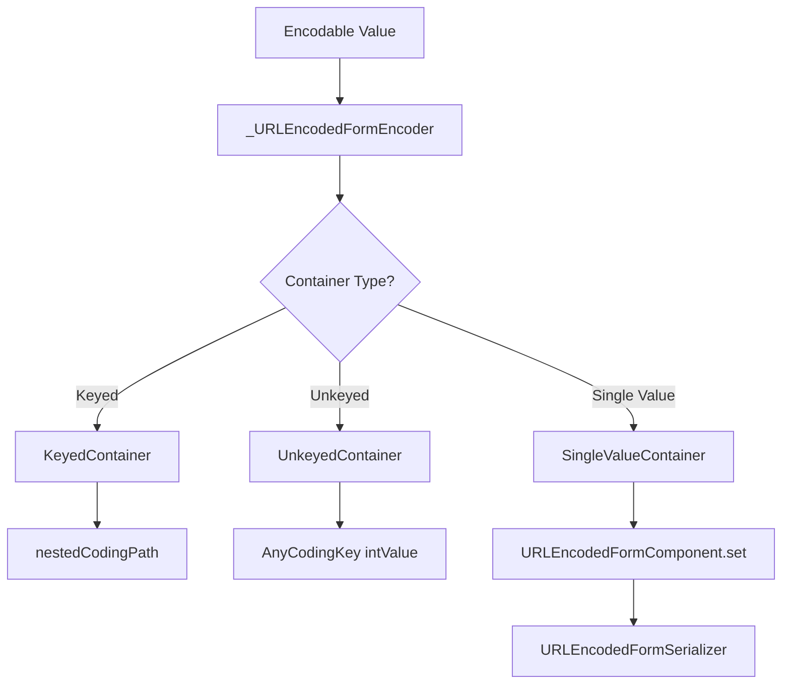

# URL Encoded Form Encoder

<details>
<summary>Relevant source files</summary>

The following files were used as context for generating this wiki page:

- [Source/Features/URLEncodedFormEncoder.swift](https://github.com/Alamofire/Alamofire/blob/main/Source/Features/URLEncodedFormEncoder.swift)
- [docs/docsets/Alamofire.docset/Contents/Resources/Documents/Classes/URLEncodedFormEncoder.html](https://github.com/Alamofire/Alamofire/blob/main/docs/docsets/Alamofire.docset/Contents/Resources/Documents/Classes/URLEncodedFormEncoder.html)
- [docs/Classes/URLEncodedFormEncoder.html](https://github.com/Alamofire/Alamofire/blob/main/docs/Classes/URLEncodedFormEncoder.html)
- [Source/Core/ParameterEncoder.swift](https://github.com/Alamofire/Alamofire/blob/main/Source/Core/ParameterEncoder.swift)
- [Source/Core/ParameterEncoding.swift](https://github.com/Alamofire/Alamofire/blob/main/Source/Core/ParameterEncoding.swift)
</details>

## Overview

The `URLEncodedFormEncoder` provides a robust mechanism for serializing arbitrary `Encodable` instances into URL-encoded query strings, serving as the modern Swift `Encoder`-based counterpart to legacy dictionary-based parameter encoding. By leveraging Swift's `Codable` architecture, it bridges complex hierarchical data structures and standard `application/x-www-form-urlencoded` payloads. Sources: [Source/Features/URLEncodedFormEncoder.swift:27-54](https://github.com/Alamofire/Alamofire/blob/main/Source/Features/URLEncodedFormEncoder.swift#L27-L54), [Source/Core/ParameterEncoder.swift:108-115](https://github.com/Alamofire/Alamofire/blob/main/Source/Core/ParameterEncoder.swift#L108-L115)

Designed with extensive configuration options for keys, arrays, booleans, dates, data, and null values, the encoder offers granular control over output formatting and URL character escaping rules. It integrates seamlessly into Alamofire's request pipeline via `URLEncodedFormParameterEncoder`, allowing structured types to be cleanly applied either as URL query strings or HTTP body data depending on the destination and HTTP method. Sources: [Source/Features/URLEncodedFormEncoder.swift:27-52](https://github.com/Alamofire/Alamofire/blob/main/Source/Features/URLEncodedFormEncoder.swift#L27-L52), [Source/Core/ParameterEncoder.swift:108-125](https://github.com/Alamofire/Alamofire/blob/main/Source/Core/ParameterEncoder.swift#L108-L125)

## Public API and Configuration Options

### Overview

The `URLEncodedFormEncoder` exposes a comprehensive public initialization signature and modular strategy types designed to customize every phase of the URL-encoded form serialization process. Through its designated initializer, consumers can supply configurations governing sorting behavior, array formatting, boolean representations, binary data encoding, date formatting, key casing transformations, nested key paths, nil values, whitespace escaping, and allowed character sets. Sources: [Source/Features/URLEncodedFormEncoder.swift:410-430](https://github.com/Alamofire/Alamofire/blob/main/Source/Features/URLEncodedFormEncoder.swift#L410-L430)

### Configuration Strategies and Initializer Options

The public initializer `init(alphabetizeKeyValuePairs:arrayEncoding:boolEncoding:dataEncoding:dateEncoding:keyEncoding:keyPathEncoding:nilEncoding:spaceEncoding:allowedCharacters:)` establishes the default behaviors for all encoded properties. 

| Option Parameter | Type | Default Value | Description / Options |
| :--- | :--- | :--- | :--- |
| `alphabetizeKeyValuePairs` | `Bool` | `true` | Sorts encoded key-value pairs alphabetically for deterministic output. Sources: [Source/Features/URLEncodedFormEncoder.swift:377-400](https://github.com/Alamofire/Alamofire/blob/main/Source/Features/URLEncodedFormEncoder.swift#L377-L400) |
| `arrayEncoding` | `ArrayEncoding` | `.brackets` | Determines array formatting: `.brackets` (`[]`), `.noBrackets` (key as-is), `.indexInBrackets` (`[index]`), or `.custom((String, Int) -> String)`. Sources: [Source/Features/URLEncodedFormEncoder.swift:56-81](https://github.com/Alamofire/Alamofire/blob/main/Source/Features/URLEncodedFormEncoder.swift#L56-L81) |
| `boolEncoding` | `BoolEncoding` | `.numeric` | Encodes booleans as `.numeric` (`1` / `0`) or `.literal` (`true` / `false`). Sources: [Source/Features/URLEncodedFormEncoder.swift:83-101](https://github.com/Alamofire/Alamofire/blob/main/Source/Features/URLEncodedFormEncoder.swift#L83-L101) |
| `dataEncoding` | `DataEncoding` | `.base64` | Encodes binary data via `.deferredToData`, `.base64`, or `.custom((Data) throws -> String)`. Sources: [Source/Features/URLEncodedFormEncoder.swift:103-125](https://github.com/Alamofire/Alamofire/blob/main/Source/Features/URLEncodedFormEncoder.swift#L103-L125) |
| `dateEncoding` | `DateEncoding` | `.deferredToDate` | Encodes dates using `.deferredToDate`, `.secondsSince1970`, `.millisecondsSince1970`, `.iso8601`, `.formatted(DateFormatter)`, or `.custom((Date) throws -> String)`. Sources: [Source/Features/URLEncodedFormEncoder.swift:127-171](https://github.com/Alamofire/Alamofire/blob/main/Source/Features/URLEncodedFormEncoder.swift#L127-L171) |
| `keyEncoding` | `KeyEncoding` | `.useDefaultKeys` | Modifies keys via `.useDefaultKeys`, `.convertToSnakeCase`, `.convertToKebabCase`, `.capitalized`, `.uppercased`, `.lowercased`, or `.custom((String) -> String)`. Sources: [Source/Features/URLEncodedFormEncoder.swift:177-212](https://github.com/Alamofire/Alamofire/blob/main/Source/Features/URLEncodedFormEncoder.swift#L177-L212) |
| `keyPathEncoding` | `KeyPathEncoding` | `.brackets` | Sets nested path delimiters via `.brackets` (`[sub]`) or `.dots` (`.sub`), or a custom `Sendable` closure. Sources: [Source/Features/URLEncodedFormEncoder.swift:296-314](https://github.com/Alamofire/Alamofire/blob/main/Source/Features/URLEncodedFormEncoder.swift#L296-L314) |
| `nilEncoding` | `NilEncoding` | `.dropKey` | Controls optional `nil` handling via `.dropKey` (removes pair), `.dropValue` (`value=`), or `.null` (`value=null`), or a custom closure. Sources: [Source/Features/URLEncodedFormEncoder.swift:317-337](https://github.com/Alamofire/Alamofire/blob/main/Source/Features/URLEncodedFormEncoder.swift#L317-L337) |
| `spaceEncoding` | `SpaceEncoding` | `.percentEscaped` | Encodes spaces as `.percentEscaped` (`%20`) or `.plusReplaced` (`+`). Sources: [Source/Features/URLEncodedFormEncoder.swift:340-357](https://github.com/Alamofire/Alamofire/blob/main/Source/Features/URLEncodedFormEncoder.swift#L340-L357) |
| `allowedCharacters` | `CharacterSet` | `.afURLQueryAllowed` | Defines the specific `CharacterSet` of characters excluded from percent-escaping. Sources: [Source/Features/URLEncodedFormEncoder.swift:394-395](https://github.com/Alamofire/Alamofire/blob/main/Source/Features/URLEncodedFormEncoder.swift#L394-L395) |

Sources: [Source/Features/URLEncodedFormEncoder.swift:377-430](https://github.com/Alamofire/Alamofire/blob/main/Source/Features/URLEncodedFormEncoder.swift#L377-L430)

### Public Encoding Methods

Once an encoder instance is configured, it provides public `encode(_:)` overloads to serialize any conforming `Encodable` type into standard query output forms.

```swift
public func encode(_ value: any Encodable) throws -> String
public func encode(_ value: any Encodable) throws -> Data
```

Sources: [Source/Features/URLEncodedFormEncoder.swift:450-478](https://github.com/Alamofire/Alamofire/blob/main/Source/Features/URLEncodedFormEncoder.swift#L450-L478)

> [!NOTE]
> Root objects passed to `URLEncodedFormEncoder` must evaluate to keyed structures (such as Swift structs, classes, or dictionaries). Passing an unkeyed root object like a top-level array or single value throws `URLEncodedFormEncoder.Error.invalidRootObject(_:)`. Sources: [Source/Features/URLEncodedFormEncoder.swift:360-370](https://github.com/Alamofire/Alamofire/blob/main/Source/Features/URLEncodedFormEncoder.swift#L360-L370), [Source/Features/URLEncodedFormEncoder.swift:451-455](https://github.com/Alamofire/Alamofire/blob/main/Source/Features/URLEncodedFormEncoder.swift#L451-L455)

## ParameterEncoder Protocol Integration

### Overview

Alamofire defines the `ParameterEncoder` protocol to abstract how any `Encodable` type is transformed into a populated `URLRequest`. While `URLEncodedFormEncoder` handles the underlying transformation of data structures into form strings, `URLEncodedFormParameterEncoder` directly implements the `ParameterEncoder` protocol to apply those parameters to a `URLRequest`.

Sources: [Source/Core/ParameterEncoder.swift:27-39](https://github.com/Alamofire/Alamofire/blob/main/Source/Core/ParameterEncoder.swift#L27-L39), [Source/Core/ParameterEncoder.swift:115](https://github.com/Alamofire/Alamofire/blob/main/Source/Core/ParameterEncoder.swift#L115)

### Protocol Conformance and Destination Handling

The `URLEncodedFormParameterEncoder` class conforms to `ParameterEncoder` and `@unchecked Sendable`. It manages parameter injection through its nested `Destination` enum, determining whether query strings are appended to the request URL or assigned to the request's `httpBody`.

| Destination Case | Behavior | Sources |
| :--- | :--- | :--- |
| `.methodDependent` | Applies the encoded query string to any existing query string for `.get`, `.head`, and `.delete` requests; assigns it to `httpBody` for all other methods. | [Source/Core/ParameterEncoder.swift:117-121](https://github.com/Alamofire/Alamofire/blob/main/Source/Core/ParameterEncoder.swift#L117-L121) |
| `.queryString` | Always applies the encoded query string to the request URL's query parameters regardless of HTTP method. | [Source/Core/ParameterEncoder.swift:122-123](https://github.com/Alamofire/Alamofire/blob/main/Source/Core/ParameterEncoder.swift#L122-L123) |
| `.httpBody` | Always assigns the encoded query string data to the `httpBody` of the request. | [Source/Core/ParameterEncoder.swift:124-125](https://github.com/Alamofire/Alamofire/blob/main/Source/Core/ParameterEncoder.swift#L124-L125) |

Sources: [Source/Core/ParameterEncoder.swift:115-138](https://github.com/Alamofire/Alamofire/blob/main/Source/Core/ParameterEncoder.swift#L115-L138)

> [!WARNING]
> When `Destination` places parameters into the `httpBody`, `URLEncodedFormParameterEncoder` automatically updates the request's `Content-Type` header to `application/x-www-form-urlencoded; charset=utf-8` if no `Content-Type` header is already present. Sources: [Source/Core/ParameterEncoder.swift:186-190](https://github.com/Alamofire/Alamofire/blob/main/Source/Core/ParameterEncoder.swift#L186-L190)

### Request Encoding Execution Walkthrough

When `encode(_:into:)` is invoked on a `URLEncodedFormParameterEncoder`, parameters pass through a validation and injection sequence:

1. Guard against nil parameters, returning the unmodified `URLRequest` if none exist.
Sources: [Source/Core/ParameterEncoder.swift:159-161](https://github.com/Alamofire/Alamofire/blob/main/Source/Core/ParameterEncoder.swift#L159-L161)
2. Verify that the request contains a valid `url`, throwing `AFError.parameterEncoderFailed(reason: .missingRequiredComponent(.url))` if absent.
Sources: [Source/Core/ParameterEncoder.swift:164-167](https://github.com/Alamofire/Alamofire/blob/main/Source/Core/ParameterEncoder.swift#L164-L167)
3. Extract the request's HTTP `method`, throwing `AFError.parameterEncoderFailed(reason: .missingRequiredComponent(.httpMethod(rawValue:)))` if it cannot be determined.
Sources: [Source/Core/ParameterEncoder.swift:169-172](https://github.com/Alamofire/Alamofire/blob/main/Source/Core/ParameterEncoder.swift#L169-L172)
4. Evaluate `destination.encodesParametersInURL(for: method)`. If `true`, parse existing query components, invoke `encoder.encode(parameters)` to build the query string, merge it with any existing query components using ampersands via `joinedWithAmpersands()`, assign the new `percentEncodedQuery` back to the URL, and update `request.url`.
Sources: [Source/Core/ParameterEncoder.swift:174-185](https://github.com/Alamofire/Alamofire/blob/main/Source/Core/ParameterEncoder.swift#L174-L185)
5. If URL encoding is not selected, check and set the `Content-Type` header, invoke `encoder.encode(parameters)` to produce UTF-8 `Data`, and assign it directly to `request.httpBody`. Any underlying encoding failures are mapped to `AFError.parameterEncoderFailed(reason: .encoderFailed(error:))`.
Sources: [Source/Core/ParameterEncoder.swift:186-193](https://github.com/Alamofire/Alamofire/blob/main/Source/Core/ParameterEncoder.swift#L186-L193)

Sources: [Source/Core/ParameterEncoder.swift:159-196](https://github.com/Alamofire/Alamofire/blob/main/Source/Core/ParameterEncoder.swift#L159-L196)

> [!NOTE]
> Extension helpers on `ParameterEncoder` allow developers to reference encoders cleanly using shorthand statics like `.urlEncodedForm` or factory methods such as `.urlEncodedForm(encoder:destination:)` when configuring Alamofire requests. Sources: [Source/Core/ParameterEncoder.swift:199-213](https://github.com/Alamofire/Alamofire/blob/main/Source/Core/ParameterEncoder.swift#L199-L213)

## Encoding Engine and Container Hierarchy

### Overview

The internal encoding mechanism relies on `_URLEncodedFormEncoder`, which conforms to Swift's standard `Encoder` protocol and orchestrates data serialization through intermediate `URLEncodedFormComponent` structures. Rather than emitting text directly during traversal, the encoder builds an abstract tree representation using case variants `.string(String)`, `.array([URLEncodedFormComponent])`, and `.object(Object)`, where `Object` is an alias for `[(key: String, value: URLEncodedFormComponent)]`.
Sources: [Source/Features/URLEncodedFormEncoder.swift:481-552](https://github.com/Alamofire/Alamofire/blob/main/Source/Features/URLEncodedFormEncoder.swift#L481-L552)

### Container Hierarchy

`_URLEncodedFormEncoder` exposes three specialized container types conforming to Swift's encoding container protocols, each managing part of the component hierarchy via shared context references.

| Container Type | Protocol Conformance | Purpose & Behavior | Sources |
| :--- | :--- | :--- | :--- |
| `KeyedContainer` | `KeyedEncodingContainerProtocol` | Manages dictionary and object keys, routing values to nested single value encoders, unkeyed containers, or sub-containers using `nestedCodingPath(for:)`. | [Source/Features/URLEncodedFormEncoder.swift:657-813](https://github.com/Alamofire/Alamofire/blob/main/Source/Features/URLEncodedFormEncoder.swift#L657-L813) |
| `SingleValueContainer` | `SingleValueEncodingContainer` | Encodes primitive types (`Bool`, `String`, numeric types), checks for multiple encode attempts via `canEncodeNewValue`, handles special cases for `Date`, `Data`, and `Decimal`, and writes leaves via `context.component.set(to:at:)`. | [Source/Features/URLEncodedFormEncoder.swift:815-957](https://github.com/Alamofire/Alamofire/blob/main/Source/Features/URLEncodedFormEncoder.swift#L815-L957) |
| `UnkeyedContainer` | `UnkeyedEncodingContainer` | Manages arrays, tracking element count and generating indexed coding paths using `AnyCodingKey(intValue: count)` while incrementing count on each nested container creation. | [Source/Features/URLEncodedFormEncoder.swift:959-1046](https://github.com/Alamofire/Alamofire/blob/main/Source/Features/URLEncodedFormEncoder.swift#L959-L1046) |

Sources: [Source/Features/URLEncodedFormEncoder.swift:657-1046](https://github.com/Alamofire/Alamofire/blob/main/Source/Features/URLEncodedFormEncoder.swift#L657-L1046)

> [!WARNING]
> `SingleValueContainer` enforces single-write semantics per container instance. Attempting to encode more than once throws an `EncodingError.invalidValue` error when `canEncodeNewValue` evaluates to `false`.
> Sources: [Source/Features/URLEncodedFormEncoder.swift:841-847](https://github.com/Alamofire/Alamofire/blob/main/Source/Features/URLEncodedFormEncoder.swift#L841-L847)

### Nested Serialization and Component Updates

When nested values are written, the encoder traverses the abstract syntax tree through recursive path application. 


Sources: [Source/Features/URLEncodedFormEncoder.swift:508-536](https://github.com/Alamofire/Alamofire/blob/main/Source/Features/URLEncodedFormEncoder.swift#L508-L536), [Source/Features/URLEncodedFormEncoder.swift:681-683](https://github.com/Alamofire/Alamofire/blob/main/Source/Features/URLEncodedFormEncoder.swift#L681-L683), [Source/Features/URLEncodedFormEncoder.swift:964-966](https://github.com/Alamofire/Alamofire/blob/main/Source/Features/URLEncodedFormEncoder.swift#L964-L966)

The mutation of the component tree is handled by `URLEncodedFormComponent.set(to:at:)`, which recursively resolves coding key paths.

1. Check if `path` is empty; if so, assign the target value directly to the context component and return.
Sources: [Source/Features/URLEncodedFormEncoder.swift:581-585](https://github.com/Alamofire/Alamofire/blob/main/Source/Features/URLEncodedFormEncoder.swift#L581-L585)
2. Extract the leading path component `end = path[0]`. If `path.count` is `1`, assign `child = value`.
Sources: [Source/Features/URLEncodedFormEncoder.swift:587-591](https://github.com/Alamofire/Alamofire/blob/main/Source/Features/URLEncodedFormEncoder.swift#L587-L591)
3. If `path.count` is `2` or greater, inspect whether `end.intValue` exists. If it does, retrieve or initialize an array component at that index and recursively call `set` with the remaining path slice `Array(path[1...])`.
Sources: [Source/Features/URLEncodedFormEncoder.swift:592-600](https://github.com/Alamofire/Alamofire/blob/main/Source/Features/URLEncodedFormEncoder.swift#L592-L600)
4. If `end.intValue` is nil, find the matching object key in `context.object` or default to an empty object `.object(.init())`, then recursively call `set` with `Array(path[1...])`.
Sources: [Source/Features/URLEncodedFormEncoder.swift:601-604](https://github.com/Alamofire/Alamofire/blob/main/Source/Features/URLEncodedFormEncoder.swift#L601-L604)
5. Reconstruct the parent component container by updating or appending the child node into either the underlying array or object representation based on whether `end.intValue` is present.
Sources: [Source/Features/URLEncodedFormEncoder.swift:608-630](https://github.com/Alamofire/Alamofire/blob/main/Source/Features/URLEncodedFormEncoder.swift#L608-L630)

Sources: [Source/Features/URLEncodedFormEncoder.swift:576-631](https://github.com/Alamofire/Alamofire/blob/main/Source/Features/URLEncodedFormEncoder.swift#L576-L631)

## Key and Character Escaping Strategies

### Overview

Key formatting and character escaping dictate how structural keys and scalar values are rendered into a compliant query string. `URLEncodedFormEncoder` offers precise control over string transformation strategies for keys, array indices, nested key paths, spaces, and percent-encoding delimiters via dedicated configuration options.
Sources: [Source/Features/URLEncodedFormEncoder.swift:55-81](https://github.com/Alamofire/Alamofire/blob/main/Source/Features/URLEncodedFormEncoder.swift#L55-L81), [Source/Features/URLEncodedFormEncoder.swift:177-286](https://github.com/Alamofire/Alamofire/blob/main/Source/Features/URLEncodedFormEncoder.swift#L177-L286), [Source/Features/URLEncodedFormEncoder.swift:296-314](https://github.com/Alamofire/Alamofire/blob/main/Source/Features/URLEncodedFormEncoder.swift#L296-L314), [Source/Features/URLEncodedFormEncoder.swift:340-357](https://github.com/Alamofire/Alamofire/blob/main/Source/Features/URLEncodedFormEncoder.swift#L340-L357), [Source/Features/URLEncodedFormEncoder.swift:394-430](https://github.com/Alamofire/Alamofire/blob/main/Source/Features/URLEncodedFormEncoder.swift#L394-L430)

### Key and Key Path Formatting Strategies

Keys can be modified using `KeyEncoding` strategies to enforce naming conventions such as snake case, kebab case, or capitalization. For nested structures and dictionaries, `KeyPathEncoding` determines how hierarchical sub-keys are joined together.
Sources: [Source/Features/URLEncodedFormEncoder.swift:177-286](https://github.com/Alamofire/Alamofire/blob/main/Source/Features/URLEncodedFormEncoder.swift#L177-L286), [Source/Features/URLEncodedFormEncoder.swift:296-314](https://github.com/Alamofire/Alamofire/blob/main/Source/Features/URLEncodedFormEncoder.swift#L296-L314)

| Key Encoding Strategy | Description | Example Transformation |
| :--- | :--- | :--- |
| `.useDefaultKeys` | Uses keys directly from the `Encodable` implementation without modification. | `oneTwoThree` → `oneTwoThree` |
| `.convertToSnakeCase` | Converts camelCase keys to snake_case by splitting word boundaries and inserting underscores. | `oneTwoThree` → `one_two_three` |
| `.convertToKebabCase` | Converts camelCase keys to kebab-case by splitting word boundaries and inserting hyphens. | `oneTwoThree` → `one-two-three` |
| `.capitalized` | Capitalizes only the first letter of the key string. | `oneTwoThree` → `OneTwoThree` |
| `.uppercased` | Transforms all characters in the key to uppercase. | `oneTwoThree` → `ONETWOTHREE` |
| `.lowercased` | Transforms all characters in the key to lowercase. | `oneTwoThree` → `onetwothree` |
| `.custom((String) -> String)` | Applies a user-defined closure to transform the key string. | Custom logic |

Sources: [Source/Features/URLEncodedFormEncoder.swift:178-212](https://github.com/Alamofire/Alamofire/blob/main/Source/Features/URLEncodedFormEncoder.swift#L178-L212)

> [!NOTE]
> When `convertToSnakeCase` or `convertToKebabCase` processes keys, it scans character sets using `CharacterSet.uppercaseLetters` and `CharacterSet.lowercaseLetters` against `Locale.system` (ICU root locale), ensuring platform-consistent behavior independent of user locale settings.
> Sources: [Source/Features/URLEncodedFormEncoder.swift:182-188](https://github.com/Alamofire/Alamofire/blob/main/Source/Features/URLEncodedFormEncoder.swift#L182-L188)

### Array and Space Encoding Options

Arrays and spaces utilize specialized formatting rules during serialization. `ArrayEncoding` supports four distinct formatting behaviors for sequence indices, while `SpaceEncoding` governs whether spaces become percent-encoded or replaced by plus signs.
Sources: [Source/Features/URLEncodedFormEncoder.swift:56-81](https://github.com/Alamofire/Alamofire/blob/main/Source/Features/URLEncodedFormEncoder.swift#L56-L81), [Source/Features/URLEncodedFormEncoder.swift:340-357](https://github.com/Alamofire/Alamofire/blob/main/Source/Features/URLEncodedFormEncoder.swift#L340-L357)

- **`ArrayEncoding.brackets`**: Appends empty square brackets (`[]`) to the key for every entry, yielding output such as `array[]=1&array[]=2`. This serves as the default behavior.
- **`ArrayEncoding.noBrackets`**: Encodes the key as-is with no added characters or brackets.
- **`ArrayEncoding.indexInBrackets`**: Appends the zero-based item index inside brackets (`[0]`, `[1]`), matching jQuery and Node.js conventions.
- **`ArrayEncoding.custom((String, Int) -> String)`**: Delegates key and index formatting to a custom closure.
Sources: [Source/Features/URLEncodedFormEncoder.swift:57-64](https://github.com/Alamofire/Alamofire/blob/main/Source/Features/URLEncodedFormEncoder.swift#L57-L64)

Spaces are configured via `SpaceEncoding`: `.percentEscaped` translates spaces to `%20`, whereas `.plusReplaced` converts them to `+`.
Sources: [Source/Features/URLEncodedFormEncoder.swift:341-355](https://github.com/Alamofire/Alamofire/blob/main/Source/Features/URLEncodedFormEncoder.swift#L341-L355)

### Character Escaping and Reserved Delimiters

Character escaping builds upon an allowable set defined by `CharacterSet.afURLQueryAllowed`. Per RFC 3986 Section 3.4, query strings may contain question marks (`?`) and forward slashes (`/`) without escaping to support embedded URLs, while general delimiters (`:#[]@`) and sub-delimiters (`!$&'()*+,;=`) are percent-encoded.
Sources: [Source/Features/URLEncodedFormEncoder.swift:394-395](https://github.com/Alamofire/Alamofire/blob/main/Source/Features/URLEncodedFormEncoder.swift#L394-L395), [Source/Features/URLEncodedFormEncoder.swift:1123-1140](https://github.com/Alamofire/Alamofire/blob/main/Source/Features/URLEncodedFormEncoder.swift#L1123-L1140)

> [!WARNING]
> The default allowed character set explicitly excludes general delimiters and sub-delimiters except for `?` and `/`. Modifying `allowedCharacters` directly on the encoder instance alters which characters bypass percent-escaping during the serialization pass.
> Sources: [Source/Features/URLEncodedFormEncoder.swift:394-395](https://github.com/Alamofire/Alamofire/blob/main/Source/Features/URLEncodedFormEncoder.swift#L394-L395), [Source/Features/URLEncodedFormEncoder.swift:1109-1115](https://github.com/Alamofire/Alamofire/blob/main/Source/Features/URLEncodedFormEncoder.swift#L1109-L1115), [Source/Features/URLEncodedFormEncoder.swift:1134-1140](https://github.com/Alamofire/Alamofire/blob/main/Source/Features/URLEncodedFormEncoder.swift#L1134-L1140)

## Serialization and Output Formatting

### Overview

The final phase of form encoding is performed by `URLEncodedFormSerializer`, which takes the intermediate `URLEncodedFormComponent.Object` tree and flattens it into a standard ampersand-separated query string. This pass coordinates key transformations, array index formatting, key path nesting, percent escaping, and optional alphabetization.
Sources: [Source/Features/URLEncodedFormEncoder.swift:457-464](https://github.com/Alamofire/Alamofire/blob/main/Source/Features/URLEncodedFormEncoder.swift#L457-L464), [Source/Features/URLEncodedFormEncoder.swift:1048-1079](https://github.com/Alamofire/Alamofire/blob/main/Source/Features/URLEncodedFormEncoder.swift#L1048-L1079)

### Serialization Call-Chain

When converting a root object to a string, execution flows through a recursive set of serialization methods that handle different component types. 

1. `URLEncodedFormEncoder.encode(_:)` validates that the root component is an `.object` before invoking `URLEncodedFormSerializer.serialize(_:)`.
Sources: [Source/Features/URLEncodedFormEncoder.swift:453-463](https://github.com/Alamofire/Alamofire/blob/main/Source/Features/URLEncodedFormEncoder.swift#L453-L463)

2. `URLEncodedFormSerializer.serialize(_ object: URLEncodedFormComponent.Object)` iterates over each key-value pair, calling `serialize(_:forKey:)` for each component, optionally alphabetizes the resulting array if `alphabetizeKeyValuePairs` is `true`, and joins them with ampersands via `joinedWithAmpersands()`.
Sources: [Source/Features/URLEncodedFormEncoder.swift:1070-1079](https://github.com/Alamofire/Alamofire/blob/main/Source/Features/URLEncodedFormEncoder.swift#L1070-L1079), [Source/Features/URLEncodedFormEncoder.swift:1117-1121](https://github.com/Alamofire/Alamofire/blob/main/Source/Features/URLEncodedFormEncoder.swift#L1117-L1121)

3. `URLEncodedFormSerializer.serialize(_ component: URLEncodedFormComponent, forKey key: String)` switches on the component variant:
   - For `.string(string)`, it escapes the key (after applying `keyEncoding`) and the string value, joining them with an equals sign: `"\(escape(keyEncoding.encode(key)))=\(escape(string))"`.
   - For `.array(array)`, it delegates to `serialize(_:forKey:)`.
   - For `.object(object)`, it delegates to `serialize(_:forKey:)`.
Sources: [Source/Features/URLEncodedFormEncoder.swift:1081-1087](https://github.com/Alamofire/Alamofire/blob/main/Source/Features/URLEncodedFormEncoder.swift#L1081-L1087)

4. `URLEncodedFormSerializer.serialize(_ object: URLEncodedFormComponent.Object, forKey key: String)` maps nested objects by encoding subkeys with `keyPathEncoding.encodeKeyPath(_:)` and recursively serializing inner values.
Sources: [Source/Features/URLEncodedFormEncoder.swift:1089-1097](https://github.com/Alamofire/Alamofire/blob/main/Source/Features/URLEncodedFormEncoder.swift#L1089-L1097)

5. `URLEncodedFormSerializer.serialize(_ array: [URLEncodedFormComponent], forKey key: String)` enumerates array elements, applies `arrayEncoding.encode(_:atIndex:)`, and recursively serializes each item.
Sources: [Source/Features/URLEncodedFormEncoder.swift:1099-1107](https://github.com/Alamofire/Alamofire/blob/main/Source/Features/URLEncodedFormEncoder.swift#L1099-L1107)

> [!NOTE]
> During serialization, the `alphabetizeKeyValuePairs` property controls whether segment collections are sorted alphabetically. When set to `false`, dictionaries maintain insertion order while `Encodable` types preserve their encoded structure.
> Sources: [Source/Features/URLEncodedFormEncoder.swift:372-377](https://github.com/Alamofire/Alamofire/blob/main/Source/Features/URLEncodedFormEncoder.swift#L372-L377), [Source/Features/URLEncodedFormEncoder.swift:1076](https://github.com/Alamofire/Alamofire/blob/main/Source/Features/URLEncodedFormEncoder.swift#L1076), [Source/Features/URLEncodedFormEncoder.swift:1094](https://github.com/Alamofire/Alamofire/blob/main/Source/Features/URLEncodedFormEncoder.swift#L1094), [Source/Features/URLEncodedFormEncoder.swift:1104](https://github.com/Alamofire/Alamofire/blob/main/Source/Features/URLEncodedFormEncoder.swift#L1104)

### Serializer Operations Reference

| Method Signature | Input Type | Output Type | Primary Responsibility |
| :--- | :--- | :--- | :--- |
| `serialize(_:)` | `URLEncodedFormComponent.Object` | `String` | Iterates root entries, sorts if enabled, and joins segments with `&`. |
| `serialize(_:forKey:)` | `URLEncodedFormComponent`, `String` | `String` | Dispatches component serialization based on whether it is a string, array, or object. |
| `serialize(_:forKey:)` [Object variant] | `URLEncodedFormComponent.Object`, `String` | `String` | Encodes nested object subkeys using `keyPathEncoding` and flattens segments. |
| `serialize(_:forKey:)` [Array variant] | `[URLEncodedFormComponent]`, `String` | `String` | Maps array elements using `arrayEncoding` indices and flattens segments. |
| `escape(_:)` | `String` | `String` | Applies allowed character sets and space encoding rules to query parts. |

Sources: [Source/Features/URLEncodedFormEncoder.swift:1070-1114](https://github.com/Alamofire/Alamofire/blob/main/Source/Features/URLEncodedFormEncoder.swift#L1070-L1114)

## Legacy ParameterEncoding Comparison and Errors

### Legacy ParameterEncoding Comparison and Errors

`URLEncodedFormEncoder` provides a modern `Encodable`-driven parameter encoding model, contrasting with the legacy `URLEncoding` structure found in `ParameterEncoding.swift`. While `URLEncoding` accepts untyped `Parameters` dictionaries (`[String: any Any & Sendable]`), `URLEncodedFormEncoder` leverages Swift's `Encoder` architecture to map strongly typed `Encodable` models directly into URL-encoded form data.
Sources: [Source/Features/URLEncodedFormEncoder.swift:27-54](https://github.com/Alamofire/Alamofire/blob/main/Source/Features/URLEncodedFormEncoder.swift#L27-L54), [Source/Features/URLEncodedFormEncoder.swift:508-536](https://github.com/Alamofire/Alamofire/blob/main/Source/Features/URLEncodedFormEncoder.swift#L508-L536), [Source/Core/ParameterEncoding.swift:27-41](https://github.com/Alamofire/Alamofire/blob/main/Source/Core/ParameterEncoding.swift#L27-L41), [Source/Core/ParameterEncoding.swift:59-60](https://github.com/Alamofire/Alamofire/blob/main/Source/Core/ParameterEncoding.swift#L59-L60)

| Feature / Property | `URLEncodedFormEncoder` | `URLEncoding` (Legacy) |
| :--- | :--- | :--- |
| **Input Model Type** | Any conforming `Encodable` object | `Parameters` dictionary (`[String: Any]`) |
| **Destination Control** | Output-only; relies on serializer output strings | Configurable via `Destination` (`.methodDependent`, `.queryString`, `.httpBody`) |
| **Array & Bool Options** | Configurable via `ArrayEncoding` and `BoolEncoding` enums | Configurable via nested `ArrayEncoding` and `BoolEncoding` enums |
| **Key & Nil Strategies** | Supports `KeyEncoding`, `KeyPathEncoding`, and `NilEncoding` | Does not expose advanced keypath or nil-drop strategies |
| **Error Handling** | Throws `URLEncodedFormEncoder.Error` or standard `EncodingError` | Throws `AFError.parameterEncodingFailed` |

Sources: [Source/Features/URLEncodedFormEncoder.swift:54-478](https://github.com/Alamofire/Alamofire/blob/main/Source/Features/URLEncodedFormEncoder.swift#L54-L478), [Source/Core/ParameterEncoding.swift:28-159](https://github.com/Alamofire/Alamofire/blob/main/Source/Core/ParameterEncoding.swift#L28-L159)

### Error Types and Handling

When encoding fails due to structural violations or container misuse, `URLEncodedFormEncoder` throws explicit errors. The primary domain-specific error is `URLEncodedFormEncoder.Error`, which includes the `invalidRootObject` case.
Sources: [Source/Features/URLEncodedFormEncoder.swift:359-370](https://github.com/Alamofire/Alamofire/blob/main/Source/Features/URLEncodedFormEncoder.swift#L359-L370), [Source/Features/URLEncodedFormEncoder.swift:453-455](https://github.com/Alamofire/Alamofire/blob/main/Source/Features/URLEncodedFormEncoder.swift#L453-L455)

> [!WARNING]
> `URLEncodedFormEncoder` strictly requires a keyed root object. If an unkeyed container or single value container produces a non-object root component during encoding, `encode(_:)` throws `URLEncodedFormEncoder.Error.invalidRootObject`.
> Sources: [Source/Features/URLEncodedFormEncoder.swift:361-362](https://github.com/Alamofire/Alamofire/blob/main/Source/Features/URLEncodedFormEncoder.swift#L361-L362), [Source/Features/URLEncodedFormEncoder.swift:453-455](https://github.com/Alamofire/Alamofire/blob/main/Source/Features/URLEncodedFormEncoder.swift#L453-L455)

Additionally, single-value and container components enforce strict encoding boundaries through Swift's `EncodingError`. For example, attempting to write multiple values through a single-value container triggers an `EncodingError.invalidValue` exception with a detailed description.
Sources: [Source/Features/URLEncodedFormEncoder.swift:841-847](https://github.com/Alamofire/Alamofire/blob/main/Source/Features/URLEncodedFormEncoder.swift#L841-L847)

## Related

- [[Parameter Encoding]]

