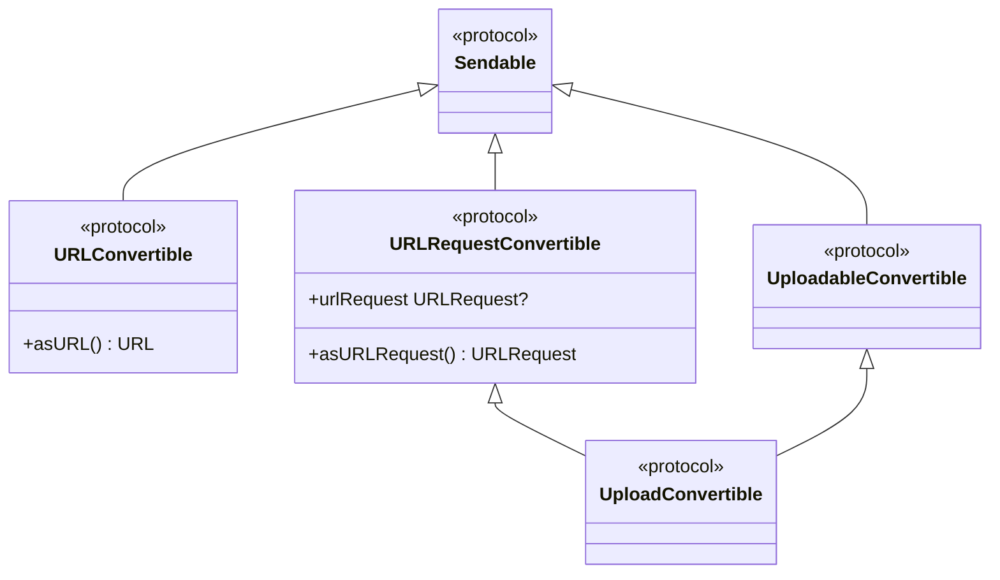
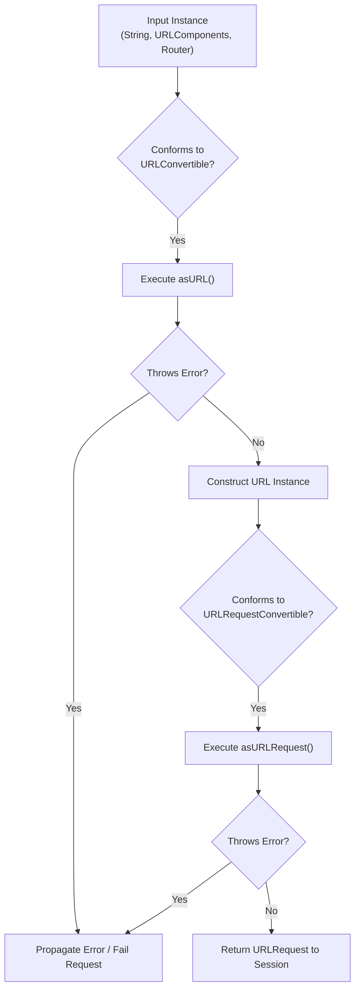

# URL Routing Protocols

<details>
<summary>Relevant source files</summary>

The following files were used as context for generating this wiki page:

- [docs/docsets/Alamofire.docset/Contents/Resources/Documents/Protocols/URLRequestConvertible.html](https://github.com/Alamofire/Alamofire/blob/main/docs/docsets/Alamofire.docset/Contents/Resources/Documents/Protocols/URLRequestConvertible.html)
- [docs/Protocols/URLRequestConvertible.html](https://github.com/Alamofire/Alamofire/blob/main/docs/Protocols/URLRequestConvertible.html)
- [docs/docsets/Alamofire.docset/Contents/Resources/Documents/Protocols/URLConvertible.html](https://github.com/Alamofire/Alamofire/blob/main/docs/docsets/Alamofire.docset/Contents/Resources/Documents/Protocols/URLConvertible.html)
- [docs/Protocols/URLConvertible.html](https://github.com/Alamofire/Alamofire/blob/main/docs/Protocols/URLConvertible.html)
- [docs/docsets/Alamofire.docset/Contents/Resources/Documents/Protocols.html](https://github.com/Alamofire/Alamofire/blob/main/docs/Protocols.html)
- [docs/Protocols.html](https://github.com/Alamofire/Alamofire/blob/main/docs/Protocols.html)
</details>

## Overview

URL routing protocols provide a robust, type-safe foundation for translating native Swift types and custom router configurations into executable network requests. By formalizing conversion contracts, these components eliminate boilerplate string-to-URL parsing and streamline how endpoints, parameters, and headers are structured across a networking layer.

Sources: [docs/docsets/Alamofire.docset/Contents/Resources/Documents/Protocols/URLConvertible.html:581-582](https://github.com/Alamofire/Alamofire/blob/main/docs/docsets/Alamofire.docset/Contents/Resources/Documents/Protocols/URLConvertible.html#L581-L582), [docs/docsets/Alamofire.docset/Contents/Resources/Documents/Protocols/URLRequestConvertible.html:581-581](https://github.com/Alamofire/Alamofire/blob/main/docs/docsets/Alamofire.docset/Contents/Resources/Documents/Protocols/URLRequestConvertible.html#L581-L581)

## URLConvertible Protocol Architecture

### Overview

The `URLConvertible` protocol serves as the foundational abstraction for transforming conforming types into native Swift `URL` instances. Types adopting `URLConvertible` can be passed into request-building methods, allowing raw strings, components, and URL instances to be treated uniformly across the framework.

Sources: [docs/docsets/Alamofire.docset/Contents/Resources/Documents/Protocols/URLConvertible.html:577-582](https://github.com/Alamofire/Alamofire/blob/main/docs/docsets/Alamofire.docset/Contents/Resources/Documents/Protocols/URLConvertible.html#L577-L582)

### Protocol Requirements and Mechanics

`URLConvertible` inherits from `Sendable`, requiring all conforming types to be safe for concurrent transfer across thread and actor boundaries. The core obligation of the protocol is the `asURL()` throwing method.

```swift
public protocol URLConvertible : Sendable {
    func asURL() throws -> URL
}
```

Sources: [docs/docsets/Alamofire.docset/Contents/Resources/Documents/Protocols/URLConvertible.html:577-577](https://github.com/Alamofire/Alamofire/blob/main/docs/docsets/Alamofire.docset/Contents/Resources/Documents/Protocols/URLConvertible.html#L577-L577), [docs/docsets/Alamofire.docset/Contents/Resources/Documents/Protocols/URLConvertible.html:616-616](https://github.com/Alamofire/Alamofire/blob/main/docs/docsets/Alamofire.docset/Contents/Resources/Documents/Protocols/URLConvertible.html#L616-L616)

When `asURL()` is invoked on an instance, it either constructs and returns a valid Foundation `URL` or throws an error encountered during initialization (such as an invalid URL string).

Sources: [docs/docsets/Alamofire.docset/Contents/Resources/Documents/Protocols/URLConvertible.html:603-609](https://github.com/Alamofire/Alamofire/blob/main/docs/docsets/Alamofire.docset/Contents/Resources/Documents/Protocols/URLConvertible.html#L603-L609)

> [!NOTE]
> Conformance to `Sendable` ensures that custom string wrappers or endpoint builders conforming to `URLConvertible` can be safely passed to asynchronous tasks or concurrent dispatch queues without risk of data races.

Sources: [docs/docsets/Alamofire.docset/Contents/Resources/Documents/Protocols/URLConvertible.html:577-577](https://github.com/Alamofire/Alamofire/blob/main/docs/docsets/Alamofire.docset/Contents/Resources/Documents/Protocols/URLConvertible.html#L577-L577)

## URLRequestConvertible Protocol Architecture

### Overview

The `URLRequestConvertible` protocol establishes a uniform interface for generating complete `URLRequest` instances. While `URLConvertible` isolates URL creation, `URLRequestConvertible` encapsulates full request setup, including HTTP method specification, header configuration, and parameter encoding.

Sources: [docs/docsets/Alamofire.docset/Contents/Resources/Documents/Protocols/URLRequestConvertible.html:577-581](https://github.com/Alamofire/Alamofire/blob/main/docs/docsets/Alamofire.docset/Contents/Resources/Documents/Protocols/URLRequestConvertible.html#L577-L581)

### Protocol Interface Surface

Like `URLConvertible`, `URLRequestConvertible` refines `Sendable`. Conforming types must implement `asURLRequest() throws -> URLRequest` and automatically gain access to a convenience property accessor provided by protocol extensions.

```swift
public protocol URLRequestConvertible : Sendable {
    func asURLRequest() throws -> URLRequest
}
```

Sources: [docs/docsets/Alamofire.docset/Contents/Resources/Documents/Protocols/URLRequestConvertible.html:577-577](https://github.com/Alamofire/Alamofire/blob/main/docs/docsets/Alamofire.docset/Contents/Resources/Documents/Protocols/URLRequestConvertible.html#L577-L577), [docs/docsets/Alamofire.docset/Contents/Resources/Documents/Protocols/URLRequestConvertible.html:615-615](https://github.com/Alamofire/Alamofire/blob/main/docs/docsets/Alamofire.docset/Contents/Resources/Documents/Protocols/URLRequestConvertible.html#L615-L615)

The protocol provides two primary members:

* `func asURLRequest() throws -> URLRequest`: The core throwing method that generates a `URLRequest` or propagates construction failures.
* `public var urlRequest: URLRequest?`: A convenience extension property that calls `asURLRequest()`, discarding any thrown error and returning `nil` on failure.

Sources: [docs/docsets/Alamofire.docset/Contents/Resources/Documents/Protocols/URLRequestConvertible.html:615-615](https://github.com/Alamofire/Alamofire/blob/main/docs/docsets/Alamofire.docset/Contents/Resources/Documents/Protocols/URLRequestConvertible.html#L615-L615), [docs/docsets/Alamofire.docset/Contents/Resources/Documents/Protocols/URLRequestConvertible.html:649-649](https://github.com/Alamofire/Alamofire/blob/main/docs/docsets/Alamofire.docset/Contents/Resources/Documents/Protocols/URLRequestConvertible.html#L649-L649)

> [!WARNING]
> Accessing the `urlRequest` extension property suppresses all errors thrown during request conversion by returning `nil`. For robust error propagation and diagnostic logging, always call `asURLRequest()` directly.

Sources: [docs/docsets/Alamofire.docset/Contents/Resources/Documents/Protocols/URLRequestConvertible.html:602-608](https://github.com/Alamofire/Alamofire/blob/main/docs/docsets/Alamofire.docset/Contents/Resources/Documents/Protocols/URLRequestConvertible.html#L602-L608), [docs/docsets/Alamofire.docset/Contents/Resources/Documents/Protocols/URLRequestConvertible.html:641-643](https://github.com/Alamofire/Alamofire/blob/main/docs/docsets/Alamofire.docset/Contents/Resources/Documents/Protocols/URLRequestConvertible.html#L641-L643)

## Protocol Relationships and Type Hierarchy

### Overview

Alamofire constructs a hierarchical type system using Swift protocol inheritance to compose routing and upload responsibilities. Understanding these protocol relationships clarifies how lower-level URL conversions connect to higher-level routing abstractions.

Sources: [docs/docsets/Alamofire.docset/Contents/Resources/Documents/Protocols.html:718-827](https://github.com/Alamofire/Alamofire/blob/main/docs/docsets/Alamofire.docset/Contents/Resources/Documents/Protocols.html#L718-L827)

### Type Hierarchy Diagram



Sources: [docs/docsets/Alamofire.docset/Contents/Resources/Documents/Protocols.html:737-739](https://github.com/Alamofire/Alamofire/blob/main/docs/docsets/Alamofire.docset/Contents/Resources/Documents/Protocols.html#L737-L739), [docs/docsets/Alamofire.docset/Contents/Resources/Documents/Protocols.html:769-771](https://github.com/Alamofire/Alamofire/blob/main/docs/docsets/Alamofire.docset/Contents/Resources/Documents/Protocols.html#L769-L771), [docs/docsets/Alamofire.docset/Contents/Resources/Documents/Protocols.html:809-810](https://github.com/Alamofire/Alamofire/blob/main/docs/docsets/Alamofire.docset/Contents/Resources/Documents/Protocols.html#L809-L810)

### Protocol Comparison Matrix

| Protocol | Base Inheritance | Core Method / Property | Primary Purpose |
| :--- | :--- | :--- | :--- |
| `URLConvertible` | `Sendable` | `func asURL() throws -> URL` | Converts types to Foundation `URL` instances |
| `URLRequestConvertible` | `Sendable` | `func asURLRequest() throws -> URLRequest` | Converts types to Foundation `URLRequest` instances |
| `UploadableConvertible` | `Sendable` | N/A | Produces an `UploadRequest.Uploadable` payload |
| `UploadConvertible` | `URLRequestConvertible`, `UploadableConvertible` | Extends both protocols | Combined routing and payload conversion for uploads |

Sources: [docs/docsets/Alamofire.docset/Contents/Resources/Documents/Protocols.html:737-739](https://github.com/Alamofire/Alamofire/blob/main/docs/docsets/Alamofire.docset/Contents/Resources/Documents/Protocols.html#L737-L739), [docs/docsets/Alamofire.docset/Contents/Resources/Documents/Protocols.html:769-771](https://github.com/Alamofire/Alamofire/blob/main/docs/docsets/Alamofire.docset/Contents/Resources/Documents/Protocols.html#L769-L771), [docs/docsets/Alamofire.docset/Contents/Resources/Documents/Protocols.html:778-810](https://github.com/Alamofire/Alamofire/blob/main/docs/docsets/Alamofire.docset/Contents/Resources/Documents/Protocols.html#L778-L810)

## Standard Type Extensions for URL Routing

### Overview

To reduce conversion friction, Alamofire provides extensions for Foundation and Swift standard library types, conforming them directly to `URLConvertible`. This enables developers to pass raw strings or components directly into network request interfaces.

Sources: [docs/docsets/Alamofire.docset/Contents/Resources/Documents/Protocols/URLConvertible.html:326-336](https://github.com/Alamofire/Alamofire/blob/main/docs/docsets/Alamofire.docset/Contents/Resources/Documents/Protocols/URLConvertible.html#L326-L336)

### Conforming Types and Request Pipeline Flow

The following diagram illustrates how standard input types move through `URLConvertible` and `URLRequestConvertible` protocols down to session execution:



Sources: [docs/docsets/Alamofire.docset/Contents/Resources/Documents/Protocols/URLConvertible.html:581-582](https://github.com/Alamofire/Alamofire/blob/main/docs/docsets/Alamofire.docset/Contents/Resources/Documents/Protocols/URLConvertible.html#L581-L582), [docs/docsets/Alamofire.docset/Contents/Resources/Documents/Protocols/URLRequestConvertible.html:581-581](https://github.com/Alamofire/Alamofire/blob/main/docs/docsets/Alamofire.docset/Contents/Resources/Documents/Protocols/URLRequestConvertible.html#L581-L581)

The following extensions are documented as key protocol conformances within the routing subsystem:

* **`String`**: Implements `asURL()` by initializing a Foundation `URL(string:)`. Throws an error if the string is malformed.
* **`URL`**: Implements `asURL()` by returning `self`.
* **`URLComponents`**: Implements `asURL()` by evaluating its `url` property, throwing if the components fail to yield a valid URL.
* **`URLRequest`**: Conforms to `URLRequestConvertible` by returning `self`.

Sources: [docs/docsets/Alamofire.docset/Contents/Resources/Documents/Protocols/URLConvertible.html:326-336](https://github.com/Alamofire/Alamofire/blob/main/docs/docsets/Alamofire.docset/Contents/Resources/Documents/Protocols/URLConvertible.html#L326-L336), [docs/docsets/Alamofire.docset/Contents/Resources/Documents/Protocols/URLRequestConvertible.html:336-336](https://github.com/Alamofire/Alamofire/blob/main/docs/docsets/Alamofire.docset/Contents/Resources/Documents/Protocols/URLRequestConvertible.html#L336-L336)

## Router Design Pattern and Implementation

### Overview

The Router pattern leverages `URLRequestConvertible` to centralize endpoint declaration, parameter formatting, and request creation inside strong, value-typed Swift structures (typically `enum`s).

Sources: [docs/docsets/Alamofire.docset/Contents/Resources/Documents/Protocols/URLRequestConvertible.html:577-581](https://github.com/Alamofire/Alamofire/blob/main/docs/docsets/Alamofire.docset/Contents/Resources/Documents/Protocols/URLRequestConvertible.html#L577-L581)

### Complete Worked Example

Below is a complete, runnable example demonstrating an API router conforming to `URLRequestConvertible` that configures HTTP methods, target paths, parameters, and headers:

```swift
import Foundation
import Alamofire

enum UserRouter: URLRequestConvertible {
    case fetchProfile(userID: String)
    case updateStatus(userID: String, status: String)

    var baseURL: String {
        return "https://api.example.com/v1"
    }

    var path: String {
        switch self {
        case .fetchProfile(let userID):
            return "/users/\(userID)"
        case .updateStatus(let userID, _):
            return "/users/\(userID)/status"
        }
    }

    var method: HTTPMethod {
        switch self {
        case .fetchProfile:
            return .get
        case .updateStatus:
            return .post
        }
    }

    func asURLRequest() throws -> URLRequest {
        let url = try baseURL.asURL().appendingPathComponent(path)
        var request = URLRequest(url: url)
        request.httpMethod = method.rawValue

        switch self {
        case .updateStatus(_, let status):
            let parameters = ["status": status]
            request = try URLEncodedFormParameterEncoder.default.encode(parameters, into: request)
        case .fetchProfile:
            break
        }

        return request
    }
}
```

Sources: [docs/docsets/Alamofire.docset/Contents/Resources/Documents/Protocols/URLConvertible.html:616-616](https://github.com/Alamofire/Alamofire/blob/main/docs/docsets/Alamofire.docset/Contents/Resources/Documents/Protocols/URLConvertible.html#L616-L616), [docs/docsets/Alamofire.docset/Contents/Resources/Documents/Protocols/URLRequestConvertible.html:615-615](https://github.com/Alamofire/Alamofire/blob/main/docs/docsets/Alamofire.docset/Contents/Resources/Documents/Protocols/URLRequestConvertible.html#L615-L615)

> [!TIP]
> Grouping endpoints in an `enum` router ensures compile-time exhaustive checking when adding new endpoints or modifying URL parameters across an application.

Sources: [docs/docsets/Alamofire.docset/Contents/Resources/Documents/Protocols/URLRequestConvertible.html:577-581](https://github.com/Alamofire/Alamofire/blob/main/docs/docsets/Alamofire.docset/Contents/Resources/Documents/Protocols/URLRequestConvertible.html#L577-L581)

## Error Handling and Fallback Accessors

### Overview

URL conversion operations are inherently fallible due to runtime inputs such as dynamic user input or malformed remote path strings. Both `URLConvertible` and `URLRequestConvertible` rely on Swift throwing semantics to handle conversion failures cleanly.

Sources: [docs/docsets/Alamofire.docset/Contents/Resources/Documents/Protocols/URLConvertible.html:604-608](https://github.com/Alamofire/Alamofire/blob/main/docs/docsets/Alamofire.docset/Contents/Resources/Documents/Protocols/URLConvertible.html#L604-L608), [docs/docsets/Alamofire.docset/Contents/Resources/Documents/Protocols/URLRequestConvertible.html:603-607](https://github.com/Alamofire/Alamofire/blob/main/docs/docsets/Alamofire.docset/Contents/Resources/Documents/Protocols/URLRequestConvertible.html#L603-L607)

### Error Propagation versus Safe Fallbacks

When calling `asURL()` or `asURLRequest()`, any failure during URL parsing or parameter encoding immediately throws an `Error`. This failure is caught by Alamofire's underlying request setup chain, marking the `Request` as failed before network execution begins.

Alternatively, the `urlRequest` extension property provides a safe optional accessor for contexts where throwing errors is undesirable:

```swift
// Direct throwing invocation:
do {
    let request = try router.asURLRequest()
    print("Successfully built request: \(request)")
} catch {
    print("Failed to build request: \(error)")
}

// Optional fallback accessor:
if let request = router.urlRequest {
    print("Request built safely: \(request)")
} else {
    print("Conversion failed silently; urlRequest returned nil.")
}
```

Sources: [docs/docsets/Alamofire.docset/Contents/Resources/Documents/Protocols/URLRequestConvertible.html:615-615](https://github.com/Alamofire/Alamofire/blob/main/docs/docsets/Alamofire.docset/Contents/Resources/Documents/Protocols/URLRequestConvertible.html#L615-L615), [docs/docsets/Alamofire.docset/Contents/Resources/Documents/Protocols/URLRequestConvertible.html:649-649](https://github.com/Alamofire/Alamofire/blob/main/docs/docsets/Alamofire.docset/Contents/Resources/Documents/Protocols/URLRequestConvertible.html#L649-L649)

## Related

- [[HTTP Headers and Methods]]
- [[Session And Requests]]

