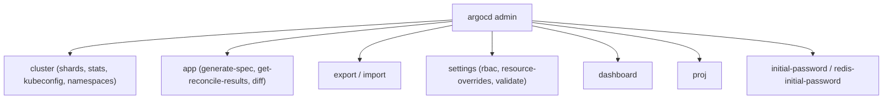
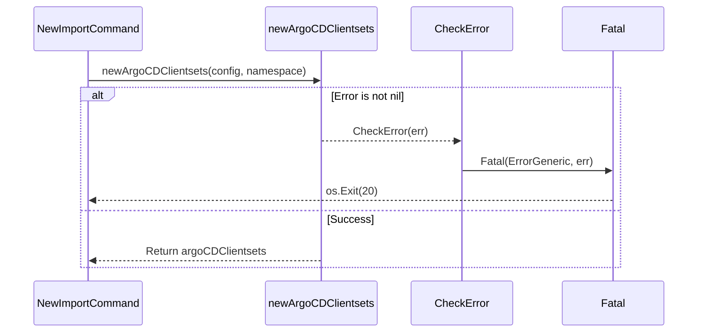

# Admin CLI

<details>
<summary>Relevant source files</summary>

The following files were used as context for generating this wiki page:

- [docs/user-guide/commands/argocd_admin_settings_rbac.md](https://github.com/argoproj/argo-cd/blob/main/docs/user-guide/commands/argocd_admin_settings_rbac.md)
- [docs/user-guide/commands/argocd_admin.md](https://github.com/argoproj/argo-cd/blob/main/docs/user-guide/commands/argocd_admin.md)
- [docs/user-guide/commands/argocd_admin_cluster.md](https://github.com/argoproj/argo-cd/blob/main/docs/user-guide/commands/argocd_admin_cluster.md)
- [docs/user-guide/commands/argocd_admin_export.md](https://github.com/argoproj/argo-cd/blob/main/docs/user-guide/commands/argocd_admin_export.md)
- [docs/user-guide/commands/argocd_admin_settings.md](https://github.com/argoproj/argo-cd/blob/main/docs/user-guide/commands/argocd_admin_settings.md)
- [cmd/argocd/commands/admin/backup.go](https://github.com/argoproj/argo-cd/blob/main/cmd/argocd/commands/admin/backup.go)
- [docs/operator-manual/troubleshooting.md](https://github.com/argoproj/argo-cd/blob/main/docs/operator-manual/troubleshooting.md)
- [cmd/argocd/commands/admin/cluster.go](https://github.com/argoproj/argo-cd/blob/main/cmd/argocd/commands/admin/cluster.go)
- [docs/user-guide/commands/argocd_admin_import.md](https://github.com/argoproj/argo-cd/blob/main/docs/user-guide/commands/argocd_admin_import.md)
- [docs/operator-manual/notifications/troubleshooting.md](https://github.com/argoproj/argo-cd/blob/main/docs/operator-manual/notifications/troubleshooting.md)
- [cmd/argocd/commands/admin/admin.go](https://github.com/argoproj/argo-cd/blob/main/cmd/argocd/commands/admin/admin.go)
- [docs/user-guide/commands/argocd_admin_app.md](https://github.com/argoproj/argo-cd/blob/main/docs/user-guide/commands/argocd_admin_app.md)
- [docs/operator-manual/disaster_recovery.md](https://github.com/argoproj/argo-cd/blob/main/docs/operator-manual/disaster_recovery.md)
- [docs/proposals/headless-argocd.md](https://github.com/argoproj/argo-cd/blob/main/docs/proposals/headless-argocd.md)
- [docs/user-guide/commands/argocd_admin_cluster_kubeconfig.md](https://github.com/argoproj/argo-cd/blob/main/docs/user-guide/commands/argocd_admin_cluster_kubeconfig.md)
- [docs/user-guide/commands/argocd_admin_settings_rbac_can.md](https://github.com/argoproj/argo-cd/blob/main/docs/user-guide/commands/argocd_admin_settings_rbac_can.md)
- [docs/user-guide/commands/argocd_admin_cluster_shards.md](https://github.com/argoproj/argo-cd/blob/main/docs/user-guide/commands/argocd_admin_cluster_shards.md)
- [docs/user-guide/commands/argocd_admin_settings_rbac_validate.md](https://github.com/argoproj/argo-cd/blob/main/docs/user-guide/commands/argocd_admin_settings_rbac_validate.md)
- [docs/user-guide/commands/argocd_admin_cluster_stats.md](https://github.com/argoproj/argo-cd/blob/main/docs/user-guide/commands/argocd_admin_cluster_stats.md)
- [docs/user-guide/commands/argocd_admin_proj.md](https://github.com/argoproj/argo-cd/blob/main/docs/user-guide/commands/argocd_admin_proj.md)
- [docs/user-guide/commands/argocd_admin_dashboard.md](https://github.com/argoproj/argo-cd/blob/main/docs/user-guide/commands/argocd_admin_dashboard.md)
- [docs/operator-manual/rbac.md](https://github.com/argoproj/argo-cd/blob/main/docs/operator-manual/rbac.md)
- [cmd/argocd/commands/admin/app.go](https://github.com/argoproj/argo-cd/blob/main/cmd/argocd/commands/admin/app.go)
- [util/errors/errors.go](https://github.com/argoproj/argo-cd/blob/main/util/errors/errors.go)
</details>

## Overview

The Admin CLI (`argocd admin`) is a specialized command-line subsystem embedded within the primary Argo CD CLI binary. It is engineered specifically for cluster operators, system administrators, and site reliability engineers who require direct administrative access to the Kubernetes control plane underlying Argo CD. Unlike standard user-facing commands that communicate via the Argo CD API server, gRPC endpoints, and user authentication tokens, the Admin CLI operates via direct Kubernetes client-go interactions against custom resources, config maps, secrets, and controller states. This makes it an essential tool for headless topologies, disaster recovery operations, and low-level cluster diagnostics.

Sources: [docs/user-guide/commands/argocd_admin.md#L3-L6](https://github.com/argoproj/argo-cd/blob/main/docs/user-guide/commands/argocd_admin.md#L3-L6)

The core design philosophy of the Admin CLI is to unify legacy administrative tasks—formerly distributed across separate utility binaries or scripts—into a cohesive command hierarchy. It provides comprehensive mechanisms for disaster recovery backup and restoration (`export` and `import`), cluster connectivity and sharding diagnostics (`cluster shards`, `cluster stats`, `cluster kubeconfig`), local Web UI execution (`dashboard`), application specification generation and reconciliation testing (`app generate-spec`, `app get-reconcile-results`), and policy validation (`settings rbac validate`, `settings rbac can`). By bypassing the API server, operators can troubleshoot connectivity, audit configurations, and perform maintenance even when the core API server or authentication layer is completely non-functional.

Sources: [docs/proposals/headless-argocd.md#L90-L96](https://github.com/argoproj/argo-cd/blob/main/docs/proposals/headless-argocd.md#L90-L96)

Architecturally, the Admin CLI initializes dynamic clientsets using standard kubeconfig resolution and interacts directly with Kubernetes API groups (`argoproj.io/v1alpha1` and core v1). Operations such as state exports stream well-known config maps, secrets, application projects, applications, and application sets with namespace scoping and label filtering. Similarly, maintenance commands can evaluate sharding algorithms, extract cluster credentials into isolated kubeconfig files, or test Casbin-based RBAC policies locally before deploying them to production.

Sources: [cmd/argocd/commands/admin/admin.go](https://github.com/argoproj/argo-cd/blob/main/cmd/argocd/commands/admin/admin.go#L54-L61)

## Architecture and Command Structure

The Admin CLI subsystem is organized around a Cobra command tree rooted at `argocd admin`. The main entry point initializes logging flags (`logformat` and `loglevel`) and registers all administrative subcommands. Each subcommand establishes a direct Kubernetes dynamic client or typed clientset (`kubernetes.Interface` and `versioned.Interface`) using standard kubeconfig context rules, avoiding reliance on an authenticated Argo CD API server session.

Sources: [cmd/argocd/commands/admin/admin.go](https://github.com/argoproj/argo-cd/blob/main/cmd/argocd/commands/admin/admin.go#L55-L88)



Sources: [cmd/argocd/commands/admin/admin.go](https://github.com/argoproj/argo-cd/blob/main/cmd/argocd/commands/admin/admin.go#L73-L84)

The command execution framework relies on helper routines like `newArgoCDClientsets` to provision dynamic resource bindings for core configuration maps, secrets, applications, application projects, and application sets within the target namespace.

Sources: [cmd/argocd/commands/admin/admin.go](https://github.com/argoproj/argo-cd/blob/main/cmd/argocd/commands/admin/admin.go#L89-L100)

## Disaster Recovery: Export and Import Mechanism

The `export` and `import` commands provide a complete disaster recovery pipeline for Argo CD instances. The `export` command queries the Kubernetes API server directly, serializing well-known config maps (`argocd-cm`, `argocd-rbac-cm`, `argocd-known-hosts-cm`, `argocd-tls-certs-cm`), managed secrets (`isArgoCDSecret`), application projects, applications, and application sets into a multi-document YAML stream separated by `---`.

Sources: [docs/operator-manual/disaster_recovery.md#L3-L25](https://github.com/argoproj/argo-cd/blob/main/docs/operator-manual/disaster_recovery.md#L3-L25), [cmd/argocd/commands/admin/backup.go](https://github.com/argoproj/argo-cd/blob/main/cmd/argocd/commands/admin/backup.go#L33-L137)

When importing data via `argocd admin import SOURCE`, the execution flow follows a rigorous call chain: `NewImportCommand` invokes `newArgoCDClientsets` to provision dynamic clientsets; if an error occurs, `newArgoCDClientsets` delegates to `CheckError` in `util/errors/errors.go`, which invokes `Fatal(ErrorGeneric, err)` to log a fatal error and terminate process execution with exit code 20.

Sources: [cmd/argocd/commands/admin/backup.go](https://github.com/argoproj/argo-cd/blob/main/cmd/argocd/commands/admin/backup.go#L157-L188), [cmd/argocd/commands/admin/admin.go](https://github.com/argoproj/argo-cd/blob/main/cmd/argocd/commands/admin/admin.go#L89-L100), [util/errors/errors.go](https://github.com/argoproj/argo-cd/blob/main/util/errors/errors.go#L33-L47)



Sources: [cmd/argocd/commands/admin/backup.go](https://github.com/argoproj/argo-cd/blob/main/cmd/argocd/commands/admin/backup.go#L187-L190), [cmd/argocd/commands/admin/admin.go](https://github.com/argoproj/argo-cd/blob/main/cmd/argocd/commands/admin/admin.go#L89-L100), [util/errors/errors.go](https://github.com/argoproj/argo-cd/blob/main/util/errors/errors.go#L33-L47)

When executing `argocd admin import SOURCE`, the subsystem follows a strict execution flow: it reads backup input, populates `pruneObjects`, compares backup resources against live objects via `specsEqual`, updates or creates resources, and optionally prunes stale entities.

Sources: [cmd/argocd/commands/admin/backup.go](https://github.com/argoproj/argo-cd/blob/main/cmd/argocd/commands/admin/backup.go#L172-L426)

> [!WARNING]
> When executing `argocd admin export` or `import` in a non-default Argo CD namespace, you must explicitly supply the namespace parameter (`-n <namespace>`). The export command will not fail if executed against the wrong namespace context, resulting in an empty or incomplete backup.

Sources: [docs/operator-manual/disaster_recovery.md#L27-L29](https://github.com/argoproj/argo-cd/blob/main/docs/operator-manual/disaster_recovery.md#L27-L29)

## Cluster Management and Sharding Diagnostics

The `argocd admin cluster` command group provides administrative visibility into multi-cluster management, controller sharding distribution, resource statistics, and credential extraction.

Sources: [docs/user-guide/commands/argocd_admin_cluster.md#L3-L23](https://github.com/argoproj/argo-cd/blob/main/docs/user-guide/commands/argocd_admin_cluster.md#L3-L23)

The `cluster shards` and `cluster stats` commands load all registered clusters from the Argo DB and evaluate application distributions across controller replicas. The sharding calculation utilizes `sharding.NewClusterSharding`, supporting legacy, round-robin, and consistent-hashing algorithms defined in `argocd-cmd-params-cm`.

Sources: [cmd/argocd/commands/admin/cluster.go](https://github.com/argoproj/argo-cd/blob/main/cmd/argocd/commands/admin/cluster.go#L81-L110)

| Subcommand | Purpose | Key Flags |
| :--- | :--- | :--- |
| `argocd admin cluster stats` | Prints connection state, namespace count, app count, and resource count per cluster and shard. | `--shard`, `--replicas`, `--sharding-method`, `--port-forward-redis` |
| `argocd admin cluster shards` | Prints a summary table of resource counts, percentage of total, and percentage of average per shard. | `--shard`, `--replicas`, `--sharding-method`, `--port-forward-redis` |
| `argocd admin cluster kubeconfig` | Generates a standalone kubeconfig file for a managed cluster from its stored secret credentials. | `--namespace`, `--insecure-skip-tls-verify` |
| `argocd admin cluster generate-spec` | Generates declarative JSON/YAML specification for cluster registration from a kubeconfig context. | `-o`, `--bearer-token`, `--generate-bearer-token`, `--service-account` |
| `argocd admin cluster namespaces` | Inspects and prints namespaces managed by Argo CD across clusters. | `--namespace` |
| `argocd admin cluster enable-namespaced-mode` | Enables namespaced-mode on clusters matching a glob pattern. | `--dry-run`, `--cluster-resources`, `--max-namespace-count` |

Sources: [cmd/argocd/commands/admin/cluster.go](https://github.com/argoproj/argo-cd/blob/main/cmd/argocd/commands/admin/cluster.go#L193-L246), [cmd/argocd/commands/admin/cluster.go](https://github.com/argoproj/argo-cd/blob/main/cmd/argocd/commands/admin/cluster.go#L480-L540)

## RBAC Policy Validation and Testing

The `argocd admin settings rbac` subsystem allows operators to inspect, validate, and test Casbin-based RBAC configurations without applying them to a live server.

Sources: [docs/user-guide/commands/argocd_admin_settings_rbac.md#L1-L15](https://github.com/argoproj/argo-cd/blob/main/docs/user-guide/commands/argocd_admin_settings_rbac.md#L1-L15)

- **`argocd admin settings rbac validate`**: Validates syntactic correctness of an RBAC policy file or a Kubernetes ConfigMap (`argocd-rbac-cm` format containing `policy.csv` and optional default policies).
- **`argocd admin settings rbac can`**: Evaluates whether a specific role, user, or group subject has permissions to perform an action on a target resource and sub-resource.

Sources: [docs/user-guide/commands/argocd_admin_settings_rbac_can.md#L3-L16](https://github.com/argoproj/argo-cd/blob/main/docs/user-guide/commands/argocd_admin_settings_rbac_can.md#L3-L16), [docs/user-guide/commands/argocd_admin_settings_rbac_validate.md#L3-L13](https://github.com/argoproj/argo-cd/blob/main/docs/user-guide/commands/argocd_admin_settings_rbac_validate.md#L3-L13)

```bash
# Test whether role team-alpha can create an application in the default project using a local policy file
argocd admin settings rbac can role:team-alpha create application 'default/my-app' --policy-file policy.csv
```

Sources: [docs/user-guide/commands/argocd_admin_settings_rbac_can.md#L20-L25](https://github.com/argoproj/argo-cd/blob/main/docs/user-guide/commands/argocd_admin_settings_rbac_can.md#L20-L25)

The matching engine honors both glob and regex matching modes (`policy.matchMode`). When evaluating policies, the engine checks default policies (`policy.default`) first; if an action is explicitly allowed or denied by default policies, it takes immediate effect. Otherwise, subject-specific policies and inherited roles are traversed.

Sources: [docs/operator-manual/rbac.md#L290-L305](https://github.com/argoproj/argo-cd/blob/main/docs/operator-manual/rbac.md#L290-L305)

> [!NOTE]
> **Deny Rule Priority:** If a policy matches with a `deny` effect, it takes precedence over any matching `allow` rules, regardless of the order in which policies appear in the CSV configuration file.

Sources: [docs/operator-manual/rbac.md#L283-L290](https://github.com/argoproj/argo-cd/blob/main/docs/operator-manual/rbac.md#L283-L290)

## Local Dashboard and Headless Execution

To support headless Argo CD deployments where the API server and UI ingress are omitted, the Admin CLI provides the `argocd admin dashboard` command.

Sources: [docs/user-guide/commands/argocd_admin_dashboard.md#L3-L6](https://github.com/argoproj/argo-cd/blob/main/docs/user-guide/commands/argocd_admin_dashboard.md#L3-L6)

The dashboard command embeds static web UI assets directly into the binary and starts a local HTTP server (defaulting to `localhost:8080`). It wires up API routing and client connections directly to the Kubernetes control plane and Redis backend, providing cluster administrators with full Web UI functionality and CLI access without requiring multi-tenancy server infrastructure or external auth providers.

Sources: [docs/proposals/headless-argocd.md#L86-L95](https://github.com/argoproj/argo-cd/blob/main/docs/proposals/headless-argocd.md#L86-L95)

```bash
# Start the Argo CD Web UI locally on a custom port
argocd admin dashboard --port 9090 --address 127.0.0.1
```

Sources: [docs/user-guide/commands/argocd_admin_dashboard.md#L11-L19](https://github.com/argoproj/argo-cd/blob/main/docs/user-guide/commands/argocd_admin_dashboard.md#L11-L19)

## Error Handling and Exit Codes

The Admin CLI leverages the centralized error handling utilities in `util/errors/errors.go`. When unrecoverable errors occur during Kubernetes API calls, file I/O, or resource serialization, `errors.CheckError(err)` intercepts the error and invokes `Fatal(ErrorGeneric, err)`, which registers an exit handler to terminate execution with exit code `20` (`ErrorGeneric`).

Sources: [util/errors/errors.go#L11-L38](https://github.com/argoproj/argo-cd/blob/main/util/errors/errors.go#L11-L38)

```go
// CheckError logs a fatal message and exits with ErrorGeneric if err is not nil
func CheckError(err error) {
	if err != nil {
		Fatal(ErrorGeneric, err)
	}
}
```

Sources: [util/errors/errors.go#L33-L38](https://github.com/argoproj/argo-cd/blob/main/util/errors/errors.go#L33-L38)

For authorization or missing resource warnings (such as forbidden access to ApplicationSets during backups or imports), the CLI catches `apierrors.IsForbidden` or `apierrors.IsNotFound`, logs warnings via Logrus, and continues execution where possible rather than abruptly terminating.

Sources: [cmd/argocd/commands/admin/backup.go#L122-L130](https://github.com/argoproj/argo-cd/blob/main/cmd/argocd/commands/admin/backup.go#L122-L130)

## Related

- [[CLI Architecture]]

