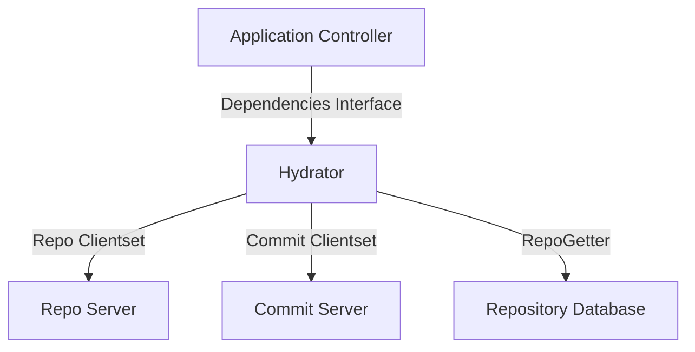
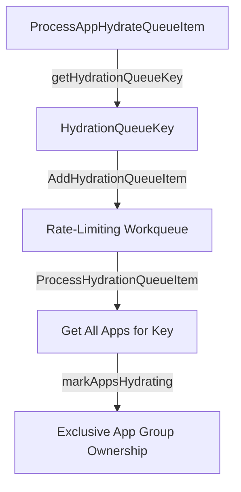

# Application Hydrator

<details>
<summary>Relevant source files</summary>

The following files were used as context for generating this wiki page:

- [controller/hydrator/hydrator.go](https://github.com/argoproj/argo-cd/blob/main/controller/hydrator/hydrator.go)
- [docs/proposals/manifest-hydrator.md](https://github.com/argoproj/argo-cd/blob/main/docs/proposals/manifest-hydrator.md)
- [manifests/namespace-install-with-hydrator.yaml](https://github.com/argoproj/argo-cd/blob/main/manifests/namespace-install-with-hydrator.yaml)
- [controller/sync.go](https://github.com/argoproj/argo-cd/blob/main/controller/sync.go)
</details>

## Overview

The Application Hydrator component transforms "dry" manifest sources like Helm charts and Kustomize overlays into fully rendered, plain Kubernetes manifests that are automatically committed and stored back in Git. By establishing a dedicated controller and queueing mechanism within Argo CD, it bridges the gap between abstract application specifications and auditable git-backed desired states. Sources: [docs/proposals/manifest-hydrator.md](https://github.com/argoproj/argo-cd/blob/main/docs/proposals/manifest-hydrator.md#L19-L34), [controller/hydrator/hydrator.go](https://github.com/argoproj/argo-cd/blob/main/controller/hydrator/hydrator.go#L114-L134)

This architecture addresses the complexity and lack of transparency inherent in runtime configuration injection by ensuring that every deployed change retains an explicit, verifiable git lineage and commit history. It coordinates application validation, revision change detection, parallel worker execution, and commit server write-backs while integrating cleanly with core controller structures and existing sync workflows. Sources: [docs/proposals/manifest-hydrator.md](https://github.com/argoproj/argo-cd/blob/main/docs/proposals/manifest-hydrator.md#L28-L68), [controller/hydrator/hydrator.go](https://github.com/argoproj/argo-cd/blob/main/controller/hydrator/hydrator.go#L184-L203)

## Hydration Architecture and System Deployment

### Overview

The hydration architecture integrates manifest rendering into the Argo CD application controller by defining a dedicated `Hydrator` struct and associated interfaces that interact with core subsystem clients. The core controller manages application processing through the `Dependencies` interface, which abstracts repository getters, project validation, write credentials, and cache evaluation without directly coupling the controller logic. Sources: [controller/hydrator/hydrator.go](https://github.com/argoproj/argo-cd/blob/main/controller/hydrator/hydrator.go#L37-L99)


Sources: [controller/hydrator/hydrator.go](https://github.com/argoproj/argo-cd/blob/main/controller/hydrator/hydrator.go#L93-L112)

### System Deployment and Component Configuration

System deployment is configured using specialized manifests and component definitions that establish dedicated microservice boundaries, service accounts, and network policies for the commit server and application controller extensions. The deployment setup incorporates specialized parameters such as `ARGOCD_HYDRATOR_ENABLED` and distinct container arguments to orchestrate write-back capabilities. Sources: [manifests/namespace-install-with-hydrator.yaml](https://github.com/argoproj/argo-cd/blob/main/manifests/namespace-install-with-hydrator.yaml#L24-L27), [manifests/namespace-install-with-hydrator.yaml](https://github.com/argoproj/argo-cd/blob/main/manifests/namespace-install-with-hydrator.yaml#L2471-L2476)

| Component Name | Service Account | Port Bindings | Role / Purpose |
| :--- | :--- | :--- | :--- |
| `argocd-commit-server` | `argocd-commit-server` | `8086`, `8087` (metrics) | Handles writing and committing hydrated manifests to target Git repositories. Sources: [manifests/namespace-install-with-hydrator.yaml](https://github.com/argoproj/argo-cd/blob/main/manifests/namespace-install-with-hydrator.yaml#L24-L27), [manifests/namespace-install-with-hydrator.yaml](https://github.com/argoproj/argo-cd/blob/main/manifests/namespace-install-with-hydrator.yaml#L647-L654) |
| `argocd-application-controller` | `argocd-application-controller` | `8082`, metrics port | Manages application reconciliation, status persistence, and hydration queue scheduling. Sources: [manifests/namespace-install-with-hydrator.yaml](https://github.com/argoproj/argo-cd/blob/main/manifests/namespace-install-with-hydrator.yaml#L6-L9), [manifests/namespace-install-with-hydrator.yaml](https://github.com/argoproj/argo-cd/blob/main/manifests/namespace-install-with-hydrator.yaml#L2998-L3002) |

> [!NOTE]
> The `argocd-commit-server` deployment restricts incoming network traffic via `NetworkPolicy` to accept requests solely from pods matching the `argocd-application-controller` name label on port `8086`. Sources: [manifests/namespace-install-with-hydrator.yaml](https://github.com/argoproj/argo-cd/blob/main/manifests/namespace-install-with-hydrator.yaml#L3111-L3124)

### Core Integration Structs

The `Hydrator` struct coordinates clientsets and timeouts required to execute repository inspection and commit operations. It depends on `commitclient.Clientset` for write-back requests and `apiclient.Clientset` for manifest retrieval. Sources: [controller/hydrator/hydrator.go](https://github.com/argoproj/argo-cd/blob/main/controller/hydrator/hydrator.go#L91-L112)

```go
type Hydrator struct {
	dependencies         Dependencies
	statusRefreshTimeout time.Duration
	commitClientset      commitclient.Clientset
	repoClientset        apiclient.Clientset
	repoGetter           RepoGetter
}
```
Sources: [controller/hydrator/hydrator.go](https://github.com/argoproj/argo-cd/blob/main/controller/hydrator/hydrator.go#L93-L99)

## Hydration Queue and Work Scheduling

### Overview

The hydration subsystem manages scheduling and concurrency through a rate-limiting, key-deduplicated workqueue. Applications that require hydration are grouped by a deterministic `HydrationQueueKey` structure, ensuring that multiple applications targeting the same destination repository and branch are processed together as a single atomic unit. Sources: [controller/hydrator/hydrator.go](https://github.com/argoproj/argo-cd/blob/main/controller/hydrator/hydrator.go#L114-L130), [controller/hydrator/hydrator.go](https://github.com/argoproj/argo-cd/blob/main/controller/hydrator/hydrator.go#L190-L195)


Sources: [controller/hydrator/hydrator.go](https://github.com/argoproj/argo-cd/blob/main/controller/hydrator/hydrator.go#L130-L134), [controller/hydrator/hydrator.go#L173-L182], [controller/hydrator/hydrator.go#L196-L220]

### Call-Chain Execution Walkthrough: Queue Processing

The execution flow from an incoming application queue notification to group processing traverses several explicit steps:

1. `ProcessAppHydrateQueueItem(origApp)`: Evaluates whether an application needs hydration via `appNeedsHydration`. If hydration is required or a refresh timeout has elapsed, it computes the queue key and invokes `Dependencies.AddHydrationQueueItem(key)`. Sources: [controller/hydrator/hydrator.go](https://github.com/argoproj/argo-cd/blob/main/controller/hydrator/hydrator.go#L130-L171)
2. `getHydrationQueueKey(app)`: Extracts and normalizes repository URLs and target revisions, returning a `types.HydrationQueueKey` containing `SourceRepoURL`, `SourceTargetRevision`, `DestinationRepoURL`, and `DestinationBranch`. Sources: [controller/hydrator/hydrator.go](https://github.com/argoproj/argo-cd/blob/main/controller/hydrator/hydrator.go#L173-L182)
3. `ProcessHydrationQueueItem(hydrationKey)`: Consumes the key from the workqueue, calls `h.getAppsForHydrationKey(hydrationKey)` to retrieve all matching processable applications, and hands them to `h.markAppsHydrating(apps)`. Sources: [controller/hydrator/hydrator.go](https://github.com/argoproj/argo-cd/blob/main/controller/hydrator/hydrator.go#L196-L220)
4. `markAppsHydrating(apps)`: Iterates over the retrieved applications, skipping any that are already in the `HydrateOperationPhaseHydrating` phase, stamps a new `HydrateOperation` with phase `Hydrating`, and persists the status. Sources: [controller/hydrator/hydrator.go](https://github.com/argoproj/argo-cd/blob/main/controller/hydrator/hydrator.go#L307-L334)

> [!NOTE]
> Because the hydration workqueue deduplicates entries by `HydrationQueueKey` and never hands the same key to two workers concurrently, `ProcessHydrationQueueItem` holds exclusive ownership of the entire app group. This guarantees that per-app status updates remain safe under parallel hydration workers without race conditions. Sources: [controller/hydrator/hydrator.go](https://github.com/argoproj/argo-cd/blob/main/controller/hydrator/hydrator.go#L121-L126), [controller/hydrator/hydrator.go#L190-L195]

### Hydration Queue Key and Grouping Fields

Applications share a hydration queue key based on their dry source parameters and destination configuration. The key fields and their extraction rules are defined directly from the application specification:

| Key Field | Source Path in Application Spec | Purpose | Sources |
| :--- | :--- | :--- | :--- |
| `SourceRepoURL` | `app.Spec.SourceHydrator.DrySource.RepoURL` | Normalized git URL of the source manifests repository. | [controller/hydrator/hydrator.go](https://github.com/argoproj/argo-cd/blob/main/controller/hydrator/hydrator.go#L175-L176) |
| `SourceTargetRevision` | `app.Spec.SourceHydrator.DrySource.TargetRevision` | Target revision (branch, tag, or commit) of the dry source. | [controller/hydrator/hydrator.go](https://github.com/argoproj/argo-cd/blob/main/controller/hydrator/hydrator.go#L177-L177) |
| `DestinationRepoURL` | `hydrateToSource.RepoURL` | Normalized git URL of the repository where hydrated manifests are committed. | [controller/hydrator/hydrator.go](https://github.com/argoproj/argo-cd/blob/main/controller/hydrator/hydrator.go#L178-L178) |
| `DestinationBranch` | `hydrateToSource.TargetRevision` | Target branch in the destination repository for the commit. | [controller/hydrator/hydrator.go](https://github.com/argoproj/argo-cd/blob/main/controller/hydrator/hydrator.go#L179-L180) |

> [!WARNING]
> If an application's current operation phase is `Hydrating` but its `StartedAt` timestamp has aged past `statusRefreshTimeout`, `ProcessAppHydrateQueueItem` considers it stale (indicating a crashed or delayed worker) and re-enqueues the hydration key. Sources: [controller/hydrator/hydrator.go](https://github.com/argoproj/argo-cd/blob/main/controller/hydrator/hydrator.go#L155-L161)

## Application Validation and Eligibility Evaluation

### Overview

Before executing manifest hydration, the controller evaluates the eligibility and configuration integrity of every application grouped under a `HydrationQueueKey`. This validation step runs inside `ProcessHydrationQueueItem` via `validateApplications`, ensuring project permissions, source accessibility, and target safety constraints are met before any cluster or repository modifications occur. Sources: [controller/hydrator/hydrator.go](https://github.com/argoproj/argo-cd/blob/main/controller/hydrator/hydrator.go#L221-L239), [controller/hydrator/hydrator.go](https://github.com/argoproj/argo-cd/blob/main/controller/hydrator/hydrator.go#L370-L373)

### Call-Chain Execution Walkthrough: Application Validation

The validation pipeline inspects each grouped application sequentially through the following call chain:

1. `validateApplications(apps)`: Iterates over the application list, instantiating tracking maps for projects and unique destination paths. Sources: [controller/hydrator/hydrator.go](https://github.com/argoproj/argo-cd/blob/main/controller/hydrator/hydrator.go#L371-L380)
2. `GetProcessableAppProj(app)`: Fetches the parent `AppProject` for the application, verifying that the project is not deleted and that the application's namespace is permitted. Sources: [controller/hydrator/hydrator.go](https://github.com/argoproj/argo-cd/blob/main/controller/hydrator/hydrator.go#L44-L47), [controller/hydrator/hydrator.go#L384-L388)
3. `proj.IsSourcePermitted(drySource)`: Validates that the dry source repository URL is explicitly permitted by the application project. Sources: [controller/hydrator/hydrator.go](https://github.com/argoproj/argo-cd/blob/main/controller/hydrator/hydrator.go#L389-L393)
4. `IsRootPath(destPath)`: Checks whether the destination path evaluates to a root path, rejecting configurations that target repository root directories. Sources: [controller/hydrator/hydrator.go](https://github.com/argoproj/argo-cd/blob/main/controller/hydrator/hydrator.go#L396-L405), [controller/hydrator/hydrator.go#L734-L738)
5. `proj.IsSourcePermitted(hydrateToSource)`: Confirms that the destination repository URL is permitted under the project definition. Sources: [controller/hydrator/hydrator.go](https://github.com/argoproj/argo-cd/blob/main/controller/hydrator/hydrator.go#L407-L410)

> [!CAUTION]
> All applications sharing the same hydration key must succeed validation. If any application in the group encounters a validation error, the entire hydration batch is aborted, and partial processing is explicitly prevented by returning a `nil` project map. Sources: [controller/hydrator/hydrator.go](https://github.com/argoproj/argo-cd/blob/main/controller/hydrator/hydrator.go#L221-L224), [controller/hydrator/hydrator.go#L423-L426]

### Validation Checks and Error Conditions

The validation routine enforces distinct structural and security rules on every application property. Each rule maps to a specific error message format:

| Validation Rule | Condition Checked | Failure Error Message Pattern | Sources |
| :--- | :--- | :--- | :--- |
| Project Retrieval | `GetProcessableAppProj(app)` returns an error | `failed to get project %q: %w` | [controller/hydrator/hydrator.go](https://github.com/argoproj/argo-cd/blob/main/controller/hydrator/hydrator.go#L384-L388) |
| Dry Source Permission | `proj.IsSourcePermitted(drySource)` evaluates false | `application repo %s is not permitted in project '%s'` | [controller/hydrator/hydrator.go](https://github.com/argoproj/argo-cd/blob/main/controller/hydrator/hydrator.go#L389-L393) |
| Root Path Destination | `IsRootPath(destPath)` returns true | `app is configured to hydrate to the repository root (branch %q, path %q) which is not allowed` | [controller/hydrator/hydrator.go](https://github.com/argoproj/argo-cd/blob/main/controller/hydrator/hydrator.go#L396-L405) |
| Destination Permission | `proj.IsSourcePermitted(hydrateToSource)` evaluates false | `destination repo %s is not permitted in project '%s'` | [controller/hydrator/hydrator.go](https://github.com/argoproj/argo-cd/blob/main/controller/hydrator/hydrator.go#L407-L410) |
| Duplicate Destination | Two apps share identical repo URL and path | `app %s hydrator uses the same destination: repo=%s, path=%s` | [controller/hydrator/hydrator.go](https://github.com/argoproj/argo-cd/blob/main/controller/hydrator/hydrator.go#L414-L420) |

> [!NOTE]
> `IsRootPath` cleans the destination path via `filepath.Clean` and flags the path as a root violation if it resolves to an empty string, `.`, or a path separator. Sources: [controller/hydrator/hydrator.go](https://github.com/argoproj/argo-cd/blob/main/controller/hydrator/hydrator.go#L734-L738)

## Manifest Rendering and Revision Change Detection

### Overview

The hydration subsystem renders dry source manifests into concrete objects through the repository server and monitors revision changes to determine when rebuilding is necessary. This process retrieves unstructured objects, validates source integrity criteria, serializes manifests into JSON structures, and evaluates whether updated source revisions warrant a new hydration run. Sources: [controller/hydrator/hydrator.go](https://github.com/argoproj/argo-cd/blob/main/controller/hydrator/hydrator.go#L431-L435), [controller/hydrator/hydrator.go](https://github.com/argoproj/argo-cd/blob/main/controller/hydrator/hydrator.go#L568-L607), [controller/hydrator/hydrator.go#L631-L652)

### Manifest Rendering Call Chain

The execution pipeline for fetching and preparing dry manifests proceeds through specific internal methods:

1. `hydrate(...)`: Coordinates batch fetching of manifests across all applications sharing a hydration key, utilizing the first application's resolved revision as a static SHA baseline for concurrent workers. Sources: [controller/hydrator/hydrator.go](https://github.com/argoproj/argo-cd/blob/main/controller/hydrator/hydrator.go#L431-L485)
2. `getManifests(...)`: Invokes repository client dependencies to obtain raw objects, verifies source integrity policies, and marshals individual unstructured resources into JSON payloads. Sources: [controller/hydrator/hydrator.go](https://github.com/argoproj/argo-cd/blob/main/controller/hydrator/hydrator.go#L568-L607)
3. `GetRepoObjs(...)`: Queries the repo-server to pull rendered manifests and repository server response metadata for the specified application source and revision. Sources: [controller/hydrator/hydrator.go](https://github.com/argoproj/argo-cd/blob/main/controller/hydrator/hydrator.go#L56-L59), [controller/hydrator/hydrator.go#L578-L581)
4. `sourceintegrity.HasCriteria(...)` / `AsError()`: Validates that the project-level effective source integrity criteria are satisfied by the repository server's response. Sources: [controller/hydrator/hydrator.go](https://github.com/argoproj/argo-cd/blob/main/controller/hydrator/hydrator.go#L583-L590)
5. `json.Marshal(obj)`: Converts each unstructured Kubernetes object into its corresponding JSON text string inside a `HydratedManifestDetails` wrapper structure. Sources: [controller/hydrator/hydrator.go](https://github.com/argoproj/argo-cd/blob/main/controller/hydrator/hydrator.go#L593-L600)

> [!TIP]
> When multiple applications are hydrated in a single batch, `hydrate` fetches the static SHA from the first application and broadcasts it to all remaining applications using an `errgroup` context. This guarantees that every application in the group builds from precisely the same dry source revision. Sources: [controller/hydrator/hydrator.go](https://github.com/argoproj/argo-cd/blob/main/controller/hydrator/hydrator.go#L448-L484)

### Revision Change Detection

The subsystem evaluates whether a dry source revision requires hydration by comparing current state variables against previously recorded comparisons and utilizing evaluation handlers. Sources: [controller/hydrator/hydrator.go](https://github.com/argoproj/argo-cd/blob/main/controller/hydrator/hydrator.go#L631-L652)

| Function Name | Return Signature | Purpose and Behavior | Sources |
| :--- | :--- | :--- | :--- |
| `newRevisionHasChanges` | `(bool, string, error)` | Checks if the dry source has a new revision differing from `LastComparedDryRevision`. Returns true if changes may affect hydrated manifests. | [controller/hydrator/hydrator.go](https://github.com/argoproj/argo-cd/blob/main/controller/hydrator/hydrator.go#L631-L652) |
| `appNeedsHydration` | `(bool, string, string)` | Evaluates application state triggers including missing operations, phase checks, hard hydrate requests, spec diffs, and revision changes. | [controller/hydrator/hydrator.go](https://github.com/argoproj/argo-cd/blob/main/controller/hydrator/hydrator.go#L656-L703) |
| `EvaluateAppRevisionsChanges` | `(bool, string, error)` | Interface method invoked to check source revision changes without generating full manifests, returning the resolved revision string. | [controller/hydrator/hydrator.go](https://github.com/argoproj/argo-cd/blob/main/controller/hydrator/hydrator.go#L52-L55), [controller/hydrator/hydrator.go#L646-L649) |

> [!WARNING]
> If an application lacks a `LastComparedDryRevision`, `newRevisionHasChanges` immediately flags hydration as needed (`true`) and returns an empty resolved revision string to trigger initial baseline establishment. Sources: [controller/hydrator/hydrator.go](https://github.com/argoproj/argo-cd/blob/main/controller/hydrator/hydrator.go#L635-L638)

## Commit Server Write-Back and Status Persistence

### Commit Server Write-Back Call Chain

Once all application manifests within a batch are fetched and prepared, the subsystem pushes the rendered files to the target repository via the commit server. The commit and persistence pipeline proceeds through these internal functions:

1. `hydrate(...)`: Assembles commit parameters, retrieves commit metadata, fetches write credentials, and invokes the commit server client. Sources: [controller/hydrator/hydrator.go](https://github.com/argoproj/argo-cd/blob/main/controller/hydrator/hydrator.go#L501-L564)
2. `getRevisionMetadata(...)`: Queries the repo-server using repository credentials and target revision to obtain metadata regarding the dry source commit. Sources: [controller/hydrator/hydrator.go](https://github.com/argoproj/argo-cd/blob/main/controller/hydrator/hydrator.go#L609-L629)
3. `getTemplatedCommitMessage(...)`: Renders custom commit messages by combining repository URLs, revisions, commit metadata, and configured templates. Sources: [controller/hydrator/hydrator.go](https://github.com/argoproj/argo-cd/blob/main/controller/hydrator/hydrator.go#L705-L718)
4. `commitService.CommitHydratedManifests(...)`: Transmits the `CommitHydratedManifestsRequest` payload containing paths, branch configurations, dry commit metadata, and author details to the commit server. Sources: [controller/hydrator/hydrator.go](https://github.com/argoproj/argo-cd/blob/main/controller/hydrator/hydrator.go#L543-L564)
5. `ProcessHydrationQueueItem(...)`: Iterates over the successfully hydrated applications, persists their new operational status, clears hydration annotations, and triggers app refreshes. Sources: [controller/hydrator/hydrator.go](https://github.com/argoproj/argo-cd/blob/main/controller/hydrator/hydrator.go#L276-L304)

> [!NOTE]
> If write credentials cannot be retrieved for the destination repository (`repo == nil`), the hydrator issues a warning and proceeds without credentials, falling back to an unauthenticated repository URL struct. Sources: [controller/hydrator/hydrator.go](https://github.com/argoproj/argo-cd/blob/main/controller/hydrator/hydrator.go#L506-L516)

### Status Persistence and App Refresh

After a successful commit write-back, each application's status is updated to record the operation outcome and prompt the controller to reconcile against the newly pushed commit. Sources: [controller/hydrator/hydrator.go](https://github.com/argoproj/argo-cd/blob/main/controller/hydrator/hydrator.go#L276-L304)

| Function / Struct Field | Type / Signature | Purpose and Behavior | Sources |
| :--- | :--- | :--- | :--- |
| `HydrateOperation` | Struct | Records the state of a hydration run, including `StartedAt`, `FinishedAt`, `Phase`, `DrySHA`, `HydratedSHA`, and source configurations. | [controller/hydrator/hydrator.go](https://github.com/argoproj/argo-cd/blob/main/controller/hydrator/hydrator.go#L280-L288) |
| `SuccessfulHydrateOperation` | Struct | Stores references to the last successful `DrySHA` and `HydratedSHA` to enable deduplication on subsequent runs. | [controller/hydrator/hydrator.go](https://github.com/argoproj/argo-cd/blob/main/controller/hydrator/hydrator.go#L291-L295) |
| `PersistHydrationStatus` | Method (Dependencies) | Persists updated source hydrator status changes back to the application resource object. | [controller/hydrator/hydrator.go](https://github.com/argoproj/argo-cd/blob/main/controller/hydrator/hydrator.go#L68-L69), [controller/hydrator/hydrator.go#L296-L296) |
| `RequestAppRefresh` | Method (Dependencies) | Triggers a refresh of the specified application and namespace so that controllers pick up the newly pushed hydrated commit. | [controller/hydrator/hydrator.go](https://github.com/argoproj/argo-cd/blob/main/controller/hydrator/hydrator.go#L64-L66), [controller/hydrator/hydrator.go#L300-L300) |

> [!TIP]
> Deduplication checks inspect whether `LastSuccessfulOperation != nil` and if the current `targetRevision` matches `LastSuccessfulOperation.DrySHA`. When true, hydration skips execution entirely, returning the cached `HydratedSHA` immediately. Sources: [controller/hydrator/hydrator.go](https://github.com/argoproj/argo-cd/blob/main/controller/hydrator/hydrator.go#L458-L461)

## Related

- [[Application Controller]]
- [[Repo Server Architecture]]

