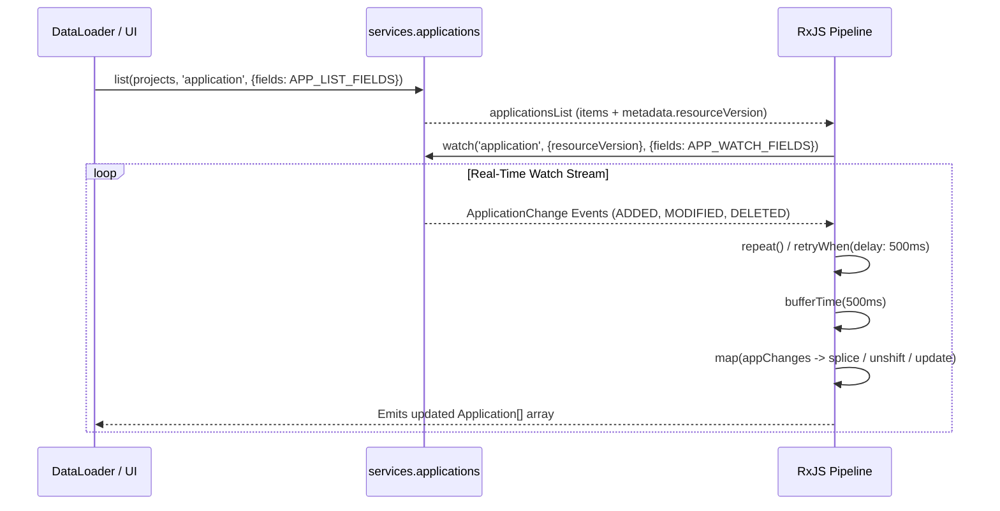

# Applications Views

<details>
<summary>Relevant source files</summary>

The following files were used as context for generating this wiki page:

- [ui/src/app/applications/components/application-details/application-details.tsx](https://github.com/argoproj/argo-cd/blob/main/ui/src/app/applications/components/application-details/application-details.tsx)
- [ui/src/app/applications/components/applications-list/applications-list.tsx](https://github.com/argoproj/argo-cd/blob/main/ui/src/app/applications/components/applications-list/applications-list.tsx)
- [ui/src/app/applications/components/application-status-panel/application-status-panel.tsx](https://github.com/argoproj/argo-cd/blob/main/ui/src/app/applications/components/application-status-panel/application-status-panel.tsx)
- [ui/src/app/applications/components/applications-list/application-tile.tsx](https://github.com/argoproj/argo-cd/blob/main/ui/src/app/applications/components/applications-list/application-tile.tsx)
- [ui/src/app/applications/components/applications-list/application-sets-list.tsx](https://github.com/argoproj/argo-cd/blob/main/ui/src/app/applications/components/applications-list/application-sets-list.tsx)
- [ui/src/app/applications/components/applications-list/applications-filter.tsx](https://github.com/argoproj/argo-cd/blob/main/ui/src/app/applications/components/applications-list/applications-filter.tsx)
- [ui/src/app/applications/components/application-summary/application-summary.tsx](https://github.com/argoproj/argo-cd/blob/main/ui/src/app/applications/components/application-summary/application-summary.tsx)
- [ui/src/app/applications/components/applications-list/applications-tiles.tsx](https://github.com/argoproj/argo-cd/blob/main/ui/src/app/applications/components/applications-list/applications-tiles.tsx)
- [ui/src/app/applications/components/application-operation-state/application-operation-state.tsx](https://github.com/argoproj/argo-cd/blob/main/ui/src/app/applications/components/application-operation-state/application-operation-state.tsx)
- [ui/src/app/applications/components/application-details/application-resource-list.tsx](https://github.com/argoproj/argo-cd/blob/main/ui/src/app/applications/components/application-details/application-resource-list.tsx)
</details>

## Overview

Applications Views provides the primary user interface orchestration for monitoring, inspecting, and managing Argo CD applications and application sets. It serves as the central control plane within the UI, coordinating real-time data synchronization, multi-faceted filtering, and state management across list, tile, summary, and detailed resource inspection views. By bridging cluster-level resource hierarchies with operator actions, it addresses the complexity of tracking large-scale deployments, troubleshooting synchronization or health discrepancies, and executing lifecycle operations across distributed Kubernetes environments.

Sources: [ui/src/app/applications/components/application-details/application-details.tsx:84-127](https://github.com/argoproj/argo-cd/blob/main/ui/src/app/applications/components/application-details/application-details.tsx#L84-L127) [ui/src/app/applications/components/applications-list/applications-list.tsx:62-101](https://github.com/argoproj/argo-cd/blob/main/ui/src/app/applications/components/applications-list/applications-list.tsx#L62-L101) [ui/src/app/applications/components/applications-list/application-sets-list.tsx:48-87](https://github.com/argoproj/argo-cd/blob/main/ui/src/app/applications/components/applications-list/application-sets-list.tsx#L48-L87)

## Applications List and Dashboard Orchestration

### Overview

The `ApplicationsList` and `ApplicationSetsList` components orchestrate overall application and application set list state, coordinate real-time WebSocket watching via RxJS observables, and handle view mode switching between list, tile, and summary layouts. They manage persistent view preferences, query parameter synchronization, and top-level toolbar actions.

Sources: [ui/src/app/applications/components/applications-list/applications-list.tsx:322-645](https://github.com/argoproj/argo-cd/blob/main/ui/src/app/applications/components/applications-list/applications-list.tsx#L322-L645) [ui/src/app/applications/components/applications-list/application-sets-list.tsx:369-515](https://github.com/argoproj/argo-cd/blob/main/ui/src/app/applications/components/applications-list/application-sets-list.tsx#L369-L515)

### Real-Time Data Watching and Event Buffering

Real-time updates are driven by RxJS observable streams that combine initial list fetches with live watch events. The `loadApplications` and `loadApplicationSets` functions fetch initial resources with specific field projections, then establish a persistent watch stream using resource versions.


Sources: [ui/src/app/applications/components/applications-list/applications-list.tsx:62-101](https://github.com/argoproj/argo-cd/blob/main/ui/src/app/applications/components/applications-list/applications-list.tsx#L62-L101)

The real-time watch processing pipeline executes a precise sequence of operations when change events arrive from the API server:

1. `services.applications.list()` → Fetches the initial array of applications and extracts `metadata.resourceVersion`.
   Sources: [ui/src/app/applications/components/applications-list/applications-list.tsx:62-63](https://github.com/argoproj/argo-cd/blob/main/ui/src/app/applications/components/applications-list/applications-list.tsx#L62-L63)
2. `services.applications.watch()` → Subscribes to incremental changes starting from the retrieved `resourceVersion`.
   Sources: [ui/src/app/applications/components/applications-list/applications-list.tsx:68-70](https://github.com/argoproj/argo-cd/blob/main/ui/src/app/applications/components/applications-list/applications-list.tsx#L68-L70)
3. `retryWhen()` → Intercepts stream errors and delays reconnection by `WATCH_RETRY_TIMEOUT` (500 ms).
   Sources: [ui/src/app/applications/components/applications-list/applications-list.tsx:32-32](https://github.com/argoproj/argo-cd/blob/main/ui/src/app/applications/components/applications-list/applications-list.tsx#L32-L32) [ui/src/app/applications/components/applications-list/applications-list.tsx:71-71](https://github.com/argoproj/argo-cd/blob/main/ui/src/app/applications/components/applications-list/applications-list.tsx#L71-L71)
4. `bufferTime()` → Batches incoming WebSocket events over `EVENTS_BUFFER_TIMEOUT` (500 ms) to prevent excessive re-rendering and maintain high UI performance.
   Sources: [ui/src/app/applications/components/applications-list/applications-list.tsx:31-31](https://github.com/argoproj/argo-cd/blob/main/ui/src/app/applications/components/applications-list/applications-list.tsx#L31-L31) [ui/src/app/applications/components/applications-list/applications-list.tsx:73-73](https://github.com/argoproj/argo-cd/blob/main/ui/src/app/applications/components/applications-list/applications-list.tsx#L73-L73)
5. `map()` → Iterates over buffered changes, matches existing items via `AppUtils.appInstanceName()`, and applies state mutations (`DELETED` removes via `splice`, while other types update existing indices or prepend via `unshift`).
   Sources: [ui/src/app/applications/components/applications-list/applications-list.tsx:75-94](https://github.com/argoproj/argo-cd/blob/main/ui/src/app/applications/components/applications-list/applications-list.tsx#L75-L94)

> [!NOTE]
> Event buffering uses a 500 ms window (`EVENTS_BUFFER_TIMEOUT`) to coalesce rapid cluster mutations. When an application is refreshed manually via `refreshApp`, the UI proactively injects a refreshing annotation into the local model before network responses return, bypassing event batch latency for immediate user feedback.
> Sources: [ui/src/app/applications/components/applications-list/applications-list.tsx:31-31](https://github.com/argoproj/argo-cd/blob/main/ui/src/app/applications/components/applications-list/applications-list.tsx#L31-L31) [ui/src/app/applications/components/applications-list/applications-list.tsx:334-346](https://github.com/argoproj/argo-cd/blob/main/ui/src/app/applications/components/applications-list/applications-list.tsx#L334-L346)

### Application Field Projections and Constants

To optimize payload size over the network, list and watch requests project a strictly bounded set of JSON path fields rather than transmitting complete resource definitions.

| Constant Name | Value / Field List | Purpose |
| :--- | :--- | :--- |
| `EVENTS_BUFFER_TIMEOUT` | `500` (ms) | Time window for batching watch events in RxJS pipelines. |
| `WATCH_RETRY_TIMEOUT` | `500` (ms) | Delay before retrying failed WebSocket watch streams. |
| `APP_FIELDS` | `metadata.name`, `metadata.namespace`, `metadata.annotations`, `metadata.labels`, `metadata.creationTimestamp`, `metadata.deletionTimestamp`, `spec.destination`, `spec.project`, `spec.source`, `spec.sources`, `spec.sourceHydrator`, `spec.syncPolicy`, `operation.sync`, `status.sourceHydrator`, `status.summary`, `status.sync.status`, `status.sync.revision`, `status.health`, `status.operationState.phase`, `status.operationState.startedAt`, `status.operationState.finishedAt` | Core application fields requested in list and watch forwarders. |
| `APPSET_FIELDS` | `metadata.name`, `metadata.namespace`, `metadata.annotations`, `metadata.labels`, `metadata.creationTimestamp`, `metadata.deletionTimestamp`, `spec`, `status.conditions`, `status.resources`, `status.resourcesCount`, `status.health` | Core application set fields requested for list and watch forwarders. |

Sources: [ui/src/app/applications/components/applications-list/applications-list.tsx:31-60](https://github.com/argoproj/argo-cd/blob/main/ui/src/app/applications/components/applications-list/applications-list.tsx#L31-L60) [ui/src/app/applications/components/applications-list/application-sets-list.tsx:29-46](https://github.com/argoproj/argo-cd/blob/main/ui/src/app/applications/components/applications-list/application-sets-list.tsx#L29-L46)

### View State and URL Parameter Synchronization

The `ViewPref` wrapper component combines backend user preferences (`services.viewPreferences.getPreferences()`) with active URL query parameters (`useObservableQuery()`). It maps URL search parameters into structured filter criteria and pagination state.

Supported query parameters parsed by `ViewPref` include `proj`, `sync`, `autoSync`, `operation`, `health`, `namespace`, `targetRevision`, `cluster`, `showFavorites`, `view`, `labels`, `annotations`, `repo`, `page`, and `search`. When filter values change via `onAppFilterPrefChanged`, preferences are persisted to the backend while simultaneously updating the browser URL history with replacement mode (`replace: true`).

Sources: [ui/src/app/applications/components/applications-list/applications-list.tsx:103-200](https://github.com/argoproj/argo-cd/blob/main/ui/src/app/applications/components/applications-list/applications-list.tsx#L103-L200) [ui/src/app/applications/components/applications-list/applications-list.tsx:348-369](https://github.com/argoproj/argo-cd/blob/main/ui/src/app/applications/components/applications-list/applications-list.tsx#L348-L369) [ui/src/app/applications/components/applications-list/application-sets-list.tsx:89-129](https://github.com/argoproj/argo-cd/blob/main/ui/src/app/applications/components/applications-list/application-sets-list.tsx#L89-L129)

## Tile Views and Visual Rendering

### Overview

The tile view rendering pipeline constructs responsive grid layouts for application cards and application set tiles, managing keyboard navigation, item wrapping, and inline action controls. The `ApplicationTiles` component wraps a collection of abstract application items, dispatching rendering between `ApplicationTile` and `AppSetTile` based on type guards.
Sources: [ui/src/app/applications/components/applications-list/applications-tiles.tsx:14-136](https://github.com/argoproj/argo-cd/blob/main/ui/src/app/applications/components/applications-list/applications-tiles.tsx#L14-L136)

### Responsiveness and Item Calculation

Container responsiveness is driven by the `useItemsPerContainer` hook, which calculates how many columns fit per row by measuring DOM node widths.
Sources: [ui/src/app/applications/components/applications-list/applications-tiles.tsx:21-46](https://github.com/argoproj/argo-cd/blob/main/ui/src/app/applications/components/applications-list/applications-tiles.tsx#L21-L46)

```typescript
const useItemsPerContainer = (itemRef: any, containerRef: any): number => {
    const [itemsPer, setItemsPer] = React.useState(0);

    React.useEffect(() => {
        const handleResize = () => {
            let timeoutId: any;
            clearTimeout(timeoutId);
            timeoutId = setTimeout(() => {
                timeoutId = null;
                const itemWidth = itemRef.current ? itemRef.current.offsetWidth : -1;
                const containerWidth = containerRef.current ? containerRef.current.offsetWidth : -1;
                const curItemsPer = containerWidth > 0 && itemWidth > 0 ? Math.floor(containerWidth / itemWidth) : 1;
                if (curItemsPer !== itemsPer) {
                    setItemsPer(curItemsPer);
                }
            }, 1000);
        };
        window.addEventListener('resize', handleResize);
        handleResize();
        return () => {
            window.removeEventListener('resize', handleResize);
        };
    }, []);

    return itemsPer || 1;
};
```
Sources: [ui/src/app/applications/components/applications-list/applications-tiles.tsx:21-46](https://github.com/argoproj/argo-cd/blob/main/ui/src/app/applications/components/applications-list/applications-tiles.tsx#L21-L46)

> [!NOTE]
> Window resize events are debounced using a 1000-millisecond timeout before recalculating container and item offsets. If either measurement is invalid or zero, the hook falls back to a single column (`1`).
> Sources: [ui/src/app/applications/components/applications-list/applications-tiles.tsx:21-46](https://github.com/argoproj/argo-cd/blob/main/ui/src/app/applications/components/applications-list/applications-tiles.tsx#L21-L46)

### Keyboard Navigation and Keybindings

The tile grid integrates keyboard navigation hooks (`useNav`) combined with `KeybindingContext` registrations. Arrow keys move selection across rows and columns using the dynamically computed `appsPerRow` layout metric.
Sources: [ui/src/app/applications/components/applications-list/applications-tiles.tsx:48-99](https://github.com/argoproj/argo-cd/blob/main/ui/src/app/applications/components/applications-list/applications-tiles.tsx#L48-L99)

| Keybinding Scope / Key | Action Triggered | Behavior |
| :--- | :--- | :--- |
| `Key.RIGHT` | `navApp(1)` | Selects the next adjacent tile in the row. |
| `Key.LEFT` | `navApp(-1)` | Selects the previous adjacent tile. |
| `Key.DOWN` | `navApp(appsPerRow)` | Moves selection down one row by offsetting index by columns per row. |
| `Key.UP` | `navApp(-1 * appsPerRow)` | Moves selection up one row. |
| `Key.ENTER` | Navigation goto | Opens the selected application details view if an item is active (`selectedApp > -1`). |
| `Key.ESCAPE` | `reset()` | Clears active tile selection. |
| `NumKey` / `NumPadKey` | Numeric index navigation | Resets and jumps directly to the application index specified by numeric keys. |

Sources: [ui/src/app/applications/components/applications-list/applications-tiles.tsx:48-98](https://github.com/argoproj/argo-cd/blob/main/ui/src/app/applications/components/applications-list/applications-tiles.tsx#L48-L98)

### Application Tile Rendering and Layout

The `ApplicationTile` component structures metadata rows, health indicators, source repositories, destination clusters, and action controls. Interactive buttons (such as external links, favorite stars, sync, refresh, and delete) are positioned outside main wrapper anchors to maintain valid HTML markup without nested interactive elements.
Sources: [ui/src/app/applications/components/applications-list/application-tile.tsx:26-296](https://github.com/argoproj/argo-cd/blob/main/ui/src/app/applications/components/applications-list/application-tile.tsx#L26-L296)

```typescript
export interface ApplicationTileProps {
    app: models.Application;
    selected: boolean;
    pref: ViewPreferences;
    ctx: ContextApis;
    tileRef?: React.RefObject<HTMLDivElement>;
    syncApplication: (appName: string, appNamespace: string) => void;
    refreshApplication: (appName: string, appNamespace: string) => void;
    deleteApplication: (appName: string, appNamespace: string) => void;
}
```
Sources: [ui/src/app/applications/components/applications-list/application-tile.tsx:15-24](https://github.com/argoproj/argo-cd/blob/main/ui/src/app/applications/components/applications-list/application-tile.tsx#L15-L24)

> [!WARNING]
> Spreading `refreshLinkAttrs` directly onto a button element is avoided. Doing so would block clicks during in-flight refreshes using a `disabled` attribute, trapping users with no way to retrigger a stuck refresh. Instead, button states use icon-spin class bindings via `AppUtils.isAppRefreshing(app)`.
> Sources: [ui/src/app/applications/components/applications-list/application-tile.tsx:271-282](https://github.com/argoproj/argo-cd/blob/main/ui/src/app/applications/components/applications-list/application-tile.tsx#L271-L282)

## Application Filtering and Search Logic

### Overview

The application filtering and search logic evaluates multi-faceted criteria across standard applications and application sets. Preferences are mapped to individual filter attributes such as sync status, health, destination clusters, namespaces, repositories, target revisions, operations, annotations, favorite stars, and metadata labels.
Sources: [ui/src/app/applications/components/applications-list/applications-filter.tsx:24-125](https://github.com/argoproj/argo-cd/blob/main/ui/src/app/applications/components/applications-list/applications-filter.tsx#L24-L125)

### Filter Evaluation Data Structures

The filter result structures define boolean criteria evaluated for each item during state updates.

| Interface Name | Field Property | Target Type / Description |
| :--- | :--- | :--- |
| `FilterResult` | `sync`, `autosync`, `health`, `clusters`, `namespaces`, `repos`, `targetRevision`, `operation`, `annotations`, `favourite`, `labels` | `boolean` — Evaluated match flags for standard applications. |
| `ApplicationSetFilterResult` | `health`, `favourite`, `labels` | `boolean` — Evaluated match flags for application sets. |
| `FilteredApp` | `isAppOfAppsPattern`, `filterResult` | Extends `Application` with computed `FilterResult`. |
| `ApplicationSetFilteredApp` | `filterResult` | Extends `ApplicationSet` with computed `ApplicationSetFilterResult`. |

Sources: [ui/src/app/applications/components/applications-list/applications-filter.tsx:24-51](https://github.com/argoproj/argo-cd/blob/main/ui/src/app/applications/components/applications-list/applications-filter.tsx#L24-L51)

### Filter Computation and Evaluation Logic

Application filtering executes via `getAppFilterResults` and `getAppSetFilterResults`, which iterate over lists of applications or application sets to compute individual boolean flags against user preferences (`AppsListPreferences` or `AppSetsListPreferences`).
Sources: [ui/src/app/applications/components/applications-list/applications-filter.tsx:71-125](https://github.com/argoproj/argo-cd/blob/main/ui/src/app/applications/components/applications-filter.tsx#L71-L125)

> [!NOTE]
> Operation state titles for deleting and terminated states are explicitly normalized to `Syncing` under `getOperationStateTitleForFilter(app)` so that UI counts align with badges.
> Sources: [ui/src/app/applications/components/applications-list/applications-filter.tsx:60-69](https://github.com/argoproj/argo-cd/blob/main/ui/src/app/applications/components/applications-filter.tsx#L60-L69)

```typescript
export function getAutoSyncStatus(syncPolicy?: SyncPolicy) {
    if (!syncPolicy || !syncPolicy.automated || syncPolicy.automated.enabled === false) {
        return 'Disabled';
    }
    return 'Enabled';
}
```
Sources: [ui/src/app/applications/components/applications-list/applications-filter.tsx:53-58](https://github.com/argoproj/argo-cd/blob/main/ui/src/app/applications/components/applications-filter.tsx#L53-L58)

### Filter Options and Counts

Dynamic badge counts for filter options are calculated using `getCounts` and `getAppSetCounts`. These helper functions filter out applications that do not match other active criteria, ensuring that filter counts reflect realistic cross-filtering state.
Sources: [ui/src/app/applications/components/applications-list/applications-filter.tsx:153-175](https://github.com/argoproj/argo-cd/blob/main/ui/src/app/applications/components/applications-filter.tsx#L153-L175)

> [!WARNING]
> When evaluating cluster filter queries, strings matching `^(.*) [(](http.*)[)]$` parse both the name and URL parameters. If no explicit parenthesis format matches, the system checks whether the input matches an http URL server or evaluates via `minimatch` against the destination name.
> Sources: [ui/src/app/applications/components/applications-list/applications-filter.tsx:88-101](https://github.com/argoproj/argo-cd/blob/main/ui/src/app/applications/components/applications-filter.tsx#L88-L101)

## Application Details and Resource Navigation

### Overview

The application details view orchestrates the layout, resource rendering, tree structures, and view extensions for both individual applications and ApplicationSets. It manages route parameters (`appnamespace`, `name`), asynchronous data loaders, and observables to watch resource changes and stream application trees.
Sources: [ui/src/app/applications/components/application-details/application-details.tsx:84-125](https://github.com/argoproj/argo-cd/blob/main/ui/src/app/applications/components/application-details/application-details.tsx#L84-L125) [ui/src/app/applications/components/application-details/application-details.tsx:1475-1528](https://github.com/argoproj/argo-cd/blob/main/ui/src/app/applications/components/application-details/application-details.tsx#L1475-L1528)

### Resource Tree and Node Selection

The component handles node identification, expansion state, and graph filtering through helpers like `NodeInfo()`, `SelectNode()`, and `filterTreeNode()`. The tree rendering switches between tree, network, pods, list, and custom view extensions based on user preferences and URL parameters.
Sources: [ui/src/app/applications/components/application-details/application-details.tsx:69-82](https://github.com/argoproj/argo-cd/blob/main/ui/src/app/applications/components/application-details/application-details.tsx#L69-L82) [ui/src/app/applications/components/application-details/application-details.tsx:1444-1468](https://github.com/argoproj/argo-cd/blob/main/ui/src/app/applications/components/application-details/application-details.tsx#L1444-L1468)

> [!NOTE]
> During tree filtering, wildcard patterns in resource names are parsed into case-insensitive regular expressions using `nodeNameMatchesWildcardFilters()`, ensuring that only `*` acts as a wildcard operator via proper escaping.
> Sources: [ui/src/app/applications/components/application-details/application-details.tsx:159-180](https://github.com/argoproj/argo-cd/blob/main/ui/src/app/applications/components/application-details/application-details.tsx#L159-L180)

### Application Details State and View Modes

| State Property | Type | Purpose |
| :--- | :--- | :--- |
| `page` | `number` | Current pagination index for list view. |
| `revision` | `string` | Selector for revision details panel type (`SYNC_STATUS_REVISION` or `OPERATION_STATE_REVISION`). |
| `groupedResourceIds` | `string[]` | Identifiers of resources grouped within the compact nodes sliding panel. |
| `slidingPanelPage` | `number` | Pagination index for the grouped resources sliding panel. |
| `filteredGraph` | `any[]` | Filtered graph nodes passed to sidebar filters. |
| `truncateNameOnRight` | `boolean` | Flag for node name truncation direction (right vs left). |
| `showFullNodeName` | `boolean` | Flag to show wrapped resource names instead of compressed single-line names. |
| `collapsedNodes` | `string[]` | List of UIDs representing collapsed parent nodes in the tree/network graph. |

Sources: [ui/src/app/applications/components/application-details/application-details.tsx:39-54](https://github.com/argoproj/argo-cd/blob/main/ui/src/app/applications/components/application-details/application-details.tsx#L39-L54)

### Application Resource List and Parent References

The resource list sub-component (`ApplicationResourceList`) supports multi-column sorting across resource names, group-kinds, sync waves, namespaces, creation timestamps, and combined health/sync priorities. When viewing grouped nodes, `ApplicationResourceParentRef` resolves common parent nodes from the tree and renders an `EditablePanel` detailing the parent's kind, name, and namespace.
Sources: [ui/src/app/applications/components/application-details/application-resource-list.tsx:36-72](https://github.com/argoproj/argo-cd/blob/main/ui/src/app/applications/components/application-details/application-resource-list.tsx#L36-L72) [ui/src/app/applications/components/application-details/application-resource-list.tsx:74-156](https://github.com/argoproj/argo-cd/blob/main/ui/src/app/applications/components/application-details/application-resource-list.tsx#L74-L156)

> [!WARNING]
> Sorting by status computes a composite score by evaluating `HealthPriority` first, falling back to `SyncPriority` when health statuses are identical between two resources.
> Sources: [ui/src/app/applications/components/application-details/application-resource-list.tsx:142-154](https://github.com/argoproj/argo-cd/blob/main/ui/src/app/applications/components/application-details/application-resource-list.tsx#L142-L154)

```typescript
export const ApplicationResourceParentRef = (props: ApplicationResourceParentRefProps) => {
    const nodeByKey = new Map<string, models.ResourceNode>();
    props.tree?.nodes?.forEach(res => nodeByKey.set(nodeKey(res), res));

    const firstParentNode = props.resources.length > 0 && (nodeByKey.get(nodeKey(props.resources[0])) as ResourceNode)?.parentRefs?.[0];
    const isSameParent = firstParentNode && props.resources?.every(x => (nodeByKey.get(nodeKey(x)) as ResourceNode)?.parentRefs?.every(p => isSameNode(p, firstParentNode)));

    if (!isSameParent) {
        return null;
    }

    return (
        <EditablePanel
            title='PARENT NODE'
            values={firstParentNode}
            items={[
                { title: 'KIND', view: firstParentNode.kind },
                { title: 'NAME', view: firstParentNode.name },
                { title: 'NAMESPACE', view: firstParentNode.namespace }
            ]}
        />
    );
};
```
Sources: [ui/src/app/applications/components/application-details/application-resource-list.tsx:41-71](https://github.com/argoproj/argo-cd/blob/main/ui/src/app/applications/components/application-details/application-resource-list.tsx#L41-L71)

## Application Status and Summary Views

### Overview

The application status and summary subsystem manages visual panels and metadata configuration controls for individual Argo CD applications. It combines the `ApplicationStatusPanel` component, which renders real-time indicators for app health, sync state, progressive sync steps, source hydration, conditions, and sync windows, with the `ApplicationSummary` component, which provides editable panels for core properties, repository sources, dry/sync sources, auto-sync policies, and custom information items.
Sources: [ui/src/app/applications/components/application-status-panel/application-status-panel.tsx:199-214](https://github.com/argoproj/argo-cd/blob/main/ui/src/app/applications/components/application-status-panel/application-status-panel.tsx#L199-L214) [ui/src/app/applications/components/application-summary/application-summary.tsx:68-78](https://github.com/argoproj/argo-cd/blob/main/ui/src/app/applications/components/application-summary/application-summary.tsx#L68-L78)

### Application Status Panel

The `ApplicationStatusPanel` component evaluates application state parameters and displays status items in a horizontal responsive layout. It calculates days elapsed since the last synchronization using the final entry in `application.status.history`, counts condition categories using `getConditionCategory()`, and determines the active revision and repository type (`oci`, `helm`, or `git`).
Sources: [ui/src/app/applications/components/application-status-panel/application-status-panel.tsx:199-228](https://github.com/argoproj/argo-cd/blob/main/ui/src/app/applications/components/application-status-panel/application-status-panel.tsx#L199-L228)

```typescript
export const ApplicationStatusPanel = ({application, showDiff, showOperation, showHydrateOperation, showConditions, showExtension, showMetadataInfo}: Props) => {
    const showProgressiveSync = !!getApplicationSetOwnerRef(application);
    const today = new Date();
    let daysSinceLastSynchronized = 0;
    const history = application.status.history || [];
    if (history.length > 0) {
        const deployDate = new Date(history[history.length - 1].deployedAt);
        daysSinceLastSynchronized = Math.round(Math.abs((today.getTime() - deployDate.getTime()) / (24 * 60 * 60 * 1000)));
    }
    const cntByCategory = (application.status.conditions || []).reduce(
        (map, next) => map.set(getConditionCategory(next), (map.get(getConditionCategory(next)) || 0) + 1),
        new Map<string, number>()
    );
    const appOperationState = getAppOperationState(application);
    // ...renders status items for APP HEALTH, SOURCE HYDRATOR, SYNC STATUS, LAST SYNC, APP CONDITIONS, and SYNC WINDOWS
};
```
Sources: [ui/src/app/applications/components/application-status-panel/application-status-panel.tsx:199-228](https://github.com/argoproj/argo-cd/blob/main/ui/src/app/applications/components/application-status-panel/application-status-panel.tsx#L199-L228)

### Progressive Sync Status Integration

When an application is managed by an `ApplicationSet` featuring the `RollingSync` strategy, the `ProgressiveSyncStatus` component asynchronously loads application set resources via `services.applications.listApplicationSets()` inside a `DataLoader` wrapper, parsing matching entries from `appSet.status.applicationStatus`.
Sources: [ui/src/app/applications/components/application-status-panel/application-status-panel.tsx:116-151](https://github.com/argoproj/argo-cd/blob/main/ui/src/app/applications/components/application-status-panel/application-status-panel.tsx#L116-L151)

> [!NOTE]
> The progressive sync status panel remains hidden unless the parent application set exists, contains application status records, and explicitly configures strategy type as `RollingSync`.
> Sources: [ui/src/app/applications/components/application-status-panel/application-status-panel.tsx:148-151](https://github.com/argoproj/argo-cd/blob/main/ui/src/app/applications/components/application-status-panel/application-status-panel.tsx#L148-L151)

### Application Summary Editable Attributes

The `ApplicationSummary` component wraps core configuration attributes in editable panels, supporting attributes such as project destination server/namespace, revision history limits, sync options, retry configurations, custom info key-value pairs, and source hydrator definitions.
Sources: [ui/src/app/applications/components/application-summary/application-summary.tsx:94-276](https://github.com/argoproj/argo-cd/blob/main/ui/src/app/applications/components/application-summary/application-summary.tsx#L94-L276)

| Attribute Title | Component Type / View Renderer | Edit Handler / Form Field |
| :--- | :--- | :--- |
| `PROJECT` | React Router `Link` to `/settings/projects/{project}` | `FormSelect` loaded via `services.projects.list()` |
| `LABELS` | Plain text joined `key=value` string | `MapInputField` |
| `ANNOTATIONS` | `Expandable` wrapper with 48px height limit | `EditAnnotations` component |
| `CLUSTER` | `Cluster` component showing server and name URLs | `AutocompleteField` with URL/NAME format dropdown menu |
| `NAMESPACE` | `ClipboardText` container | Text `FormField` |
| `REVISION HISTORY LIMIT` | Numeric count (default 10) | `NumberField` with help tooltip |
| `SYNC OPTIONS` | Flex container parsing `=true`/`=false` flags | `ApplicationSyncOptionsField` |
| `RETRY OPTIONS` | `ApplicationRetryView` | `ApplicationRetryOptions` |
| `STATUS` | `ComparisonStatusIcon` with sync status text | Read-only view attribute |
| `HEALTH` | `HealthStatusIcon` with health status text | Read-only view attribute |

Sources: [ui/src/app/applications/components/application-summary/application-summary.tsx:94-276](https://github.com/argoproj/argo-cd/blob/main/ui/src/app/applications/components/application-summary/application-summary.tsx#L94-L276)

### Source Hydrator and Multi-Source Configuration

When source hydration is enabled via auth settings (`useAuthSettingsCtx?.hydratorEnabled`), the summary panel splits source parameters into dedicated sections: `Dry Source`, `Sync Source`, and `Hydrate To`. Enabling the hydrator shifts standard source values into `spec.sourceHydrator.drySource`, maintaining sync output targets in `spec.sourceHydrator.syncSource`.
Sources: [ui/src/app/applications/components/application-summary/application-summary.tsx:317-360](https://github.com/argoproj/argo-cd/blob/main/ui/src/app/applications/components/application-summary/application-summary.tsx#L317-L360) [ui/src/app/applications/components/application-summary/application-summary.tsx:545-561](https://github.com/argoproj/argo-cd/blob/main/ui/src/app/applications/components/application-summary/application-summary.tsx#L545-L561)

```typescript
const standardSourceItems: EditablePanelItem[] = useAuthSettingsCtx?.hydratorEnabled
    ? [
          {
              title: 'ENABLE HYDRATOR',
              hint: 'Enable Source Hydrator to render and push manifests to a Git branch.',
              view: false,
              edit: (formApi: FormApi) => (
                  <div className='checkbox-container'>
                      <Checkbox
                          onChange={(val: boolean) => {
                              const updatedApp = formApi.getFormState().values as models.Application;
                              if (val) {
                                  if (!updatedApp.spec.sourceHydrator) {
                                      updatedApp.spec.sourceHydrator = {
                                          drySource: {
                                              repoURL: updatedApp.spec.source.repoURL,
                                              targetRevision: updatedApp.spec.source.targetRevision,
                                              path: updatedApp.spec.source.path
                                          },
                                          syncSource: savedSyncSource
                                      };
                                      delete updatedApp.spec.source;
                                  }
                              } else {
                                  if (updatedApp.spec.sourceHydrator) {
                                      setSavedSyncSource(updatedApp.spec.sourceHydrator.syncSource);
                                      updatedApp.spec.source = updatedApp.spec.sourceHydrator.drySource;
                                      delete updatedApp.spec.sourceHydrator;
                                  }
                              }
                              formApi.setAllValues(updatedApp);
                              setIsHydratorEnabled(val);
                          }}
                          checked={!!(formApi.getFormState().values as models.Application).spec.sourceHydrator}
                          id='enable-hydrator'
                      />
                      <label htmlFor='
```

## Related

- [[UI Architecture]]
- [[Resource Tree and Terminal]]

