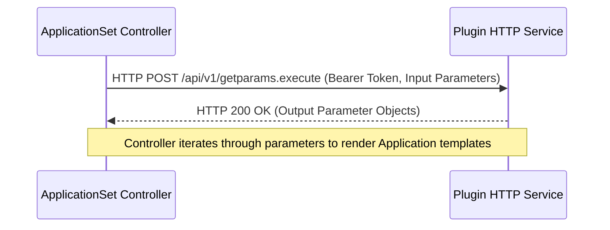

# ApplicationSet Controller

Relevant source files

The following files were used as context for generating this wiki page:

- [cmd/argocd-applicationset-controller/commands/applicationset_controller.go](https://github.com/argoproj/argo-cd/blob/main/cmd/argocd-applicationset-controller/commands/applicationset_controller.go)
- [applicationset/controllers/applicationset_controller.go](https://github.com/argoproj/argo-cd/blob/main/applicationset/controllers/applicationset_controller.go)
- [docs/operator-manual/applicationset/index.md](https://github.com/argoproj/argo-cd/blob/main/docs/operator-manual/applicationset/index.md)
- [pkg/apis/application/v1alpha1/applicationset_types.go](https://github.com/argoproj/argo-cd/blob/main/pkg/apis/application/v1alpha1/applicationset_types.go)
- [docs/operator-manual/applicationset.yaml](https://github.com/argoproj/argo-cd/blob/main/docs/operator-manual/applicationset.yaml)
- [docs/proposals/backend-support-appset.md](https://github.com/argoproj/argo-cd/blob/main/docs/proposals/backend-support-appset.md)
- [docs/user-guide/application-set.md](https://github.com/argoproj/argo-cd/blob/main/docs/user-guide/application-set.md)
- [docs/operator-manual/applicationset/Argo-CD-Integration.md](https://github.com/argoproj/argo-cd/blob/main/docs/operator-manual/applicationset/Argo-CD-Integration.md)
- [docs/operator-manual/applicationset/Generators-Plugin.md](https://github.com/argoproj/argo-cd/blob/main/docs/operator-manual/applicationset/Generators-Plugin.md)
- [server/applicationset/applicationset.go](https://github.com/argoproj/argo-cd/blob/main/server/applicationset/applicationset.go)

## Overview

The ApplicationSet controller is a Kubernetes controller that introduces the `ApplicationSet` custom resource definition to automate and scale the management of Argo CD Applications across multiple clusters, repositories, and monorepos. Operating alongside core Argo CD installations, the controller functions as an application factory that evaluates declarative generator configurations, substitutes parameters into templates, and dynamically provisions or reconciles individual Argo CD `Application` resources.
Sources: [docs/operator-manual/applicationset/index.md:5-15](https://github.com/argoproj/argo-cd/blob/main/docs/operator-manual/applicationset/index.md#L5-L15), [docs/operator-manual/applicationset/Argo-CD-Integration.md:20-22](https://github.com/argoproj/argo-cd/blob/main/docs/operator-manual/applicationset/Argo-CD-Integration.md#L20-L22)

## Custom Resource Definition and Spec API

### Overview

The `ApplicationSet` custom resource definition (CRD) struct defines the schema for the Kubernetes API resource `ApplicationSet`. Struct definitions in Go map directly to the API specification consumed by the ApplicationSet controller and exposed via the `argoproj.io/v1alpha1` API group. Key top-level fields include `metadata`, `spec`, and `status`, matching the standard Kubernetes object layout while integrating specialized types for multi-cluster generation.
Sources: [pkg/apis/application/v1alpha1/applicationset_types.go:45-59](https://github.com/argoproj/argo-cd/blob/main/pkg/apis/application/v1alpha1/applicationset_types.go#L45-L59)

The `ApplicationSetSpec` structure encapsulates the core control properties, configuring whether Go templates are enabled, holding generator definitions, specifying top-level application templates, and determining rollout and sync behaviors.
Sources: [pkg/apis/application/v1alpha1/applicationset_types.go:66-82](https://github.com/argoproj/argo-cd/blob/main/pkg/apis/application/v1alpha1/applicationset_types.go#L66-L82)

### Generators and Combination Spec API

Generators produce parameter sets that are substituted into Argo CD application templates. The top-level `ApplicationSetGenerator` struct offers eight distinct generator variants alongside a `Selector` field for post-filtering results.
Sources: [pkg/apis/application/v1alpha1/applicationset_types.go:196-211](https://github.com/argoproj/argo-cd/blob/main/pkg/apis/application/v1alpha1/applicationset_types.go#L196-L211)

| Generator Field | Go Type | Description |
|-----------------|---------|-------------|
| `list` | `*ListGenerator` | Generates parameters from an explicit static list of inline elements or YAML strings. |
| `clusters` | `*ClusterGenerator` | Matches Kubernetes clusters registered with Argo CD based on label selectors. |
| `git` | `*GitGenerator` | Scans directory structures or discovers parameter files (`json`/`yaml`) within a Git repository. |
| `scmProvider` | `*SCMProviderGenerator` | Queries an SCM-as-a-Service API to automatically discover repositories matching filters. |
| `clusterDecisionResource` | `*DuckTypeGenerator` | Retrieves cluster decisions via a duck-type Custom Resource reference and ConfigMap. |
| `pullRequest` | `*PullRequestGenerator` | Scans open pull requests or merge requests across SCM providers. |
| `matrix` | `*MatrixGenerator` | Generates the cartesian product of parameter sets from two nested generators. |
| `merge` | `*MergeGenerator` | Merges parameter sets from multiple generators using specified merge keys. |
| `plugin` | `*PluginGenerator` | Integrates external custom generators via ConfigMap-referenced plugins. |

Sources: [pkg/apis/application/v1alpha1/applicationset_types.go:197-210](https://github.com/argoproj/argo-cd/blob/main/pkg/apis/application/v1alpha1/applicationset_types.go#L197-L210), [docs/operator-manual/applicationset.yaml:7-238](https://github.com/argoproj/argo-cd/blob/main/docs/operator-manual/applicationset.yaml#L7-L238)

> [!NOTE]
> `ApplicationSetNestedGenerator` and `ApplicationSetTerminalGenerator` restrict recursion depth for combination generators (`matrix` and `merge`) because Kubernetes Custom Resource Definitions do not natively support recursive types.
> Sources: [pkg/apis/application/v1alpha1/applicationset_types.go:215-254](https://github.com/argoproj/argo-cd/blob/main/pkg/apis/application/v1alpha1/applicationset_types.go#L215-L254)

### Sync Policies and Status Calculations

The `ApplicationSetSyncPolicy` struct configures how generated applications relate to the parent ApplicationSet via the `ApplicationsSync` policy. The available policies dictate update and deletion permissions for generated applications.
Sources: [pkg/apis/application/v1alpha1/applicationset_types.go:136-145](https://github.com/argoproj/argo-cd/blob/main/pkg/apis/application/v1alpha1/applicationset_types.go#L136-L145)

| Sync Policy Name | AllowUpdate() | AllowDelete() | Description |
|------------------|---------------|---------------|-------------|
| `create-only` | `false` | `false` | Applications are only created. Updates and deletions resulting from generator changes are ignored. |
| `create-update` | `true` | `false` | Applications are created and updated when parameters change, but are never deleted if removed from generator output. |
| `create-delete` | `false` | `true` | Applications are created and deleted, but existing applications are not updated when generator parameters change. |
| `sync` | `true` | `true` | Full lifecycle management: applications are created, updated, and deleted in response to generator results. |

Sources: [pkg/apis/application/v1alpha1/applicationset_types.go:121-134](https://github.com/argoproj/argo-cd/blob/main/pkg/apis/application/v1alpha1/applicationset_types.go#L121-L134)

> [!WARNING]
> If no `ApplicationsSyncPolicy` is explicitly defined on the ApplicationSet resource, it defaults to `sync`, which allows both updates and deletions of generated Argo CD applications.
> Sources: [pkg/apis/application/v1alpha1/applicationset_types.go:117-117](https://github.com/argoproj/argo-cd/blob/main/pkg/apis/application/v1alpha1/applicationset_types.go#L117-L117)

The overall health of an ApplicationSet is derived from its status conditions using priority evaluation inside `CalculateHealth()`. The function evaluates condition flags in a specific sequence: `ErrorOccurred` equals `True` yields `Degraded`, `RolloutProgressing` equals `True` yields `Progressing`, and `ResourcesUpToDate` equals `True` yields `Healthy`.
Sources: [pkg/apis/application/v1alpha1/applicationset_types.go:959-964](https://github.com/argoproj/argo-cd/blob/main/pkg/apis/application/v1alpha1/applicationset_types.go#L959-L964), [pkg/apis/application/v1alpha1/applicationset_types.go:975-985](https://github.com/argoproj/argo-cd/blob/main/pkg/apis/application/v1alpha1/applicationset_types.go#L975-L985)

## Controller Entrypoint and Initialization

### Controller Initialization and Manager Setup

The ApplicationSet controller binary executes through `NewCommand()`, returning a configured `cobra.Command` that handles runtime bootstrapping, command-line flag definitions, and controller-runtime manager lifecycle management within its `RunE` handler.
Sources: [cmd/argocd-applicationset-controller/commands/applicationset_controller.go:54-96](https://github.com/argoproj/argo-cd/blob/main/cmd/argocd-applicationset-controller/commands/applicationset_controller.go#L54-L96)

> [!NOTE]
> A panic recovery middleware is installed via `defer` immediately after logger initialization, capturing stack traces and logging fatal errors through logrus rather than crashing silently.
> Sources: [cmd/argocd-applicationset-controller/commands/applicationset_controller.go:121-127](https://github.com/argoproj/argo-cd/blob/main/cmd/argocd-applicationset-controller/commands/applicationset_controller.go#L121-L127)

Initialization proceeds through a precise sequence of runtime dependencies: `clientConfig.ClientConfig()` builds the REST configuration, `runtime.NewScheme()` registers client-go and custom `appv1alpha1` schemes, and `ctrl.NewManager()` provisions the controller-runtime manager with metrics binding, health probes, and leader election settings.
Sources: [cmd/argocd-applicationset-controller/commands/applicationset_controller.go:89-91](https://github.com/argoproj/argo-cd/blob/main/cmd/argocd-applicationset-controller/commands/applicationset_controller.go#L89-L91), [cmd/argocd-applicationset-controller/commands/applicationset_controller.go:128-132](https://github.com/argoproj/argo-cd/blob/main/cmd/argocd-applicationset-controller/commands/applicationset_controller.go#L128-L132), [cmd/argocd-applicationset-controller/commands/applicationset_controller.go:164-176](https://github.com/argoproj/argo-cd/blob/main/cmd/argocd-applicationset-controller/commands/applicationset_controller.go#L164-L176)

| CLI Flag | Default Value | Purpose |
|----------|---------------|---------|
| `--metrics-addr` | `:8080` | The address the metric endpoint binds to. |
| `--probe-addr` | `:8081` | The address the probe endpoint binds to. |
| `--webhook-addr` | `:7000` | The address the webhook endpoint binds to. |
| `--enable-leader-election` | `false` | Enable leader election for controller manager to ensure a single active replica. |
| `--applicationset-namespaces` | `[]` | Argo CD applicationset namespaces to watch. |
| `--argocd-repo-server` | `argocd-repo-server:8081` | Argo CD repo server address. |
| `--policy` | `""` | Modify how applications sync between generators and clusters. |
| `--enable-policy-override` | derived | Allows users to define custom policies at the ApplicationSet level when explicit global policy is set. |
| `--concurrent-reconciliations` | `10` | Max concurrent reconciliations limit for the controller. |
| `--cache-sync-period` | `10h` | Period at which manager client cache is forcefully resynced with the API server. |

Sources: [cmd/argocd-applicationset-controller/commands/applicationset_controller.go:293-329](https://github.com/argoproj/argo-cd/blob/main/cmd/argocd-applicationset-controller/commands/applicationset_controller.go#L293-L329)

> [!WARNING]
> When `policy` is explicitly configured via flags, per-ApplicationSet policy overrides are disabled by default unless `--enable-policy-override` is explicitly set to `true`.
> Sources: [cmd/argocd-applicationset-controller/commands/applicationset_controller.go:302-303](https://github.com/argoproj/argo-cd/blob/main/cmd/argocd-applicationset-controller/commands/applicationset_controller.go#L302-L303)

## Reconciliation Loop and Application Generation

### Reconciliation Loop Execution Walkthrough

The core control loop executes inside the `Reconcile` method of `ApplicationSetReconciler`, orchestrating parameter generation, template rendering, validation, and cluster synchronization. The call chain proceeds through explicit operational phases:
`Reconcile()` → `template.GenerateApplications()` → `r.validateGeneratedApplications()` → `r.createOrUpdateInCluster()` / `r.deleteInCluster()` → `r.updateResourcesStatus()`.

1. **Inception and Deletion Checks:** The loop fetches the `ApplicationSet` resource via `r.Get()`. If `DeletionTimestamp` is set, deletion policies are evaluated, finalizers are managed, and reverse deletion or garbage collection is performed before returning.
Sources: [applicationset/controllers/applicationset_controller.go:138-179](https://github.com/argoproj/argo-cd/blob/main/applicationset/controllers/applicationset_controller.go#L138-L179)

2. **Application Generation:** `template.GenerateApplications()` evaluates all configured generators, extracts parameter sets, and renders the application templates into a slice of desired `Application` objects.
Sources: [applicationset/controllers/applicationset_controller.go:198-215](https://github.com/argoproj/argo-cd/blob/main/applicationset/controllers/applicationset_controller.go#L198-L215)

3. **Validation:** `r.validateGeneratedApplications()` inspects every generated application to verify that it possesses a non-empty name (disallowing `generateName`), contains unique names across the set, references an existing `AppProject`, and specifies a valid destination cluster via `argoutil.GetDestinationCluster()`.
Sources: [applicationset/controllers/applicationset_controller.go:595-630](https://github.com/argoproj/argo-cd/blob/main/applicationset/controllers/applicationset_controller.go#L595-L630)

4. **Synchronization and Mutation:** Valid applications are sorted by name and dispatched to `r.createOrUpdateInCluster()` (or `r.createInCluster()` depending on sync policies), while obsolete applications are pruned via `r.deleteInCluster()`.
Sources: [applicationset/controllers/applicationset_controller.go:337-393](https://github.com/argoproj/argo-cd/blob/main/applicationset/controllers/applicationset_controller.go#L337-L393)

5. **Status Reporting:** `r.updateResourcesStatus()` gathers current cluster states, builds resource status mappings, and updates the `ApplicationSet` status subresource.
Sources: [applicationset/controllers/applicationset_controller.go:395-403](https://github.com/argoproj/argo-cd/blob/main/applicationset/controllers/applicationset_controller.go#L395-L403)

> [!CAUTION]
> `generateName` is strictly unsupported for generated applications; every application must have a concrete name specified in `metadata.name` or populated via `templatePatch`, because missing names prevent the controller from matching desired applications back to cluster resources during subsequent reconciliation loops.
> Sources: [applicationset/controllers/applicationset_controller.go:600-606](https://github.com/argoproj/argo-cd/blob/main/applicationset/controllers/applicationset_controller.go#L600-L606)

### Application Field Preservation and Concurrency

During cluster synchronization in `createOrUpdateInCluster()`, the controller constructs ignore-diff configurations using `utils.BuildIgnoreDiffConfig()` and processes application updates concurrently using `errgroup.WithContext()`. Concurrency is bounded by `r.concurrency()`, which defaults to `1` if `ConcurrentApplicationUpdates <= 0`.
Sources: [applicationset/controllers/applicationset_controller.go:702-710](https://github.com/argoproj/argo-cd/blob/main/applicationset/controllers/applicationset_controller.go#L702-L710), [applicationset/controllers/applicationset_controller.go:943-949](https://github.com/argoproj/argo-cd/blob/main/applicationset/controllers/applicationset_controller.go#L943-L949)

Preserved fields, annotations, labels, and finalizers are retained on existing applications to prevent configuration drift and avoid conflicts with the application controller. Specifically, `defaultPreservedFinalizers` and `defaultPreservedAnnotations` are enforced alongside user-configured and global preservation settings.

| Preserved Constant / Group | Values / Keys | Purpose |
|----------------------------|---------------|---------|
| `defaultPreservedFinalizers` | `resources-finalizer.argocd.argoproj.io`, `resources-finalizer.argocd.argoproj.io/dep` | Preserves pre-delete and post-delete finalizers to manage resource deletion order. |
| `defaultPreservedAnnotations` | `notified.notifications.argoproj.io`, `argocd.argoproj.io/refresh`, `argocd.argoproj.io/hydrate` | Retains notification state and explicit refresh or hydrate triggers across updates. |

Sources: [applicationset/controllers/applicationset_controller.go:79-88](https://github.com/argoproj/argo-cd/blob/main/applicationset/controllers/applicationset_controller.go#L79-L88), [applicationset/controllers/applicationset_controller.go:744-788](https://github.com/argoproj/argo-cd/blob/main/applicationset/controllers/applicationset_controller.go#L744-L788)

> [!NOTE]
> When multiple concurrent goroutines encounter errors during application creation or deletion, `firstAppError()` captures and returns the error associated with the lexicographically smallest application name, ensuring deterministic error reporting that mirrors sequential execution order.
> Sources: [applicationset/controllers/applicationset_controller.go:805-807](https://github.com/argoproj/argo-cd/blob/main/applicationset/controllers/applicationset_controller.go#L805-L807), [applicationset/controllers/applicationset_controller.go:955-965](https://github.com/argoproj/argo-cd/blob/main/applicationset/controllers/applicationset_controller.go#L955-L965)

## Progressive Sync and Rollout Strategies

### Progressive Sync and Rollout Strategies

### Overview

When `EnableProgressiveSyncs` is active, the ApplicationSet controller evaluates rolling sync strategies and controls rollout execution via `ProgressiveSyncManager`. If an ApplicationSet switches from a `RollingSync` strategy to a default strategy, the controller removes existing application status entries to prevent stale data.
Sources: [applicationset/controllers/applicationset_controller.go:252-260](https://github.com/argoproj/argo-cd/blob/main/applicationset/controllers/applicationset_controller.go#L252-L260)

If `RollingSync` is enabled, the controller verifies that rollout steps are not empty. If no steps are defined, it records an error condition with reason `ApplicationSetReasonApplicationSetRolloutError` and requeues with `ReconcileRequeueOnValidationError`. Otherwise, it delegates sync evaluation to `ProgressiveSyncManager.PerformProgressiveSyncs()`.
Sources: [applicationset/controllers/applicationset_controller.go:261-281](https://github.com/argoproj/argo-cd/blob/main/applicationset/controllers/applicationset_controller.go#L261-L281)

> [!WARNING]
> Defining a `RollingSync` strategy without any rollout steps triggers an application set rollout error condition and stalls synchronization until valid steps are provided.
> Sources: [applicationset/controllers/applicationset_controller.go:262-276](https://github.com/argoproj/argo-cd/blob/main/applicationset/controllers/applicationset_controller.go#L262-L276)

### Status Management and Reverse Deletion

The controller manages progressive sync status updates through `setAppSetApplicationStatus()`, which inspects application statuses for changes in state, rollout step, or error messages before submitting updates using conflict-retry logic.
Sources: [applicationset/controllers/applicationset_controller.go:1139-1217](https://github.com/argoproj/argo-cd/blob/main/applicationset/controllers/applicationset_controller.go#L1139-L1217)

During ApplicationSet deletion, if reverse deletion order is configured, the controller fetches current applications and delegates execution to `ProgressiveSyncManager.PerformReverseDeletion()`. If progressive syncs are disabled entirely, any remaining application status entries are purged.
Sources: [applicationset/controllers/applicationset_controller.go:164-173](https://github.com/argoproj/argo-cd/blob/main/applicationset/controllers/applicationset_controller.go#L164-L173), [applicationset/controllers/applicationset_controller.go:282-292](https://github.com/argoproj/argo-cd/blob/main/applicationset/controllers/applicationset_controller.go#L282-L292)

## API Server Integration and Security

### API Server Integration and Security

### Overview

The Argo CD API server exposes specialized endpoints for managing ApplicationSets, bridging CLI and Web UI requests directly to the cluster. The `Server` struct coordinates this integration, leveraging Kubernetes informers, client sets, and RBAC enforcers to secure operations across namespaces.
Sources: [server/applicationset/applicationset.go:55-77](https://github.com/argoproj/argo-cd/blob/main/server/applicationset/applicationset.go#L55-L77), [docs/proposals/backend-support-appset.md:20-21](https://github.com/argoproj/argo-cd/blob/main/docs/proposals/backend-support-appset.md#L20-L21)

### gRPC Endpoints and Request Handlers

The ApplicationSet service implementation provides methods for lifecycle management, parameter generation, and tree inspection. Each method verifies target namespaces and validates inputs before executing backend mutations.
Sources: [server/applicationset/applicationset.go:234-237](https://github.com/argoproj/argo-cd/blob/main/server/applicationset/applicationset.go#L234-L237), [server/applicationset/applicationset.go:458-503](https://github.com/argoproj/argo-cd/blob/main/server/applicationset/applicationset.go#L458-L503)

| Endpoint Method | Request Type | Description |
| --- | --- | --- |
| `Get` | `ApplicationSetGetQuery` | Retrieves a single ApplicationSet by name and namespace. |
| `List` | `ApplicationSetListQuery` | Lists ApplicationSets matching label selectors and project filters. |
| `Create` | `ApplicationSetCreateRequest` | Creates an ApplicationSet, supporting dry-run and upsert logic. |
| `Delete` | `ApplicationSetDeleteRequest` | Deletes an existing ApplicationSet. |
| `Generate` | `ApplicationSetGenerateRequest` | Pre-generates child Applications for validation and preview. |
| `ResourceTree` | `ApplicationSetTreeQuery` | Builds a hierarchical resource tree linking the ApplicationSet to its children. |
| `Watch` | `ApplicationSetWatchQuery` | Streams real-time ApplicationSet watch events to clients. |

Sources: [server/applicationset/applicationset.go:79-114](https://github.com/argoproj/argo-cd/blob/main/server/applicationset/applicationset.go#L79-L114), [server/applicationset/applicationset.go:234-456](https://github.com/argoproj/argo-cd/blob/main/server/applicationset/applicationset.go#L234-L456), [server/applicationset/applicationset.go:458-503](https://github.com/argoproj/argo-cd/blob/main/server/applicationset/applicationset.go#L458-L503)

### RBAC Enforcement and Project Scoping

ApplicationSets do not belong to projects directly; instead, they generate child Applications that reference specific projects. RBAC checks enforce permissions against resource type `ResourceApplicationSets` using the application set's RBAC name format.
Sources: [docs/proposals/backend-support-appset.md:109-122](https://github.com/argoproj/argo-cd/blob/main/docs/proposals/backend-support-appset.md#L109-L122), [server/applicationset/applicationset.go:163-165](https://github.com/argoproj/argo-cd/blob/main/server/applicationset/applicationset.go#L163-L165)

When a user creates or updates an ApplicationSet, validation routines ensure that the referenced AppProject exists and that the user possesses appropriate privileges. During updates involving a project change, the server explicitly verifies create permissions in the new project and update permissions in the old project.
Sources: [server/applicationset/applicationset.go:384-394](https://github.com/argoproj/argo-cd/blob/main/server/applicationset/applicationset.go#L384-L394), [server/applicationset/applicationset.go:550-564](https://github.com/argoproj/argo-cd/blob/main/server/applicationset/applicationset.go#L550-L564)

> [!WARNING]
> Templated project fields (such as `project: '{{path.basename}}'`) are explicitly rejected by `validateAppSet()`, as the Argo CD API cannot resolve dynamic project bindings prior to creation.
> Sources: [server/applicationset/applicationset.go:537-541](https://github.com/argoproj/argo-cd/blob/main/server/applicationset/applicationset.go#L537-L541)

## Extensibility and Plugin Generators

### Overview

The Plugin generator extends the ApplicationSet controller by allowing custom generator logic to execute through an external HTTP service. Unlike predetermined generators that query Kubernetes secrets or Git repositories directly, a plugin generator communicates with an RPC-compatible endpoint to fetch arbitrary parameters and object maps.
Sources: [docs/operator-manual/applicationset/Generators-Plugin.md:3-10](https://github.com/argoproj/argo-cd/blob/main/docs/operator-manual/applicationset/Generators-Plugin.md#L3-L10)

Sources: [docs/operator-manual/applicationset/Generators-Plugin.md:12-18](https://github.com/argoproj/argo-cd/blob/main/docs/operator-manual/applicationset/Generators-Plugin.md#L12-L18)

### Configuration and Authentication

Plugin instances are configured via a referenced `ConfigMap` containing connection parameters and credential references. Authentication relies on a pre-shared token loaded from a Kubernetes secret.
Sources: [docs/operator-manual/applicationset/Generators-Plugin.md:36-39](https://github.com/argoproj/argo-cd/blob/main/docs/operator-manual/applicationset/Generators-Plugin.md#L36-39), [docs/operator-manual/applicationset/Generators-Plugin.md:77-93](https://github.com/argoproj/argo-cd/blob/main/docs/operator-manual/applicationset/Generators-Plugin.md#L77-L93)

| ConfigMap Key | Type / Default | Description |
| --- | --- | --- |
| `baseUrl` | String | Base URL of the Kubernetes service exposing the plugin inside the cluster. |
| `token` | String | Pre-shared token or Secret reference (`$<secret_name>:plugin.name.token`) for authorization. |
| `requestTimeout` | String (default: `30`) | Timeout threshold for HTTP requests sent to the plugin in seconds. |

Sources: [docs/operator-manual/applicationset/Generators-Plugin.md:86-93](https://github.com/argoproj/argo-cd/blob/main/docs/operator-manual/applicationset/Generators-Plugin.md#L86-L93)

> [!NOTE]
> External secrets referenced via `$<secret_name>:<key>` syntax require the target Kubernetes `Secret` to carry the label `app.kubernetes.io/part-of: argocd`.
> Sources: [docs/operator-manual/applicationset/Generators-Plugin.md:115-122](https://github.com/argoproj/argo-cd/blob/main/docs/operator-manual/applicationset/Generators-Plugin.md#L115-L122)

### Execution Lifecycle and Protocol

The ApplicationSet controller polls the plugin service at every `requeueAfterSeconds` interval (defaulting to 30 minutes). During each execution cycle, the controller dispatches an HTTP POST request carrying `input.parameters` defined in the ApplicationSet spec.
Sources: [docs/operator-manual/applicationset/Generators-Plugin.md:12-14](https://github.com/argoproj/argo-cd/blob/main/docs/operator-manual/applicationset/Generators-Plugin.md#L12-L14), [docs/operator-manual/applicationset/Generators-Plugin.md:58-59](https://github.com/argoproj/argo-cd/blob/main/docs/operator-manual/applicationset/Generators-Plugin.md#L58-L59)

Plugins must implement the `/api/v1/getparams.execute` endpoint, validate the incoming `Authorization` header against the pre-shared token, and return a JSON structure encapsulating parameter maps under `output.parameters`.
Sources: [docs/operator-manual/applicationset/Generators-Plugin.md:183-202](https://github.com/argoproj/argo-cd/blob/main/docs/operator-manual/applicationset/Generators-Plugin.md#L183-L202), [docs/operator-manual/applicationset/Generators-Plugin.md:226-231](https://github.com/argoproj/argo-cd/blob/main/docs/operator-manual/applicationset/Generators-Plugin.md#L226-L231)

> [!WARNING]
> Keys named `generator.input.parameters` and `values` are reserved. If a plugin response returns keys matching these names, they will be overwritten by the ApplicationSet controller using values defined in the generator spec.
> Sources: [docs/operator-manual/applicationset/Generators-Plugin.md:232-234](https://github.com/argoproj/argo-cd/blob/main/docs/operator-manual/applicationset/Generators-Plugin.md#L232-L234)

## Related

- [[SCM Generators]]
- [[Cluster and Git Generators]]
- [[Progressive Sync]]

