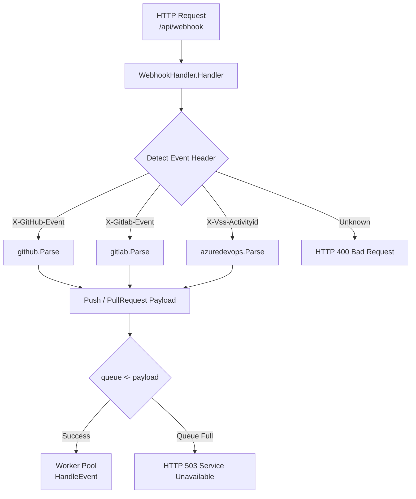
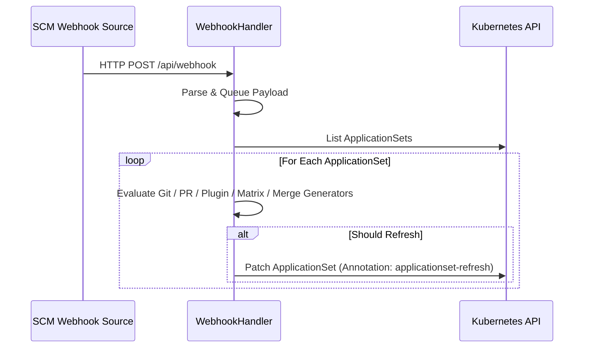

# ApplicationSet Webhooks

<details>
<summary>Relevant source files</summary>

The following files were used as context for generating this wiki page:

- [docs/operator-manual/applicationset/Generators-Pull-Request.md](https://github.com/argoproj/argo-cd/blob/main/docs/operator-manual/applicationset/Generators-Pull-Request.md)
- [docs/operator-manual/applicationset/Generators-Git.md](https://github.com/argoproj/argo-cd/blob/main/docs/operator-manual/applicationset/Generators-Git.md)
- [applicationset/webhook/webhook.go](https://github.com/argoproj/argo-cd/blob/main/applicationset/webhook/webhook.go)
- [docs/operator-manual/applicationset/Generators-Plugin.md](https://github.com/argoproj/argo-cd/blob/main/docs/operator-manual/applicationset/Generators-Plugin.md)
- [pkg/apis/application/v1alpha1/applicationset_types.go](https://github.com/argoproj/argo-cd/blob/main/pkg/apis/application/v1alpha1/applicationset_types.go)
- [docs/operator-manual/applicationset.yaml](https://github.com/argoproj/argo-cd/blob/main/docs/operator-manual/applicationset.yaml)
- [docs/operator-manual/applicationset/index.md](https://github.com/argoproj/argo-cd/blob/main/docs/operator-manual/applicationset/index.md)
- [util/webhook/webhook.go](https://github.com/argoproj/argo-cd/blob/main/util/webhook/webhook.go)
- [docs/proposals/applicationset-plugin-generator.md](https://github.com/argoproj/argo-cd/blob/main/docs/proposals/applicationset-plugin-generator.md)
- [docs/operator-manual/webhook.md](https://github.com/argoproj/argo-cd/blob/main/docs/operator-manual/webhook.md)
</details>

## Overview

ApplicationSet Webhooks provide an event-driven mechanism to eliminate the polling delays inherent in Argo CD ApplicationSet generators—specifically Git and Pull Request generators—which normally rely on fixed intervals (such as 3-minute Git polling or 30-minute PR polling) to discover updates. By exposing a dedicated webhook server within the ApplicationSet controller (`ClusterIP` service), the system immediately ingests payload events from SCMaaS providers like GitHub, GitLab, and Azure DevOps, dynamically evaluates whether active ApplicationSets depend on the modified repositories or pull requests, and triggers instant reconciliation.

Unlike Argo CD's primary API server webhook handler (which targets individual `Application` resources), the ApplicationSet webhook subsystem evaluates higher-level `ApplicationSet` custom resources and their nested generators. When an incoming push or pull request event arrives at the `/api/webhook` endpoint, the subsystem parses the payload, iterates through all cluster-scoped `ApplicationSet` resources, checks matching Git URLs, pull request metadata, Matrix generators, and Merge generators, and patches matching ApplicationSets with the `argocd.argoproj.io/application-set-refresh` annotation. This architecture decouples instantaneous event-driven notification from expensive repository scanning while preserving full compatibility with unauthenticated and HMAC-authenticated webhook deployments.

Sources: [applicationset/webhook/webhook.go:75-159](https://github.com/argoproj/argo-cd/blob/main/applicationset/webhook/webhook.go#L75-L159), [docs/operator-manual/applicationset/Generators-Git.md:462-490](https://github.com/argoproj/argo-cd/blob/main/docs/operator-manual/applicationset/Generators-Git.md#L462-L490)

## Architecture and Initialization

The ApplicationSet webhook server is initialized via `NewWebhookHandler` within the controller process. It reads controller settings from the `argocd-secret` storage manager to configure cryptographic secrets and credentials for downstream SCM provider payload parsers from the `github.com/go-playground/webhooks/v6` library.

Sources: [applicationset/webhook/webhook.go:75-106](https://github.com/argoproj/argo-cd/blob/main/applicationset/webhook/webhook.go#L75-L106)



Sources: [applicationset/webhook/webhook.go:161-194](https://github.com/argoproj/argo-cd/blob/main/applicationset/webhook/webhook.go#L161-L194)

Incoming requests enter the `Handler` method where headers determine which SCM parser validates and extracts the payload. If the internal channel queue reaches its maximum capacity (`payloadQueueSize = 50000`), the webhook handler rejects incoming events with an HTTP 503 status to prevent memory exhaustion. Otherwise, worker goroutines spawned during initialization process payloads asynchronously inside panic-recovery wrappers.

Sources: [applicationset/webhook/webhook.go:33-121](https://github.com/argoproj/argo-cd/blob/main/applicationset/webhook/webhook.go#L33-L121)

## Payload Parsing and Event Filtering

Once a payload is pulled from the queue by `HandleEvent`, the controller extracts generator metadata using `getGitGeneratorInfo` and `getPRGeneratorInfo`. If a payload does not match a push or pull request event structure, it is immediately discarded.

Sources: [applicationset/webhook/webhook.go:123-135](https://github.com/argoproj/argo-cd/blob/main/applicationset/webhook/webhook.go#L123-L135)

For Git push events, the webhook extracts the repository remote/HTML URL, parses the target reference into a short revision name via `webhook.ParseRevision(payload.Ref)`, and determines whether the commit touches the default branch (`touchedHead`). For Pull Request events, the system validates the action against explicit allowed action lists before constructing provider-specific structs.

Sources: [applicationset/webhook/webhook.go:196-287](https://github.com/argoproj/argo-cd/blob/main/applicationset/webhook/webhook.go#L196-L287)

| SCM Provider | Supported Push Actions / Events | Supported Pull Request Actions |
| :--- | :--- | :--- |
| **GitHub** | `PushEvent`, `PingEvent` | `opened`, `closed`, `synchronize`, `labeled`, `reopened`, `unlabeled` |
| **GitLab** | `PushEvents`, `TagEvents`, `SystemHookEvents` | `open`, `close`, `reopen`, `update`, `merge` |
| **Azure DevOps** | `git.push` | `git.pullrequest.created`, `git.pullrequest.merged`, `git.pullrequest.updated` |

Sources: [applicationset/webhook/webhook.go:289-315](https://github.com/argoproj/argo-cd/blob/main/applicationset/webhook/webhook.go#L289-L315)

## ApplicationSet Evaluation and Refresh Logic

When processing a valid event, the webhook handler lists all `ApplicationSet` resources across the cluster and iterates through their defined generators to determine relevance.

Sources: [applicationset/webhook/webhook.go:130-149](https://github.com/argoproj/argo-cd/blob/main/applicationset/webhook/webhook.go#L130-L149)



Sources: [applicationset/webhook/webhook.go:136-159](https://github.com/argoproj/argo-cd/blob/main/applicationset/webhook/webhook.go#L136-L159)

The evaluation loop inspects standard top-level generators as well as complex composite generators (`Matrix` and `Merge`) by recursively unmarshaling nested generator JSON objects from the CRD definition.

Sources: [applicationset/webhook/webhook.go:416-609](https://github.com/argoproj/argo-cd/blob/main/applicationset/webhook/webhook.go#L416-L609)

> [!IMPORTANT]
> The evaluation routine checks whether a generator's configured repository URL matches the webhook event URL using pre-compiled regular expressions (`GetWebURLRegex`), and verifies that revision constraints match via `genRevisionHasChanged`.

Sources: [applicationset/webhook/webhook.go:316-351](https://github.com/argoproj/argo-cd/blob/main/applicationset/webhook/webhook.go#L316-L351)

## Conflict Resolution and Reconciliation Trigger

When `shouldRefresh` evaluates to `true` for an ApplicationSet, the webhook triggers reconciliation by injecting a refresh annotation via `refreshApplicationSet`.

Sources: [applicationset/webhook/webhook.go:150-159](https://github.com/argoproj/argo-cd/blob/main/applicationset/webhook/webhook.go#L150-L159)

```go
func refreshApplicationSet(c client.Client, appSet *v1alpha1.ApplicationSet) error {
	// patch the ApplicationSet with the refresh annotation to reconcile
	return retry.RetryOnConflict(retry.DefaultBackoff, func() error {
		err := c.Get(context.Background(), types.NamespacedName{Name: appSet.Name, Namespace: appSet.Namespace}, appSet)
		if err != nil {
			return fmt.Errorf("error getting ApplicationSet: %w", err)
		}
		if appSet.Annotations == nil {
			appSet.Annotations = map[string]string{}
		}
		appSet.Annotations[common.AnnotationApplicationSetRefresh] = "true"
		return c.Patch(context.Background(), appSet, client.Merge)
	})
}
```

Sources: [applicationset/webhook/webhook.go:611-624](https://github.com/argoproj/argo-cd/blob/main/applicationset/webhook/webhook.go#L611-L624)

To prevent optimistic locking failures under high webhook concurrency, the patch operation wraps execution in `retry.RetryOnConflict(retry.DefaultBackoff, ...)`. It fetches the latest object state, initializes the annotations map if nil, sets `argocd.argoproj.io/application-set-refresh` to `"true"`, and performs a Kubernetes client merge patch. The main ApplicationSet controller detects this annotation, bypasses internal reconciliation timers, and executes parameter generation immediately.

Sources: [docs/operator-manual/applicationset/Generators-Git.md:454-461](https://github.com/argoproj/argo-cd/blob/main/docs/operator-manual/applicationset/Generators-Git.md#L454-L461)

## Configuration and Secret Management

ApplicationSet webhooks rely on secrets stored in the `argocd-secret` Kubernetes secret (or external secrets labeled with `app.kubernetes.io/part-of: argocd`) to verify incoming webhook payloads.

Sources: [docs/operator-manual/applicationset/Generators-Git.md:503-543](https://github.com/argoproj/argo-cd/blob/main/docs/operator-manual/applicationset/Generators-Git.md#L503-L543)

| Provider | Kubernetes Secret Key | Description |
| :--- | :--- | :--- |
| **GitHub** | `webhook.github.secret` | Shared HMAC secret for GitHub webhooks |
| **GitLab** | `webhook.gitlab.secret` | Shared secret token for GitLab webhooks |
| **Azure DevOps** | `webhook.azuredevops.username`<br>`webhook.azuredevops.password` | Basic authentication username and password |

Sources: [docs/operator-manual/webhook.md:57-65](https://github.com/argoproj/argo-cd/blob/main/docs/operator-manual/webhook.md#L57-L65)

> [!CAUTION]
> When configuring webhooks in GitHub, ensure the "Content type" is explicitly set to `application/json`. The default `application/x-www-form-urlencoded` format is unsupported by the underlying webhook parsing library and will result in parsing failures.

Sources: [docs/operator-manual/applicationset/Generators-Git.md:500-502](https://github.com/argoproj/argo-cd/blob/main/docs/operator-manual/applicationset/Generators-Git.md#L500-L502)

## Network Topology and Ingress Exposure

The ApplicationSet webhook architecture differs fundamentally from the core Argo CD API server webhook. While the core Argo CD webhook is built into the main API server, the ApplicationSet webhook server runs as an internal service inside the ApplicationSet controller pod, exposed via a Kubernetes service of type `ClusterIP`.

Sources: [docs/operator-manual/applicationset/Generators-Pull-Request.md:456-458](https://github.com/argoproj/argo-cd/blob/main/docs/operator-manual/applicationset/Generators-Pull-Request.md#L456-L458)

To receive external webhook deliveries from Git providers, operators must provision a dedicated Ingress or Route object targeting the ApplicationSet webhook service on its `/api/webhook` endpoint (e.g., `https://applicationset.example.com/api/webhook`).

Sources: [docs/operator-manual/applicationset/Generators-Git.md:491-496](https://github.com/argoproj/argo-cd/blob/main/docs/operator-manual/applicationset/Generators-Git.md#L491-L496)

## Related

- [[SCM Generators]]
- [[Extensions and Webhooks]]

