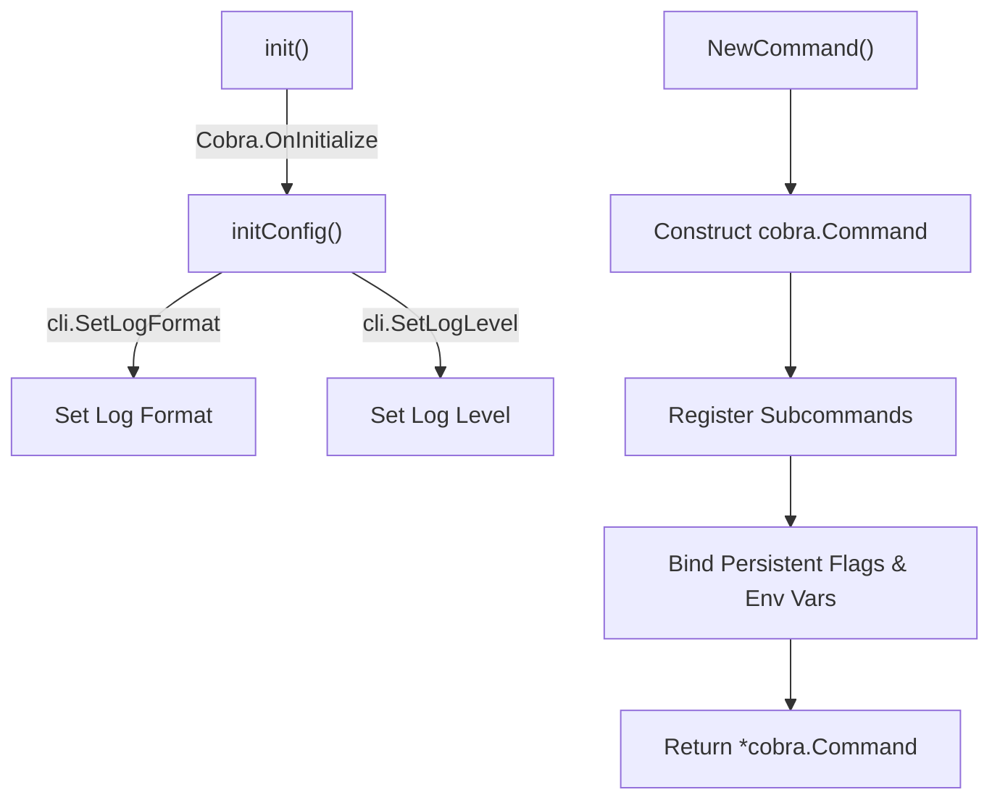
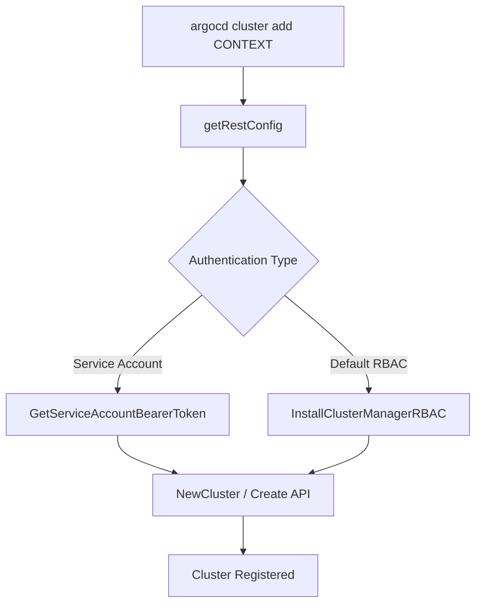
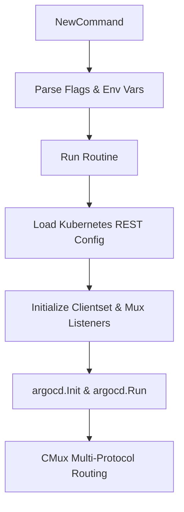

# CLI Architecture

Relevant source files

The following files were used as context for generating this wiki page:

- [cmd/argocd/commands/root.go](https://github.com/argoproj/argo-cd/blob/main/cmd/argocd/commands/root.go)
- [cmd/argocd-server/commands/argocd_server.go](https://github.com/argoproj/argo-cd/blob/main/cmd/argocd-server/commands/argocd_server.go)
- [cmd/argocd-application-controller/commands/argocd_application_controller.go](https://github.com/argoproj/argo-cd/blob/main/cmd/argocd-application-controller/commands/argocd_application_controller.go)
- [cmd/argocd-repo-server/commands/argocd_repo_server.go](https://github.com/argoproj/argo-cd/blob/main/cmd/argocd-repo-server/commands/argocd_repo_server.go)
- [cmd/argocd/commands/account.go](https://github.com/argoproj/argo-cd/blob/main/cmd/argocd/commands/account.go)
- [cmd/argocd/commands/cluster.go](https://github.com/argoproj/argo-cd/blob/main/cmd/argocd/commands/cluster.go)
- [server/server.go](https://github.com/argoproj/argo-cd/blob/main/server/server.go)
- [cmd/argocd/commands/login.go](https://github.com/argoproj/argo-cd/blob/main/cmd/argocd/commands/login.go)

## Overview

The Argo CD CLI architecture centers on a robust command-line utility built on the Cobra framework that orchestrates client interactions, authentication routines, local context persistence, and remote cluster operations. It serves as the primary administration and management interface for operators interacting with Argo CD API servers or managing control-plane components directly. By organizing operations into a hierarchical command tree, the CLI manages global persistent flags, environment variable bindings, and connection endpoints while seamlessly bridging user inputs with remote gRPC services and Kubernetes clusters.

Sources: [cmd/argocd/commands/root.go:33-104](https://github.com/argoproj/argo-cd/v3/cmd/argocd/commands/root.go#L33-L104), [cmd/argocd/commands/login.go:38-51](https://github.com/argoproj/argo-cd/v3/cmd/argocd/commands/login.go#L38-L51), [cmd/argocd/commands/cluster.go:50-82](https://github.com/argoproj/argo-cd/v3/cmd/argocd/commands/cluster.go#L50-L82)

## Root Command Initialization and Navigation

### Initialization and Execution Setup

The Argo CD command-line interface begins execution at `NewCommand()`, which constructs the primary `cobra.Command` instance responsible for managing global configuration, persistent options, and subcommand routing. The initialization sequence hooks into Cobra's lifecycle via `init()`, registering `initConfig` to set up logging formats and levels through `cli.SetLogFormat()` and `cli.SetLogLevel()` prior to command dispatch.

Sources: [cmd/argocd/commands/root.go:23-37](https://github.com/argoproj/argo-cd/v3/cmd/argocd/commands/root.go#L23-L37)

Sources: [cmd/argocd/commands/root.go:23-37](https://github.com/argoproj/argo-cd/v3/cmd/argocd/commands/root.go#L23-L37)

### Subcommand Tree Registration

The root command acts as an aggregator, registering child subcommands that handle distinct functional domains of Argo CD administration. Subcommands are attached using `command.AddCommand()`, with many wrapped via `initialize.InitCommand()` or bound directly with `argocdclient.ClientOptions` and client path options. Shell completion is configured via `ValidArgsFunction`, which queries the default plugin handler to return available plugin commands.

Sources: [cmd/argocd/commands/root.go:47-71](https://github.com/argoproj/argo-cd/v3/cmd/argocd/commands/root.go#L47-L71)

| Subcommand | Registration Method | Function / Target | Sources |
| :--- | :--- | :--- | :--- |
| completion | Direct | `NewCompletionCommand()` | [cmd/argocd/commands/root.go:54](https://github.com/argoproj/argo-cd/v3/cmd/argocd/commands/root.go#L54) |
| version | `initialize.InitCommand` | `NewVersionCmd(&clientOpts, nil)` | [cmd/argocd/commands/root.go:55](https://github.com/argoproj/argo-cd/v3/cmd/argocd/commands/root.go#L55) |
| cluster | `initialize.InitCommand` | `NewClusterCommand(&clientOpts, pathOpts)` | [cmd/argocd/commands/root.go:56](https://github.com/argoproj/argo-cd/v3/cmd/argocd/commands/root.go#L56) |
| application | `initialize.InitCommand` | `NewApplicationCommand(&clientOpts)` | [cmd/argocd/commands/root.go:57](https://github.com/argoproj/argo-cd/v3/cmd/argocd/commands/root.go#L57) |
| appset | `initialize.InitCommand` | `NewAppSetCommand(&clientOpts)` | [cmd/argocd/commands/root.go:58](https://github.com/argoproj/argo-cd/v3/cmd/argocd/commands/root.go#L58) |
| login | Direct | `NewLoginCommand(&clientOpts)` | [cmd/argocd/commands/root.go:59](https://github.com/argoproj/argo-cd/v3/cmd/argocd/commands/root.go#L59) |
| relogin | Direct | `NewReloginCommand(&clientOpts)` | [cmd/argocd/commands/root.go:60](https://github.com/argoproj/argo-cd/v3/cmd/argocd/commands/root.go#L60) |
| repo | `initialize.InitCommand` | `NewRepoCommand(&clientOpts)` | [cmd/argocd/commands/root.go:61](https://github.com/argoproj/argo-cd/v3/cmd/argocd/commands/root.go#L61) |
| repocreds | `initialize.InitCommand` | `NewRepoCredsCommand(&clientOpts)` | [cmd/argocd/commands/root.go:62](https://github.com/argoproj/argo-cd/v3/cmd/argocd/commands/root.go#L62) |
| context | Direct | `NewContextCommand(&clientOpts)` | [cmd/argocd/commands/root.go:63](https://github.com/argoproj/argo-cd/v3/cmd/argocd/commands/root.go#L63) |
| project | `initialize.InitCommand` | `NewProjectCommand(&clientOpts)` | [cmd/argocd/commands/root.go:64](https://github.com/argoproj/argo-cd/v3/cmd/argocd/commands/root.go#L64) |
| account | `initialize.InitCommand` | `NewAccountCommand(&clientOpts)` | [cmd/argocd/commands/root.go:65](https://github.com/argoproj/argo-cd/v3/cmd/argocd/commands/root.go#L65) |
| logout | Direct | `NewLogoutCommand(&clientOpts)` | [cmd/argocd/commands/root.go:66](https://github.com/argoproj/argo-cd/v3/cmd/argocd/commands/root.go#L66) |
| cert | `initialize.InitCommand` | `NewCertCommand(&clientOpts)` | [cmd/argocd/commands/root.go:67](https://github.com/argoproj/argo-cd/v3/cmd/argocd/commands/root.go#L67) |
| gpg | `initialize.InitCommand` | `NewGPGCommand(&clientOpts)` | [cmd/argocd/commands/root.go:68](https://github.com/argoproj/argo-cd/v3/cmd/argocd/commands/root.go#L68) |
| admin | Direct | `admin.NewAdminCommand(&clientOpts)` | [cmd/argocd/commands/root.go:69](https://github.com/argoproj/argo-cd/v3/cmd/argocd/commands/root.go#L69) |
| config | `initialize.InitCommand` | `NewConfigureCommand(&clientOpts)` | [cmd/argocd/commands/root.go:70](https://github.com/argoproj/argo-cd/v3/cmd/argocd/commands/root.go#L70) |

Sources: [cmd/argocd/commands/root.go:54-71](https://github.com/argoproj/argo-cd/v3/cmd/argocd/commands/root.go#L54-L71)

### Global CLI Flags and Environment Variable Bindings

Persistent flags are registered on the root command to populate `argocdclient.ClientOptions` and control execution behavior. Many flags fall back to environment variables or configuration helpers using `env.StringFromEnv()` and `config.GetFlag()`.

Sources: [cmd/argocd/commands/root.go:72-104](https://github.com/argoproj/argo-cd/v3/cmd/argocd/commands/root.go#L72-L104)

| Flag Name | Flag Shorthand | Type | Default Source / Value | Purpose | Sources |
| :--- | :--- | :--- | :--- | :--- | :--- |
| `config` | - | string | `localconfig.DefaultLocalConfigPath()` | Path to Argo CD config | [cmd/argocd/commands/root.go:72-74](https://github.com/argoproj/argo-cd/v3/cmd/argocd/commands/root.go#L72-L74) |
| `server` | - | string | `env.StringFromEnv(common.EnvServer, "")` | Argo CD server address | [cmd/argocd/commands/root.go:75](https://github.com/argoproj/argo-cd/v3/cmd/argocd/commands/root.go#L75) |
| `plaintext` | - | bool | `config.GetBoolFlag("plaintext")` | Disable TLS | [cmd/argocd/commands/root.go:76](https://github.com/argoproj/argo-cd/v3/cmd/argocd/commands/root.go#L76) |
| `insecure` | - | bool | `config.GetBoolFlag("insecure")` | Skip server certificate and domain verification | [cmd/argocd/commands/root.go:77](https://github.com/argoproj/argo-cd/v3/cmd/argocd/commands/root.go#L77) |
| `server-crt` | - | string | `""` | Server certificate file | [cmd/argocd/commands/root.go:78](https://github.com/argoproj/argo-cd/v3/cmd/argocd/commands/root.go#L78) |
| `client-crt` | - | string | `""` | Client certificate file | [cmd/argocd/commands/root.go:79](https://github.com/argoproj/argo-cd/v3/cmd/argocd/commands/root.go#L79) |
| `client-crt-key` | - | string | `""` | Client certificate key file | [cmd/argocd/commands/root.go:80](https://github.com/argoproj/argo-cd/v3/cmd/argocd/commands/root.go#L80) |
| `auth-token` | - | string | `env.StringFromEnv(common.EnvAuthToken, "")` | Authentication token | [cmd/argocd/commands/root.go:81](https://github.com/argoproj/argo-cd/v3/cmd/argocd/commands/root.go#L81) |
| `grpc-web` | - | bool | `config.GetBoolFlag("grpc-web")` | Enables gRPC-web protocol | [cmd/argocd/commands/root.go:82](https://github.com/argoproj/argo-cd/v3/cmd/argocd/commands/root.go#L82) |
| `grpc-web-root-path` | - | string | `""` | Enables gRPC-web protocol with web root | [cmd/argocd/commands/root.go:83](https://github.com/argoproj/argo-cd/v3/cmd/argocd/commands/root.go#L83) |
| `logformat` | - | string | `"json"` | Logging format (`json`\|`text`) | [cmd/argocd/commands/root.go:84](https://github.com/argoproj/argo-cd/v3/cmd/argocd/commands/root.go#L84) |
| `loglevel` | - | string | `"info"` | Logging level (`debug`\|`info`\|`warn`\|`error`) | [cmd/argocd/commands/root.go:85](https://github.com/argoproj/argo-cd/v3/cmd/argocd/commands/root.go#L85) |
| `header` | `H` | stringSlice | `[]string{}` | Additional headers for all requests | [cmd/argocd/commands/root.go:86](https://github.com/argoproj/argo-cd/v3/cmd/argocd/commands/root.go#L86) |
| `port-forward` | - | bool | `config.GetBoolFlag("port-forward")` | Connect using port forwarding | [cmd/argocd/commands/root.go:87](https://github.com/argoproj/argo-cd/v3/cmd/argocd/commands/root.go#L87) |
| `port-forward-namespace` | - | string | `""` | Namespace for port forwarding | [cmd/argocd/commands/root.go:88](https://github.com/argoproj/argo-cd/v3/cmd/argocd/commands/root.go#L88) |
| `http-retry-max` | - | int | `0` | Maximum HTTP connection retries | [cmd/argocd/commands/root.go:89](https://github.com/argoproj/argo-cd/v3/cmd/argocd/commands/root.go#L89) |
| `core` | - | bool | `config.GetBoolFlag("core")` | Talk directly to Kubernetes instead of API server | [cmd/argocd/commands/root.go:90](https://github.com/argoproj/argo-cd/v3/cmd/argocd/commands/root.go#L90) |
| `argocd-context` | - | string | `""` | Argo CD server context name | [cmd/argocd/commands/root.go:91](https://github.com/argoproj/argo-cd/v3/cmd/argocd/commands/root.go#L91) |
| `server-name` | - | string | `env.StringFromEnv(common.EnvServerName, common.DefaultServerName)` | Name of the Argo CD API server | [cmd/argocd/commands/root.go:92](https://github.com/argoproj/argo-cd/v3/cmd/argocd/commands/root.go#L92) |
| `controller-name` | - | string | `env.StringFromEnv(common.EnvAppControllerName, common.DefaultApplicationControllerName)` | Name of the Application controller | [cmd/argocd/commands/root.go:93](https://github.com/argoproj/argo-cd/v3/cmd/argocd/commands/root.go#L93) |
| `redis-haproxy-name` | - | string | `env.StringFromEnv(common.EnvRedisHaProxyName, common.DefaultRedisHaProxyName)` | Name of the Redis HA Proxy | [cmd/argocd/commands/root.go:94](https://github.com/argoproj/argo-cd/v3/cmd/argocd/commands/root.go#L94) |
| `redis-name` | - | string | `env.StringFromEnv(common.EnvRedisName, common.DefaultRedisName)` | Name of the Redis deployment | [cmd/argocd/commands/root.go:95](https://github.com/argoproj/argo-cd/v3/cmd/argocd/commands/root.go#L95) |
| `repo-server-name` | - | string | `env.StringFromEnv(common.EnvRepoServerName, common.DefaultRepoServerName)` | Name of the Repo server | [cmd/argocd/commands/root.go:96](https://github.com/argoproj/argo-cd/v3/cmd/argocd/commands/root.go#L96) |
| `redis-compress` | - | string | `env.StringFromEnv("REDIS_COMPRESSION", string(cache.RedisCompressionGZip))` | Enable Redis compression (`gzip`\|`none`) | [cmd/argocd/commands/root.go:97](https://github.com/argoproj/argo-cd/v3/cmd/argocd/commands/root.go#L97) |
| `prompts-enabled` | - | bool | `localconfig.GetPromptsEnabled(true)` | Force optional interactive prompts | [cmd/argocd/commands/root.go:98](https://github.com/argoproj/argo-cd/v3/cmd/argocd/commands/root.go#L98) |
| `kube-context` | - | string | `""` | Kubernetes context override | [cmd/argocd/commands/root.go:100-101](https://github.com/argoproj/argo-cd/v3/cmd/argocd/commands/root.go#L100-L101) |

Sources: [cmd/argocd/commands/root.go:72-104](https://github.com/argoproj/argo-cd/v3/cmd/argocd/commands/root.go#L72-L104)

> [!NOTE]
> When the `core` flag is enabled, the CLI bypasses the Argo CD API server entirely and interacts directly with the Kubernetes cluster APIs using the local kubeconfig.

## User Authentication and Token Management

### Authentication Overview

The Argo CD CLI handles user authentication, session token lifecycles, and credential operations via the `argocd login` and `argocd account` command families. Authentication occurs either through a direct password exchange against the session client or via an interactive single sign-on (SSO) OIDC flow that spins up a temporary local HTTP server.

Sources: [cmd/argocd/commands/login.go:39-193](https://github.com/argoproj/argo-cd/v3/cmd/argocd/commands/login.go#L39-L193), [cmd/argocd/commands/account.go:36-68](https://github.com/argoproj/argo-cd/v3/cmd/argocd/commands/account.go#L36-L68)

### Authentication Workflows

The `argocd login` command establishes a connection to the target server, executes TLS validation checks unless skipped, and dispatches to either `passwordLogin()` or `oauth2Login()`. 

Sources: [cmd/argocd/commands/login.go:62-149](https://github.com/argoproj/argo-cd/v3/cmd/argocd/commands/login.go#L62-L149)

For username and password authentication, `passwordLogin()` prompts for missing credentials via `cli.PromptCredentials()`, opens a session client connection (`acdClient.NewSessionClientOrDie()`), and invokes `sessionIf.Create()` with a `sessionpkg.SessionCreateRequest` containing the `Username` and `Password`. The server returns a session token string.

Sources: [cmd/argocd/commands/login.go:363-374](https://github.com/argoproj/argo-cd/v3/cmd/argocd/commands/login.go#L363-L374)

For SSO authentication, `oauth2Login()` generates a cryptographically secure 24-character random state nonce using `rand.String(24)` and sets up a PKCE code verifier and SHA-256 code challenge (`code_challenge_method=S256`). It spawns a local HTTP server listening on `localhost:port` (default configured via `DefaultSSOLocalPort`) with a callback handler registered at `/auth/callback`. Depending on the inferred grant type (`GrantTypeAuthorizationCode` or `GrantTypeImplicit`), it launches the system default browser via `ssoAuthFlow()` or outputs a copy-pasteable authorization URL.

Sources: [cmd/argocd/commands/login.go:207-384](https://github.com/argoproj/argo-cd/v3/cmd/argocd/commands/login.go#L207-L384)

> [!WARNING]
> The temporary OIDC callback handler enforces a strict redirect limit (`handledRequests > 2`) to prevent redirect loops during implicit or manual flows. Exceeding this limit causes the handler to reject the request with an error.
Sources: [cmd/argocd/commands/login.go:264-270](https://github.com/argoproj/argo-cd/v3/cmd/argocd/commands/login.go#L264-L270)

### Token Management and Lifecycle

The `argocd account` command group provides administrative and diagnostic utilities for tokens, passwords, and RBAC permissions.

Sources: [cmd/argocd/commands/account.go:36-68](https://github.com/argoproj/argo-cd/v3/cmd/argocd/commands/account.go#L36-L68)

| Command | Description | Source Reference |
| :--- | :--- | :--- |
| `update-password` | Updates current or target account password and acquires a fresh JWT token | [cmd/argocd/commands/account.go:70-156](https://github.com/argoproj/argo-cd/v3/cmd/argocd/commands/account.go#L70-L156) |
| `get-user-info` (alias: `whoami`) | Retrieves current user info, issuer, and assigned groups | [cmd/argocd/commands/account.go:158-208](https://github.com/argoproj/argo-cd/v3/cmd/argocd/commands/account.go#L158-L208) |
| `can-i` | Evaluates RBAC permissions for a given action, resource, and subresource | [cmd/argocd/commands/account.go:210-247](https://github.com/argoproj/argo-cd/v3/cmd/argocd/commands/account.go#L210-L247) |
| `list` | Lists local user accounts | [cmd/argocd/commands/account.go:264-294](https://github.com/argoproj/argo-cd/v3/cmd/argocd/commands/account.go#L264-L294) |
| `get` | Displays account details and active token IDs, issuance dates, and expiration times | [cmd/argocd/commands/account.go:304-348](https://github.com/argoproj/argo-cd/v3/cmd/argocd/commands/account.go#L304-L348) |
| `generate-token` | Generates a persistent account token with an optional expiration duration and token ID | [cmd/argocd/commands/account.go:376-414](https://github.com/argoproj/argo-cd/v3/cmd/argocd/commands/account.go#L376-L414) |
| `delete-token` | Revokes an account token by ID with an optional confirmation prompt | [cmd/argocd/commands/account.go:416-453](https://github.com/argoproj/argo-cd/v3/cmd/argocd/commands/account.go#L416-L453) |
| `session-token` | Displays the current session token, automatically refreshing expired SSO tokens if possible | [cmd/argocd/commands/account.go:455-540](https://github.com/argoproj/argo-cd/v3/cmd/argocd/commands/account.go#L455-L540) |

Sources: [cmd/argocd/commands/account.go:36-540](https://github.com/argoproj/argo-cd/v3/cmd/argocd/commands/account.go#L36-L540)

> [!NOTE]
> The `session-token` command automatically triggers client initialization to refresh expired SSO refresh tokens before validating token claims via `jwt.NewValidator()`. Local users must re-authenticate manually if their token expires.
Sources: [cmd/argocd/commands/account.go:474-508](https://github.com/argoproj/argo-cd/v3/cmd/argocd/commands/account.go#L474-L508)

## Local Configuration and Context Resolution

### Configuration Overview

The Argo CD CLI persists client configuration, server connection profiles, user credentials, and active execution contexts using a local configuration file. The file path defaults to `localconfig.DefaultLocalConfigPath()` and can be overridden via the `--config` global flag or the `ARGOCD_CONFIG` configuration mechanism. 

Sources: [cmd/argocd/commands/root.go:72-74](https://github.com/argoproj/argo-cd/v3/cmd/argocd/commands/root.go#L72-L74)

### Configuration Persistence and Context Resolution

When a user successfully logs in via `argocd login`, the CLI constructs or updates the local configuration structure. It upserts server connection details (such as TLS settings, gRPC-web flags, and core mode), saves user authentication and refresh tokens, and registers a context reference binding the context name, user identity, and server endpoint. Finally, it sets `CurrentContext` and serializes the state to disk using `localconfig.WriteLocalConfig()`.

Sources: [cmd/argocd/commands/login.go:151-181](https://github.com/argoproj/argo-cd/v3/cmd/argocd/commands/login.go#L151-L181)

Subsequent commands resolve active client configurations by reading the local config file and resolving the specified context via `localCfg.ResolveContext(clientOpts.Context)`. For instance, when updating a password or managing account tokens, the CLI retrieves claims from the active context's user configuration to establish authenticated headless sessions.

Sources: [cmd/argocd/commands/account.go:134-140](https://github.com/argoproj/argo-cd/v3/cmd/argocd/commands/account.go#L134-L140), [cmd/argocd/commands/account.go:484-495](https://github.com/argoproj/argo-cd/v3/cmd/argocd/commands/account.go#L484-L495)

> [!NOTE]
> If `clientOpts.Context` is omitted during execution, `ResolveContext` falls back to the default `CurrentContext` stored in the local configuration file.
Sources: [cmd/argocd/commands/account.go:136-137](https://github.com/argoproj/argo-cd/v3/cmd/argocd/commands/account.go#L136-L137)

## Cluster Management and Kubernetes Integration

### Cluster Management Overview

The Argo CD CLI provides comprehensive cluster management capabilities through the `argocd cluster` command tree, facilitating cluster registration, credentials updates, information retrieval, and RBAC resource deployment on target Kubernetes clusters via local `kubectl` integration.

Sources: [cmd/argocd/commands/cluster.go:50-82](https://github.com/argoproj/argo-cd/v3/cmd/argocd/commands/cluster.go#L50-L82)

### Cluster Registration Workflow

#### Registration Overview

Adding a target cluster requires an existing context within the local `kubectl` configuration. The registration routine loads the kubeconfig context, initializes a Kubernetes `clientset`, installs the necessary RBAC manager service account or tokens, and registers the cluster with the Argo CD API server.

Sources: [cmd/argocd/commands/cluster.go:95-201](https://github.com/argoproj/argo-cd/v3/cmd/argocd/commands/cluster.go#L95-L201)

#### Call-Chain Execution Walkthrough

When `argocd cluster add CONTEXT` executes, the workflow proceeds through a defined sequence of operations:
1. `getRestConfig(pathOpts, contextName)` reads the specified context from the local kubeconfig file and builds a Kubernetes REST configuration (`*rest.Config`).
   Sources: [cmd/argocd/commands/cluster.go:111-112](https://github.com/argoproj/argo-cd/v3/cmd/argocd/commands/cluster.go#L111-L112), [cmd/argocd/commands/cluster.go:216-237](https://github.com/argoproj/argo-cd/v3/cmd/argocd/commands/cluster.go#L216-L237)
2. `kubernetes.NewForConfig(conf)` initializes a Kubernetes `clientset` using the resolved configuration.
   Sources: [cmd/argocd/commands/cluster.go:118-119](https://github.com/argoproj/argo-cd/v3/cmd/argocd/commands/cluster.go#L118-L119)
3. Depending on configuration flags, authentication is resolved either via AWS IAM (`clusterOpts.AwsClusterName`), an external exec provider (`clusterOpts.ExecProviderCommand`), a pre-existing service account (`clusterOpts.ServiceAccount`), or by deploying default RBAC via `clusterauth.InstallClusterManagerRBAC(...)`.
   Sources: [cmd/argocd/commands/cluster.go:123-157](https://github.com/argoproj/argo-cd/v3/cmd/argocd/commands/cluster.go#L123-L157)
4. `cmdutil.NewCluster(...)` packages the cluster endpoint, namespaces, configuration, bearer token, and metadata into a cluster resource object.
   Sources: [cmd/argocd/commands/cluster.go:169-169](https://github.com/argoproj/argo-cd/v3/cmd/argocd/commands/cluster.go#L169-L169)
5. `clusterIf.Create(ctx, &clstCreateReq)` transmits the cluster create request to the Argo CD API server.
   Sources: [cmd/argocd/commands/cluster.go:194-199](https://github.com/argoproj/argo-cd/v3/cmd/argocd/commands/cluster.go#L194-L199)

> [!WARNING]
> When removing a cluster via `argocd cluster rm`, the CLI automatically attempts to uninstall the cluster manager RBAC resources from the target Kubernetes cluster using its stored context name. If the cluster is unreachable, this cleanup step may block or fail.
Sources: [cmd/argocd/commands/cluster.go:472-479](https://github.com/argoproj/argo-cd/v3/cmd/argocd/commands/cluster.go#L472-L479)

### Cluster Subcommands and Operations

The `cluster` command group provides several subcommands for querying, modifying, and rotating cluster credentials.

| Subcommand | Description | Sources |
| :--- | :--- | :--- |
| `add` | Adds a target cluster configuration from kubectl config to Argo CD | [cmd/argocd/commands/cluster.go:84-214](https://github.com/argoproj/argo-cd/v3/cmd/argocd/commands/cluster.go#L84-L214) |
| `get` | Retrieves detailed server, TLS, and authentication properties for specific clusters | [cmd/argocd/commands/cluster.go:345-384](https://github.com/argoproj/argo-cd/v3/cmd/argocd/commands/cluster.go#L345-L384) |
| `list` | Lists all configured clusters in tabular, JSON, YAML, or server address format | [cmd/argocd/commands/cluster.go:523-568](https://github.com/argoproj/argo-cd/v3/cmd/argocd/commands/cluster.go#L523-L568) |
| `rm` | Removes cluster credentials and uninstalls manager RBAC from the target cluster | [cmd/argocd/commands/cluster.go:420-488](https://github.com/argoproj/argo-cd/v3/cmd/argocd/commands/cluster.go#L420-L488) |
| `rotate-auth` | Rotates authentication tokens for a specified cluster server or name | [cmd/argocd/commands/cluster.go:570-596](https://github.com/argoproj/argo-cd/v3/cmd/argocd/commands/cluster.go#L570-L596) |
| `set` | Updates modifiable cluster parameters such as name, namespaces, labels, and annotations | [cmd/argocd/commands/cluster.go:256-325](https://github.com/argoproj/argo-cd/v3/cmd/argocd/commands/cluster.go#L256-L325) |

Sources: [cmd/argocd/commands/cluster.go:75-80](https://github.com/argoproj/argo-cd/v3/cmd/argocd/commands/cluster.go#L75-L80)

## Server Binary Commands and Lifecycle

### Server Execution Overview

Server-side binaries in Argo CD are initialized using Cobra command structures that configure flag parsing, environment variable bindings, TLS settings, and execution loops. The primary server binaries consist of the API server (`argocd-server`), the application controller (`argocd-application-controller`), and the repository server (`argocd-repo-server`). Each binary sets up panic recovery using stack trace logging, initializes OpenTelemetry tracing when an OTLP address is provided, and establishes distinct client configurations for interacting with the Kubernetes API and internal components.
Sources: [cmd/argocd-server/commands/argocd_server.go:56-140](https://github.com/argoproj/argo-cd/v3/cmd/argocd-server/commands/argocd_server.go#L56-L140), [cmd/argocd-application-controller/commands/argocd_application_controller.go:54-131](https://github.com/argoproj/argo-cd/v3/cmd/argocd-application-controller/commands/argocd_application_controller.go#L54-L131), [cmd/argocd-repo-server/commands/argocd_repo_server.go:55-112](https://github.com/argoproj/argo-cd/v3/cmd/argocd-repo-server/commands/argocd_repo_server.go#L55-L112)

### API Server Execution and Multiplexing

#### Multiplexing Architecture Overview

The `argocd-server` command configures the gRPC and REST API server responsible for serving the Web UI, CLI, and external CI/CD systems. Command flags control transport security, address bindings, timeout thresholds, static asset paths, and ApplicationSet integration options.
Sources: [cmd/argocd-server/commands/argocd_server.go:110-117](https://github.com/argoproj/argo-cd/v3/cmd/argocd-server/commands/argocd_server.go#L110-L117), [cmd/argocd-server/commands/argocd_server.go:310-365](https://github.com/argoproj/argo-cd/v3/cmd/argocd-server/commands/argocd_server.go#L310-L365)

Sources: [cmd/argocd-server/commands/argocd_server.go:56-298](https://github.com/argoproj/argo-cd/v3/cmd/argocd-server/commands/argocd_server.go#L56-L298)

#### Call-Chain Execution Walkthrough

When `argocd-server` executes its main `Run` routine, initialization proceeds through a structured sequence:
1. `clientConfig.ClientConfig()` loads the Kubernetes REST configuration and applies defaults via `v1alpha1.SetK8SConfigDefaults(config)`.
   Sources: [cmd/argocd-server/commands/argocd_server.go:141-143](https://github.com/argoproj/argo-cd/v3/cmd/argocd-server/commands/argocd_server.go#L141-L143)
2. `tlsConfigCustomizerSrc()` and cache sources (`cacheSrc`, `repoServerCacheSrc`) are evaluated to establish underlying client pools and TLS parameters.
   Sources: [cmd/argocd-server/commands/argocd_server.go:145-150](https://github.com/argoproj/argo-cd/v3/cmd/argocd-server/commands/argocd_server.go#L145-L150)
3. `apiclient.NewRepoServerClientset(...)` instantiates the repository server gRPC client using resolved TLS configuration and timeouts.
   Sources: [cmd/argocd-server/commands/argocd_server.go:216-216](https://github.com/argoproj/argo-cd/v3/cmd/argocd-server/commands/argocd_server.go#L216-L216)
4. `server.NewServer(ctx, argoCDOpts, appsetOpts)` constructs the primary `ArgoCDServer` instance, setting up informers, RBAC enforcers, and OIDC client applications.
   Sources: [cmd/argocd-server/commands/argocd_server.go:277-277](https://github.com/argoproj/argo-cd/v3/cmd/argocd-server/commands/argocd_server.go#L277-L277), [server/server.go:313-428](https://github.com/argoproj/argo-cd/v3/server/server.go#L313-L428)
5. `argocd.Init(ctx)` starts background shared informers for projects, applications, application sets, clusters, config maps, and secrets.
   Sources: [cmd/argocd-server/commands/argocd_server.go:278-278](https://github.com/argoproj/argo-cd/v3/cmd/argocd-server/commands/argocd_server.go#L278-L278), [server/server.go:565-572](https://github.com/argoproj/argo-cd/v3/server/server.go#L565-L572)
6. `argocd.Listen()` binds TCP ports for main traffic and metrics, establishing a local gateway connection.
   Sources: [cmd/argocd-server/commands/argocd_server.go:282-283](https://github.com/argoproj/argo-cd/v3/cmd/argocd-server/commands/argocd_server.go#L282-L283), [server/server.go:525-562](https://github.com/argoproj/argo-cd/v3/server/server.go#L525-L562)
7. `argocd.Run(serverCtx, lns)` configures `cmux` to multiplex gRPC and HTTP/1.1 traffic on a single port, registers gRPC services and REST gateway handlers, and listens for termination signals.
   Sources: [cmd/argocd-server/commands/argocd_server.go:290-290](https://github.com/argoproj/argo-cd/v3/cmd/argocd-server/commands/argocd_server.go#L290-L290), [server/server.go:578-763](https://github.com/argoproj/argo-cd/v3/server/server.go#L578-L763)

> [!NOTE]
> Connection multiplexing in the API server (`cmux`) inspects incoming protocol headers to route HTTP/1.1 PATCH requests and gRPC content-type streams over the same main listener port when TLS is either enabled or disabled.
Sources: [server/server.go:626-660](https://github.com/argoproj/argo-cd/v3/server/server.go#L626-L660)

### Application Controller and Repository Server Execution

The application controller (`argocd-application-controller`) manages reconciliation loops, workqueue rate limiters, sharding algorithms, and self-heal backoff parameters. The repository server (`argocd-repo-server`) manages local Git clones, manifest generation limits, archive size boundaries, and GnuPG keyring synchronization.
Sources: [cmd/argocd-application-controller/commands/argocd_application_controller.go:103-256](https://github.com/argoproj/argo-cd/v3/cmd/argocd-application-controller/commands/argocd_application_controller.go#L103-L256), [cmd/argocd-repo-server/commands/argocd_repo_server.go:88-254](https://github.com/argoproj/argo-cd/v3/cmd/argocd-repo-server/commands/argocd_repo_server.go#L88-L254)

| Binary Command | Primary Purpose | Key Configuration Flags | Sources |
| :--- | :--- | :--- | :--- |
| `argocd-server` | Exposes gRPC/REST APIs for UI, CLI, and webhooks | `--address`, `--port`, `--insecure`, `--repo-server`, `--disable-auth` | [cmd/argocd-server/commands/argocd_server.go:110-113](https://github.com/argoproj/argo-cd/v3/cmd/argocd-server/commands/argocd_server.go#L110-L113), [cmd/argocd-server/commands/argocd_server.go:310-348](https://github.com/argoproj/argo-cd/v3/cmd/argocd-server/commands/argocd_server.go#L310-L348) |
| `argocd-application-controller` | Reconciles application live state against target Git state | `--app-resync`, `--status-processors`, `--operation-processors`, `--sharding-method` | [cmd/argocd-application-controller/commands/argocd_application_controller.go:103-107](https://github.com/argoproj/argo-cd/v3/cmd/argocd-application-controller/commands/argocd_application_controller.go#L103-L107), [cmd/argocd-application-controller/commands/argocd_application_controller.go:260-311](https://github.com/argoproj/argo-cd/v3/cmd/argocd-application-controller/commands/argocd_application_controller.go#L260-L311) |
| `argocd-repo-server` | Generates Kubernetes manifests from repository sources | `--port`, `--parallelismlimit`, `--max-combined-directory-manifests-size`, `--disable-tls` | [cmd/argocd-repo-server/commands/argocd_repo_server.go:88-91](https://github.com/argoproj/argo-cd/v3/cmd/argocd-repo-server/commands/argocd_repo_server.go#L88-L91), [cmd/argocd-repo-server/commands/argocd_repo_server.go:256-284](https://github.com/argoproj/argo-cd/v3/cmd/argocd-repo-server/commands/argocd_repo_server.go#L256-L284) |

Sources: [cmd/argocd-server/commands/argocd_server.go:110-113](https://github.com/argoproj/argo-cd/v3/cmd/argocd-server/commands/argocd_server.go#L110-L113), [cmd/argocd-application-controller/commands/argocd_application_controller.go:103-107](https://github.com/argoproj/argo-cd/v3/cmd/argocd-application-controller/commands/argocd_application_controller.go#L103-L107), [cmd/argocd-repo-server/commands/argocd_repo_server.go:88-91](https://github.com/argoproj/argo-cd/v3/cmd/argocd-repo-server/commands/argocd_repo_server.go#L88-L91)

> [!WARNING]
> When `argocd-repo-server` performs health checks via its HTTP health probe handler with `full=true`, it establishes a local gRPC connection back to itself to verify that the server is actively serving requests. Misconfigured local TLS or disabled endpoints will cause liveness probe failures.
Sources: [cmd/argocd-repo-server/commands/argocd_repo_server.go:190-209](https://github.com/argoproj/argo-cd/v3/cmd/argocd-repo-server/commands/argocd_repo_server.go#L190-209)

## Related

- [[Application CLI]]
- [[Cluster and Project CLI]]
- [[CLI Local Config]]

