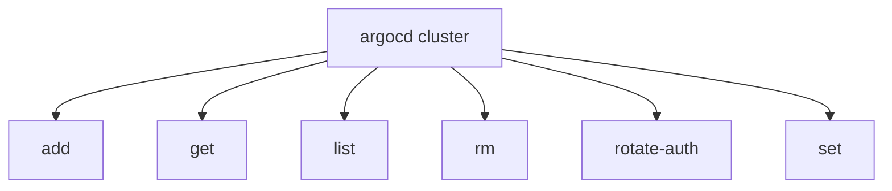

# Cluster and Project CLI

<details>
<summary>Relevant source files</summary>

The following files were used as context for generating this wiki page:

- [cmd/argocd/commands/project.go](https://github.com/argoproj/argo-cd/blob/main/cmd/argocd/commands/project.go)
- [docs/user-guide/commands/argocd_proj.md](https://github.com/argoproj/argo-cd/blob/main/docs/user-guide/commands/argocd_proj.md)
- [cmd/argocd/commands/cluster.go](https://github.com/argoproj/argo-cd/blob/main/cmd/argocd/commands/cluster.go)
- [docs/user-guide/projects.md](https://github.com/argoproj/argo-cd/blob/main/docs/user-guide/projects.md)
- [cmd/argocd/commands/repo.go](https://github.com/argoproj/argo-cd/blob/main/cmd/argocd/commands/repo.go)
- [docs/proposals/project-repos-and-clusters.md](https://github.com/argoproj/argo-cd/blob/main/docs/proposals/project-repos-and-clusters.md)
- [docs/user-guide/commands/argocd_cluster.md](https://github.com/argoproj/argo-cd/blob/main/docs/user-guide/commands/argocd_cluster.md)
- [docs/user-guide/commands/argocd.md](https://github.com/argoproj/argo-cd/blob/main/docs/user-guide/commands/argocd.md)
- [cmd/argocd/commands/admin/repo.go](https://github.com/argoproj/argo-cd/blob/main/cmd/argocd/commands/admin/repo.go)
- [cmd/argocd/commands/admin/cluster.go](https://github.com/argoproj/argo-cd/blob/main/cmd/argocd/commands/admin/cluster.go)
- [docs/user-guide/commands/argocd_admin_cluster.md](https://github.com/argoproj/argo-cd/blob/main/docs/user-guide/commands/argocd_admin_cluster.md)
- [cmd/argocd/commands/admin/project.go](https://github.com/argoproj/argo-cd/blob/main/cmd/argocd/commands/admin/project.go)
- [cmd/util/cluster.go](https://github.com/argoproj/argo-cd/blob/main/cmd/util/cluster.go)
- [docs/user-guide/commands/argocd_admin_proj.md](https://github.com/argoproj/argo-cd/blob/main/docs/user-guide/commands/argocd_admin_proj.md)
</details>

## Overview

The Cluster and Project CLI subsystem in Argo CD provides comprehensive administrative and user-facing command-line interfaces for managing target Kubernetes clusters, source repositories, and logical application projects. These commands enable multi-tenant governance by allowing administrators and developers to configure cluster endpoints, enforce fine-grained RBAC policies, manage repository credentials, and scope resources to specific projects. Sources: [cmd/argocd/commands/project.go:41-91](https://github.com/argoproj/argo-cd/blob/main/cmd/argocd/commands/project.go#L41-L91), [cmd/argocd/commands/cluster.go:49-82](https://github.com/argoproj/argo-cd/blob/main/cmd/argocd/commands/cluster.go#L49-L82), [cmd/argocd/commands/repo.go:25-54](https://github.com/argoproj/argo-cd/blob/main/cmd/argocd/commands/repo.go#L25-L54), [docs/user-guide/projects.md:3-9](https://github.com/argoproj/argo-cd/blob/main/docs/user-guide/projects.md#L3-L9)

By supporting both interactive server-connected operations and offline declarative specification generation, the CLI bridges the gap between dynamic cluster onboarding and strict declarative GitOps workflows. It addresses common operational friction in multi-tenant environments by supporting project-scoped self-service registration and advanced administrative controls such as controller sharding and bulk policy updates. Sources: [cmd/argocd/commands/admin/cluster.go:43-71](https://github.com/argoproj/argo-cd/blob/main/cmd/argocd/commands/admin/cluster.go#L43-L71), [cmd/argocd/commands/admin/project.go:26-39](https://github.com/argoproj/argo-cd/blob/main/cmd/argocd/commands/admin/project.go#L26-L39), [docs/proposals/project-repos-and-clusters.md:29-38](https://github.com/argoproj/argo-cd/blob/main/docs/proposals/project-repos-and-clusters.md#L29-L38)

## Cluster Management CLI Subcommands

### Cluster Management CLI Subcommands

The Argo CD cluster management CLI enables administrators to register, inspect, update, rotate credentials for, and remove Kubernetes clusters through the `argocd cluster` subcommand tree. Rooted at `NewClusterCommand`, the utility delegates operations to specific subcommands including `add`, `get`, `list`, `rm`, `rotate-auth`, and `set`. Sources: [cmd/argocd/commands/cluster.go:49-82](https://github.com/argoproj/argo-cd/blob/main/cmd/argocd/commands/cluster.go#L49-L82)


Sources: [cmd/argocd/commands/cluster.go:75-80](https://github.com/argoproj/argo-cd/blob/main/cmd/argocd/commands/cluster.go#L75-L80)

### Cluster Registration and RBAC Bootstrapping

When adding a cluster via `argocd cluster add CONTEXT`, the command extracts a REST configuration from the local kubeconfig file, establishes a Kubernetes clientset, and bootstraps necessary permissions. If a custom service account is omitted, it automatically installs cluster manager RBAC or uses an existing service account bearer token. Sources: [cmd/argocd/commands/cluster.go:92-157](https://github.com/argoproj/argo-cd/blob/main/cmd/argocd/commands/cluster.go#L92-L157)

The registration call chain flows as follows:
`NewClusterAddCommand()` execution → `getRestConfig()` loads starting config and extracts `rest.Config` → `kubernetes.NewForConfig()` builds a clientset → `clusterauth.InstallClusterManagerRBAC()` or `clusterauth.GetServiceAccountBearerToken()` provisions credentials → `cmdutil.NewCluster()` constructs the cluster resource object → `clusterIf.Create()` registers the cluster with the Argo CD API server. Sources: [cmd/argocd/commands/cluster.go:111-199](https://github.com/argoproj/argo-cd/blob/main/cmd/argocd/commands/cluster.go#L111-L199), [cmd/util/cluster.go:32-124](https://github.com/argoproj/argo-cd/blob/main/cmd/util/cluster.go#L32-L124)

> [!WARNING]
> Running `argocd cluster add` on an interactive terminal without specifying a service account triggers an automatic prompt warning that full cluster or namespace-level privileges will be granted to the `argocd-manager` service account in the system namespace.
Sources: [cmd/argocd/commands/cluster.go:143-153](https://github.com/argoproj/argo-cd/blob/main/cmd/argocd/commands/cluster.go#L143-L153)

### Cluster Endpoint Selection and Options

The CLI supports multiple cluster endpoint resolutions and authentication providers during cluster addition or configuration updates.

| Flag / Option | Type | Default Value | Purpose |
| :--- | :--- | :--- | :--- |
| `--in-cluster` | bool | `false` | Connects using the internal Kubernetes service hostname (`kubernetes.default.svc`) |
| `--cluster-endpoint` | string | `""` | Endpoint source: `kubeconfig`, `kube-public`, or `internal` |
| `--service-account` | string | `""` | Custom system namespace service account for resource management |
| `--system-namespace` | string | `argocd` (`common.DefaultSystemNamespace`) | Target system namespace for Argo CD components |
| `--aws-cluster-name` | string | `""` | AWS cluster name for utilizing `aws cli eks token` authentication |
| `--aws-role-arn` | string | `""` | Optional AWS IAM role ARN to assume for cluster operations |
| `--aws-profile` | string | `""` | Optional AWS profile to use instead of default credentials chain |
| `--exec-command` | string | `""` | Executable command to provide client credentials |
| `--shard` | int64 | `-1` | Cluster shard number; inferred from hostname if unset |
| `--upsert` | bool | `false` | Overrides an existing cluster with the same name even if specs differ |
Sources: [cmd/argocd/commands/cluster.go:204-211](https://github.com/argoproj/argo-cd/blob/main/cmd/argocd/commands/cluster.go#L204-L211), [cmd/util/cluster.go:152-199](https://github.com/argoproj/argo-cd/blob/main/cmd/util/cluster.go#L152-L199)

> [!TIP]
> Use `--cluster-endpoint kube-public` to dynamically retrieve the cluster API server address and certificate authority data published in the `kube-public` namespace configmap (`cluster-info`).
Sources: [cmd/argocd/commands/cluster.go:177-186](https://github.com/argoproj/argo-cd/blob/main/cmd/argocd/commands/cluster.go#L177-L186), [cmd/util/cluster.go:128-150](https://github.com/argoproj/argo-cd/blob/main/cmd/util/cluster.go#L128-L150)

### Credential Rotation and Removal

The `rotate-auth` command accepts a server URL or cluster name selector, parses it using `getQueryBySelector()`, and invokes `clusterIf.RotateAuth()` on the remote server to refresh the cluster's stored authentication credentials. Sources: [cmd/argocd/commands/cluster.go:505-514](https://github.com/argoproj/argo-cd/blob/main/cmd/argocd/commands/cluster.go#L505-L514), [cmd/argocd/commands/cluster.go:570-596](https://github.com/argoproj/argo-cd/blob/main/cmd/argocd/commands/cluster.go#L570-L596)

When removing a cluster via `argocd cluster rm`, the CLI queries the cluster definition, deletes it from Argo CD, and subsequently loads the REST configuration to execute `clusterauth.UninstallClusterManagerRBAC()` against the target cluster clientset. Sources: [cmd/argocd/commands/cluster.go:420-488](https://github.com/argoproj/argo-cd/blob/main/cmd/argocd/commands/cluster.go#L420-L488)

## Project Configuration and Management Commands

### Overview

Project configuration and management commands in the Argo CD CLI allow operators to define logical application boundaries, enforce security policies, restrict deployment destinations, and control resource type visibility. The project management root command `argocd proj` acts as a container for dozens of subcommands defined in `cmd/argocd/commands/project.go`, facilitating operations like project creation, parameter updates, source repository restrictions, and RBAC role administration. Sources: [cmd/argocd/commands/project.go:41-91](https://github.com/argoproj/argo-cd/blob/main/cmd/argocd/commands/project.go#L41-L91), [docs/user-guide/projects.md:3-8](https://github.com/argoproj/argo-cd/blob/main/docs/user-guide/projects.md#L3-L8)

### Project Scoping and Resource Restrictions

Projects restrict what may be deployed, where applications can target, and which API resource kinds are permitted. Resource restrictions are managed via specialized CLI subcommands that update whitelist and blacklist collections within the `AppProject` specification. Sources: [docs/user-guide/projects.md:5-7](https://github.com/argoproj/argo-cd/blob/main/docs/user-guide/projects.md#L5-L7), [docs/user-guide/commands/argocd_proj.md:83-88](https://github.com/argoproj/argo-cd/blob/main/docs/user-guide/commands/argocd_proj.md#L83-L88)

| Command Use | Description | Default List Type | Sources: [cmd/argocd/commands/project.go:648-786](https://github.com/argoproj/argo-cd/blob/main/cmd/argocd/commands/project.go#L648-L786) |
| :--- | :--- | :--- | :--- |
| `allow-cluster-resource PROJECT GROUP KIND [NAME]` | Adds a cluster-scoped API resource to the allow list and removes it from deny list | allow | Sources: [cmd/argocd/commands/project.go:771-786](https://github.com/argoproj/argo-cd/blob/main/cmd/argocd/commands/project.go#L771-L786) |
| `deny-cluster-resource PROJECT GROUP KIND` | Removes a cluster-scoped API resource from the allow list and adds it to deny list | allow | Sources: [cmd/argocd/commands/project.go:757-770](https://github.com/argoproj/argo-cd/blob/main/cmd/argocd/commands/project.go#L757-L770) |
| `allow-namespace-resource PROJECT GROUP KIND` | Removes a namespaced API resource from the deny list or adds it to the allow list | deny | Sources: [cmd/argocd/commands/project.go:729-741](https://github.com/argoproj/argo-cd/blob/main/cmd/argocd/commands/project.go#L729-L741) |
| `deny-namespace-resource PROJECT GROUP KIND` | Adds a namespaced API resource to the deny list or removes it from the allow list | deny | Sources: [cmd/argocd/commands/project.go:743-755](https://github.com/argoproj/argo-cd/blob/main/cmd/argocd/commands/project.go#L743-L755) |

> [!WARNING]
> When a project uses `namespaceResourceWhitelist`, the whitelist also controls which child resources appear in the Application resource tree in the UI. Any child resource whose GroupKind is omitted from the whitelist is hidden from the tree view even if it is healthy in the cluster.
Sources: [docs/user-guide/projects.md:136-136](https://github.com/argoproj/argo-cd/blob/main/docs/user-guide/projects.md#L136-L136)

### Source Repository and Destination Management

Projects enforce trust boundaries by limiting git source URLs and deployment destinations. Destination bindings can use server URLs or cluster names combined with target namespaces, supporting negative matching rules prefixed with `!`. Sources: [docs/user-guide/projects.md:5-6](https://github.com/argoproj/argo-cd/blob/main/docs/user-guide/projects.md#L5-L6), [docs/user-guide/projects.md:90-102](https://github.com/argoproj/argo-cd/blob/main/docs/user-guide/projects.md#L90-L102)

The mutation flow for adding source repositories executes via `NewProjectAddSourceCommand()`: the CLI obtains a project client via `headless.NewClientOrDie()`, retrieves the existing project specification using `projIf.Get()`, evaluates the `SourceRepos` slice for existing URLs or wildcards via `git.SameURL()`, and sends an updated spec via `projIf.Update()`. Sources: [cmd/argocd/commands/project.go:476-514](https://github.com/argoproj/argo-cd/blob/main/cmd/argocd/commands/project.go#L476-L514)

```go
// Example signature check from NewProjectAddDestinationCommand
buildApplicationDestination := func(destination string, namespace string, nameInsteadServer bool) v1alpha1.ApplicationDestination {
    if nameInsteadServer {
        return v1alpha1.ApplicationDestination{Name: destination, Namespace: namespace}
    }
    return v1alpha1.ApplicationDestination{Server: destination, Namespace: namespace}
}
```
Sources: [cmd/argocd/commands/project.go:280-285](https://github.com/argoproj/argo-cd/blob/main/cmd/argocd/commands/project.go#L280-L285)

> [!NOTE]
> A source repository or destination target is considered valid if any allow rule permits it and no deny rule rejects it. The rule `!*` is explicitly invalid because disallowing everything contradicts allow evaluation semantics.
Sources: [docs/user-guide/projects.md:83-88](https://github.com/argoproj/argo-cd/blob/main/docs/user-guide/projects.md#L83-L88), [docs/user-guide/projects.md:120-125](https://github.com/argoproj/argo-cd/blob/main/docs/user-guide/projects.md#L120-L125)

## Repository Credential and Access Subcommands

### Repository Credential and Access Subcommands

> [!NOTE]
> The `argocd repo` command hierarchy manages remote connection parameters for Git, OCI, and Helm repositories, orchestrating validation, secure credential storage, and repository state inspection.
Sources: [cmd/argocd/commands/repo.go:25-54](https://github.com/argoproj/argo-cd/blob/main/cmd/argocd/commands/repo.go#L25-L54)

The repository subcommand set provides tools for managing repository registration, inspecting connection health, and removing parameters. Each action interacts with the Argo CD API server through dedicated gRPC client methods implemented in `cmd/argocd/commands/repo.go`.

| Command | Description | Supported Flags | Sources: [cmd/argocd/commands/repo.go:49-52](https://github.com/argoproj/argo-cd/blob/main/cmd/argocd/commands/repo.go#L49-L52), [cmd/argocd/commands/repo.go:280-281](https://github.com/argoproj/argo-cd/blob/main/cmd/argocd/commands/repo.go#L280-L281), [cmd/argocd/commands/repo.go:327-328](https://github.com/argoproj/argo-cd/blob/main/cmd/argocd/commands/repo.go#L327-L328), [cmd/argocd/commands/repo.go:416-417](https://github.com/argoproj/argo-cd/blob/main/cmd/argocd/commands/repo.go#L416-L417), [cmd/argocd/commands/repo.go:487-489](https://github.com/argoproj/argo-cd/blob/main/cmd/argocd/commands/repo.go#L487-L489) |
| :--- | :--- | :--- | :--- |
| `argocd repo add REPOURL` | Registers a Git, OCI, or Helm repository | `--upsert`, plus authentication and transport flags | Sources: [cmd/argocd/commands/repo.go:113-115](https://github.com/argoproj/argo-cd/blob/main/cmd/argocd/commands/repo.go#L113-L115), [cmd/argocd/commands/repo.go:280-281](https://github.com/argoproj/argo-cd/blob/main/cmd/argocd/commands/repo.go#L280-L281) |
| `argocd repo get REPO` | Retrieves connection details for a specific repository | `--project`, `-o`/`--output`, `--refresh` | Sources: [cmd/argocd/commands/repo.go:444-446](https://github.com/argoproj/argo-cd/blob/main/cmd/argocd/commands/repo.go#L444-L446), [cmd/argocd/commands/repo.go:487-489](https://github.com/argoproj/argo-cd/blob/main/cmd/argocd/commands/repo.go#L487-L489) |
| `argocd repo list` | Lists all registered repositories | `-o`/`--output`, `--refresh` | Sources: [cmd/argocd/commands/repo.go:361-363](https://github.com/argoproj/argo-cd/blob/main/cmd/argocd/commands/repo.go#L361-L363), [cmd/argocd/commands/repo.go:416-417](https://github.com/argoproj/argo-cd/blob/main/cmd/argocd/commands/repo.go#L416-L417) |
| `argocd repo rm REPO ...` | Removes one or more configured repositories | `--project` | Sources: [cmd/argocd/commands/repo.go:288-290](https://github.com/argoproj/argo-cd/blob/main/cmd/argocd/commands/repo.go#L288-L290), [cmd/argocd/commands/repo.go:327-328](https://github.com/argoproj/argo-cd/blob/main/cmd/argocd/commands/repo.go#L327-L328) |

> [!WARNING]
> When executing `argocd repo add`, if a username is supplied without a corresponding password flag, the CLI prompts interactively for the password via `cli.PromptPassword()`.
Sources: [cmd/argocd/commands/repo.go:222-224](https://github.com/argoproj/argo-cd/blob/main/cmd/argocd/commands/repo.go#L222-L224)

### Repository Registration Execution Flow

The `argocd repo add` execution flow processes input parameters, validates access against the remote endpoint, and persists the repository record. The sequence proceeds through distinct verification stages:

1. **URL & Credential Binding:** The CLI parses `REPOURL`, reads private key files (`--ssh-private-key-path`, `--github-app-private-key-path`, `--gcp-service-account-key-path`), and enforces mutual dependency for TLS client certificates (`--tls-client-cert-path` and `--tls-client-cert-key-path`).
Sources: [cmd/argocd/commands/repo.go:126-184](https://github.com/argoproj/argo-cd/blob/main/cmd/argocd/commands/repo.go#L126-L184)
2. **Type & Bearer Validation:** Helm repos require a name via `--name`. Bearer token combinations are validated via `cmdutil.ValidateBearerTokenAndPasswordCombo`, `cmdutil.ValidateBearerTokenForGitOnly`, and `cmdutil.ValidateBearerTokenForHTTPSRepoOnly`.
Sources: [cmd/argocd/commands/repo.go:207-231](https://github.com/argoproj/argo-cd/blob/main/cmd/argocd/commands/repo.go#L207-L231)
3. **Access Probe:** A `repositorypkg.RepoAccessQuery` payload is constructed and sent to `repoIf.ValidateAccess(ctx, &repoAccessReq)` to verify connectivity and credentials before server-side persistence.
Sources: [cmd/argocd/commands/repo.go:233-268](https://github.com/argoproj/argo-cd/blob/main/cmd/argocd/commands/repo.go#L233-L268)
4. **Creation:** A `repositorypkg.RepoCreateRequest` containing `&repoOpts.Repo` and `Upsert` flags is submitted via `repoIf.CreateRepository(ctx, &repoCreateReq)`.
Sources: [cmd/argocd/commands/repo.go:270-276](https://github.com/argoproj/argo-cd/blob/main/cmd/argocd/commands/repo.go#L270-L276)

## Administrative Cluster Operations and Sharding

### Overview

Administrative cluster operations and sharding capabilities are exposed through administrative subcommands that interact directly with Kubernetes storage, cluster state databases, and Redis caching layers. These tools enable offline declarative specification generation, cluster sharding metrics inspection, and namespaced-mode configuration without requiring an active Argo CD API server connection.
Sources: [cmd/argocd/commands/admin/cluster.go:43-71](https://github.com/argoproj/argo-cd/blob/main/cmd/argocd/commands/admin/cluster.go#L43-L71), [cmd/argocd/commands/admin/cluster.go:193-246](https://github.com/argoproj/argo-cd/blob/main/cmd/argocd/commands/admin/cluster.go#L193-L246)

### Offline Spec Generation and Cluster Configuration

The `generate-spec` subcommand reads local Kubernetes context configurations to produce offline declarative cluster specifications. It bypasses network interactions with public cluster endpoints (`kube-public`) while validating context existence and mapping service account tokens.
Sources: [cmd/argocd/commands/admin/cluster.go:589-726](https://github.com/argoproj/argo-cd/blob/main/cmd/argocd/commands/admin/cluster.go#L589-L726), [cmd/argocd/commands/admin/cluster.go:693-696](https://github.com/argoproj/argo-cd/blob/main/cmd/argocd/commands/admin/cluster.go#L693-L696)

The declarative configuration lifecycle executes through the following sequence:
1. **Context Verification:** `configAccess.GetStartingConfig()` loads the local kubeconfig file, verifying that the requested `contextName` exists within `cfgAccess.Contexts`.
Sources: [cmd/argocd/commands/admin/cluster.go:611-618](https://github.com/argoproj/argo-cd/blob/main/cmd/argocd/commands/admin/cluster.go#L611-L618)
2. **Credential Resolution:** Depending on flags, it switches between AWS EKS authentication configs via `clusterOpts.AwsClusterName`, custom exec providers via `clusterOpts.ExecProviderCommand`, or service account bearer tokens via `GenerateToken()`.
Sources: [cmd/argocd/commands/admin/cluster.go:659-679](https://github.com/argoproj/argo-cd/blob/main/cmd/argocd/commands/admin/cluster.go#L659-L679), [cmd/argocd/commands/admin/cluster.go:728-737](https://github.com/argoproj/argo-cd/blob/main/cmd/argocd/commands/admin/cluster.go#L728-L737)
3. **In-Memory Seeding:** A mock Kubernetes `fake.NewClientset` is seeded with a minimal Argo CD ConfigMap and Secret (`server.secretkey`) to satisfy local settings validation.
Sources: [cmd/argocd/commands/admin/cluster.go:631-655](https://github.com/argoproj/argo-cd/blob/main/cmd/argocd/commands/admin/cluster.go#L631-L655), [cmd/argocd/commands/admin/cluster.go:701-702](https://github.com/argoproj/argo-cd/blob/main/cmd/argocd/commands/admin/cluster.go#L701-L702)
4. **Spec Persistence & Output:** `cmdutil.NewCluster()` constructs the cluster resource object, which is written to the mock database (`argoDB.CreateCluster()`) and rendered as YAML or JSON using `PrintResources()`.
Sources: [cmd/argocd/commands/admin/cluster.go:689-714](https://github.com/argoproj/argo-cd/blob/main/cmd/argocd/commands/admin/cluster.go#L689-L714), [cmd/util/cluster.go:71-124](https://github.com/argoproj/argo-cd/blob/main/cmd/util/cluster.go#L71-L124)

> [!WARNING]
> When executing `argocd admin cluster generate-spec`, supplying `kube-public` cluster endpoints triggers a warning because network connections are not invoked during offline generation; the CLI falls back to the endpoint defined in the kubeconfig context.
Sources: [cmd/argocd/commands/admin/cluster.go:693-696](https://github.com/argoproj/argo-cd/blob/main/cmd/argocd/commands/admin/cluster.go#L693-L696)

### Sharding Statistics and Distribution

The `shards` and `stats` subcommands evaluate application controller resource distribution across cluster shards by inspecting direct database entries and querying Redis application state caches.
Sources: [cmd/argocd/commands/admin/cluster.go:81-180](https://github.com/argoproj/argo-cd/blob/main/cmd/argocd/commands/admin/cluster.go#L81-L180), [cmd/argocd/commands/admin/cluster.go:193-246](https://github.com/argoproj/argo-cd/blob/main/cmd/argocd/commands/admin/cluster.go#L193-L246), [cmd/argocd/commands/admin/cluster.go:480-540](https://github.com/argoproj/argo-cd/blob/main/cmd/argocd/commands/admin/cluster.go#L480-L540)

| Sharding Flag / Option | Type | Default | Purpose |
| :--- | :--- | :--- | :--- |
| `--shard` | int | `-1` | Filter cluster statistics or shard distribution by a specific shard index. |
| `--replicas` | int | `0` | Application controller replicas count; inferred from running controller pods if omitted. |
| `--sharding-method` | string | `""` | Sharding algorithm (`legacy`, `round-robin`, `consistent-hashing`). Falls back to `argocd-cmd-params` configmap. |
| `--port-forward-redis` | bool | `true` | Automatically establishes port-forwarding to the Redis HA proxy in the current namespace. |
Sources: [cmd/argocd/commands/admin/cluster.go:234-237](https://github.com/argoproj/argo-cd/blob/main/cmd/argocd/commands/admin/cluster.go#L234-L237), [cmd/argocd/commands/admin/cluster.go:529-532](https://github.com/argoproj/argo-cd/blob/main/cmd/argocd/commands/admin/cluster.go#L529-L532)

### Administrative Cluster Commands Reference

| Command | Description | Key Flags |
| :--- | :--- | :--- |
| `argocd admin cluster generate-spec` | Generates declarative cluster configurations offline from local kubeconfig contexts. | `--output`, `--bearer-token`, `--generate-bearer-token`, `--service-account`, `--in-cluster`, `--shard` |
| `argocd admin cluster kubeconfig` | Generates or removes kubeconfig files for clusters managed within Argo CD. | `--delete`, `--insecure-skip-tls-verify` |
| `argocd admin cluster namespaces` | Prints namespaces managed by Argo CD across configured destination clusters. | `--kube-context`, `--namespace` |
| `argocd admin cluster enable-namespaced-mode` | Enables namespaced-mode filtering for clusters matching a specified glob pattern. | `--dry-run`, `--cluster-resources`, `--max-namespace-count` |
| `argocd admin cluster disable-namespaced-mode` | Disables namespaced-mode filtering for clusters matching a specified glob pattern. | `--dry-run` |
| `argocd admin cluster shards` | Outputs resource distribution metrics and percentages across controller shards. | `--shard`, `--replicas`, `--sharding-method`, `--port-forward-redis` |
| `argocd admin cluster stats` | Prints detailed cluster statistics, connection states, and inferred shard assignments. | `--shard`, `--replicas`, `--sharding-method`, `--port-forward-redis` |
Sources: [cmd/argocd/commands/admin/cluster.go:43-71](https://github.com/argoproj/argo-cd/blob/main/cmd/argocd/commands/admin/cluster.go#L43-L71), [docs/user-guide/commands/argocd_admin_cluster.md:62-70](https://github.com/argoproj/argo-cd/blob/main/docs/user-guide/commands/argocd_admin_cluster.md#L62-L70)

> [!NOTE]
> When executing `loadClusters()`, cluster processing batches operations into groups of 10 concurrently using `kube.RunAllAsync()`, resolving application destination clusters and reading Redis cache info per batch.
Sources: [cmd/argocd/commands/admin/cluster.go:153-178](https://github.com/argoproj/argo-cd/blob/main/cmd/argocd/commands/admin/cluster.go#L153-L178)

## Admin Policy and Spec Generators

### Overview

Administrative tools within the Argo CD CLI provide capabilities for offline declarative specification generation and bulk project policy updates. These functions allow administrators to build repository secret specifications and manage role policies across multiple projects without relying on a live API server connection.
Sources: [cmd/argocd/commands/admin/repo.go:40-196](https://github.com/argoproj/argo-cd/blob/main/cmd/argocd/commands/admin/repo.go#L40-L196), [cmd/argocd/commands/admin/project.go:41-247](https://github.com/argoproj/argo-cd/blob/main/cmd/argocd/commands/admin/project.go#L41-L247)

### Repository Spec Generation Pipeline

The `argocd admin repo generate-spec` command builds repository secrets and serializes them in YAML or JSON format. The command execution path follows a sequence of validations and fake-client initialization steps:

`NewGenRepoSpecCommand()` → `os.ReadFile()` (for SSH/TLS keys) → `cmdutil.ValidateBearerTokenAndPasswordCombo()` → `cmdutil.ValidateBearerTokenForHTTPSRepoOnly()` → `cmdutil.ValidateBearerTokenForGitOnly()` → `db.NewDB()` → `argoDB.CreateRepository()` → `PrintResources()`

During execution, protocol-specific checks enforce that `--ssh-private-key-path` is restricted to SSH URLs, and `--tls-client-cert-path` requires HTTPS URLs alongside its associated key path. Furthermore, repositories of type `helm` require an explicit `--name` parameter.
Sources: [cmd/argocd/commands/admin/repo.go:40-195](https://github.com/argoproj/argo-cd/blob/main/cmd/argocd/commands/admin/repo.go#L40-L195)

> [!WARNING]
> Specifying `--ssh-private-key-path` on a non-SSH repository or missing `--name` on a Helm repository causes the command to immediately abort via `errors.CheckError()`.
Sources: [cmd/argocd/commands/admin/repo.go:107-119](https://github.com/argoproj/argo-cd/blob/main/cmd/argocd/commands/admin/repo.go#L107-L119), [cmd/argocd/commands/admin/project.go:154-156](https://github.com/argoproj/argo-cd/blob/main/cmd/argocd/commands/admin/project.go#L154-L156)

### Bulk Project Policy Updates

The `argocd admin proj update-role-policy` command updates role policies across projects matching a glob pattern. The update mechanism iterates through projects and roles, modifying permission rules based on user-supplied options.
Sources: [cmd/argocd/commands/admin/project.go:146-247](https://github.com/argoproj/argo-cd/blob/main/cmd/argocd/commands/admin/project.go#L146-L247)

| Modification Argument | Supported Scope / Field | Behavior |
| :--- | :--- | :--- |
| `set` | `--group`, `--permission` | Appends or updates the role policy rule matching the specified resource action and scope. |
| `remove` | N/A | Deletes matching policy rules from the targeted project roles. |
Sources: [cmd/argocd/commands/admin/project.go:96-114](https://github.com/argoproj/argo-cd/blob/main/cmd/argocd/commands/admin/project.go#L96-L114), [cmd/argocd/commands/admin/project.go:226-236](https://github.com/argoproj/argo-cd/blob/main/cmd/argocd/commands/admin/project.go#L226-L236)

> [!NOTE]
> When executing `updateRolePolicy`, QPS and Burst rate limits on the Kubernetes client configuration are explicitly set to `100` and `50` respectively to optimize bulk project writes.
Sources: [cmd/argocd/commands/admin/project.go:175-178](https://github.com/argoproj/argo-cd/blob/main/cmd/argocd/commands/admin/project.go#L175-L178)

## Project Scoping Architecture and Proposals

### Project Scoping Architecture and Proposals

### Overview

Project-scoped repositories and clusters enable self-service onboarding for developers in multi-tenant environments by allowing users with access to a specific project to register repositories and clusters without administrator intervention.
Sources: [docs/proposals/project-repos-and-clusters.md:22-43](https://github.com/argoproj/argo-cd/blob/main/docs/proposals/project-repos-and-clusters.md#L22-L43)

### Secret Storage Structure

Both repositories and clusters are stored as Kubernetes Secrets. Project scoping is achieved by adding a `project` key to the Secret data, alongside an `owner` field storing the username of the user who registered the resource.
Sources: [docs/proposals/project-repos-and-clusters.md:64-81](https://github.com/argoproj/argo-cd/blob/main/docs/proposals/project-repos-and-clusters.md#L64-L81), [docs/proposals/project-repos-and-clusters.md:148-153](https://github.com/argoproj/argo-cd/blob/main/docs/proposals/project-repos-and-clusters.md#L148-L153)

| Secret Field | Data Type | Purpose |
| :--- | :--- | :--- |
| `project` | String | Binds the repository or cluster to a specific Argo CD project name. |
| `owner` | String | Records the username of the user who added the cluster or repository for auditing. |
| `name` | String | Identifier for the repository or cluster resource. |
| `url` | String | Connection endpoint for the repository or target cluster. |
Sources: [docs/proposals/project-repos-and-clusters.md:75-81](https://github.com/argoproj/argo-cd/blob/main/docs/proposals/project-repos-and-clusters.md#L75-L81), [docs/proposals/project-repos-and-clusters.md:148-153](https://github.com/argoproj/argo-cd/blob/main/docs/proposals/project-repos-and-clusters.md#L148-L153)

> [!NOTE]
> Project-scoped repositories and clusters are automatically permitted within their designated project, eliminating the need for manual project specification updates by administrators.
Sources: [docs/proposals/project-repos-and-clusters.md:83-86](https://github.com/argoproj/argo-cd/blob/main/docs/proposals/project-repos-and-clusters.md#L83-L86)

### RBAC and CLI Access Control

Access control for project-scoped actions is enforced using the `rojectName>/<name>` pattern within RBAC policies. Administrators can restrict create, update, and delete actions for specific projects or URL patterns.
Sources: [docs/proposals/project-repos-and-clusters.md:88-107](https://github.com/argoproj/argo-cd/blob/main/docs/proposals/project-repos-and-clusters.md#L88-L107)

```bash
argocd repo add --name stable https://charts.helm.sh/stable --type helm --project my-project
```
Sources: [docs/proposals/project-repos-and-clusters.md:112-115](https://github.com/argoproj/argo-cd/blob/main/docs/proposals/project-repos-and-clusters.md#L112-L115)

> [!WARNING]
> If a rollback to a previous version occurs, project-scoped clusters and repositories revert to being treated as normal, non-scoped resources.
Sources: [docs/proposals/project-repos-and-clusters.md:159-163](https://github.com/argoproj/argo-cd/blob/main/docs/proposals/project-repos-and-clusters.md#L159-L163)

## Related

- [[CLI Architecture]]
- [[Project and Cluster API]]

