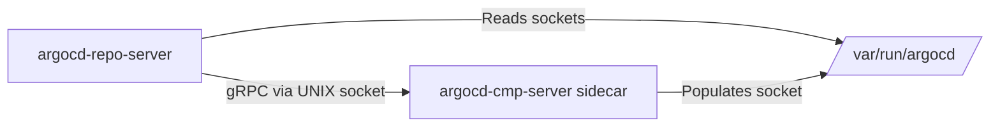

# Config Management Plugins

<details>
<summary>Relevant source files</summary>

The following files were used as context for generating this wiki page:

- [docs/proposals/config-management-plugin-v2.md](https://github.com/argoproj/argo-cd/blob/main/docs/proposals/config-management-plugin-v2.md)
- [docs/operator-manual/config-management-plugins.md](https://github.com/argoproj/argo-cd/blob/main/docs/operator-manual/config-management-plugins.md)
- [docs/proposals/parameterized-config-management-plugins.md](https://github.com/argoproj/argo-cd/blob/main/docs/proposals/parameterized-config-management-plugins.md)
- [reposerver/repository/repository.go](https://github.com/argoproj/argo-cd/blob/main/reposerver/repository/repository.go)
</details>

## Overview

Config Management Plugins (CMPs) extend Argo CD beyond its native tools—Helm, Kustomize, and Jsonnet—by enabling administrators to integrate custom manifest generation tools such as cdk8s, Tanka, jkcfg, QBEC, Dhall, and Pulumi. By running custom toolchains as sidecar containers alongside the `argocd-repo-server`, CMPs eliminate the need to rebuild the core Argo CD image or manage complex custom binaries within the primary server pod, while granting plugin authors full control over their runtime environment and dependencies. 

Sources: [docs/proposals/config-management-plugin-v2.md:18-37](https://github.com/argoproj/argo-cd/blob/main/docs/proposals/config-management-plugin-v2.md#L18-L37)

The architecture relies on a lightweight gRPC API server entrypoint (`argocd-cmp-server`) inside the sidecar that communicates with the main repo-server over UNIX domain sockets on a shared volume, supporting automatic tool discovery, dynamic parameter declarations, and secure repository tarball streaming with strict path isolation. 

Sources: [docs/proposals/config-management-plugin-v2.md:77-84](https://github.com/argoproj/argo-cd/blob/main/docs/proposals/config-management-plugin-v2.md#L77-L84), [docs/proposals/config-management-plugin-v2.md:182-205](https://github.com/argoproj/argo-cd/blob/main/docs/proposals/config-management-plugin-v2.md#L182-L205), [reposerver/repository/repository.go:297-315](https://github.com/argoproj/argo-cd/blob/main/reposerver/repository/repository.go#L297-L315)

## Sidecar Architecture and gRPC Interface

### Overview

Config Management Plugin v2 (CMP v2) introduces a sidecar container model where custom manifest generation tools run in separate containers alongside the main `argocd-repo-server`. Each plugin sidecar uses `argocd-cmp-server` as its entrypoint—a lightweight gRPC server binary copied into the shared volume at startup by an init container (`copyutil`). The repo-server communicates with each plugin via UNIX domain sockets located in a shared directory (`/var/run/argocd` or `/home/argocd/cmp-server/plugins`). 

Sources: [docs/proposals/config-management-plugin-v2.md:76-84](https://github.com/argoproj/argo-cd/blob/main/docs/proposals/config-management-plugin-v2.md#L76-L84), [docs/proposals/config-management-plugin-v2.md:125-143](https://github.com/argoproj/argo-cd/blob/main/docs/proposals/config-management-plugin-v2.md#L125-L143), [docs/operator-manual/config-management-plugins.md:178-193](https://github.com/argoproj/argo-cd/blob/main/docs/operator-manual/config-management-plugins.md#L178-L193)

### UNIX Socket Communication and Registration

The `argocd-repo-server` discovers available plugins by inspecting the shared plugins directory for UNIX socket files. When `ListPlugins` is invoked, the repo-server reads the socket directory, filtering entries by socket file type (`os.ModeSocket`), and strips the `.sock` suffix to derive the plugin name. 

Sources: [docs/proposals/config-management-plugin-v2.md:193-205](https://github.com/argoproj/argo-cd/blob/main/docs/proposals/config-management-plugin-v2.md#L193-L205), [reposerver/repository/repository.go:298-314](https://github.com/argoproj/argo-cd/blob/main/reposerver/repository/repository.go#L298-L314)


Sources: [docs/proposals/config-management-plugin-v2.md:193-205](https://github.com/argoproj/argo-cd/blob/main/docs/proposals/config-management-plugin-v2.md#L193-L205), [reposerver/repository/repository.go:298-314](https://github.com/argoproj/argo-cd/blob/main/reposerver/repository/repository.go#L298-L314)

> [!NOTE]
> Socket files are named after the plugin (e.g., `cdk8s.sock`, `jkcfg.sock`, `pulumi.sock`). The repo-server establishes gRPC connections across these socket paths to invoke remote methods on the sidecar. 

Sources: [docs/proposals/config-management-plugin-v2.md:193-205](https://github.com/argoproj/argo-cd/blob/main/docs/proposals/config-management-plugin-v2.md#L193-L205)

### gRPC Service Execution and Client Flow

When manifest generation or parameter discovery is required for an application managed by a plugin, the repo-server executes `runConfigManagementPluginSidecars`. This function orchestrates discovery, configuration verification, credential attachment, and streaming generation. 

Sources: [reposerver/repository/repository.go:2351-2407](https://github.com/argoproj/argo-cd/blob/main/reposerver/repository/repository.go#L2351-L2407)

```
runConfigManagementPluginSidecars() → discovery.DetectConfigManagementPlugin() → cmpClient.CheckPluginConfiguration() → generateManifestsCMP() → cmpClient.GenerateManifest()
```
Sources: [reposerver/repository/repository.go:2351-2430](https://github.com/argoproj/argo-cd/blob/main/reposerver/repository/repository.go#L2351-L2430)

1. `discovery.DetectConfigManagementPlugin`: Scopes and establishes the gRPC connection over the appropriate UNIX socket. 

Sources: [reposerver/repository/repository.go:2359-2363](https://github.com/argoproj/argo-cd/blob/main/reposerver/repository/repository.go#L2359-L2363)

2. `cmpClient.CheckPluginConfiguration`: Queries the sidecar to verify configuration settings, such as whether git credentials (`ProvideGitCreds`) should be supplied via `ASKPASS`. 

Sources: [reposerver/repository/repository.go:2372-2386](https://github.com/argoproj/argo-cd/blob/main/reposerver/repository/repository.go#L2372-L2386)

3. `generateManifestsCMP`: Initiates a gRPC stream (`GenerateManifest`) to transmit the application source tarball and environment variables to the plugin container. 

Sources: [reposerver/repository/repository.go:2389-2429](https://github.com/argoproj/argo-cd/blob/main/reposerver/repository/repository.go#L2389-L2429)

> [!WARNING]
> If `ProvideGitCreds` is enabled in the plugin specification, the repo-server retrieves credential environment variables using `creds.Environ()` and appends them to the execution environment passed to the sidecar. 

Sources: [reposerver/repository/repository.go:2377-2386](https://github.com/argoproj/argo-cd/blob/main/reposerver/repository/repository.go#L2377-L2386)

## Plugin Discovery and Matching Lifecycle

### Overview

Plugin discovery and auto-selection determine which Config Management Plugin handles an application repository when no explicit plugin name is provided in the `Application` manifest. The `argocd-repo-server` inspects available sidecar plugins and evaluates their discovery specifications against the application source directory. If a plugin matches, Argo CD selects it to generate manifests; otherwise, explicit specification is required. 

Sources: [docs/proposals/config-management-plugin-v2.md:53-61](https://github.com/argoproj/argo-cd/blob/main/docs/proposals/config-management-plugin-v2.md#L53-L61), [docs/operator-manual/config-management-plugins.md:56-60](https://github.com/argoproj/argo-cd/blob/main/docs/operator-manual/config-management-plugins.md#L56-L60)

### Discovery Configuration and Evaluation Rules

Plugins define discovery criteria under the `discover` block in their `ConfigManagementPlugin` manifest. The discovery specification supports three distinct matching mechanisms: `fileName`, `find.glob`, and `find.command`. 

Sources: [docs/operator-manual/config-management-plugins.md:61-70](https://github.com/argoproj/argo-cd/blob/main/docs/operator-manual/config-management-plugins.md#L61-L70)

| Discovery Field | Evaluation Scope | Matching Condition | Sources: Line |
| --- | --- | --- | --- |
| `fileName` | Application source directory | Glob pattern matching (`filepath.Glob`) applied to the source directory files. | [docs/operator-manual/config-management-plugins.md:62-64](https://github.com/argoproj/argo-cd/blob/main/docs/operator-manual/config-management-plugins.md#L62-L64) |
| `find.glob` | Application source directory | Double-star nested directory glob pattern matching. | [docs/operator-manual/config-management-plugins.md:65-67](https://github.com/argoproj/argo-cd/blob/main/docs/operator-manual/config-management-plugins.md#L65-L67) |
| `find.command` | Repository root directory | Command execution; must exit with status code `0` and produce non-empty stdout. | [docs/operator-manual/config-management-plugins.md:68-70](https://github.com/argoproj/argo-cd/blob/main/docs/operator-manual/config-management-plugins.md#L68-L70) |

Sources: [docs/operator-manual/config-management-plugins.md:61-70](https://github.com/argoproj/argo-cd/blob/main/docs/operator-manual/config-management-plugins.md#L61-L70)

> [!WARNING]
> Only one of `fileName`, `find.glob`, or `find.command` should be specified within a `discover` block. If multiple rules are provided, only the first configured rule in that order is evaluated. 

Sources: [docs/operator-manual/config-management-plugins.md:59-60](https://github.com/argoproj/argo-cd/blob/main/docs/operator-manual/config-management-plugins.md#L59-L60)

### Sidecar Selection Workflow

During repository evaluation, the repo-server loops through available sidecar plugins and executes their respective discovery checks. The first plugin that returns a positive evaluation response is selected to render the manifests. 

Sources: [docs/proposals/config-management-plugin-v2.md:209-211](https://github.com/argoproj/argo-cd/blob/main/docs/proposals/config-management-plugin-v2.md#L209-L211)

```
GetAppSourceType() → discovery.AppType() → plugin discovery evaluation → first positive response selected
```
Sources: [docs/proposals/config-management-plugin-v2.md:209-211](https://github.com/argoproj/argo-cd/blob/main/docs/proposals/config-management-plugin-v2.md#L209-L211), [reposerver/repository/repository.go:1958-1980](https://github.com/argoproj/argo-cd/blob/main/reposerver/repository/repository.go#L1958-L1980)

> [!NOTE]
> If the discovery configuration is omitted entirely from a plugin manifest, the plugin will not match any application automatically and can only be invoked by explicitly naming the plugin in the application specification (`spec.source.plugin.name`). 

Sources: [docs/operator-manual/config-management-plugins.md:56-59](https://github.com/argoproj/argo-cd/blob/main/docs/operator-manual/config-management-plugins.md#L56-L59)

## Plugin Configuration and Specification Schema

### Overview

Config Management Plugins are specified using a `ConfigManagementPlugin` manifest located inside the plugin container at `/home/argocd/cmp-server/config/plugin.yaml`. Although it resembles a Kubernetes resource, it is not a custom resource but follows Kubernetes-style spec conventions. 

Sources: [docs/operator-manual/config-management-plugins.md:27-32](https://github.com/argoproj/argo-cd/blob/main/docs/operator-manual/config-management-plugins.md#L27-L32), [docs/operator-manual/config-management-plugins.md:122-125](https://github.com/argoproj/argo-cd/blob/main/docs/operator-manual/config-management-plugins.md#L122-L125), [docs/operator-manual/config-management-plugins.md:141-143](https://github.com/argoproj/argo-cd/blob/main/docs/operator-manual/config-management-plugins.md#L141-L143)

### Spec Options Reference

The top-level `spec` object supports several configuration fields governing command execution, parameter announcements, and security controls. 

Sources: [docs/operator-manual/config-management-plugins.md:36-120](https://github.com/argoproj/argo-cd/blob/main/docs/operator-manual/config-management-plugins.md#L36-L120)

| Field | Type | Default | Purpose | Sources: Line |
| --- | --- | --- | --- | --- |
| `version` | string | `""` | Optional plugin version. If specified, the Application's `spec.source.plugin.name` must be `lugin name>-lugin version>`. | [docs/operator-manual/config-management-plugins.md:36-39](https://github.com/argoproj/argo-cd/blob/main/docs/operator-manual/config-management-plugins.md#L36-L39) |
| `init` | object | `nil` | Command execution definition run at the beginning of each manifest generation in the source directory. | [docs/operator-manual/config-management-plugins.md:40-46](https://github.com/argoproj/argo-cd/blob/main/docs/operator-manual/config-management-plugins.md#L40-L46) |
| `generate` | object | required | Command execution definition run each time manifests are generated in the application source directory. | [docs/operator-manual/config-management-plugins.md:47-55](https://github.com/argoproj/argo-cd/blob/main/docs/operator-manual/config-management-plugins.md#L47-L55) |
| `discover` | object | `nil` | Discovery rules applied to a repository to determine automatic plugin matching. | [docs/operator-manual/config-management-plugins.md:56-70](https://github.com/argoproj/argo-cd/blob/main/docs/operator-manual/config-management-plugins.md#L56-L70) |
| `parameters` | object | `nil` | Static and dynamic parameter announcements describing inputs for the UI and downstream execution. | [docs/operator-manual/config-management-plugins.md:71-111](https://github.com/argoproj/argo-cd/blob/main/docs/operator-manual/config-management-plugins.md#L71-L111) |
| `preserveFileMode` | boolean | `false` | When `true`, receives repository files with original file modes. Dangerous due to executable permissions. | [docs/operator-manual/config-management-plugins.md:112-115](https://github.com/argoproj/argo-cd/blob/main/docs/operator-manual/config-management-plugins.md#L112-L115) |
| `provideGitCreds` | boolean | `false` | When `true`, allows the plugin to retrieve Git credentials from the repo server during manifest generation via `ASKPASS`. | [docs/operator-manual/config-management-plugins.md:116-119](https://github.com/argoproj/argo-cd/blob/main/docs/operator-manual/config-management-plugins.md#L116-L119) |

Sources: [docs/operator-manual/config-management-plugins.md:36-120](https://github.com/argoproj/argo-cd/blob/main/docs/operator-manual/config-management-plugins.md#L36-L120)

### Command Execution Definitions

The `init` and `generate` blocks define executable commands and arguments executed within the application source directory. 

Sources: [docs/operator-manual/config-management-plugins.md:40-55](https://github.com/argoproj/argo-cd/blob/main/docs/operator-manual/config-management-plugins.md#L40-L55), [docs/operator-manual/config-management-plugins.md:126-127](https://github.com/argoproj/argo-cd/blob/main/docs/operator-manual/config-management-plugins.md#L126-L127)

> [!WARNING]
> The `generate` command must print exclusively valid Kubernetes objects in either YAML or JSON format to standard output. A non-zero exit code fails manifest generation, and log messages must be written to standard error (`stderr`) to be safely displayed. 

Sources: [docs/operator-manual/config-management-plugins.md:47-50](https://github.com/argoproj/argo-cd/blob/main/docs/operator-manual/config-management-plugins.md#L47-L50)

### Parameter Declarations and Schema

The `parameters` specification configures static defaults and dynamic commands to inform the Argo CD UI about acceptable application parameters. Static parameters provide default values and collection types, whereas dynamic parameters execute commands in the source directory to output JSON matching the parameter announcement schema. 

Sources: [docs/operator-manual/config-management-plugins.md:71-111](https://github.com/argoproj/argo-cd/blob/main/docs/operator-manual/config-management-plugins.md#L71-L111)

Under the Go type definitions in `package cmp`, parameter announcements utilize `ParameterItemType` (`number`, `boolean`) and `ParameterCollectionType` (`map`, `array`, defaulting to string). 

Sources: [docs/proposals/parameterized-config-management-plugins.md:433-484](https://github.com/argoproj/argo-cd/blob/main/docs/proposals/parameterized-config-management-plugins.md#L433-L484)

> [!NOTE]
> Parameter announcements and their defaults are not automatically passed to the plugin execution environment; only parameters explicitly set in the Application spec are transmitted via `ARGOCD_APP_PARAMETERS` or `PARAM_*` environment variables. 

Sources: [docs/operator-manual/config-management-plugins.md:260-263](https://github.com/argoproj/argo-cd/blob/main/docs/operator-manual/config-management-plugins.md#L260-L263)

## Parameterized Manifest Rendering Flow

### Overview

Config Management Plugins pass parameter values set in an Application's specification to execution hooks via structured JSON payloads and normalized environment variables. When Argo CD generates manifests, user-configured parameters from `spec.source.plugin.parameters` are serialized and exposed to the plugin container. 

Sources: [docs/operator-manual/config-management-plugins.md:240-258](https://github.com/argoproj/argo-cd/blob/main/docs/operator-manual/config-management-plugins.md#L240-L258), [docs/proposals/parameterized-config-management-plugins.md:263-291](https://github.com/argoproj/argo-cd/blob/main/docs/proposals/parameterized-config-management-plugins.md#L263-L291)

### Parameter Passing and Environment Variable Construction

The primary mechanism for parameter transport is the `ARGOCD_APP_PARAMETERS` environment variable, which contains a JSON list of parameter entries. Additionally, individual parameters are flattened into environment variables using specific naming rules. 

Sources: [docs/operator-manual/config-management-plugins.md:254-280](https://github.com/argoproj/argo-cd/blob/main/docs/operator-manual/config-management-plugins.md#L254-L280), [docs/proposals/parameterized-config-management-plugins.md:263-321](https://github.com/argoproj/argo-cd/blob/main/docs/proposals/parameterized-config-management-plugins.md#L263-L321)

The variable name construction follows these exact formatting conventions:
- **String parameters**: Formatted as `PARAM_{escaped(name)}`. 

Sources: [docs/proposals/parameterized-config-management-plugins.md:300-302](https://github.com/argoproj/argo-cd/blob/main/docs/proposals/parameterized-config-management-plugins.md#L300-L302)

- **Array parameters**: Formatted as `PARAM_{escaped(name_{index})}` where indexing begins at `0`. 

Sources: [docs/proposals/parameterized-config-management-plugins.md:300-303](https://github.com/argoproj/argo-cd/blob/main/docs/proposals/parameterized-config-management-plugins.md#L300-L303)

- **Map parameters**: Formatted as `PARAM_{escaped(name_key)}`. 

Sources: [docs/proposals/parameterized-config-management-plugins.md:300-304](https://github.com/argoproj/argo-cd/blob/main/docs/proposals/parameterized-config-management-plugins.md#L300-L304)

The `escaped` transformation converts parameter names to uppercase and replaces any character matching the regular expression `[^A-Z0-9_]` with an underscore (`_`). 

Sources: [docs/proposals/parameterized-config-management-plugins.md:309-312](https://github.com/argoproj/argo-cd/blob/main/docs/proposals/parameterized-config-management-plugins.md#L309-L312)

> [!NOTE]
> If an escaped environment variable name collides with a build environment variable, the build environment variable takes precedence. If multiple parameters produce identical environment variable names, the parameter appearing later in the list wins. 

Sources: [docs/proposals/parameterized-config-management-plugins.md:305-308](https://github.com/argoproj/argo-cd/blob/main/docs/proposals/parameterized-config-management-plugins.md#L305-L308)

### Parameter Structure and Go Types

Internally, parameter structures are processed using explicit Go data types defined in `package cmp` to represent individual parameter attributes and collections. 

Sources: [docs/proposals/parameterized-config-management-plugins.md:322-338](https://github.com/argoproj/argo-cd/blob/main/docs/proposals/parameterized-config-management-plugins.md#L322-L338)

| Field Name | Type | JSON Tag | Description | Sources: Line |
| :--- | :--- | :--- | :--- | :--- |
| `Name` | `string` | `name,omitempty` | The required name identifying the parameter. | [docs/proposals/parameterized-config-management-plugins.md:328-330](https://github.com/argoproj/argo-cd/blob/main/docs/proposals/parameterized-config-management-plugins.md#L328-L330) |
| `String` | `string` | `string,omitempty` | Holds a single string value when collectionType is string. | [docs/proposals/parameterized-config-management-plugins.md:331-331](https://github.com/argoproj/argo-cd/blob/main/docs/proposals/parameterized-config-management-plugins.md#L331-L331) |
| `Map` | `map[string]string` | `map,omitempty` | Holds key-value pairs when collectionType is map. | [docs/proposals/parameterized-config-management-plugins.md:332-332](https://github.com/argoproj/argo-cd/blob/main/docs/proposals/parameterized-config-management-plugins.md#L332-L332) |
| `Array` | `[]string` | `array,omitempty` | Holds a list of strings when collectionType is array. | [docs/proposals/parameterized-config-management-plugins.md:333-333](https://github.com/argoproj/argo-cd/blob/main/docs/proposals/parameterized-config-management-plugins.md#L333-L333) |

Sources: [docs/proposals/parameterized-config-management-plugins.md:322-338](https://github.com/argoproj/argo-cd/blob/main/docs/proposals/parameterized-config-management-plugins.md#L322-L338)

## Repository Streaming and Security Sandboxing

### Overview

To prevent malicious repositories from exploiting the repo server or plugin execution context, Argo CD employs rigorous repository streaming mechanisms and security sandboxing features. When generating manifests, files from cloned repositories or streamed tarballs undergo strict boundary enforcement, path traversal prevention, and symlink validation before reaching any Config Management Plugin. 

Sources: [reposerver/repository/repository.go:753-766](https://github.com/argoproj/argo-cd/blob/main/reposerver/repository/repository.go#L753-L766)

### Tarball Streaming and Exclusions

Manifest generation requests send source files from the repo server to the sidecar via gRPC streams managed by `generateManifestsCMP()`. To optimize performance and reduce bandwidth overhead during manifest generation, specific files and folders can be filtered out from the transmitted tarball using Go's `filepath.Match` syntax. 

Sources: [docs/operator-manual/config-management-plugins.md:359-363](https://github.com/argoproj/argo-cd/blob/main/docs/operator-manual/config-management-plugins.md#L359-L363), [reposerver/repository/repository.go:2412-2429](https://github.com/argoproj/argo-cd/blob/main/reposerver/repository/repository.go#L2412-L2429)

Exclusions can be configured using three interchangeable methods:
- **CLI flag**: `--plugin-tar-exclude` repeated on the repo server. 

Sources: [docs/operator-manual/config-management-plugins.md:365-366](https://github.com/argoproj/argo-cd/blob/main/docs/operator-manual/config-management-plugins.md#L365-L366)

- **ConfigMap**: `reposerver.plugin.tar.exclusions` in `argocd-cmd-params-cm` separated by semicolons. 

Sources: [docs/operator-manual/config-management-plugins.md:367-368](https://github.com/argoproj/argo-cd/blob/main/docs/operator-manual/config-management-plugins.md#L367-L368)

- **Environment variable**: `ARGOCD_REPO_SERVER_PLUGIN_TAR_EXCLUSIONS` set on the repo server, separating glob patterns with semicolons. 

Sources: [docs/operator-manual/config-management-plugins.md:369-370](https://github.com/argoproj/argo-cd/blob/main/docs/operator-manual/config-management-plugins.md#L369-L370)

Sources: [docs/operator-manual/config-management-plugins.md:359-373](https://github.com/argoproj/argo-cd/blob/main/docs/operator-manual/config-management-plugins.md#L359-L373)

### Symlink and Path Bounds Security

To mitigate directory traversal and out-of-bounds symlink attacks, the repo server inspects file structures using `checkOutOfBoundsSymlinks()` and `verifyGlobMatchesWithinRoot()`. These functions canonicalize paths via `filepath.EvalSymlinks` and verify that every referenced file or symlink target resides strictly within the approved root directory boundary. 

Sources: [reposerver/repository/repository.go:627-643](https://github.com/argoproj/argo-cd/blob/main/reposerver/repository/repository.go#L627-L643), [reposerver/repository/repository.go:1677-1702](https://github.com/argoproj/argo-cd/blob/main/reposerver/repository/repository.go#L1677-L1702)

> [!CAUTION]
> Setting `preserveFileMode: true` in the plugin specification allows the plugin to receive source files with their original executable file permissions intact. Enable this setting only when you fully trust the plugin authors, as executable files within a repository present a significant privilege escalation risk. 

Sources: [docs/operator-manual/config-management-plugins.md:113-115](https://github.com/argoproj/argo-cd/blob/main/docs/operator-manual/config-management-plugins.md#L113-L115), [docs/operator-manual/config-management-plugins.md:498-503](https://github.com/argoproj/argo-cd/blob/main/docs/operator-manual/config-management-plugins.md#L498-L503)

Sources: [docs/operator-manual/config-management-plugins.md:113-115](https://github.com/argoproj/argo-cd/blob/main/docs/operator-manual/config-management-plugins.md#L113-L115), [docs/operator-manual/config-management-plugins.md:498-503](https://github.com/argoproj/argo-cd/blob/main/docs/operator-manual/config-management-plugins.md#L498-L503)

### Execution Isolation and Credential Sharing

Sidecar architecture isolates plugin tooling into a container separate from the main repo-server image. Additional sandboxing can be enforced by assigning unique UIDs to cloned git repositories and running tool execution commands under those UIDs, preventing out-of-tree file access. 

Sources: [docs/proposals/config-management-plugin-v2.md:84-91](https://github.com/argoproj/argo-cd/blob/main/docs/proposals/config-management-plugin-v2.md#L84-L91), [docs/proposals/config-management-plugin-v2.md:221-238](https://github.com/argoproj/argo-cd/blob/main/docs/proposals/config-management-plugin-v2.md#L221-L238)

When external repositories or credentials are required during manifest generation, `provideGitCreds: true` permits the plugin to retrieve git credentials from the repo server. This exchange uses git's `ASKPASS` method over a dedicated UNIX socket shared between the containers, keeping credentials protected from proactive exposure. 

Sources: [docs/operator-manual/config-management-plugins.md:117-120](https://github.com/argoproj/argo-cd/blob/main/docs/operator-manual/config-management-plugins.md#L117-L120), [docs/operator-manual/config-management-plugins.md:519-528](https://github.com/argoproj/argo-cd/blob/main/docs/operator-manual/config-management-plugins.md#L519-L528)

Sources: [docs/proposals/config-management-plugin-v2.md:84-91](https://github.com/argoproj/argo-cd/blob/main/docs/proposals/config-management-plugin-v2.md#L84-L91), [docs/proposals/config-management-plugin-v2.md:221-238](https://github.com/argoproj/argo-cd/blob/main/docs/proposals/config-management-plugin-v2.md#L221-L238), [docs/operator-manual/config-management-plugins.md:117-120](https://github.com/argoproj/argo-cd/blob/main/docs/operator-manual/config-management-plugins.md#L117-L120), [docs/operator-manual/config-management-plugins.md:519-528](https://github.com/argoproj/argo-cd/blob/main/docs/operator-manual/config-management-plugins.md#L519-L528)

## Related

- [[Repo Server Architecture]]

