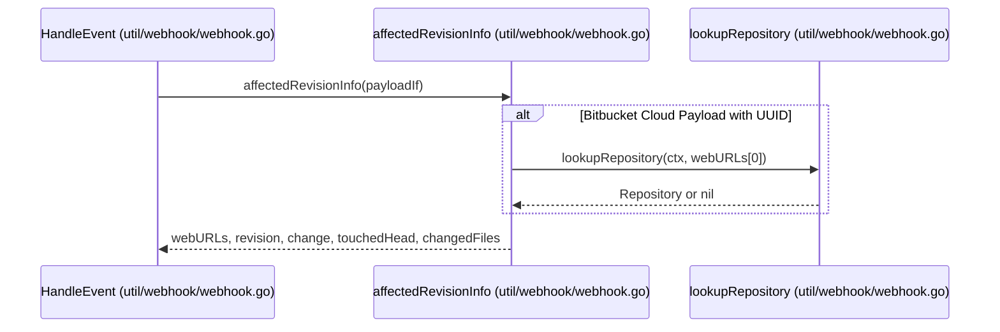
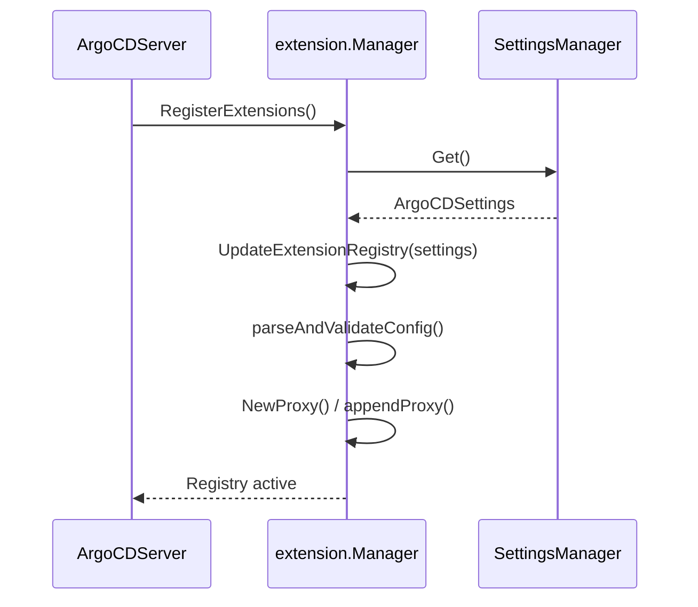

# Extensions and Webhooks

<details>
<summary>Relevant source files</summary>

The following files were used as context for generating this wiki page:

- [util/webhook/webhook.go](https://github.com/argoproj/argo-cd/blob/main/util/webhook/webhook.go)
- [docs/operator-manual/webhook.md](https://github.com/argoproj/argo-cd/blob/main/docs/operator-manual/webhook.md)
- [docs/developer-guide/extensions/proxy-extensions.md](https://github.com/argoproj/argo-cd/blob/main/docs/developer-guide/extensions/proxy-extensions.md)
- [docs/proposals/proxy-extensions.md](https://github.com/argoproj/argo-cd/blob/main/docs/proposals/proxy-extensions.md)
- [server/extension/extension.go](https://github.com/argoproj/argo-cd/blob/main/server/extension/extension.go)
- [server/server.go](https://github.com/argoproj/argo-cd/blob/main/server/server.go)
- [docs/proposals/002-ui-extensions.md](https://github.com/argoproj/argo-cd/blob/main/docs/proposals/002-ui-extensions.md)
- [docs/user-guide/plugins.md](https://github.com/argoproj/argo-cd/blob/main/docs/user-guide/plugins.md)
- [docs/operator-manual/security.md](https://github.com/argoproj/argo-cd/blob/main/docs/operator-manual/security.md)
</details>

## Overview

Argo CD provides robust mechanisms for extending system functionality and integrating with external systems through webhook ingestion and proxy extension architectures. These features solve the challenges of bridging the gap between static core deployments and dynamic multi-cluster or multi-tenant workflows, enabling automated repository refreshes from source control managers and custom API proxying for user interface enhancements. Key design decisions emphasize secure reverse-proxy routing, strict RBAC authorization enforcement, and isolated extension lifecycles. By coordinating closely with core API server routing and settings management, extensions and webhooks allow administrators to safely expand Argo CD's capabilities while maintaining strict tenant isolation and security boundaries.

Sources: [docs/operator-manual/webhook.md:5-14](https://github.com/argoproj/argo-cd/blob/main/docs/operator-manual/webhook.md#L5-L14), [docs/developer-guide/extensions/proxy-extensions.md:11-17](https://github.com/argoproj/argo-cd/blob/main/docs/developer-guide/extensions/proxy-extensions.md#L11-L17), [docs/proposals/proxy-extensions.md:43-48](https://github.com/argoproj/argo-cd/blob/main/docs/proposals/proxy-extensions.md#L43-L48), [server/extension/extension.go:392-427](https://github.com/argoproj/argo-cd/blob/main/server/extension/extension.go#L392-L427), [server/server.go:1240-1273](https://github.com/argoproj/argo-cd/blob/main/server/server.go#L1240-L1273)

## Git Provider Webhook Handling

### Git Provider Webhook Handling

Argo CD ingests source control management (SCM) webhook events through the HTTP handler implemented in `util/webhook/webhook.go`. The endpoint validates payload size using `http.MaxBytesReader` configured with `maxWebhookPayloadSizeB` and dispatches incoming requests to registered extractors.



Sources: [util/webhook/webhook.go:404-418](https://github.com/argoproj/argo-cd/blob/main/util/webhook/webhook.go#L404-L418), [util/webhook/webhook.go:312-316](https://github.com/argoproj/argo-cd/blob/main/util/webhook/webhook.go#L312-L316), [util/webhook/webhook.go:634-648](https://github.com/argoproj/argo-cd/blob/main/util/webhook/webhook.go#L634-L648)

### Event Processing Call Chain (`HandleEvent` → `affectedRevisionInfo` → `lookupRepository`)

Incoming webhook events flow through a precise execution sequence to match, inspect repositories, and refresh target applications:

1. `HandleEvent(payload any)` increments in-flight metrics, verifies registry events, and invokes `a.affectedRevisionInfo(payload)` to parse commit push payloads.
Sources: [util/webhook/webhook.go:403-418](https://github.com/argoproj/argo-cd/blob/main/util/webhook/webhook.go#L403-L418)

2. `affectedRevisionInfo(payloadIf any)` switches over known SCM payload types. When processing `bitbucket.RepoPushPayload` authenticated via `WebhookBitbucketUUID`, it triggers `a.lookupRepository(ctx, webURLs[0])` to find the registered Argo CD repository credentials for API callbacks.
Sources: [util/webhook/webhook.go:242-316](https://github.com/argoproj/argo-cd/blob/main/util/webhook/webhook.go#L242-L316)

3. `lookupRepository(ctx context.Context, repoURL string)` queries repository secrets via `a.db.ListRepositories(ctx)` and iterates over items to locate a matching repo URL using `git.SameURL(repo.Repo, repoURL)`.
Sources: [util/webhook/webhook.go:634-647](https://github.com/argoproj/argo-cd/blob/main/util/webhook/webhook.go#L634-L647)

> [!NOTE]
> Bitbucket Cloud and Bitbucket Server payloads do not include a direct list of changed files. For Bitbucket Cloud, Argo CD addresses this by making an authenticated diffstat API callback (`fetchDiffStatFromBitbucket`) using repository OAuth tokens or no-auth credentials.

Sources: [util/webhook/webhook.go:306-347](https://github.com/argoproj/argo-cd/blob/main/docs/operator-manual/webhook.md#L123-L134)

### Supported Webhook Parsers and Options

The handler initializes webhook parsers and client secrets for multiple SCM providers during startup in `NewHandler`.

| SCM Provider | Underlying Library / Parser | Initialization Option / Secret Key |
|---|---|---|
| GitHub | `github.New` | `set.GetWebhookGitHubSecret()` / `webhook.github.secret` |
| GitLab | `gitlab.New` | `set.GetWebhookGitLabSecret()` / `webhook.gitlab.secret` |
| Bitbucket Cloud | `bitbucket.New` | `set.GetWebhookBitbucketUUID()` / `webhook.bitbucket.uuid` |
| Bitbucket Server | `bitbucketserver.New` | `set.GetWebhookBitbucketServerSecret()` / `webhook.bitbucketserver.secret` |
| Gogs | `gogs.New` | `set.GetWebhookGogsSecret()` / `webhook.gogs.secret` |
| Azure DevOps | `azuredevops.New` | `set.GetWebhookAzureDevOpsUsername()`, `set.GetWebhookAzureDevOpsPassword()` |

Sources: [util/webhook/webhook.go:109-133](https://github.com/argoproj/argo-cd/blob/main/util/webhook/webhook.go#L109-L133), [docs/operator-manual/webhook.md:57-65](https://github.com/argoproj/argo-cd/blob/main/docs/operator-manual/webhook.md#L57-L65)

> [!WARNING]
> Gogs parser checks must be evaluated before GitHub parsers because Gogs requests carry both Gogs headers and incompatible GitHub headers.

Sources: [util/webhook/webhook.go:141-143](https://github.com/argoproj/argo-cd/blob/main/util/webhook/webhook.go#L141-L143)

### Design Trade-Offs in Webhook Invalidation

| Design Choice | Benefit | Cost |
|---|---|---|
| Asynchronous worker pool (`payloadQueueSize = 50000`) | Protects API server from burst traffic drops or HTTP timeouts | Requires bounded channel drops (`StatusServiceUnavailable`) under heavy load |
| Immediate cache manifest shifting (`storePreviouslyCachedManifests`) | Optimizes sync times by migrating cached revision entries directly | Relies on valid commit SHAs (`shaBefore`, `shaAfter`) being present in push payloads |
| Jitter application on refresh queue (`webhookRefreshJitter`) | Prevents thundering herd problems across application controllers | Introduces minor randomized delay before reconciliation triggers |

Sources: [util/webhook/webhook.go:59-60](https://github.com/argoproj/argo-cd/blob/main/util/webhook/webhook.go#L59-L60), [util/webhook/webhook.go:171-172](https://github.com/argoproj/argo-cd/blob/main/util/webhook/webhook.go#L171-L172), [util/webhook/webhook.go:519-526](https://github.com/argoproj/argo-cd/blob/main/util/webhook/webhook.go#L519-L526), [util/webhook/webhook.go:586-631](https://github.com/argoproj/argo-cd/blob/main/util/webhook/webhook.go#L586-L631)

## Proxy Extension Server Architecture

### Overview

The Argo CD API server implements a reverse proxy mechanism that routes incoming extension requests from the user interface to backend API extension services. When a request hits the `/extensions` prefix, the API server authenticates the user, validates mandatory request headers, enforces RBAC rules against application and extension resources, sanitizes sensitive headers, and forwards the payload to the configured backend service.
Sources: [server/extension/extension.go:31-32](https://github.com/argoproj/argo-cd/blob/main/server/extension/extension.go#L31-L32), [server/extension/extension.go:759-819](https://github.com/argoproj/argo-cd/blob/main/server/extension/extension.go#L759-L819), [docs/developer-guide/extensions/proxy-extensions.md:14-17](https://github.com/argoproj/argo-cd/blob/main/docs/developer-guide/extensions/proxy-extensions.md#L14-L17)

### Call-Chain Execution Walkthrough

When an incoming HTTP request targets a proxy extension, `CallExtension()` executes a rigorous pipeline before proxying traffic:

1. `CallExtension()` extracts URL segments to isolate the extension name from `r.URL.Path`.
Sources: [server/extension/extension.go:761-766](https://github.com/argoproj/argo-cd/blob/main/server/extension/extension.go#L761-L766)

2. `ValidateHeaders(r)` inspects the request headers, extracting and validating `Argocd-Application-Name` (parsed via `getAppName()` into namespace and application name components) and `Argocd-Project-Name` against formatting rules.
Sources: [server/extension/extension.go:109-137](https://github.com/argoproj/argo-cd/blob/main/server/extension/extension.go#L109-L137), [server/extension/extension.go:773-777](https://github.com/argoproj/argo-cd/blob/main/server/extension/extension.go#L773-L777)

3. `m.authorize(r.Context(), reqResources, extName)` enforces RBAC policies (`rbac.ResourceApplications` action `rbac.ActionGet` and `rbac.ResourceExtensions` action `rbac.ActionInvoke`), loads the Application resource, verifies project name matching, and checks that the AppProject permits access to the target destination cluster.
Sources: [server/extension/extension.go:680-728](https://github.com/argoproj/argo-cd/blob/main/server/extension/extension.go#L680-L728), [server/extension/extension.go:778-783](https://github.com/argoproj/argo-cd/blob/main/server/extension/extension.go#L778-L783)

4. `m.ProxyRegistry(extName)` and `findProxy(proxyRegistry, extName, app.Spec.Destination)` resolve the appropriate `*httputil.ReverseProxy` instance from the in-memory registry, falling back from single-backend matching to multi-cluster destination matching (`proxyKey`).
Sources: [server/extension/extension.go:731-748](https://github.com/argoproj/argo-cd/blob/main/server/extension/extension.go#L731-L748), [server/extension/extension.go:785-796](https://github.com/argoproj/argo-cd/blob/main/server/extension/extension.go#L785-L796)

5. `prepareRequest(...)` strips the extension prefix from `r.URL.Path`, deletes sensitive headers (`Authorization`, `Cookie`), injects control plane context (`Argocd-Namespace`, `Argocd-Target-Cluster-Name`, `Argocd-Target-Cluster-URL`), and appends user identity headers (`Argocd-Username`, `Argocd-User-Id`, `Argocd-User-Groups`).
Sources: [server/extension/extension.go:836-854](https://github.com/argoproj/argo-cd/blob/main/server/extension/extension.go#L836-L854)

6. `httpsnoop.CaptureMetrics(proxy, w, r)` executes the reverse proxy roundtrip, capturing response codes and durations for asynchronous metric registration.
Sources: [server/extension/extension.go:815-817](https://github.com/argoproj/argo-cd/blob/main/server/extension/extension.go#L815-L817)

### HTTP Header Validation Constants

The proxy validation layer relies on specific mandatory and control headers passed during extension invocation.

| Constant Name | Header Name | Description / Format |
|---|---|---|
| `HeaderArgoCDApplicationName` | `Argocd-Application-Name` | Mandatory target application identifier formatted as `"<namespace>:<app-name>"`. |
| `HeaderArgoCDProjectName` | `Argocd-Project-Name` | Mandatory Argo CD project name associated with the request. |
| `HeaderArgoCDNamespace` | `Argocd-Namespace` | Injected control plane namespace passed to the backend service. |
| `HeaderArgoCDTargetClusterURL` | `Argocd-Target-Cluster-URL` | Populated with `app.Spec.Destination.Server` by the proxy handler. |
| `HeaderArgoCDTargetClusterName` | `Argocd-Target-Cluster-Name` | Populated with `app.Spec.Destination.Name` by the proxy handler. |
| `HeaderArgoCDUsername` | `Argocd-Username` | Populated with the authenticated username logged in Argo CD. |
| `HeaderArgoCDUserId` | `Argocd-User-Id` | Populated with the internal user identifier (`sub` claim). |
| `HeaderArgoCDGroups` | `Argocd-User-Groups` | Populated with configured RBAC user groups/scopes. |

Sources: [server/extension/extension.go:38-88](https://github.com/argoproj/argo-cd/blob/main/server/extension/extension.go#L38-L88)

> [!WARNING]
> Incoming requests to `/extensions/*` must include a valid authentication `Cookie` (`argocd.token`) so the API server can resolve user session claims before executing RBAC checks.
Sources: [docs/developer-guide/extensions/proxy-extensions.md:255-266](https://github.com/argoproj/argo-cd/blob/main/docs/developer-guide/extensions/proxy-extensions.md#L255-L266), [server/extension/extension.go:685-690](https://github.com/argoproj/argo-cd/blob/main/server/extension/extension.go#L685-L690)

### Design Trade-Offs in Proxy Architecture

| Design Choice | Benefit | Cost |
|---|---|---|
| In-memory `ExtensionRegistry` and `ProxyRegistry` maps | O(1) direct proxy lookup without database roundtrips on hot request paths | Requires registry rebuilding and synchronization whenever Argo CD configuration maps update |
| Request sanitization (`req.Header.Del("Authorization")`, `Cookie`) | Prevents sensitive user credentials and session tokens from leaking to external backend services | Forces extensions requiring authentication to rely on explicitly configured custom header secrets |
| Wrapping `net/http/Transport` with custom `ProxyConfig` timeouts | Granular control over connection dial timeouts, keep-alives, and idle pools per extension | Potential connection starvation or goroutine accumulation if backend services exhibit high latency |

Sources: [server/extension/extension.go:394-400](https://github.com/argoproj/argo-cd/blob/main/server/extension/extension.go#L394-L400), [server/extension/extension.go:536-537](https://github.com/argoproj/argo-cd/blob/main/server/extension/extension.go#L536-L537), [server/extension/extension.go:548-560](https://github.com/argoproj/argo-cd/blob/main/server/extension/extension.go#L548-L560)

## Extension Registration and Server Lifecycle

### Overview

The Argo CD API server manages the lifecycle of extensions through dynamic configuration parsing, background setting watchers, and runtime registry updates. When the server boots or configuration updates occur via Kubernetes ConfigMaps, extension configurations are validated and translated into active reverse proxies.
Sources: [server/server.go:863-872](https://github.com/argoproj/argo-cd/blob/main/server/server.go#L863-L872), [server/extension/extension.go:595-622](https://github.com/argoproj/argo-cd/blob/main/server/extension/extension.go#L595-L622)

### Server Initialization and Extension Registration

Extension initialization is tied directly to the API server routing lifecycle. When `EnableProxyExtension` is active in server options, `registerExtensions()` binds the extension handler onto the primary HTTP multiplexer.
Sources: [server/server.go:1241-1246](https://github.com/argoproj/argo-cd/blob/main/server/server.go#L1241-1246)

The call chain during initialization flows as:
`NewServer()` → `NewManager()` → `registerExtensions()` → `Manager.RegisterExtensions()` → `Manager.UpdateExtensionRegistry()`
Sources: [server/server.go:390](https://github.com/argoproj/argo-cd/blob/main/server/server.go#L390), [server/server.go:1323](https://github.com/argoproj/argo-cd/blob/main/server/server.go#L1323), [server/extension/extension.go:579-593](https://github.com/argoproj/argo-cd/blob/main/server/extension/extension.go#L579-L593)


Sources: [server/extension/extension.go:579-622](https://github.com/argoproj/argo-cd/blob/main/server/extension/extension.go#L579-L622)

> [!NOTE]
> If extension registration fails during startup, the API server logs an error and continues without adding extension routes, rather than failing a hard startup check.
Sources: [server/server.go:1242-1245](https://github.com/argoproj/argo-cd/blob/main/server/server.go#L1242-L1245)

### Dynamic Registry Updates and Watchers

The API server runs a background watcher loop (`watchSettings()`) that subscribes to updates from the settings manager. When modifications occur on extension configurations (`ExtensionConfig`), the server dynamically re-evaluates the registry without requiring a full process restart.
Sources: [server/server.go:802-805](https://github.com/argoproj/argo-cd/blob/main/server/server.go#L802-805), [server/server.go:863-872](https://github.com/argoproj/argo-cd/blob/main/server/server.go#L863-L872)

> [!IMPORTANT]
> While changes to extension configuration maps trigger hot-reloads of proxy registries via `server.extensionManager.UpdateExtensionRegistry()`, modifications to core OIDC configurations, server URLs, or webhook secrets still force a graceful server restart by injecting a `GracefulRestartSignal`.
Sources: [server/server.go:827-862](https://github.com/argoproj/argo-cd/blob/main/server/server.go#L827-L862), [server/server.go:863-872](https://github.com/argoproj/argo-cd/blob/main/server/server.go#L863-L872), [server/server.go:887-889](https://github.com/argoproj/argo-cd/blob/main/server/server.go#L887-L889)

### Configuration Parsing and Validation Rules

Before proxies are populated into memory, raw configuration structures undergo parsing and secret substitution via `parseAndValidateConfig()`. Secret references prefixed with a dollar sign (`$`) are automatically resolved against Argo CD secret keys.
Sources: [server/extension/extension.go:429-474](https://github.com/argoproj/argo-cd/blob/main/server/extension/extension.go#L429-474)

| Validation Rule | Constraint | Error Condition |
|---|---|---|
| Extension Name Presence | `ext.Name != ""` | `extensions.name must be configured` |
| Name Character Safety | Matches `^[A-Za-z0-9-_]+$` | `invalid extensions.name: only alphanumeric characters, hyphens, and underscores are allowed` |
| Duplicate Prevention | Unique across configuration map | `duplicated extension found in the configs for ...` |
| Backend Service Count | `len(ext.Backend.Services) > 0` | `no backend service configured for extension ...` |
| Service URL Presence | `svc.URL != ""` | `extensions.backend.services.url must be configured` |
| Multi-Service Cluster Binding | Required when `svcTotal > 1` | `extensions.backend.services.cluster must be configured when defining more than one service per extension` |

Sources: [server/extension/extension.go:476-518](https://github.com/argoproj/argo-cd/blob/main/server/extension/extension.go#L476-L518)

## UI Extensions and Frontend Integration

### Overview

To provide custom resource-specific visualizations, health assessments, and interactive mutations without baking native support into Argo CD core, the frontend integration proposal defines a dynamic client-side loading mechanism. Custom extensions package their frontend views as React components that are fetched and mounted at runtime by the Argo CD API server.
Sources: [docs/proposals/002-ui-extensions.md:25-30](https://github.com/argoproj/argoproj/blob/main/docs/proposals/002-ui-extensions.md#L25-L30), [docs/proposals/002-ui-extensions.md:129-132](https://github.com/argoproj/argoproj/blob/main/docs/proposals/002-ui-extensions.md#L129-L132)

### Component Interface and Data Flow

Extensions conform to a standard `Extension` interface where the `ResourceTab` property defines a React component accepting the target resource object as a property. 
Sources: [docs/proposals/002-ui-extensions.md:145-148](https://github.com/argoproj/argoproj/blob/main/docs/proposals/002-ui-extensions.md#L145-L148)

```typescript
interface Extension {
    ResourceTab: React.Component<{resource: any}>;
}
```
Sources: [docs/proposals/002-ui-extensions.md:145-148](https://github.com/argoproj/argoproj/blob/main/docs/proposals/002-ui-extensions.md#L145-L148)

To render visualizations and hierarchy, the component receives both the individual resource object and the complete Application Resource Tree. Providing the entire resource tree allows extensions to receive shallow live updates for free and display hierarchical child objects like ReplicaSets and Pods under a custom rollout.
Sources: [docs/proposals/002-ui-extensions.md:139-143](https://github.com/argoproj/argoproj/blob/main/docs/proposals/002-ui-extensions.md#L139-L143)

### Dynamic Loading Architecture

The Argo CD UI dynamically imports extension React components from the API server. The build process declares the generic Extension component as a Webpack external, referencing it via a script tag in the `index.html` template pointing to `/api/v1/extensions`. The API server reverse-proxies requests to the relevant third-party Extension API based on the resource kind being displayed.
Sources: [docs/proposals/002-ui-extensions.md:150-151](https://github.com/argoproj/argoproj/blob/main/docs/proposals/002-ui-extensions.md#L150-L151)

> [!WARNING]
> Third-party UI extensions must conform to strict bundling standards — specifically, extensions must never bundle their own copy of React to prevent runtime context collisions with the host Argo CD application.
Sources: [docs/proposals/002-ui-extensions.md:151-151](https://github.com/argoproj/argoproj/blob/main/docs/proposals/002-ui-extensions.md#L151-L151)

## Security Enforcement and RBAC Rules

### Overview

The extension subsystem enforces strict access control, payload sanitization, and configuration security before proxying any request to a backend service. When an incoming request reaches the extension handler, authorization rules, header validations, and payload scrubbing mechanisms execute sequentially to protect cluster credentials and enforce multitenancy isolation.
Sources: [server/extension/extension.go:521-544](https://github.com/argoproj/argo-cd/blob/main/server/extension/extension.go#L521-L544), [server/extension/extension.go:671-728](https://github.com/argoproj/argo-cd/blob/main/server/extension/extension.go#L671-728)

### Authorization and RBAC Enforcement

Incoming requests are authorized through `authorize()` which verifies user permissions across application access, extension invocation rights, and cluster destination constraints. The authorization flow executes the following sequence: `m.rbac.EnforceErr()` (applications) → `m.rbac.EnforceErr()` (extensions) → `m.application.Get()` → `m.project.Get()` → `argo.GetDestinationCluster()` → `proj.IsDestinationPermitted()`.
Sources: [server/extension/extension.go:680-726](https://github.com/argoproj/argo-cd/blob/main/server/extension/extension.go#L680-L726)

| Validation Step | Target Resource | Required Action | Enforced Check |
|---|---|---|---|
| Application Read Access | `applications` | `get` | Subject has read permission on `security.RBACName(ns, proj, ns, app)` |
| Extension Invocation | `extensions` | `invoke` | Subject has invocation permission on the specific `extName` |
| Project Destination Binding | Destination Cluster | `access` | Project permits deployment to the cluster and target namespace |

Sources: [server/extension/extension.go:684-725](https://github.com/argoproj/argo-cd/blob/main/server/extension/extension.go#L684-L725)

> [!CAUTION]
> If a project is not explicitly allowed to deploy to the target cluster destination configured in the Application spec, authorization fails immediately and blocks the extension proxy call.
Sources: [server/extension/extension.go:717-725](https://github.com/argoproj/argo-cd/blob/main/server/extension/extension.go#L717-725)

### Secret Masking and Payload Security

To prevent sensitive bearer tokens and session credentials from leaking to third-party extension backends, the reverse proxy constructor `NewProxy()` strips authentication tokens from incoming requests.
Sources: [server/extension/extension.go:521-544](https://github.com/argoproj/argo-cd/blob/main/server/extension/extension.go#L521-L544)

```go
proxy := &httputil.ReverseProxy{
    Transport: newTransport(config),
    Director: func(req *http.Request) {
        req.Host = url.Host
        req.URL.Scheme = url.Scheme
        req.URL.Host = url.Host
        req.Header.Set("Host", url.Host)
        req.Header.Del("Authorization")
        req.Header.Del("Cookie")
        for _, header := range headers {
            req.Header.Set(header.Name, header.Value)
        }
    },
}
```
Sources: [server/extension/extension.go:529-541](https://github.com/argoproj/argo-cd/blob/main/server/extension/extension.go#L529-L541)

Configuration values specified with a dollar sign prefix (e.g., `value: '$some.argocd.secret.key'`) are dynamically substituted using `settings.ReplaceMapSecrets()` against secrets stored in `argocd-secret` before configuration validation completes.
Sources: [server/extension/extension.go:193-200](https://github.com/argoproj/argo-cd/blob/main/server/extension/extension.go#L193-200), [server/extension/extension.go:442-442](https://github.com/argoproj/argo-cd/blob/main/server/extension/extension.go#L442-L442)

## Related

- [[Server Runtime]]
- [[ApplicationSet Webhooks]]

