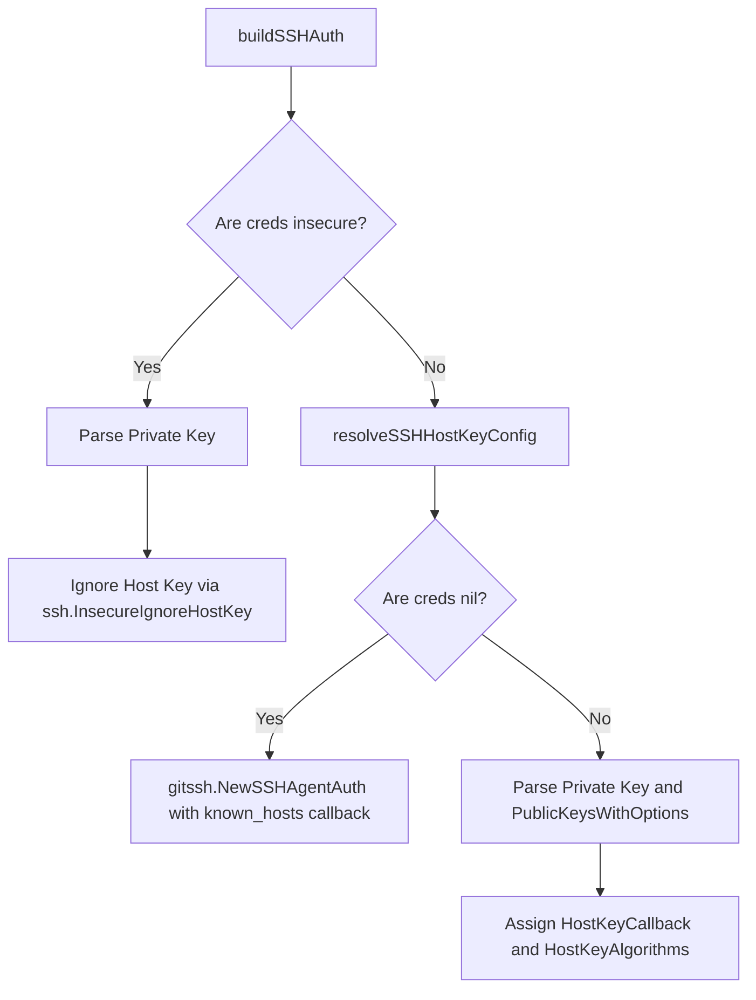
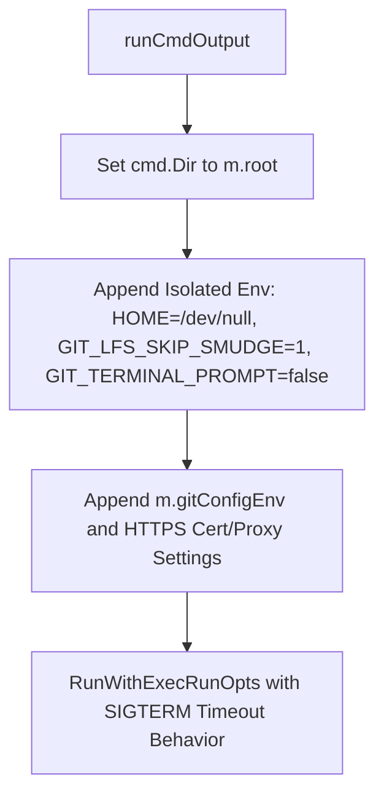

# Git Client Operations

Relevant source files

The following files were used as context for generating this wiki page:

- [util/git/client.go](https://github.com/argoproj/argo-cd/blob/main/util/git/client.go)
- [docs/user-guide/private-repositories.md](https://github.com/argoproj/argo-cd/blob/main/docs/user-guide/private-repositories.md)
- [docs/operator-manual/security.md](https://github.com/argoproj/argo-cd/blob/main/docs/operator-manual/security.md)
- [docs/snyk/v3.2.12/quay.io_argoproj_argocd_v3.2.12.html](https://github.com/argoproj/argo-cd/blob/main/docs/snyk/v3.2.12/quay.io_argoproj_argocd_v3.2.12.html)

## Overview

Git client operations provide the foundational machinery for Argo CD to interact with remote and local Git repositories, playing a critical role within the repository server component (`argocd-repo-server`) to clone, fetch, and manage application source code and manifests securely and efficiently. Sources: [util/git/client.go](https://github.com/argoproj/argo-cd/blob/main/util/git/client.go#L539-L700)

The system solves the core challenges of authenticating against diverse private providers, managing transient network failures, isolating concurrent operations, and enforcing strict security controls such as SSH known hosts verification, credential sanitization, and commit signature validation. Sources: [util/git/client.go](https://github.com/argoproj/argo-cd/blob/main/util/git/client.go#L387-L529)

Embodying design decisions that leverage native Git command-line utilities alongside programmatic Go-git interfaces, it implements robust retry backoffs, reference caching, and orphaned packfile cleanup to maintain high availability and prevent resource exhaustion under heavy GitOps reconciliation workloads. Sources: [util/git/client.go](https://github.com/argoproj/argo-cd/blob/main/util/git/client.go#L178-L239)

Sources: [util/git/client.go](https://github.com/argoproj/argo-cd/blob/main/util/git/client.go#L178-L239)

## Client Factory and Public Interface

### Overview

The Git client infrastructure centers around the `Client` interface, which defines all operations needed to interact with a repository, such as initialization, fetching, checking out revisions, and listing references. The concrete implementation backing this interface is the `nativeGitClient` struct, which executes operations using the native `git` command-line interface wrapped with strict environment isolation, credential injection, and configuration management. Sources: [util/git/client.go](https://github.com/argoproj/argo-cd/blob/main/util/git/client.go#L128-L170)

Sources: [util/git/client.go](https://github.com/argoproj/argo-cd/blob/main/util/git/client.go#L128-L170)

### Client Factory and Constructor Options

Clients are constructed using factory functions that normalize repository URLs and establish root working directories. The `NewClient` function normalizes the input repository URL and computes a unique path inside the system temporary directory (`os.TempDir()`), preventing collision risks by replacing path separators (`/` and `:`) with underscores. It then delegates to `NewClientExt` to initialize the `nativeGitClient` instance and apply any functional options (`ClientOpts`). Sources: [util/git/client.go](https://github.com/argoproj/argo-cd/blob/main/util/git/client.go#L241-L304)

| Option Function | Argument Type | Purpose | Sources |
| :--- | :--- | :--- | :--- |
| `WithCache` | `(cache gitRefCache, loadRefFromCache bool)` | Configures a reference cacher and controls whether cached resolved revisions should be loaded. | Sources: [util/git/client.go](https://github.com/argoproj/argo-cd/blob/main/util/git/client.go#L243-L249) |
| `WithBuiltinGitConfig` | `(enable bool)` | Enables or disables mandatory built-in Git configuration environment variables (`builtinGitConfig`). | Sources: [util/git/client.go](https://github.com/argoproj/argo-cd/blob/main/util/git/client.go#L251-L259) |
| `WithEventHandlers` | `(handlers EventHandlers)` | Sets lifecycle event hooks such as `OnLsRemote`, `OnFetch`, and `OnPush`. | Sources: [util/git/client.go](https://github.com/argoproj/argo-cd/blob/main/util/git/client.go#L261-L266) |
| `WithTagPrefix` | `(prefix string)` | Sets a prefix to filter and strip when resolving semantic version constraints via `LsRemote`. | Sources: [util/git/client.go](https://github.com/argoproj/argo-cd/blob/main/util/git/client.go#L268-L274) |

Sources: [util/git/client.go](https://github.com/argoproj/argo-cd/blob/main/util/git/client.go#L243-L274)

> [!NOTE]
> During package initialization (`init()`), Argo CD prepares `BuiltinGitConfigEnv` by enforcing global overrides such as `maintenance.autoDetach=false` and `gc.autoDetach=false` using Git's `GIT_CONFIG_COUNT` and `GIT_CONFIG_KEY_*` mechanism. These settings take precedence over any user-provided configurations. Sources: [util/git/client.go](https://github.com/argoproj/argo-cd/blob/main/util/git/client.go#L57-L68)

Sources: [util/git/client.go](https://github.com/argoproj/argo-cd/blob/main/util/git/client.go#L57-L68)

### Native Git Client Wrapper Structure

The `nativeGitClient` struct holds all state required for executing local commands and communicating with remotes securely. Its internal fields manage authentication credentials, proxy routing, LFS status, and local repository layout paths. Sources: [util/git/client.go](https://github.com/argoproj/argo-cd/blob/main/util/git/client.go#L178-L205)

When executing any command via `runCmdOutput`, the client enforces an isolated execution environment by appending safety controls to `cmd.Env`:
- `HOME=/dev/null` to prevent external SSH or configuration keys in the user's home directory from interfering with operations.
- `GIT_LFS_SKIP_SMUDGE=1` to bypass large file downloading during standard checkouts unless explicitly requested.
- `GIT_TERMINAL_PROMPT=false` to block hanging interactive prompts when credentials fail or are missing.
- Mandatory built-in Git configuration environment variables and repository-specific proxy mappings (`proxy.UpsertEnv`). Sources: [util/git/client.go](https://github.com/argoproj/argo-cd/blob/main/util/git/client.go#L1803-L1836)

Sources: [util/git/client.go](https://github.com/argoproj/argo-cd/blob/main/util/git/client.go#L178-L205)

## Authentication and Credential Handling

### Overview

Authentication and credential handling in Argo CD bridges high-level repository credential configurations with low-level Git transport protocols. The client inspects credential types during authentication setup, configuring SSH keys, HTTPS tokens, and specialized hosting credentials before executing commands. Sources: [util/git/client.go](https://github.com/argoproj/argo-cd/blob/main/util/git/client.go#L466-L529)

Sources: [util/git/client.go](https://github.com/argoproj/argo-cd/blob/main/util/git/client.go#L466-L529)

### Credential Types and Auth Resolution

The `newAuth` function maps different credential implementations to `transport.AuthMethod` instances utilized by `go-git`, falling back to local SSH agent authentication or unauthenticated execution when no credentials are provided. Sources: [util/git/client.go](https://github.com/argoproj/argo-cd/blob/main/util/git/client.go#L466-L529)

| Credential Type | Underlying Go Type | Auth Method / Mechanism | Default Username | Sources |
| :--- | :--- | :--- | :--- | :--- |
| SSH Key | `SSHCreds` | `buildSSHAuth` | Extracted from SSH URL | Sources: [util/git/client.go](https://github.com/argoproj/argo-cd/blob/main/util/git/client.go#L410-L464) |
| HTTPS Token | `HTTPSCreds` (with `bearerToken`) | `githttp.TokenAuth` | N/A | Sources: [util/git/client.go](https://github.com/argoproj/argo-cd/blob/main/util/git/client.go#L470-L473) |
| HTTPS Basic | `HTTPSCreds` (username/password) | `githttp.BasicAuth` | `x-access-token` (if empty) | Sources: [util/git/client.go](https://github.com/argoproj/argo-cd/blob/main/util/git/client.go#L474-L478) |
| GitHub App | `GitHubAppCreds` | `githttp.BasicAuth` (via access token) | `x-access-token` | Sources: [util/git/client.go](https://github.com/argoproj/argo-cd/blob/main/util/git/client.go#L479-L485) |
| Google Cloud | `GoogleCloudCreds` | `githttp.BasicAuth` (service account token) | Fetched via `getUsername()` | Sources: [util/git/client.go](https://github.com/argoproj/argo-cd/blob/main/util/git/client.go#L486-L497) |
| Azure Workload ID | `AzureWorkloadIdentityCreds` | `githttp.TokenAuth` (Azure DevOps token) | N/A | Sources: [util/git/client.go](https://github.com/argoproj/argo-cd/blob/main/util/git/client.go#L498-L505) |
| Azure Service Principal | `AzureServicePrincipalCreds` | `githttp.TokenAuth` (access token) | N/A | Sources: [util/git/client.go](https://github.com/argoproj/argo-cd/blob/main/util/git/client.go#L506-L513) |

Sources: [util/git/client.go](https://github.com/argoproj/argo-cd/blob/main/util/git/client.go#L466-L513)

### SSH Host Key Configuration and Verification

SSH authentication setup is handled by `buildSSHAuth`, which wires host-key verification against Argo CD's managed `ssh_known_hosts` file rather than the user's home directory. Sources: [util/git/client.go](https://github.com/argoproj/argo-cd/blob/main/util/git/client.go#L410-L464)

Sources: [util/git/client.go](https://github.com/argoproj/argo-cd/blob/main/util/git/client.go#L410-L464)

> [!WARNING]
> Populating `HostKeyAlgorithms` via `resolveSSHHostKeyConfig` is mandatory during SSH authentication setup. Without registering host key algorithms alongside the known-hosts callback, `go-git` v5.16+ encounters `known_hosts: key mismatch` handshake failures. Sources: [util/git/client.go](https://github.com/argoproj/argo-cd/blob/main/util/git/client.go#L387-L402)

Sources: [util/git/client.go](https://github.com/argoproj/argo-cd/blob/main/util/git/client.go#L387-L402)

### Credentialed Command Execution and Error Humanization

When executing subprocess commands that require credentials against remote repositories, `runCredentialedCmd` retrieves the environment from `m.creds.Environ()`. It inspects environment variables for forced basic auth or bearer tokens (`forceBasicAuthHeaderEnv`, `bearerAuthHeaderEnv`), appending `--config-env http.extraHeader` arguments to the Git CLI command when detected. Sources: [util/git/client.go](https://github.com/argoproj/argo-cd/blob/main/util/git/client.go#L1762-L1784)

If a command fails because terminal prompts are disabled (`GIT_TERMINAL_PROMPT=0`), Git outputs the substring `terminal prompts disabled`. The client intercepts this via `humanizeAuthPromptError` to rewrite the misleading message into an explicit authentication error stating that no credentials matched the repository URL. Sources: [util/git/client.go](https://github.com/argoproj/argo-cd/blob/main/util/git/client.go#L1786-L1801)

Sources: [util/git/client.go](https://github.com/argoproj/argo-cd/blob/main/util/git/client.go#L1762-L1784)

## Repository Checkout and Command Execution

### Low-Level Git Command Execution and Environment Isolation

Low-level Git CLI interactions are driven by `runCmdOutput`, which anchors execution to the repository's root directory (`m.root`) and injects mandatory environment variables to isolate the process from external configuration or local user state. Specifically, the function overrides `$HOME` to `/dev/null` to prevent Git from reading external authentication keys from `~/.ssh`, sets `GIT_LFS_SKIP_SMUDGE=1` to bypass LFS smudge filters during standard operations, and disables interactive prompts by setting `GIT_TERMINAL_PROMPT=false`. Sources: [util/git/client.go](https://github.com/argoproj/argo-cd/blob/main/util/git/client.go#L1803-L1814)

Furthermore, `runCmdOutput` injects built-in Git configurations via `m.gitConfigEnv`, appends HTTPS TLS verification settings (`GIT_SSL_NO_VERIFY=true` or custom CA bundles via `GIT_SSL_CAINFO`), and updates proxy environment variables through `proxy.UpsertEnv`. Subprocesses are executed using `executil.RunWithExecRunOpts` with a configured timeout behavior that signals processes with `syscall.SIGTERM`. Sources: [util/git/client.go](https://github.com/argoproj/argo-cd/blob/main/util/git/client.go#L1814-L1846)

Sources: [util/git/client.go](https://github.com/argoproj/argo-cd/blob/main/util/git/client.go#L1803-L1846)

### Fetch Lifecycle and Orphaned Temp Packfile Cleanup

The fetch lifecycle is managed through `Fetch`, which delegates to `m.fetch(ctx, revision, depth)` and executes arguments including `fetch`, `origin`, revision, depth (or `--tags` if depth is zero), `--force`, and `--prune`. If `Fetch` encounters an error, it invokes `cleanupOrphanedTempPackfiles` before returning the failure. Sources: [util/git/client.go](https://github.com/argoproj/argo-cd/blob/main/util/git/client.go#L573-L586)

Interrupted fetch operations leave behind orphaned temporary files in `.git/objects/pack/`. The cleanup routine scans for files matching specific prefixes (`tmp_pack_`, `tmp_idx_`, `tmp_rev_`, `tmp_mtimes_`) and removes them only if their modification time exceeds `gitCleanupGracePeriod`. Sources: [util/git/client.go](https://github.com/argoproj/argo-cd/blob/main/util/git/client.go#L615-L666)

> [!WARNING]
> `gitCleanupGracePeriod` is defined as twice the duration of `ARGOCD_EXEC_TIMEOUT` (defaulting to 90 seconds). This generous grace window ensures that temporary pack files currently being written by a concurrent repo-server replica sharing an RWX cache volume are never prematurely deleted. Sources: [util/git/client.go](https://github.com/argoproj/argo-cd/blob/main/util/git/client.go#L310-L315)

Sources: [util/git/client.go](https://github.com/argoproj/argo-cd/blob/main/util/git/client.go#L310-L315)

### Checkout Options and Working Tree Cleaning

The `Checkout` method standardizes revision resolution and workspace preparation. If the target revision is empty or `HEAD`, it defaults to `origin/HEAD`. It runs `git checkout --force <revision>`, updates LFS files if LFS is enabled, and updates submodules recursively if a `.gitmodules` file is present and submodule enablement is active. Sources: [util/git/client.go](https://github.com/argoproj/argo-cd/blob/main/util/git/client.go#L770-L796)

When `cleanState` or `submoduleEnabled` is true, the client executes `git clean -ffdx` to purge untracked files, directories, and nested Git repositories. Sources: [util/git/client.go](https://github.com/argoproj/argo-cd/blob/main/util/git/client.go#L797-L806)

| Flag / Option | Target Behavior | Sources |
| :--- | :--- | :--- |
| `revision` (empty / `HEAD`) | Automatically resolves to `origin/HEAD` | Sources: [util/git/client.go](https://github.com/argoproj/argo-cd/blob/main/util/git/client.go#L771-L773) |
| `--force` (`checkout`) | Discards local working tree changes during checkout | Sources: [util/git/client.go](https://github.com/argoproj/argo-cd/blob/main/util/git/client.go#L774) |
| `submoduleEnabled` | Synchronizes and updates submodules recursively via `Submodule()` | Sources: [util/git/client.go](https://github.com/argoproj/argo-cd/blob/main/util/git/client.go#L762-L767) |
| `-ffdx` (`clean`) | Deletes untracked files, directories, and nested Git repositories | Sources: [util/git/client.go](https://github.com/argoproj/argo-cd/blob/main/util/git/client.go#L797-L806) |

Sources: [util/git/client.go](https://github.com/argoproj/argo-cd/blob/main/util/git/client.go#L770-L806)

## Git Submodules and LFS Integration

### Overview

Git submodules and Large File Storage (LFS) integrations are handled through specialized client methods that manage embedded repository initialization, synchronization, and binary pointer resolution. Sources: [util/git/client.go](https://github.com/argoproj/argo-cd/blob/main/util/git/client.go#L752-L767)

Sources: [util/git/client.go](https://github.com/argoproj/argo-cd/blob/main/util/git/client.go#L752-L767)

### Submodule Initialization and Synchronization

The `Submodule` method automates the recursive incorporation of embedded repositories. It executes credentialed Git commands in a strict sequence: it first runs `submodule sync --recursive` to update URL configurations, followed by `submodule update --init --recursive` to clone and populate nested modules. Sources: [util/git/client.go](https://github.com/argoproj/argo-cd/blob/main/util/git/client.go#L762-L767)

During a repository checkout, the client checks for the presence of a `.gitmodules` file at the root of the repository. If detected and `submoduleEnabled` is true, the checkout workflow triggers the `Submodule` call sequence before executing working tree cleaning. Sources: [util/git/client.go](https://github.com/argoproj/argo-cd/blob/main/util/git/client.go#L790-L795)

> [!NOTE]
> The double `-ffdx` flag used during working tree cleaning (`git clean -ffdx`) contains a deliberate double "f": the first "f" removes untracked files and directories, while the second "f" forces the removal of untracked nested Git repositories, such as submodules that have been deleted from the configuration. Sources: [util/git/client.go](https://github.com/argoproj/argo-cd/blob/main/util/git/client.go#L797-L806)

Sources: [util/git/client.go](https://github.com/argoproj/argo-cd/blob/main/util/git/client.go#L762-L767)

### Large File Storage (LFS) Inspection and Fetching

When LFS is enabled via `enableLfs`, the Git client inspects working trees and object storage for pointer references. The `LsLargeFiles` method executes `lfs ls-files -n` and splits the newline-delimited output to return a slice of tracked LFS file paths. Sources: [util/git/client.go](https://github.com/argoproj/argo-cd/blob/main/util/git/client.go#L752-L759)

LFS assets are retrieved during the fetch and checkout lifecycles:
- **Fetch Lifecycle**: After running a standard fetch, if `IsLFSEnabled()` returns true and large files are present via `LsLargeFiles`, the client executes `lfs fetch --all` using credentialed command execution. Sources: [util/git/client.go](https://github.com/argoproj/argo-cd/blob/main/util/git/client.go#L689-L697)
- **Checkout Lifecycle**: After checking out a target revision, if LFS is enabled and large files exist, the client runs `lfs checkout` to materialize pointers into actual binary content in the working directory. Sources: [util/git/client.go](https://github.com/argoproj/argo-cd/blob/main/util/git/client.go#L779-L788)

> [!WARNING]
> By default, `runCmdOutput` injects `GIT_LFS_SKIP_SMUDGE=1` into all generic Git command execution environments to prevent heavy binary downloads during metadata operations. LFS file fetching and smudging are explicitly restricted to designated `Fetch` and `Checkout` flows when LFS support is enabled. Sources: [util/git/client.go](https://github.com/argoproj/argo-cd/blob/main/util/git/client.go#L1810-L1812)

Sources: [util/git/client.go](https://github.com/argoproj/argo-cd/blob/main/util/git/client.go#L752-L759)

## Commit Signatures and GPG Verification

### Overview

Git commit and tag signature verification in Argo CD evaluates cryptographic signatures using GPG keyrings and Git status codes. The client provides methods to inspect individual revisions or traverse commit history DAGs to verify seal commits and regular signatures. Sources: [util/git/client.go](https://github.com/argoproj/argo-cd/blob/main/util/git/client.go#L143-L150)

Sources: [util/git/client.go](https://github.com/argoproj/argo-cd/blob/main/util/git/client.go#L143-L150)

### Verification Call-Chain and Methods

Signature verification operations follow distinct command execution flows depending on whether the target revision is a commit or an annotated tag. The core signature inspection method is invoked via `LsSignatures`:
`LsSignatures()` → `VerifyCommitSignature()` / `tagSignature()` / `listRawSignatures()` → `getSealRevListFilter()` → `evaluateGpgSignStatus()` → `newRevisionSignatureInfo()`. Sources: [util/git/client.go](https://github.com/argoproj/argo-cd/blob/main/util/git/client.go#L1297-L1365)

When `LsSignatures` runs with `deep=true`, it searches for GPG seal commits by parsing messages containing `Argocd-gpg-seal:` using `git rev-list --pretty=format:%G?,%H`. It then filters valid signed seal commits via `getSealRevListFilter` to establish boundary stops before listing ancestor commit signatures using `git rev-list` with custom format flags `%H,%G?,%GK,"%aD","%an <%ae>"`. Sources: [util/git/client.go](https://github.com/argoproj/argo-cd/blob/main/util/git/client.go#L1416-L1441)

Sources: [util/git/client.go](https://github.com/argoproj/argo-cd/blob/main/util/git/client.go#L1297-L1365)

### GPG Verification Results and Status Codes

The client maps GPG status codes and pretty-format indicator letters into structured `GPGVerificationResult` constants. 

| GPG Result Constant | Value String | Meaning / Condition | Sources |
|---|---|---|---|
| `GPGVerificationResultGood` | `signed` | All cryptographic checks passed successfully (`GOODSIG` / `G`) | Sources: [util/git/client.go](https://github.com/argoproj/argo-cd/blob/main/util/git/client.go#L1172) |
| `GPGVerificationResultBad` | `bad signature` | Unable to cryptographically verify signature (`BADSIG` / `B`) | Sources: [util/git/client.go](https://github.com/argoproj/argo-cd/blob/main/util/git/client.go#L1173) |
| `GPGVerificationResultUntrusted` | `signed with untrusted key` | Trust level of the key in the GPG keyring is insufficient (`U`) | Sources: [util/git/client.go](https://github.com/argoproj/argo-cd/blob/main/util/git/client.go#L1174) |
| `GPGVerificationResultExpiredSignature` | `expired signature` | Signature has expired (`EXPSIG` / `X`) | Sources: [util/git/client.go](https://github.com/argoproj/argo-cd/blob/main/util/git/client.go#L1175) |
| `GPGVerificationResultExpiredKey` | `signed with expired key` | Signed with a key expired at signing time (`EXPKEYSIG` / `Y`) | Sources: [util/git/client.go](https://github.com/argoproj/argo-cd/blob/main/util/git/client.go#L1176) |
| `GPGVerificationResultRevokedKey` | `signed with revoked key` | Signed with a revoked GPG key (`REVKEYSIG` / `R`) | Sources: [util/git/client.go](https://github.com/argoproj/argo-cd/blob/main/util/git/client.go#L1177) |
| `GPGVerificationResultMissingKey` | `signed with key not in keyring` | Key used to sign was not found in the GPG keyring (`ERRSIG` / `E`) | Sources: [util/git/client.go](https://github.com/argoproj/argo-cd/blob/main/util/git/client.go#L1178) |
| `GPGVerificationResultUnsigned` | `unsigned` | Commit is not signed at all (`N`) | Sources: [util/git/client.go](https://github.com/argoproj/argo-cd/blob/main/util/git/client.go#L1179) |

Sources: [util/git/client.go](https://github.com/argoproj/argo-cd/blob/main/util/git/client.go#L1171-L1227)

> [!WARNING]
> All GPG-dependent commands execute via `cmdWithGPG`, which forces `GNUPGHOME` to point to `common.GetGnuPGHomePath()` and sets `LANG=C` to ensure predictable command output parsing across different locales and environments. Sources: [util/git/client.go](https://github.com/argoproj/argo-cd/blob/main/util/git/client.go#L1749-L1754)

Sources: [util/git/client.go](https://github.com/argoproj/argo-cd/blob/main/util/git/client.go#L1749-L1754)

## Security Controls and Vulnerability Mitigations

### Overview

Argo CD implements rigorous security controls around SSH known-hosts verification, repository URL sanitization in logs and error paths, and continuous analysis of third-party dependencies.

Sources: [util/git/client.go](https://github.com/argoproj/argo-cd/blob/main/util/git/client.go#L389-L402)

Sources: [util/git/client.go](https://github.com/argoproj/argo-cd/blob/main/util/git/client.go#L389-L402)

### SSH Known Hosts Verification

The Git client manages host key verification by binding an `ssh.HostKeyCallback` directly to Argo CD's managed `ssh_known_hosts` file path using `skeemaknownhosts.NewDB(certutil.GetSSHKnownHostsDataPath())`. In addition, `HostKeyAlgorithms` are explicitly retrieved for the target repository via `db.HostKeyAlgorithms(hostWithPort)` to prevent known-hosts key-mismatch handshake failures with go-git v5.16+.

Sources: [util/git/client.go](https://github.com/argoproj/argo-cd/blob/main/util/git/client.go#L387-L402)

> [!WARNING]
> When explicit credentials have `creds.insecure` enabled, host key checking is bypassed using `ssh.InsecureIgnoreHostKey()`. Conversely, if key database loading fails during normal operation, the client returns an error rather than falling back to an unverified connection.
> Sources: [util/git/client.go](https://github.com/argoproj/argo-cd/blob/main/util/git/client.go#L418-L436)

Sources: [util/git/client.go](https://github.com/argoproj/argo-cd/blob/main/util/git/client.go#L387-L402)

### Repository URL Sanitization

To protect sensitive authentication tokens and credentials embedded within git remote URLs (such as HTTP basic auth user-info or access tokens), Argo CD wraps repository URLs with `SanitizeRepoURL()` when rendering error messages, initialization warnings, and log payloads.

Sources: [util/git/client.go](https://github.com/argoproj/argo-cd/blob/main/util/git/client.go#L278-L284)

Sources: [util/git/client.go](https://github.com/argoproj/argo-cd/blob/main/util/git/client.go#L278-L284)

### Dependency Security Analysis

Container images and Go modules in the container build pipeline undergo regular vulnerability scanning. The Snyk vulnerability report for `quay.io/argoproj/argocd:v3.2.12` tracks dependency risks across core binaries and transport packages.

| Vulnerable Module | Affected Version | Advisory / Vulnerability | Remediation Version | Sources |
|---|---|---|---|---|
| `golang.org/x/crypto/ssh` | v0.46.0 | Missing Release of Resource after Effective Lifetime (Unbounded memory growth via rejected channels) | v0.52.0+ | Sources: [docs/snyk/v3.2.12/quay.io_argoproj_argocd_v3.2.12.html](https://github.com/argoproj/argo-cd/blob/main/docs/snyk/v3.2.12/quay.io_argoproj_argocd_v3.2.12.html#L938-L976) |
| `github.com/go-git/go-git/v5/plumbing/transport/http` | v5.14.0 | Insufficiently Protected Credentials (Forwarding Authorization headers on redirect targets) | v5.18.0+ | Sources: [docs/snyk/v3.2.12/quay.io_argoproj_argocd_v3.2.12.html](https://github.com/argoproj/argo-cd/blob/main/docs/snyk/v3.2.12/quay.io_argoproj_argocd_v3.2.12.html#L1689-L1725) |
| `golang.org/x/net/http2` | v0.47.0 | Infinite loop of writing CONTINUATION frames upon receiving `SETTINGS_MAX_FRAME_SIZE` with value 0 | v0.53.0+ | Sources: [docs/snyk/v3.2.12/quay.io_argoproj_argocd_v3.2.12.html](https://github.com/argoproj/argo-cd/blob/main/docs/snyk/v3.2.12/quay.io_argoproj_argocd_v3.2.12.html#L702-L749) |

Sources: [docs/snyk/v3.2.12/quay.io_argoproj_argocd_v3.2.12.html](https://github.com/argoproj/argo-cd/blob/main/docs/snyk/v3.2.12/quay.io_argoproj_argocd_v3.2.12.html#L539-L1735)

## Related

- [[Repo Server Architecture]]
- [[Credentials and TLS]]

