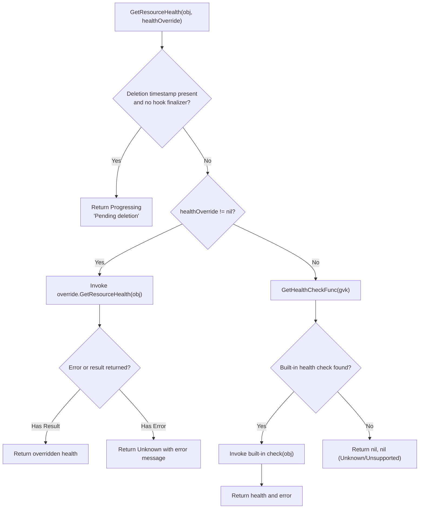
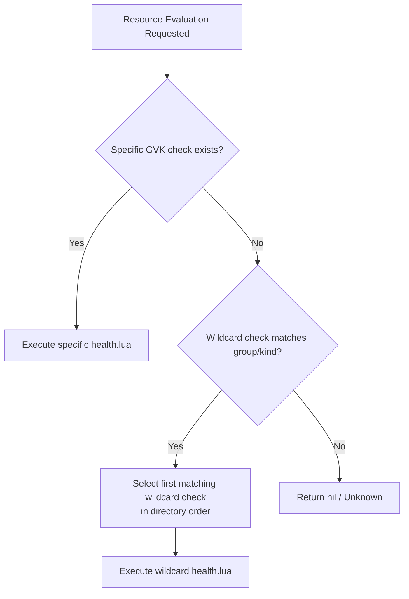
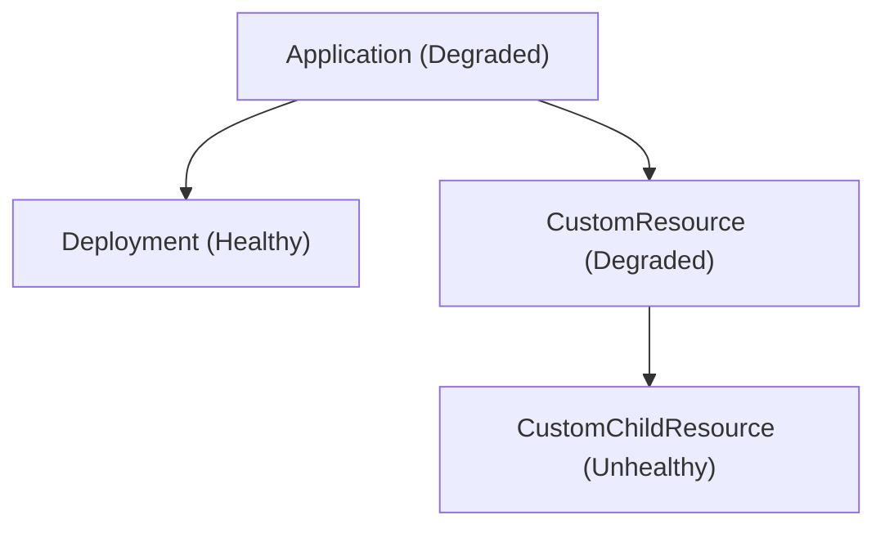

# Health Assessment

<details>
<summary>Relevant source files</summary>

The following files were used as context for generating this wiki page:

- [docs/operator-manual/health.md](https://github.com/argoproj/argo-cd/blob/main/docs/operator-manual/health.md)
- [resource_customizations/apiextensions.k8s.io/CustomResourceDefinition/health.lua](https://github.com/argoproj/argo-cd/blob/main/resource_customizations/apiextensions.k8s.io/CustomResourceDefinition/health.lua)
- [resource_customizations/numaplane.numaproj.io/NumaflowControllerRollout/health.lua](https://github.com/argoproj/argo-cd/blob/main/resource_customizations/numaplane.numaproj.io/NumaflowControllerRollout/health.lua)
- [resource_customizations/work.karmada.io/ResourceBinding/health.lua](https://github.com/argoproj/argo-cd/blob/main/resource_customizations/work.karmada.io/ResourceBinding/health.lua)
- [gitops-engine/pkg/health/health.go](https://github.com/argoproj/argo-cd/blob/main/gitops-engine/pkg/health/health.go)
- [resource_customizations/capabilities.3scale.net/CustomPolicyDefinition/health.lua](https://github.com/argoproj/argo-cd/blob/main/resource_customizations/capabilities.3scale.net/CustomPolicyDefinition/health.lua)
- [resource_customizations/work.karmada.io/ClusterResourceBinding/health.lua](https://github.com/argoproj/argo-cd/blob/main/resource_customizations/work.karmada.io/ClusterResourceBinding/health.lua)
- [resource_customizations/cluster.x-k8s.io/MachineHealthCheck/health.lua](https://github.com/argoproj/argo-cd/blob/main/resource_customizations/cluster.x-k8s.io/MachineHealthCheck/health.lua)
- [resource_customizations/camel.apache.org/Integration/health.lua](https://github.com/argoproj/argo-cd/blob/main/resource_customizations/camel.apache.org/Integration/health.lua)
- [resource_customizations/addons.cluster.x-k8s.io/ClusterResourceSet/health.lua](https://github.com/argoproj/argo-cd/blob/main/resource_customizations/addons.cluster.x-k8s.io/ClusterResourceSet/health.lua)
- [resource_customizations/operator.victoriametrics.com/_/health.lua](https://github.com/argoproj/argo-cd/blob/main/resource_customizations/operator.victoriametrics.com/_/health.lua)
- [resource_customizations/cluster.x-k8s.io/Cluster/health.lua](https://github.com/argoproj/argo-cd/blob/main/resource_customizations/cluster.x-k8s.io/Cluster/health.lua)
- [resource_customizations/_.upbound.io/_/health.lua](https://github.com/argoproj/argo-cd/blob/main/resource_customizations/_.upbound.io/_/health.lua)
- [resource_customizations/kyverno.io/Policy/health.lua](https://github.com/argoproj/argo-cd/blob/main/resource_customizations/kyverno.io/Policy/health.lua)
- [resource_customizations/apps.openshift.io/DeploymentConfig/health.lua](https://github.com/argoproj/argo-cd/blob/main/resource_customizations/apps.openshift.io/DeploymentConfig/health.lua)
- [resource_customizations/ocs.openshift.io/StorageCluster/health.lua](https://github.com/argoproj/argo-cd/blob/main/resource_customizations/ocs.openshift.io/StorageCluster/health.lua)
- [resource_customizations/_.crossplane.io/_/health.lua](https://github.com/argoproj/argo-cd/blob/main/resource_customizations/_.crossplane.io/_/health.lua)
- [resource_customizations/policy.open-cluster-management.io/ConfigurationPolicy/health.lua](https://github.com/argoproj/argo-cd/blob/main/resource_customizations/policy.open-cluster-management.io/ConfigurationPolicy/health.lua)
- [resource_customizations/k8s.mariadb.com/MariaDB/health.lua](https://github.com/argoproj/argo-cd/blob/main/resource_customizations/k8s.mariadb.com/MariaDB/health.lua)
- [resource_customizations/monitoring.coreos.com/Prometheus/health.lua](https://github.com/argoproj/argo-cd/blob/main/resource_customizations/monitoring.coreos.com/Prometheus/health.lua)
- [resource_customizations/kubevirt.io/VirtualMachine/health.lua](https://github.com/argoproj/argo-cd/blob/main/resource_customizations/kubevirt.io/VirtualMachine/health.lua)
- [resource_customizations/ceph.rook.io/CephCluster/health.lua](https://github.com/argoproj/argo-cd/blob/main/resource_customizations/ceph.rook.io/CephCluster/health.lua)
- [resource_customizations/kiali.io/Kiali/health.lua](https://github.com/argoproj/argo-cd/blob/main/resource_customizations/kiali.io/Kiali/health.lua)
- [resource_customizations/numaplane.numaproj.io/ISBServiceRollout/health.lua](https://github.com/argoproj/argo-cd/blob/main/resource_customizations/numaplane.numaproj.io/ISBServiceRollout/health.lua)
- [resource_customizations/policy.open-cluster-management.io/Policy/health.lua](https://github.com/argoproj/argo-cd/blob/main/resource_customizations/policy.open-cluster-management.io/Policy/health.lua)
- [resource_customizations/promoter.argoproj.io/PromotionStrategy/health.lua](https://github.com/argoproj/argo-cd/blob/main/resource_customizations/promoter.argoproj.io/PromotionStrategy/health.lua)
- [resource_customizations/grafana.integreatly.org/GrafanaDashboard/health.lua](https://github.com/argoproj/argo-cd/blob/main/resource_customizations/grafana.integreatly.org/GrafanaDashboard/health.lua)
- [resource_customizations/k8s.mariadb.com/User/health.lua](https://github.com/argoproj/argo-cd/blob/main/resource_customizations/k8s.mariadb.com/User/health.lua)
- [resource_customizations/capabilities.3scale.net/OpenAPI/health.lua](https://github.com/argoproj/argo-cd/blob/main/resource_customizations/capabilities.3scale.net/OpenAPI/health.lua)
- [resource_customizations/kubevirt.io/VirtualMachineInstance/health.lua](https://github.com/argoproj/argo-cd/blob/main/resource_customizations/kubevirt.io/VirtualMachineInstance/health.lua)
</details>

## Overview

Argo CD provides a robust health assessment subsystem to evaluate Kubernetes resources and aggregate their states into overarching Application health statuses. Because Custom Resource Definitions (CRDs) do not adhere to a standardized status schema, Argo CD relies on a dual-engine evaluation model combining hardcoded Go health functions with embeddable Lua scripts. This architecture decouples health logic from core controllers, allowing operators and maintainers to define custom evaluation rules against resource status conditions, phases, and generation counters.

The health assessment engine operates by resolving target objects against override rules, Lua customization files, or built-in Go health checks. When evaluating an entire Application, Argo CD computes the aggregate status by taking the worst health code among its immediate child resources based on a strict deterministic severity hierarchy. Understanding this subsystem requires examining its core data structures, execution control flow, Lua customization mechanisms, and safety invariants.

Sources: [docs/operator-manual/health.md:1-71](https://github.com/argoproj/argo-cd/blob/main/docs/operator-manual/health.md#L1-L71), [gitops-engine/pkg/health/health.go:1-53](https://github.com/argoproj/argo-cd/blob/main/gitops-engine/pkg/health/health.go#L1-L53)

## Core Data Structures and Health Status Codes

The core health status is represented by string status types and the `HealthStatus` struct defined in the gitops engine. These types standardize the outcomes of all built-in and custom health evaluations across standard and custom resources.

| Health Status Code | Meaning & Behavioral Criteria |
| :--- | :--- |
| `Healthy` | Resource has completed its rollout or operational objectives successfully (100% healthy). |
| `Progressing` | Resource is not yet healthy, but is actively making progress toward a healthy state. |
| `Suspended` | Resource is paused or waiting for an external event (e.g., suspended CronJob, paused Deployment or VirtualMachine). |
| `Degraded` | Resource indicates failure, persistent reconciliation errors, or failed to reach healthy state. |
| `Missing` | Resource is missing entirely from the target Kubernetes cluster. |
| `Unknown` | Health assessment failed or actual health status could not be determined. |

Sources: [gitops-engine/pkg/health/health.go:14-31](https://github.com/argoproj/argo-cd/blob/main/gitops-engine/pkg/health/health.go#L14-L31), [gitops-engine/pkg/health/health.go:38-42](https://github.com/argoproj/argo-cd/blob/main/gitops-engine/pkg/health/health.go#L38-L42)

The ordering of health statuses from most healthy to least healthy is strictly defined by the `healthOrder` slice. This array governs status comparisons when aggregating child resource health into an Application.

```go
var healthOrder = []HealthStatusCode{
	HealthStatusHealthy,
	HealthStatusSuspended,
	HealthStatusProgressing,
	HealthStatusMissing,
	HealthStatusDegraded,
	HealthStatusUnknown,
}
```

Sources: [gitops-engine/pkg/health/health.go:44-52](https://github.com/argoproj/argo-cd/blob/main/gitops-engine/pkg/health/health.go#L44-L52)

## Execution Control Flow and Resolution Pipeline

When Argo CD evaluates a resource's health, `GetResourceHealth` executes a deterministic resolution pipeline. The function inspects deletion timestamps, checks for custom health overrides, and falls back to built-in Go health functions based on GroupVersionKind (GVK).



Sources: [gitops-engine/pkg/health/health.go:69-102](https://github.com/argoproj/argo-cd/blob/main/gitops-engine/pkg/health/health.go#L69-L102)

To determine whether a new health state supersedes the current state when aggregating across resources, the `IsWorse` comparator iterates through `healthOrder` and evaluates index positions.

```go
func IsWorse(current, new HealthStatusCode) bool {
	currentIndex := 0
	newIndex := 0
	for i, code := range healthOrder {
		if current == code {
			currentIndex = i
		}
		if new == code {
			newIndex = i
		}
	}
	return newIndex > currentIndex
}
```

> [!CAUTION]
> If a newly evaluated health status has a higher index in `healthOrder` than the current status, `IsWorse` returns `true`. This guarantees that destructive or degraded child states immediately dominate parent Application health calculations.

Sources: [gitops-engine/pkg/health/health.go:54-67](https://github.com/argoproj/argo-cd/blob/main/gitops-engine/pkg/health/health.go#L54-L67)

## Built-In Go Health Checks and Overrides

Argo CD includes hardcoded Go health checks for foundational Kubernetes types and legacy resources introduced prior to Lua support. The `GetHealthCheckFunc` router inspects the resource's `GroupVersionKind` and dispatches to the corresponding validation function.

| Group | Kind | Function Dispatched / Assessment Logic |
| :--- | :--- | :--- |
| `apps` | `Deployment` | Observed generation equals desired generation; updated replicas equal desired replicas. |
| `apps` | `StatefulSet` | Observed generation equals desired generation; updated replicas equal desired replicas. |
| `apps` | `ReplicaSet` | Observed generation equals desired generation; updated replicas equal desired replicas. |
| `apps` | `DaemonSet` | Observed generation equals desired generation; updated replicas equal desired replicas. |
| `networking.k8s.io` / `extensions` | `Ingress` | `status.loadBalancer.ingress` is non-empty with at least one IP or hostname. |
| `""` (core) | `Service` | If type is `LoadBalancer`, `status.loadBalancer.ingress` is non-empty with at least one IP or hostname. |
| `""` (core) | `PersistentVolumeClaim` | `status.phase` is `Bound`. |
| `""` (core) | `Pod` | Evaluates container readiness and phase conditions. |
| `batch` | `Job` | If `.spec.suspended` is `true`, marked as `Suspended`. |
| `autoscaling` | `HorizontalPodAutoscaler` | Evaluates scaling targets and conditions. |
| `apiregistration.k8s.io` | `APIService` | Evaluates availability conditions. |
| `argoproj.io` | `Workflow` | Evaluates Argo Workflow phase and completion status. |

Sources: [docs/operator-manual/health.md:1-28](https://github.com/argoproj/argo-cd/blob/main/docs/operator-manual/health.md#L1-L28), [docs/operator-manual/health.md:235-257](https://github.com/argoproj/argo-cd/blob/main/docs/operator-manual/health.md#L235-L257), [gitops-engine/pkg/health/health.go:103-152](https://github.com/argoproj/argo-cd/blob/main/gitops-engine/pkg/health/health.go#L103-L152)

Operators can override any built-in Go-based health check by registering a custom Lua script via the `argocd-cm` ConfigMap or file-based resource customizations. Argo CD explicitly prioritizes configured overrides over built-in Go checks.

Sources: [docs/operator-manual/health.md:238-241](https://github.com/argoproj/argo-cd/blob/main/docs/operator-manual/health.md#L238-L241)

## Custom Health Checks via Lua

### Overview of Lua Customization Mechanics

For Custom Resource Definitions (CRDs) or overridden built-in types, Argo CD executes embedded Lua scripts. The script evaluates the global `obj` table (representing the Kubernetes resource) and must return a table containing `status` and an optional `message`.

### Configuration Methods

1. **ConfigMap (`argocd-cm`)**: Defined under keys formatted as `resource.customizations.health.<group>_<kind>`.
2. **Bundled Resource Customizations**: Located in the repository under `resource_customizations/<group>/<kind>/health.lua` alongside `health_test.yaml` and test manifests in `testdata/`.

> [!NOTE]
> Access to standard Lua libraries is disabled by default for security. Administrators can enable standard libraries for specific resources by setting `resource.customizations.useOpenLibs.<group>_<kind>: true`.

Sources: [docs/operator-manual/health.md:65-168](https://github.com/argoproj/argo-cd/blob/main/docs/operator-manual/health.md#L65-L168)

### Example: Custom Policy Definition Health Check

The following Lua script evaluates a 3scale `CustomPolicyDefinition` resource by iterating through its `status.conditions` array:

```lua
local hs = {}

if obj.status ~= nil and obj.status.conditions ~= nil then
  for _, condition in ipairs(obj.status.conditions) do
    if condition.type == "Ready" and condition.status == "True" then
      hs.status = "Healthy"
      hs.message = "3scale CustomPolicyDefinition is ready"
      return hs
    elseif condition.type == "Invalid" and condition.status == "True" then
      hs.status = "Degraded"
      hs.message = condition.message or "3scale CustomPolicyDefinition configuration is invalid"
      return hs
    elseif condition.type == "Failed" and condition.status == "True" then
      hs.status = "Degraded"
      hs.message = condition.message or "3scale CustomPolicyDefinition synchronization failed"
      return hs
    end
  end
end

hs.status = "Progressing"
hs.message = "Waiting for 3scale CustomPolicyDefinition status..."
return hs
```

Sources: [resource_customizations/capabilities.3scale.net/CustomPolicyDefinition/health.lua:1-24](https://github.com/argoproj/argo-cd/blob/main/resource_customizations/capabilities.3scale.net/CustomPolicyDefinition/health.lua#L1-L24)

## Wildcard Matching and Resolution Precedence

When bundled resource customizations or ConfigMap rules utilize wildcards, Argo CD resolves matching scripts using specific directory structures and glob matching rules via the `doublestar` library.



Sources: [docs/operator-manual/health.md:126-143](https://github.com/argoproj/argo-cd/blob/main/docs/operator-manual/health.md#L126-L143), [docs/operator-manual/health.md:204-225](https://github.com/argoproj/argo-cd/blob/main/docs/operator-manual/health.md#L204-L225)

The `_` character acts as a wildcard equivalent to `*` in directory and key matching. Wildcard checks are evaluated only when no resource-specific check exists. If multiple wildcard checks match, the first one encountered in the directory structure takes precedence.

Sources: [docs/operator-manual/health.md:208-223](https://github.com/argoproj/argo-cd/blob/main/docs/operator-manual/health.md#L208-L223)

## Application-Level Health Aggregation and Child Isolation

An Argo CD Application's health status is inferred directly from the health of its immediate child resources. The Application health defaults to the **worst health of its immediate child resources** according to `healthOrder`.



Sources: [docs/operator-manual/health.md:258-291](https://github.com/argoproj/argo-cd/blob/main/docs/operator-manual/health.md#L258-L291)

> [!IMPORTANT]
> Resource health inheritance is absent by design: a parent resource's health is calculated solely from its own fields and does not automatically inspect its children. For instance, a Deployment's health does not automatically reflect failing Pods unless the Deployment controller surfaces that condition into the Deployment's own status subresource.

Operators can bypass specific child resource health contributions by annotating the child resource with `argocd.argoproj.io/ignore-healthcheck: "true"`. When set, the annotated resource's health status is excluded from the parent Application's health calculation.

Sources: [docs/operator-manual/health.md:265-305](https://github.com/argoproj/argo-cd/blob/main/docs/operator-manual/health.md#L265-L305)

## Testing and Design Trade-Offs

Bundled Lua health checks require rigorous unit testing using `health_test.yaml` manifests and stored `testdata` resource definitions. Developers can execute all Lua tests locally using Go:

```bash
go test -v ./util/lua/
```

Sources: [docs/operator-manual/health.md:172-201](https://github.com/argoproj/argo-cd/blob/main/docs/operator-manual/health.md#L172-L201)

| Design Choice | Benefit | Cost |
| :--- | :--- | :--- |
| **Lua scripting engine** | Allows dynamic operator-defined health checks without recompiling Argo CD binaries. | Execution overhead and sandboxing constraints requiring explicit standard library opt-in. |
| **Non-inheriting resource health** | Prevents cascading false-positive health degradations from deep sub-resource trees. | Requires parent controllers to explicitly bubble up child failure states into parent status subresources. |
| **Worst-case health aggregation** | Ensures operational visibility into failing components within an application stack. | A single degraded child resource forces the entire Application into a degraded state. |
| **Observed generation gating** | Prevents health status flapping during controller reconciliation delays. | May temporarily report progressing states while waiting for controller acknowledgments. |

Sources: [docs/operator-manual/health.md:70-85](https://github.com/argoproj/argo-cd/blob/main/docs/operator-manual/health.md#L70-L85), [docs/operator-manual/health.md:265-286](https://github.com/argoproj/argo-cd/blob/main/docs/operator-manual/health.md#L265-L286)

## Related

- [[Application Controller]]
- [[Resource Customizations]]

