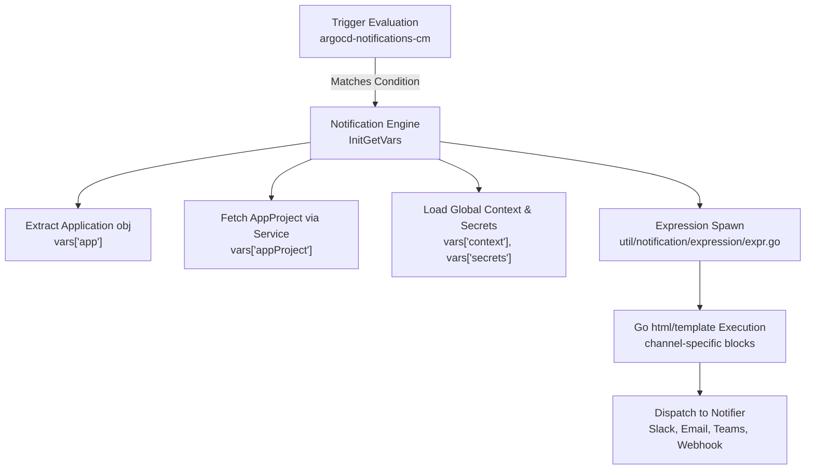
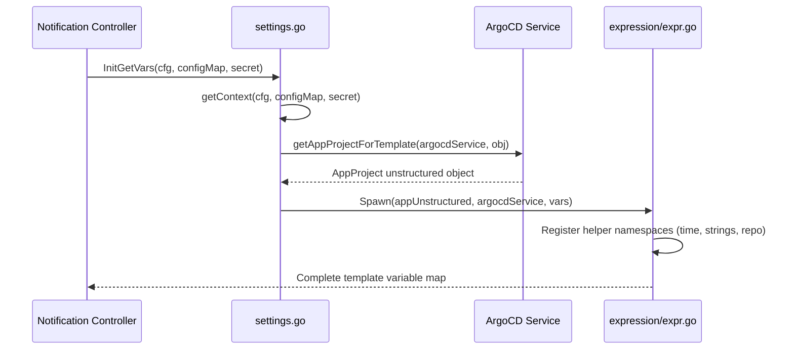

# Notification Templates

<details>
<summary>Relevant source files</summary>

The following files were used as context for generating this wiki page:

- [notifications_catalog/install.yaml](https://github.com/argoproj/argo-cd/blob/main/notifications_catalog/install.yaml)
- [docs/operator-manual/notifications/catalog.md](https://github.com/argoproj/argo-cd/blob/main/docs/operator-manual/notifications/catalog.md)
- [docs/operator-manual/notifications/triggers.md](https://github.com/argoproj/argo-cd/blob/main/docs/operator-manual/notifications/triggers.md)
- [docs/operator-manual/notifications/templates.md](https://github.com/argoproj/argo-cd/blob/main/docs/operator-manual/notifications/templates.md)
- [util/notification/settings/settings.go](https://github.com/argoproj/argo-cd/blob/main/util/notification/settings/settings.go)
- [notifications_catalog/triggers/on-health-degraded.yaml](https://github.com/argoproj/argo-cd/blob/main/notifications_catalog/triggers/on-health-degraded.yaml)
- [notifications_catalog/triggers/on-deployed.yaml](https://github.com/argoproj/argo-cd/blob/main/notifications_catalog/triggers/on-deployed.yaml)
- [notifications_catalog/triggers/on-sync-succeeded.yaml](https://github.com/argoproj/argo-cd/blob/main/notifications_catalog/triggers/on-sync-succeeded.yaml)
- [notifications_catalog/templates/app-health-degraded.yaml](https://github.com/argoproj/argo-cd/blob/main/notifications_catalog/templates/app-health-degraded.yaml)
- [notifications_catalog/templates/app-created.yaml](https://github.com/argoproj/argo-cd/blob/main/notifications_catalog/templates/app-created.yaml)
- [notifications_catalog/triggers/on-sync-failed.yaml](https://github.com/argoproj/argo-cd/blob/main/notifications_catalog/triggers/on-sync-failed.yaml)
- [notifications_catalog/triggers/on-sync-status-unknown.yaml](https://github.com/argoproj/argo-cd/blob/main/notifications_catalog/triggers/on-sync-status-unknown.yaml)
- [notifications_catalog/triggers/on-deleted.yaml](https://github.com/argoproj/argo-cd/blob/main/notifications_catalog/triggers/on-deleted.yaml)
- [docs/operator-manual/notifications/argocd-notifications-cm.yaml](https://github.com/argoproj/argo-cd/blob/main/docs/operator-manual/notifications/argocd-notifications-cm.yaml)
- [notifications_catalog/triggers/on-created.yaml](https://github.com/argoproj/argo-cd/blob/main/notifications_catalog/triggers/on-created.yaml)
- [notifications_catalog/templates/app-deployed.yaml](https://github.com/argoproj/argo-cd/blob/main/notifications_catalog/templates/app-deployed.yaml)
- [docs/operator-manual/notifications/index.md](https://github.com/argoproj/argo-cd/blob/main/docs/operator-manual/notifications/index.md)
- [util/notification/expression/expr.go](https://github.com/argoproj/argo-cd/blob/main/util/notification/expression/expr.go)
</details>

## Overview

Notification Templates form the structural and content-generation layer of Argo CD Notifications, enabling operators and developers to define reusable, customized notification payloads that deliver application state changes across multiple communication channels. Powered by Go's native `html/template` package, templates decouple the "when" of state changes (managed by triggers) from the "what" and "how" of message formatting. By abstracting payloads into ConfigMap entries prefixed with `template.`, the system allows multiple triggers to share presentation logic while supporting channel-specific formatting blocks such as Slack attachments, Microsoft Teams cards, email subjects, and webhook bodies.

Sources: [docs/operator-manual/notifications/templates.md:1-4](https://github.com/argoproj/argo-cd/blob/main/docs/operator-manual/notifications/templates.md#L1-L4)

At its core, the template subsystem bridges raw Kubernetes Custom Resources with notification dispatchers by injecting a controlled context map containing the target Application object (`app`), its associated AppProject resource (`appProject`), global configuration (`context`), secure credentials (`secrets`), and recipient metadata (`recipient`). When a notification trigger fires, the engine resolves variable bindings through expression evaluation and variable mapping, ensuring that templates can dynamically adapt their output based on whether the notification is destined for email, Slack, or generic webhooks. This architecture solves the challenge of multi-channel alerting without requiring duplicate formatting rules, establishing a clean separation of concerns between state evaluation and message rendering.

Sources: [docs/operator-manual/notifications/templates.md:19-28](https://github.com/argoproj/argo-cd/blob/main/docs/operator-manual/notifications/templates.md#L19-L28), [util/notification/settings/settings.go:88-110](https://github.com/argoproj/argo-cd/blob/main/util/notification/settings/settings.go#L88-L110)



Sources: [docs/operator-manual/notifications/templates.md:1-28](https://github.com/argoproj/argo-cd/blob/main/docs/operator-manual/notifications/templates.md#L1-L28), [util/notification/settings/settings.go:88-110](https://github.com/argoproj/argo-cd/blob/main/util/notification/settings/settings.go#L88-L110)

## Template Configuration and Data Context

Notification templates are declared inside the `argocd-notifications-cm` ConfigMap under keys using the format `template.<template-name>`. Each template definition can contain a generic `message` field alongside service-specific keys (`email`, `slack`, `teams`, etc.) that customize payloads for specific notification dispatchers. During template evaluation, the engine builds an execution context map that supplies template expressions with structured access to the underlying Argo CD application, project constraints, global configurations, and secrets.

Sources: [docs/operator-manual/notifications/templates.md:1-18](https://github.com/argoproj/argo-cd/blob/main/docs/operator-manual/notifications/templates.md#L1-L18)

The data context made available to every template execution includes distinct root-level keys initialized by `initGetVars` and `initGetVarsWithoutSecret` in the settings package. These keys expose the target application's runtime status, security boundaries defined in its AppProject, environment-wide variables, and authentication secrets.

Sources: [util/notification/settings/settings.go:65-110](https://github.com/argoproj/argo-cd/blob/main/util/notification/settings/settings.go#L65-L110)

| Context Variable | Data Type | Description |
|------------------|-----------|-------------|
| `app` | `map[string]any` | Holds the unstructured Argo CD Application object (`app.metadata`, `app.spec`, `app.status`). |
| `appProject` | `map[string]any` | Holds the AppProject object associated with the application, providing access to RBAC policies, source repos, and destination clusters. |
| `context` | `map[string]string` | User-defined key-value pairs configured in the `context` block of the ConfigMap or legacy settings. |
| `secrets` | `map[string][]byte` | Provides access to sensitive data stored in the `argocd-notifications-secret` Secret (omitted when self-service mode is active). |
| `serviceType` | `string` | Holds the active notification service type name (such as `"slack"` or `"email"`), enabling conditional rendering. |
| `recipient` | `string` | Holds the destination recipient name or target channel identifier. |

Sources: [docs/operator-manual/notifications/templates.md:19-28](https://github.com/argoproj/argo-cd/blob/main/docs/operator-manual/notifications/templates.md#L19-L28), [util/notification/settings/settings.go:65-110](https://github.com/argoproj/argo-cd/blob/main/util/notification/settings/settings.go#L65-L110)

## Variable Injection and Context Spawning

The variable resolution pipeline initializes template parameters by combining application metadata with helper functions and project descriptors. The core wiring is managed in `util/notification/settings/settings.go` and `util/notification/expression/expr.go`, where `Spawn` constructs the final evaluation map passed into the template rendering engine.

Sources: [util/notification/settings/settings.go:65-110](https://github.com/argoproj/argo-cd/blob/main/util/notification/settings/settings.go#L65-L110), [util/notification/expression/expr.go:27-36](https://github.com/argoproj/argo-cd/blob/main/util/notification/expression/expr.go#L27-L36)

When an application triggers a notification, the engine invokes `initGetVars` (or `initGetVarsWithoutSecret` when self-service mode is enabled). It extracts project binding information via `getAppProjectForTemplate`, querying the Argo CD API with a 5-second timeout to fetch the corresponding `AppProject` resource based on `app.spec.project` (defaulting to `"default"` if unspecified) and `app.metadata.namespace`.

Sources: [util/notification/settings/settings.go:65-155](https://github.com/argoproj/argo-cd/blob/main/util/notification/settings/settings.go#L65-L155)



Sources: [util/notification/settings/settings.go:20-110](https://github.com/argoproj/argo-cd/blob/main/util/notification/settings/settings.go#L20-L110), [util/notification/expression/expr.go:27-36](https://github.com/argoproj/argo-cd/blob/main/util/notification/expression/expr.go#L27-L36)

> [!NOTE]
> When `self-service-notification-enabled` is activated, `initGetVarsWithoutSecret` is invoked instead of `initGetVars`. This explicitly excludes the `secrets` variable map from the template context, preventing multi-tenant applications from reading cluster-wide notification secrets.

Sources: [util/notification/settings/settings.go:25-29](https://github.com/argoproj/argo-cd/blob/main/util/notification/settings/settings.go#L25-L29), [docs/operator-manual/index.md:128](https://github.com/argoproj/argo-cd/blob/main/docs/operator-manual/notifications/index.md#L128)

## Built-in Helper Functions and Repositories

In addition to direct access to object fields, notification templates have access to registered helper function namespaces and repository utilities. The `expression` package initializes helper bindings during startup, registering standard libraries such as `time` and `strings`, and injecting repository commit query capabilities via `repo.NewExprs`.

Sources: [util/notification/expression/expr.go:15-36](https://github.com/argoproj/argo-cd/blob/main/util/notification/expression/expr.go#L15-L36)

The `repo` helper exposes advanced introspection methods, allowing templates to retrieve commit metadata directly from source repositories during notification rendering. For example, templates can fetch commit authors and messages using repository helper calls.

Sources: [docs/operator-manual/notifications/templates.md:120-131](https://github.com/argoproj/argo-cd/blob/main/docs/operator-manual/notifications/templates.md#L120-L131)

```yaml
apiVersion: v1
kind: ConfigMap
metadata:
  name: argocd-notifications-cm
data:
  template.commit-author-template: |
    message: "Author: {{(call .repo.GetCommitMetadata .app.status.sync.revision).Author}}"
```

Sources: [docs/operator-manual/notifications/templates.md:123-131](https://github.com/argoproj/argo-cd/blob/main/docs/operator-manual/notifications/templates.md#L123-L131)

## Service-Specific Formatting and Channel Adapters

While the generic `message` field provides a fallback plaintext or markdown body, production notification workflows frequently require rich formatting tailored to specific communication platforms. Notification templates support channel-specific top-level keys (`email`, `slack`, `teams`) that override or supplement the base message payload.

Sources: [docs/operator-manual/notifications/templates.md:108-113](https://github.com/argoproj/argo-cd/blob/main/docs/operator-manual/notifications/templates.md#L108-L113)

For Slack and Microsoft Teams, templates utilize structured attachment arrays and fact cards. These definitions use conditional Go template logic (`if`, `range`, `eq`) to dynamically adapt to single-source (`app.spec.source`) or multi-source (`app.spec.sources`) application configurations, extracting repository URLs, sync revisions, and application conditions.

Sources: [notifications_catalog/install.yaml:15-51](https://github.com/argoproj/argo-cd/blob/main/notifications_catalog/install.yaml#L15-L51)

```yaml
apiVersion: v1
kind: ConfigMap
metadata:
  name: argocd-notifications-cm
data:
  template.app-deployed: |
    message: |
      {{if eq .serviceType "slack"}} :white_check_mark: {{end}} Application {{.app.metadata.name}} is up and running.
    email:
      subject: New version of application {{.app.metadata.name}} is up and running.
    slack:
      attachments: |
        [{
          "title": "{{ .app.metadata.name}}",
          "title_link": "{{.context.argocdUrl}}/applications/{{.app.metadata.name}}",
          "color": "#18be52",
          "fields": [
            {
              "title": "Sync Status",
              "value": "{{.app.status.sync.status}}",
              "short": true
            }
          ]
        }]
```

Sources: [notifications_catalog/install.yaml:15-32](https://github.com/argoproj/argo-cd/blob/main/notifications_catalog/install.yaml#L15-L32)

## Accessing AppProject and Global Context

Templates can incorporate project-level constraints and governance details by referencing `.appProject`. Because Argo CD organizes applications within projects that dictate allowed source repositories, destination clusters, and RBAC roles, notifications can surface project metadata directly to security or operations teams.

Sources: [docs/operator-manual/notifications/templates.md:48-73](https://github.com/argoproj/argo-cd/blob/main/docs/operator-manual/notifications/templates.md#L48-L73)

Similarly, global shared context variables are defined under the top-level `context` key in the `argocd-notifications-cm` ConfigMap. These values are parsed into a string map and injected into the `.context` variable namespace during context spawning.

Sources: [docs/operator-manual/notifications/templates.md:29-46](https://github.com/argoproj/argo-cd/blob/main/docs/operator-manual/notifications/templates.md#L29-L46)

```yaml
apiVersion: v1
kind: ConfigMap
metadata:
  name: argocd-notifications-cm
data:
  context: |
    region: us-east-1
    environmentName: production
    argocdUrl: https://cd.apps.argoproj.io/

  template.project-context-template: |
    message: |
      Application {{.app.metadata.name}} in project {{.appProject.metadata.name}} 
      deployed to {{.context.environmentName}} ({{.context.region}}).
      Description: {{.appProject.spec.description}}
```

Sources: [docs/operator-manual/notifications/templates.md:40-46](https://github.com/argoproj/argo-cd/blob/main/docs/operator-manual/notifications/templates.md#L40-L46)

> [!WARNING]
> When referencing `.app.spec.sources` (multi-source applications) versus `.app.spec.source` (single-source applications), templates must employ conditional checks (`{{if .app.spec.source}} ... {{else if .app.spec.sources}} ... {{end}}`) to prevent runtime evaluation failures caused by nil map indexing.

Sources: [notifications_catalog/install.yaml:33-36](https://github.com/argoproj/argo-cd/blob/main/notifications_catalog/install.yaml#L33-L36)

## Secrets Integration in Templates

For notification destinations that require dynamic token authentication or custom webhook payloads incorporating sensitive parameters, templates can reference secret values stored in the `argocd-notifications-secret` Kubernetes Secret via the `.secrets` map.

Sources: [docs/operator-manual/notifications/templates.md:75-90](https://github.com/argoproj/argo-cd/blob/main/docs/operator-manual/notifications/templates.md#L75-L90)

```yaml
apiVersion: v1
kind: ConfigMap
metadata:
  name: argocd-notifications-cm
data:
  template.trigger-webhook: |
    webhook:
      sample-webhook:
        method: POST
        path: 'webhook/endpoint'
        body: 'token={{ .secrets.sampleWebhookToken }}&app={{ .app.metadata.name }}'
```

Sources: [docs/operator-manual/notifications/templates.md:94-106](https://github.com/argoproj/argo-cd/blob/main/docs/operator-manual/notifications/templates.md#L94-L106)

| Design Choice | Benefit | Cost |
|---------------|---------|------|
| **Go `html/template` engine** | Native standard library support, robust conditional control structures, and wide developer familiarity. | Limited string manipulation capabilities without helper function extensions. |
| **Separate `.secrets` map** | Keeps sensitive tokens isolated from ConfigMap definitions and RBAC-controlled resource views. | Requires secret synchronization across namespaces when using namespace-scoped self-service configurations. |
| **Automated AppProject resolution** | Enables governance and RBAC metadata inclusion without requiring trigger authors to manually query project APIs. | Incurs an API lookup overhead (with a 5-second timeout) during variable initialization for every notification dispatch. |

Sources: [docs/operator-manual/notifications/templates.md:1-28](https://github.com/argoproj/argo-cd/blob/main/docs/operator-manual/notifications/templates.md#L1-L28), [util/notification/settings/settings.go:114-155](https://github.com/argoproj/argo-cd/blob/main/util/notification/settings/settings.go#L114-L155)

## Related

- [[Notifications Controller]]

