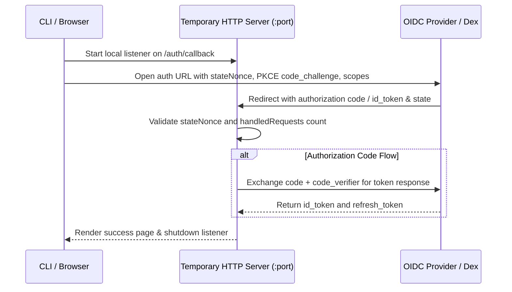

# OIDC and Dex Integration

<details>
<summary>Relevant source files</summary>

The following files were used as context for generating this wiki page:

- [docs/operator-manual/user-management/index.md](https://github.com/argoproj/argo-cd/blob/main/docs/operator-manual/user-management/index.md)
- [docs/operator-manual/user-management/okta.md](https://github.com/argoproj/argo-cd/blob/main/docs/operator-manual/user-management/okta.md)
- [docs/operator-manual/user-management/keycloak.md](https://github.com/argoproj/argo-cd/blob/main/docs/operator-manual/user-management/keycloak.md)
- [docs/operator-manual/user-management/onelogin.md](https://github.com/argoproj/argo-cd/blob/main/docs/operator-manual/user-management/onelogin.md)
- [docs/operator-manual/user-management/google.md](https://github.com/argoproj/argo-cd/blob/main/docs/operator-manual/user-management/google.md)
- [cmd/argocd/commands/login.go](https://github.com/argoproj/argo-cd/blob/main/cmd/argocd/commands/login.go)
- [docs/operator-manual/security.md](https://github.com/argoproj/argo-cd/blob/main/docs/operator-manual/security.md)
- [util/oidc/testdata/dex.json](https://github.com/argoproj/argo-cd/blob/main/util/oidc/testdata/dex.json)
- [docs/operator-manual/argocd-cm.yaml](https://github.com/argoproj/argo-cd/blob/main/docs/operator-manual/argocd-cm.yaml)
- [manifests/namespace-install-with-hydrator.yaml](https://github.com/argoproj/argo-cd/blob/main/manifests/namespace-install-with-hydrator.yaml)
</details>

## Overview

Argo CD integrates OpenID Connect (OIDC) and Dex to delegate authentication to external identity providers, enabling secure Single Sign-On (SSO) and robust access management across enterprise environments. By leveraging OIDC and the bundled identity broker Dex, Argo CD solves the complexity of managing disparate authentication systems, supporting identity providers such as Okta, Keycloak, OneLogin, and Google. Key design decisions include standardizing authentication on JSON Web Tokens (JWTs), supporting both bundled broker deployments and direct provider integrations, and incorporating token revocation, PKCE authentication, and TLS verification checks. These authentication mechanisms interact closely with core system components such as the Argo CD API server, local config files, deployment manifests, and Kubernetes ConfigMaps to maintain secure user sessions and fine-grained role-based access control.

Sources: [docs/operator-manual/user-management/index.md:132-149](https://github.com/argoproj/argo-cd/blob/main/docs/operator-manual/user-management/index.md#L132-L149), [docs/operator-manual/security.md:9-23](https://github.com/argoproj/argo-cd/blob/main/docs/operator-manual/security.md#L9-L23)

## CLI Login and SSO Authentication

### Overview

The Argo CD command-line interface provides the `argocd login` command to authenticate users against an Argo CD server using either direct username and password credentials or an interactive Single Sign-On (SSO) flow powered by OpenID Connect (OIDC). The login process tests server TLS connectivity, initializes client connections, performs the authentication exchange, parses resulting JSON Web Tokens (JWT) for display names, and updates local configuration contexts.

Sources: [cmd/argocd/commands/login.go:38-183](https://github.com/argoproj/argo-cd/blob/main/cmd/argocd/commands/login.go#L38-L183), [cmd/argocd/commands/login.go:195-203](https://github.com/argoproj/argo-cd/blob/main/cmd/argocd/commands/login.go#L195-L203)

### CLI Login Command Workflow

When `argocd login SERVER` executes, the command parses options, validates connection arguments, and executes pre-connection checks. If TLS is enabled, `grpc_util.TestTLS` verifies the server certificate against configured timeouts before proceeding.

The authentication workflow branches depending on whether SSO is requested and whether core Kubernetes API access is specified:

1. **Server Validation and TLS Check**: Validates arguments, checks for port-forward (`clientOpts.PortForward`) or core mode (`clientOpts.Core`), and tests TLS trust and certificate validity unless `--skip-test-tls` is passed.
2. **Client Initialization**: Constructs `loginOpts` and establishes an API client via `headless.NewClientOrDie(&loginOpts, c)`.
3. **Authentication Strategy**:
   - If `--sso` is disabled, `passwordLogin` prompts for credentials and calls `sessionIf.Create` to retrieve a session token.
   - If `--sso` is enabled, `oauth2Login` queries server settings (`setIf.Get`), retrieves OIDC configuration (`acdClient.OIDCConfig`), spawns a temporary HTTP server, and initiates the OAuth2 flow.
4. **Token Parsing**: Uses `jwt.NewParser(jwt.WithoutClaimsValidation())` to parse the resulting unverified token string, extracting user display attributes via `userDisplayName`.
5. **Local Configuration Persistence**: Reads the local configuration via `localconfig.ReadLocalConfig`, upserts server definitions, updates user authentication tokens and refresh tokens, sets the current context, and writes the configuration back using `localconfig.WriteLocalConfig`.

Sources: [cmd/argocd/commands/login.go:62-182](https://github.com/argoproj/argo-cd/blob/main/cmd/argocd/commands/login.go#L62-L182)

### SSO Authentication Routines and OAuth2 Flow

The SSO login mechanism spins up a temporary HTTP callback server to handle authorization code or implicit OIDC flows. It incorporates cryptographic state validation and PKCE (Proof Key for Code Exchange) security controls.



Sources: [cmd/argocd/commands/login.go:207-361](https://github.com/argoproj/argo-cd/blob/main/cmd/argocd/commands/login.go#L207-L361)

The OAuth2 login routine executes the following sequence:
1. `oauth2Login` determines the redirect base URL (`http://localhost:port` or custom callback) and appends `/auth/callback`.
2. Generates a 24-character random string state nonce (`stateNonce`) to prevent CSRF attacks.
3. Generates a 43-character PKCE code verifier (`codeVerifier`) from the permitted character set (`ABCDEFGHIJKLMNOPQRSTUVWXYZabcdefghijklmnopqrstuvwxyz0123456789-._~`), computes its SHA-256 hash, and encodes it into a base64 URL-encoded `codeChallenge`.
4. Registers `callbackHandler` on `/auth/callback` to process incoming redirects.
5. Infers the grant type using `oidcutil.InferGrantType(oidcConf)` and constructs authorization parameters including `AccessTypeOffline`, requested ID token claims, code challenge, and optional domain hints.
6. Launches the system browser or prints the authorization URL via `ssoAuthFlow`.
7. Listens for incoming callback requests, verifies state nonces, exchanges authorization codes and code verifiers via `oauth2conf.Exchange`, extracts `id_token` and `refresh_token` values, and shuts down the temporary HTTP server upon success.

Sources: [cmd/argocd/commands/login.go:207-384](https://github.com/argoproj/argo-cd/blob/main/cmd/argocd/commands/login.go#L207-L384)

> [!WARNING]
> The temporary OAuth2 callback handler strictly limits request processing to a maximum of two handled requests (`handledRequests > 2`) to prevent redirection loops in implicit grant flows where browsers revisit callback fragments manually.

Sources: [cmd/argocd/commands/login.go:228-270](https://github.com/argoproj/argo-cd/blob/main/cmd/argocd/commands/login.go#L228-L270)

### Login Flags Reference

The `argocd login` command supports several flags to configure connection parameters, SSO behavior, and credentials.

| Flag | Type | Default | Purpose |
| :--- | :--- | :--- | :--- |
| `--name` | string | `""` | Name to use for the created local context |
| `--username` | string | `""` | The username of an account to authenticate |
| `--password` | string | `""` | The password of an account to authenticate |
| `--sso` | bool | `false` | Perform SSO login using OIDC |
| `--sso-port` | int | `DefaultSSOLocalPort` | Port to run local OAuth2 login application server |
| `--callback` | string | `""` | Custom Scheme, Host, and Port for the OAuth2 callback URL |
| `--skip-test-tls` | bool | `false` | Skip testing whether the server is configured with TLS |
| `--sso-launch-browser` | bool | `true` | Automatically launch the system default browser during SSO login |

Sources: [cmd/argocd/commands/login.go:184-192](https://github.com/argoproj/argo-cd/blob/main/cmd/argocd/commands/login.go#L184-L192)

### Local Configuration Updates

Upon successful authentication, `login` persists the session state into the local configuration file (located at `clientOpts.ConfigPath`). It executes upsert routines to update three core blocks:

- **Server Record (`localCfg.UpsertServer`)**: Stores server address, plaintext settings, insecure TLS flags, gRPC-web settings, gRPC-web root path, and core mode status.
- **User Record (`localCfg.UpsertUser`)**: Stores the context name, JWT auth token (`AuthToken`), and OAuth2 refresh token (`RefreshToken`).
- **Context Reference (`localCfg.UpsertContext`)**: Binds the context name to the corresponding user and server reference, updating `localCfg.CurrentContext`.

Sources: [cmd/argocd/commands/login.go:151-181](https://github.com/argoproj/argo-cd/blob/main/cmd/argocd/commands/login.go#L151-L181)

## Dex Identity Broker Configuration

### Overview

The embedded Dex server acts as Argo CD's built-in identity broker, facilitating federated authentication through external identity providers. Dex parameters, issuer endpoints, and connector settings are managed via the `argocd-cm` ConfigMap under the `dex.config` key, allowing operators to wire authentication backends such as GitHub, LDAP, SAML, or OIDC.

Sources: [docs/operator-manual/argocd-cm.yaml:53-79](https://github.com/argoproj/argo-cd/blob/main/docs/operator-manual/argocd-cm.yaml#L53-L79)

### Embedded Dex Issuer Endpoints and Supported Capabilities

When integrated as an embedded identity provider, Dex exposes standard OIDC discovery endpoints and supported capabilities. The issuer configuration defines the base path and operational parameters expected by client applications and Argo CD servers.

| OIDC Parameter | Value / Supported Type | Description |
| :--- | :--- | :--- |
| `issuer` | `https://argocd.example.com/api/dex` | The primary issuer URL identifying the Dex identity broker instance |
| `authorization_endpoint` | `https://argocd.example.com/api/dex/auth` | Endpoint where authorization requests are submitted |
| `token_endpoint` | `https://argocd.example.com/api/dex/token` | Endpoint used to exchange authorization codes for tokens |
| `jwks_uri` | `https://argocd.example.com/api/dex/keys` | URI providing JSON Web Key Sets for token verification |
| `response_types_supported` | `code` | Supported OAuth2 response types |
| `subject_types_supported` | `public` | Supported subject identifier types |
| `id_token_signing_alg_values_supported` | `RS256` | Supported cryptographic algorithms for signing ID tokens |
| `scopes_supported` | `openid`, `email`, `groups`, `profile`, `offline_access` | Supported OIDC scopes |
| `token_endpoint_auth_methods_supported` | `client_secret_basic` | Supported client authentication methods at the token endpoint |
| `claims_supported` | `aud`, `email`, `email_verified`, `exp`, `iat`, `iss`, `locale`, `name`, `sub` | Claims included or supported within issued tokens |

Sources: [util/oidc/testdata/dex.json:1-35](https://github.com/argoproj/argo-cd/blob/main/util/oidc/testdata/dex.json#L1-L35)

### Dex ConfigMap Settings

Operators configure the embedded Dex server inside the `argocd-cm` ConfigMap by defining web options, TLS minimum versions, and identity connectors under `dex.config`. Additionally, static clients can be declared to allow external services to reuse the Dex broker instance.

```yaml
dex.config: |
  web:
    tlsMinVersion: "1.2"
  connectors:
    - type: github
      id: github
      name: GitHub
      config:
        clientID: aabbccddeeff00112233
        clientSecret: $dex.github.clientSecret
        orgs:
        - name: your-github-org
          teams:
          - red-team
  # staticClients:
  # - id: argo-workflow
  #   name: Argo Workflow
  #   redirectURIs:
  #     - https://argo/oauth2/callback
  #   secret: $secretReference
```

Sources: [docs/operator-manual/argocd-cm.yaml:56-79](https://github.com/argoproj/argo-cd/blob/main/docs/operator-manual/argocd-cm.yaml#L56-L79)

> [!WARNING]
> Storing cleartext client secrets directly within the `argocd-cm` ConfigMap is a security risk; secrets should instead reference Kubernetes secret keys using the `$secret-name.key` syntax (such as `$dex.github.clientSecret`).

Sources: [docs/operator-manual/argocd-cm.yaml:66](https://github.com/argoproj/argo-cd/blob/main/docs/operator-manual/argocd-cm.yaml#L66)

## Direct OIDC Provider Integrations

### Overview

Argo CD supports direct OIDC provider integrations that bypass the embedded Dex broker, allowing authentication to be delegated directly to external identity providers. Supported providers include Okta, Keycloak, OneLogin, and Google. Configuration is performed via the `oidc.config` key within the `argocd-cm` ConfigMap.

Sources: [docs/operator-manual/user-management/index.md:139-141](https://github.com/argoproj/argo-cd/blob/main/docs/operator-manual/user-management/index.md#L139-L141), [docs/operator-manual/user-management/index.md:315-318](https://github.com/argoproj/argo-cd/blob/main/docs/operator-manual/user-management/index.md#L315-L318)

### Direct Provider Configuration Options

The following reference table outlines the available configuration fields within `oidc.config` for managing direct OIDC provider connections.

| Field | Type | Default | Description |
| :--- | :--- | :--- | :--- |
| `name` | string | none | Display name for the OIDC provider shown in the UI |
| `issuer` | string | none | The OIDC issuer URL where discovery documents are located |
| `clientID` | string | none | The OAuth2 client identifier registered with the provider |
| `clientSecret` | string | none | The client secret associated with the OAuth2 client |
| `cliClientID` | string | none | Separate client ID required for CLI/localhost login flows |
| `allowedAudiences` | list | `[clientID]` | List of allowed `aud` claim values accepted during token verification |
| `skipAudienceCheckWhenTokenHasNoAudience` | boolean | `false` | Whether tokens lacking an audience claim pass validation |
| `requestedScopes` | list | `["openid", "profile", "email", "groups"]` | OIDC scopes requested during authorization |
| `requestedIDTokenClaims` | map | none | Specific claims requested on the ID token |
| `enablePKCEAuthentication` | boolean | `false` | Enables Proof Key for Code Exchange (PKCE) extension |
| `refreshTokenThreshold` | duration | `0s` | Threshold window before ID token expiration to trigger a refresh |
| `enableUserInfoGroups` | boolean | `false` | Queries the user info endpoint for group information |
| `logoutURL` | string | none | Custom logout URL used to terminate active IdP sessions |
| `rootCA` | string | none | PEM-encoded custom root CA certificate for TLS verification |

Sources: [docs/operator-manual/user-management/index.md:324-364](https://github.com/argoproj/argo-cd/blob/main/docs/operator-manual/user-management/index.md#L324-L364), [docs/operator-manual/user-management/index.md:408-412](https://github.com/argoproj/argo-cd/blob/main/docs/operator-manual/user-management/index.md#L408-L412), [docs/operator-manual/user-management/index.md:430-436](https://github.com/argoproj/argo-cd/blob/main/docs/operator-manual/user-management/index.md#L430-L436), [docs/operator-manual/user-management/index.md:484-493](https://github.com/argoproj/argo-cd/blob/main/docs/operator-manual/user-management/index.md#L484-L493)

### Provider-Specific Integration Examples

#### Okta OIDC Integration
Okta requires configuring an OIDC Web Application integration alongside a custom Authorization Server configured with a `groups` scope and claim.

```yaml
data:
  url: https://argocd.example.com
  oidc.config: |
    name: Okta
    issuer: https://example.okta.com/oauth2/aus9abcdefgABCDEFGd7
    clientID: 0oa9abcdefgh123AB5d7
    cliClientID: gfedcba0987654321GEFDCBA
    clientSecret: ABCDEFG1234567890abcdefg
    requestedScopes: ["openid", "profile", "email", "groups"]
    requestedIDTokenClaims: {"groups": {"essential": true}}
```

Sources: [docs/operator-manual/user-management/okta.md:137-223](https://github.com/argoproj/argo-cd/blob/main/docs/operator-manual/user-management/okta.md#L137-L223)

#### Keycloak Client Authentication and PKCE
Keycloak integration can be achieved using standard client authentication or via PKCE when command-line authentication is required.

```yaml
data:
  url: https://argocd.example.com
  oidc.config: |
    name: Keycloak
    issuer: https://keycloak.example.com/realms/master
    clientID: argocd
    enablePKCEAuthentication: true
    refreshTokenThreshold: 2m
    requestedScopes: ["openid", "profile", "email", "groups", "offline_access"]
```

Sources: [docs/operator-manual/user-management/keycloak.md:65-72](https://github.com/argoproj/argo-cd/blob/main/docs/operator-manual/user-management/keycloak.md#L65-L72), [docs/operator-manual/user-management/keycloak.md:139-146](https://github.com/argoproj/argo-cd/blob/main/docs/operator-manual/user-management/keycloak.md#L139-L146)

#### OneLogin Integration
OneLogin utilizes custom OIDC applications where user roles are mapped to the token's `groups` field using semicolon-delimited input transforms.

```yaml
data:
  url: https://argocd.example.com
  oidc.config: |
    name: OneLogin
    issuer: https://subdomain.onelogin.com/oidc/2
    clientID: aaaaaaaa-aaaa-aaaa-aaaa-aaaaaaaaaaaaaaaaaa
    clientSecret: abcdef123456
    requestedScopes: ["openid", "profile", "email", "groups"]
```

Sources: [docs/operator-manual/user-management/onelogin.md:20-29](https://github.com/argoproj/argo-cd/blob/main/docs/operator-manual/user-management/onelogin.md#L20-L29), [docs/operator-manual/user-management/onelogin.md:57-61](https://github.com/argoproj/argo-cd/blob/main/docs/operator-manual/user-management/onelogin.md#L57-L61), [docs/operator-manual/user-management/onelogin.md:122-130](https://github.com/argoproj/argo-cd/blob/main/docs/operator-manual/user-management/onelogin.md#L122-L130)

#### Google OpenID Connect
Google Workspace integration can be established via standard OIDC through Dex or directly, though Google does not natively expose group claims via standard OIDC without auxiliary directory integration.

```yaml
data:
  url: https://argocd.example.com
  dex.config: |
    connectors:
    - config:
        issuer: https://accounts.google.com
        clientID: XXXXXXXXXXXXX.apps.googleusercontent.com
        clientSecret: XXXXXXXXXXXXX
      type: oidc
      id: google
      name: Google
```

Sources: [docs/operator-manual/user-management/google.md:5-6](https://github.com/argoproj/argo-cd/blob/main/docs/operator-manual/user-management/google.md#L5-L6), [docs/operator-manual/user-management/google.md:56-67](https://github.com/argoproj/argo-cd/blob/main/docs/operator-manual/user-management/google.md#L56-L67)

> [!WARNING]
> When configuring `refreshTokenThreshold`, ensure the duration is set strictly less than your identity provider's client token lifetime. If configured higher than the token lifetime, Argo CD will unnecessarily request a new token on every incoming request.

Sources: [docs/operator-manual/user-management/keycloak.md:81](https://github.com/argoproj/argo-cd/blob/main/docs/operator-manual/user-management/keycloak.md#L81), [docs/operator-manual/user-management/keycloak.md:155](https://github.com/argoproj/argo-cd/blob/main/docs/operator-manual/user-management/keycloak.md#L155)

## Deployment Manifests and Hydration

### Overview

Argo CD's authentication components—specifically the embedded Dex server, the main API server, and supporting source hydration tools—are deployed within Kubernetes via structured namespace installation manifests and configuration maps. The `argocd-cm` ConfigMap exposes global properties governing source hydrator behavior, including commit authorship metadata and customizable templating for generated commits and README documentation.

Sources: [docs/operator-manual/argocd-cm.yaml:472-530](https://github.com/argoproj/argo-cd/blob/main/docs/operator-manual/argocd-cm.yaml#L472-L530)

### Hydrator Configurations and Templates

The source hydrator features configurable commit author settings and extensible Go template parameters that govern how manifest changes and reproducibility instructions are formatted. The default settings control both commit authorship and automated README generation for hydrated repositories.

```yaml
data:
  commit.author.name: "Argo CD"
  commit.author.email: "argo-cd@example.com"
  sourceHydrator.commitMessageTemplate: |
    {{.metadata.drySha | trunc 7}}: {{ .metadata.subject }}
    {{- if .metadata.body }}

    {{ .metadata.body }}
    {{- end }}
    {{ range $ref := .metadata.references }}
    {{- if and $ref.commit $ref.commit.author }}
    Co-authored-by: {{ $ref.commit.author }}
    {{- end }}
    {{- end }}
    {{- if .metadata.author }}
    Co-authored-by: {{ .metadata.author }}
    {{- end }}
```

Sources: [docs/operator-manual/argocd-cm.yaml:472-500](https://github.com/argoproj/argo-cd/blob/main/docs/operator-manual/argocd-cm.yaml#L472-L500)

The readme message template controls the generated `README.md` structure inside the repository, embedding placeholders such as `.RepoURL`, `.DrySHA`, `.Commands`, and `.References` to provide reproducible build instructions.

```yaml
  sourceHydrator.readmeMessageTemplate: |
    # Manifest Hydration

    To hydrate the manifests in this repository, run the following commands:

    ```shell
    git clone {{ .RepoURL }}
    # cd into the cloned directory
    git checkout {{ .DrySHA }}
    {{ range $command := .Commands -}}
    {{ $command }}
    {{ end -}}
    ```

    {{ if .References -}}
    ## References

    {{ range $ref := .References -}}
    {{ if $ref.Commit -}}
    * [{{ $ref.Commit.SHA | mustRegexFind "[0-9a-f]+" | trunc 7 }}]({{ $ref.Commit.RepoURL }}): {{ $ref.Commit.Subject }} ({{ $ref.Commit.Author }})
    {{ end -}}
    {{ end -}}
    {{ end -}}
```

Sources: [docs/operator-manual/argocd-cm.yaml:501-530](https://github.com/argoproj/argo-cd/blob/main/docs/operator-manual/argocd-cm.yaml#L501-L530)

### Auth Component Deployments and Services

The `argocd-dex-server` deployment runs containerized under the `ghcr.io/dexidp/dex:v2.45.1` image, utilizing an init container based on the core Argo CD image to copy the shared binary to a mounted volume.

```yaml
apiVersion: apps/v1
kind: Deployment
metadata:
  labels:
    app.kubernetes.io/component: dex-server
    app.kubernetes.io/name: argocd-dex-server
    app.kubernetes.io/part-of: argocd
  name: argocd-dex-server
spec:
  selector:
    matchLabels:
    ...
```

Sources: [manifests/namespace-install-with-hydrator.yaml:1267-1279](https://github.com/argoproj/argo-cd/blob/main/manifests/namespace-install-with-hydrator.yaml#L1267-L1279)

The Dex server deployment exposes ports for HTTP web traffic, gRPC, and metrics through a dedicated Kubernetes service resource configured with specific target ports.

| Service Port Name | Port Number | Target Port | Protocol | Sources |
| :--- | :--- | :--- | :--- | :--- |
| `http` | 5556 | 5556 | TCP | [manifests/namespace-install-with-hydrator.yaml:667-672](https://github.com/argoproj/argo-cd/blob/main/manifests/namespace-install-with-hydrator.yaml#L667-L672) |
| `grpc` | 5557 | 5557 | TCP | [manifests/namespace-install-with-hydrator.yaml:673-676](https://github.com/argoproj/argo-cd/blob/main/manifests/namespace-install-with-hydrator.yaml#L673-L676) |
| `metrics` | 5558 | 5558 | TCP | [manifests/namespace-install-with-hydrator.yaml:677-680](https://github.com/argoproj/argo-cd/blob/main/manifests/namespace-install-with-hydrator.yaml#L677-L680) |

Sources: [manifests/namespace-install-with-hydrator.yaml:666-682](https://github.com/argoproj/argo-cd/blob/main/manifests/namespace-install-with-hydrator.yaml#L666-L682)

## Security Controls and Session Management

### Overview

The Argo CD CLI login workflow implements strict security controls, including automated Transport Layer Security (TLS) verification, state nonce generation, and Proof Key for Code Exchange (PKCE) parameter construction to secure the OAuth2 and OpenID Connect authentication lifecycle.

Sources: [cmd/argocd/commands/login.go:80-100](https://github.com/argoproj/argo-cd/blob/main/cmd/argocd/commands/login.go#L80-L100), [cmd/argocd/commands/login.go:233-253](https://github.com/argoproj/argo-cd/blob/main/cmd/argocd/commands/login.go#L233-L253)

### CLI TLS Verification and Connection Flags

Before transmitting credentials or initiating sessions, the `argocd login` command evaluates server connectivity using `grpc_util.TestTLS(server, dialTime)` with a 30-second dial timeout. The CLI inspects the resulting test state to prompt users or enforce flags regarding secure communication.

| Flag / Option | Default Value | Purpose | Sources |
| :--- | :--- | :--- | :--- |
| `--skip-test-tls` | `false` | Skips checking whether the server is configured with TLS to prevent command hangs | [cmd/argocd/commands/login.go:47-49](https://github.com/argoproj/argo-cd/blob/main/cmd/argocd/commands/login.go#L47-L49), [cmd/argocd/commands/login.go:190-191](https://github.com/argoproj/argo-cd/blob/main/cmd/argocd/commands/login.go#L190-L191) |
| `--insecure` | `false` | Proceeds insecurely when server certificate validation errors occur | [cmd/argocd/commands/login.go:91-97](https://github.com/argoproj/argo-cd/blob/main/cmd/argocd/commands/login.go#L91-L97) |
| `--plaintext` | `false` | Communicates without TLS when the server lacks TLS configuration | [cmd/argocd/commands/login.go:84-90](https://github.com/argoproj/argo-cd/blob/main/cmd/argocd/commands/login.go#L84-L90) |
| `--sso` | `false` | Triggers the OAuth2 SSO authentication flow instead of password login | [cmd/argocd/commands/login.go:44-45](https://github.com/argoproj/argo-cd/blob/main/cmd/argocd/commands/login.go#L44-L45), [cmd/argocd/commands/login.go:187-188](https://github.com/argoproj/argo-cd/blob/main/cmd/argocd/commands/login.go#L187-L188) |

Sources: [cmd/argocd/commands/login.go:80-100](https://github.com/argoproj/argo-cd/blob/main/cmd/argocd/commands/login.go#L80-L100)

> [!WARNING]
> If a server lacks TLS and `--plaintext` is not supplied, the CLI interactively prompts the user (`WARNING: server is not configured with TLS. Proceed (y/n)?`) before forcing `clientOpts.PlainText = true`.

Sources: [cmd/argocd/commands/login.go:84-90](https://github.com/argoproj/argo-cd/blob/main/cmd/argocd/commands/login.go#L84-L90)

### OAuth2 Session Handling and Token Validation

The `oauth2Login` function coordinates local callback listeners, nonce validation, and cryptographic challenge generation. To prevent request forgery and replay attacks, it generates a 24-character random state nonce and an S256 PKCE code verifier from a restricted character set (`ABCDEFGHIJKLMNOPQRSTUVWXYZabcdefghijklmnopqrstuvwxyz0123456789-._~`).

```go
	stateNonce, err := rand.String(24)
	errors.CheckError(err)

	codeVerifier, err := rand.StringFromCharset(
		43,
		"ABCDEFGHIJKLMNOPQRSTUVWXYZabcdefghijklmnopqrstuvwxyz0123456789-._~",
	)
	errors.CheckError(err)
	codeChallengeHash := sha256.Sum256([]byte(codeVerifier))
	codeChallenge := base64.RawURLEncoding.EncodeToString(codeChallengeHash[:])
```

Sources: [cmd/argocd/commands/login.go:233-253](https://github.com/argoproj/argo-cd/blob/main/cmd/argocd/commands/login.go#L233-L253)

Upon receiving tokens, the CLI parses the JWT payload unverified via `jwt.NewParser(jwt.WithoutClaimsValidation())` to extract user display identifiers, prioritizing email and name claims before falling back to standard user identifiers.

```go
func userDisplayName(claims jwt.MapClaims) string {
	if email := jwtutil.StringField(claims, "email"); email != "" {
		return email
	}
	if name := jwtutil.StringField(claims, "name"); name != "" {
		return name
	}
	return jwtutil.GetUserIdentifier(claims)
}
```

Sources: [cmd/argocd/commands/login.go:144-149](https://github.com/argoproj/argo-cd/blob/main/cmd/argocd/commands/login.go#L144-L149), [cmd/argocd/commands/login.go:195-203](https://github.com/argoproj/argo-cd/blob/main/cmd/argocd/commands/login.go#L195-L203)

## Related

- [[User Sessions]]
- [[RBAC Policy Enforcement]]

