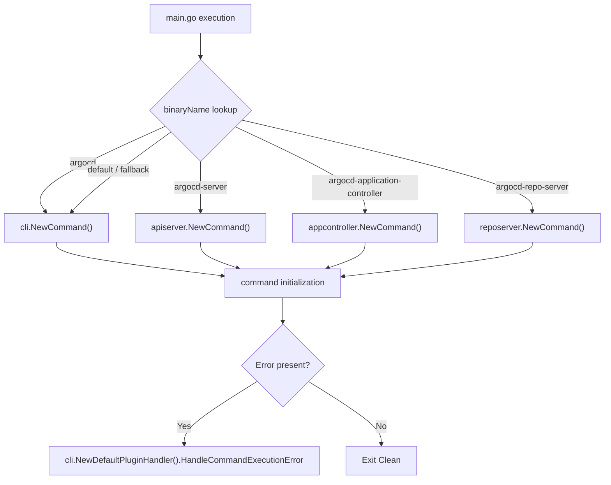

# Overview

<details>
<summary>Relevant source files</summary>

The following files were used as context for generating this wiki page:

- [README.md](https://github.com/argoproj/argo-cd/blob/main/README.md)
- [docs/developer-guide/index.md](https://github.com/argoproj/argo-cd/blob/main/docs/developer-guide/index.md)
- [docs/getting_started.md](https://github.com/argoproj/argo-cd/blob/main/docs/getting_started.md)
- [docs/index.md](https://github.com/argoproj/argo-cd/blob/main/docs/index.md)
- [docs/developer-guide/architecture/components.md](https://github.com/argoproj/argo-cd/blob/main/docs/developer-guide/architecture/components.md)
- [docs/operator-manual/applicationset/Argo-CD-Integration.md](https://github.com/argoproj/argo-cd/blob/main/docs/operator-manual/applicationset/Argo-CD-Integration.md)
- [docs/operator-manual/applicationset/index.md](https://github.com/argoproj/argo-cd/blob/main/docs/operator-manual/applicationset/index.md)
- [docs/operator-manual/core.md](https://github.com/argoproj/argo-cd/blob/main/docs/operator-manual/core.md)
- [docs/developer-guide/architecture/authz-authn.md](https://github.com/argoproj/argo-cd/blob/main/docs/developer-guide/architecture/authz-authn.md)
- [docs/operator-manual/installation.md](https://github.com/argoproj/argo-cd/blob/main/docs/operator-manual/installation.md)
- [docs/operator-manual/architecture.md](https://github.com/argoproj/argo-cd/blob/main/docs/operator-manual/architecture.md)
- [docs/core_concepts.md](https://github.com/argoproj/argo-cd/blob/main/docs/core_concepts.md)
- [docs/user-guide/index.md](https://github.com/argoproj/argo-cd/blob/main/docs/user-guide/index.md)
- [docs/operator-manual/index.md](https://github.com/argoproj/argo-cd/blob/main/docs/operator-manual/index.md)
- [docs/understand_the_basics.md](https://github.com/argoproj/argo-cd/blob/main/docs/understand_the_basics.md)
- [docs/try_argo_cd_locally.md](https://github.com/argoproj/argo-cd/blob/main/docs/try_argo_cd_locally.md)
- [manifests/README.md](https://github.com/argoproj/argo-cd/blob/main/manifests/README.md)
- [docs/user-guide/ci_automation.md](https://github.com/argoproj/argo-cd/blob/main/docs/user-guide/ci_automation.md)
- [docs/user-guide/application_sources.md](https://github.com/argoproj/argo-cd/blob/main/docs/user-guide/application_sources.md)
- [docs/developer-guide/running-locally.md](https://github.com/argoproj/argo-cd/blob/main/docs/developer-guide/running-locally.md)
- [CONTRIBUTING.md](https://github.com/argoproj/argo-cd/blob/main/CONTRIBUTING.md)
- [docs/user-guide/projects.md](https://github.com/argoproj/argo-cd/blob/main/docs/user-guide/projects.md)
- [docs/proposals/manifest-hydrator.md](https://github.com/argoproj/argo-cd/blob/main/docs/proposals/manifest-hydrator.md)
- [docs/operator-manual/upgrading/overview.md](https://github.com/argoproj/argo-cd/blob/main/docs/operator-manual/upgrading/overview.md)
- [cmd/main.go](https://github.com/argoproj/argo-cd/blob/main/cmd/main.go)
</details>

## Overview

Argo CD is a declarative GitOps continuous delivery tool designed to automate application deployments and lifecycle management across Kubernetes clusters using version-controlled repositories as the single source of truth. By continuously reconciling live cluster states with desired configurations defined in Git, Argo CD detects configuration drift, provides real-time visibility, and simplifies multi-environment deployments through robust core components, flexible installation modes, and comprehensive security controls.

Sources: [README.md:22-22](https://github.com/argoproj/argo-cd/blob/main/README.md#L22-L22), [docs/index.md:7-7](https://github.com/argoproj/argo-cd/blob/main/docs/index.md#L7-L7), [docs/operator-manual/architecture.md:30-34](https://github.com/argoproj/argo-cd/blob/main/docs/operator-manual/architecture.md#L30-L34)

## Core Declarative Concepts and Resources

### Core Declarative Concepts and Resources

Argo CD relies on fundamental GitOps terminology and custom resource definitions to model continuous delivery workflows. An **Application** is a Custom Resource Definition (CRD) representing a group of Kubernetes resources defined by manifests in a version-controlled repository. The desired configuration stored in Git constitutes the **Target state**, while the actual deployed resources running in the cluster represent the **Live state**. 

Sources: [docs/core_concepts.md:6-9](https://github.com/argoproj/argo-cd/blob/main/docs/core_concepts.md#L6-L9)

### Application Lifecycle and States

The continuous reconciliation engine evaluates application health and synchronization by comparing repository manifests against cluster resources:
* **Sync status**: Determines whether the live state matches the target state.
* **Sync**: The process of applying changes to move an application to its target state.
* **Refresh**: Compares the latest code in Git with the live state to calculate differences.
* **Health**: Evaluates whether the application is running correctly and capable of serving requests.
* **Tool**: Specifies the configuration management tool used to generate manifests from a directory of files, such as Kustomize.

Sources: [docs/core_concepts.md:10-15](https://github.com/argoproj/argo-cd/blob/main/docs/core_concepts.md#L10-L15)

### Project Abstractions and Multi-Tenancy

Projects provide logical groupings of applications to isolate workloads when multiple teams share an Argo CD instance. Every application belongs to a single project; if unspecified, it defaults to the `default` project, which is automatically created and initially configured with permissive access rules.

Sources: [docs/user-guide/projects.md:3-12](https://github.com/argoproj/argo-cd/blob/main/docs/user-guide/projects.md#L3-L12)

```yaml
spec:
  sourceRepos:
  - '*'
  destinations:
  - namespace: '*'
    server: '*'
  clusterResourceWhitelist:
  - group: '*'
    kind: '*'
```

Sources: [docs/user-guide/projects.md:15-24](https://github.com/argoproj/argo-cd/blob/main/docs/user-guide/projects.md#L15-L24)

> [!WARNING]
> The `default` project is useful for initial testing, but it is recommended to create dedicated projects with explicit source, destination, and resource permissions. To remove all permissions from the `default` project, apply an `AppProject` manifest setting `sourceRepos: []` and a namespace resource blacklist.

Sources: [docs/user-guide/projects.md:26-42](https://github.com/argoproj/argo-cd/blob/main/docs/user-guide/projects.md#L26-L42)

### Project Restriction Rules and Evaluation

AppProjects enforce granular security constraints across three major dimensions: source repositories, destination clusters/namespaces, and Kubernetes resource kinds.

| Restriction Type | Evaluation Logic | Default Rule Behavior |
| :--- | :--- | :--- |
| **Source Repositories** | Permitted if *any* allow rule matches and *no* deny rule (prefixed with `!`) rejects the source. | Default project permits `*`. |
| **Destination Clusters & Namespaces** | Permitted if *any* allow rule matches and *no* deny rule rejects the destination. For clusters, the server URL is used for matching. | Default project permits `server: "*"` and `namespace: "*"`. |
| **Resource Kinds** | Namespace-scoped resources are restricted via a blacklist, whereas cluster-scoped resources are restricted via a whitelist (`clusterResourceWhitelist`). | Whitelists also control which child resources appear in the Application UI resource tree. |

Sources: [docs/user-guide/projects.md:83-87](https://github.com/argoproj/argo-cd/blob/main/docs/user-guide/projects.md#L83-L87), [docs/user-guide/projects.md:120-127](https://github.com/argoproj/argo-cd/blob/main/docs/user-guide/projects.md#L120-L127), [docs/user-guide/projects.md:136-136](https://github.com/argoproj/argo-cd/blob/main/docs/user-guide/projects.md#L136-L136)

> [!NOTE]
> When a project uses `namespaceResourceWhitelist`, it also controls which child resources appear in the Application resource tree in the UI. Any child resource whose GroupKind is not permitted by the project is omitted from the tree, even if it exists and is healthy in the cluster.

Sources: [docs/user-guide/projects.md:136-136](https://github.com/argoproj/argo-cd/blob/main/docs/user-guide/projects.md#L136-L136)

## High-Level Architecture and Components

### High-Level Architecture and Components

Argo CD employs a component-based architecture designed to decouple system responsibilities into dedicated deployable units. This separation achieves modularity through clear interface contracts, single responsibility for improved system cohesiveness, and high reusability of services across the platform. 

Sources: [docs/developer-guide/architecture/components.md:3-17](https://github.com/argoproj/argo-cd/blob/main/docs/developer-guide/architecture/components.md#L3-L17)

### Core Architectural Layers and Components

The default Argo CD installation organizes its components and Kubernetes controllers across four distinct logical layers, maintaining a strict top-down dependency hierarchy where upper layers may depend on lower layers, but lower layers never depend on upper layers.

* **UI Layer**: Composed of the **Webapp** and **CLI** components, forming the primary presentation and user interaction entrypoints.
* **Application Layer**: Provides the capabilities required to support the presentation layer, primarily centered around the **API Server**.
* **Core Layer**: Implements the primary GitOps reconciliation and generation engines via the **Application Controller**, **ApplicationSet Controller**, and **Repo Server**, operating alongside auxiliary data stores like **Redis**.
* **Infra Layer**: Encompasses underlying infrastructure dependencies including the **Kube API**, **Git** repositories (including Helm and OCI artifact registries), and **Dex** for external OIDC authentication.

Sources: [docs/developer-guide/architecture/components.md:34-50](https://github.com/argoproj/argo-cd/blob/main/docs/developer-guide/architecture/components.md#L34-L50), [docs/developer-guide/architecture/components.md:103-108](https://github.com/argoproj/argo-cd/blob/main/docs/developer-guide/architecture/components.md#L103-L108)

### Component Responsibilities

| Component | Layer | Primary Responsibility |
| :--- | :--- | :--- |
| **API Server** | Application | Exposes the gRPC/REST API powering the Webapp and CLI, handling application management, status reporting, syncing, repository/cluster credential management, authentication, and RBAC enforcement. |
| **Repository Server** | Core | Maintains a local cache of Git repositories and generates target Kubernetes manifests given a repo URL, revision, path, and template parameters or Helm values. |
| **Application Controller** | Core | Continuously monitors running applications, reconciles live cluster state against desired state from Git, detects `OutOfSync` states, and executes user-defined lifecycle hooks (PreSync, Sync, PostSync). |
| **ApplicationSet Controller** | Core | Reconciles `ApplicationSet` custom resources, acting as an application factory that generates, updates, or deletes child `Application` resources within the Argo CD namespace based on generator parameters. |
| **Redis** | Core / Infra | Provides an internal caching layer to reduce redundant request load against the Kubernetes API server and Git providers, while supporting UI operations. |

Sources: [docs/developer-guide/architecture/components.md:84-95](https://github.com/argoproj/argo-cd/blob/main/docs/developer-guide/architecture/components.md#L84-L95), [docs/operator-manual/architecture.md:9-32](https://github.com/argoproj/argo-cd/blob/main/docs/operator-manual/architecture.md#L9-L32), [docs/operator-manual/applicationset/Argo-CD-Integration.md:3-21](https://github.com/argoproj/argo-cd/blob/main/docs/operator-manual/applicationset/Argo-CD-Integration.md#L3-L21)

> [!NOTE]
> Kubernetes controllers (such as the Application and ApplicationSet controllers) are not categorized as standard modular components because they rely on proprietary Custom Resource Definitions (CRDs) rather than generic service interfaces.

Sources: [docs/developer-guide/architecture/components.md:19-22](https://github.com/argoproj/argo-cd/blob/main/docs/developer-guide/architecture/components.md#L19-L22)

### ApplicationSet Controller Integration

The ApplicationSet controller supplements core Argo CD by enabling multi-cluster and monorepo automation via `ApplicationSet` manifests. Its sole responsibility is managing `Application` resources within the Argo CD namespace; it does not directly modify deployed Kubernetes workloads or connect to destination clusters. 

Sources: [docs/operator-manual/applicationset/Argo-CD-Integration.md:3-11](https://github.com/argoproj/argo-cd/blob/main/docs/operator-manual/applicationset/Argo-CD-Integration.md#L3-L11), [docs/operator-manual/applicationset/index.md:5-15](https://github.com/argoproj/argo-cd/blob/main/docs/operator-manual/applicationset/index.md#L5-L15)

> [!WARNING]
> All `ApplicationSet` resources and the ApplicationSet controller itself must be installed in the exact same namespace as Argo CD. Resources deployed in other namespaces are ignored unless cross-namespace AppSet support is explicitly enabled.

Sources: [docs/operator-manual/applicationset/Argo-CD-Integration.md:13-17](https://github.com/argoproj/argo-cd/blob/main/docs/operator-manual/applicationset/Argo-CD-Integration.md#L13-L17)

## Authentication and Access Control

### Overview

Authentication and authorization in Argo CD are strictly separated within the API server codebase, coordinating across multiple logical layers including HTTP connection multiplexing, gRPC services, session management, and role-based access control (RBAC). Incoming requests arrive at port 8080 and are processed by a connection multiplexer before traversing authentication interceptors or middleware.

Sources: [docs/developer-guide/architecture/authz-authn.md:3-18](https://github.com/argoproj/argo-cd/blob/main/docs/developer-guide/architecture/authz-authn.md#L3-L18)

### Authentication Flow and Logical Elements

The API server uses distinct processing pipelines depending on whether an incoming connection targets gRPC or standard HTTP endpoints. The underlying elements collaborate to inspect headers, manage sessions, and enforce security policies.

| Element ID & Name | Type / Implementation | Primary Responsibility & Role |
| :--- | :--- | :--- |
| **1. Cmux** | [cmux][1] Library | Inspects incoming connections on port 8080; delegates `http1.x` traffic to the HTTP mux, and `http2` traffic with `content-type: application/grpc` to the gRPC Server. |
| **2. HTTP mux** | Standard [ServeMux][8] | Handles non-gRPC requests and serves a unified REST API to the web UI. |
| **3. gRPC-gateway** | [grpc-gateway][2] Library | Translates internal gRPC services into REST endpoints, enabling web UI access to core gRPC services. |
| **4. Server** | Internal gRPC Server | Manages and routes incoming gRPC requests. |
| **5. AuthN** | gRPC Interceptor | Automatically triggers authentication logic for every incoming gRPC request. |
| **6. Session Manager** | Core Object | Verifies authentication token validity, optionally delegating verification to an external AuthN provider. |
| **7. AuthN Provider** | Plug-in Component | Handles external authentication functionality, including login flows and token verification. |
| **8. Service Method** | Business Logic | Executes core capabilities (e.g., `List Applications`) and invokes RBAC enforcement. |
| **9. RBAC** | Enforcement Engine | Validates incoming request actions against predefined rules configured on the API server or `Project` CRD. |
| **10. Casbin** | [Casbin][5] Library | Enforces the underlying RBAC rules. |
| **11. AuthN Middleware** | HTTP Middleware | Verifies tokens for non-gRPC HTTP services requiring authentication. |
| **12. HTTP Handler** | Business Logic | Handles non-gRPC business logic and invokes RBAC enforcement functions. |

Sources: [docs/developer-guide/architecture/authz-authn.md:41-101](https://github.com/argoproj/argo-cd/blob/main/docs/developer-guide/architecture/authz-authn.md#L41-L101)

> [!NOTE]
> Service methods and HTTP handlers are directly responsible for invoking RBAC enforcement functions to validate whether an authenticated user holds sufficient permissions before executing any requested business logic.

Sources: [docs/developer-guide/architecture/authz-authn.md:77-81](https://github.com/argoproj/argo-cd/blob/main/docs/developer-guide/architecture/authz-authn.md#L77-L81), [docs/developer-guide/architecture/authz-authn.md:95-100](https://github.com/argoproj/argo-cd/blob/main/docs/developer-guide/architecture/authz-authn.md#L95-L100)

## Deployment and Installation Modes

### Overview

Argo CD provides two primary installation and deployment paradigms: multi-tenant installations and standalone core headless installations. Platform teams typically maintain multi-tenant deployments to service multiple application developer teams across an organization, whereas cluster administrators seeking a lightweight, single-user footprint rely on Argo CD Core. 

Sources: [docs/operator-manual/installation.md:3-8](https://github.com/argoproj/argo-cd/blob/main/docs/operator-manual/installation.md#L3-L8), [docs/operator-manual/installation.md:57-64](https://github.com/argoproj/argo-cd/blob/main/docs/operator-manual/installation.md#L57-L64)

### Multi-Tenant Operational Models

Multi-tenant installations expose the full Argo CD API server, enabling end-users to interact via the web UI or the `argocd` CLI after authenticating with `argocd login <server-host>`. Manifests are structured into non-high-availability variants for evaluation and testing, and high-availability variants tuned for production environments.

| Manifest Bundle | Scope & Privileges | Cluster Target Capabilities |
| :--- | :--- | :--- |
| `install.yaml` / `ha/install.yaml` | Cluster-admin access via `ClusterRoleBinding` bound to a namespace `ServiceAccount`. | Deploys applications into the host cluster (`kubernetes.default.svc`) and external clusters using stored credentials. |
| `namespace-install.yaml` / `ha/namespace-install.yaml` | Namespace-level privileges only; omits cluster roles and CRDs (which must be installed separately from `manifests/crds`). | Deploys applications strictly to external clusters via stored credentials, unless configured otherwise via `argocd cluster add <CONTEXT> --in-cluster --namespace <YOUR NAMESPACE>`. |

Sources: [docs/operator-manual/installation.md:12-55](https://github.com/argoproj/argo-cd/blob/main/docs/operator-manual/installation.md#L12-L55), [manifests/README.md:3-34](https://github.com/argoproj/argo-cd/blob/main/manifests/README.md#L3-L34)

> [!WARNING]
> Changing the installation namespace requires careful adjustment of the `ClusterRoleBinding` subject namespace to avoid permission-related errors. Furthermore, CRDs are excluded from `namespace-install.yaml` and must be applied independently using server-side apply.

Sources: [docs/operator-manual/installation.md:23-26](https://github.com/argoproj/argo-cd/blob/main/docs/operator-manual/installation.md#L23-L26), [docs/operator-manual/installation.md:39-45](https://github.com/argoproj/argo-cd/blob/main/docs/operator-manual/installation.md#L39-L45)

### Core Standalone Mode

Argo CD Core runs Argo CD in headless mode by applying `core-install.yaml`. This mode excludes features such as the Argo CD RBAC model, the persistent Argo CD API server, the notification controller, and OIDC-based authentication. Multi-tenancy is restricted to GitOps-based permissions via git push control.

Sources: [docs/operator-manual/core.md:5-24](https://github.com/argoproj/argo-cd/blob/main/docs/operator-manual/core.md#L5-L24), [docs/operator-manual/installation.md:59-66](https://github.com/argoproj/argo-cd/blob/main/docs/operator-manual/installation.md#L59-L66)

Although core mode omits the persistent API server, users can still execute CLI commands or launch the web UI locally. Running `argocd login --core` spawns a temporary, local API server process tied to the CLI session that handles requests transparently and terminates upon completion. Similarly, executing `argocd admin dashboard -n argocd` exposes the web UI locally at `http://localhost:8080`.

Sources: [docs/operator-manual/core.md:71-100](https://github.com/argoproj/argo-cd/blob/main/docs/operator-manual/core.md#L71-L100)

> [!NOTE]
> When operating in core mode, authentication relies entirely on Kubernetes RBAC. Any user or process executing commands through the CLI must possess sufficient permissions within the Argo CD namespace to access `Application` and `ApplicationSet` resources.

Sources: [docs/operator-manual/core.md:76-79](https://github.com/argoproj/argo-cd/blob/main/docs/operator-manual/core.md#L76-L79)

## Application Sources and Ecosystem Integration

### Overview

Argo CD supports multiple configuration management tools for defining Kubernetes manifests in production, alongside development mechanisms for syncing local directories. Additionally, CI automation pipelines and proposed manifest hydration patterns streamline the workflow between dry configuration sources and deployed cluster states.

Sources: [docs/user-guide/application_sources.md:3-16](https://github.com/argoproj/argo-cd/blob/main/docs/user-guide/application_sources.md#L3-L16), [docs/user-guide/ci_automation.md:1-55](https://github.com/argoproj/argo-cd/blob/main/docs/user-guide/ci_automation.md#L1-L55), [docs/proposals/manifest-hydrator.md:17-35](https://github.com/argoproj/argo-cd/blob/main/docs/proposals/manifest-hydrator.md#L17-L35)

### Supported Configuration Management Tools

Production deployments rely on several manifest definition approaches managed natively or via configuration management plugins. For development purposes, users possessing `override` permissions can upload local manifests directly.

| Tool / Source Type | Description | Operational Scope |
| :--- | :--- | :--- |
| **Kustomize** | Overlay and base manifest customizer. | Production manifests |
| **Helm** | Packaged chart rendering. | Production manifests |
| **OCI** | Open Container Initiative artifact repositories. | Production manifests |
| **YAML / JSON / Jsonnet** | Direct directories of configuration files. | Production manifests |
| **Custom CMP** | Any custom config management tool configured as a config management plugin. | Production manifests |
| **Local Sync** | Uploading local manifests directly via `argocd app sync APPNAME --local /path/to/dir/`. | Development only (requires `override` permission) |

Sources: [docs/user-guide/application_sources.md:3-21](https://github.com/argoproj/argo-cd/blob/main/docs/user-guide/application_sources.md#L3-L21)

### CI Automation Pipelines

In a GitOps pipeline, container images are built and published, followed by updates to configuration repositories using templating tools before pushing changes to Git.

```bash
docker build -t mycompany/guestbook:v2.0 .
docker push mycompany/guestbook:v2.0

git clone https://github.com/mycompany/guestbook-config.git
cd guestbook-config

# kustomize
kustomize edit set image mycompany/guestbook:v2.0

# plain yaml
kubectl patch --local -f config-deployment.yaml -p '{"spec":{"template":{"spec":{"containers":[{"name":"guestbook","image":"mycompany/guestbook:v2.0"}]}}}}' -o yaml > config-deployment.yaml

git commit -am "Update guestbook to v2.0"
git push
```

Sources: [docs/user-guide/ci_automation.md:11-37](https://github.com/argoproj/argo-cd/blob/main/docs/user-guide/ci_automation.md#L11-L37)

> [!TIP]
> Using a separate Git repository to hold Kubernetes manifests (distinct from your application source code) is highly recommended. If automated synchronization is configured, manual syncing via the CLI is unnecessary because the controller automatically detects new configurations.

Sources: [docs/user-guide/ci_automation.md:20-23](https://github.com/argoproj/argo-cd/blob/main/docs/user-guide/ci_automation.md#L20-L23), [docs/user-guide/ci_automation.md:53-55](https://github.com/argoproj/argo-cd/blob/main/docs/user-guide/ci_automation.md#L53-L55)

### Manifest Hydrator Proposal

The manifest hydrator proposal introduces the "rendered manifests pattern" as a first-class feature, operating in two modes: `push-to-deploy` (pushing hydrated manifests to the deployment branch) and `push-to-stage` (pushing to a separate branch for integration with automated promotion systems).

Sources: [docs/proposals/manifest-hydrator.md:17-35](https://github.com/argoproj/argo-cd/blob/main/docs/proposals/manifest-hydrator.md#L17-L35)

> [!WARNING]
> The `sourceHydrator` field is mutually exclusive with `source` and `sources`. Configuring both requires throwing an error or ignoring the others. Additionally, environment variables such as `ARGOCD_APP_NAME`, `ARGOCD_APP_NAMESPACE`, `KUBE_VERSION`, and `KUBE_API_VERSIONS` are intentionally omitted during hydration to preserve reproducibility.

Sources: [docs/proposals/manifest-hydrator.md:123-126](https://github.com/argoproj/argo-cd/blob/main/docs/proposals/manifest-hydrator.md#L123-L126), [docs/proposals/manifest-hydrator.md:313-319](https://github.com/argoproj/argo-cd/blob/main/docs/proposals/manifest-hydrator.md#L313-L319)

## Developer Guide and Local Environment

### Overview

The Argo CD developer workflow supports building, testing, and running components locally outside of a Kubernetes cluster to accelerate feature development. Contributors deploy Argo CD installation manifests to a local Kubernetes cluster (such as Kind, Minikube, or K3d) and then scale down the cluster-resident stateful sets and deployments so that local processes can assume resource configuration ownership.

Sources: [docs/developer-guide/index.md:57-62](https://github.com/argoproj/argo-cd/blob/main/docs/developer-guide/index.md#L57-L62), [docs/developer-guide/running-locally.md:9-17](https://github.com/argoproj/argo-cd/blob/main/docs/developer-guide/running-locally.md#L9-L17)

### CLI Entrypoint Execution Flow

The primary entrypoint for Argo CD binaries is defined in `cmd/main.go`, which inspects the executable base name or the `ARGOCD_BINARY_NAME` environment variable via `filepath.Base(os.Args[0])` and dispatches execution to the corresponding command package.



Sources: [cmd/main.go:27-104](https://github.com/argoproj/argo-cd/blob/main/cmd/main.go#L27-L104)

The call chain during startup proceeds from `main()` through command resolution and error handling: `main()` → `filepath.Base()` → `cli.NewCommand()` (or service-specific `NewCommand()`) → error handling via `HandleCommandExecutionError()`. If execution fails and a plugin error is returned, the handler extracts the exit code via `errors.As(pluginErr, &exitErr)` and terminates with `os.Exit(exitErr.ExitCode())`.

Sources: [cmd/main.go:36-103](https://github.com/argoproj/argo-cd/blob/main/cmd/main.go#L36-L103)

### Binary Routing Reference

| Binary Name / Constant | Target Command Constructor | CLI Mode Flag |
| :--- | :--- | :--- |
| `common.CommandCLI` (`argocd`) | `cli.NewCommand()` | `isArgocdCLI = true` |
| `common.CommandServer` (`argocd-server`) | `apiserver.NewCommand()` | `isArgocdCLI = false` |
| `common.CommandApplicationController` (`argocd-application-controller`) | `appcontroller.NewCommand()` | `isArgocdCLI = false` |
| `common.CommandRepoServer` (`argocd-repo-server`) | `reposerver.NewCommand()` | `isArgocdCLI = false` |
| `common.CommandCMPServer` (`argocd-cmp-server`) | `cmpserver.NewCommand()` | `isArgocdCLI = true` |
| `common.CommandCommitServer` (`argocd-commit-server`) | `commitserver.NewCommand()` | `isArgocdCLI = false` |
| `common.CommandDex` (`argocd-dex`) | `dex.NewCommand()` | `isArgocdCLI = false` |
| `common.CommandNotifications` (`argocd-notifications`) | `notification.NewCommand()` | `isArgocdCLI = false` |
| `common.CommandGitAskPass` (`argocd-git-ask-pass`) | `gitaskpass.NewCommand()` | `isArgocdCLI = true` |
| `common.CommandApplicationSetController` (`argocd-applicationset-controller`) | `applicationset.NewCommand()` | `isArgocdCLI = false` |
| `common.CommandK8sAuth` (`argocd-k8s-auth`) | `k8sauth.NewCommand()` | `isArgocdCLI = true` |

Sources: [cmd/main.go:46-77](https://github.com/argoproj/argo-cd/blob/main/cmd/main.go#L46-L77)

> [!WARNING]
> When executing CLI binaries or plugins, `command.SilenceErrors = true` and `command.SilenceUsage = true` are explicitly enforced whenever `isArgocdCLI` evaluates to true, preventing default cobra error printing so plugin and manual error handlers can manage formatting.

Sources: [cmd/main.go:79-85](https://github.com/argoproj/argo-cd/blob/main/cmd/main.go#L79-L85)

### Local Toolchain Execution Options

Developers can run local services using either a virtualized toolchain (running services inside containers via Docker/Podman) or a local toolchain (running processes natively on the host machine).

| Execution Target | Command | Exposed Ports |
| :--- | :--- | :--- |
| **Virtualized Toolchain** | `make start` (or `DOCKER=podman make start`) | API Server: `8080`, UI Server: `4000`, Helm Registry: `5000` |
| **Local Toolchain (`make start-local`)** | `make start-local ARGOCD_GPG_ENABLED=false` | API Server: `8080`, UI Server: `4000`, Helm Registry: `5000` |
| **Local Toolchain (`make run`)** | `make run ARGOCD_GPG_ENABLED=false` | API Server: `8080`, UI Server: `4000`, Helm Registry: `5000` |
| **Local Toolchain (`goreman`)** | `ARGOCD_GPG_ENABLED=false && goreman start` | API Server: `8080`, UI Server: `4000`, Helm Registry: `5000` |

Sources: [docs/developer-guide/running-locally.md:52-108](https://github.com/argoproj/argo-cd/blob/main/docs/developer-guide/running-locally.md#L52-L108)

> [!TIP]
> To avoid passing `--plaintext --insecure` to every CLI command when testing against a local API server, export the environment variables `export ARGOCD_SERVER=127.0.0.1:8080` and `export ARGOCD_OPTS="--plaintext --insecure"` in your shell session.

Sources: [docs/developer-guide/running-locally.md:75-80](https://github.com/argoproj/argo-cd/blob/main/docs/developer-guide/running-locally.md#L75-L80)

## Related

- [[Quick Start]]
- [[Project Structure]]
- [[Core Concepts]]

