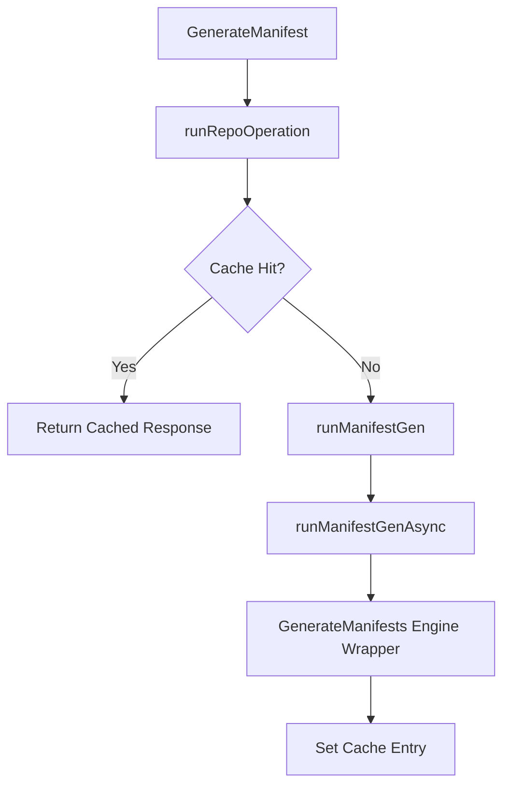

# Project Structure

<details>
<summary>Relevant source files</summary>

The following files were used as context for generating this wiki page:

- [applicationset/services/scm_provider/testdata/repos_gitea_go-sdk_contents_gitea.json](https://github.com/argoproj/argo-cd/blob/main/applicationset/services/scm_provider/testdata/repos_gitea_go-sdk_contents_gitea.json)
- [mkdocs.yml](https://github.com/argoproj/argo-cd/blob/main/mkdocs.yml)
- [reposerver/repository/repository.go](https://github.com/argoproj/argo-cd/blob/main/reposerver/repository/repository.go)
</details>

## Overview

The Argo CD codebase is organized into discrete architectural subsystems that work together to provide continuous deployment, manifest generation, and lifecycle management for Kubernetes applications. This structure encompasses core repository server operations, application set controllers, command-line interfaces, web frontends, API packages, and project configuration frameworks.

Sources: [mkdocs.yml:1-288](https://github.com/argoproj/argo-cd/blob/main/mkdocs.yml#L1-L288)

By separating concerns across specialized packages—such as repository interaction management in `reposerver/repository/repository.go`, source control provider integrations in `applicationset/services/scm_provider/testdata/repos_gitea_go-sdk_contents_gitea.json`, and comprehensive documentation and tooling setup in `mkdocs.yml`—the project maintains modularity, security, and testability across all system components.

Sources: [applicationset/services/scm_provider/testdata/repos_gitea_go-sdk_contents_gitea.json:1-2039](https://github.com/argoproj/argo-cd/blob/main/applicationset/services/scm_provider/testdata/repos_gitea_go-sdk_contents_gitea.json#L1-L2039), [mkdocs.yml:1-288](https://github.com/argoproj/argo-cd/blob/main/mkdocs.yml#L1-L288), [reposerver/repository/repository.go:1-1250](https://github.com/argoproj/argo-cd/blob/main/reposerver/repository/repository.go#L1-L1250)

## Repository Server and Manifest Generation

### Overview

The repository server subsystem manages interactions with Git, Helm, and OCI registries to execute manifest generation. It centers around the `Service` type defined in `reposerver/repository/repository.go`, which implements repository management, caching, concurrency limiting, and security validations such as out-of-bounds symlink checks.

Sources: [reposerver/repository/repository.go:91-111](https://github.com/argoproj/argo-cd/blob/main/reposerver/repository/repository.go#L91-L111)

### Service Initialization and Configuration Constants

The subsystem is configured via `RepoServerInitConstants` and instantiated through `NewService`, which sets up randomized temporary paths for Git repositories, Helm charts, and OCI artifacts alongside resource semaphores.

Sources: [reposerver/repository/repository.go:113-174](https://github.com/argoproj/argo-cd/blob/main/reposerver/repository/repository.go#L113-L174)

```go
func NewService(metricsServer *metrics.MetricsServer, cache *cache.Cache, initConstants RepoServerInitConstants, gitCredsStore git.CredsStore, rootDir string) *Service {
	var parallelismLimitSemaphore *semaphore.Weighted
	if initConstants.ParallelismLimit > 0 {
		parallelismLimitSemaphore = semaphore.NewWeighted(initConstants.ParallelismLimit)
	}
	repoLock := NewRepositoryLock()
	return &Service{
		parallelismLimitSemaphore: parallelismLimitSemaphore,
		repoLock:                  repoLock,
		cache:                     cache,
		metricsServer:             metricsServer,
		initConstants:             initConstants,
		rootDir:                   rootDir,
	}
}
```

Sources: [reposerver/repository/repository.go:140-174](https://github.com/argoproj/argo-cd/blob/main/reposerver/repository/repository.go#L140-L174)

### Execution Walkthrough and Manifest Generation

Manifest generation requests flow through a tightly coupled sequence of operations handled by `GenerateManifest`, `runRepoOperation`, `runManifestGen`, and `runManifestGenAsync`.

Sources: [reposerver/repository/repository.go:645-733](https://github.com/argoproj/argo-cd/blob/main/reposerver/repository/repository.go#L645-L733)

1. **`GenerateManifest`**: Receives an `apiclient.ManifestRequest`, starts an OpenTelemetry span, sets up caching callbacks, and delegates execution to `runRepoOperation`.
2. **`runRepoOperation`**: Resolves repository revisions for Git, Helm, or OCI sources, acquires a parallelism semaphore weight if configured, extracts or checks out the target repository path, performs out-of-bounds symlink validation, and invokes the inner operation callback.
3. **`runManifestGen`**: Spawns an asynchronous worker running `runManifestGenAsync` and returns a `ManifestResponsePromise` containing communication channels (`responseCh`, `tarDoneCh`, `errCh`).
4. **`runManifestGenAsync`**: Handles multi-source reference resolutions, invokes `GenerateManifests`, intercepts errors for exponential backoff or pause thresholds, and stores successful responses in the cache before sending them back over `responseCh`.

Sources: [reposerver/repository/repository.go:346-561](https://github.com/argoproj/argo-cd/blob/main/reposerver/repository/repository.go#L346-L561), [reposerver/repository/repository.go:645-733](https://github.com/argoproj/argo-cd/blob/main/reposerver/repository/repository.go#L645-L733), [reposerver/repository/repository.go:826-1032](https://github.com/argoproj/argo-cd/blob/main/reposerver/repository/repository.go#L826-L1032)

> [!WARNING]
> Symlink validation (`checkOutOfBoundsSymlinks`) happens strictly after acquiring directory locks or extracting archives. Bypassing or disabling `AllowOutOfBoundsSymlinks` without caution can expose the repository server to arbitrary file read vulnerabilities via malicious symlinks inside cloned repositories or OCI images.

Sources: [reposerver/repository/repository.go:423-437](https://github.com/argoproj/argo-cd/blob/main/reposerver/repository/repository.go#L423-L437), [reposerver/repository/repository.go:492-507](https://github.com/argoproj/argo-cd/blob/main/reposerver/repository/repository.go#L492-L507)

### Subsystem Constants and Configuration

The behavior of the repository server is governed by several core constants and markers defined in `repository.go`:

Sources: [reposerver/repository/repository.go:78-85](https://github.com/argoproj/argo-cd/blob/main/reposerver/repository/repository.go#L78-L85)

| Constant Name | Value / Type | Purpose |
| :--- | :--- | :--- |
| `cachedManifestGenerationPrefix` | `"Manifest generation error (cached)"` | Prefix applied to error responses returned from cached failed generations. |
| `helmDepUpMarkerFile` | `".argocd-helm-dep-up"` | Marker file indicating Helm dependency updates have been executed. |
| `repoSourceFile` | `".argocd-source.yaml"` | Configuration file for application source overrides. |
| `ociPrefix` | `"oci://"` | Protocol prefix identifying OCI registry chart references. |
| `skipFileRenderingMarker` | `"+argocd:skip-file-rendering"` | Marker string to skip raw file rendering in manifests. |

Sources: [reposerver/repository/repository.go:78-85](https://github.com/argoproj/argo-cd/blob/main/reposerver/repository/repository.go#L78-L85)

## ApplicationSet Subsystem and SCM Providers

### Overview

The ApplicationSet subsystem includes integration with Source Code Management (SCM) providers such as Gitea, GitHub, and GitLab to dynamically discover repositories and pull requests via generators. Test fixtures model these external API interactions, such as repository contents JSON payloads used by SCM provider test suites.

Sources: [applicationset/services/scm_provider/testdata/repos_gitea_go-sdk_contents_gitea.json:1-2039](https://github.com/argoproj/argo-cd/blob/main/applicationset/services/scm_provider/testdata/repos_gitea_go-sdk_contents_gitea.json#L1-L2039)

### SCM Provider Test Fixtures and Repository Structures

Test datasets like `repos_gitea_go-sdk_contents_gitea.json` provide mock responses mirroring Gitea REST API responses for repository content listings. Each entry specifies file attributes, commit SHAs, and download links used when validating SCM provider generator logic without hitting live infrastructure.

Sources: [applicationset/services/scm_provider/testdata/repos_gitea_go-sdk_contents_gitea.json:1-22](https://github.com/argoproj/argo-cd/blob/main/applicationset/services/scm_provider/testdata/repos_gitea_go-sdk_contents_gitea.json#L1-L22)

The JSON payload encodes an array of file and symlink descriptors representing repository contents. For instance, entries include file paths, git blobs, links, and commit references.

Sources: [applicationset/services/scm_provider/testdata/repos_gitea_go-sdk_contents_gitea.json:1-43](https://github.com/argoproj/argo-cd/blob/main/applicationset/services/scm_provider/testdata/repos_gitea_go-sdk_contents_gitea.json#L1-L43)

> [!NOTE]
> SCM provider test datasets simulate complex repository states including standard source files, test files, submodules, and symlinks (such as `agent_darwin.go` targeting `agent_linux.go`), ensuring parsers correctly handle diverse file node types.

Sources: [applicationset/services/scm_provider/testdata/repos_gitea_go-sdk_contents_gitea.json:107-127](https://github.com/argoproj/argo-cd/blob/main/applicationset/services/scm_provider/testdata/repos_gitea_go-sdk_contents_gitea.json#L107-L127)

### Gitea Content Schema Reference

The fixture entries define precise attributes returned by repository content endpoints:

Sources: [applicationset/services/scm_provider/testdata/repos_gitea_go-sdk_contents_gitea.json:2-21](https://github.com/argoproj/argo-cd/blob/main/applicationset/services/scm_provider/testdata/repos_gitea_go-sdk_contents_gitea.json#L2-L21)

| JSON Field | Type | Description |
| :--- | :--- | :--- |
| `name` | String | Filename of the repository object (e.g. `admin_cron.go`). |
| `path` | String | Repository-relative path including directory prefix. |
| `sha` | String | Git blob object SHA-1 hash. |
| `last_commit_sha` | String | SHA-1 hash of the commit that last modified the file. |
| `type` | String | Node classification type (e.g., `file`, `symlink`). |
| `size` | Integer | Size of the file in bytes. |
| `target` | String / Null | Target path for symlink nodes. |
| `_links` | Object | Hyperlinks dictionary containing `self`, `git`, and `html` endpoints. |

Sources: [applicationset/services/scm_provider/testdata/repos_gitea_go-sdk_contents_gitea.json:2-21](https://github.com/argoproj/argo-cd/blob/main/applicationset/services/scm_provider/testdata/repos_gitea_go-sdk_contents_gitea.json#L2-L21)

## Core Utilities and API Packages

### Overview

Internal utility libraries, API type definitions, and engine wrappers support cross-component tasks within the repository server. The `Service` struct coordinates operations across Git, Helm, and OCI repositories, relying on initialization constants, path managers, and caching layers.

Sources: [reposerver/repository/repository.go:91-111](https://github.com/argoproj/argo-cd/blob/main/reposerver/repository/repository.go#L91-L111)

### Service Initialization and Constants

The repository server service is configured via `RepoServerInitConstants`, establishing limits, timeouts, and feature flags. The `NewService` constructor wires these constants into active client factories and synchronization primitives.

Sources: [reposerver/repository/repository.go:113-174](https://github.com/argoproj/argo-cd/blob/main/reposerver/repository/repository.go#L113-L174)

```go
initConstants := repository.RepoServerInitConstants{
    ParallelismLimit:                    150,
    SubmoduleEnabled:                    true,
    AllowOutOfBoundsSymlinks:            false,
    StreamedManifestMaxTarSize:          67108864,
    StreamedManifestMaxExtractedSize:    104857600,
    HelmManifestMaxExtractedSize:        104857600,
    HelmRegistryMaxIndexSize:            104857600,
    OCIManifestMaxExtractedSize:         104857600,
}
```

Sources: [reposerver/repository/repository.go:113-135](https://github.com/argoproj/argo-cd/blob/main/reposerver/repository/repository.go#L113-L135), [reposerver/repository/repository.go:140-174](https://github.com/argoproj/argo-cd/blob/main/reposerver/repository/repository.go#L140-L174)

### Repository Server Configuration Reference

| Constant Field | Type | Purpose | Sources |
| :--- | :--- | :--- | :--- |
| `OCIMediaTypes` | `[]string` | Accepted OCI media types for image fetching. | [reposerver/repository/repository.go:113-135](https://github.com/argoproj/argo-cd/blob/main/reposerver/repository/repository.go#L113-L135) |
| `ParallelismLimit` | `int64` | Maximum concurrent repository operations permitted via weighted semaphore. | [reposerver/repository/repository.go:113-135](https://github.com/argoproj/argo-cd/blob/main/reposerver/repository/repository.go#L113-L135) |
| `PauseGenerationAfterFailedGenerationAttempts` | `int` | Threshold of consecutive failures before pausing manifest generation. | [reposerver/repository/repository.go:113-135](https://github.com/argoproj/argo-cd/blob/main/reposerver/repository/repository.go#L113-L135) |
| `SubmoduleEnabled` | `bool` | Flag controlling whether Git submodules are recursively fetched. | [reposerver/repository/repository.go:113-135](https://github.com/argoproj/argo-cd/blob/main/reposerver/repository/repository.go#L113-L135) |

Sources: [reposerver/repository/repository.go:113-135](https://github.com/argoproj/argo-cd/blob/main/reposerver/repository/repository.go#L113-L135)

### Operation Execution and Caching Call Chain

Manifest generation and repository operations follow a strict execution flow through `Service` methods. The request enters `GenerateManifest`, passes through execution wrappers, handles asynchronous promises, and consults the cache.

Sources: [reposerver/repository/repository.go:645-733](https://github.com/argoproj/argo-cd/blob/main/reposerver/repository/repository.go#L645-L733)



Sources: [reposerver/repository/repository.go:645-733](https://github.com/argoproj/argo-cd/blob/main/reposerver/repository/repository.go#L645-L733), [reposerver/repository/repository.go:826-1032](https://github.com/argoproj/argo-cd/blob/main/reposerver/repository/repository.go#L826-L1032)

1. **`GenerateManifest`**: Validates multi-source ref-only shortcuts or delegates to `runRepoOperation` after creating an OpenTelemetry trace span.
2. **`runRepoOperation`**: Resolves repository revisions (OCI, Helm, or Git), acquires parallelism semaphores via `settings.sem.Acquire`, checks out revisions under `repoLock`, and invokes the operation callback.
3. **`runManifestGen`**: Instantiates a `ManifestResponsePromise` with buffered channels (`responseCh`, `tarDoneCh`, `errCh`) and spawns `runManifestGenAsync` as a background goroutine.
4. **`runManifestGenAsync`**: Resolves multi-source dependencies, calls `GenerateManifests`, and stores successful responses or consecutive failure metrics in the cache.

Sources: [reposerver/repository/repository.go:346-561](https://github.com/argoproj/argo-cd/blob/main/reposerver/repository/repository.go#L346-L561), [reposerver/repository/repository.go:645-733](https://github.com/argoproj/argo-cd/blob/main/reposerver/repository/repository.go#L645-L733), [reposerver/repository/repository.go:826-1032](https://github.com/argoproj/argo-cd/blob/main/reposerver/repository/repository.go#L826-L1032)

> [!WARNING]
> During multi-source manifest generation, referencing multiple distinct revisions for the same repository URL triggers an immediate error in `runManifestGenAsync`, preventing conflicting checkouts under the shared root path.

Sources: [reposerver/repository/repository.go:899-903](https://github.com/argoproj/argo-cd/blob/main/reposerver/repository/repository.go#L899-L903)

> [!TIP]
> Symlink validation results are cached in-memory using `gocache` with a 12-hour expiration and wrapped in `sync.OnceValue` per root path and version to avoid redundant filesystem traversals.

Sources: [reposerver/repository/repository.go:108-108](https://github.com/argoproj/argo-cd/blob/main/reposerver/repository/repository.go#L108-L108), [reposerver/repository/repository.go:626-643](https://github.com/argoproj/argo-cd/blob/main/reposerver/repository/repository.go#L626-L643)

### Design Trade-Offs in Repository Concurrency and Caching

| Design Choice | Benefit | Cost |
| :--- | :--- | :--- |
| **Weighted Semaphore Parallelism Limit** (`semaphore.Weighted`) | Prevents resource exhaustion and OOM events under high concurrent repository generation load. | Requests arriving past the limit experience queueing wait times tracked by metrics server observations. |
| **Asynchronous Manifest Generation Channels** (`ManifestResponsePromise`) | Allows repository read locks to be released early (especially for CMP tarball compression steps) before manifest generation completes. | Requires complex channel multiplexing (`select` blocks) across response, error, and tar-completion channels. |
| **Error Caching with Failure Thresholds** (`PauseGenerationAfterFailedGenerationAttempts`) | Avoids repeatedly pounding broken Git repositories or invalid helm charts on every reconciliation loop. | Suppresses immediate error feedback to users until timeout (`PauseGenerationOnFailureForMinutes`) or request thresholds (`PauseGenerationOnFailureForRequests`) are reached. |

Sources: [reposerver/repository/repository.go:101-101](https://github.com/argoproj/argo-cd/blob/main/reposerver/repository/repository.go#L101-L101), [reposerver/repository/repository.go:398-406](https://github.com/argoproj/argo-cd/blob/main/reposerver/repository/repository.go#L398-L406), [reposerver/repository/repository.go:697-724](https://github.com/argoproj/argo-cd/blob/main/reposerver/repository/repository.go#L697-L724), [reposerver/repository/repository.go:976-1008](https://github.com/argoproj/argo-cd/blob/main/reposerver/repository/repository.go#L976-L1008)

## Command-Line Interface and Web Frontend

### Overview

The repository server service initializes core client managers, temporary paths, and concurrency primitives to handle multi-protocol repository fetching, reference listing, and application discovery. Service initialization configures Git client extractors, OCI clients, and Helm client factories with specific thread safety controls and user-agent settings.

Sources: [reposerver/repository/repository.go:92-111](https://github.com/argoproj/argo-cd/blob/main/reposerver/repository/repository.go#L92-L111)

### Service Initialization and Client Management

The repository service relies on initialization constants defined in `RepoServerInitConstants` to govern parallelism limits, manifest size boundaries, and caching behavior. The `NewService` constructor wires these constants into active client factories and synchronization primitives.

Sources: [reposerver/repository/repository.go:113-174](https://github.com/argoproj/argo-cd/blob/main/reposerver/repository/repository.go#L113-L174)

| Constant Field | Type | Purpose |
| :--- | :--- | :--- |
| `ParallelismLimit` | `int64` | Maximum weight assigned to the weighted semaphore restricting concurrent generation tasks. |
| `SubmoduleEnabled` | `bool` | Controls whether Git submodules are fetched during revision checkout. |
| `MaxCombinedDirectoryManifestsSize` | `resource.Quantity` | Limits the total combined size of manifests generated from a directory source. |
| `AllowOutOfBoundsSymlinks` | `bool` | Bypasses strict validation checks preventing out-of-bounds symbolic links within repositories. |

Sources: [reposerver/repository/repository.go:113-135](https://github.com/argoproj/argo-cd/blob/main/reposerver/repository/repository.go#L113-L135)

> [!WARNING]
> During repository root restoration in `Init()`, the service temporarily grants `0700` permissions to read directory entries and restore git paths via `gogit.PlainOpen`, immediately reverting them back to restrictive `0300` permissions upon completion.

Sources: [reposerver/repository/repository.go:176-209](https://github.com/argoproj/argo-cd/blob/main/reposerver/repository/repository.go#L176-L209)

## Documentation Assets and Project Configuration

### Overview

Documentation assets, site builder setup, and root-level configuration files govern the MkDocs documentation site layout, styling rules, and core integration pipelines. The root configuration file `mkdocs.yml` defines site metadata, third-party analytics properties, navigation trees, and markdown extension behaviors.

Sources: [mkdocs.yml:1-288](https://github.com/argoproj/argo-cd/blob/main/mkdocs.yml#L1-L288)

### Site Configuration and Navigation Structure

The MkDocs build setup enforces strict validation rules and integrates custom CSS and JavaScript assets under `extra_css` and `extra_javascript`. Navigation categories organize the documentation set into major functional areas including operator manuals, user guides, and developer workflows.

Sources: [mkdocs.yml:5-17](https://github.com/argoproj/argo-cd/blob/main/mkdocs.yml#L5-L17)

The configuration file outlines complete navigation hierarchies and theme palettes.

Sources: [mkdocs.yml:18-254](https://github.com/argoproj/argo-cd/blob/main/mkdocs.yml#L18-L254)

Strict build checks and plugins are declared at the bottom of the yaml specification.

Sources: [mkdocs.yml:261-268](https://github.com/argoproj/argo-cd/blob/main/mkdocs.yml#L261-L268)

| Configuration Key | Type | Value / Setting | Purpose |
| :--- | :--- | :--- | :--- |
| `site_name` | `string` | `Argo CD - Declarative GitOps CD for Kubernetes` | Sets the title displayed across documentation pages. |
| `repo_url` | `string` | `https://github.com/argoproj/argo-cd` | Points to the official GitHub repository for source links. |
| `strict` | `bool` | `true` | Fails site generation on warnings or broken links. |
| `theme.name` | `string` | `material` | Specifies the Material for MkDocs theme layout. |

Sources: [mkdocs.yml:264-274](https://github.com/argoproj/argo-cd/blob/main/mkdocs.yml#L264-L274)

> [!NOTE]
> The site theme is configured with light and dark color schemes that automatically adapt to the user's operating system preference (`prefers-color-scheme`), utilizing the teal primary palette for both modes.

Sources: [mkdocs.yml:275-287](https://github.com/argoproj/argo-cd/blob/main/mkdocs.yml#L275-L287)

### Markdown Extensions and Plugins

Text processing is extended through specific Markdown extensions and plugins enabled in the build pipeline. The configuration activates include support, syntax highlighting via codehilite, admonitions, permanent heading permalinks, and superfences for nested code blocks.

Sources: [mkdocs.yml:9-16](https://github.com/argoproj/argo-cd/blob/main/mkdocs.yml#L9-L16)

## Related

- [[Overview]]
- [[CLI Architecture]]

