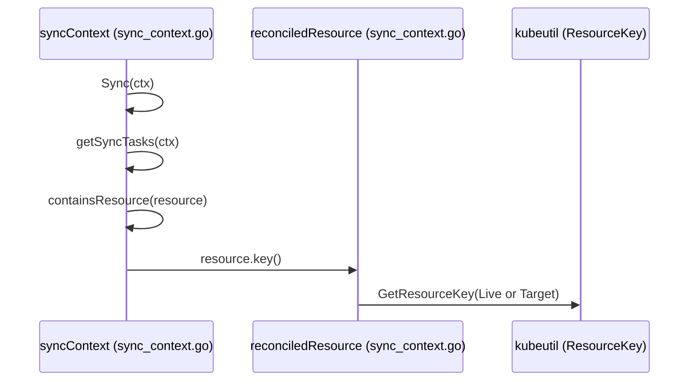
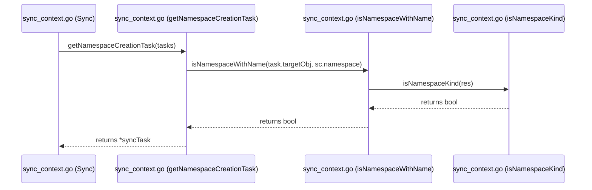

# Reconciliation Engine

Relevant source files

The following files were used as context for generating this wiki page:

- [gitops-engine/pkg/sync/sync_context.go](https://github.com/argoproj/argo-cd/blob/main/gitops-engine/pkg/sync/sync_context.go)
- [controller/sync.go](https://github.com/argoproj/argo-cd/blob/main/controller/sync.go)
- [applicationset/controllers/applicationset_controller.go](https://github.com/argoproj/argo-cd/blob/main/applicationset/controllers/applicationset_controller.go)
- [cmd/argocd/commands/app.go](https://github.com/argoproj/argo-cd/blob/main/cmd/argocd/commands/app.go)

## Overview

The reconciliation engine coordinates the synchronization of desired GitOps manifests with live cluster state through a structured execution pipeline. It handles CLI-driven application triggers, initializes granular sync options and impersonation settings, and groups target resources into ordered waves. The engine applies manifests, manages lifecycle hooks, executes resource pruning, and resolves namespace dependencies while supporting multi-cluster deployments through the ApplicationSet controller. Sources: [gitops-engine/pkg/sync/sync_context.go](https://github.com/argoproj/argo-cd/blob/main/gitops-engine/pkg/sync/sync_context.go#L67-L75), [controller/sync.go](https://github.com/argoproj/argo-cd/blob/main/controller/sync.go#L378-L414), [applicationset/controllers/applicationset_controller.go](https://github.com/argoproj/argo-cd/blob/main/applicationset/controllers/applicationset_controller.go#L119-L179)

## Application Sync Command Interface

### Overview and Initialization

The application sync command interface handles CLI triggers and constructs synchronization requests transmitted to the Argo CD gRPC service. Users invoke synchronization via `argocd app sync APPNAME`, which parses arguments and prepares the runtime payload. Sources: [cmd/argocd/commands/app.go](https://github.com/argoproj/argo-cd/blob/main/cmd/argocd/commands/app.go#L81-L81)

Sources: [cmd/argocd/commands/app.go](https://github.com/argoproj/argo-cd/blob/main/cmd/argocd/commands/app.go#L59-L101)

### Request Lifecycle Execution Walkthrough

When an application synchronization request is initiated from the CLI, it flows through a structured series of validation and dispatch steps before reaching the remote API server. 

1. `NewApplicationSyncCommand()` registers the Cobra command and binds CLI flags such as `--revision`, `--prune`, and `--resource`. Sources: [cmd/argocd/commands/app.go](https://github.com/argoproj/argo-cd/blob/main/cmd/argocd/commands/app.go#L59-L101)
2. The command execution function parses the qualified application name via `argo.ParseFromQualifiedName()` and establishes a gRPC client connection via `headless.NewClientOrDie()`. Sources: [cmd/argocd/commands/app.go](https://github.com/argoproj/argo-cd/blob/main/cmd/argocd/commands/app.go#L387-L391)
3. The client invokes `appIf.Get()` to retrieve the current application spec and verify its existence and namespace scoping. Sources: [cmd/argocd/commands/app.go](https://github.com/argoproj/argo-cd/blob/main/cmd/argocd/commands/app.go#L412-L416)
4. The constructed synchronization options and target revisions populate the `application.ApplicationSyncRequest` payload sent across the wire to trigger state reconciliation. Sources: [cmd/argocd/commands/app.go](https://github.com/argoproj/argo-cd/blob/main/cmd/argocd/commands/app.go#L39-L40)

Sources: [cmd/argocd/commands/app.go](https://github.com/argoproj/argo-cd/blob/main/cmd/argocd/commands/app.go#L39-L40), [cmd/argoproj/argo-cd/blob/main/cmd/argocd/commands/app.go#L59-L101), [cmd/argocd/commands/app.go](https://github.com/argoproj/argo-cd/blob/main/cmd/argocd/commands/app.go#L387-L391), [cmd/argocd/commands/app.go](https://github.com/argoproj/argo-cd/blob/main/cmd/argocd/commands/app.go#L412-L416)

> [!NOTE]
> Qualified application names allow targeting specific namespaces using the `namespace/appname` format, which is parsed by `argo.ParseFromQualifiedName()` before any client request is structured.

Sources: [cmd/argocd/commands/app.go](https://github.com/argoproj/argo-cd/blob/main/cmd/argocd/commands/app.go#L391-L391)

## Sync Context Initialization and Settings

### Overview

Before executing resource application or hook evaluation, the reconciliation engine initializes a granular sync context via `sync.NewSyncContext()` within `SyncAppState()`. This context ties together target cluster configurations, resource states, permission validators, and execution options. Impersonation settings determine whether synchronization operations execute under the controller credential or are delegated to a derived service account mapped through the application's project and destination rules. Sources: [controller/sync.go](https://github.com/argoproj/argo-cd/blob/main/controller/sync.go#L335-L376), [controller/sync.go](https://github.com/argoproj/argo-cd/blob/main/controller/sync.go#L416-L424)

### Sync Context Initialization and Execution Walkthrough

The setup of the synchronization environment follows a deterministic sequence of checks, configuration lookups, and option assembling prior to launching the sync run:

1. `SyncAppState()` verifies that an active operation exists and evaluates sync windows using `syncWindowPreventsSync()`. Sources: [controller/sync.go](https://github.com/argoproj/argo-cd/blob/main/controller/sync.go#L179-L200)
2. Manifests are compared and resolved to a concrete commit SHA via `CompareAppState()`, after which destination cluster REST configs and resource overrides are loaded. Sources: [controller/sync.go](https://github.com/argoproj/argo-cd/blob/main/controller/sync.go#L211-L268)
3. If impersonation is enabled via `settingsMgr.IsImpersonationEnabled()`, `settings.DeriveServiceAccountToImpersonate()` resolves the target service account; missing accounts trigger enforcement errors or fall back to the controller credential. Sources: [controller/sync.go](https://github.com/argoproj/argo-cd/blob/main/controller/sync.go#L335-L376)
4. A slice of `sync.SyncOpt` functional options is populated with loggers, health overrides, permission validators, and resource filters. Sources: [controller/sync.go](https://github.com/argoproj/argo-cd/blob/main/controller/sync.go#L378-L414)
5. `sync.NewSyncContext()` is called with the resolved revision, reconciliation results, client configs, and options, returning a `syncCtx` instance that executes either `syncCtx.Terminate()` or `syncCtx.Sync()`. Sources: [controller/sync.go](https://github.com/argoproj/argo-cd/blob/main/controller/sync.go#L416-L439)

Sources: [controller/sync.go](https://github.com/argoproj/argo-cd/blob/main/controller/sync.go#L179-L200), [controller/sync.go](https://github.com/argoproj/argo-cd/blob/main/controller/sync.go#L211-L268), [controller/sync.go](https://github.com/argoproj/argo-cd/blob/main/controller/sync.go#L335-L376), [controller/sync.go](https://github.com/argoproj/argo-cd/blob/main/controller/sync.go#L378-L414), [controller/sync.go](https://github.com/argoproj/argo-cd/blob/main/controller/sync.go#L416-L439)

> [!WARNING]
> When impersonation enforcement is enabled (`IsImpersonationEnforced() == true`), failing to derive a matching service account aborts the sync operation with an `OperationError` rather than silently falling back to the controller's service account.

Sources: [controller/sync.go](https://github.com/argoproj/argo-cd/blob/main/controller/sync.go#L350-L362)

### Sync Options Reference

| Sync Option Constant / Flag | Type / Default | Purpose |
| :--- | :--- | :--- |
| `EnvVarSyncWaveDelay` (`ARGOCD_SYNC_WAVE_DELAY`) | string env (default: 2s) | Controls the artificial delay in seconds between each sync wave to give controllers time to react. Sources: [controller/sync.go](https://github.com/argoproj/argo-cd/blob/main/controller/sync.go#L45-L48), [controller/sync.go](https://github.com/argoproj/argo-cd/blob/main/controller/sync.go#L714-L722) |
| `FailOnSharedResource=true` | boolean option | Fails the sync operation immediately if managed resources are shared with another Application. Sources: [controller/sync.go](https://github.com/argoproj/argo-cd/blob/main/controller/sync.go#L224-L229) |
| `PrunePropagationPolicy` | string (`background`, `foreground`, `orphan`) | Configures the Kubernetes garbage collection delete propagation policy during resource pruning. Sources: [controller/sync.go](https://github.com/argoproj/argo-cd/blob/main/controller/sync.go#L286-L294) |
| `RespectIgnoreDifferences=true` | boolean option | Normalizes target resources against live states while respecting configured ignore differences fields. Sources: [controller/sync.go](https://github.com/argoproj/argo-cd/blob/main/controller/sync.go#L307-L322) |
| `CreateNamespace=true` | boolean option | Appends a namespace modifier to initialize target namespaces automatically during sync. Sources: [controller/sync.go](https://github.com/argoproj/argo-cd/blob/main/controller/sync.go#L412-L414) |

Sources: [controller/sync.go](https://github.com/argoproj/argo-cd/blob/main/controller/sync.go#L45-L48), [controller/sync.go](https://github.com/argoproj/argo-cd/blob/main/controller/sync.go#L224-L229), [controller/sync.go](https://github.com/argoproj/argo-cd/blob/main/controller/sync.go#L286-L294), [controller/sync.go](https://github.com/argoproj/argo-cd/blob/main/controller/sync.go#L307-L322), [controller/sync.go](https://github.com/argoproj/argo-cd/blob/main/controller/sync.go#L412-L414)

### Design Trade-Offs in Sync Context Configuration

| Design Choice | Benefit | Cost |
| :--- | :--- | :--- |
| **Artificial sync wave delay (`delayBetweenSyncWaves`)** | Gives external custom controllers time to observe spec changes and update status generations before health checks run. Sources: [controller/sync.go](https://github.com/argoproj/argo-cd/blob/main/controller/sync.go#L707-L712) | Adds flat time overhead to multi-wave sync operations, increasing total execution duration. Sources: [controller/sync.go](https://github.com/argoproj/argo-cd/blob/main/controller/sync.go#L714-L723) |
| **Impersonation configuration via destination service accounts** | Enforces strict least-privilege boundaries by executing syncs as project-scoped service accounts rather than the controller credential. Sources: [controller/sync.go](https://github.com/argoproj/argo-cd/blob/main/controller/sync.go#L75-L80) | Requires complex RBAC provisioning across target clusters and risks sync failures if service account mappings are misconfigured. Sources: [controller/sync.go](https://github.com/argoproj/argo-cd/blob/main/controller/sync.go#L111-L117) |
| **Excluding `status` subresource during `RespectIgnoreDifferences` normalization** | Prevents Argo CD from asserting ownership over resource `status` fields, avoiding stale status lock-in on unversioned resources. Sources: [controller/sync.go](https://github.com/argoproj/argo-cd/blob/main/controller/sync.go#L535-L541) | Requires explicit field stripping logic (`unstructured.RemoveNestedField`) during patch calculation and merge execution. Sources: [controller/sync.go](https://github.com/argoproj/argo-cd/blob/main/controller/sync.go#L543-L552) |

Sources: [controller/sync.go](https://github.com/argoproj/argo-cd/blob/main/controller/sync.go#L75-L86), [controller/sync.go](https://github.com/argoproj/argo-cd/blob/main/controller/sync.go#L102-L127), [controller/sync.go](https://github.com/argoproj/argo-cd/blob/main/controller/sync.go#L535-L552), [controller/sync.go](https://github.com/argoproj/argo-cd/blob/main/controller/sync.go#L707-L723)

## Synchronization Engine Task Processing

### Overview

Task processing within the synchronization engine drives the conversion of reconciled application manifests and resource hooks into an ordered collection of execution steps called synchronization tasks (`syncTasks`). The primary entry point for this phase is the `Sync` method on `syncContext`, which initiates tracking spans and invokes `getSyncTasks` to inspect all target objects and hooks.
Sources: [gitops-engine/pkg/sync/sync_context.go](https://github.com/argoproj/argo-cd/blob/main/gitops-engine/pkg/sync/sync_context.go#L493-L498), [gitops-engine/pkg/sync/sync_context.go](https://github.com/argoproj/argo-cd/blob/main/gitops-engine/pkg/sync/sync_context.go#L973-L974)

During task generation, the engine evaluates whether each reconciled resource matches the configured `resourcesFilter` by invoking `containsResource`, which checks the underlying resource key derived via `key()`.
Sources: [gitops-engine/pkg/sync/sync_context.go](https://github.com/argoproj/argo-cd/blob/main/gitops-engine/pkg/sync/sync_context.go#L58-L64), [gitops-engine/pkg/sync/sync_context.go](https://github.com/argoproj/argo-cd/blob/main/gitops-engine/pkg/sync/sync_context.go#L968-L971)

Sources: [gitops-engine/pkg/sync/sync_context.go](https://github.com/argoproj/argo-cd/blob/main/gitops-engine/pkg/sync/sync_context.go#L58-L64), [gitops-engine/pkg/sync/sync_context.go](https://github.com/argoproj/argo-cd/blob/main/gitops-engine/pkg/sync/sync_context.go#L493-L498), [gitops-engine/pkg/sync/sync_context.go](https://github.com/argoproj/argo-cd/blob/main/gitops-engine/pkg/sync/sync_context.go#L968-L971)

### Call-Chain Execution Walkthrough

To generate the active work items for a synchronization run, execution follows a precise function call sequence.

1. `Sync()`: Initiates the synchronization loop step and triggers task retrieval. Sources: [gitops-engine/pkg/sync/sync_context.go](https://github.com/argoproj/argo-cd/blob/main/gitops-engine/pkg/sync/sync_context.go#L493-L498)
2. `getSyncTasks()`: Iterates over managed resources and hooks, generating individual task structs for each defined sync phase. Sources: [gitops-engine/pkg/sync/sync_context.go](https://github.com/argoproj/argo-cd/blob/main/gitops-engine/pkg/sync/sync_context.go#L973-L985)
3. `containsResource()`: Evaluates the active `resourcesFilter` callback against the resource key, target object, and live object to determine inclusion. Sources: [gitops-engine/pkg/sync/sync_context.go](https://github.com/argoproj/argo-cd/blob/main/gitops-engine/pkg/sync/sync_context.go#L968-L971)
4. `key()`: Resolves the unique `kubeutil.ResourceKey` by inspecting the live object if present, or falling back to the target object. Sources: [gitops-engine/pkg/sync/sync_context.go](https://github.com/argoproj/argo-cd/blob/main/gitops-engine/pkg/sync/sync_context.go#L58-L64)

Sources: [gitops-engine/pkg/sync/sync_context.go](https://github.com/argoproj/argo-cd/blob/main/gitops-engine/pkg/sync/sync_context.go#L58-L64), [gitops-engine/pkg/sync/sync_context.go](https://github.com/argoproj/argo-cd/blob/main/gitops-engine/pkg/sync/sync_context.go#L493-L498), [gitops-engine/pkg/sync/sync_context.go](https://github.com/argoproj/argo-cd/blob/main/gitops-engine/pkg/sync/sync_context.go#L968-L971), [gitops-engine/pkg/sync/sync_context.go](https://github.com/argoproj/argo-cd/blob/main/gitops-engine/pkg/sync/sync_context.go#L973-L985)

> [!NOTE]
> If `resourcesFilter` evaluates to false for a given resource, `getSyncTasks` logs a skip message at verbosity level 1 and omits the resource from the generated task list.
> Sources: [gitops-engine/pkg/sync/sync_context.go](https://github.com/argoproj/argo-cd/blob/main/gitops-engine/pkg/sync/sync_context.go#L985-L989)

### Namespace Dependencies and Auto-Creation

When a sync operation includes target objects within a specified namespace, the engine checks whether the namespace object is explicitly defined in the manifests. If namespace auto-creation is enabled via `syncNamespace` and the namespace is missing from the resource collection, `autoCreateNamespace` constructs a synthetic `corev1.Namespace` object.
Sources: [gitops-engine/pkg/sync/sync_context.go](https://github.com/argoproj/argo-cd/blob/main/gitops-engine/pkg/sync/sync_context.go#L1188-L1205)

The engine queries the Kubernetes API server for the live namespace object. Depending on the lookup result, it handles setup as follows:

| API Lookup Result | Action Taken | Task Phase Assigned |
| :--- | :--- | :--- |
| **Found (No Error)** | Checks if `syncNamespace` modifier returns modified status; appends pre-sync task if needed. | `common.SyncPhasePreSync` |
| **NotFound Error** | Appends a pre-sync task to create the namespace with target specifications. | `common.SyncPhasePreSync` |
| **Other Error** | Appends a failed namespace task and records a synchronization error result. | `common.SyncPhasePreSync` |

Sources: [gitops-engine/pkg/sync/sync_context.go](https://github.com/argoproj/argo-cd/blob/main/gitops-engine/pkg/sync/sync_context.go#L1208-L1222)

> [!WARNING]
> Namespace auto-creation tasks are always assigned to `SyncPhasePreSync` to ensure the target namespace exists before any application resources or pre-sync hooks are applied.
> Sources: [gitops-engine/pkg/sync/sync_context.go](https://github.com/argoproj/argo-cd/blob/main/gitops-engine/pkg/sync/sync_context.go#L1211-L1219)

### Task Grouping and Pruning Reordering

Once raw tasks are gathered and enriched with namespace and permission metadata, `getSyncTasks` processes pruning tasks to ensure correct cleanup ordering. Because pruning represents resource deletion, its wave execution order is inverted relative to creation waves.
Sources: [gitops-engine/pkg/sync/sync_context.go](https://github.com/argoproj/argo-cd/blob/main/gitops-engine/pkg/sync/sync_context.go#L1125-L1130)

The engine collects all prune tasks, sorts their unique waves numerically, and performs a symmetric swap across wave indices. Furthermore, if `pruneLast` is enabled or a resource carries the `PruneLast` sync option annotation, its wave override is shifted to execute after all regular synchronization tasks complete (`syncPhaseLastWave + 1`).
Sources: [gitops-engine/pkg/sync/sync_context.go](https://github.com/argoproj/argo-cd/blob/main/gitops-engine/pkg/sync/sync_context.go#L1132-L1171)

## Target Cluster Resource Execution

### Overview

Target cluster resource execution is handled by dispatching finalized sync tasks through the resource management layer, applying manifests via server-side or client-side apply strategies, executing pruning operations, and ensuring namespace prerequisites are met.
Sources: [gitops-engine/pkg/sync/sync_context.go](https://github.com/argoproj/argo-cd/blob/main/gitops-engine/pkg/sync/sync_context.go#L493-L555)

### Execution Walkthrough: Namespace Validation and Creation Chain

When processing synchronization tasks, the engine executes a deterministic function chain to inspect and provision target namespaces before dry-running or applying manifests.

1. `Sync` — Initiates the synchronization pass by calling `getSyncTasks` and checking whether a namespace creation task is required. Sources: [gitops-engine/pkg/sync/sync_context.go](https://github.com/argoproj/argo-cd/blob/main/gitops-engine/pkg/sync/sync_context.go#L533-L535)
2. `getNamespaceCreationTask` — Filters pending tasks to find any target object where `liveObj` is nil and the object matches the configured namespace name. Sources: [gitops-engine/pkg/sync/sync_context.go](https://github.com/argoproj/argo-cd/blob/main/gitops-engine/pkg/sync/sync_context.go#L796-L804)
3. `isNamespaceWithName` — Evaluates whether the target object matches the designated namespace string by verifying its kind and name. Sources: [gitops-engine/pkg/sync/sync_context.go](https://github.com/argoproj/argo-cd/blob/main/gitops-engine/pkg/sync/sync_context.go#L1247-L1250)
4. `isNamespaceKind` — Confirms that the unstructured resource belongs to the core API group (`""`) and has the kind `Namespace`. Sources: [gitops-engine/pkg/sync/sync_context.go](https://github.com/argoproj/argo-cd/blob/main/gitops-engine/pkg/sync/sync_context.go#L1252-L1256)

Sources: [gitops-engine/pkg/sync/sync_context.go](https://github.com/argoproj/argo-cd/blob/main/gitops-engine/pkg/sync/sync_context.go#L493-L535), [gitops-engine/pkg/sync/sync_context.go](https://github.com/argoproj/argo-cd/blob/main/gitops-engine/pkg/sync/sync_context.go#L796-L804), [gitops-engine/pkg/sync/sync_context.go](https://github.com/argoproj/argo-cd/blob/main/gitops-engine/pkg/sync/sync_context.go#L1247-L1250), [gitops-engine/pkg/sync/sync_context.go](https://github.com/argoproj/argo-cd/blob/main/gitops-engine/pkg/sync/sync_context.go#L1252-L1256)

### Manifest Application and Pruning Execution

The engine uses `runTasks` to distribute execution across hook removal, pruning, pre-creation deletions, and manifest creation.
Sources: [gitops-engine/pkg/sync/sync_context.go](https://github.com/argoproj/argo-cd/blob/main/gitops-engine/pkg/sync/sync_context.go#L1626-L1659)

| Function / Component | Action Performed | Result Code / State Handled |
| :--- | :--- | :--- |
| `applyObject` | Applies manifests using Server-Side Apply, Client-Side Apply, Replace, or Create strategies based on context settings and object annotations. | `common.ResultCodeSynced`, `common.ResultCodeSyncFailed` |
| `pruneObject` | Deletes live objects that are no longer present in the target manifests, honoring pruning disable flags and confirmation requirements. | `common.ResultCodePruned`, `common.ResultCodePruneSkipped`, `common.ResultCodeSyncFailed` |
| `performCSAUpgradeMigration` | Upgrades client-side managed fields to server-side apply ownership using the `csaupgrade` package. | Returns error on patch conflict or failure |
| `ensureCRDReady` | Polls API extensions client until a newly applied CustomResourceDefinition reaches the Established condition. | `crdReadinessTimeout` (3s) |

Sources: [gitops-engine/pkg/sync/sync_context.go](https://github.com/argoproj/argo-cd/blob/main/gitops-engine/pkg/sync/sync_context.go#L1287-L1306), [gitops-engine/pkg/sync/sync_context.go](https://github.com/argoproj/argo-cd/blob/main/gitops-engine/pkg/sync/sync_context.go#L1355-L1414), [gitops-engine/pkg/sync/sync_context.go](https://github.com/argoproj/argo-cd/blob/main/gitops-engine/pkg/sync/sync_context.go#L1416-L1485), [gitops-engine/pkg/sync/sync_context.go](https://github.com/argoproj/argo-cd/blob/main/gitops-engine/pkg/sync/sync_context.go#L1488-L1514)

> [!WARNING]
> When `shouldReplace` is true, the engine explicitly avoids using `kubectl replace` on CustomResourceDefinitions and Namespaces. Replacing a namespace or CRD deletes all contained resources or instances; instead, the engine performs an in-place update using the live object's resource version.
> Sources: [gitops-engine/pkg/sync/sync_context.go](https://github.com/argoproj/argo-cd/blob/main/gitops-engine/pkg/sync/sync_context.go#L1454-L1465)

### Design Trade-Offs in Resource Execution

| Design Choice | Benefit | Cost |
| :--- | :--- | :--- |
| **Concurrent Task Execution via `stateSync` Channels** | Accelerates batch apply and prune operations across independent resources. | Requires synchronization locks (`sync.Mutex`) when updating shared result maps (`sc.syncRes`). |
| **Client-Side Dry Run on Validation** | Catches syntax and schema errors prior to live cluster mutation without side effects. | Cannot detect server-side constraints like immutable field mutations during dry-run. |
| **Direct `csaupgrade` Patching for Field Migration** | Avoids writing the 262KB `last-applied-configuration` annotation by patching `managedFields` directly. | Increases complexity when handling API server conflict errors during concurrent updates. |

Sources: [gitops-engine/pkg/sync/sync_context.go](https://github.com/argoproj/argo-cd/blob/main/gitops-engine/pkg/sync/sync_context.go#L1355-L1414), [gitops-engine/pkg/sync/sync_context.go](https://github.com/argoproj/argo-cd/blob/main/gitops-engine/pkg/sync/sync_context.go#L1785-L1828), [gitops-engine/pkg/sync/sync_context.go](https://github.com/argoproj/argo-cd/blob/main/gitops-engine/pkg/sync/sync_context.go#L1834-L1876)

## ApplicationSet Controller Multi-Cluster Sync

### Overview

The `ApplicationSetReconciler` coordinates the generation and multi-cluster synchronization of Argo CD `Application` resources from `ApplicationSet` definitions. The reconciler processes deletion timestamps, validates generated applications against target projects and clusters, manages progressive sync strategies, and handles parallel cluster application updates.

Sources: [applicationset/controllers/applicationset_controller.go](https://github.com/argoproj/argo-cd/blob/main/applicationset/controllers/applicationset_controller.go#L90-L112), [applicationset/controllers/applicationset_controller.go](https://github.com/argoproj/argo-cd/blob/main/applicationset/controllers/applicationset_controller.go#L119-L143)

### Reconciliation Execution Flow

The main reconciliation loop proceeds through a sequence of validation, generation, and cluster synchronization steps:

1. `Reconcile` fetches the `ApplicationSet` object and observes reconciliation duration metrics via `r.Metrics.ObserveReconcile`.
Sources: [applicationset/controllers/applicationset_controller.go](https://github.com/argoproj/argo-cd/blob/main/applicationset/controllers/applicationset_controller.go#L135-L147)

2. `migrateStatus` normalizes target revisions in application status lists to prevent status update conflicts.
Sources: [applicationset/controllers/applicationset_controller.go](https://github.com/argoproj/argo-cd/blob/main/applicationset/controllers/applicationset_controller.go#L181-L184), [applicationset/controllers/applicationset_controller.go](https://github.com/argoproj/argo-cd/blob/main/applicationset/controllers/applicationset_controller.go#L1051-L1090)

3. `template.GenerateApplications` executes configured generators to produce the desired `Application` custom resources.
Sources: [applicationset/controllers/applicationset_controller.go](https://github.com/argoproj/argo-cd/blob/main/applicationset/controllers/applicationset_controller.go#L198-L200)

4. `validateGeneratedApplications` checks that every generated application has a non-empty name, unique naming, a valid project reference, and a reachable destination cluster.
Sources: [applicationset/controllers/applicationset_controller.go](https://github.com/argoproj/argo-cd/blob/main/applicationset/controllers/applicationset_controller.go#L219-L221), [applicationset/controllers/applicationset_controller.go](https://github.com/argoproj/argo-cd/blob/main/applicationset/controllers/applicationset_controller.go#L593-L630)

5. `createOrUpdateInCluster` or `createInCluster` reconciles valid applications into the cluster concurrently using errgroups governed by `r.concurrency()`.
Sources: [applicationset/controllers/applicationset_controller.go](https://github.com/argoproj/argo-cd/blob/main/applicationset/controllers/applicationset_controller.go#L342-L374), [applicationset/controllers/applicationset_controller.go](https://github.com/argoproj/argo-cd/blob/main/applicationset/controllers/applicationset_controller.go#L700-L828)

6. `deleteInCluster` identifies current cluster applications absent from the generated set and removes them after clearing finalizers on invalid destinations.
Sources: [applicationset/controllers/applicationset_controller.go](https://github.com/argoproj/argo-cd/blob/main/applicationset/controllers/applicationset_controller.go#L376-L393), [applicationset/controllers/applicationset_controller.go](https://github.com/argoproj/argo-cd/blob/main/applicationset/controllers/applicationset_controller.go#L867-L941)

7. `updateResourcesStatus` updates resource counts and status maps on the `ApplicationSet` object.
Sources: [applicationset/controllers/applicationset_controller.go](https://github.com/argoproj/argo-cd/blob/main/applicationset/controllers/applicationset_controller.go#L395-L404), [applicationset/controllers/applicationset_controller.go](https://github.com/argoproj/argo-cd/blob/main/applicationset/controllers/applicationset_controller.go#L1092-L1137)

Sources: [applicationset/controllers/applicationset_controller.go](https://github.com/argoproj/argo-cd/blob/main/applicationset/controllers/applicationset_controller.go#L135-L147), [applicationset/controllers/applicationset_controller.go](https://github.com/argoproj/argo-cd/blob/main/applicationset/controllers/applicationset_controller.go#L181-L184), [applicationset/controllers/applicationset_controller.go](https://github.com/argoproj/argo-cd/blob/main/applicationset/controllers/applicationset_controller.go#L198-L200), [applicationset/controllers/applicationset_controller.go](https://github.com/argoproj/argo-cd/blob/main/applicationset/controllers/applicationset_controller.go#L219-L221), [applicationset/controllers/applicationset_controller.go](https://github.com/argoproj/argo-cd/blob/main/applicationset/controllers/applicationset_controller.go#L342-L404), [applicationset/controllers/applicationset_controller.go](https://github.com/argoproj/argo-cd/blob/main/applicationset/controllers/applicationset_controller.go#L593-L630), [applicationset/controllers/applicationset_controller.go](https://github.com/argoproj/argo-cd/blob/main/applicationset/controllers/applicationset_controller.go#L700-L828), [applicationset/controllers/applicationset_controller.go](https://github.com/argoproj/argo-cd/blob/main/applicationset/controllers/applicationset_controller.go#L867-L941), [applicationset/controllers/applicationset_controller.go](https://github.com/argoproj/argo-cd/blob/main/applicationset/controllers/applicationset_controller.go#L1051-L1137)

> [!WARNING]
> `generateName` is explicitly unsupported for generated applications. The `ApplicationSet` controller tracks and reconciles generated applications by concrete name; a missing name (often caused by an empty `templatePatch` rendering) will trigger validation errors and halt synchronization.
> Sources: [applicationset/controllers/applicationset_controller.go](https://github.com/argoproj/argo-cd/blob/main/applicationset/controllers/applicationset_controller.go#L601-L607)

### Progressive Sync and Status Management

When progressive syncs are enabled via `EnableProgressiveSyncs`, the reconciler delegates deployment ordering to the `ProgressiveSyncManager`.

| Strategy Check / Method | Condition Evaluated | Action Taken |
| :--- | :--- | :--- |
| `progressivesync.IsRollingSyncStrategy` | Verifies whether the rolling sync rollout strategy is configured on the `ApplicationSet`. | Manages stepped rollouts or cleans up legacy application statuses when toggled off. |
| `progressivesync.IsStepsEmpty` | Checks if rollout steps are omitted while rolling sync is active. | Requeues with `ApplicationSetConditionErrorOccurred` and `ApplicationSetReasonApplicationSetRolloutError`. |
| `r.ProgressiveSyncManager.PerformProgressiveSyncs` | Evaluates current vs. generated applications against rollout steps. | Computes `appSyncMap` indicating which applications are permitted to sync in the current wave. |
| `r.ProgressiveSyncManager.SyncDesiredApplications` | Filters `validApps` against `appSyncMap` when rolling sync is enabled. | Restricts active cluster syncs to applications authorized by the active rollout step. |

Sources: [applicationset/controllers/applicationset_controller.go](https://github.com/argoproj/argo-cd/blob/main/applicationset/controllers/applicationset_controller.go#L252-L281), [applicationset/controllers/applicationset_controller.go](https://github.com/argoproj/argo-cd/blob/main/applicationset/controllers/applicationset_controller.go#L330-L335)

> [!NOTE]
> When multiple concurrent goroutines record errors during `createOrUpdateInCluster` or `deleteInCluster`, `firstAppError` collects the errors and returns the one associated with the lexicographically smallest application name. This ensures deterministic error return behavior matching sequential iteration.
> Sources: [applicationset/controllers/applicationset_controller.go](https://github.com/argoproj/argo-cd/blob/main/applicationset/controllers/applicationset_controller.go#L805-L808), [applicationset/controllers/applicationset_controller.go](https://github.com/argoproj/argo-cd/blob/main/applicationset/controllers/applicationset_controller.go#L955-L965)

## Related

- [[Application Controller]]
- [[Resource Diffing]]

