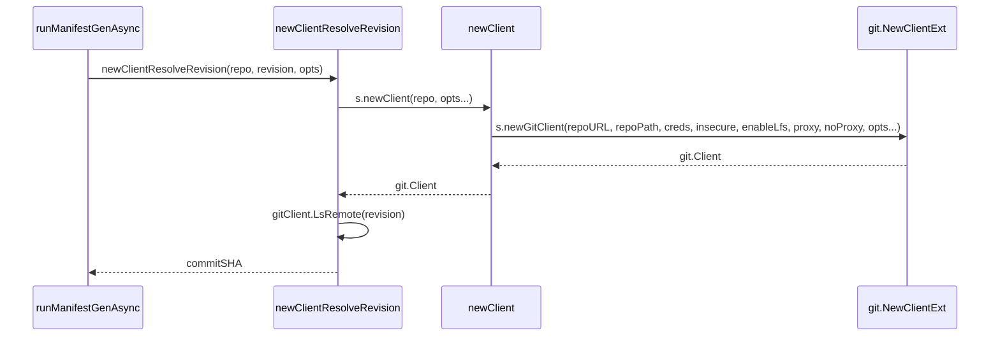

# Repo Server Architecture

<details>
<summary>Relevant source files</summary>

The following files were used as context for generating this wiki page:

- [cmd/argocd-repo-server/commands/argocd_repo_server.go](https://github.com/argoproj/argo-cd/blob/main/cmd/argocd-repo-server/commands/argocd_repo_server.go)
- [reposerver/repository/repository.go](https://github.com/argoproj/argo-cd/blob/main/reposerver/repository/repository.go)
- [reposerver/repository/repository.proto](https://github.com/argoproj/argo-cd/blob/main/reposerver/repository/repository.proto)
- [controller/state.go](https://github.com/argoproj/argo-cd/blob/main/controller/state.go)
</details>

## Overview

The Argo CD Repository Server is an internal gRPC service responsible for maintaining local clones and caches of target Git repositories, OCI registries, and Helm chart repositories, while generating and evaluating Kubernetes manifests for downstream controllers. By offloading resource-intensive operations—such as repository cloning, revision resolution, and template rendering for Helm, Kustomize, and Config Management Plugins—the repository server protects the core controller from performance bottlenecks and ensures scalable application reconciliation.

Sources: [cmd/argocd-repo-server/commands/argocd_repo_server.go:91-91](https://github.com/argoproj/argo-cd/blob/main/cmd/argocd-repo-server/commands/argocd_repo_server.go#L91-L91), [reposerver/repository/repository.go:91-111](https://github.com/argoproj/argo-cd/blob/main/reposerver/repository/repository.go#L91-L111)

## Server Initialization and Command Execution

### Server Initialization and Command Execution

The command-line entry point for the repository server is constructed via `NewCommand()` in `cmd/argocd-repo-server/commands/argocd_repo_server.go`. This function configures a Cobra command (`common.CommandRepoServer`) that handles server flags, signal propagation for graceful shutdowns, panic recovery, and sequential initialization of runtime dependencies including TLS, GPG keyrings, metrics servers, and tracing.

Sources: [cmd/argocd-repo-server/commands/argocd_repo_server.go:55-112](https://github.com/argoproj/argo-cd/blob/main/cmd/argocd-repo-server/commands/argocd_repo_server.go#L55-L112)

### Initialization Call Chain

When the root command executes its `RunE` handler, initialization proceeds through a strict sequence of setup functions before starting the network listeners:

1. `common.GetVersion().LogStartupInfo()` logs startup details including the listen port.
2. `cli.SetLogFormat()` and `cli.SetLogLevel()` configure log serialization and verbosity from flags.
3. `tlsConfigCustomizerSrc()` resolves TLS configuration if TLS is not disabled.
4. `cacheSrc()` initializes the Redis-backed or in-memory repository cache.
5. `resource.ParseQuantity()` processes storage limits (e.g., `maxCombinedDirectoryManifestsSize`, `streamedManifestMaxTarSize`, `helmManifestMaxExtractedSize`).
6. `askpass.NewServer()` and `metrics.NewMetricsServer()` initialize helper sidecars and metrics collection.
7. `reposerver.NewServer()` instantiates the core gRPC repository server passing initialized parameters and cache expiration.
8. `traceutil.InitTracer()` initializes OpenTelemetry tracing if `otlpAddress` is supplied.
9. `lc.Listen()` binds the TCP listener on `listenHost` and `listenPort`.

Sources: [cmd/argocd-repo-server/commands/argocd_repo_server.go:96-186](https://github.com/argoproj/argo-cd/blob/main/cmd/argocd-repo-server/commands/argocd_repo_server.go#L96-L186)

### GPG Keyring and Health Check Endpoints

If `sourceintegrity.IsGPGEnabled()` evaluates to true, the server initializes the GnuPG home directory at `common.GetGnuPGHomePath()`, populates the keyring using `sourceintegrity.SyncKeyRingFromDirectory(gnuPGSourcePath)`, and spawns a background watcher routine via `reposerver.StartGPGWatcher(gnuPGSourcePath)`.

Sources: [cmd/argocd-repo-server/commands/argocd_repo_server.go:217-228](https://github.com/argoproj/argo-cd/blob/main/cmd/argocd-repo-server/commands/argocd_repo_server.go#L217-L228)

The health check endpoint is registered via `healthz.ServeHealthCheck()`. When a liveness or readiness request invokes the endpoint with query parameter `full=true`, it establishes a local gRPC loopback connection to `localhost:listenPort` utilizing `buildHealthCheckTLSConfig()`, executes a standard gRPC `grpc_health_v1.HealthClient.Check()` request, and verifies that the returned status equals `grpc_health_v1.HealthCheckResponse_SERVING`.

Sources: [cmd/argocd-repo-server/commands/argocd_repo_server.go:187-211](https://github.com/argoproj/argo-cd/blob/main/cmd/argocd-repo-server/commands/argocd_repo_server.go#L187-L211)

> [!CAUTION]
> Passing `--client-ca-path` while explicitly setting `--disable-tls` will cause `NewCommand()` to immediately return an error (`--client-ca-path cannot be used when --disable-tls is enabled`), preventing the repository server from starting.

Sources: [cmd/argocd-repo-server/commands/argocd_repo_server.go:144-146](https://github.com/argoproj/argo-cd/blob/main/cmd/argocd-repo-server/commands/argocd_repo_server.go#L144-L146)

### Command-Line Flags Reference

| Flag Name | Default Value | Purpose |
| :--- | :--- | :--- |
| `logformat` | `json` | Set logging format (`json` or `text`) |
| `loglevel` | `info` | Set logging level (`debug`, `info`, `warn`, `error`) |
| `parallelismlimit` | `0` | Limit on concurrent manifest generation requests (< 1 means unlimited) |
| `address` | `common.DefaultAddressRepoServer` | Listen address for incoming gRPC connections |
| `port` | `common.DefaultPortRepoServer` | Listen port for incoming gRPC connections |
| `metrics-address` | `common.DefaultAddressRepoServerMetrics` | Listen address for the metrics server |
| `metrics-port` | `common.DefaultPortRepoServerMetrics` | Start metrics server on given port |
| `otlp-address` | `""` | OpenTelemetry collector address for tracing |
| `otlp-insecure` | `true` | OpenTelemetry collector insecure mode |
| `max-combined-directory-manifests-size` | `"10M"` | Max combined size of manifest files in a directory Application |
| `allow-oob-symlinks` | `false` | Allow out-of-bounds symlinks in repositories |
| `streamed-manifest-max-tar-size` | `"100M"` | Maximum size of streamed manifest archives |
| `streamed-manifest-max-extracted-size` | `"1G"` | Maximum size of streamed manifest archives when extracted |
| `helm-manifest-max-extracted-size` | `"1G"` | Maximum size of Helm manifest archives when extracted |
| `helm-manifest-max-index-size` | `"1G"` | Maximum size of Helm registry index file |
| `oci-manifest-max-extracted-size` | `"1G"` | Maximum size of OCI manifest archives when extracted |
| `disable-oci-manifest-max-extracted-size` | `false` | Disable maximum size for extracted OCI archives |
| `disable-helm-manifest-max-extracted-size` | `false` | Disable maximum size for extracted Helm archives |
| `include-hidden-directories` | `false` | Include hidden directories from Git |
| `plugin-use-manifest-generate-paths` | `false` | Pass `manifest-generate-paths` values to cmpserver |
| `enable-builtin-git-config` | `true` | Enable built-in Git configuration options |
| `disable-tls` | `false` | Disable TLS for the repo-server gRPC endpoint |
| `client-ca-path` | `/app/config/reposerver/mtls/client-ca.crt` | Path to client CA certificate file for mTLS |

Sources: [cmd/argocd-repo-server/commands/argocd_repo_server.go:256-283](https://github.com/argoproj/argo-cd/blob/main/cmd/argocd-repo-server/commands/argocd_repo_server.go#L256-L283)

## Repository Service Protocol Buffer Definitions

### Overview

The repository server gRPC service definition (`service RepoServerService`) utilizes Protocol Buffers version 3 (`proto3`) to expose remote procedure calls for manifest generation, repository validation, revision resolution, reference listing, application listing, plugin discovery, and path-based revision checking.

Sources: [reposerver/repository/repository.proto:1-2](https://github.com/argoproj/argo-cd/blob/main/reposerver/repository/repository.proto#L1-L2), [reposerver/repository/repository.proto:313-315](https://github.com/argoproj/argo-cd/blob/main/reposerver/repository/repository.proto#L313-L315)

### Service Interface Methods

The service interface declares the complete set of RPC endpoints handled by the repository server daemon.

| RPC Method | Input Message | Output Message | Description |
| :--- | :--- | :--- | :--- |
| `GenerateManifest` | `ManifestRequest` | `ManifestResponse` | Generates manifests for an application in a specified repository and revision. |
| `GenerateManifestWithFiles` | `stream ManifestRequestWithFiles` | `ManifestResponse` | Generates manifests using a provided streaming tarball of files. |
| `TestRepository` | `TestRepositoryRequest` | `TestRepositoryResponse` | Verifies whether a repository is valid and accessible. |
| `ResolveRevision` | `ResolveRevisionRequest` | `ResolveRevisionResponse` | Resolves an ambiguous revision into a concrete commit or tag. |
| `ListRefs` | `ListRefsRequest` | `Refs` | Returns a list of branches and tags in a repository. |
| `ListOCITags` | `ListRefsRequest` | `Refs` | Returns a list of OCI registry tags in a repository. |
| `ListApps` | `ListAppsRequest` | `AppList` | Returns a directory structure or list of applications within a repository. |
| `ListPlugins` | `google.protobuf.Empty` | `PluginList` | Returns all configuration management plugins running as sidecars. |
| `GetAppDetails` | `RepoServerAppDetailsQuery` | `RepoAppDetailsResponse` | Retrieves application configuration details (Helm, Kustomize, Directory, Plugin). |
| `GetRevisionMetadata` | `RepoServerRevisionMetadataRequest` | `RevisionMetadata` | Gets author, date, tags, and message metadata for a specific repository revision. |
| `GetOCIMetadata` | `RepoServerRevisionChartDetailsRequest` | `OCIMetadata` | Gets metadata for a specific revision of an OCI image. |
| `GetRevisionChartDetails` | `RepoServerRevisionChartDetailsRequest` | `ChartDetails` | Gets chart details for a specific repository revision. |
| `GetHelmCharts` | `HelmChartsRequest` | `HelmChartsResponse` | Returns the list of Helm charts in a specified repository. |
| `GetGitFiles` | `GitFilesRequest` | `GitFilesResponse` | Returns a map of file paths and their contents for a given repository. |
| `GetGitDirectories` | `GitDirectoriesRequest` | `GitDirectoriesResponse` | Returns a set of directory paths for a given repository. |
| `UpdateRevisionForPaths` | `UpdateRevisionForPathsRequest` | `UpdateRevisionForPathsResponse` | Compares revisions and updates the cache if no changes occur in specified paths. |

Sources: [reposerver/repository/repository.proto:316-378](https://github.com/argoproj/argo-cd/blob/main/reposerver/repository/repository.proto#L316-L378)

> [!NOTE]
> `GenerateManifestWithFiles` accepts a gRPC stream of `ManifestRequestWithFiles`, which uses a `oneof` wrapper to multiplex request metadata, file transfer checksums, and raw byte chunks.

Sources: [reposerver/repository/repository.proto:49-55](https://github.com/argoproj/argo-cd/blob/main/reposerver/repository/repository.proto#L49-L55), [reposerver/repository/repository.proto:321-322](https://github.com/argoproj/argo-cd/blob/main/reposerver/repository/repository.proto#L321-L322)

## Git Repository Fetching and Client Resolution

### Overview

The repository server manages local repository initialization, client creation, revision resolution, and workspace cloning within configured root directories. When interacting with Git repositories, `Service` utilizes localized temp paths and credential stores to initialize clients, execute remote lookups, and ensure thread-safe directory access.

Sources: [reposerver/repository/repository.go:92-111](https://github.com/argoproj/argo-cd/blob/main/reposerver/repository/repository.go#L92-L111)

### Client Initialization and Revision Resolution Walkthrough

To communicate with upstream repositories and convert symbolic references (such as branches or tags) into explicit hashes, the repository server follows a precise call sequence through client creation helpers.

1. `runManifestGenAsync` or related service methods invoke `newClientResolveRevision` with the target repository and revision.
Sources: [reposerver/repository/repository.go:265-268](https://github.com/argoproj/argo-cd/blob/main/reposerver/repository/repository.go#L265-L268), [reposerver/repository/repository.go:905-906](https://github.com/argoproj/argo-cd/blob/main/reposerver/repository/repository.go#L905-L906)
2. `newClientResolveRevision` calls `s.newClient(repo, opts...)` to retrieve the disk path and construct the concrete Git client instance.
Sources: [reposerver/repository/repository.go:2907-2911](https://github.com/argoproj/argo-cd/blob/main/reposerver/repository/repository.go#L2907-L2911)
3. `newClient` resolves the localized directory path using `s.gitRepoPaths.GetPath(...)` and delegates to `s.newGitClient` (backed by `git.NewClientExt`) passing credentials, proxy parameters, and insecure TLS configurations.
Sources: [reposerver/repository/repository.go:2894-2903](https://github.com/argoproj/argo-cd/blob/main/reposerver/repository/repository.go#L2894-L2903)



Sources: [reposerver/repository/repository.go:2894-2918](https://github.com/argoproj/argo-cd/blob/main/reposerver/repository/repository.go#L2894-L2918), [reposerver/repository/repository.go:905-906](https://github.com/argoproj/argo-cd/blob/main/reposerver/repository/repository.go#L905-L906)

> [!NOTE]
> `newClient` configures event handlers for metrics collection and optionally injects built-in Git configurations based on `initConstants.EnableBuiltinGitConfig`.

Sources: [reposerver/repository/repository.go:2899-2902](https://github.com/argoproj/argo-cd/blob/main/reposerver/repository/repository.go#L2899-L2902)

### Repository Workspace Initialization and Checkout

Once a revision is resolved to a commit hash, the repository workspace must be prepared. The server validates directory permissions and manages locking around checkouts to prevent concurrent file corruption.

| Initialization Step | Handler / Function | Purpose |
| :--- | :--- | :--- |
| Root Setup | `Service.Init()` | Validates root directory existence, creates it with `0o300` permissions if missing, and restores cloned repo paths. |
| Permission Guard | `directoryPermissionInitializer` | Restores `0o700` read/write/execute permissions prior to repository access and closes with `0o000` removal. |
| Workspace Locking | `repositoryLock.Lock` | Serializes operations on the same repository path and commit SHA. |
| Checkout & Fetch | `checkoutRevision` / `fetch` | Initializes the repo, checks local revision presence, fetches via depth limits or full refspecs, and executes checkout. |

Sources: [reposerver/repository/repository.go:176-209](https://github.com/argoproj/argo-cd/blob/main/reposerver/repository/repository.go#L176-L209), [reposerver/repository/repository.go:2976-2993](https://github.com/argoproj/argo-cd/blob/main/reposerver/repository/repository.go#L2976-L2993), [reposerver/repository/repository.go:2997-3007](https://github.com/argoproj/argo-cd/blob/main/reposerver/repository/repository.go#L2997-3007), [reposerver/repository/repository.go:3063-3107](https://github.com/argoproj/argo-cd/blob/main/reposerver/repository/repository.go#L3063-3107)

> [!WARNING]
> When `depth > 0` is specified, fetching targets explicit revisions directly. If depth is unset (`0`), the repository server fetches without revision first to populate default refs (`refs/heads/*` and `refs/remotes/origin/*`), falling back to an explicit fetch only if the target reference is absent.

Sources: [reposerver/repository/repository.go:3033-3060](https://github.com/argoproj/argo-cd/blob/main/reposerver/repository/repository.go#L3033-3060), [reposerver/repository/repository.go:3077-3086](https://github.com/argoproj/argo-cd/blob/main/reposerver/repository/repository.go#L3077-3086)

### Authentication and Design Trade-Offs

The repository server supports multiple transport mechanisms including SSH, HTTPS, OCI registries, and Helm repositories. Authentication credentials are retrieved dynamically via `gitCredsStore` and attached to client options.

| Design Choice | Benefit | Cost |
| :--- | :--- | :--- |
| Randomized temp path isolation (`utilio.NewRandomizedTempPaths`) | Prevents path collisions across concurrent repository clones and isolated applications. | Increased directory traversal overhead and ephemeral storage consumption under heavy load. |
| Two-phase fetch strategy (`Fetch(ctx, "", depth)` with explicit fallback) | Avoids repository bloat from downloading full histories while supporting deep branch specs. | Requires conditional branching and multiple network round-trips when fetching rare references. |
| In-memory symlink validation caching (`gocache` with `OnceValue`) | Eliminates redundant filesystem traversal costs when validating out-of-bounds symlinks across repeated requests. | Consumes heap memory for cached validation states keyed by root path and version. |

Sources: [reposerver/repository/repository.go:146-148](https://github.com/argoproj/argo-cd/blob/main/reposerver/repository/repository.go#L146-L148), [reposerver/repository/repository.go:3043-3060](https://github.com/argoproj/argo-cd/blob/main/reposerver/repository/repository.go#L3043-3060), [reposerver/repository/repository.go:627-643](https://github.com/argoproj/argo-cd/blob/main/reposerver/repository/repository.go#L627-L643)

## Manifest Generation and Evaluation Pipeline

### Overview

The repository server processes incoming manifest generation requests through an asynchronous evaluation pipeline that delegates rendering to specialized tool backends: Helm, Kustomize, Config Management Plugin (CMP) sidecars, and plain directory traversal. When `Service.GenerateManifest()` is called, it initializes tracing attributes, resolves multi-source references if present, checks the manifest cache via `getManifestCacheEntry()`, and invokes `runRepoOperation()` to handle background generation.

Sources: [reposerver/repository/repository.go:645-733](https://github.com/argoproj/argo-cd/blob/main/reposerver/repository/repository.go#L645-L733), [reposerver/repository/repository.go:346-357](https://github.com/argoproj/argo-cd/blob/main/reposerver/repository/repository.go#L346-L357)

### Asynchronous Pipeline Execution Walkthrough

Manifest generation runs concurrently in a background goroutine to allow early repository lock release and tarball streaming to CMP sidecars. The call chain proceeds through specific operational boundaries:

`Service.GenerateManifest()` → `runRepoOperation()` → `Service.runManifestGen()` → `Service.runManifestGenAsync()` → `GenerateManifests()`

1. **Request Dispatch**: `GenerateManifest()` sets up telemetry spans and delegates execution to `runRepoOperation()`, which resolves the target revision and acquires the repository lock.
2. **Promise Initialization**: Inside the operation callback, `runManifestGen()` instantiates a `ManifestResponsePromise` containing three channels (`responseCh`, `tarDoneCh`, and `errCh`) and launches `runManifestGenAsync()` in a background goroutine.
3. **Multi-Source Checkout**: `runManifestGenAsync()` resolves and checks out any referenced repository sources specified via `RefSources` in multi-source applications.
4. **Backend Dispatch**: It invokes `GenerateManifests()`, which determines the application source type and dispatches rendering to the appropriate tool runner.
5. **Lock Release & Streaming**: If CMP processing is active, the tarball generation completion signal is sent over `tarDoneCh`, allowing the repository lock to be released immediately while the CMP sidecar processes the stream.
6. **Caching**: Successful outputs or consecutive failure states are committed back to `Service.cache` using a composite manifest cache key generated by `getManifestCacheKey()`.

Sources: [reposerver/repository/repository.go:692-708](https://github.com/argoproj/argo-cd/blob/main/reposerver/repository/repository.go#L692-L708), [reposerver/repository/repository.go:826-839](https://github.com/argoproj/argo-cd/blob/main/reposerver/repository/repository.go#L826-839), [reposerver/repository/repository.go:850-1032](https://github.com/argoproj/argo-cd/blob/main/reposerver/repository/repository.go#L850-1032), [reposerver/repository/repository.go:1747-1862](https://github.com/argoproj/argo-cd/blob/main/reposerver/repository/repository.go#L1747-1862)

> [!WARNING]
> When `tarDoneCh` signals completion during CMP manifest generation, the primary repository lock is released early, but the main goroutine blocks until `responseCh` delivers the final rendered manifest response from the sidecar.

Sources: [reposerver/repository/repository.go:699-707](https://github.com/argoproj/argo-cd/blob/main/reposerver/repository/repository.go#L699-L707), [reposerver/repository/repository.go:717-724](https://github.com/argoproj/argo-cd/blob/main/reposerver/repository/repository.go#L717-L724)

### Supported Tool Renderers

`GenerateManifests()` examines the application source type and routes execution to the corresponding rendering engine.

| Application Source Type | Handler / Builder Function | Description |
| :--- | :--- | :--- |
| `Helm` (`v1alpha1.ApplicationSourceTypeHelm`) | `helmTemplate` | Parses Kubernetes versions, resolves value files and parameters, runs dependency builds if necessary, and executes `helm template`. |
| `Kustomize` (`v1alpha1.ApplicationSourceTypeKustomize`) | `kustomize.NewKustomizeApp` | Resolves binary paths, configures build options with API versions and target Kubernetes versions, and invokes `k.Build()`. |
| `Plugin` (`v1alpha1.ApplicationSourceTypePlugin`) | `runConfigManagementPluginSidecars` | Detects CMP socket servers, injects plugin parameters and Git credentials environment variables, and streams tarballs via gRPC. |
| `Directory` (`v1alpha1.ApplicationSourceTypeDirectory`) | `findManifests` | Walks the directory tree, evaluates Jsonnet virtual machines or parses YAML/JSON files, and validates file size constraints. |

Sources: [reposerver/repository/repository.go:1770-1811](https://github.com/argoproj/argo-cd/blob/main/reposerver/repository/repository.go#L1770-L1811), [reposerver/repository/repository.go:1292-1449](https://github.com/argoproj/argo-cd/blob/main/reposerver/repository/repository.go#L1292-L1449), [reposerver/repository/repository.go:1786-1790](https://github.com/argoproj/argo-cd/blob/main/reposerver/repository/repository.go#L1786-L1790), [reposerver/repository/repository.go:2351-2407](https://github.com/argoproj/argo-cd/blob/main/reposerver/repository/repository.go#L2351-2407), [reposerver/repository/repository.go:2004-2052](https://github.com/argoproj/argo-cd/blob/main/reposerver/repository/repository.go#L2004-2052)

> [!TIP]
> Directory traversal manifest loading applies a memory safeguard via `maxCombinedManifestQuantity`. Non-jsonnet regular file sizes are accumulated during directory walks, triggering `ErrExceededMaxCombinedManifestFileSize` if the limit is breached.

Sources: [reposerver/repository/repository.go:2222-2266](https://github.com/argoproj/argo-cd/blob/main/reposerver/repository/repository.go#L2222-L2266), [reposerver/repository/repository.go:254-257](https://github.com/argoproj/argo-cd/blob/main/reposerver/repository/repository.go#L254-L257)

## Controller State Integration and Reconciliation

### Overview

The Argo CD application controller bridges controller reconciliation loops and repository operations through the `AppStateManager` interface. When comparing target application specifications against live cluster states, the controller invokes `CompareAppState()` and `GetRepoObjs()`, orchestrating manifest retrieval from the repo server, diff calculations, health assessments, and synchronization workflows.

Sources: [controller/state.go:94-100](https://github.com/argoproj/argo-cd/blob/main/controller/state.go#L94-L100)

### AppStateManager Interface and Comparison Result Structures

The controller state subsystem centers around core contracts and structs defining managed resources and reconciliation outcomes.

| Structure / Interface | Key Methods / Fields | Purpose |
| :--- | :--- | :--- |
| `AppStateManager` | `CompareAppState`, `SyncAppState`, `EvaluateAppRevisionsChanges`, `GetRepoObjs` | Defines methods allowing the controller to compare application specs, fetch repository objects, evaluate revisions, and execute sync operations. |
| `comparisonResult` | `syncStatus`, `healthStatus`, `healthMessage`, `resources`, `managedResources`, `reconciliationResult` | Holds the complete analyzed state of an application following reconciliation and state comparison phases. |
| `managedResource` | `Target`, `Live`, `Diff`, `Group`, `Version`, `Kind`, `Namespace`, `Name`, `Hook` | Represents a single matched Kubernetes resource pairing target manifests with live cluster state and diff metadata. |

Sources: [controller/state.go:81-114](https://github.com/argoproj/argo-cd/blob/main/controller/state.go#L81-L114)

> [!NOTE]
> `setAppTraceAttrs()` injects standard OpenTelemetry span attributes (`argocd.app.name`, `argocd.app.namespace`, `argocd.app.project`) on hot reconcile paths, performing an early check via `span.IsRecording()` to prevent attribute slice allocations when tracing is disabled.

Sources: [controller/state.go:61-73](https://github.com/argoproj/argo-cd/blob/main/controller/state.go#L61-L73)

### Trace Attributes and Stub Providers

Tracing initialization relies on the package-level OpenTelemetry tracer:

```go
var tracer = otel.Tracer("github.com/argoproj/argo-cd/v3/controller")
```

Sources: [controller/state.go:59-59](https://github.com/argoproj/argo-cd/blob/main/controller/state.go#L59-L59)

Additionally, `resourceInfoProviderStub` supplies a minimal implementation for namespaced group-kind checks during fallback evaluation:

```go
type resourceInfoProviderStub struct{}

func (r *resourceInfoProviderStub) IsNamespaced(_ schema.GroupKind) (bool, error) {
	return false, nil
}
```

Sources: [controller/state.go:75-79](https://github.com/argoproj/argo-cd/blob/main/controller/state.go#L75-L79)

## Related

- [[Helm Integration]]
- [[Kustomize and Jsonnet]]
- [[Config Management Plugins]]

