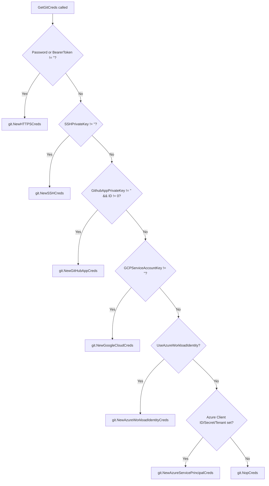

# Repository Credentials API

Relevant source files

The following files were used as context for generating this wiki page:

- [ui/src/app/settings/components/repos-list/repos-list.tsx](https://github.com/argoproj/argo-cd/blob/main/ui/src/app/settings/components/repos-list/repos-list.tsx)
- [cmd/argocd/commands/repo.go](https://github.com/argoproj/argo-cd/blob/main/cmd/argocd/commands/repo.go)
- [pkg/apis/application/v1alpha1/repository_types.go](https://github.com/argoproj/argo-cd/blob/main/pkg/apis/application/v1alpha1/repository_types.go)
- [cmd/argocd/commands/repocreds.go](https://github.com/argoproj/argo-cd/blob/main/cmd/argocd/commands/repocreds.go)
- [util/db/repository.go](https://github.com/argoproj/argo-cd/blob/main/util/db/repository.go)
- [cmd/argocd/commands/admin/repo.go](https://github.com/argoproj/argo-cd/blob/main/cmd/argocd/commands/admin/repo.go)
- [ui/src/app/shared/services/repo-service.ts](https://github.com/argoproj/argo-cd/blob/main/ui/src/app/shared/services/repo-service.ts)
- [docs/user-guide/private-repositories.md](https://github.com/argoproj/argo-cd/blob/main/docs/user-guide/private-repositories.md)
- [util/db/certificate.go](https://github.com/argoproj/argo-cd/blob/main/util/db/certificate.go)
- [server/repository/repository.go](https://github.com/argoproj/argo-cd/blob/main/server/repository/repository.go)

## Overview

The Repository Credentials and Management API in Argo CD provides a robust subsystem for configuring, securing, and lifecycle-managing external Git, Helm, and OCI artifact repositories. It solves the critical operational challenge of securely authenticating Argo CD components against private remote sources by supporting diverse authentication mechanisms, including HTTPS credentials, personal access tokens, SSH private keys, GitHub Apps, GCP service accounts, and Azure Service Principals or Workload Identity. The architecture implements reusable credential templates that automatically enrich repository definitions via prefix matching, alongside rigorous TLS certificate and SSH host key validation layers. Exposing functionality through gRPC/HTTP server handlers, a dedicated CLI toolset, and a web UI frontend service, the API ensures seamless integration across administrative workflows and automated controllers.

Sources: [pkg/apis/application/v1alpha1/repository_types.go:20-68](https://github.com/argoproj/argo-cd/blob/main/pkg/apis/application/v1alpha1/repository_types.go#L20-L68), [docs/user-guide/private-repositories.md:11-274](https://github.com/argoproj/argo-cd/blob/main/docs/user-guide/private-repositories.md#L11-L274), [util/db/repository.go:435-466](https://github.com/argoproj/argo-cd/blob/main/util/db/repository.go#L435-L466), [cmd/argocd/commands/repo.go:25-54](https://github.com/argoproj/argo-cd/blob/main/cmd/argocd/commands/repo.go#L25-L54), [ui/src/app/settings/components/repos-list/repos-list.tsx:800-831](https://github.com/argoproj/argo-cd/blob/main/ui/src/app/settings/components/repos-list/repos-list.tsx#L800-L831)

## Repository API Data Structures

### Overview

The API data structures define the core schemas for external artifact stores, shared authentication templates, verification certificates, and cryptographic signing keys. At the center of this tier are the `Repository` and `RepoCreds` structs, which govern how Argo CD connects to remote Git, Helm, and OCI repositories. These types support an expansive array of authentication strategies and transport configuration options directly within their field definitions.

Sources: [pkg/apis/application/v1alpha1/repository_types.go:20-139](https://github.com/argoproj/argo-cd/blob/main/pkg/apis/application/v1alpha1/repository_types.go#L20-L139)

### Core Struct Definitions

The `RepoCreds` struct acts as a credential template matching against repository URL patterns, whereas `Repository` represents an individual managed repository containing connection states, project bindings, and specific cloning configurations. Both entities encapsulate identical authentication credential fields such as basic auth credentials, SSH keys, GitHub App configurations, Google Cloud service account keys, and Azure identity parameters.

Sources: [pkg/apis/application/v1alpha1/repository_types.go:20-139](https://github.com/argoproj/argo-cd/blob/main/pkg/apis/application/v1alpha1/repository_types.go#L20-L139)

### Authentication Mechanism Mapping

When establishing connections to remote endpoints, receiver methods inspect the populated credential fields to instantiate protocol-specific credential providers. For Git repositories, `GetGitCreds()` evaluates available parameters in a strict execution order to build the appropriate client wrapper.

Sources: [pkg/apis/application/v1alpha1/repository_types.go:275-304](https://github.com/argoproj/argo-cd/blob/main/pkg/apis/application/v1alpha1/repository_types.go#L275-L304)

> [!NOTE]
> `GetGitCreds()` checks authentication fields sequentially and returns the first matching provider implementation. If multiple credential types are populated simultaneously, HTTPS basic authentication or bearer tokens take precedence over SSH keys, GitHub Apps, GCP service accounts, and Azure credentials.

Sources: [pkg/apis/application/v1alpha1/repository_types.go:275-304](https://github.com/argoproj/argo-cd/blob/main/pkg/apis/application/v1alpha1/repository_types.go#L275-L304)

### Supporting API Data Structures

In addition to repository configurations and credential templates, the API defines collection lists, host certificates, and cryptographic verification keys to support secure communication channels.

| Struct Name | Description | Key Fields |
| :--- | :--- | :--- |
| `RepositoryList` | Collection container for managed repository items. | `ListMeta`, `Items` |
| `RepoCredsList` | Collection container for credential template definitions. | `ListMeta`, `Items` |
| `RepositoryCertificate` | Represents stored SSH known hosts entries or TLS server certificates. | `ServerName`, `CertType`, `CertSubType`, `CertData`, `CertInfo` |
| `RepositoryCertificateList` | Collection container for repository validation certificates. | `ListMeta`, `Items` |
| `GnuPGPublicKey` | Representation of a GnuPG public key used for commit verification. | `KeyID`, `Fingerprint`, `Owner`, `Trust`, `SubType`, `KeyData` |
| `GnuPGPublicKeyList` | Collection container for GnuPG verification public keys. | `ListMeta`, `Items` |

Sources: [pkg/apis/application/v1alpha1/repository_types.go:447-500](https://github.com/argoproj/argo-cd/blob/main/pkg/apis/application/v1alpha1/repository_types.go#L447-L500)

## Server Handler and RBAC Enforcement

### Overview

The repository server handler layer manages the complete repository and credential lifecycle via gRPC service endpoints. Handlers coordinate authorization checks against Argo CD's RBAC system, communicate with database persistence layers, and interact with repository-server clients to validate remote endpoints.

Sources: [server/repository/repository.go:1-50](https://github.com/argoproj/argo-cd/blob/main/server/repository/repository.go#L1-L50)

### Server Handler Architecture and RBAC Enforcement

The `Server` struct encapsulates dependencies required to process gRPC requests, including Argo CD settings, Kubernetes client interfaces, listers, database managers, and repository server clients. Incoming requests undergo validation and fine-grained authorization checks before state mutations occur.

> [!WARNING]
> RBAC validation in repository handlers enforces strict project boundaries. When managing a repository or credential template bound to a specific project (`Repo.Project`), callers must possess write or delete permissions on that target project rather than exclusively on the global resource namespace.

Sources: [server/repository/repository.go:1-100](https://github.com/argoproj/argo-cd/blob/main/server/repository/repository.go#L1-L100)

## Database Storage and Credential Enrichment

### Overview

The database and persistence layer manages storage interaction for repositories and shared credential templates through the `db` struct and `repositoryBackend` interface. It coordinates backend secret generation, credential enrichment, repository indexing, and consistent URL hashing.

Sources: [util/db/repository.go:1-56](https://github.com/argoproj/argo-cd/blob/main/util/db/repository.go#L1-L56)

### Credential Enrichment and Storage Call Chain

When retrieving a repository via `GetRepository`, the database layer executes a multi-step fetch and enrichment sequence to merge shared credentials if explicit repository-level credentials are absent. 

The execution proceeds through the following call chain:
`GetRepository()` → `db.getRepository()` → `secretsBackend.RepositoryExists()` → `secretsBackend.GetRepository()` → `db.enrichCredsToRepo()` → `db.GetRepositoryCredentials()` → `repository.CopyCredentialsFrom()`

> [!WARNING]
> During enrichment, `enrichCredsToRepo` checks `repository.HasCredentials()`. If credentials are already present directly on the repository record, shared credential template merging is skipped, and debug logging indicates that the repository already holds its own credentials.

Sources: [util/db/repository.go:87-98](https://github.com/argoproj/argo-cd/blob/main/util/db/repository.go#L87-L98), [util/db/repository.go:435-450](https://github.com/argoproj/argo-cd/blob/main/util/db/repository.go#L435-L450)

### Secret Prefix Constants and URL Hashing

Imperatively created repositories and credential templates use distinct naming prefixes and an FNV-32a hashing algorithm to derive Kubernetes secret names from repository URLs and project scopes.

| Constant / Function | Value / Signature | Purpose |
| :--- | :--- | :--- |
| `repoSecretPrefix` | `"repo"` | Prefix used for naming standard repository secrets. |
| `repoWriteSecretPrefix` | `"repo-write"` | Prefix used for naming repository write secrets. |
| `credSecretPrefix` | `"creds"` | Prefix used for naming credential template secrets. |
| `credWriteSecretPrefix` | `"creds-write"` | Prefix used for naming write credential template secrets. |
| `username` | `"username"` | Secret data key storing authentication usernames. |
| `password` | `"password"` | Secret data key storing passwords or tokens. |
| `project` | `"project"` | Secret data key storing project scoping information. |
| `sshPrivateKey` | `"sshPrivateKey"` | Secret data key storing SSH private keys. |
| `RepoURLToSecretName` | `(prefix string, repo string, project string) string` | Hashes repository URL and project using FNV-32a into a secret name. |

Sources: [util/db/repository.go:19-36](https://github.com/argoproj/argo-cd/blob/main/util/db/repository.go#L19-L36), [util/db/repository.go:469-478](https://github.com/argoproj/argo-cd/blob/main/util/db/repository.go#L469-L478)

> [!CAUTION]
> The hash formula implemented by `RepoURLToSecretName` is explicitly not considered stable and may change in future releases. It must not be relied upon for arbitrary secret lookups outside of secret creation flows.

Sources: [util/db/repository.go:469-473](https://github.com/argoproj/argo-cd/blob/main/util/db/repository.go#L469-L473)

## CLI Commands for Repositories and Templates

### Overview

Argo CD provides user and administrator command-line interfaces for configuring repository connections, managing shared credential templates, and generating declarative Kubernetes manifests. These tools interact directly with gRPC service clients or instantiate temporary database managers to produce configuration objects.

Sources: [cmd/argocd/commands/repo.go:25-54](https://github.com/argoproj/argo-cd/blob/main/cmd/argocd/commands/repo.go#L25-L54), [cmd/argocd/commands/repocreds.go:26-51](https://github.com/argoproj/argo-cd/blob/main/cmd/argocd/commands/repocreds.go#L26-L51), [cmd/argocd/commands/admin/repo.go:27-38](https://github.com/argoproj/argo-cd/blob/main/cmd/argocd/commands/admin/repo.go#L27-L38)

### Repository and Credential CLI Operations

The `argocd repo`, `argocd repocreds`, and `argocd admin repo` command trees expose subcommands for adding, listing, getting, removing, and generating specifications for git, helm, and OCI repositories.

| Command Tree | Subcommand | Purpose | Sources |
| :--- | :--- | :--- | :--- |
| `argocd repo` | `add` | Adds repository connection parameters with validation and access checks. | [cmd/argocd/commands/repo.go:56-283](https://github.com/argoproj/argo-cd/blob/main/cmd/argocd/commands/repo.go#L56-L283) |
| `argocd repo` | `get` | Retrieves configured repository details by URL with support for formats (`yaml`, `json`, `url`, `wide`). | [cmd/argocd/commands/repo.go:421-491](https://github.com/argoproj/argo-cd/blob/main/cmd/argocd/commands/repo.go#L421-L491) |
| `argocd repo` | `list` | Lists configured repositories with optional connection status cache refresh (`hard`). | [cmd/argocd/commands/repo.go:355-419](https://github.com/argoproj/argo-cd/blob/main/cmd/argocd/commands/repo.go#L355-L419) |
| `argocd repo` | `rm` | Removes one or more configured repositories by URL with confirmation prompts. | [cmd/argocd/commands/repo.go:285-329](https://github.com/argoproj/argo-cd/blob/main/cmd/argocd/commands/repo.go#L285-L329) |
| `argocd repocreds` | `add` | Adds shared repository credential templates for wildcard or pattern-matching URLs. | [cmd/argocd/commands/repocreds.go:53-219](https://github.com/argoproj/argo-cd/blob/main/cmd/argocd/commands/repocreds.go#L53-L219) |
| `argocd repocreds` | `list` | Lists configured repository credential templates in multiple output formats. | [cmd/argocd/commands/repocreds.go:277-318](https://github.com/argoproj/argo-cd/blob/main/cmd/argocd/commands/repocreds.go#L277-L318) |
| `argocd repocreds` | `rm` | Removes configured repository credentials matching a given URL pattern. | [cmd/argocd/commands/repocreds.go:221-255](https://github.com/argoproj/argo-cd/blob/main/cmd/argocd/commands/repocreds.go#L221-L255) |
| `argocd admin repo` | `generate-spec` | Generates declarative Kubernetes Secret manifests locally using a fake client and database instance. | [cmd/argocd/commands/admin/repo.go:40-200](https://github.com/argoproj/argo-cd/blob/main/cmd/argocd/commands/admin/repo.go#L40-L200) |

Sources: [cmd/argocd/commands/repo.go:49-52](https://github.com/argoproj/argo-cd/blob/main/cmd/argocd/commands/repo.go#L49-L52), [cmd/argocd/commands/repocreds.go:47-49](https://github.com/argoproj/argo-cd/blob/main/cmd/argocd/commands/repocreds.go#L47-L49), [cmd/argocd/commands/admin/repo.go:35](https://github.com/argoproj/argo-cd/blob/main/cmd/argocd/commands/admin/repo.go#L35)

### Specification Generation Call Chain

When executing `argocd admin repo generate-spec`, the tool bypasses the gRPC API server and invokes underlying database and settings managers directly against a fake Kubernetes clientset. 

The execution proceeds through the following call chain:
`NewGenRepoSpecCommand()` → `repoOpts.Repo.Repo = args[0]` → `settings.NewSettingsManager()` → `db.NewDB()` → `argoDB.CreateRepository()` → `kubeClientset.CoreV1().Secrets().Get()` → `PrintResources()`

> [!WARNING]
> The `generate-spec` command instantiates a fake Kubernetes clientset containing a dummy ConfigMap for the `argocd` namespace. It does not communicate with a live cluster, making it suitable for offline manifest generation.

Sources: [cmd/argocd/commands/admin/repo.go:95-195](https://github.com/argoproj/argo-cd/blob/main/cmd/argocd/commands/admin/repo.go#L95-L195)

### Design Trade-offs in CLI Architecture

| Design Choice | Benefit | Cost |
| :--- | :--- | :--- |
| **Server-validated `repo add`** versus **Offline `admin repo generate-spec`** | Prevents misconfigured repositories from entering the database by testing accessibility; offline spec generation allows bootstrapping clusters without active server connectivity. | Requires distinct execution paths and duplicated validation logic between client commands and admin utilities. |
| **Interactive password prompting** | Avoids exposing sensitive passwords in shell history or process argument lists when `--password` is omitted. | Blocks automated or non-interactive execution unless passwords are explicitly supplied via flags or environment variables. |
| **Client-side certificate file loading** | Reads local PEM files (`--ssh-private-key-path`, `--tls-client-cert-path`, `--gcp-service-account-key-path`) and embeds their raw byte contents into request payloads. | Fails immediately if local file paths are invalid or lack read permissions on the operator's host. |

Sources: [cmd/argocd/commands/repo.go:128-184](https://github.com/argoproj/argo-cd/blob/main/cmd/argocd/commands/repo.go#L128-L184), [cmd/argocd/commands/repo.go:222-268](https://github.com/argoproj/argo-cd/blob/main/cmd/argocd/commands/repo.go#L222-L268), [cmd/argocd/commands/admin/repo.go:107-169](https://github.com/argoproj/argo-cd/blob/main/cmd/argocd/commands/admin/repo.go#L107-L169)

## Certificate and SSH Host Verification

### Overview

The database persistence layer manages TLS certificates and SSH known hosts stored within Argo CD configuration maps. It provides selection, retrieval, creation, and removal operations for repository trust material.

Sources: [util/db/certificate.go:1-494](https://github.com/argoproj/argo-cd/blob/main/util/db/certificate.go#L1-L494)

### Data Structures

The certificate verification subsystem relies on structs representing individual SSH host entries, TLS certificates, and selection criteria.

| Struct Name | Field | Purpose |
| :--- | :--- | :--- |
| `SSHKnownHostsEntry` | `Host` | Hostname the SSH key is registered for. |
| `SSHKnownHostsEntry` | `SubType` | Cryptographic key type (e.g., `ssh-rsa`). |
| `SSHKnownHostsEntry` | `Data` | Raw key data including the type prefix. |
| `SSHKnownHostsEntry` | `Fingerprint` | SHA256 fingerprint string of the host key. |
| `TLSCertificate` | `Subject` | Subject identifier or server name for the TLS certificate. |
| `TLSCertificate` | `Issuer` | Certificate issuer name. |
| `TLSCertificate` | `Data` | Raw PEM certificate data. |
| `CertificateListSelector` | `HostNamePattern` | Glob pattern to match server hostnames. |
| `CertificateListSelector` | `CertType` | Filter type (`ssh`, `https`, `tls`, or `*`). |
| `CertificateListSelector` | `CertSubType` | Filter subtype for specific key types. |

Sources: [util/db/certificate.go:19-49](https://github.com/argoproj/argo-cd/blob/main/util/db/certificate.go#L19-L49)

### Certificate Verification Call Chain

When managing repository certificates, requests pass through validation and persistence layers. The creation workflow for repository certificates follows a precise execution path:

`CreateRepoCertificate()` → `db.getSSHKnownHostsData()` / `db.getTLSCertificateData()` → `certutil.IsValidHostname()` → `ssh.ParseKnownHosts()` / `certutil.ParseTLSCertificatesFromData()` → `db.settingsMgr.SaveSSHKnownHostsData()` / `db.settingsMgr.SaveTLSCertificateData()`

> [!WARNING]
> When removing TLS certificates via `RemoveRepoCertificates`, only valid PEM blocks can be removed automatically. Corrupted certificate data inside the configuration map cannot be parsed and requires manual intervention using `kubectl`.

Sources: [util/db/certificate.go:152-333](https://github.com/argoproj/argo-cd/blob/main/util/db/certificate.go#L152-L333), [util/db/certificate.go:335-418](https://github.com/argoproj/argo-cd/blob/main/util/db/certificate.go#L335-L418)

### Design Trade-offs in Certificate Management

| Design Choice | Benefit | Cost |
| :--- | :--- | :--- |
| **Strict hostname extraction via regex for bracketed SSH ports** (`^[\[(.*)]:\d+$`) | Correctly strips port numbers from bracketed host strings (e.g., `[git.example.com]:22`) before validation. | Requires additional pattern matching branches and fails if hostnames do not conform to expected bracket formats. |
| **Exclusion of `CertData` in `ListRepoCertificates`** | Protects sensitive private and public key material from exposure during routine metadata listing operations. | Callers requiring raw certificate bytes must fetch individual records explicitly via `GetRepoCertificate`. |
| **Individual PEM wrapping on removal** | Each PEM certificate in a bundle is returned separately so callers have granular visibility into what was deleted. | Corrupt PEM blocks prevent programmatic removal and necessitate direct ConfigMap editing. |

Sources: [util/db/certificate.go:51-123](https://github.com/argoproj/argo-cd/blob/main/util/db/certificate.go#L51-L123), [util/db/certificate.go:179-192](https://github.com/argoproj/argo-cd/blob/main/util/db/certificate.go#L179-L192), [util/db/certificate.go:378-396](https://github.com/argoproj/argo-cd/blob/main/util/db/certificate.go#L378-L396)

## User Interface and Frontend Services

### Overview

The Argo CD frontend web UI and API client services implement the repository connection, updating, and credential management workflows. The `ReposList` React component handles pagination, filtering, search queries, and rendering of the repository table, while the `RepositoriesService` client encapsulates HTTP communication with backend endpoints for both standard repositories and write-repositories.

Sources: [ui/src/app/settings/components/repos-list/repos-list.tsx:276-800](https://github.com/argoproj/argo-cd/blob/main/ui/src/app/settings/components/repos-list/repos-list.tsx#L276-L800), [ui/src/app/shared/services/repo-service.ts:80-108](https://github.com/argoproj/argo-cd/blob/main/ui/src/app/shared/services/repo-service.ts#L80-L108)

### Connection Methods and Query Parameters

The user interface supports five distinct connection methods mapped through the `ConnectionMethod` enumeration, allowing users to configure repository access via SSH, HTTP/HTTPS, GitHub App, Google Cloud, or Azure Service Principal.

| Connection Method Enum | Value | Description |
| :--- | :--- | :--- |
| `ConnectionMethod.SSH` | `via SSH` | Connects repositories using SSH private keys and server verification options. |
| `ConnectionMethod.HTTPS` | `via HTTP/HTTPS` | Connects repositories or registries using username/password, bearer tokens, or TLS client certificates. |
| `ConnectionMethod.GITHUBAPP` | `via GitHub App` | Connects repositories using GitHub or GitHub Enterprise application credentials and private keys. |
| `ConnectionMethod.GOOGLECLOUD` | `via Google Cloud` | Connects Google Cloud Source repositories using GCP service account JSON keys. |
| `ConnectionMethod.AZURESERVICEPRINCIPAL` | `via Azure Service Principal` | Connects Azure DevOps repositories using Azure tenant, client ID, and client secret. |

Sources: [ui/src/app/settings/components/repos-list/repos-list.tsx:195-201](https://github.com/argoproj/argo-cd/blob/main/ui/src/app/settings/components/repos-list/repos-list.tsx#L195-L201)

### Repository Form Submission Call Chain

When a user submits the connection form in the web UI, parameters pass through validation and submission handlers before invoking the underlying repository service API client. The execution walkthrough follows this order:

`formApi.current.submitForm()` → `onSubmitForm()` → `connectHTTPSRepo()` (or `connectSSHRepo()`, `connectGitHubAppRepo()`, `connectGoogleCloudSourceRepo()`, `connectAzureServicePrincipalRepo()`) → `services.repos.createHTTPS()` (or `createHTTPSWrite()`, `createSSH()`, etc.) → `requests.post()`

> [!NOTE]
> If the `credsTemplate` reference flag is set to true when submitting the form, the submission call chain diverts to `createHTTPSCreds()`, `createSSHCreds()`, `createGitHubAppCreds()`, `createGoogleCloudSourceCreds()`, or `createAzureServicePrincipalCreds()`, invoking `services.repocreds` methods instead of `services.repos`.

Sources: [ui/src/app/settings/components/repos-list/repos-list.tsx:387-401](https://github.com/argoproj/argo-cd/blob/main/ui/src/app/settings/components/repos-list/repos-list.tsx#L387-L401), [ui/src/app/settings/components/repos-list/repos-list.tsx:465-527](https://github.com/argoproj/argo-cd/blob/main/ui/src/app/settings/components/repos-list/repos-list.tsx#L465-L527), [ui/src/app/shared/services/repo-service.ts:109-133](https://github.com/argoproj/argo-cd/blob/main/ui/src/app/shared/services/repo-service.ts#L109-L133)

### Frontend Service Methods

The `RepositoriesService` class provides TypeScript interfaces and methods to interact with repository and write-repository REST endpoints.

| Method Name | HTTP Verb & Path | Description |
| :--- | :--- | :--- |
| `list()` | `GET /repositories` | Retrieves all configured read repositories. |
| `listWrite()` | `GET /write-repositories` | Retrieves all configured write repositories when hydrator is enabled. |
| `listNoCache()` | `GET /repositories?forceRefresh=true` | Forces a cache bypass to retrieve read repositories. |
| `createHTTPS()` | `POST /repositories` | Creates a new HTTPS-based repository connection. |
| `createHTTPSWrite()` | `POST /write-repositories` | Creates a new HTTPS-based write repository connection. |
| `updateHTTPS()` | `PUT /repositories/{url}` | Updates an existing HTTPS repository configuration. |
| `delete()` | `DELETE /repositories/{url}` | Disconnects and deletes a read repository by URL and project. |

Sources: [ui/src/app/shared/services/repo-service.ts:80-185](https://github.com/argoproj/argo-cd/blob/main/ui/src/app/shared/services/repo-service.ts#L80-L185), [ui/src/app/shared/services/repo-service.ts:363-368](https://github.com/argoproj/argo-cd/blob/main/ui/src/app/shared/services/repo-service.ts#L363-L368)

### Design Trade-offs in Frontend State and Routing

| Design Choice | Benefit | Cost |
| :--- | :--- | :--- |
| **URL search parameter state synchronization for `addRepo`** | Enables direct deep-linking and browser history navigation for the repository connection panel. | Requires manual query string parsing and synchronization with React state hooks. |
| **Unified repository representation (`UnifiedRepo`)** | Allows mixed rendering of read repositories, write repositories, and credential templates within a single table component. | Adds conditional branch checking across filter and sort helper functions (`isTemplate`, `isWrite`). |
| **Hydrator-gated write repository listing** | Prevents unauthorized or premature exposure of source hydration UI elements when the beta feature is disabled. | Adds asynchronous conditional fetching (`Promise.all`) during initial data loader execution. |

Sources: [ui/src/app/settings/components/repos-list/repos-list.tsx:46-49](https://github.com/argoproj/argo-cd/blob/main/ui/src/app/settings/components/repos-list/repos-list.tsx#L46-L49), [ui/src/app/settings/components/repos-list/repos-list.tsx:787-797](https://github.com/argoproj/argo-cd/blob/main/ui/src/app/settings/components/repos-list/repos-list.tsx#L787-L797), [ui/src/app/settings/components/repos-list/repos-list.tsx:834-853](https://github.com/argoproj/argo-cd/blob/main/ui/src/app/settings/components/repos-list/repos-list.tsx#L834-L853)

## Related

- [[Server Runtime]]
- [[Credentials and TLS]]

