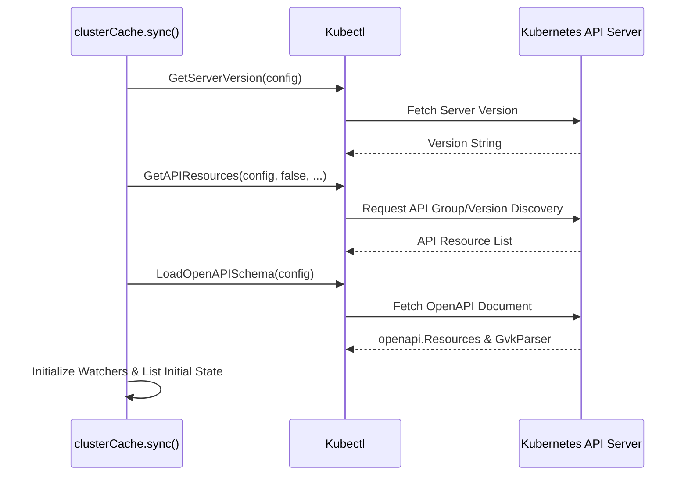
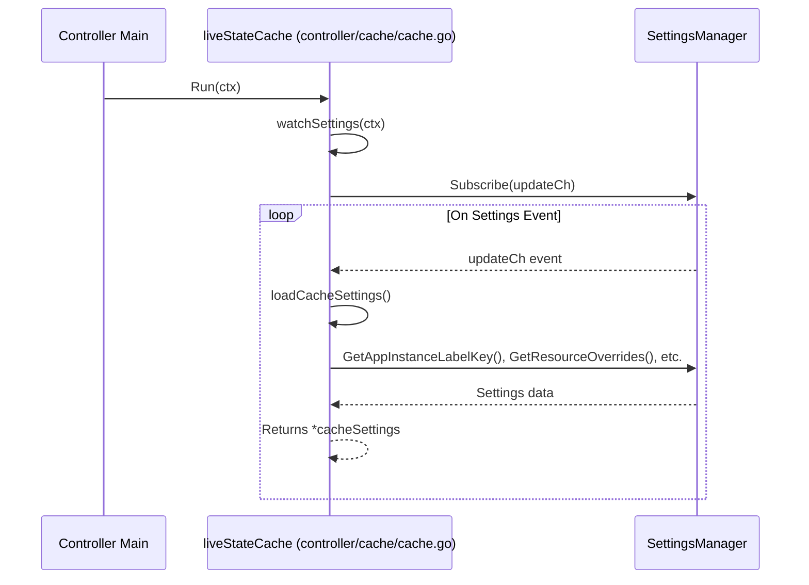
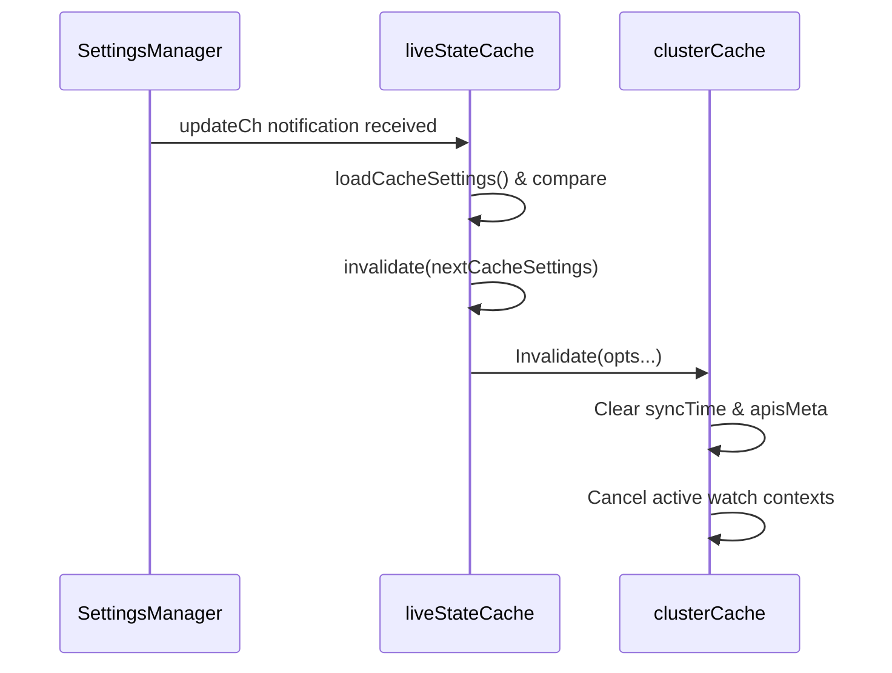
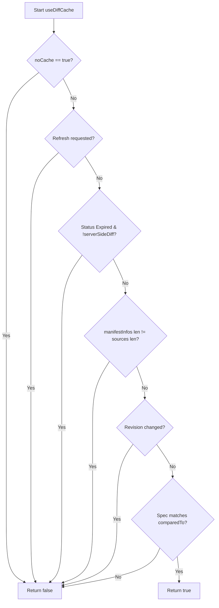

# Resource Cache

Relevant source files

The following files were used as context for generating this wiki page:

- [controller/state.go](https://github.com/argoproj/argo-cd/blob/main/controller/state.go)
- [controller/cache/cache.go](https://github.com/argoproj/argo-cd/blob/main/controller/cache/cache.go)
- [gitops-engine/pkg/cache/cluster.go](https://github.com/argoproj/argo-cd/blob/main/gitops-engine/pkg/cache/cluster.go)
- [controller/sync.go](https://github.com/argoproj/argo-cd/blob/main/controller/sync.go)

## Overview

The resource cache functions as the foundational in-memory caching and real-time state tracking layer for Argo CD, maintaining synchronized representations of Kubernetes cluster resources across all monitored environments. By caching cluster state locally, the system minimizes direct load on remote Kubernetes API servers while providing high-performance state inspection required during frequent reconciliation cycles.

Sources: [gitops-engine/pkg/cache/cluster.go:1-25](https://github.com/argoproj/argo-cd/blob/main/gitops-engine/pkg/cache/cluster.go#L1-L25), [controller/cache/cache.go:134-157](https://github.com/argoproj/argo-cd/blob/main/controller/cache/cache.go#L134-L157)

The component plays a vital role in the broader Argo CD controller architecture by bridging raw Kubernetes cluster objects with application reconciliation and diffing logic. It integrates directly with the application state manager to evaluate resource hierarchies, execute live object lookups, and perform deterministic state comparisons against target manifests.

Sources: [controller/state.go:140-141](https://github.com/argoproj/argo-cd/blob/main/controller/state.go#L140-L141), [controller/state.go:788-793](https://github.com/argoproj/argo-cd/blob/main/controller/state.go#L788-L793)

## Cluster Cache Initialization and Discovery

### Cluster Cache Instance Initialization

Cluster cache initialization begins when the live state cache constructs a new `clusterCache` instance for a target cluster via `NewClusterCache` or when `getCluster` resolves and configures client connections. The configuration applies REST client settings, warning handlers, semaphores, and synchronization timeouts.

Sources: [controller/cache/cache.go:528-592](https://github.com/argoproj/argo-cd/blob/main/controller/cache/cache.go#L528-L592), [gitops-engine/pkg/cache/cluster.go:193-229](https://github.com/argoproj/argo-cd/blob/main/gitops-engine/pkg/cache/cluster.go#L193-L229)

The initialisation process follows a strict execution call chain: `EnsureSynced()` validates the current sync status using `clusterCacheSync.synced()` and acquires synchronization locks before invoking `clusterCache.sync()`, which coordinates discovery, schema loading, and resource listing.

Sources: [gitops-engine/pkg/cache/cluster.go:1094-1230](https://github.com/argoproj/argo-cd/blob/main/gitops-engine/pkg/cache/cluster.go#L1094-L1230), [gitops-engine/pkg/cache/cluster.go:1241-1268](https://github.com/argoproj/argo-cd/blob/main/gitops-engine/pkg/cache/cluster.go#L1241-L1268)

> [!NOTE]
> `EnsureSynced()` first inspects the sync status without acquiring the full `clusterCache` lock to minimize contention. If the sync is valid, it returns immediately; otherwise, it acquires the primary lock and evaluates the sync status a second time.

Sources: [gitops-engine/pkg/cache/cluster.go:1241-1268](https://github.com/argoproj/argo-cd/blob/main/gitops-engine/pkg/cache/cluster.go#L1241-L1268)

### API Resource Discovery and Schema Loading

During cluster synchronization (`clusterCache.sync()`), the engine queries the remote Kubernetes API server to retrieve cluster metadata, API resource lists, and OpenAPI specifications. The `kubectl.GetServerVersion()` function captures the target cluster version, while `kubectl.GetAPIResources()` compiles supported group-versions and resources.

Sources: [gitops-engine/pkg/cache/cluster.go:1135-1145](https://github.com/argoproj/argo-cd/blob/main/gitops-engine/pkg/cache/cluster.go#L1135-L1145)

The OpenAPI schema and GVK parser are loaded via `kubectl.LoadOpenAPISchema()`, populating `c.openAPISchema` and `c.gvkParser`. This schema data is essential for structured merge diffs and schema-aware operations.

Sources: [gitops-engine/pkg/cache/cluster.go:1146-1155](https://github.com/argoproj/argo-cd/blob/main/gitops-engine/pkg/cache/cluster.go#L1146-L1155)

Sources: [gitops-engine/pkg/cache/cluster.go:1135-1155](https://github.com/argoproj/argo-cd/blob/main/gitops-engine/pkg/cache/cluster.go#L1135-L1155)

The cache enforces RBAC permissions during discovery through `checkPermission()`, executing `SelfSubjectAccessReview` queries against the API server when restricted resources return authorization errors.

Sources: [gitops-engine/pkg/cache/cluster.go:1039-1081](https://github.com/argoproj/argo-cd/blob/main/gitops-engine/pkg/cache/cluster.go#L1039-L1081)

### Configuration and Tuning Parameters

Cluster cache initialization utilizes several configurable environment variables and default tuning parameters to control listing concurrency, pagination limits, and backoff behavior.

| Parameter / Constant | Default Value | Environment Variable | Purpose |
| :--- | :--- | :--- | :--- |
| `clusterCacheResyncDuration` | `12h` (controller) `24h` (engine) | `ARGOCD_CLUSTER_CACHE_RESYNC_DURATION` | Controls the duration before refreshing the entire cluster cache. |
| `clusterCacheWatchResyncDuration` | `10m` | `ARGOCD_CLUSTER_CACHE_WATCH_RESYNC_DURATION` | Maximum duration allowed for group/kind watches before relisting. |
| `clusterSyncRetryTimeoutDuration` | `10s` | `ARGOCD_CLUSTER_SYNC_RETRY_TIMEOUT_DURATION` | Retry timeout when a cluster synchronization error occurs. |
| `clusterCacheListSemaphoreSize` | `50` | `ARGOCD_CLUSTER_CACHE_LIST_SEMAPHORE` | Limits concurrent memory-consuming list operations across clusters. |
| `clusterCacheListPageSize` | `500` | `ARGOCD_CLUSTER_CACHE_LIST_PAGE_SIZE` | Page size for Kubernetes list requests via `pager.ListPager`. |
| `clusterCacheListPageBufferSize` | `1` | `ARGOCD_CLUSTER_CACHE_LIST_PAGE_BUFFER_SIZE` | Number of pages to buffer during list pager prefetching. |
| `clusterCacheAttemptLimit` | `1` | `ARGOCD_CLUSTER_CACHE_ATTEMPT_LIMIT` | Retry limit for failed requests during cluster cache synchronization. |

Sources: [controller/cache/cache.go:46-119](https://github.com/argoproj/argo-cd/blob/main/controller/cache/cache.go#L46-L119), [gitops-engine/pkg/cache/cluster.go:63-84](https://github.com/argoproj/argo-cd/blob/main/gitops-engine/pkg/cache/cluster.go#L63-L84)

## Cache Configuration, Dynamic Overrides, and Execution Flow

### Overview

The live state cache dynamically loads configuration settings and monitors Argo CD configuration changes to adjust cache behavior, tracking methods, and resource overrides during startup and runtime.

Sources: [controller/cache/cache.go:210-273](https://github.com/argoproj/argo-cd/blob/main/controller/cache/cache.go#L210-L273), [controller/cache/cache.go:765-796](https://github.com/argoproj/argo-cd/blob/main/controller/cache/cache.go#L765-L796)

### Call-Chain Walkthrough: Run -> ArgoCDDiffOptions

The system initializes settings monitoring through the `Run -> ArgoCDDiffOptions` execution path (`Run` → `watchSettings` → `loadCacheSettings`). When the controller starts, `Run` initiates background background settings watching, which periodically reloads cache options including `ArgoCDDiffOptions`, `ConvertToOverrideKey`, and `AddStatusOverrideToGK`.

The execution path proceeds through these exact named functions in call order:
1. `Run()` ([controller/cache/cache.go:808-818](https://github.com/argoproj/argo-cd/blob/main/controller/cache/cache.go#L808-L818)): Spawns `watchSettings` as a goroutine (`go c.watchSettings(ctx)`) and watches cluster database events to maintain live state cache sync.
2. `watchSettings()` ([controller/cache/cache.go:765-796](https://github.com/argoproj/argo-cd/blob/main/controller/cache/cache.go#L765-L796)): Subscribes to settings update channels via `c.settingsMgr.Subscribe(updateCh)`. Upon receiving a notification, it calls `loadCacheSettings()` to fetch refreshed configuration settings.
3. `loadCacheSettings()` ([controller/cache/cache.go:237-272](https://github.com/argoproj/argo-cd/blob/main/controller/cache/cache.go#L237-L272)): Queries `c.settingsMgr` for `GetAppInstanceLabelKey()`, `GetTrackingMethod()`, `GetInstallationID()`, `GetIgnoreResourceUpdatesOverrides()`, `GetIsIgnoreResourceUpdatesEnabled()`, `GetResourcesFilter()`, and `GetResourceOverrides()`. It constructs and populates a new `cacheSettings` struct containing cluster health overrides and diff parameters.

Sources: [controller/cache/cache.go:237-272](https://github.com/argoproj/argo-cd/blob/main/controller/cache/cache.go#L237-L272), [controller/cache/cache.go:765-796](https://github.com/argoproj/argo-cd/blob/main/controller/cache/cache.go#L765-L796), [controller/cache/cache.go:808-818](https://github.com/argoproj/argo-cd/blob/main/controller/cache/cache.go#L808-L818)

> [!NOTE]
> When settings change during runtime, `watchSettings` compares the existing and incoming configurations using `reflect.DeepEqual`. If modifications are detected, the cache triggers an invalidation across all registered cluster caches to apply the updated resource overrides and health checks immediately.

Sources: [controller/cache/cache.go:779-788](https://github.com/argoproj/argo-cd/blob/main/controller/cache/cache.go#L779-L788)

### Cache Settings Structure and Overrides

The `cacheSettings` type encapsulates all governing properties required for object classification, hashing, and diff evaluation.

| Field Name | Type | Purpose |
| :--- | :--- | :--- |
| `clusterSettings` | `clustercache.Settings` | Holds engine-level resource health overrides and resource filters. |
| `appInstanceLabelKey` | `string` | Kubernetes label key used to associate resources with Argo CD applications. |
| `trackingMethod` | `appv1.TrackingMethod` | Method type used for tracking resource ownership and lineage. |
| `installationID` | `string` | Unique identifier for the Argo CD control plane installation. |
| `resourceOverrides` | `map[string]appv1.ResourceOverride` | Configured differences and overrides to ignore watched resource updates. |
| `ignoreResourceUpdatesEnabled` | `bool` | Flag enabling optimization rules that skip processing unchanged resource manifests. |

Sources: [controller/cache/cache.go:210-220](https://github.com/argoproj/argo-cd/blob/main/controller/cache/cache.go#L210-L220)

## In-Memory Live Resource Tracking

### Overview

The gitops-engine cluster cache maintains state trees, indexes resources by namespace and UID, and handles hierarchy traversal for resource dependencies. Resources are stored in-memory using `Resource` structures indexed by `kube.ResourceKey` and organized via namespace maps (`nsIndex`) alongside a parent-to-children index (`parentUIDToChildren`) for efficient child lookups.

Sources: [gitops-engine/pkg/cache/cluster.go:195-224](https://github.com/argoproj/argo-cd/blob/main/gitops-engine/pkg/cache/cluster.go#L195-L224), [gitops-engine/pkg/cache/cluster.go:261-288](https://github.com/argoproj/argo-cd/blob/main/gitops-engine/pkg/cache/cluster.go#L261-L288)

### Resource State Node Management

When resources are ingested or updated via the cache synchronization and watch loops, the cache executes a structured node management sequence:

1. `newResource` — Resolves resource references, owner references, and invokes any registered `populateResourceInfoHandler` to obtain metadata and manifest caching flags.
Sources: [gitops-engine/pkg/cache/cluster.go:457-483](https://github.com/argoproj/argo-cd/blob/main/gitops-engine/pkg/cache/cluster.go#L457-L483)

2. `setNode` — Assigns the resource into the primary `c.resources` map and the namespace-specific `c.nsIndex` map, then invokes index maintenance.
Sources: [gitops-engine/pkg/cache/cluster.go:485-498](https://github.com/argoproj/argo-cd/blob/main/gitops-engine/pkg/cache/cluster.go#L485-L498)

3. `updateParentUIDToChildren` — Computes diffs between old and new owner reference UIDs, adding or removing child keys from parent sets.
Sources: [gitops-engine/pkg/cache/cluster.go:571-602](https://github.com/argoproj/argo-cd/blob/main/gitops-engine/pkg/cache/cluster.go#L571-L602)

4. `addToParentUIDToChildren` / `removeFromParentUIDToChildren` — Mutates the `parentUIDToChildren` adjacency map using `struct{}` value sets for $O(1)$ child lookups.
Sources: [gitops-engine/pkg/cache/cluster.go:543-568](https://github.com/argoproj/argo-cd/blob/main/gitops-engine/pkg/cache/cluster.go#L543-L568)

> [!NOTE]
> The `parentUIDToChildren` index maps any resource's UID directly to a set of its direct children's `ResourceKey` structures. This eliminates the need for $O(n)$ full-graph traversal during cross-namespace parent-child lookups.

Sources: [gitops-engine/pkg/cache/cluster.go:18-25](https://github.com/argoproj/argo-cd/blob/main/gitops-engine/pkg/cache/cluster.go#L18-L25), [gitops-engine/pkg/cache/cluster.go:283-288](https://github.com/argoproj/argo-cd/blob/main/gitops-engine/pkg/cache/cluster.go#L283-L288)

### Hierarchy Traversal and Call States

The cache implements `IterateHierarchyV2` to traverse resource trees starting from specified keys. During traversal, nodes pass through explicit invocation states to manage recursion and prevent infinite loops.

| Call State Constant | Value | Meaning |
| :--- | :--- | :--- |
| `notCalled` | `0` (`iota`) | Action callback has not been executed yet for the resource. |
| `inProgress` | `1` | Action callback is currently being processed within the call stack. |
| `completed` | `2` | Action callback execution and recursive descendant traversal are finished. |

Sources: [gitops-engine/pkg/cache/cluster.go:96-102](https://github.com/argoproj/argo-cd/blob/main/gitops-engine/pkg/cache/cluster.go#L96-L102)

> [!WARNING]
> Circular dependencies in owner references are guarded against by tracking visited nodes and checking `actionCallState`. If a cycle is encountered, traversal skips already completed or in-progress branches to prevent stack overflows.

Sources: [gitops-engine/pkg/cache/cluster.go:356-361](https://github.com/argoproj/argo-cd/blob/main/gitops-engine/pkg/cache/cluster.go#L356-L361), [gitops-engine/pkg/cache/cluster.go:1348-1359](https://github.com/argoproj/argo-cd/blob/main/gitops-engine/pkg/cache/cluster.go#L1348-L1359)

### Design Trade-Offs in Indexing

| Design Choice | Benefit | Cost |
| :--- | :--- | :--- |
| **Separate `nsIndex` by namespace string** | Fast namespace-scoped lookups and isolated graph building per namespace. | Memory overhead maintaining redundant map indexing across namespaces. |
| **`parentUIDToChildren` UID adjacency set** | $O(1)$ child lookups for cross-namespace hierarchy traversal without full graph scans. | Requires explicit maintenance on every resource update, addition, or removal. |
| **`actionCallState` tracking map** | Prevents infinite recursion on circular owner references during tree walks. | Allocation cost of map instances per `IterateHierarchyV2` execution. |

Sources: [gitops-engine/pkg/cache/cluster.go:261-288](https://github.com/argoproj/argo-cd/blob/main/gitops-engine/pkg/cache/cluster.go#L261-L288), [gitops-engine/pkg/cache/cluster.go:1311-1340](https://github.com/argoproj/argo-cd/blob/main/gitops-engine/pkg/cache/cluster.go#L1311-L1340)

## Cluster Event Processing and Invalidation

### Overview

The live state cache tracks real-time cluster mutations by establishing dynamic Kubernetes watches for each discovered API resource. When cluster objects are added, modified, or deleted, watch streams emit events that flow through ingestion handlers, optional batch queues, and in-memory cache updates. Concurrently, controller settings changes can trigger cluster-wide cache invalidations.

Sources: [controller/cache/cache.go:664-675](https://github.com/argoproj/argo-cd/blob/main/controller/cache/cache.go#L664-L675), [gitops-engine/pkg/cache/cluster.go:792-832](https://github.com/argoproj/argo-cd/blob/main/gitops-engine/pkg/cache/cluster.go#L792-L832)

### Event Processing Call-Chain

Incoming Kubernetes watch events are processed through a structured sequence of methods that filter, batch, and apply state transitions to the in-memory cache.

The execution path proceeds as follows:

`recordEvent()` → `c.eventMetaCh` (when batched) or `processEvent()` → `onNodeUpdated()` / `onNodeRemoved()` → `setNode()`

1. **`recordEvent()`**: Receives raw watch events (`watch.EventType`) and unstructured objects from the retry watcher, invokes registered event handlers, and filters out high-churn types like `endpoints` using `skipAppRequeuing()`.
2. **`c.eventMetaCh` / `processEvents()`**: If batch event processing is enabled, event metadata is pushed onto a channel and buffered by a ticker set to `ARGOCD_CLUSTER_CACHE_EVENTS_PROCESSING_INTERVAL`. Otherwise, events are processed immediately under a write lock.
3. **`processEvent()`**: Determines whether an event represents a deletion or an update/addition, branching to `onNodeRemoved()` or `onNodeUpdated()`.
4. **`onNodeUpdated()` / `onNodeRemoved()`**: Mutates the internal resource stores, updates parent-child index references, and triggers registered resource-updated handlers to notify dependent applications.
5. **`setNode()`**: Inserts or updates the resource within `c.resources`, updates the namespace index `c.nsIndex`, maintains the `parentUIDToChildren` mapping, and propagates inferred owner references.

Sources: [controller/cache/cache.go:593-636](https://github.com/argoproj/argo-cd/blob/main/controller/cache/cache.go#L593-L636), [gitops-engine/pkg/cache/cluster.go:1638-1760](https://github.com/argoproj/argo-cd/blob/main/gitops-engine/pkg/cache/cluster.go#L1638-L1760)

### Cache Invalidation and Settings Watch

When configuration options or cluster connections change, the cache must be invalidated and re-synchronized. Settings changes are monitored asynchronously and trigger a cascading reset across active cluster caches.

Sources: [controller/cache/cache.go:664-675](https://github.com/argoproj/argo-cd/blob/main/controller/cache/cache.go#L664-L675), [controller/cache/cache.go:765-796](https://github.com/argoproj/argo-cd/blob/main/controller/cache/cache.go#L765-L796), [gitops-engine/pkg/cache/cluster.go:605-627](https://github.com/argoproj/argo-cd/blob/main/gitops-engine/pkg/cache/cluster.go#L605-L627)

> [!WARNING]
> Calling `clusterCache.Invalidate()` resets `syncStatus.syncTime` to `nil`, cancels all active API watch cancellation functions (`watchCancel`), and drops the `apisMeta` map. Subsequent read operations will block until `EnsureSynced()` successfully completes a full discovery and initial list cycle.

Sources: [gitops-engine/pkg/cache/cluster.go:605-627](https://github.com/argoproj/argo-cd/blob/main/gitops-engine/pkg/cache/cluster.go#L605-L627)

## Application State Comparison and Diffing

### Overview

Application state comparison reconciles declarative target manifests against live resource cache states to compute sync statuses, health conditions, and structural diffs. The `appStateManager.CompareAppState()` method orchestrates this workflow by gathering target objects, querying managed live states from the cluster cache, invoking gitops-engine reconciliation, and computing diff configurations.

Sources: [controller/state.go:680-983](https://github.com/argoproj/argo-cd/blob/main/controller/state.go#L680-L983)

### Comparison Call-Chain

The execution path for evaluating an application's live state relative to its target manifests follows a precise sequence of operations within `appStateManager`:

`CompareAppState()` → `NormalizeTargetObjects()` → `liveStateCache.GetManagedLiveObjs()` → `sync.Reconcile()` → `argodiff.StateDiffs()` → `setApplicationHealth()`

1. **`CompareAppState()`**: Initializes comparison settings, loads target manifests via `GetRepoObjs()` or local files, and sets up tracing spans.
2. **`NormalizeTargetObjects()`**: Adjusts cluster-scoped versus namespace-scoped object paths, injects resource tracking labels, and filters out duplicated resources.
3. **`GetManagedLiveObjs()`**: Queries the destination cluster cache (`clusterCache`) to retrieve live unstructured objects belonging to the application instance.
4. **`sync.Reconcile()`**: Pairs target manifests with live cluster resources, matching objects by resource key and grouping hooks.
5. **`StateDiffs()`**: Evaluates structural differences between reconciled live and target objects using the constructed `diffConfig`.
6. **`setApplicationHealth()`**: Calculates the aggregate health status and message for the application based on managed resources and overrides.

Sources: [controller/state.go:680-983](https://github.com/argoproj/argo-cd/blob/main/controller/state.go#L680-L983), [controller/state.go:1109-1110](https://github.com/argoproj/argo-cd/blob/main/controller/state.go#L1109-L1110)

### Diff Caching and Strategy Options

Argo CD determines whether to reuse cached diff results by evaluating the `useDiffCache()` criteria. The system skips diff caching if explicit refresh flags are set, if the application status has expired past `statusRefreshTimeout`, or if the target revisions or specifications have changed.

Sources: [controller/state.go:1180-1218](https://github.com/argoproj/argo-cd/blob/main/controller/state.go#L1180-L1218)

> [!NOTE]
> When `ServerSideDiff=true` is configured via annotations or controller settings, diff generation provisions a Kubernetes server-side dry-run applier. This dry-runner simulates server-side apply operations to compute more accurate diffs for complex mutating webhooks and default values.

Sources: [controller/state.go:914-957](https://github.com/argoproj/argo-cd/blob/main/controller/state.go#L914-L957)

### Comparison Configuration Constants

The diff and reconciliation engine relies on specific options and annotations defined during state evaluation:

| Option / Annotation Key | Type | Default Value | Purpose |
| :--- | :--- | :--- | :--- |
| `ServerSideDiff` | Annotation Option | `false` | Enables server-side dry-run diffing against the Kubernetes API server. |
| `ServerSideApply` | Sync Option | `false` | Enables structured merge diff calculation for server-side apply. |
| `RespectIgnoreDifferences` | Sync Option | `false` | Normalizes target resources against live ignored fields prior to synchronization. |
| `ARGOCD_SYNC_WAVE_DELAY` | Environment Variable | `2` (seconds) | Artificial delay between sync waves to allow dependent controllers to react. |

Sources: [controller/state.go:914-962](https://github.com/argoproj/argo-cd/blob/main/controller/state.go#L914-L962), [controller/sync.go:47-48](https://github.com/argoproj/argo-cd/blob/main/controller/sync.go#L47-L48), [controller/sync.go:308-322](https://github.com/argoproj/argo-cd/blob/main/controller/sync.go#L308-L322), [controller/sync.go:398-401](https://github.com/argoproj/argo-cd/blob/main/controller/sync.go#L398-L401)

## Related

- [[Application Controller]]
- [[Resource Diffing]]

