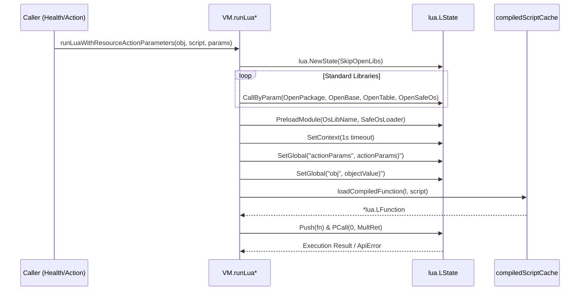

# Resource Customizations

<details>
<summary>Relevant source files</summary>

The following files were used as context for generating this wiki page:

- [docs/operator-manual/health.md](https://github.com/argoproj/argo-cd/blob/main/docs/operator-manual/health.md)
- [docs/operator-manual/resource_actions.md](https://github.com/argoproj/argo-cd/blob/main/docs/operator-manual/resource_actions.md)
- [util/lua/lua.go](https://github.com/argoproj/argo-cd/blob/main/util/lua/lua.go)
- [resource_customizations/apiextensions.k8s.io/CustomResourceDefinition/health.lua](https://github.com/argoproj/argo-cd/blob/main/resource_customizations/apiextensions.k8s.io/CustomResourceDefinition/health.lua)
- [pkg/apis/application/v1alpha1/types.go](https://github.com/argoproj/argo-cd/blob/main/pkg/apis/application/v1alpha1/types.go)
</details>

## Overview

Resource customizations in Argo CD empower operators to extend native GitOps capabilities beyond standard Kubernetes primitives by defining custom health assessment checks, interactive resource actions, and granular diff overrides using Lua scripting. Because Custom Resource Definitions (CRDs) lack a standardized status format, Argo CD relies on these customizations to accurately evaluate resource health and surface custom operational tasks directly within the user interface.
Sources: [docs/operator-manual/health.md:65-70](https://github.com/argoproj/argo-cd/blob/main/docs/operator-manual/health.md#L65-L70), [docs/operator-manual/resource_actions.md:3-6](https://github.com/argoproj/argo-cd/blob/main/docs/operator-manual/resource_actions.md#L3-L6)

The configuration framework is driven by data structures defined in `v1alpha1`, allowing operators to manage resource overrides, action handlers, and diff rules through the `argocd-cm` ConfigMap or bundled filesystem definitions. Under the hood, Argo CD leverages a dedicated Lua script execution runtime to process scripts safely with content-addressed caching, sandboxed environments, and automatic type conversion.
Sources: [util/lua/lua.go:43-57](https://github.com/argoproj/argo-cd/blob/main/util/lua/lua.go#L43-L57), [pkg/apis/application/v1alpha1/types.go:2593-2606](https://github.com/argoproj/argo-cd/blob/main/pkg/apis/application/v1alpha1/types.go#L2593-L2606)

## Lua Script Execution Runtime

### Overview

The Lua execution engine manages runtime state creation, function compilation caching, library initialization, and context timeouts for custom scripts. Argo CD instantiates custom Lua scripts through a shared `VM` struct, utilizing `github.com/yuin/gopher-lua` as the underlying virtual machine. To optimize performance across recurring evaluations, compiled scripts are retained in a content-addressed LRU cache.
Sources: [util/lua/lua.go:48-77](https://github.com/argoproj/argo-cd/blob/main/util/lua/lua.go#L48-L77), [util/lua/lua.go:121-126](https://github.com/argoproj/argo-cd/blob/main/util/lua/lua.go#L121-L126)

### VM Initialization and Execution Call Chain

When executing a resource script, the engine follows an explicit call sequence to initialize libraries, inject globals, load functions, and execute code within a time-bounded context.


Sources: [util/lua/lua.go:132-191](https://github.com/argoproj/argo-cd/blob/main/util/lua/lua.go#L132-L191), [util/lua/lua.go:198-211](https://github.com/argoproj/argo-cd/blob/main/util/lua/lua.go#L198-L211)

The complete invocation path proceeds through specific functions:
1. `runLuaWithResourceActionParameters()` initializes the state with `lua.NewState()` using options governed by `UseOpenLibs`.
2. Libraries are loaded onto the state via `l.CallByParam()` and modules are registered using `l.PreloadModule()`.
3. A 1-second timeout context is assigned via `l.SetContext()`, and input data structures (`actionParams` and `obj`) are decoded and registered globally using `decodeValue()`.
4. `loadCompiledFunction()` checks the content-addressed cache (`compiledScripts.get()`) or falls back to `l.LoadString()` to compile the script proto.
5. The loaded function is pushed to the stack and executed via `l.PCall()`, stripping runtime stack traces from `lua.ApiError` objects before returning.
Sources: [util/lua/lua.go:132-191](https://github.com/argoproj/argo-cd/blob/main/util/lua/lua.go#L132-L191), [util/lua/lua.go:68-87](https://github.com/argoproj/argo-cd/blob/main/util/lua/lua.go#L68-L87)

> [!WARNING]
> If script execution exceeds the 1-second timeout established by `context.WithTimeout`, the Lua VM halts execution and returns a timeout error. Ensure custom scripts remain concise and avoid infinite loops.
Sources: [util/lua/lua.go:159-161](https://github.com/argoproj/argo-cd/blob/main/util/lua/lua.go#L159-L161)

### Runtime Components and Configuration Constants

The runtime behavior is controlled by several parameters and registered library handlers defined in the package.

| Constant / Variable | Type | Default Value | Purpose |
| :--- | :--- | :--- | :--- |
| `compiledScriptCacheSize` | `int` | `1024` | Bounds the maximum number of compiled function prototypes retained in the LRU cache. |
| `scriptCacheEnabled` | `bool` | `true` | Process-wide flag controlling whether compiled scripts are cached and reused. |
| `healthScriptFile` | `string` | `"health.lua"` | Standard filename for embedded resource health assessment scripts. |
| `actionScriptFile` | `string` | `"action.lua"` | Standard filename for embedded resource action scripts. |
| `actionDiscoveryScriptFile` | `string` | `"discovery.lua"` | Standard filename for embedded resource action discovery scripts. |
Sources: [util/lua/lua.go:32-58](https://github.com/argoproj/argo-cd/blob/main/util/lua/lua.go#L32-L58)

### Script Compilation Caching

The `compiledScriptCache` type wraps a `sync.Mutex` and an underlying `github.com/golang/groupcache/lru` cache. Because `gopher-lua` function prototypes (`lua.FunctionProto`) are immutable, a single compiled prototype can safely back concurrent executions across separate `LState` instances without re-compilation overhead.
Sources: [util/lua/lua.go:60-77](https://github.com/argoproj/argo-cd/blob/main/util/lua/lua.go#L60-L77)

> [!NOTE]
> The cache key is the raw script source string. Any modification to a customization script results in a cache miss and triggers compilation without requiring explicit cache invalidation.
Sources: [util/lua/lua.go:53-57](https://github.com/argoproj/argo-cd/blob/main/util/lua/lua.go#L53-L57)

### Design Trade-Offs

| Design Choice | Benefit | Cost |
| :--- | :--- | :--- |
| **Content-addressed LRU script caching** | Eliminates repeated string compilation overhead; edits automatically miss the cache safely. | Bounded memory consumption requires minor heap maintenance under cache churn. |
| **Strict 1-second execution timeout** | Prevents misbehaving scripts from locking worker threads or causing resource exhaustion. | Complex calculations or heavy loops within scripts must be avoided. |
| **Explicit JSON roundtrip for return types** | Simplifies unmarshaling Lua tables into strongly-typed Go health and action structures. | Serialization/deserialization overhead on every script return value. |
Sources: [util/lua/lua.go:43-77](https://github.com/argoproj/argo-cd/blob/main/util/lua/lua.go#L43-L77), [util/lua/lua.go:159-161](https://github.com/argoproj/argo-cd/blob/main/util/lua/lua.go#L159-L161), [util/lua/lua.go:220-226](https://github.com/argoproj/argo-cd/blob/main/util/lua/lua.go#L220-L226)

## Resource Health Assessment

### Overview

Argo CD assesses resource health by executing health scripts against Kubernetes objects. The health assessment execution flow bridges strongly typed Go code with custom or built-in Lua scripts, resolving overrides, validating health status codes, and handling wildcard matching for custom resource definitions.
Sources: [util/lua/lua.go:99-119](https://github.com/argoproj/argo-cd/blob/main/util/lua/lua.go#L99-L119)

### Health Script Resolution and Execution Call-Chain

When evaluating the health of an unstructured Kubernetes resource, Argo CD follows a strict resolution and execution call-chain to locate and run the appropriate Lua script:

1. `ResourceHealthOverrides.GetResourceHealth()` instantiates a `VM` and invokes `VM.GetHealthScript(obj)`.
Sources: [util/lua/lua.go:99-105](https://github.com/argoproj/argo-cd/blob/main/util/lua/lua.go#L99-L105)
2. `VM.GetHealthScript()` first queries `vm.ResourceOverrides` for an exact GroupVersionKind match using `GetConfigMapKey()`. If not found, it evaluates `getWildcardHealthOverrideLua()` against wildcard override patterns.
Sources: [util/lua/lua.go:251-264](https://github.com/argoproj/argo-cd/blob/main/util/lua/lua.go#L251-L264)
3. If no override matches, `vm.getPredefinedLuaScripts()` attempts to load the built-in script from the embedded filesystem using the exact GVK path combined with `healthScriptFile`.
Sources: [util/lua/lua.go:266-270](https://github.com/argoproj/argo-cd/blob/main/util/lua/lua.go#L266-L270)
4. If the exact built-in script does not exist (`errScriptDoesNotExist`), `getWildcardBuiltInHealthOverrideLua()` searches embedded directories using glob patterns sorted via `getGlobHealthScriptPaths()`.
Sources: [util/lua/lua.go:270-277](https://github.com/argoproj/argo-cd/blob/main/util/lua/lua.go#L270-L277), [util/lua/lua.go:639-642](https://github.com/argoproj/argo-cd/blob/main/util/lua/lua.go#L639-L642)
5. Once the script text and `useOpenLibs` flag are resolved, `luaVM.ExecuteHealthLua(obj, script)` executes the script inside the Lua VM and decodes the resulting return table.
Sources: [util/lua/lua.go:112-118](https://github.com/argoproj/argo-cd/blob/main/util/lua/lua.go#L112-L118)

> [!NOTE]
> Standard Lua libraries are automatically enabled for all built-in scripts (`useOpenLibs = true`), whereas user-defined overrides in `argocd-cm` have standard libraries disabled by default unless explicitly permitted via `resource.customizations.useOpenLibs.<group>_<kind>`.
Sources: [docs/operator-manual/health.md:158-168](https://github.com/argoproj/argo-cd/blob/main/docs/operator-manual/health.md#L158-L168), [util/lua/lua.go:285-286](https://github.com/argoproj/argo-cd/blob/main/util/lua/lua.go#L285-L286)

### Health Status Validation and Return Codes

`ExecuteHealthLua()` ensures that Lua return values conform to expected health structures and valid status codes. The returned Lua table is encoded to JSON via `layeh.com/gopher-json` and unmarshaled into a `health.HealthStatus` struct.
Sources: [util/lua/lua.go:214-226](https://github.com/argoproj/argo-cd/blob/main/util/lua/lua.go#L214-L226)

| Health Status Code | Constant / Value | Meaning in Runtime |
| :--- | :--- | :--- |
| `Unknown` | `health.HealthStatusUnknown` | Default status assigned when health evaluation fails or receives an invalid status string. |
| `Progressing` | `health.HealthStatusProgressing` | Resource is not healthy yet, still reconciling, or terminating. |
| `Suspended` | `health.HealthStatusSuspended` | Resource is suspended and waiting for an external resume event. |
| `Healthy` | `health.HealthStatusHealthy` | Resource has successfully reconciled and met all health criteria. |
| `Degraded` | `health.HealthStatusDegraded` | Resource encountered unrecoverable errors, schema violations, or failure conditions. |
| `Missing` | `health.HealthStatusMissing` | Resource is absent from the cluster state. |
Sources: [util/lua/lua.go:672-678](https://github.com/argoproj/argo-cd/blob/main/util/lua/lua.go#L672-L678)

> [!WARNING]
> If a Lua health script returns an unrecognized status string, `isValidHealthStatusCode()` intercepts it and normalizes the result to `Unknown` with an `invalidHealthStatus` message rather than returning an unhandled error to the engine.
Sources: [util/lua/lua.go:235-240](https://github.com/argoproj/argo-cd/blob/main/util/lua/lua.go#L235-L240)

### CustomResourceDefinition Built-In Health Implementation

The built-in health check for `apiextensions.k8s.io/CustomResourceDefinition` demonstrates complex condition evaluation. It inspects `obj.metadata.deletionTimestamp` and iterates through `obj.status.conditions` to assess establishment and validation states.
Sources: [resource_customizations/apiextensions.k8s.io/CustomResourceDefinition/health.lua:1-59](https://github.com/argoproj/argo-cd/blob/main/resource_customizations/apiextensions.k8s.io/CustomResourceDefinition/health.lua#L1-L59)

```lua
local hs = {}

-- Check if CRD is terminating
if obj.metadata.deletionTimestamp ~= nil then
    hs.status = "Progressing"
    hs.message = "CRD is terminating"
    return hs
end

if obj.status.conditions == nil or #obj.status.conditions == 0 then
    hs.status = "Progressing"
    hs.message = "Status conditions not found"
    return hs
end

local isEstablished
for _, condition in pairs(obj.status.conditions) do
    if condition.type == "NamesAccepted" and condition.status == "False" then
        hs.status = "Degraded"
        hs.message = "CRD names have not been accepted: " .. condition.message
        return hs
    end
    if condition.type == "NonStructuralSchema" and condition.status == "True" then
        hs.status = "Degraded"
        hs.message = "Schema violations found: " .. condition.message
        return hs
    end
    if condition.type == "Established" and condition.status == "True" then
        isEstablished = true
    end
end

if not isEstablished then
    hs.status = "Degraded"
    hs.message = "CRD is not established"
    return hs
end

hs.status = "Healthy"
hs.message = "CRD is healthy"
return hs
```
Sources: [resource_customizations/apiextensions.k8s.io/CustomResourceDefinition/health.lua:1-69](https://github.com/argoproj/argo-cd/blob/main/resource_customizations/apiextensions.k8s.io/CustomResourceDefinition/health.lua#L1-L69)

## Custom Resource Action Discovery

### Overview

Argo CD discovers custom resource actions by evaluating Lua discovery scripts (`discovery.lua`) associated with specific Kubernetes resources. The discovery process populates available actions, reads parameters, and determines whether actions are enabled or disabled based on the live object's runtime state. Operators can define these scripts inside the `argocd-cm` ConfigMap or package them as built-in customizations under the `resource_customizations` directory.
Sources: [docs/operator-manual/resource_actions.md:50-81](https://github.com/argoproj/argo-cd/blob/main/docs/operator-manual/resource_actions.md#L50-L81), [util/lua/lua.go:496-528](https://github.com/argoproj/argo-cd/blob/main/util/lua/lua.go#L496-L528)

### Action Discovery Execution Walkthrough

The runtime resolves and executes resource action discovery through a sequence of functions in `util/lua/lua.go`:

1. `GetResourceActionDiscovery(obj)` retrieves discovery script paths by checking `ResourceOverrides` in `argocd-cm` for the object's GroupVersionKind. If built-in action merging is disabled (`!actions.MergeBuiltinActions`), it returns only the override script; otherwise, it appends both override and predefined built-in discovery scripts.
Sources: [util/lua/lua.go:496-528](https://github.com/argoproj/argo-cd/blob/main/util/lua/lua.go#L496-L528)
2. `ExecuteResourceActionDiscovery(obj, scripts)` iterates through the script paths and invokes `vm.runLua(obj, script)` to execute each discovery script inside the Lua state machine with `obj` injected as a global variable.
Sources: [util/lua/lua.go:413-424](https://github.com/argoproj/argo-cd/blob/main/util/lua/lua.go#L413-L424)
3. The script return value is checked via `returnValue.Type() == lua.LTTable` and encoded into JSON via `layeh.com/gopher-json`. If `noAvailableActions(jsonBytes)` detects an empty array (`"[]"`), it skips the script.
Sources: [util/lua/lua.go:424-434](https://github.com/argoproj/argo-cd/blob/main/util/lua/lua.go#L424-L434)
4. `json.Unmarshal` parses the table into an `actionsMap`. For each action key, `isActionDisabled(value)` inspects the nested table fields for a `"disabled"` boolean property. If absent or valid, the resulting `appv1.ResourceAction` struct is populated and collected into `availableActionsMap`.
Sources: [util/lua/lua.go:435-468](https://github.com/argoproj/argo-cd/blob/main/util/lua/lua.go#L435-L468), [util/lua/lua.go:471-484](https://github.com/argoproj/argo-cd/blob/main/util/lua/lua.go#L471-L484)

> [!NOTE]
> If a discovery script returns an empty Lua table, `gopher-json` encodes it as an empty JSON array (`"[]"`). `noAvailableActions()` explicitly intercepts this payload to prevent unmarshaling errors and safely treats it as zero available actions.
Sources: [util/lua/lua.go:491-494](https://github.com/argoproj/argo-cd/blob/main/util/lua/lua.go#L491-L494)

## Resource Action Execution Workflow

### Overview

Executing custom resource actions involves evaluating Lua action scripts, handling old-style and new-style return values, and mutating Kubernetes resource payloads safely. Argo CD processes action handlers through dedicated methods in the Lua virtual machine execution pipeline.
Sources: [util/lua/lua.go:289-337](https://github.com/argoproj/argo-cd/blob/main/util/lua/lua.go#L289-L337)

### Action Execution Call-Chain

When a user triggers a resource action, the runtime executes the request through a specific call sequence in `util/lua/lua.go`:

1. `GetResourceAction(obj, actionName)` looks up the action definition in `ResourceOverrides` or loads the predefined built-in action script file (`action.lua`) corresponding to the resource GroupVersionKind and action identifier.
Sources: [util/lua/lua.go:530-556](https://github.com/argoproj/argo-cd/blob/main/util/lua/lua.go#L530-L556)
2. `ExecuteResourceAction(obj, script, resourceActionParameters)` invokes `vm.runLuaWithResourceActionParameters(obj, script, resourceActionParameters)` to construct the Lua VM state, inject `obj` and `actionParams` globals, load and execute the compiled action script.
Sources: [util/lua/lua.go:289-293](https://github.com/argoproj/argo-cd/blob/main/util/lua/lua.go#L289-L293)
3. The script return value is fetched via `l.Get(-1)` and validated as an `LTTable` before being encoded into raw JSON bytes using `layeh.com/gopher-json`.
Sources: [util/lua/lua.go:294-299](https://github.com/argoproj/argo-cd/blob/main/util/lua/lua.go#L294-L299)
4. `UnmarshalToImpactedResources(string(jsonBytes))` inspects whether the JSON payload represents an array (new-style action output returning a list of impacted resources with operations like `create` or `patch`) or an object (old-style single resource output). Old-style object outputs are wrapped in a single-member array with a `patch` operation.
Sources: [util/lua/lua.go:311-326](https://github.com/argoproj/argo-cd/blob/main/util/lua/lua.go#L311-L326), [util/lua/lua.go:339-351](https://github.com/argoproj/argo-cd/blob/main/util/lua/lua.go#L339-L351)
5. For every impacted resource targeted by a `PatchOperation`, `cleanReturnedObj(newObj.Object, obj.Object)` recursively iterates through fields to prevent Lua table type ambiguities from unintentionally converting empty structs into empty arrays.
Sources: [util/lua/lua.go:328-336](https://github.com/argoproj/argo-cd/blob/main/util/lua/lua.go#L328-L336), [util/lua/lua.go:353-386](https://github.com/argoproj/argo-cd/blob/main/util/lua/lua.go#L353-L386)

> [!WARNING]
> Lua scripts cannot natively distinguish between an empty table intended as an object map versus an empty array. If left unhandled, returning empty tables can overwrite existing Kubernetes resource fields with empty arrays. Argo CD's `cleanReturnedObj()` function guards against this by comparing the returned object structure back against the original live object (`obj`).
Sources: [util/lua/lua.go:353-356](https://github.com/argoproj/argo-cd/blob/main/util/lua/lua.go#L353-L356)

### Payload Mutation and Operations

Custom actions can modify existing resources or introduce new ones. The resulting `ImpactedResource` structs define the Kubernetes operations to perform.

| Operation | Scope | Description |
| :--- | :--- | :--- |
| `patch` | Source Resource Only | Modifies and returns the existing source object, passing through object cleaning to preserve types. |
| `create` | New Resources | Constructs and introduces new or child resource manifests (such as Jobs or ConfigMaps) to be created. |
Sources: [docs/operator-manual/resource_actions.md:34-42](https://github.com/argoproj/argo-cd/blob/main/docs/operator-manual/resource_actions.md#L34-L42), [util/lua/lua.go:328-336](https://github.com/argoproj/argo-cd/blob/main/util/lua/lua.go#L328-L336)

## Customization Types and Configurations

### Overview

Argo CD defines robust data structures in package `v1alpha1` to specify resource customizations, diff rules, and action definitions. These configurations let operators override resource health logic, adjust comparison behavior via JSON pointers or JQ expressions, and declare executable Lua actions.
Sources: [pkg/apis/application/v1alpha1/types.go:2573-2677](https://github.com/argoproj/argo-cd/blob/main/pkg/apis/application/v1alpha1/types.go#L2573-L2677)

### Customization and Override Structures

The primary data structures governing resource behavior and overrides encapsulate script definitions, field ignores, and type coercions.

| Structure Name | Field Name | Type | Purpose |
| :--- | :--- | :--- | :--- |
| `ResourceOverride` | `HealthLua` | `string` | Contains custom Lua script defining health checks for the resource. |
Sources: [pkg/apis/application/v1alpha1/types.go:2593-2595](https://github.com/argoproj/argo-cd/blob/main/pkg/apis/application/v1alpha1/types.go#L2593-L2595)
| `ResourceOverride` | `UseOpenLibs` | `bool` | Enables open-source Lua libraries during script execution. |
Sources: [pkg/apis/application/v1alpha1/types.go:2596-2597](https://github.com/argoproj/argo-cd/blob/main/pkg/apis/application/v1alpha1/types.go#L2596-L2597)
| `ResourceOverride` | `Actions` | `string` | Defines custom actions executable on the resource as a Lua script. |
Sources: [pkg/apis/application/v1alpha1/types.go:2598-2599](https://github.com/argoproj/argo-cd/blob/main/pkg/apis/application/v1alpha1/types.go#L2598-L2599)
| `ResourceOverride` | `IgnoreDifferences` | `OverrideIgnoreDiff` | Configuration specifying which field differences to ignore during diffing. |
Sources: [pkg/apis/application/v1alpha1/types.go:2600-2601](https://github.com/argoproj/argo-cd/blob/main/pkg/apis/application/v1alpha1/types.go#L2600-L2601)
| `ResourceOverride` | `IgnoreResourceUpdates` | `OverrideIgnoreDiff` | Configuration holding rules for ignoring updates to specific resource fields. |
Sources: [pkg/apis/application/v1alpha1/types.go:2602-2603](https://github.com/argoproj/argo-cd/blob/main/pkg/apis/application/v1alpha1/types.go#L2602-L2603)
| `ResourceOverride` | `KnownTypeFields` | `[]KnownTypeField` | Lists fields requiring unit conversions during comparison. |
Sources: [pkg/apis/application/v1alpha1/types.go:2604-2605](https://github.com/argoproj/argo-cd/blob/main/pkg/apis/application/v1alpha1/types.go#L2604-L2605)

### Diff Rules and Ignore Configurations

Field comparison exceptions are managed using `OverrideIgnoreDiff` and `ResourceIgnoreDifferences`. These structures support multiple path representations and manager permissions.

- `OverrideIgnoreDiff`: Contains `JSONPointers` ([]string), `JQPathExpressions` ([]string), and `ManagedFieldsManagers` ([]string).
Sources: [pkg/apis/application/v1alpha1/types.go:2573-2581](https://github.com/argoproj/argo-cd/blob/main/pkg/apis/application/v1alpha1/types.go#L2573-L2581)
- `ResourceIgnoreDifferences`: Adds resource selectors (`Group`, `Kind`, `Name`, `Namespace`) alongside `JSONPointers`, `JQPathExpressions`, and `ManagedFieldsManagers` to target specific workloads across applications.
Sources: [pkg/apis/application/v1alpha1/types.go:124-134](https://github.com/argoproj/argo-cd/blob/main/pkg/apis/application/v1alpha1/types.go#L124-L134)

> [!NOTE]
> `ResourceOverride` implements custom JSON marshalling and unmarshalling methods (`UnmarshalJSON` and `MarshalJSON`). These functions parse the embedded `IgnoreDifferences` and `IgnoreResourceUpdates` YAML payloads into structured Go objects using `yaml.Unmarshal()`.
Sources: [pkg/apis/application/v1alpha1/types.go:2611-2644](https://github.com/argoproj/argo-cd/blob/main/pkg/apis/application/v1alpha1/types.go#L2611-L2644)

### Action Declarations

Custom resource actions are structured hierarchically using `ResourceActions` and `ResourceActionDefinition`. 

- `ResourceActions` holds `ActionDiscoveryLua` (string), `Definitions` ([]ResourceActionDefinition), and `MergeBuiltinActions` (bool).
Sources: [pkg/apis/application/v1alpha1/types.go:2660-2667](https://github.com/argoproj/argo-cd/blob/main/pkg/apis/application/v1alpha1/types.go#L2660-L2667)
- `ResourceActionDefinition` pairs an action identifier `Name` (string) with its execution behavior script `ActionLua` (string).
Sources: [pkg/apis/application/v1alpha1/types.go:2669-2676](https://github.com/argoproj/argo-cd/blob/main/pkg/apis/application/v1alpha1/types.go#L2669-L2676)
- `GetActions()` parses the raw string representation inside a `ResourceOverride`'s `Actions` field into a fully populated `ResourceActions` instance.
Sources: [pkg/apis/application/v1alpha1/types.go:2648-2655](https://github.com/argoproj/argo-cd/blob/main/pkg/apis/application/v1alpha1/types.go#L2648-L2655)

## Related

- [[Health Assessment]]

