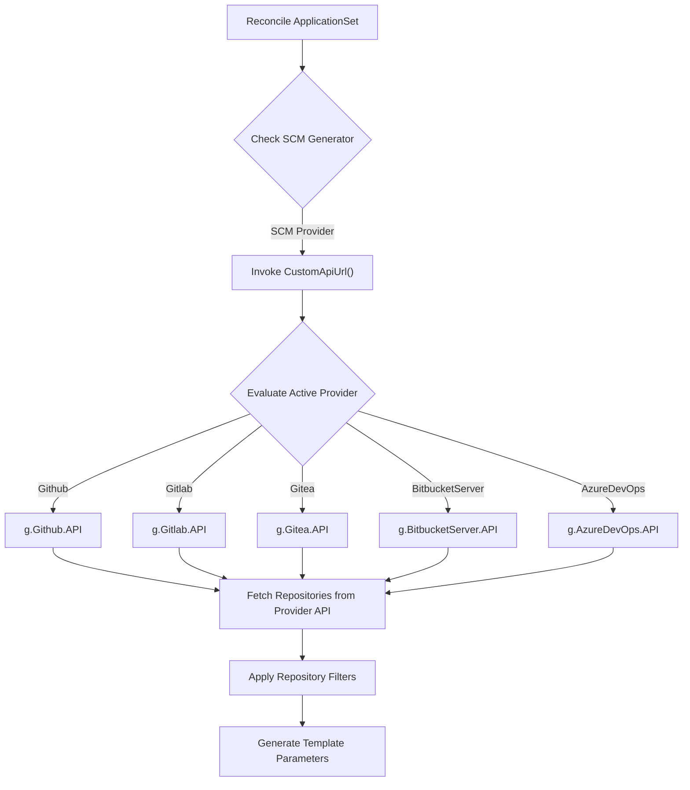
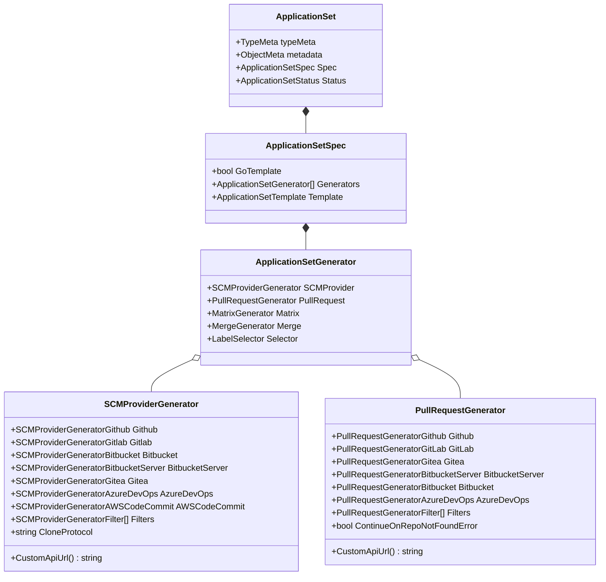
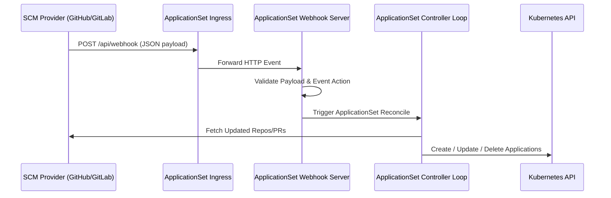

# SCM Generators

<details>
<summary>Relevant source files</summary>

The following files were used as context for generating this wiki page:

- [docs/operator-manual/applicationset/Generators-SCM-Provider.md](https://github.com/argoproj/argo-cd/blob/main/docs/operator-manual/applicationset/Generators-SCM-Provider.md)
- [pkg/apis/application/v1alpha1/generated.proto](https://github.com/argoproj/argo-cd/blob/main/pkg/apis/application/v1alpha1/generated.proto)
- [docs/operator-manual/applicationset/Generators-Pull-Request.md](https://github.com/argoproj/argo-cd/blob/main/docs/operator-manual/applicationset/Generators-Pull-Request.md)
- [pkg/apis/application/v1alpha1/applicationset_types.go](https://github.com/argoproj/argo-cd/blob/main/pkg/apis/application/v1alpha1/applicationset_types.go)
</details>

## Overview

SCM (Source Code Management) Generators in Argo CD enable the ApplicationSet controller to automatically discover repositories and pull requests by querying SCM provider APIs. By scanning organization accounts, group structures, or repository pull request endpoints, SCM generators automatically construct parameters used to render Argo CD `Application` resources. This dynamically reconciles GitOps application definitions as repositories are added, archived, or modified across an enterprise SCM infrastructure.

Sources: [docs/operator-manual/applicationset/Generators-SCM-Provider.md:3-4](https://github.com/argoproj/argo-cd/blob/main/docs/operator-manual/applicationset/Generators-SCM-Provider.md#L3-L4), [docs/operator-manual/applicationset/Generators-Pull-Request.md:3-4](https://github.com/argoproj/argo-cd/blob/main/docs/operator-manual/applicationset/Generators-Pull-Request.md#L3-L4)

The SCM subsystem is split into two primary generator types: the SCM Provider Generator and the Pull Request Generator. The SCM Provider Generator discovers repositories across entire organizations or workspaces (for providers like GitHub, GitLab, Gitea, Bitbucket Server, Bitbucket Cloud, Azure DevOps, and AWS CodeCommit). The Pull Request Generator scans a target repository for open pull or merge requests to automatically provision ephemeral preview environments.

Sources: [pkg/apis/application/v1alpha1/applicationset_types.go:435-457](https://github.com/argoproj/argo-cd/blob/main/pkg/apis/application/v1alpha1/applicationset_types.go#L435-L457), [pkg/apis/application/v1alpha1/applicationset_types.go:614-634](https://github.com/argoproj/argo-cd/blob/main/pkg/apis/application/v1alpha1/applicationset_types.go#L614-L634)

To prevent security vulnerabilities, SCM generators enforce strict operational controls. ApplicationSets containing SCM or PR generators must be managed exclusively by cluster administrators to avoid credential or token leakage. Furthermore, when the `project` field within an ApplicationSet template is dynamically generated using SCM parameters, administrative control over repository and branch creation is necessary to prevent non-admin users from creating out-of-bounds resources.

Sources: [docs/operator-manual/applicationset/Generators-SCM-Provider.md:22-26](https://github.com/argoproj/argo-cd/blob/main/docs/operator-manual/applicationset/Generators-SCM-Provider.md#L22-L26), [docs/operator-manual/applicationset/Generators-Pull-Request.md:22-26](https://github.com/argoproj/argo-cd/blob/main/docs/operator-manual/applicationset/Generators-Pull-Request.md#L22-L26)

The ApplicationSet controller periodically polls provider APIs (defaulting to 30-minute intervals via `requeueAfterSeconds`) to detect changes in repositories or pull requests. Additionally, webhook endpoints can be configured to process real-time push and pull request events from providers like GitHub and GitLab, triggering immediate reconciliation without waiting for poll intervals.

Sources: [docs/operator-manual/applicationset/Generators-Pull-Request.md:15-16](https://github.com/argoproj/argo-cd/blob/main/docs/operator-manual/applicationset/Generators-Pull-Request.md#L15-L16), [docs/operator-manual/applicationset/Generators-Pull-Request.md:450-496](https://github.com/argoproj/argo-cd/blob/main/docs/operator-manual/applicationset/Generators-Pull-Request.md#L450-L496)

## SCM Provider Generator Architecture

### Overview

The SCM Provider generator scans organization accounts, workspaces, or groups across SCMaaS providers. It filters discovered repositories according to path, regex, topic/label, or branch criteria before yielding parameter maps to the ApplicationSet template engine.

Sources: [docs/operator-manual/applicationset/Generators-SCM-Provider.md:3-21](https://github.com/argoproj/argo-cd/blob/main/docs/operator-manual/applicationset/Generators-SCM-Provider.md#L3-L21), [pkg/apis/application/v1alpha1/applicationset_types.go:435-457](https://github.com/argoproj/argo-cd/blob/main/pkg/apis/application/v1alpha1/applicationset_types.go#L435-L457)

### Execution and Dispatch Call-Chain

When evaluating an `SCMProviderGenerator`, the controller determines the custom API endpoint (if specified) before contacting the provider API client. The dispatch chain uses the `CustomApiUrl()` method to inspect configured provider structs:



Sources: [pkg/apis/application/v1alpha1/applicationset_types.go:459-473](https://github.com/argoproj/argo-cd/blob/main/pkg/apis/application/v1alpha1/applicationset_types.go#L459-L473)

The guard logic inside `CustomApiUrl()` establishes fixed provider priority evaluation using a Go `switch` statement:

```go
func (g *SCMProviderGenerator) CustomApiUrl() string { //nolint:revive //FIXME(var-naming)
	switch {
	case g.Github != nil:
		return g.Github.API
	case g.Gitlab != nil:
		return g.Gitlab.API
	case g.Gitea != nil:
		return g.Gitea.API
	case g.BitbucketServer != nil:
		return g.BitbucketServer.API
	case g.AzureDevOps != nil:
		return g.AzureDevOps.API
	}
	return ""
}
```

Sources: [pkg/apis/application/v1alpha1/applicationset_types.go:459-473](https://github.com/argoproj/argo-cd/blob/main/pkg/apis/application/v1alpha1/applicationset_types.go#L459-L473)

### Provider Configuration Parameters

The table below outlines supported providers and their configuration fields within `SCMProviderGenerator`:

| Provider | Key Configuration Fields | Default Behavior / Protocol |
| :--- | :--- | :--- |
| **GitHub** | `organization`, `api`, `allBranches`, `excludeArchivedRepos`, `tokenRef`, `appSecretName` | API defaults to `https://api.github.com/`. `allBranches` defaults to `false`. Protocols: `ssh`, `https`. |
| **GitLab** | `group`, `api`, `allBranches`, `includeSubgroups`, `includeSharedProjects`, `includeArchivedRepos`, `topic`, `tokenRef`, `insecure`, `caRef` | `includeSubgroups` defaults to `false`. `includeSharedProjects` defaults to `true`. Protocols: `ssh`, `https`. |
| **Gitea** | `owner`, `api`, `allBranches`, `excludeArchivedRepos`, `tokenRef`, `insecure` | API requires explicit URL. `excludeArchivedRepos` defaults to `false`. Protocols: `ssh`, `https`. |
| **Bitbucket Server** | `project`, `api`, `allBranches`, `basicAuth`, `bearerToken`, `insecure`, `caRef` | API requires explicit URL. Basic or Bearer auth required for private repos. Protocols: `ssh`, `https`. |
| **Bitbucket Cloud** | `owner`, `user`, `appPasswordRef`, `allBranches` | Workspace ID used as `owner`. API defaults to `https://api.bitbucket.org/2.0`. Protocols: `ssh`, `https`. |
| **Azure DevOps** | `organization`, `teamProject`, `accessTokenRef`, `api`, `allBranches` | API defaults to `https://dev.azure.com`. `accessTokenRef` is required. |
| **AWS CodeCommit** | `region`, `role`, `allBranches`, `tagFilters` | Region and role default to controller environment. Protocols: `ssh`, `https`, `https-fips`. |

Sources: [docs/operator-manual/applicationset/Generators-SCM-Provider.md:46-372](https://github.com/argoproj/argo-cd/blob/main/docs/operator-manual/applicationset/Generators-SCM-Provider.md#L46-L372), [pkg/apis/application/v1alpha1/applicationset_types.go:475-596](https://github.com/argoproj/argo-cd/blob/main/pkg/apis/application/v1alpha1/applicationset_types.go#L475-L596)

In GitLab provider evaluations, the controller utilizes a helper function to decide whether shared projects should be included when recursing through subgroups:

```go
func (s *SCMProviderGeneratorGitlab) WillIncludeSharedProjects() bool {
	return s.IncludeSharedProjects == nil || *s.IncludeSharedProjects
}
```

Sources: [pkg/apis/application/v1alpha1/applicationset_types.go:531-533](https://github.com/argoproj/argo-cd/blob/main/pkg/apis/application/v1alpha1/applicationset_types.go#L531-L533)

> [!NOTE]
> For AWS CodeCommit, `sha`, `short_sha`, and `short_sha_7` template parameters are not supported, and label filtering is unavailable.
> 
> Sources: [docs/operator-manual/applicationset/Generators-SCM-Provider.md:368-372](https://github.com/argoproj/argo-cd/blob/main/docs/operator-manual/applicationset/Generators-SCM-Provider.md#L368-L372)

### Repository Filters

The `filters` array in `SCMProviderGeneratorFilter` allows filtering discovered repositories using logical AND matching across all specified criteria in a single filter block:

```go
type SCMProviderGeneratorFilter struct {
	RepositoryMatch *string  `json:"repositoryMatch,omitempty" protobuf:"bytes,1,opt,name=repositoryMatch"`
	PathsExist      []string `json:"pathsExist,omitempty" protobuf:"bytes,2,rep,name=pathsExist"`
	PathsDoNotExist []string `json:"pathsDoNotExist,omitempty" protobuf:"bytes,3,rep,name=pathsDoNotExist"`
	LabelMatch      *string  `json:"labelMatch,omitempty" protobuf:"bytes,4,opt,name=labelMatch"`
	BranchMatch     *string  `json:"branchMatch,omitempty" protobuf:"bytes,5,opt,name=branchMatch"`
}
```

Sources: [pkg/apis/application/v1alpha1/applicationset_types.go:598-612](https://github.com/argoproj/argo-cd/blob/main/pkg/apis/application/v1alpha1/applicationset_types.go#L598-L612)

If multiple filter blocks are provided in the `filters` slice, they are evaluated with an OR relationship: a repository is included if it matches any filter block.

Sources: [docs/operator-manual/applicationset/Generators-SCM-Provider.md:410-413](https://github.com/argoproj/argo-cd/blob/main/docs/operator-manual/applicationset/Generators-SCM-Provider.md#L410-L413)

## Pull Request Generator Specification

### Overview

The Pull Request generator queries SCM APIs for active pull requests or merge requests within a specific repository. It generates parameters for each open PR, allowing ApplicationSets to provision preview applications that update automatically as commits are pushed to the source branch.

Sources: [docs/operator-manual/applicationset/Generators-Pull-Request.md:1-4](https://github.com/argoproj/argo-cd/blob/main/docs/operator-manual/applicationset/Generators-Pull-Request.md#L1-L4), [pkg/apis/application/v1alpha1/applicationset_types.go:614-634](https://github.com/argoproj/argo-cd/blob/main/pkg/apis/application/v1alpha1/applicationset_types.go#L614-L634)

### Dispatch and Resolution Mechanism

Similar to the SCM Provider generator, `PullRequestGenerator` implements `CustomApiUrl()` to resolve custom API endpoint configurations across six supported providers:

```go
func (p *PullRequestGenerator) CustomApiUrl() string { //nolint:revive //FIXME(var-naming)
	if p.Github != nil {
		return p.Github.API
	}
	if p.GitLab != nil {
		return p.GitLab.API
	}
	if p.Gitea != nil {
		return p.Gitea.API
	}
	if p.BitbucketServer != nil {
		return p.BitbucketServer.API
	}
	if p.Bitbucket != nil {
		return p.Bitbucket.API
	}
	if p.AzureDevOps != nil {
		return p.AzureDevOps.API
	}
	return ""
}
```

Sources: [pkg/apis/application/v1alpha1/applicationset_types.go:636-656](https://github.com/argoproj/argo-cd/blob/main/pkg/apis/application/v1alpha1/applicationset_types.go#L636-L656)

### Provider Configuration Matrix

| Provider Struct | Key Fields | Special Features / Restrictions |
| :--- | :--- | :--- |
| `PullRequestGeneratorGithub` | `owner`, `repo`, `api`, `tokenRef`, `appSecretName`, `labels` | Supports label matching (`labels`). Integrates with GitHub App secrets. |
| `PullRequestGeneratorGitLab` | `project`, `api`, `tokenRef`, `labels`, `pullRequestState`, `insecure`, `caRef` | `pullRequestState` choices: `""`, `opened`, `closed`, `merged`, `locked`. |
| `PullRequestGeneratorGitea` | `owner`, `repo`, `api`, `tokenRef`, `insecure`, `labels` | Supports self-signed certificates via `insecure: true`. |
| `PullRequestGeneratorBitbucketServer` | `project`, `repo`, `api`, `basicAuth`, `bearerToken`, `insecure`, `caRef` | Does not support labels. Filters via `branchMatch`. |
| `PullRequestGeneratorBitbucket` | `owner`, `repo`, `api`, `basicAuth`, `bearerToken` | Bitbucket Cloud API V2. Does not support labels. |
| `PullRequestGeneratorAzureDevOps` | `organization`, `project`, `repo`, `api`, `tokenRef`, `labels` | Scans Azure DevOps Git repositories within a project. |

Sources: [docs/operator-manual/applicationset/Generators-Pull-Request.md:28-338](https://github.com/argoproj/argo-cd/blob/main/docs/operator-manual/applicationset/Generators-Pull-Request.md#28-338), [pkg/apis/application/v1alpha1/applicationset_types.go:658-755](https://github.com/argoproj/argo-cd/blob/main/pkg/apis/application/v1alpha1/applicationset_types.go#L658-L755)

> [!TIP]
> Setting `continueOnRepoNotFoundError: true` on a `PullRequestGenerator` allows parameter generation to proceed without failing the reconciliation cycle if a targeted repository is missing or deleted.
> 
> Sources: [pkg/apis/application/v1alpha1/applicationset_types.go:632-632](https://github.com/argoproj/argo-cd/blob/main/pkg/apis/application/v1alpha1/applicationset_types.go#L632-L632)

### Filter Evaluation

Pull requests are filtered using `PullRequestGeneratorFilter`:

```go
type PullRequestGeneratorFilter struct {
	BranchMatch       *string `json:"branchMatch,omitempty" protobuf:"bytes,1,opt,name=branchMatch"`
	TargetBranchMatch *string `json:"targetBranchMatch,omitempty" protobuf:"bytes,2,opt,name=targetBranchMatch"`
	TitleMatch        *string `json:"titleMatch,omitempty" protobuf:"bytes,3,op,name=titleMatch"`
}
```

Sources: [pkg/apis/application/v1alpha1/applicationset_types.go:777-784](https://github.com/argoproj/argo-cd/blob/main/pkg/apis/application/v1alpha1/applicationset_types.go#L777-L784)

When multiple regex fields (`branchMatch`, `targetBranchMatch`, `titleMatch`) are specified within a single filter item, all conditions must pass (logical AND). If multiple filter items are present in the `filters` array, matching any filter block includes the pull request (logical OR).

Sources: [docs/operator-manual/applicationset/Generators-Pull-Request.md:340-343](https://github.com/argoproj/argo-cd/blob/main/docs/operator-manual/applicationset/Generators-Pull-Request.md#340-L343)

## ApplicationSet CRD Data Models

### Overview

The ApplicationSet CRD structures are defined in Go (`pkg/apis/application/v1alpha1/applicationset_types.go`) and generated as Protobuf definitions (`pkg/apis/application/v1alpha1/generated.proto`). Top-level generators contain nested types to handle complex configurations while obeying CRD structural limitations.

Sources: [pkg/apis/application/v1alpha1/applicationset_types.go:48-60](https://github.com/argoproj/argo-cd/blob/main/pkg/apis/application/v1alpha1/applicationset_types.go#L48-L60), [pkg/apis/application/v1alpha1/generated.proto:208-222](https://github.com/argoproj/argo-cd/blob/main/pkg/apis/application/v1alpha1/generated.proto#L208-L222)

### Class Diagram: Generator Schema Hierarchy



Sources: [pkg/apis/application/v1alpha1/applicationset_types.go:54-212](https://github.com/argoproj/argo-cd/blob/main/pkg/apis/application/v1alpha1/applicationset_types.go#L54-L212), [pkg/apis/application/v1alpha1/applicationset_types.go:435-457](https://github.com/argoproj/argo-cd/blob/main/pkg/apis/application/v1alpha1/applicationset_types.go#L435-L457), [pkg/apis/application/v1alpha1/applicationset_types.go:614-634](https://github.com/argoproj/argo-cd/blob/main/pkg/apis/application/v1alpha1/applicationset_types.go#L614-L634)

### Nesting Depth Enforcement

Kubernetes OpenAPI CRD schemas do not allow self-referential or recursive types. To support multi-level combinations using `MatrixGenerator` or `MergeGenerator`, Argo CD implements three distinct generator representation tiers:

1. `ApplicationSetGenerator`: Top-level generator containing combination types (`Matrix`, `Merge`).
2. `ApplicationSetNestedGenerator`: First-level nested generator where `Matrix` and `Merge` are stored as untyped `apiextensionsv1.JSON` fields.
3. `ApplicationSetTerminalGenerator`: Terminal leaf generator that cannot contain combination generators.

Sources: [pkg/apis/application/v1alpha1/applicationset_types.go:197-253](https://github.com/argoproj/argo-cd/blob/main/pkg/apis/application/v1alpha1/applicationset_types.go#L197-L253)

The `toApplicationSetNestedGenerators()` function converts terminal generators into nested generators when unmarshalling nested combinations:

```go
func (g ApplicationSetTerminalGenerators) toApplicationSetNestedGenerators() []ApplicationSetNestedGenerator {
	nestedGenerators := make([]ApplicationSetNestedGenerator, len(g))
	for i, terminalGenerator := range g {
		nestedGenerators[i] = ApplicationSetNestedGenerator{
			List:                    terminalGenerator.List,
			Clusters:                terminalGenerator.Clusters,
			Git:                     terminalGenerator.Git,
			SCMProvider:             terminalGenerator.SCMProvider,
			ClusterDecisionResource: terminalGenerator.ClusterDecisionResource,
			PullRequest:             terminalGenerator.PullRequest,
			Plugin:                  terminalGenerator.Plugin,
			Selector:                terminalGenerator.Selector,
		}
	}
	return nestedGenerators
}
```

Sources: [pkg/apis/application/v1alpha1/applicationset_types.go:261-274](https://github.com/argoproj/argo-cd/blob/main/pkg/apis/application/v1alpha1/applicationset_types.go#L261-L274)

### Design Trade-offs

| Design Choice | Benefit | Cost / Limitation |
| :--- | :--- | :--- |
| **Untyped `apiextensionsv1.JSON` for Nested Combinations** | Allows nested matrix/merge generators while bypassing Kubernetes CRD recursive type constraints. | Requires explicit JSON unmarshalling (`ToNestedMatrixGenerator`, `ToNestedMergeGenerator`) at runtime. |
| **Polymorphic Provider Fields on Generator Structs** | Keeps SCM and PR generator configurations unified under a single CRD spec block. | Only one provider field may be non-nil per generator instance. |
| **Separation of SCM and PR Generators** | Distinguishes organization-wide repo scanning from single-repo PR tracking. | Requires separate generator configurations even when targeting the same SCM provider instance. |

Sources: [pkg/apis/application/v1alpha1/applicationset_types.go:215-234](https://github.com/argoproj/argo-cd/blob/main/pkg/apis/application/v1alpha1/applicationset_types.go#L215-L234), [pkg/apis/application/v1alpha1/applicationset_types.go:304-316](https://github.com/argoproj/argo-cd/blob/main/pkg/apis/application/v1alpha1/applicationset_types.go#L304-L316), [pkg/apis/application/v1alpha1/applicationset_types.go:435-457](https://github.com/argoproj/argo-cd/blob/main/pkg/apis/application/v1alpha1/applicationset_types.go#L435-L457)

## Provider Authentication and Integration

### Overview

SCM generators interface with remote APIs using secret references for API tokens, custom enterprise endpoints, HTTP/HTTPS proxies, and self-signed TLS CA certificates.

Sources: [docs/operator-manual/applicationset/Generators-SCM-Provider.md:28-45](https://github.com/argoproj/argo-cd/blob/main/docs/operator-manual/applicationset/Generators-SCM-Provider.md#L28-L45), [pkg/apis/application/v1alpha1/applicationset_types.go:33-43](https://github.com/argoproj/argo-cd/blob/main/pkg/apis/application/v1alpha1/applicationset_types.go#L33-L43)

### Secret and ConfigMap References

Authentication credentials and TLS trust stores are declared using `SecretRef` and `ConfigMapKeyRef`:

```go
type SecretRef struct {
	SecretName string `json:"secretName" protobuf:"bytes,1,opt,name=secretName"`
	Key        string `json:"key" protobuf:"bytes,2,opt,name=key"`
}

type ConfigMapKeyRef struct {
	ConfigMapName string `json:"configMapName" protobuf:"bytes,1,opt,name=configMapName"`
	Key           string `json:"key" protobuf:"bytes,2,opt,name=key"`
}
```

Sources: [pkg/apis/application/v1alpha1/applicationset_types.go:33-43](https://github.com/argoproj/argo-cd/blob/main/pkg/apis/application/v1alpha1/applicationset_types.go#L33-L43)

### Proxy and TLS Options

To route outbound SCM API calls through an HTTP/HTTPS proxy, command-line flags or environment variables are passed to the controller:

- CLI Flags: `--scm-proxy-url`, `--scm-no-proxy`
- Environment Variables: `ARGOCD_APPLICATIONSET_CONTROLLER_SCM_PROXY_URL`, `ARGOCD_APPLICATIONSET_CONTROLLER_SCM_NO_PROXY`

Sources: [docs/operator-manual/applicationset/Generators-SCM-Provider.md:30-41](https://github.com/argoproj/argo-cd/blob/main/docs/operator-manual/applicationset/Generators-SCM-Provider.md#L30-L41)

> [!CAUTION]
> Flag `--scm-proxy-url` only affects outbound SCM provider API traffic. It does not route Kubernetes API server traffic. Use standard kubectl proxy flag `--proxy-url` for Kubernetes API traffic.
> 
> Sources: [docs/operator-manual/applicationset/Generators-SCM-Provider.md:42-45](https://github.com/argoproj/argo-cd/blob/main/docs/operator-manual/applicationset/Generators-SCM-Provider.md#L42-L45)

For self-signed TLS environments, providers support `insecure: true` (skips TLS verification) or `caRef` (specifies a ConfigMap containing CA certs). Alternatively, custom CA certificates can be mounted globally using the environment variable `ARGOCD_APPLICATIONSET_CONTROLLER_SCM_ROOT_CA_PATH` or the flag `--scm-root-ca-path`.

Sources: [docs/operator-manual/applicationset/Generators-SCM-Provider.md:124-127](https://github.com/argoproj/argo-cd/blob/main/docs/operator-manual/applicationset/Generators-SCM-Provider.md#L124-L127), [docs/operator-manual/applicationset/Generators-SCM-Provider.md:148-154](https://github.com/argoproj/argo-cd/blob/main/docs/operator-manual/applicationset/Generators-SCM-Provider.md#L148-L154)

## Parameter Generation and Matrix Composition

### Overview

During reconciliation, SCM generators output standard key-value maps. These parameters can be augmented using the `values` map or combined with other generators via `MatrixGenerator` and `MergeGenerator`.

Sources: [docs/operator-manual/applicationset/Generators-SCM-Provider.md:442-524](https://github.com/argoproj/argo-cd/blob/main/docs/operator-manual/applicationset/Generators-SCM-Provider.md#L442-L524), [docs/operator-manual/applicationset/Generators-Pull-Request.md:438-535](https://github.com/argoproj/argo-cd/blob/main/docs/operator-manual/applicationset/Generators-Pull-Request.md#L438-L535)

### Standard Template Parameters

#### SCM Provider Generator Parameters
- `organization`: Organization or owner name.
- `repository`: Name of the discovered repository.
- `repository_id`: Provider-specific repository ID.
- `url`: Clone URL formatted according to `cloneProtocol`.
- `branch`: Default branch (or matched branch when `allBranches` is `true`).
- `sha`: Target commit SHA.
- `short_sha`: 8-character commit SHA abbreviation.
- `short_sha_7`: 7-character commit SHA abbreviation.
- `labels`: Comma-separated topics or labels (GitHub, GitLab, Gitea).
- `branchNormalized`: Normalized branch name containing lowercase alphanumeric characters, `-`, or `.`.

Sources: [docs/operator-manual/applicationset/Generators-SCM-Provider.md:470-480](https://github.com/argoproj/argo-cd/blob/main/docs/operator-manual/applicationset/Generators-SCM-Provider.md#L470-L480)

#### Pull Request Generator Parameters
- `number`: ID number of the pull request.
- `title`: Title of the pull request.
- `branch`: Source branch name.
- `branch_slug`: DNS-compliant RFC 1123 branch slug (truncated to 50 chars).
- `target_branch`: Destination branch name.
- `target_branch_slug`: DNS-compliant RFC 1123 target branch slug.
- `head_sha`: Head commit SHA of the pull request branch.
- `head_short_sha`: 8-character head commit SHA abbreviation.
- `head_short_sha_7`: 7-character head commit SHA abbreviation.
- `labels`: Array of PR labels (supported with Go Template mode).
- `author`: Pull request author username.

Sources: [docs/operator-manual/applicationset/Generators-Pull-Request.md:438-448](https://github.com/argoproj/argo-cd/blob/main/docs/operator-manual/applicationset/Generators-Pull-Request.md#L438-L448)

### Injected Values Field

Both SCM and PR generators support an optional `values` map. Key-value pairs defined in `values` are exposed under the `.values` template namespace and can interpolate standard parameters generated by the SCM provider.

Sources: [docs/operator-manual/applicationset/Generators-SCM-Provider.md:482-524](https://github.com/argoproj/argo-cd/blob/main/docs/operator-manual/applicationset/Generators-SCM-Provider.md#L482-L524), [docs/operator-manual/applicationset/Generators-Pull-Request.md:501-535](https://github.com/argoproj/argo-cd/blob/main/docs/operator-manual/applicationset/Generators-Pull-Request.md#L501-L535)

> [!IMPORTANT]
> Custom variables defined in `values` must be accessed using the `{{ .values.<key> }}` syntax inside application templates.
> 
> Sources: [docs/operator-manual/applicationset/Generators-SCM-Provider.md:522-524](https://github.com/argoproj/argo-cd/blob/main/docs/operator-manual/applicationset/Generators-SCM-Provider.md#L522-L524), [docs/operator-manual/applicationset/Generators-Pull-Request.md:532-534](https://github.com/argoproj/argo-cd/blob/main/docs/operator-manual/applicationset/Generators-Pull-Request.md#L532-L534)

## Webhook Integration and Requeue Lifecycle

### Overview

To avoid delays associated with periodic API polling (`requeueAfterSeconds`), the ApplicationSet controller exposes an HTTP webhook server. External SCM webhooks send event payloads to trigger immediate generator re-evaluations.

Sources: [docs/operator-manual/applicationset/Generators-Pull-Request.md:450-460](https://github.com/argoproj/argo-cd/blob/main/docs/operator-manual/applicationset/Generators-Pull-Request.md#L450-L460)

### Webhook Event Processing Sequence



Sources: [docs/operator-manual/applicationset/Generators-Pull-Request.md:456-465](https://github.com/argoproj/argo-cd/blob/main/docs/operator-manual/applicationset/Generators-Pull-Request.md#L456-L465)

### Supported Provider Webhook Events

#### GitHub Webhook Events
Re-evaluations trigger when a `Pull request` webhook targets `/api/webhook` with any of the following actions:
- `opened`
- `closed`
- `reopened`
- `labeled`
- `unlabeled`
- `synchronized`

Sources: [docs/operator-manual/applicationset/Generators-Pull-Request.md:467-480](https://github.com/argoproj/argo-cd/blob/main/docs/operator-manual/applicationset/Generators-Pull-Request.md#L467-L480)

#### GitLab Webhook Events
Re-evaluations trigger when `Merge request events` are enabled with any of the following actions:
- `open`
- `close`
- `reopen`
- `update`
- `merge`

Sources: [docs/operator-manual/applicationset/Generators-Pull-Request.md:482-496](https://github.com/argoproj/argo-cd/blob/main/docs/operator-manual/applicationset/Generators-Pull-Request.md#L482-L496)

When a pull request or repository is closed, merged, or fails filter criteria, the controller automatically deletes the generated `Application` resource, cleaning up associated ephemeral infrastructure.

Sources: [docs/operator-manual/applicationset/Generators-Pull-Request.md:497-500](https://github.com/argoproj/argo-cd/blob/main/docs/operator-manual/applicationset/Generators-Pull-Request.md#L497-L500)

## Complete Worked Example

The manifest below configures an `ApplicationSet` combining a `PullRequestGenerator` targeting GitHub with Go template rendering, custom injected values, and automated deletion:

```yaml
apiVersion: argoproj.io/v1alpha1
kind: ApplicationSet
metadata:
  name: github-pr-preview-apps
  namespace: argocd
spec:
  goTemplate: true
  goTemplateOptions: ["missingkey=error"]
  generators:
  - pullRequest:
      requeueAfterSeconds: 1800
      github:
        owner: my-org
        repo: my-microservice
        tokenRef:
          secretName: github-pr-token
          key: token
        labels:
        - preview
      filters:
      - branchMatch: "^feature/.*"
        targetBranchMatch: "^main$"
      values:
        clusterServer: https://kubernetes.default.svc
        appNamespace: 'preview-pr-{{ .number }}'
  template:
    metadata:
      name: 'pr-preview-{{ .branch_slug }}-{{ .number }}'
    spec:
      project: default
      source:
        repoURL: 'https://github.com/my-org/my-microservice.git'
        targetRevision: '{{ .head_sha }}'
        path: manifests/overlays/preview
        kustomize:
          nameSuffix: '-pr-{{ .number }}'
          commonLabels:
            app.kubernetes.io/managed-by: applicationset
            pull-request-author: '{{ .author }}'
      destination:
        server: '{{ .values.clusterServer }}'
        namespace: '{{ .values.appNamespace }}'
      syncPolicy:
        automated:
          prune: true
          selfHeal: true
```

Sources: [docs/operator-manual/applicationset/Generators-Pull-Request.md:31-61](https://github.com/argoproj/argo-cd/blob/main/docs/operator-manual/applicationset/Generators-Pull-Request.md#L31-L61), [docs/operator-manual/applicationset/Generators-Pull-Request.md:357-362](https://github.com/argoproj/argo-cd/blob/main/docs/operator-manual/applicationset/Generators-Pull-Request.md#L357-L362), [docs/operator-manual/applicationset/Generators-Pull-Request.md:405-436](https://github.com/argoproj/argo-cd/blob/main/docs/operator-manual/applicationset/Generators-Pull-Request.md#L405-L436), [docs/operator-manual/applicationset/Generators-Pull-Request.md:505-530](https://github.com/argoproj/argo-cd/blob/main/docs/operator-manual/applicationset/Generators-Pull-Request.md#L505-L530)

## Related

- [[ApplicationSet Controller]]
- [[ApplicationSet Webhooks]]

