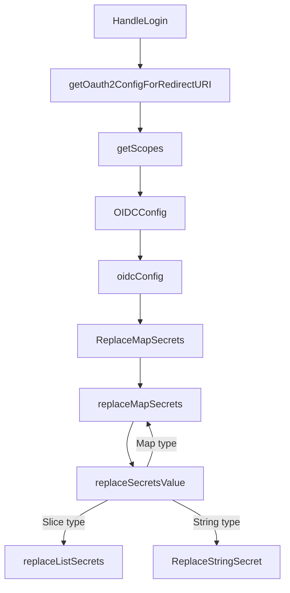

# Secret List Replacement

<details>
<summary>Relevant source files</summary>

The following files were used as context for generating this wiki page:

- [util/oidc/oidc.go](https://github.com/argoproj/argo-cd/blob/main/util/oidc/oidc.go)
- [util/settings/settings.go](https://github.com/argoproj/argo-cd/blob/main/util/settings/settings.go)
</details>

## Overview

### Overview

The execution flow from `HandleLogin` down to `replaceListSecrets` encompasses the initialization of an OpenID Connect (OIDC) authentication request in Argo CD, resolving settings, and safely interpolating Kubernetes secret references within configuration payloads. When a user initiates a web login flow, Argo CD constructs an appropriate OAuth2 configuration by pulling issuer details, scopes, and client secrets from the server settings. During configuration parsing, any secret references prefixed with a dollar sign (`$`)—such as client secrets stored in Kubernetes secrets—are dynamically resolved and recursively replaced across maps, lists, and string values.

Sources: [util/oidc/oidc.go:430-446](https://github.com/argoproj/argo-cd/blob/main/util/oidc/oidc.go#L430-L446), [util/settings/settings.go:1991-2016](https://github.com/argoproj/argo-cd/blob/main/util/settings/settings.go#L1991-L2016)

---

## Step-by-Step Execution Trace

### 1. HandleLogin
The execution begins when a user triggers an authentication request. `HandleLogin` starts by parsing the OIDC provider configuration and gathering request parameters such as requested ID token claims. It then determines the correct redirect URI for the incoming HTTP request and initiates the OAuth2 configuration building process.

Sources: [util/oidc/oidc.go:430-446](https://github.com/argoproj/argo-cd/blob/main/util/oidc/oidc.go#L430-L446)

### 2. getOauth2ConfigForRedirectURI
`getOauth2ConfigForRedirectURI` queries the OIDC provider for its OAuth2 endpoint definitions (authorization and token URLs). It constructs and returns an `oauth2.Config` struct containing the client ID, secret, endpoint spec, resolved scopes, and the validated redirect URI.

Sources: [util/oidc/oidc.go:291-304](https://github.com/argoproj/argo-cd/blob/main/util/oidc/oidc.go#L291-L304)

### 3. getScopes
To populate the OAuth2 configuration scopes, `getOauth2ConfigForRedirectURI` calls `getScopes`. This method inspects the OIDC settings; if a custom OIDC configuration is present, it returns the configured scopes or falls back to default openid scopes (`openid`, `profile`, `email`, `groups`).

Sources: [util/oidc/oidc.go:1109-1117](https://github.com/argoproj/argo-cd/blob/main/util/oidc/oidc.go#L1109-L1117)

### 4. OIDCConfig
When scopes or provider parameters require settings inspection, `OIDCConfig` acts as the exported accessor on `ArgoCDSettings`. It invokes the internal `oidcConfig()` method to unmarshal, validate, and inject secrets into the raw OIDC configuration YAML before exporting the sanitized configuration model.

Sources: [util/settings/settings.go:2018-2024](https://github.com/argoproj/argo-cd/blob/main/util/settings/settings.go#L2018-L2024)

### 5. oidcConfig
The unexported `oidcConfig()` method reads `OIDCConfigRAW` from the Argo CD settings. If populated, it unmarshals the raw YAML string into a generic `map[string]any` representation to prepare for secret interpolation.

Sources: [util/settings/settings.go:1991-2002](https://github.com/argoproj/argo-cd/blob/main/util/settings/settings.go#L1991-L2002)

### 6. ReplaceMapSecrets
`ReplaceMapSecrets` serves as the public wrapper to substitute secret placeholders in arbitrary JSON/YAML map objects. It delegates directly to `replaceMapSecrets` using the standard `ReplaceStringSecret` replacer function.

Sources: [util/settings/settings.go:2531-2534](https://github.com/argoproj/argo-cd/blob/main/util/settings/settings.go#L2531-L2534)

### 7. replaceMapSecrets
`replaceMapSecrets` iterates over key-value pairs in a configuration map, constructing a new map where each value is passed through `replaceSecretsValue` to evaluate and resolve any nested or scalar secrets.

Sources: [util/settings/settings.go:2536-2544](https://github.com/argoproj/argo-cd/blob/main/util/settings/settings.go#L2536-L2544)

### 8. replaceSecretsValue
`replaceSecretsValue` performs type-switching on configuration values. If a value is a nested `map[string]any`, it recursively calls `replaceMapSecrets`. If it is a slice (`[]any`), it routes to `replaceListSecrets`. If it is a `string`, it applies the string replacer function.

Sources: [util/settings/settings.go:2554-2565](https://github.com/argoproj/argo-cd/blob/main/util/settings/settings.go#L2554-L2565)

### 9. replaceListSecrets
When configuration structures contain lists or arrays of parameters, `replaceListSecrets` iterates through each element and evaluates it using `replaceSecretsValue`, ensuring that secret references inside lists are correctly resolved.

Sources: [util/settings/settings.go:2546-2552](https://github.com/argoproj/argo-cd/blob/main/util/settings/settings.go#L2546-L2552)

---

## Sequence Diagram

```mermaid
sequenceDFlow
    participant ClientApp as util/oidc (ClientApp)
    participant Settings as util/settings (ArgoCDSettings)

    ClientApp->>ClientApp: HandleLogin(w, r)
    ClientApp->>ClientApp: getOauth2ConfigForRedirectURI(redirectURI)
    ClientApp->>ClientApp: getScopes()
    ClientApp->>Settings: OIDCConfig()
    Settings->>Settings: oidcConfig()
    Settings->>Settings: ReplaceMapSecrets(configMap, a.Secrets)
    Settings->>Settings: replaceMapSecrets(...)
    Settings->>Settings: replaceSecretsValue(...)
    Settings->>Settings: replaceListSecrets(...)
    Settings-->>ClientApp: Returns populated oauth2.Config
```

Sources: [util/oidc/oidc.go:291-304, 430-446, 1109-1117](https://github.com/argoproj/argo-cd/blob/main/util/oidc/oidc.go#L291-L304), [util/settings/settings.go:1991-2016, 2531-2565](https://github.com/argoproj/argo-cd/blob/main/util/settings/settings.go#L1991-L2016)

---

## Flowchart



Sources: [util/oidc/oidc.go:291-304, 430-446, 1109-1117](https://github.com/argoproj/argo-cd/blob/main/util/oidc/oidc.go#L291-L304), [util/settings/settings.go:1991-2016, 2531-2565](https://github.com/argoproj/argo-cd/blob/main/util/settings/settings.go#L1991-L2016)

---

## Key Observations

- **Cross-Module Boundaries:** The flow bridges the `util/oidc` HTTP request management package and the `util/settings` configuration and secret management package.
- **Recursive Secret Resolution:** Secret placeholders (starting with `$`) in maps, lists, and strings are recursively resolved during settings initialization via `replaceSecretsValue`, preventing plaintext secrets from residing statically in configuration configmaps.
- **Error Resilience:** If OIDC configurations or secret lookups fail during unmarshaling or parsing, warnings are logged and fallback behaviors or HTTP 500 errors are returned to the client depending on the strictness of the phase.
