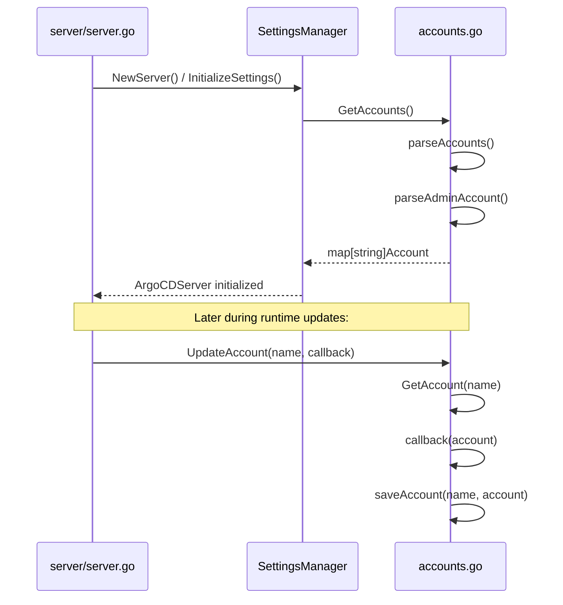
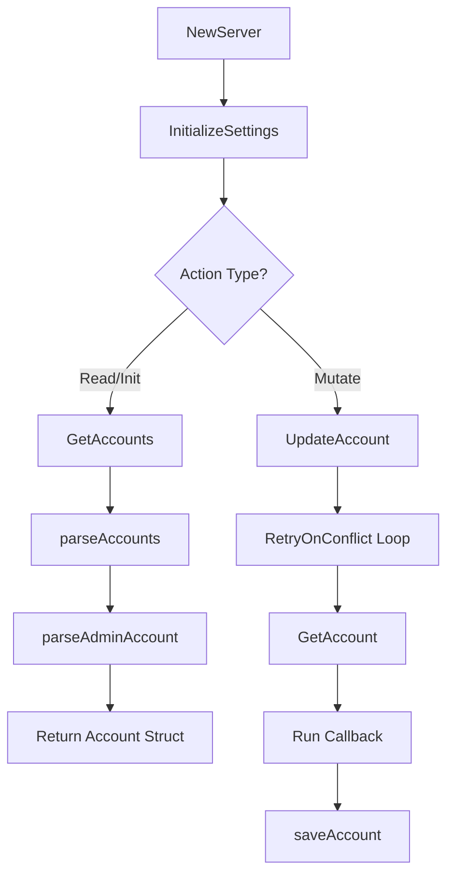

# Server Account Initialization

Relevant source files

The following files were used as context for generating this wiki page:

- [server/server.go](https://github.com/argoproj/argo-cd/blob/main/server/server.go)
- [util/settings/accounts.go](https://github.com/argoproj/argo-cd/blob/main/util/settings/accounts.go)

## Overview

### Overview of Server Initialization and Account Resolution

This execution flow details how the Argo CD API server initializes its operational environment and retrieves or mutates user and system accounts. The lifecycle begins when `NewServer` is invoked to construct the core API server (`ArgoCDServer`). During this startup phase, the server initializes cluster settings, configures project boundaries, and loads account definitions from Kubernetes configuration maps and secrets.

This mechanism is critical for establishing authentication, authorization, and local user account management (such as the root `admin` user and custom accounts). The execution flow bridges high-level server wiring (`server/server.go`) with low-level configuration parsing and state management (`util/settings/accounts.go`).

Sources: [server/server.go:313-318](https://github.com/argoproj/argo-cd/blob/main/server/server.go#L313-L318), [util/settings/accounts.go:113-124](https://github.com/argoproj/argo-cd/blob/main/util/settings/accounts.go#L113-L124)

## Step-by-Step Execution Flow

### 1. NewServer

The process begins in `server/server.go` with the `NewServer` function. This function instantiates the primary `ArgoCDServer` struct by setting up dependencies, informers, authentication enforcers, and settings managers.

During this setup, a `SettingsManager` is created using the Kubernetes client and control plane namespace, immediately followed by a call to initialize system settings.

Sources: [server/server.go:313-316](https://github.com/argoproj/argo-cd/blob/main/server/server.go#L313-L316)

### 2. InitializeSettings

Invoked from `NewServer`, the `InitializeSettings` method validates and loads the initial Argo CD settings from Kubernetes secrets and config maps (such as `argocd-cm` and `argocd-secret`). It ensures that baseline configurations, including security defaults and insecure mode flags, are active before any API endpoints or gRPC services accept traffic.

Sources: [server/server.go:315-316](https://github.com/argoproj/argo-cd/blob/main/server/server.go#L315-L316)

### 3. UpdateAccount

When user accounts are modified or password policies are updated, `UpdateAccount` wraps account mutation logic with robust error handling. It utilizes `retry.RetryOnConflict` to safely perform updates against Kubernetes resource conflicts. 

Inside the retry loop, it fetches the target account, executes the provided modification callback, and persists the altered state.

Sources: [util/settings/accounts.go:126-140](https://github.com/argoproj/argo-cd/blob/main/util/settings/accounts.go#L126-L140)

### 4. GetAccount

The `GetAccount` method queries the complete map of configured accounts via `GetAccounts()` and filters out the entry corresponding to the requested account name. 

If the account name does not exist within the parsed map, it returns a gRPC status error with `codes.NotFound`. Otherwise, it returns a pointer to the target `Account` struct.

Sources: [util/settings/accounts.go:113-124](https://github.com/argoproj/argo-cd/blob/main/util/settings/accounts.go#L113-L124)

### 5. GetAccounts

`GetAccounts` coordinates retrieval of raw configuration data by fetching the associated Kubernetes `ConfigMap` and `Secret` objects through the `SettingsManager`. 

It hands these raw resources over to the parsing pipeline to construct a unified representation of all system and local user accounts.

Sources: [util/settings/accounts.go:143-154](https://github.com/argoproj/argo-cd/blob/main/util/settings/accounts.go#L143-L154)

### 6. parseAccounts

The `parseAccounts` function orchestrates the deserialization of account properties from the ConfigMap and Secret. 

It first calls `parseAdminAccount` to establish the built-in admin account, iterates through ConfigMap keys matching the `accounts.` prefix to extract custom account capabilities and enabled flags, and finally inspects the Kubernetes secret for password hashes, modification timestamps (`passwordMtime`), and stored API tokens (`tokens`).

Sources: [util/settings/accounts.go:226-313](https://github.com/argoproj/argo-cd/blob/main/util/settings/accounts.go#L226-L313)

### 7. parseAdminAccount

Specialized for the root user, `parseAdminAccount` builds the baseline `admin` account object with default capabilities (such as `AccountCapabilityLogin`). 

It extracts admin-specific keys from the secret (`admin.password`, `admin.passwordMtime`, `admin.tokens`) and config map (`admin.enabled`), parsing JSON tokens and RFC3339 timestamps safely.

Sources: [util/settings/accounts.go:197-224](https://github.com/argoproj/argo-cd/blob/main/util/settings/accounts.go#L197-L224)

### 8. Account

The `Account` struct is the foundational data model representing a local user. It encapsulates sensitive credential hashes, modify timestamps, enablement flags, slice-based capabilities (`AccountCapability`), and active API or session tokens (`Token`). 

Helper methods attached to `Account` include `FormatPasswordMtime`, `FormatCapabilities`, `TokenIndex`, and `HasCapability`.

Sources: [util/settings/accounts.go:52-92](https://github.com/argoproj/argo-cd/blob/main/util/settings/accounts.go#L52-L92)

## Architecture Diagram

### Sequence Diagram

Sources: [server/server.go:313-318](https://github.com/argoproj/argo-cd/blob/main/server/server.go#L313-L318), [util/settings/accounts.go:113-140](https://github.com/argoproj/argo-cd/blob/main/util/settings/accounts.go#L113-L140)

### Execution Flowchart

Sources: [server/server.go:313-318](https://github.com/argoproj/argo-cd/blob/main/server/server.go#L313-L318), [util/settings/accounts.go:113-154](https://github.com/argoproj/argo-cd/blob/main/util/settings/accounts.go#L113-L154)

## Key Observations

- **Cross-Module Boundaries:** The execution flow seamlessly transitions from the API server bootstrap layer (`server/server.go`) into the settings and persistence management layer (`util/settings/accounts.go`), abstracting Kubernetes client interactions behind domain methods.
- **Concurrency & Conflict Handling:** Account mutations utilize Kubernetes client-go retry logic (`retry.RetryOnConflict`) to protect against concurrent modifications to underlying secrets and config maps.
- **Resilient Parsing:** When loading accounts from cluster state, malformed individual tokens or unexpected metadata keys trigger warnings (`log.Warnf` / `log.Errorf`) rather than causing fatal server crashes, ensuring high availability even with partially corrupted configurations.

Sources: [server/server.go:313-318](https://github.com/argoproj/argo-cd/blob/main/server/server.go#L313-L318), [util/settings/accounts.go:126-140](https://github.com/argoproj/argo-cd/blob/main/util/settings/accounts.go#L126-L140), [util/settings/accounts.go:301-308](https://github.com/argoproj/argo-cd/blob/main/util/settings/accounts.go#L301-L308)
