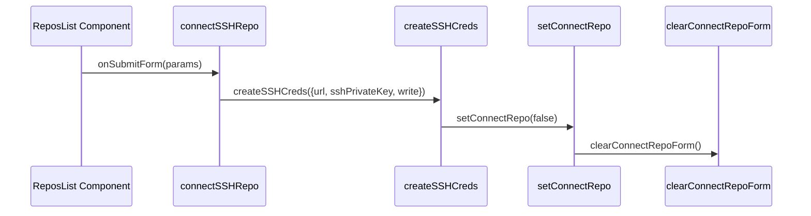
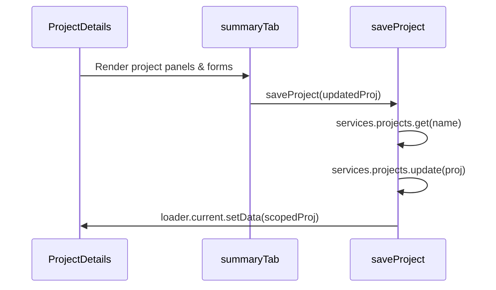

# Settings Views

Relevant source files

The following files were used as context for generating this wiki page:

- [ui/src/app/settings/components/repos-list/repos-list.tsx](https://github.com/argoproj/argo-cd/blob/main/ui/src/app/settings/components/repos-list/repos-list.tsx)
- [util/settings/settings.go](https://github.com/argoproj/argo-cd/blob/main/util/settings/settings.go)
- [ui/src/app/settings/components/project-details/project-details.tsx](https://github.com/argoproj/argo-cd/blob/main/ui/src/app/settings/components/project-details/project-details.tsx)

## Overview

Settings views in Argo CD provide the administrative interfaces and core backend controllers responsible for managing global system configurations, repository connections, project boundaries, and identity provider integrations. These components bridge user-facing UI workflows with Kubernetes-backed state management, ensuring that repository credentials, role-based access control rules, synchronization parameters, and authentication connectors are securely synchronized and persisted. Sources: [ui/src/app/settings/components/repos-list/repos-list.tsx#L800-L831](https://github.com/argoproj/argo-cd/blob/main/ui/src/app/settings/components/repos-list/repos-list.tsx#L800-L831), [util/settings/settings.go#L87-L173](https://github.com/argoproj/argo-cd/blob/main/util/settings/settings.go#L87-L173), [ui/src/app/settings/components/project-details/project-details.tsx#L328-L375](https://github.com/argoproj/argo-cd/blob/main/ui/src/app/settings/components/project-details/project-details.tsx#L328-L375)

## Repository Management and Connection Workflows

### Repository Management and Connection Workflows

### Overview

The repository management interface (`ReposList`) provides a unified frontend dashboard for registering, configuring, inspecting, and disconnecting Git, Helm, and OCI repositories, as well as managing repository credential templates across multiple authentication protocols. Sources: [ui/src/app/settings/components/repos-list/repos-list.tsx#L276-L303](https://github.com/argoproj/argo-cd/blob/main/ui/src/app/settings/components/repos-list/repos-list.tsx#L276-L303), [ui/src/app/settings/components/repos-list/repos-list.tsx#L800-L831](https://github.com/argoproj/argo-cd/blob/main/ui/src/app/settings/components/repos-list/repos-list.tsx#L800-L831)

### Connection Methods and Protocol Parameters

Argo CD supports five distinct connection methods for repository integration, each exposing tailored form parameters through the sliding panel configuration interface. Sources: [ui/src/app/settings/components/repos-list/repos-list.tsx#L195-L201](https://github.com/argoproj/argo-cd/blob/main/ui/src/app/settings/components/repos-list/repos-list.tsx#L195-L201), [ui/src/app/settings/components/repos-list/repos-list.tsx#L1016-L1047](https://github.com/argoproj/argo-cd/blob/main/ui/src/app/settings/components/repos-list/repos-list.tsx#L1016-L1047)

| Connection Method Enum | Description | Key Parameters | Sources |
| :--- | :--- | :--- | :--- |
| `ConnectionMethod.SSH` | Connect via SSH protocol | `type`, `name`, `url`, `sshPrivateKey`, `insecure`, `enableLfs`, `proxy`, `noProxy`, `project`, `depth`, `write` | Sources: [ui/src/app/settings/components/repos-list/repos-list.tsx#L50-L63](https://github.com/argoproj/argo-cd/blob/main/ui/src/app/settings/components/repos-list/repos-list.tsx#L50-L63), [ui/src/app/settings/components/repos-list/repos-list.tsx#L195-L196](https://github.com/argoproj/argo-cd/blob/main/ui/src/app/settings/components/repos-list/repos-list.tsx#L195-L196) |
| `ConnectionMethod.HTTPS` | Connect via HTTP/HTTPS or OCI protocol | `type`, `name`, `url`, `username`, `password`, `bearerToken`, `tlsClientCertData`, `tlsClientCertKey`, `insecure`, `enableLfs`, `proxy`, `noProxy`, `project`, `forceHttpBasicAuth`, `enableOCI`, `insecureOCIForceHttp`, `depth`, `write`, `useAzureWorkloadIdentity` | Sources: [ui/src/app/settings/components/repos-list/repos-list.tsx#L65-L86](https://github.com/argoproj/argo-cd/blob/main/ui/src/app/settings/components/repos-list/repos-list.tsx#L65-L86), [ui/src/app/settings/components/repos-list/repos-list.tsx#L197-L197](https://github.com/argoproj/argo-cd/blob/main/ui/src/app/settings/components/repos-list/repos-list.tsx#L197-L197) |
| `ConnectionMethod.GITHUBAPP` | Connect via GitHub App integration | `type`, `name`, `url`, `githubAppPrivateKey`, `githubAppId`, `githubAppInstallationId`, `githubAppEnterpriseBaseURL`, `tlsClientCertData`, `tlsClientCertKey`, `insecure`, `enableLfs`, `proxy`, `noProxy`, `project`, `depth`, `write` | Sources: [ui/src/app/settings/components/repos-list/repos-list.tsx#L88-L106](https://github.com/argoproj/argo-cd/blob/main/ui/src/app/settings/components/repos-list/repos-list.tsx#L88-L106), [ui/src/app/settings/components/repos-list/repos-list.tsx#L198-L198](https://github.com/argoproj/argo-cd/blob/main/ui/src/app/settings/components/repos-list/repos-list.tsx#L198-L198) |
| `ConnectionMethod.GOOGLECLOUD` | Connect via Google Cloud Source | `type`, `name`, `url`, `gcpServiceAccountKey`, `proxy`, `noProxy`, `project`, `depth`, `write` | Sources: [ui/src/app/settings/components/repos-list/repos-list.tsx#L108-L119](https://github.com/argoproj/argo-cd/blob/main/ui/src/app/settings/components/repos-list/repos-list.tsx#L108-L119), [ui/src/app/settings/components/repos-list/repos-list.tsx#L199-L199](https://github.com/argoproj/argo-cd/blob/main/ui/src/app/settings/components/repos-list/repos-list.tsx#L199-L199) |
| `ConnectionMethod.AZURESERVICEPRINCIPAL` | Connect via Azure Service Principal | `type`, `name`, `url`, `azureServicePrincipalClientId`, `azureServicePrincipalClientSecret`, `azureServicePrincipalTenantId`, `azureActiveDirectoryEndpoint`, `proxy`, `noProxy`, `project`, `write` | Sources: [ui/src/app/settings/components/repos-list/repos-list.tsx#L121-L134](https://github.com/argoproj/argo-cd/blob/main/ui/src/app/settings/components/repos-list/repos-list.tsx#L121-L134), [ui/src/app/settings/components/repos-list/repos-list.tsx#L200-L200](https://github.com/argoproj/argo-cd/blob/main/ui/src/app/settings/components/repos-list/repos-list.tsx#L200-L200) |

> [!NOTE]
> When `credsTemplate.current` is set to true during form submission, settings such as `insecure` and `enableLfs` are ignored by the backend credential template creation handlers. Sources: [ui/src/app/settings/components/repos-list/repos-list.tsx#L1098-L1100](https://github.com/argoproj/argo-cd/blob/main/ui/src/app/settings/components/repos-list/repos-list.tsx#L1098-L1100), [ui/src/app/settings/components/repos-list/repos-list.tsx#L1185-L1187](https://github.com/argoproj/argo-cd/blob/main/ui/src/app/settings/components/repos-list/repos-list.tsx#L1185-L1187)

### Call-Chain Execution Walkthrough

The repository connection and credential creation lifecycle follows a strictly ordered execution sequence when submitting form data. Sources: [ui/src/app/settings/components/repos-list/repos-list.tsx#L387-L401](https://github.com/argoproj/argo-cd/blob/main/ui/src/app/settings/components/repos-list/repos-list.tsx#L387-L401), [ui/src/app/settings/components/repos-list/repos-list.tsx#L459-L487](https://github.com/argoproj/argo-cd/blob/main/ui/src/app/settings/components/repos-list/repos-list.tsx#L459-L487), [ui/src/app/settings/components/repos-list/repos-list.tsx#L666-L681](https://github.com/argoproj/argo-cd/blob/main/ui/src/app/settings/components/repos-list/repos-list.tsx#L666-L681), [ui/src/app/settings/components/repos-list/repos-list.tsx#L791-L797](https://github.com/argoproj/argo-cd/blob/main/ui/src/app/settings/components/repos-list/repos-list.tsx#L791-L797)

1. `onSubmitForm`: Evaluates the active connection method (e.g., `ConnectionMethod.SSH`) and delegates input parameters to protocol-specific connection handlers. Sources: [ui/src/app/settings/components/repos-list/repos-list.tsx#L387-L401](https://github.com/argoproj/argo-cd/blob/main/ui/src/app/settings/components/repos-list/repos-list.tsx#L387-L401)
2. `connectSSHRepo`: Inspects `credsTemplate.current`. If true, routes the parameters to credential template creation; otherwise, establishes a live repository connection via `services.repos.createSSH` or `services.repos.createSSHWrite`. Sources: [ui/src/app/settings/components/repos-list/repos-list.tsx#L459-L487](https://github.com/argoproj/argo-cd/blob/main/ui/src/app/settings/components/repos-list/repos-list.tsx#L459-L487)
3. `createSSHCreds`: Invokes `services.repocreds.createSSH` or `services.repocreds.createSSHWrite`, reloads the repository loader reference, and dismisses the panel. Sources: [ui/src/app/settings/components/repos-list/repos-list.tsx#L666-L681](https://github.com/argoproj/argo-cd/blob/main/ui/src/app/settings/components/repos-list/repos-list.tsx#L666-L681)
4. `setConnectRepo`: Updates browser history and query parameters (`?addRepo=false`) to close the sliding panel view. Sources: [ui/src/app/settings/components/repos-list/repos-list.tsx#L791-L797](https://github.com/argoproj/argo-cd/blob/main/ui/src/app/settings/components/repos-list/repos-list.tsx#L791-L797)
5. `clearConnectRepoForm`: Resets `credsTemplate.current` to false and clears all input values via `formApi.current.resetAll()`. Sources: [ui/src/app/settings/components/repos-list/repos-list.tsx#L459-L461](https://github.com/argoproj/argo-cd/blob/main/ui/src/app/settings/components/repos-list/repos-list.tsx#L459-L461)

Sources: [ui/src/app/settings/components/repos-list/repos-list.tsx#L387-L401](https://github.com/argoproj/argo-cd/blob/main/ui/src/app/settings/components/repos-list/repos-list.tsx#L387-L401), [ui/src/app/settings/components/repos-list/repos-list.tsx#L459-L487](https://github.com/argoproj/argo-cd/blob/main/ui/src/app/settings/components/repos-list/repos-list.tsx#L459-L487), [ui/src/app/settings/components/repos-list/repos-list.tsx#L666-L681](https://github.com/argoproj/argo-cd/blob/main/ui/src/app/settings/components/repos-list/repos-list.tsx#L666-L681), [ui/src/app/settings/components/repos-list/repos-list.tsx#L791-L797](https://github.com/argoproj/argo-cd/blob/main/ui/src/app/settings/components/repos-list/repos-list.tsx#L791-L797)

> [!WARNING]
> Adding a write credential for a repository enables any Application capable of syncing from that repository to also push hydrated manifests back to it via the Source Hydrator beta feature. Sources: [ui/src/app/settings/components/repos-list/repos-list.tsx#L1057-L1066](https://github.com/argoproj/argo-cd/blob/main/ui/src/app/settings/components/repos-list/repos-list.tsx#L1057-L1066)

### Repository Component Lifecycle and Design Trade-offs

The component uses React state hooks and data loaders to synchronize list state with query parameters and backend persistence. Sources: [ui/src/app/settings/components/repos-list/repos-list.tsx#L276-L293](https://github.com/argoproj/argo-cd/blob/main/ui/src/app/settings/components/repos-list/repos-list.tsx#L276-L293), [ui/src/app/settings/components/repos-list/repos-list.tsx#L834-L856](https://github.com/argoproj/argo-cd/blob/main/ui/src/app/settings/components/repos-list/repos-list.tsx#L834-L856)

| Design Choice | Benefit | Cost | Sources |
| :--- | :--- | :--- | :--- |
| `UnifiedRepo` abstraction wrapper (`repoToUnified`, `credToUnified`) | Unifies read repositories, write repositories, and credential templates into a single list model | Requires runtime type checking (`isTemplate`, `isWrite`) across rendering logic | Sources: [ui/src/app/settings/components/repos-list/repos-list.tsx#L45-L49](https://github.com/argoproj/argo-cd/blob/main/ui/src/app/settings/components/repos-list/repos-list.tsx#L45-L49), [ui/src/app/settings/components/repos-list/repos-list.tsx#L844-L852](https://github.com/argoproj/argo-cd/blob/main/ui/src/app/settings/components/repos-list/repos-list.tsx#L844-L852) |
| Parallel asynchronous fetching (`Promise.all` for read/write repos and creds) | Minimizes total dashboard load latency when hydrator is enabled | Fails entire batch if any single listing service request errors out | Sources: [ui/src/app/settings/components/repos-list/repos-list.tsx#L836-L842](https://github.com/argoproj/argo-cd/blob/main/ui/src/app/settings/components/repos-list/repos-list.tsx#L836-L842) |
| URL query parameter synchronization (`useQuery`, `ctx.navigation.goto`) | Preserves filter state and add-repo panel visibility across page reloads and history navigation | Increases client-side router coordination complexity | Sources: [ui/src/app/settings/components/repos-list/repos-list.tsx#L282-L309](https://github.com/argoproj/argo-cd/blob/main/ui/src/app/settings/components/repos-list/repos-list.tsx#L282-L309), [ui/src/app/settings/components/repos-list/repos-list.tsx#L787-L797](https://github.com/argoproj/argo-cd/blob/main/ui/src/app/settings/components/repos-list/repos-list.tsx#L787-L797) |

Sources: [ui/src/app/settings/components/repos-list/repos-list.tsx#L45-L49](https://github.com/argoproj/argo-cd/blob/main/ui/src/app/settings/components/repos-list/repos-list.tsx#L45-L49), [ui/src/app/settings/components/repos-list/repos-list.tsx#L282-L309](https://github.com/argoproj/argo-cd/blob/main/ui/src/app/settings/components/repos-list/repos-list.tsx#L282-L309), [ui/src/app/settings/components/repos-list/repos-list.tsx#L836-L842](https://github.com/argoproj/argo-cd/blob/main/ui/src/app/settings/components/repos-list/repos-list.tsx#L836-L842)

## Project Details and RBAC Configuration

### Overview

The `ProjectDetails` component manages project state persistence, role definitions, and JWT token operations through a modular UI lifecycle. It coordinates asynchronous calls for project specifications, sync windows, roles, and source repositories via `DataLoader` and `EditablePanel` widgets. Sources: [ui/src/app/settings/components/project-details/project-details.tsx#L146-L153](https://github.com/argoproj/argo-cd/blob/main/ui/src/app/settings/components/project-details/project-details.tsx#L146-L153), [ui/src/app/settings/components/project-details/project-details.tsx#L328-L375](https://github.com/argoproj/argo-cd/blob/main/ui/src/app/settings/components/project-details/project-details.tsx#L328-L375)

### Project State Persistence and Lifecycle

Project modification operations follow a structured call chain from UI event triggers down to backend persistence services and loader refresh states.

1. `ProjectDetails`: Initializes component state including `token` storage and reference hooks for form APIs and data loaders. Sources: [ui/src/app/settings/components/project-details/project-details.tsx#L146-L153](https://github.com/argoproj/argo-cd/blob/main/ui/src/app/settings/components/project-details/project-details.tsx#L146-L153)
2. `summaryTab`: Renders editable panels for project metadata, general properties, source repositories, and deployment destinations. Sources: [ui/src/app/settings/components/project-details/project-details.tsx#L328-L375](https://github.com/argoproj/argo-cd/blob/main/ui/src/app/settings/components/project-details/project-details.tsx#L328-L375)
3. `saveProject`: Fetches the existing project configuration, overwrites metadata labels and specifications with updated values, calls the update service, and refreshes the scoped project data loader. Sources: [ui/src/app/settings/components/project-details/project-details.tsx#L311-L326](https://github.com/argoproj/argo-cd/blob/main/ui/src/app/settings/components/project-details/project-details.tsx#L311-L326)

Sources: [ui/src/app/settings/components/project-details/project-details.tsx#L146-L153](https://github.com/argoproj/argo-cd/blob/main/ui/src/app/settings/components/project-details/project-details.tsx#L146-L153), [ui/src/app/settings/components/project-details/project-details.tsx#L311-L326](https://github.com/argoproj/argo-cd/blob/main/ui/src/app/settings/components/project-details/project-details.tsx#L311-L326), [ui/src/app/settings/components/project-details/project-details.tsx#L328-L375](https://github.com/argoproj/argo-cd/blob/main/ui/src/app/settings/components/project-details/project-details.tsx#L328-L375)

> [!NOTE]
> When `saveProject` executes, it explicitly merges `metadata.labels` and `spec` from the modified project parameter into a fresh copy retrieved from `services.projects.get`, preventing stale concurrency overwrites on unedited fields. Sources: [ui/src/app/settings/components/project-details/project-details.tsx#L311-L316](https://github.com/argoproj/argo-cd/blob/main/ui/src/app/settings/components/project-details/project-details.tsx#L311-L316)

### JWT Token and Role Configuration

Projects support role definitions for fine-grained authorization and JWT token generation for programmatic access. The interface renders defined roles in a clickable table that navigates to role editing views. Sources: [ui/src/app/settings/components/project-details/project-details.tsx#L189-L216](https://github.com/argoproj/argo-cd/blob/main/ui/src/app/settings/components/project-details/project-details.tsx#L189-L216)

Functions handling token lifecycle interact directly with project service endpoints:

* `createJWTToken`: Generates a new JWT token via `services.projects.createJWTToken(params)`, refreshes detailed project data through the data loader, and updates local state with the issued token string. Sources: [ui/src/app/settings/components/project-details/project-details.tsx#L167-L179](https://github.com/argoproj/argo-cd/blob/main/ui/src/app/settings/components/project-details/project-details.tsx#L167-L179)
* `deleteJWTToken`: Revokes a JWT token using `services.projects.deleteJWTToken(params)` and reloads the project details payload. Sources: [ui/src/app/settings/components/project-details/project-details.tsx#L154-L165](https://github.com/argoproj/argo-cd/blob/main/ui/src/app/settings/components/project-details/project-details.tsx#L154-L165)

| Operation Function | Service Call | Success Action | Error Handling | Sources |
| :--- | :--- | :--- | :--- | :--- |
| `createJWTToken` | `services.projects.createJWTToken(params)` | Reloads detailed project data and updates local `token` state | Displays error notification banner | Sources: [ui/src/app/settings/components/project-details/project-details.tsx#L167-L179](https://github.com/argoproj/argo-cd/blob/main/ui/src/app/settings/components/project-details/project-details.tsx#L167-L179) |
| `deleteJWTToken` | `services.projects.deleteJWTToken(params)` | Reloads detailed project data via `loader.current.setData` | Displays error notification banner | Sources: [ui/src/app/settings/components/project-details/project-details.tsx#L154-L165](https://github.com/argoproj/argo-cd/blob/main/ui/src/app/settings/components/project-details/project-details.tsx#L154-L165) |
| `saveProject` | `services.projects.update(proj)` | Fetches scoped project details and updates data loader reference | Displays "Unable to update project" error notification | Sources: [ui/src/app/settings/components/project-details/project-details.tsx#L311-L326](https://github.com/argoproj/argo-cd/blob/main/ui/src/app/settings/components/project-details/project-details.tsx#L311-L326) |

Sources: [ui/src/app/settings/components/project-details/project-details.tsx#L154-L179](https://github.com/argoproj/argo-cd/blob/main/ui/src/app/settings/components/project-details/project-details.tsx#L154-L179), [ui/src/app/settings/components/project-details/project-details.tsx#L311-L326](https://github.com/argoproj/argo-cd/blob/main/ui/src/app/settings/components/project-details/project-details.tsx#L311-L326)

### Project Reducer and Design Trade-offs

The `reduceGlobal` utility merges multiple project specifications into a unified configuration while deduplicating entries across source repositories, destinations, and resource restrictions. Sources: [ui/src/app/settings/components/project-details/project-details.tsx#L42-L144](https://github.com/argoproj/argo-cd/blob/main/ui/src/app/settings/components/project-details/project-details.tsx#L42-L144)

| Design Choice | Benefit | Cost | Sources |
| :--- | :--- | :--- | :--- |
| Client-side array deduplication (`findIndex` checks across spec arrays) | Ensures global view projections contain no duplicate restrictions or repos | Increases rendering computation overhead with large numbers of projects | Sources: [ui/src/app/settings/components/project-details/project-details.tsx#L54-L124](https://github.com/argoproj/argo-cd/blob/main/ui/src/app/settings/components/project-details/project-details.tsx#L54-L124) |
| Encapsulated form APIs with React refs (`FormApi`) | Decouples validation logic and form mutations from parent component state | Requires careful reference null-checking during asynchronous lifecycle events | Sources: [ui/src/app/settings/components/project-details/project-details.tsx#L148-L150](https://github.com/argoproj/argo-cd/blob/main/ui/src/app/settings/components/project-details/project-details.tsx#L148-L150) |
| Inline `DataLoader` widgets for sub-resources (sync windows, links, apps) | Loads resource sub-lists lazily on tab selection rather than upfront | Triggers multiple asynchronous network requests during tab navigation | Sources: [ui/src/app/settings/components/project-details/project-details.tsx#L222-L227](https://github.com/argoproj/argo-cd/blob/main/ui/src/app/settings/components/project-details/project-details.tsx#L222-L227), [ui/src/app/settings/components/project-details/project-details.tsx#L360-L370](https://github.com/argoproj/argo-cd/blob/main/ui/src/app/settings/components/project-details/project-details.tsx#L360-L370) |

Sources: [ui/src/app/settings/components/project-details/project-details.tsx#L42-L144](https://github.com/argoproj/argo-cd/blob/main/ui/src/app/settings/components/project-details/project-details.tsx#L42-L144), [ui/src/app/settings/components/project-details/project-details.tsx#L148-L150](https://github.com/argoproj/argo-cd/blob/main/ui/src/app/settings/components/project-details/project-details.tsx#L148-L150), [ui/src/app/settings/components/project-details/project-details.tsx#L222-L227](https://github.com/argoproj/argo-cd/blob/main/ui/src/app/settings/components/project-details/project-details.tsx#L222-L227)

## Backend Settings Synchronization and Cache

### Overview

The `SettingsManager` struct manages server-side settings state, orchestrating Kubernetes ConfigMap and Secret watches, informant synchronization, and tracking resource customizations. It exposes methods to retrieve application configurations, parse Kustomize or Helm settings, and monitor updates through subscribed channels. Sources: [util/settings/settings.go#L602-L621](https://github.com/argoproj/argo-cd/blob/main/util/settings/settings.go#L602-L621)

### Initialization and Synchronization Call Chain

When accessing settings or listers, `SettingsManager` verifies cluster synchronization through a strict execution path:

* `ensureSynced(forceResync)`: Acquires the manager mutex and checks whether listers are initialized. If forced or uninitialized, it cancels any active initialization context and invokes `initialize(ctx)`. Sources: [util/settings/settings.go#L1644-L1657](https://github.com/argoproj/argo-cd/blob/main/util/settings/settings.go#L1644-L1657)
* `initialize(ctx)`: Sets up filtered informers for ConfigMaps (`cmInformer`), Secrets (`secretsInformer`), and cluster secrets (`clusterInformer`), attaches resource event handlers, starts them asynchronously, and blocks on `cache.WaitForCacheSync`. Sources: [util/settings/settings.go#L1550-L1615](https://github.com/argoproj/argo-cd/blob/main/util/settings/settings.go#L1550-L1615)
* `GetSettings()`: Retrieves the `argocd-cm` ConfigMap and `argocd-secret` Secret, updating the `ArgoCDSettings` struct via `updateSettingsFromSecret` and `updateSettingsFromConfigMap`. Sources: [util/settings/settings.go#L1380-L1405](https://github.com/argoproj/argo-cd/blob/main/util/settings/settings.go#L1380-L1405)

> [!NOTE]
> `initialize` filters ConfigMap informers using `partOfArgoCDSelector` (`app.kubernetes.io/part-of=argocd`) and excludes cluster-type secrets from the generic secret informer to separate cluster caching from general setting updates. Sources: [util/settings/settings.go#L1551-L1564](https://github.com/argoproj/argo-cd/blob/main/util/settings/settings.go#L1551-L1564)

Sources: [util/settings/settings.go#L1380-L1405](https://github.com/argoproj/argo-cd/blob/main/util/settings/settings.go#L1380-L1405), [util/settings/settings.go#L1550-L1615](https://github.com/argoproj/argo-cd/blob/main/util/settings/settings.go#L1550-L1615), [util/settings/settings.go#L1644-L1657](https://github.com/argoproj/argo-cd/blob/main/util/settings/settings.go#L1644-L1657)

### Resource Override Tracking and Customizations

Resource overrides and diff options are parsed from `argocd-cm` data keys and converted into operational structures used by the reconciliation engine. Sources: [util/settings/settings.go#L1000-L1092](https://github.com/argoproj/argo-cd/blob/main/util/settings/settings.go#L1000-L1092)

| Method | Source Key / Target | Return Type | Purpose | Sources |
| :--- | :--- | :--- | :--- | :--- |
| `GetResourceOverrides` | `resource.customizations` + split keys | `map[string]v1alpha1.ResourceOverride` | Loads Lua health checks, action scripts, and ignore-difference rules per GroupKind. | Sources: [util/settings/settings.go#L1049-L1092](https://github.com/argoproj/argo-cd/blob/main/util/settings/settings.go#L1049-L1092) |
| `GetResourceCompareOptions` | `resource.compareoptions` | `ArgoCDDiffOptions` | Configures global diff behavior including aggregated roles and status field ignoring. | Sources: [util/settings/settings.go#L1228-L1246](https://github.com/argoproj/argo-cd/blob/main/util/settings/settings.go#L1228-L1246) |
| `GetResourcesFilter` | `resource.inclusions`, `resource.exclusions` | `*ResourcesFilter` | Parses declarative resource watch inclusion and exclusion lists. | Sources: [util/settings/settings.go#L870-L894](https://github.com/argoproj/argo-cd/blob/main/util/settings/settings.go#L870-L894) |

Sources: [util/settings/settings.go#L870-L894](https://github.com/argoproj/argo-cd/blob/main/util/settings/settings.go#L870-L894), [util/settings/settings.go#L1049-L1092](https://github.com/argoproj/argo-cd/blob/main/util/settings/settings.go#L1049-L1092), [util/settings/settings.go#L1228-L1246](https://github.com/argoproj/argo-cd/blob/main/util/settings/settings.go#L1228-L1246)

### Design Trade-offs

| Design Choice | Benefit | Cost | Sources |
| :--- | :--- | :--- | :--- |
| Thread-safe synchronization via `sync.Mutex` around listers and informers | Prevents race conditions during concurrent cache reloads and client access | Serializes access to configuration getters under heavy request load | Sources: [util/settings/settings.go#L602-L621](https://github.com/argoproj/argo-cd/blob/main/util/settings/settings.go#L602-L621), [util/settings/settings.go#L796-L798](https://github.com/argoproj/argo-cd/blob/main/util/settings/settings.go#L796-L798), [util/settings/settings.go#L1644-L1647](https://github.com/argoproj/argo-cd/blob/main/util/settings/settings.go#L1644-L1647) |
| Caching TLS certificates keyed by Secret name and `ResourceVersion` | Avoids expensive X.509 parsing overhead on every incoming connection | Requires strict tracking of Secret version mutations to prevent serving stale certificates | Sources: [util/settings/settings.go#L1840-L1862](https://github.com/argoproj/argo-cd/blob/main/util/settings/settings.go#L1840-L1862) |
| Split key expansion for resource customizations (`resource.customizations.<type>.<group_kind>`) | Allows granular overrides via individual ConfigMap keys without monolithic YAML blocks | Increases complexity of parsing logic and error handling during string splitting | Sources: [util/settings/settings.go#L1144-L1208](https://github.com/argoproj/argo-cd/blob/main/util/settings/settings.go#L1144-L1208) |

Sources: [util/settings/settings.go#L602-L621](https://github.com/argoproj/argo-cd/blob/main/util/settings/settings.go#L602-L621), [util/settings/settings.go#L796-L798](https://github.com/argoproj/argo-cd/blob/main/util/settings/settings.go#L796-L798), [util/settings/settings.go#L1144-L1208](https://github.com/argoproj/argo-cd/blob/main/util/settings/settings.go#L1144-L1208), [util/settings/settings.go#L1644-L1647](https://github.com/argoproj/argo-cd/blob/main/util/settings/settings.go#L1644-L1647), [util/settings/settings.go#L1840-L1862](https://github.com/argoproj/argo-cd/blob/main/util/settings/settings.go#L1840-L1862)

## Authentication Integration and OIDC Settings

### Overview

Argo CD handles backend authentication, OIDC integrations, Dex connector configurations, and TLS certificate validation through settings and runtime helpers defined in `util/settings/settings.go`. The system supports both a bundled Dex identity provider and external OIDC providers, enabling flexible SSO integration across single or multi-domain deployments. Sources: [util/settings/settings.go#L87-L102](https://github.com/argoproj/argo-cd/blob/main/util/settings/settings.go#L87-L102), [util/settings/settings.go#L1957-L1966](https://github.com/argoproj/argo-cd/blob/main/util/settings/settings.go#L1957-L1966)

### Authentication Integration and OIDC Call Chain

Authentication and OIDC token verification execute through a structured flow involving URL parsing, secret resolution, and TLS configuration:

* `IsSSOConfigured()`: Evaluates whether SSO is active by checking if either `IsDexConfigured()` or `OIDCConfig()` returns a valid configuration. Sources: [util/settings/settings.go#L1957-L1966](https://github.com/argoproj/argo-cd/blob/main/util/settings/settings.go#L1957-L1966)
* `OIDCConfig()`: Invokes `oidcConfig()` to unmarshal raw OIDC configuration strings from `argocd-cm`, replaces secret references via `ReplaceMapSecrets`, unmarshals the result into an `oidcConfig` structure, and exports it. Sources: [util/settings/settings.go#L1991-L2024](https://github.com/argoproj/argo-cd/blob/main/util/settings/settings.go#L1991-L2024)
* `OIDCTLSConfig()`: Determines TLS parameters for OIDC validation. If an external OIDC provider is configured with a `RootCA`, it builds an `x509.CertPool` containing those custom root CAs; otherwise, it falls back to the API server's TLS configuration. If `OIDCTLSInsecureSkipVerify` is enabled, `InsecureSkipVerify` is set to `true`. Sources: [util/settings/settings.go#L2306-L2328](https://github.com/argoproj/argo-cd/blob/main/util/settings/settings.go#L2306-L2328)

> [!NOTE]
> When using the bundled Dex instance, the OAuth2 client ID defaults to `argo-cd`, and allowed audiences include both `argo-cd` and `argo-cd-cli`. Custom external OIDC configurations can explicitly specify `allowedAudiences` and `skipAudienceCheckWhenTokenHasNoAudience`. Sources: [util/settings/settings.go#L2175-L2210](https://github.com/argoproj/argo-cd/blob/main/util/settings/settings.go#L2175-L2210)

Sources: [util/settings/settings.go#L1957-L1966](https://github.com/argoproj/argo-cd/blob/main/util/settings/settings.go#L1957-L1966), [util/settings/settings.go#L1991-L2024](https://github.com/argoproj/argo-cd/blob/main/util/settings/settings.go#L1991-L2024), [util/settings/settings.go#L2306-L2328](https://github.com/argoproj/argo-cd/blob/main/util/settings/settings.go#L2306-L2328)

### Authentication and OIDC Configuration Properties

| Property / Method | ConfigKey / Field | Return Type | Purpose | Sources |
| :--- | :--- | :--- | :--- | :--- |
| `DexConfig` | `dex.config` | `string` | Contains YAML configuration portions for the bundled Dex identity connector. | Sources: [util/settings/settings.go#L98-L99](https://github.com/argoproj/argo-cd/blob/main/util/settings/settings.go#L98-L99), [util/settings/settings.go#L444-L445](https://github.com/argoproj/argo-cd/blob/main/util/settings/settings.go#L444-L445) |
| `OIDCConfigRAW` | `oidc.config` | `string` | Holds raw OIDC provider parameters including issuer, client ID, and secret. | Sources: [util/settings/settings.go#L100-L101](https://github.com/argoproj/argo-cd/blob/main/util/settings/settings.go#L100-L101), [util/settings/settings.go#L446-L447](https://github.com/argoproj/argo-cd/blob/main/util/settings/settings.go#L446-L447) |
| `OIDCTLSInsecureSkipVerify` | `oidc.tls.insecure.skip.verify` | `bool` | Determines whether certificate verification is skipped when validating OIDC tokens. | Sources: [util/settings/settings.go#L161-L161](https://github.com/argoproj/argo-cd/blob/main/util/settings/settings.go#L161-L161), [util/settings/settings.go#L556-L557](https://github.com/argoproj/argo-cd/blob/main/util/settings/settings.go#L556-L557) |
| `GetWebhookGitHubSecret` | `webhook.github.secret` | `string` | Retrieves and resolves the shared secret for authenticating GitHub webhooks. | Sources: [util/settings/settings.go#L109-L110](https://github.com/argoproj/argo-cd/blob/main/util/settings/settings.go#L109-L110), [util/settings/settings.go#L452-L453](https://github.com/argoproj/argo-cd/blob/main/util/settings/settings.go#L452-L453), [util/settings/settings.go#L2026-L2029](https://github.com/argoproj/argo-cd/blob/main/util/settings/settings.go#L2026-L2029) |

Sources: [util/settings/settings.go#L98-L101](https://github.com/argoproj/argo-cd/blob/main/util/settings/settings.go#L98-L101), [util/settings/settings.go#L109-L110](https://github.com/argoproj/argo-cd/blob/main/util/settings/settings.go#L109-L110), [util/settings/settings.go#L161-L161](https://github.com/argoproj/argo-cd/blob/main/util/settings/settings.go#L161-L161), [util/settings/settings.go#L444-L447](https://github.com/argoproj/argo-cd/blob/main/util/settings/settings.go#L444-L447), [util/settings/settings.go#L452-L453](https://github.com/argoproj/argo-cd/blob/main/util/settings/settings.go#L452-L453), [util/settings/settings.go#L2026-L2029](https://github.com/argoproj/argo-cd/blob/main/util/settings/settings.go#L2026-L2029)

### TLS Certificate Loading and Secret Management

The API server's TLS certificate and key are resolved with priority given to externally managed secrets before falling back to internal storage or self-signed generation. Sources: [util/settings/settings.go#L1775-L1785](https://github.com/argoproj/argo-cd/blob/main/util/settings/settings.go#L1775-L1785)

> [!WARNING]
> Setting `oidcTLSInsecureSkipVerify` to `true` bypasses certificate validation for token verification against the OIDC provider. Enable this option only in non-production environments or when operating behind trusted internal proxies with self-signed CAs. Sources: [util/settings/settings.go#L157-L161](https://github.com/argoproj/argo-cd/blob/main/util/settings/settings.go#L157-L161)

* `loadTLSCertificate`: Inspects whether `externalServerTLSSecretName` (`argocd-server-tls`) exists. If present, certificates are loaded via `loadTLSCertificateFromSecret` and marked as external (`CertificateIsExternal = true`); otherwise, it loads from `argocd-secret`. Sources: [util/settings/settings.go#L538-L539](https://github.com/argoproj/argo-cd/blob/main/util/settings/settings.go#L538-L539), [util/settings/settings.go#L1775-L1837](https://github.com/argoproj/argo-cd/blob/main/util/settings/settings.go#L1775-L1837)
* `loadTLSCertificateFromSecret`: Checks the local `tlsCertCache` against the secret's name and `ResourceVersion` to avoid redundant X.509 parsing overhead. Sources: [util/settings/settings.go#L1840-L1862](https://github.com/argoproj/argo-cd/blob/main/util/settings/settings.go#L1840-L1862)
* `DexOAuth2ClientSecret()`: Calculates a predictable OAuth2 client secret string derived deterministically by hashing `ServerSignature` with SHA-256 and encoding as base64 URL-encoded text truncated to 40 characters. Sources: [util/settings/settings.go#L2387-L2395](https://github.com/argoproj/argo-cd/blob/main/util/settings/settings.go#L2387-L2395)

> [!TIP]
> `EscapeDollarSignsInConnectorConfig` inspects string values in connector configurations and escapes literal dollar signs (`$`) only for values resolved from secrets, protecting them from unintended environment variable expansion by Dex while preserving unresolved `$ENV_VAR` references. Sources: [util/settings/settings.go#L2587-L2630](https://github.com/argoproj/argo-cd/blob/main/util/settings/settings.go#L2587-L2630)

Sources: [util/settings/settings.go#L538-L539](https://github.com/argoproj/argo-cd/blob/main/util/settings/settings.go#L538-L539), [util/settings/settings.go#L1775-L1862](https://github.com/argoproj/argo-cd/blob/main/util/settings/settings.go#L1775-L1862), [util/settings/settings.go#L2387-L2395](https://github.com/argoproj/argo-cd/blob/main/util/settings/settings.go#L2387-L2395), [util/settings/settings.go#L2587-L2630](https://github.com/argoproj/argo-cd/blob/main/util/settings/settings.go#L2587-L2630)

## Related

- [[UI Architecture]]

