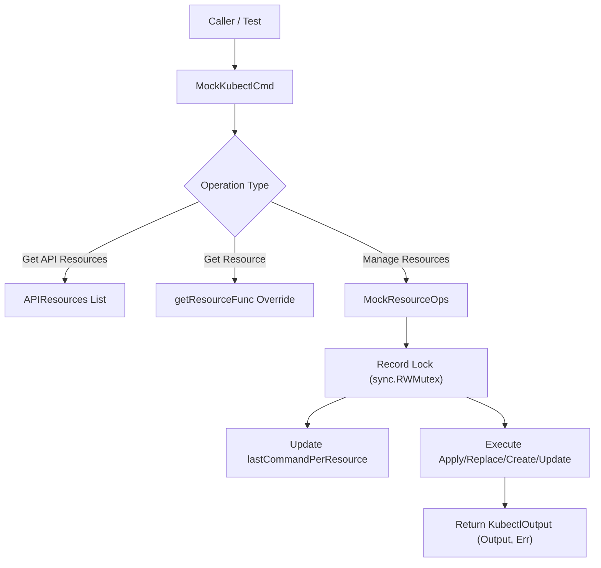
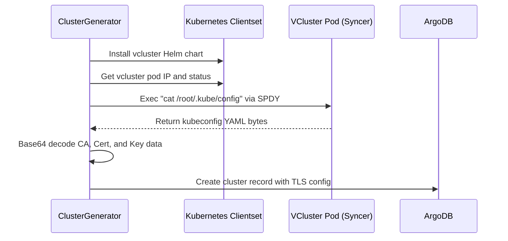

# Testing Framework

<details>
<summary>Relevant source files</summary>

The following files were used as context for generating this wiki page:

- [.mockery.yaml](https://github.com/argoproj/argo-cd/blob/main/.mockery.yaml)
- [docs/developer-guide/test-e2e.md](https://github.com/argoproj/argo-cd/blob/main/docs/developer-guide/test-e2e.md)
- [resource_customizations/apps/Deployment/actions/action_test.yaml](https://github.com/argoproj/argo-cd/blob/main/resource_customizations/apps/Deployment/actions/action_test.yaml)
- [docs/developer-guide/development-cycle.md](https://github.com/argoproj/argo-cd/blob/main/docs/developer-guide/development-cycle.md)
- [gitops-engine/pkg/utils/kube/kubetest/mock_resource_operations.go](https://github.com/argoproj/argo-cd/blob/main/gitops-engine/pkg/utils/kube/kubetest/mock_resource_operations.go)
- [gitops-engine/pkg/utils/testing/testdata.go](https://github.com/argoproj/argo-cd/blob/main/gitops-engine/pkg/utils/testing/testdata.go)
- [hack/generate-mock.sh](https://github.com/argoproj/argo-cd/blob/main/hack/generate-mock.sh)
- [gitops-engine/pkg/utils/kube/kubetest/mock.go](https://github.com/argoproj/argo-cd/blob/main/gitops-engine/pkg/utils/kube/kubetest/mock.go)
- [gitops-engine/.mockery.yaml](https://github.com/argoproj/argo-cd/blob/main/gitops-engine/.mockery.yaml)
- [resource_customizations/batch/CronJob/actions/action_test.yaml](https://github.com/argoproj/argo-cd/blob/main/resource_customizations/batch/CronJob/actions/action_test.yaml)
- [resource_customizations/keda.sh/ScaledObject/actions/action_test.yaml](https://github.com/argoproj/argo-cd/blob/main/resource_customizations/keda.sh/ScaledObject/actions/action_test.yaml)
- [hack/gen-resources/generators/cluster_generator.go](https://github.com/argoproj/argo-cd/blob/main/hack/gen-resources/generators/cluster_generator.go)
- [resource_customizations/image.toolkit.fluxcd.io/ImageUpdateAutomation/actions/action_test.yaml](https://github.com/argoproj/argo-cd/blob/main/resource_customizations/image.toolkit.fluxcd.io/ImageUpdateAutomation/actions/action_test.yaml)
- [resource_customizations/astra.netapp.io/Backup/health_test.yaml](https://github.com/argoproj/argo-cd/blob/main/resource_customizations/astra.netapp.io/Backup/health_test.yaml)
- [docs/operator-manual/resource_actions.md](https://github.com/argoproj/argo-cd/blob/main/docs/operator-manual/resource_actions.md)
- [resource_customizations/source.toolkit.fluxcd.io/HelmRepository/actions/action_test.yaml](https://github.com/argoproj/argo-cd/blob/main/resource_customizations/source.toolkit.fluxcd.io/HelmRepository/actions/action_test.yaml)
- [gitops-engine/pkg/utils/testing/api_resources.go](https://github.com/argoproj/argo-cd/blob/main/gitops-engine/pkg/utils/testing/api_resources.go)
- [resource_customizations/astra.netapp.io/ResourceBackup/health_test.yaml](https://github.com/argoproj/argo-cd/blob/main/resource_customizations/astra.netapp.io/ResourceBackup/health_test.yaml)
- [resource_customizations/source.toolkit.fluxcd.io/HelmChart/actions/action_test.yaml](https://github.com/argoproj/argo-cd/blob/main/resource_customizations/source.toolkit.fluxcd.io/HelmChart/actions/action_test.yaml)
- [resource_customizations/source.toolkit.fluxcd.io/OCIRepository/actions/action_test.yaml](https://github.com/argoproj/argo-cd/blob/main/resource_customizations/source.toolkit.fluxcd.io/OCIRepository/actions/action_test.yaml)
- [hack/k8s/main.go](https://github.com/argoproj/argo-cd/blob/main/hack/k8s/main.go)
- [resource_customizations/kustomize.toolkit.fluxcd.io/Kustomization/actions/action_test.yaml](https://github.com/argoproj/argo-cd/blob/main/resource_customizations/kustomize.toolkit.fluxcd.io/Kustomization/actions/action_test.yaml)
- [resource_customizations/helm.toolkit.fluxcd.io/HelmRelease/actions/action_test.yaml](https://github.com/argoproj/argo-cd/blob/main/resource_customizations/helm.toolkit.fluxcd.io/HelmRelease/actions/action_test.yaml)
- [resource_customizations/camel.apache.org/Integration/health_test.yaml](https://github.com/argoproj/argo-cd/blob/main/resource_customizations/camel.apache.org/Integration/health_test.yaml)
- [resource_customizations/astra.netapp.io/Application/health_test.yaml](https://github.com/argoproj/argo-cd/blob/main/resource_customizations/astra.netapp.io/Application/health_test.yaml)
- [resource_customizations/image.toolkit.fluxcd.io/ImageRepository/actions/action_test.yaml](https://github.com/argoproj/argo-cd/blob/main/resource_customizations/image.toolkit.fluxcd.io/ImageRepository/actions/action_test.yaml)
- [resource_customizations/astra.netapp.io/ExecHook/health_test.yaml](https://github.com/argoproj/argo-cd/blob/main/resource_customizations/astra.netapp.io/ExecHook/health_test.yaml)
- [resource_customizations/numaflow.numaproj.io/MonoVertex/actions/action_test.yaml](https://github.com/argoproj/argo-cd/blob/main/resource_customizations/numaflow.numaproj.io/MonoVertex/actions/action_test.yaml)
- [resource_customizations/apps/StatefulSet/actions/action_test.yaml](https://github.com/argoproj/argo-cd/blob/main/resource_customizations/apps/StatefulSet/actions/action_test.yaml)
- [resource_customizations/astra.netapp.io/Snapshot/health_test.yaml](https://github.com/argoproj/argo-cd/blob/main/resource_customizations/astra.netapp.io/Snapshot/health_test.yaml)
</details>

## Overview

### Overview
The Argo CD testing framework provides a comprehensive set of unit testing utilities, mock Kubernetes client-server implementations, resource customization verification suites, and end-to-end (E2E) test orchestration workflows. Designed to ensure system robustness across controllers, API servers, the GitOps engine, and custom resource behaviors, it decouples tests from real Kubernetes clusters using robust in-memory stubs while offering full-fidelity testing rails via local or virtualized (`vcluster`) execution chains.

The framework addresses the challenges of testing complex reconciliation loops, dynamic client interactions, and custom Lua-driven resource actions without incurring high infrastructure overhead. It utilizes `mockery` for auto-generating interface mocks, declarative YAML test specifications for custom resource health and action validations (`action_test.yaml`, `health_test.yaml`), and precise concurrency wrappers for test data isolation. Interacting closely with the GitOps engine and client-go stubs, the testing framework enforces strict invocation patterns, thread-safe command recording, and state validation across disparate control plane modules.

Sources: [.mockery.yaml:1-109](https://github.com/argoproj/argo-cd/blob/main/.mockery.yaml#L1-L109), [gitops-engine/pkg/utils/kube/kubetest/mock.go:28-131](https://github.com/argoproj/argo-cd/blob/main/gitops-engine/pkg/utils/kube/kubetest/mock.go#L28-L131)

## Mock Kubernetes Infrastructure (`kubetest`)

### Component Architecture and Control Flow
The `gitops-engine/pkg/utils/kube/kubetest` package provides core mock implementations of Kubernetes client operations, command runners, and resource appliers. The primary types are `MockKubectlCmd` and `MockResourceOps`, which simulate cluster-level resource manipulations, dry runs, and API resource discovery without connecting to a live API server.

`MockKubectlCmd` implements interface contracts for cluster interaction, routing calls through customizable function pointers (`convertToVersionFunc`, `getResourceFunc`, `loadOpenAPISchemaFunc`, `manageServerSideDiffDryRunFunc`) or falling back to static predefined datasets such as `APIResources` and `Commands`. When resource management operations are invoked via `ManageResources`, it returns a thread-safe `MockResourceOps` instance protected by an internal `sync.RWMutex` (`recordLock`).



Sources: [gitops-engine/pkg/utils/kube/kubetest/mock.go:28-131](https://github.com/argoproj/argo-cd/blob/main/gitops-engine/pkg/utils/kube/kubetest/mock.go#L28-L131), [gitops-engine/pkg/utils/kube/kubetest/mock_resource_operations.go:17-32](https://github.com/argoproj/argo-cd/blob/main/gitops-engine/pkg/utils/kube/kubetest/mock_resource_operations.go#L17-L32)

### State Recording and Mutex Safeguards
`MockResourceOps` tracks invocation parameters per resource key (`kube.ResourceKey`) using thread-safe setters and getters. Each mutation operation (`ApplyResource`, `ReplaceResource`, `UpdateResource`, `CreateResource`) evaluates dry-run strategies against the `ExecuteForDryRun` boolean flag before recording metrics.

```go
func (r *MockResourceOps) ApplyResource(_ context.Context, obj *unstructured.Unstructured, dryRun cmdutil.DryRunStrategy, force, validate, serverSideApply bool, manager string) (string, error) {
	if dryRun != cmdutil.DryRunNone && !r.ExecuteForDryRun {
		return "", nil
	}
	r.SetLastValidate(validate)
	r.SetLastServerSideApply(serverSideApply)
	r.SetLastServerSideApplyManager(manager)
	r.SetLastForce(force)
	r.SetLastResourceCommand(kube.GetResourceKey(obj), "apply")
	command, ok := r.Commands[obj.GetName()]
	if !ok {
		return "", nil
	}

	return command.Output, command.Err
}
```

> [!NOTE]
> When `dryRun` is set to anything other than `cmdutil.DryRunNone` and `ExecuteForDryRun` remains false, mutation methods short-circuit immediately and return empty outputs without recording command history.

Sources: [gitops-engine/pkg/utils/kube/kubetest/mock_resource_operations.go:110-125](https://github.com/argoproj/argo-cd/blob/main/gitops-engine/pkg/utils/kube/kubetest/mock_resource_operations.go#L110-L125)

## Test Data Generators and Static Kubernetes Schemas

### Unstructured Test Manifests
The `gitops-engine/pkg/utils/testing` package supplies standard Kubernetes resource helpers and raw manifest strings for unit testing. It exposes pre-serialized JSON/YAML structures for common types such as Pods, Services, Custom Resource Definitions, Namespaces, Roles, RoleBindings, ClusterRoles, and ClusterRoleBindings.

| Helper Function | Target Kind | Default Name | Source Manifest Line Range |
| :--- | :--- | :--- | :--- |
| `NewPod()` | Pod | `my-pod` | [gitops-engine/pkg/utils/testing/testdata.go:48-50](https://github.com/argoproj/argo-cd/blob/main/gitops-engine/pkg/utils/testing/testdata.go#L48-L50) |
| `NewService()` | Service | `my-service` | [gitops-engine/pkg/utils/testing/testdata.go:75-77](https://github.com/argoproj/argo-cd/blob/main/gitops-engine/pkg/utils/testing/testdata.go#L75-L77) |
| `NewCRD()` | CustomResourceDefinition | `testcrds.argoproj.io` | [gitops-engine/pkg/utils/testing/testdata.go:79-91](https://github.com/argoproj/argo-cd/blob/main/gitops-engine/pkg/utils/testing/testdata.go#L79-L91) |
| `NewNamespace()` | Namespace | `testnamespace` | [gitops-engine/pkg/utils/testing/testdata.go:93-99](https://github.com/argoproj/argo-cd/blob/main/gitops-engine/pkg/utils/testing/testdata.go#L93-L99) |
| `NewRole()` | Role | `my-role` | [gitops-engine/pkg/utils/testing/testdata.go:101-110](https://github.com/argoproj/argo-cd/blob/main/gitops-engine/pkg/utils/testing/testdata.go#L101-L110) |
| `NewRoleBinding()` | RoleBinding | `my-role-binding` | [gitops-engine/pkg/utils/testing/testdata.go:112-125](https://github.com/argoproj/argo-cd/blob/main/gitops-engine/pkg/utils/testing/testdata.go#L112-L125) |
| `NewClusterRole()` | ClusterRole | `my-cluster-role` | [gitops-engine/pkg/utils/testing/testdata.go:127-136](https://github.com/argoproj/argo-cd/blob/main/gitops-engine/pkg/utils/testing/testdata.go#L127-L136) |
| `NewClusterRoleBinding()` | ClusterRoleBinding | `my-cluster-role-binding` | [gitops-engine/pkg/utils/testing/testdata.go:138-151](https://github.com/argoproj/argo-cd/blob/main/gitops-engine/pkg/utils/testing/testdata.go#L138-L151) |

Sources: [gitops-engine/pkg/utils/testing/testdata.go:48-151](https://github.com/argoproj/argo-cd/blob/main/gitops-engine/pkg/utils/testing/testdata.go#L48-L151)

### Discovery and API Resource Stubs
`StaticAPIResources` pre-populates standard Kubernetes API resource lists across multiple group-versions (`v1`, `apps/v1`, `batch/v1`, `rbac.authorization.k8s.io/v1`, `networking.k8s.io/v1`, `policy/v1`, `apiextensions.k8s.io/v1`), mapping common verbs (`create`, `get`, `list`, `watch`, `update`, `patch`, `delete`, `deletecollection`) and subresources (`status`, `scale`, `log`, `exec`).

Sources: [gitops-engine/pkg/utils/testing/api_resources.go:11-87](https://github.com/argoproj/argo-cd/blob/main/gitops-engine/pkg/utils/testing/api_resources.go#L11-L87)

## Resource Customization Testing Framework

### Action and Health Test Specifications
Argo CD resource customizations (such as resource actions and health checks) are rigorously validated using declarative YAML test suites located within the `resource_customizations` directory structure. These suites fall into two categories: `discoveryTests`/`actionTests` for actions, and `tests` for health statuses.

- **Discovery Tests**: Validate that `discovery.lua` scripts correctly evaluate resource states to enable, disable, or configure UI action metadata (icons, display names, and parameter defaults).
- **Action Tests**: Verify that `action.lua` scripts produce the expected output YAML manifests or trigger expected error messages given specific input manifests and parameter inputs.
- **Health Tests**: Ensure health assessment Lua scripts correctly categorize resource states into `Progressing`, `Healthy`, `Degraded`, or `Suspended` with appropriate status messages.

Sources: [resource_customizations/apps/Deployment/actions/action_test.yaml:1-131](https://github.com/argoproj/argo-cd/blob/main/resource_customizations/apps/Deployment/actions/action_test.yaml#L1-L131), [resource_customizations/astra.netapp.io/Backup/health_test.yaml:1-18](https://github.com/argoproj/argo-cd/blob/main/resource_customizations/astra.netapp.io/Backup/health_test.yaml#L1-L18), [docs/operator-manual/resource_actions.md:239-277](https://github.com/argoproj/argo-cd/blob/main/docs/operator-manual/resource_actions.md#L239-L277)

### Concrete Action Test Structure Example
The following snippet illustrates an action test configuration for deployments, validating both successful parameter transformations (`scale`) and error handling (`invalid number`):

```yaml
actionTests:
  - action: restart
    inputPath: testdata/deployment.yaml
    expectedOutputPath: testdata/deployment-restarted.yaml

  - action: scale
    inputPath: testdata/deployment.yaml
    expectedOutputPath: testdata/deployment-scaled.yaml
    parameters:
      replicas: "6"

  - action: scale
    inputPath: testdata/deployment.yaml
    expectedErrorMessage: "invalid number: not_a_number"
    parameters:
      replicas: "not_a_number"
```

Sources: [resource_customizations/apps/Deployment/actions/action_test.yaml:107-131](https://github.com/argoproj/argo-cd/blob/main/resource_customizations/apps/Deployment/actions/action_test.yaml#L107-L131)

## Mock Generation Pipeline (`mockery`)

### Configuration and Generation Scripts
Argo CD automates the creation of type-safe mock implementations using `mockery`. The root `.mockery.yaml` and `gitops-engine/.mockery.yaml` configuration files define target packages and interfaces across controllers, application sets, commit servers, repository servers, and dynamic client utilities.

```yaml
dir: '{{.InterfaceDir}}/mocks'
filename: '{{.InterfaceName}}.go'
include-auto-generated: true # Needed since mockery 3.6.1
packages:
  github.com/argoproj/argo-cd/v3/pkg/apiclient/application:
    interfaces:
      ApplicationServiceClient: {}
  github.com/argoproj/argo-cd/gitops-engine/v3/pkg/utils/kube:
    interfaces:
      KubectlOptionsRunner: {}
```

Sources: [.mockery.yaml:1-34](https://github.com/argoproj/argo-cd/blob/main/.mockery.yaml#L1-L34), [gitops-engine/.mockery.yaml:1-11](https://github.com/argoproj/argo-cd/blob/main/gitops-engine/.mockery.yaml#L1-L11)

The shell script `hack/generate-mock.sh` orchestrates the execution of `mockery` against both the root project and the `gitops-engine` submodule:

```bash
#!/usr/bin/env bash
set -x
set -o errexit
set -o nounset
set -o pipefail

PROJECT_ROOT=$(cd "$(dirname "${BASH_SOURCE}")"/.. && pwd)
PATH="${PROJECT_ROOT}/dist:${PATH}"

mockery version
mockery --config "${PROJECT_ROOT}"/.mockery.yaml

cd "${PROJECT_ROOT}"/gitops-engine
mockery --config .mockery.yaml
```

Sources: [hack/generate-mock.sh:1-22](https://github.com/argoproj/argo-cd/blob/main/hack/generate-mock.sh#L1-L22)

## End-to-End (E2E) Test Framework

### Test Isolation and Ephemeral Data Directories
End-to-end tests coordinate complete Argo CD services installed into the `argocd-e2e` namespace or cluster context. To balance execution speed with test isolation, each test receives:
1. A random 5-character ID.
2. A dedicated namespace `argocd-e2e-ns-${id}`.
3. A primary application name `argocd-e2e-${id}`.
4. A unique Git repository cloned from `/test/e2e/testdata` into `/tmp/argo-e2e/${id}` (configurable via `ARGOCD_E2E_DIR`), exposed locally via `file:///tmp/argo-e2e${id}`.

> [!WARNING]
> Volume sharing restrictions in container runtimes (such as Rancher Desktop or Docker Desktop) can cause `unable to ls-remote HEAD` errors when accessing local file repositories inside e2e containers. Ensure `/private/tmp` is marked writable in your container engine configuration if running tests locally.

Sources: [docs/developer-guide/test-e2e.md:3-23](https://github.com/argoproj/argo-cd/blob/main/docs/developer-guide/test-e2e.md#L3-L23)

### E2E Execution Options and Environment Ports
Tests can be executed against a virtualized chain (`make start-e2e` / `make test-e2e`) or a local chain (`make start-e2e-local` / `make test-e2e-local`). Listeners and components are configurable via environment variables:

| Environment Variable | Default Port / Value | Description |
| :--- | :--- | :--- |
| `ARGOCD_E2E_APISERVER_PORT` | `8080` | Listener port for `argocd-server` |
| `ARGOCD_E2E_REPOSERVER_PORT` | `8081` | Listener port for `argocd-reposerver` |
| `ARGOCD_E2E_DEX_PORT` | `5556` | Listener port for `dex` |
| `ARGOCD_E2E_REDIS_PORT` | `6379` | Listener port for `redis` |
| `ARGOCD_E2E_PNPM_CMD` | `pnpm` | Command to start UI via pnpm |
| `ARGOCD_E2E_DIR` | `/tmp/argo-e2e***` | Ephemeral test data repository path |

Sources: [docs/developer-guide/test-e2e.md:40-52](https://github.com/argoproj/argo-cd/blob/main/docs/developer-guide/test-e2e.md#L40-L52)

## Test Environment Provisioning and Cluster Generators

### Controller-Runtime `envtest` and VCluster Integration
For testing cluster controllers and custom resource definitions without external dependencies, the framework uses `sigs.k8s.io/controller-runtime/pkg/envtest` and virtual cluster generators (`vcluster`).

`hack/k8s/main.go` boots an isolated control plane, writes out a kubeconfig file to `/tmp/kubeconfig`, verifies server responsiveness across retry attempts, and applies base manifests via `kubectl apply -k`:

```go
func main() {
	testEnv := envtest.Environment{
		CRDDirectoryPaths: []string{filepath.Join("manifests", "crds")},
	}
	println("Starting K8S...")
	cfg, err := testEnv.Start()

	errors.CheckError(err)
	kubeConfigPath := "/tmp/kubeconfig"
	if len(os.Args) > 2 {
		kubeConfigPath = os.Args[1]
	}

	println("Kubeconfig is available at " + kubeConfigPath)
	errors.CheckError(kube.WriteKubeConfig(cfg, "default", kubeConfigPath))
	client, err := kubernetes.NewForConfig(cfg)
	errors.CheckError(err)

	attempts := 5
	interval := time.Second
	for range attempts {
		_, err = client.ServerVersion()
		if err == nil {
			break
		}
		time.Sleep(interval)
	}
	errors.CheckError(err)

	cmd := exec.CommandContext(context.Background(), "kubectl", "apply", "-k", "manifests/base/config")
	cmd.Env = []string{"KUBECONFIG=" + kubeConfigPath}
	errors.CheckError(cmd.Run())
	<-context.Background().Done()
}
```

Sources: [hack/k8s/main.go:18-51](https://github.com/argoproj/argo-cd/blob/main/hack/k8s/main.go#L18-L51)

### Cluster Generator Concurrency Control
The `ClusterGenerator` (`hack/gen-resources/generators/cluster_generator.go`) provisions multiple test clusters in parallel using a sized wait group (`util.New(opts.ClusterOpts.Concurrency)`). It installs vcluster Helm charts, extracts credentials via pod execution streams (`remotecommand.NewSPDYExecutor`), and registers clusters into the Argo CD database (`cg.db.CreateCluster`).



Sources: [hack/gen-resources/generators/cluster_generator.go:235-251](https://github.com/argoproj/argo-cd/blob/main/hack/gen-resources/generators/cluster_generator.go#L235-L251)

## Design Trade-offs and Architectural Decisions

| Design Choice | Benefit | Cost |
| :--- | :--- | :--- |
| **In-Memory Kubernetes Stubs (`kubetest`)** | High test execution speed, zero external cluster dependency for unit tests. | Cannot capture low-level network partitions or real API server admission webhook races. |
| **Declarative YAML Test Suites (`action_test.yaml`)** | Extremely concise syntax for testing Lua action discovery and output transformations. | Limited debugging capability when complex Lua runtime errors occur inside sandboxed scripts. |
| **Ephemerally Cloned File-Based Git Repos (`/tmp/argo-e2e`)** | Complete isolation between concurrent E2E test runs without remote Git pollution. | Requires explicit volume-sharing configuration on host container runtimes like Rancher Desktop. |
| **Auto-Generated Mocks via `mockery`** | Ensures mock implementations stay perfectly synchronized with interface definitions. | Generated files can introduce noise in diffs and require regeneration (`make codegen`) upon interface changes. |

Sources: [.mockery.yaml:1-34](https://github.com/argoproj/argo-cd/blob/main/.mockery.yaml#L1-L34), [docs/developer-guide/test-e2e.md:3-61](https://github.com/argoproj/argo-cd/blob/main/docs/developer-guide/test-e2e.md#L3-L61), [gitops-engine/pkg/utils/kube/kubetest/mock.go:28-131](https://github.com/argoproj/argo-cd/blob/main/gitops-engine/pkg/utils/kube/kubetest/mock.go#L28-L131), [docs/operator-manual/resource_actions.md:239-277](https://github.com/argoproj/argo-cd/blob/main/docs/operator-manual/resource_actions.md#L239-L277)

## Related

- [[Development Environment]]

