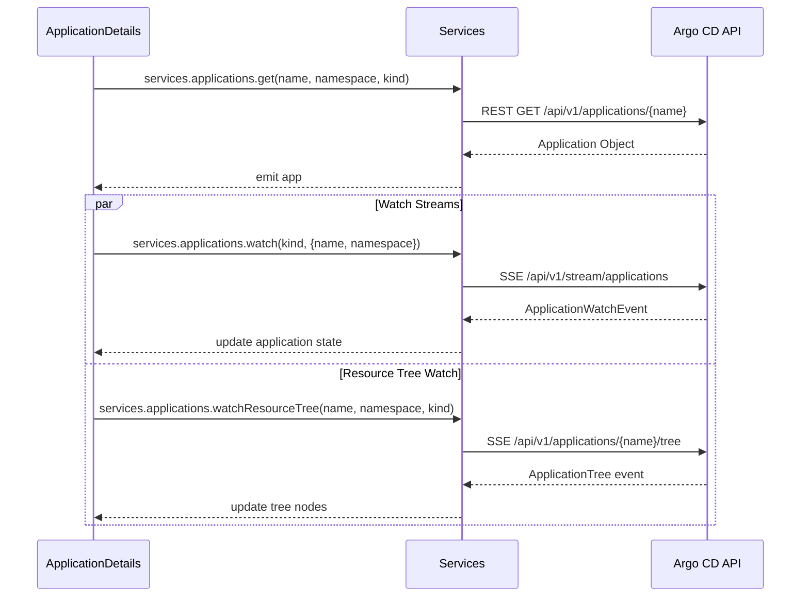

# UI Architecture

<details>
<summary>Relevant source files</summary>

The following files were used as context for generating this wiki page:

- [ui/src/app/applications/components/application-details/application-details.tsx](https://github.com/argoproj/argo-cd/blob/main/ui/src/app/applications/components/application-details/application-details.tsx)
- [ui/src/app/applications/components/resource-details/resource-details.tsx](https://github.com/argoproj/argo-cd/blob/main/ui/src/app/applications/components/resource-details/resource-details.tsx)
- [ui/src/app/applications/components/applications-list/applications-list.tsx](https://github.com/argoproj/argo-cd/blob/main/ui/src/app/applications/components/applications-list/applications-list.tsx)
- [ui/src/app/app.tsx](https://github.com/argoproj/argo-cd/blob/main/ui/src/app/app.tsx)
- [ui/src/app/shared/models.ts](https://github.com/argoproj/argo-cd/blob/main/ui/src/app/shared/models.ts)
- [ui/src/app/settings/components/project-details/project-details.tsx](https://github.com/argoproj/argo-cd/blob/main/ui/src/app/settings/components/project-details/project-details.tsx)
- [docs/proposals/002-ui-extensions.md](https://github.com/argoproj/argo-cd/blob/main/docs/proposals/002-ui-extensions.md)
- [ui/src/app/shared/services/extensions-service.ts](https://github.com/argoproj/argo-cd/blob/main/ui/src/app/shared/services/extensions-service.ts)
- [ui/package.json](https://github.com/argoproj/argo-cd/blob/main/ui/package.json)
</details>

## Overview

The Argo CD UI architecture implements a modern, single-page application built on React, TypeScript, and RxJS reactive streams, serving as the primary web-based control plane for GitOps continuous delivery workflows. Designed around modular extension points and robust state synchronization, the interface coordinates complex application topologies, real-time resource reconciliation, diagnostic terminals, and multi-tenant project administration.

Sources: [ui/src/app/app.tsx:L3-L22](https://github.com/argoproj/argo-cd/blob/main/ui/src/app/app.tsx#L3-L22), [ui/package.json:L14-L59](https://github.com/argoproj/argo-cd/blob/main/ui/package.json#L14-L59)

By decoupling view components from underlying API services through observable event targets and context providers, the architecture ensures resilient error isolation, dynamic session bootstrapping, and seamless pluggability for custom resource visualizations and system-level extensions without requiring core re-compilation.

Sources: [ui/src/app/app.tsx:L121-L156](https://github.com/argoproj/argo-cd/blob/main/ui/src/app/app.tsx#L121-L156), [ui/src/app/shared/services/extensions-service.ts:L9-L40](https://github.com/argoproj/argo-cd/blob/main/ui/src/app/shared/services/extensions-service.ts#L9-L40)

## Application Root and Session Bootstrap

### Overview

The core Single Page Application (SPA) entry point and session bootstrapping logic reside within `ui/src/app/app.tsx`. Prior to mounting the root React component tree, the application extracts deployment base path configurations from the document `base` tag, initializes the browser history router via `createBrowserHistory`, and binds the base reference to request handlers.

Sources: [ui/src/app/app.tsx:L24-L29](https://github.com/argoproj/argo-cd/blob/main/ui/src/app/app.tsx#L24-L29)

### Session Bootstrap Workflow

The initialization lifecycle begins in `App.componentDidMount()`, which concurrently establishes WebSocket and request error listeners while executing `bootstrapAppSession()`. The bootstrap procedure coordinates multiple asynchronous service calls to determine user authentication, server version metadata, and authorization settings.

Sources: [ui/src/app/app.tsx:L158-L172](https://github.com/argoproj/argo-cd/blob/main/ui/src/app/app.tsx#L158-L172)

The execution walkthrough for application session startup proceeds through the following call chain:
1. `bootstrapAppSession()` initiates a parallel fetch using `Promise.all([services.authService.settings(), fetchUserInfoSafe(), versionLoader])`.
2. `fetchUserInfoSafe()` calls `services.users.get()`, catching any `401 Unauthorized` response to return a fallback anonymous user object `{loggedIn: false, username: '', iss: 'argocd', groups: []}`.
3. `sessionFromBootstrap(userInfoResult, authSettings, versionInfo)` evaluates user login state, template rendering capabilities (Kustomize/Helm versions), and Single Sign-On configuration to resolve whether a valid session or SSO redirect is required.
4. If authentication fails and the current route is not `/login`, the application redirects the user to the SSO login endpoint or the local `/login` view with an encoded `return_url` query parameter.

Sources: [ui/src/app/app.tsx:L83-L119](https://github.com/argoproj/argo-cd/blob/main/ui/src/app/app.tsx#L83-L119), [ui/src/app/app.tsx:L174-L220](https://github.com/argoproj/argo-cd/blob/main/ui/src/app/app.tsx#L174-L220)

> [!WARNING]
> If a user session expires asynchronously during runtime, the global `requests.onError` subscription intercepts `401` status errors, re-evaluates SSO configuration via `isExpiredSSO()`, and forces an immediate page redirection or navigation push to the login route.

Sources: [ui/src/app/app.tsx:L335-L357](https://github.com/argoproj/argo-cd/blob/main/ui/src/app/app.tsx#L335-L357)

### Context Providers and Dependency Injection

Once the session resolves, the `App` component renders a nested hierarchy of context providers that supply reactive managers, routing state, and view preferences to downstream components.

Sources: [ui/src/app/app.tsx:L249-L332](https://github.com/argoproj/argo-cd/blob/main/ui/src/app/app.tsx#L249-L332)

| Context Provider | Value / Payload Supplied | Purpose | Sources |
| :--- | :--- | :--- | :--- |
| `PageContext.Provider` | `{title: 'Argo CD'}` | Sets default document page title metadata. | [ui/src/app/app.tsx:L281-L281](https://github.com/argoproj/argo-cd/blob/main/ui/src/app/app.tsx#L281-L281) |
| `Provider` (from `argo-ui`) | `{history, popup, notifications, navigation, baseHref}` | Supplies shared UI utility managers and history to legacy class components. | [ui/src/app/app.tsx:L264-L282](https://github.com/argoproj/argo-cd/blob/main/ui/src/app/app.tsx#L264-L282) |
| `AppContextReact.Provider` | `{history, apis, router}` | Injects application context into `argo-ui` components to prevent undefined context errors during error handling. | [ui/src/app/app.tsx:L269-L289](https://github.com/argoproj/argo-cd/blob/main/ui/src/app/app.tsx#L269-L289) |
| `AuthSettingsCtx.Provider` | `this.state.authSettings` | Broadcasts global authorization configuration settings across the route tree. | [ui/src/app/app.tsx:L293-L293](https://github.com/argoproj/argo-cd/blob/main/ui/src/app/app.tsx#L293-L293) |

> [!NOTE]
> The `argo-ui` library requires an `AppContextReact` provider above route components so that class-based components like `DataLoader` can access `this.context` and execute error handlers without throwing reference exceptions.

Sources: [ui/src/app/app.tsx:L283-L289](https://github.com/argoproj/argo-cd/blob/main/ui/src/app/app.tsx#L283-L289)

### Core Routes and Navigation Mapping

The SPA router manages top-level navigation items and dynamic route mapping, which supports both built-in core views and dynamically registered system-level extensions.

Sources: [ui/src/app/app.tsx:L32-L40](https://github.com/argoproj/argo-cd/blob/main/ui/src/app/app.tsx#L32-L40), [ui/src/app/app.tsx:L359-L381](https://github.com/argoproj/argo-cd/blob/main/ui/src/app/app.tsx#L359-L381)

| Route Path | Component Binding | Layout Wrapper | Sources |
| :--- | :--- | :--- | :--- |
| `/login` | `login.component` | None (`noLayout: true`) | [ui/src/app/app.tsx:L33-L33](https://github.com/argoproj/argo-cd/blob/main/ui/src/app/app.tsx#L33-L33) |
| `/applications` | `applications.component` | Standard `Layout` with banner | [ui/src/app/app.tsx:L34-L34](https://github.com/argoproj/argo-cd/blob/main/ui/src/app/app.tsx#L34-L34), [ui/src/app/app.tsx:L309-L318](https://github.com/argoproj/argo-cd/blob/main/ui/src/app/app.tsx#L309-L318) |
| `/applicationsets` | `applications.component` | Standard `Layout` with banner | [ui/src/app/app.tsx:L36-L36](https://github.com/argoproj/argo-cd/blob/main/ui/src/app/app.tsx#L36-L36), [ui/src/app/app.tsx:L309-L318](https://github.com/argoproj/argo-cd/blob/main/ui/src/app/app.tsx#L309-L318) |
| `/settings` | `settings.component` | Standard `Layout` with banner | [ui/src/app/app.tsx:L37-L37](https://github.com/argoproj/argo-cd/blob/main/ui/src/app/app.tsx#L37-L37), [ui/src/app/app.tsx:L309-L318](https://github.com/argoproj/argo-cd/blob/main/ui/src/app/app.tsx#L309-L318) |
| `/user-info` | `userInfo.component` | Standard `Layout` with banner | [ui/src/app/app.tsx:L38-L38](https://github.com/argoproj/argo-cd/blob/main/ui/src/app/app.tsx#L38-L38), [ui/src/app/app.tsx:L309-L318](https://github.com/argoproj/argo-cd/blob/main/ui/src/app/app.tsx#L309-L318) |
| `/help` | `help.component` | Standard `Layout` with banner | [ui/src/app/app.tsx:L39-L39](https://github.com/argoproj/argo-cd/blob/main/ui/src/app/app.tsx#L39-L39), [ui/src/app/app.tsx:L309-L318](https://github.com/argoproj/argo-cd/blob/main/ui/src/app/app.tsx#L309-L318) |

## Application Listing and State Synchronization

### Overview

The main application dashboard manages the primary listing, filtering, and streaming synchronization of Kubernetes applications. Implemented via the `ApplicationsList` component, it integrates RxJS observables to consume REST listings and stream real-time watch events while optimizing UI performance through batching.

Sources: [ui/src/app/applications/components/applications-list/applications-list.tsx:L62-L101](https://github.com/argoproj/argo-cd/blob/main/ui/src/app/applications/components/applications-list/applications-list.tsx#L62-L101), [ui/src/app/applications/components/applications-list/applications-list.tsx:L322-L325](https://github.com/argoproj/argo-cd/blob/main/ui/src/app/applications/components/applications-list/applications-list.tsx#L322-L325)

### Streaming Reactive Updates and Watch Handling

The `loadApplications` function coordinates initial data fetching and continuous synchronization. It retrieves an initial list of applications filtered by project and namespace using `services.applications.list()`, capturing the returned `resourceVersion`. It then merges this initial payload with a continuous stream from `services.applications.watch()`.

Sources: [ui/src/app/applications/components/applications-list/applications-list.tsx:L62-L69](https://github.com/argoproj/argo-cd/blob/main/ui/src/app/applications/components/applications-list/applications-list.tsx#L62-L69)

To prevent constant re-rendering and optimize browser performance under high-frequency cluster mutations, the stream pipeline applies transformation operators in a strict sequence:

1. `repeat()`: Restarts the watch observable upon completion.
2. `retryWhen(...)`: Intercepts stream errors and retries execution after a fixed delay defined by `WATCH_RETRY_TIMEOUT` (504 ms).
3. `bufferTime(...)`: Accumulates incoming watch events over a sliding window defined by `EVENTS_BUFFER_TIMEOUT` (500 ms).
4. `map(...)`: Iterates over the batched array of application changes (`appChanges`), locating existing application entries via `AppUtils.appInstanceName()` and applying updates based on the event type (`DELETED` splices out the item; any other type updates the existing index or unshifts new applications onto the array).
5. `filter(...)`: Emits only when `item.updated` is true.
6. `map(...)`: Yields the updated `applications` array to downstream subscribers.

Sources: [ui/src/app/applications/components/applications-list/applications-list.tsx:L31-L33](https://github.com/argoproj/argo-cd/blob/main/ui/src/app/applications/components/applications-list/applications-list.tsx#L31-L33), [ui/src/app/applications/components/applications-list/applications-list.tsx:L69-L98](https://github.com/argoproj/argo-cd/blob/main/ui/src/app/applications/components/applications-list/applications-list.tsx#L69-L98)

> [!WARNING]
> The application list and watch APIs support only a strict set of pre-allocated fields to minimize payload sizes. Any newly introduced model properties must be explicitly registered in `APP_FIELDS` within `applications-list.tsx` and mapped in the backend forwarder.

Sources: [ui/src/app/applications/components/applications-list/applications-list.tsx:L34-L60](https://github.com/argoproj/argo-cd/blob/main/ui/src/app/applications/components/applications-list/applications-list.tsx#L34-L60)

### View Switching and Filter Preferences

The dashboard supports multiple display layouts via the `ViewPref` component, which combines user view preferences with active URL query parameters. The table below outlines the URL parameters parsed and mapped into `AppsListPreferences`.

Sources: [ui/src/app/applications/components/applications-list/applications-list.tsx:L103-L200](https://github.com/argoproj/argo-cd/blob/main/ui/src/app/applications/components/applications-list/applications-list.tsx#L103-L200)

| URL Query Parameter | Preference Property | Parsing & Transformation Rules | Sources |
| :--- | :--- | :--- | :--- |
| `proj` | `projectsFilter` | Split by comma, filters out empty strings. | [ui/src/app/applications/components/applications-list/applications-list.tsx:L113-L118](https://github.com/argoproj/argo-cd/blob/main/ui/src/app/applications/components/applications-list/applications-list.tsx#L113-L118) |
| `sync` | `syncFilter` | Split by comma, filters out empty strings. | [ui/src/app/applications/components/applications-list/applications-list.tsx:L119-L124](https://github.com/argoproj/argo-cd/blob/main/ui/src/app/applications/components/applications-list/applications-list.tsx#L119-L124) |
| `autoSync` | `autoSyncFilter` | Split by comma, filters out empty strings. | [ui/src/app/applications/components/applications-list/applications-list.tsx:L125-L130](https://github.com/argoproj/argo-cd/blob/main/ui/src/app/applications/components/applications-list/applications-list.tsx#L125-L130) |
| `operation` | `operationFilter` | Split by comma, filters out empty strings. | [ui/src/app/applications/components/applications-list/applications-list.tsx:L131-L136](https://github.com/argoproj/argo-cd/blob/main/ui/src/app/applications/components/applications-list/applications-list.tsx#L131-L136) |
| `health` | `healthFilter` | Split by comma, filters out empty strings. | [ui/src/app/applications/components/applications-list/applications-list.tsx:L137-L142](https://github.com/argoproj/argo-cd/blob/main/ui/src/app/applications/components/applications-list/applications-list.tsx#L137-L142) |
| `namespace` | `namespacesFilter` | Split by comma, filters out empty strings. | [ui/src/app/applications/components/applications-list/applications-list.tsx:L143-L148](https://github.com/argoproj/argo-cd/blob/main/ui/src/app/applications/components/applications-list/applications-list.tsx#L143-L148) |
| `targetRevision` | `targetRevisionFilter` | Split by comma, URL-decoded via `decodeURIComponent`, filters empty. | [ui/src/app/applications/components/applications-list/applications-list.tsx:L149-L155](https://github.com/argoproj/argo-cd/blob/main/ui/src/app/applications/components/applications-list/applications-list.tsx#L149-L155) |
| `cluster` | `clustersFilter` | Split by comma, filters out empty strings. | [ui/src/app/applications/components/applications-list/applications-list.tsx:L156-L161](https://github.com/argoproj/argo-cd/blob/main/ui/src/app/applications/components/applications-list/applications-list.tsx#L156-L161) |
| `showFavorites` | `showFavorites` | Evaluated strictly as boolean string equality (`=== 'true'`). | [ui/src/app/applications/components/applications-list/applications-list.tsx:L162-L164](https://github.com/argoproj/argo-cd/blob/main/ui/src/app/applications/components/applications-list/applications-list.tsx#L162-L164) |
| `view` | `view` | Cast directly to `AppsListViewType`. | [ui/src/app/applications/components/applications-list/applications-list.tsx:L165-L167](https://github.com/argoproj/argo-cd/blob/main/ui/src/app/applications/components/applications-list/applications-list.tsx#L165-L167) |
| `labels` | `labelsFilter` | Split by comma, decodes URI components, filters empty. | [ui/src/app/applications/components/applications-list/applications-list.tsx:L168-L174](https://github.com/argoproj/argo-cd/blob/main/ui/src/app/applications/components/applications-list/applications-list.tsx#L168-L174) |
| `annotations` | `annotationsFilter` | Split by comma, decodes URI components, filters empty. | [ui/src/app/applications/components/applications-list/applications-list.tsx:L175-L181](https://github.com/argoproj/argo-cd/blob/main/ui/src/app/applications/components/applications-list/applications-list.tsx#L175-L181) |
| `repo` | `reposFilter` | Split by comma, decodes URI components, filters empty. | [ui/src/app/applications/components/applications-list/applications-list.tsx:L182-L188](https://github.com/argoproj/argo-cd/blob/main/ui/src/app/applications/components/applications-list/applications-list.tsx#L182-L188) |

Sources: [ui/src/app/applications/components/applications-list/applications-list.tsx:L103-L200](https://github.com/argoproj/argo-cd/blob/main/ui/src/app/applications/components/applications-list/applications-list.tsx#L103-L200)

### Application Filtering and Search Architecture

The `filterApplications` utility processes raw application lists against preference criteria and search queries. It checks summary attributes such as `isAppOfApps`, computes filter flags using `getAppFilterResults()`, and compiles regular expression or plain-text matchers via `createMatcher()`.

Sources: [ui/src/app/applications/components/applications-list/applications-list.tsx:L202-L222](https://github.com/argoproj/argo-cd/blob/main/ui/src/app/applications/components/applications-list/applications-list.tsx#L202-L222)

> [!NOTE]
> The search bar component integrates an autocomplete suggestions engine populated by application qualified names, allowing operators to jump directly to an application's details view upon selection.

Sources: [ui/src/app/applications/components/applications-list/applications-list.tsx:L246-L264](https://github.com/argoproj/argo-cd/blob/main/ui/src/app/applications/components/applications-list/applications-list.tsx#L246-L264)

## Application Details and Topology Views

### Overview

The `ApplicationDetails` component manages the detailed inspection view for individual applications and application sets. It orchestrates multiple visualization modes—including tree, network, pods, list, and registered UI extensions—while maintaining live synchronization with the Argo CD API server through reactive data loaders and streaming event streams.

Sources: [ui/src/app/applications/components/application-details/application-details.tsx:L84-L121](https://github.com/argoproj/argo-cd/blob/main/ui/src/app/applications/components/application-details/application-details.tsx#L84-L121)

### Live Resource Tree Watching and Call-Chain Execution

The application loading pipeline executes via `loadAppInfo()`, which combines initial REST fetches with continuous real-time watchers for both application state and resource hierarchy trees.



Sources: [ui/src/app/applications/components/application-details/application-details.tsx:L1475-L1528](https://github.com/argoproj/argo-cd/blob/main/ui/src/app/applications/components/application-details/application-details.tsx#L1475-L1528)

> [!WARNING]
> If a watch stream encounters a network interruption or error, `retryWhen` intercepts the failure and delays reconnection by 500 milliseconds before re-subscribing. When a `DELETED` watch event is received, `onAppDeleted()` triggers a notification and immediately navigates the user back to the `/applications` list route.

Sources: [ui/src/app/applications/components/application-details/application-details.tsx:L1499-L1508](https://github.com/argoproj/argo-cd/blob/main/ui/src/app/applications/components/application-details/application-details.tsx#L1499-L1508)

### Topology View and Status Panel Aggregation

The status panel aggregates overall health, synchronization state, operation progress, and error conditions into sidebar widgets and sliding panels. The topology renderer uses `filterTreeNode()` to evaluate resource nodes against active filter inputs for name wildcards, kinds, health statuses, sync statuses, and namespaces.

| Filter Category | Matching Logic | Sources |
| :--- | :--- | :--- |
| `name` | Evaluated via wildcard regular expressions generated by `nodeNameMatchesWildcardFilters()` escaping special characters except `*`. | [ui/src/app/applications/components/application-details/application-details.tsx:L165-L180](https://github.com/argoproj/argo-cd/blob/main/ui/src/app/applications/components/application-details/application-details.tsx#L165-L180) |
| `kind` | Exact match against node kind in `filterInput.kind`. | [ui/src/app/applications/components/application-details/application-details.tsx:L1552-L1555](https://github.com/argoproj/argo-cd/blob/main/ui/src/app/applications/components/application-details/application-details.tsx#L1552-L1555) |
| `sync` | Maps `OutOfSync` to include `['OutOfSync', 'Unknown']`, validating against root status or resource hooks. | [ui/src/app/applications/components/application-details/application-details.tsx:L1446-L1454](https://github.com/argoproj/argo-cd/blob/main/ui/src/app/applications/components/application-details/application-details.tsx#L1446-L1454) |
| `health` | Matches against root or node health status, automatically including resource hooks if present. | [ui/src/app/applications/components/application-details/application-details.tsx:L1455-L1460](https://github.com/argoproj/argo-cd/blob/main/ui/src/app/applications/components/application-details/application-details.tsx#L1455-L1460) |
| `namespace` | Inclusion check against `node.namespace`. | [ui/src/app/applications/components/application-details/application-details.tsx:L1460-L1460](https://github.com/argoproj/argo-cd/blob/main/ui/src/app/applications/components/application-details/application-details.tsx#L1460-L1460) |

Sources: [ui/src/app/applications/components/application-details/application-details.tsx:L1444-L1468](https://github.com/argoproj/argo-cd/blob/main/ui/src/app/applications/components/application-details/application-details.tsx#L1444-L1468)

### Design Trade-Offs in State Management

| Design Choice | Benefit | Cost | Sources |
| :--- | :--- | :--- | :--- |
| **Combined Observables (`combineLatest` with `merge`)** | Merges static REST responses with dynamic WebSocket/SSE event streams into a unified data flow. | Increased memory consumption and re-rendering complexity when high-frequency status updates occur. | [ui/src/app/applications/components/application-details/application-details.tsx:L1477-L1523](https://github.com/argoproj/argo-cd/blob/main/ui/src/app/applications/components/application-details/application-details.tsx#L1477-L1523) |
| **URL Search Parameter State Sync** | Enables deep linking to specific views, nodes, sync panels, and modal states directly via URL query strings. | Requires constant URL synchronization and parsing overhead on navigation changes. | [ui/src/app/applications/components/application-details/application-details.tsx:L151-L158](https://github.com/argoproj/argo-cd/blob/main/ui/src/app/applications/components/application-details/application-details.tsx#L151-L158) |
| **Fallback Tree Generation** | Ensures the UI renders an immediate resource list from application status items even before resource tree streams resolve. | May lack complex parent-child edge relationships until the full resource tree payload arrives. | [ui/src/app/applications/components/application-details/application-details.tsx:L1480-L1491](https://github.com/argoproj/argo-cd/blob/main/ui/src/app/applications/components/application-details/application-details.tsx#L1480-L1491) |

Sources: [ui/src/app/applications/components/application-details/application-details.tsx:L1475-L1526](https://github.com/argoproj/argo-cd/blob/main/ui/src/app/applications/components/application-details/application-details.tsx#L1475-L1526)

## Resource Details and Diagnostic Workflows

### Overview

Resource inspection and diagnostic workflows are powered by the `ResourceDetails` component, which evaluates selected cluster nodes and constructs contextual navigation tabs, event streams, terminal access, and container log views. When a node is selected, `ResourceDetails` uses a `DataLoader` hooked to `selectedNode.resourceVersion` to fetch managed resources, live cluster states, event histories, and RBAC permissions.

Sources: [ui/src/app/applications/components/resource-details/resource-details.tsx:L39-L385](https://github.com/argoproj/argo-cd/blob/main/ui/src/app/applications/components/resource-details/resource-details.tsx#L39-L385)

### Tab Assembly and Pod Diagnostic Workflows

The function `getResourceTabs()` dynamically constructs available interface tabs based on resource metadata, pod container specifications, and user permissions. For regular resources, it populates event lists and extension points. If the selected node resolves to a `Pod` or contains pod states with container specifications, it builds container offset groups distinguishing regular containers from `initContainers`, and appends `LOGS` and `Terminal` viewers subject to `logsAllowed`, `execEnabled`, and `execAllowed` authorization checks.

```typescript
const containerGroups = [
    {
        offset: 0,
        title: 'CONTAINERS',
        containers: podState.spec.containers || []
    }
];
if (podState.spec.initContainers?.length > 0) {
    containerGroups.push({
        offset: (podState.spec.containers || []).length,
        title: 'INIT CONTAINERS',
        containers: podState.spec.initContainers || []
    });
}
```
Sources: [ui/src/app/applications/components/resource-details/resource-details.tsx:L63-L159](https://github.com/argoproj/argo-cd/blob/main/ui/src/app/applications/components/resource-details/resource-details.tsx#L63-L159)

> [!NOTE]
> The active container index is reset whenever `selectedNodeKey` changes by comparing previous and current node keys during render rather than relying on cascading effects.
Sources: [ui/src/app/applications/components/resource-details/resource-details.tsx:L47-L53](https://github.com/argoproj/argo-cd/blob/main/ui/src/app/applications/components/resource-details/resource-details.tsx#L47-L53)

### Resource Diagnostic Tabs and Actions

| Tab Key | Component / Action | Condition / Permission Check | Sources |
| :--- | :--- | :--- | :--- |
| `summary` | `ApplicationNodeInfo` | Always present for selected nodes; displays live and controlled metadata. | [ui/src/app/applications/components/resource-details/resource-details.tsx:L359-L372](https://github.com/argoproj/argo-cd/blob/main/ui/src/app/applications/components/resource-details/resource-details.tsx#L359-L372) |
| `events` | `EventsList` | Rendered when `state` is defined; displays error badges when event counts exceed zero. | [ui/src/app/applications/components/resource-details/resource-details.tsx:L78-L91](https://github.com/argoproj/argo-cd/blob/main/ui/src/app/applications/components/resource-details/resource-details.tsx#L78-L91) |
| `logs` | `PodsLogsViewer` | Rendered when `podState` has metadata/spec and `logsAllowed` evaluates to true via `services.accounts.canI('logs', 'get', ...)`. | [ui/src/app/applications/components/resource-details/resource-details.tsx:L92-L138](https://github.com/argoproj/argo-cd/blob/main/ui/src/app/applications/components/resource-details/resource-details.tsx#L92-L138) |
| `exec` | `PodTerminalViewer` | Rendered when `selectedNode.kind === 'Pod'`, `execEnabled` is true in auth settings, and `execAllowed` is permitted via `services.accounts.canI('exec', 'create', ...)`. | [ui/src/app/applications/components/resource-details/resource-details.tsx:L139-L158](https://github.com/argoproj/argo-cd/blob/main/ui/src/app/applications/components/resource-details/resource-details.tsx#L139-L158) |
| `preview` | `AppSetResourceNodePreview` | Rendered when `node.kind === 'ApplicationSet'` and `node.group === 'argoproj.io'`. | [ui/src/app/applications/components/resource-details/resource-details.tsx:L160-L168](https://github.com/argoproj/argo-cd/blob/main/ui/src/app/applications/components/resource-details/resource-details.tsx#L160-L168) |

Sources: [ui/src/app/applications/components/resource-details/resource-details.tsx:L63-L184](https://github.com/argoproj/argo-cd/blob/main/ui/src/app/applications/components/resource-details/resource-details.tsx#L63-L184)

### Design Trade-Offs in Resource Inspection

| Design Choice | Benefit | Cost | Sources |
| :--- | :--- | :--- | :--- |
| **DataLoader-Driven Resource Version Fetching** | Automatically re-fetches live state, events, and child resources whenever `selectedNode.resourceVersion` changes. | Triggers multiple parallel asynchronous API requests upon selecting a new resource node. | [ui/src/app/applications/components/resource-details/resource-details.tsx:L263-L311](https://github.com/argoproj/argo-cd/blob/main/ui/src/app/applications/components/resource-details/resource-details.tsx#L263-L311) |
| **Client-Side Container Offset Grouping** | Combines standard containers and init containers into a unified zero-indexed array for log and terminal viewers. | Requires tracking container offsets explicitly during user selection clicks (`group.offset + i`). | [ui/src/app/applications/components/resource-details/resource-details.tsx:L92-L112](https://github.com/argoproj/argo-cd/blob/main/ui/src/app/applications/components/resource-details/resource-details.tsx#L92-L112) |
| **Granular RBAC Authorization Checks** | Evaluates explicit account permissions (`canI` for logs and exec) before mounting terminal or log streams. | Incurs additional asynchronous network calls to the auth service during resource detail loading. | [ui/src/app/applications/components/resource-details/resource-details.tsx:L304-L308](https://github.com/argoproj/argo-cd/blob/main/ui/src/app/applications/components/resource-details/resource-details.tsx#L304-L308) |

Sources: [ui/src/app/applications/components/resource-details/resource-details.tsx:L263-L311](https://github.com/argoproj/argo-cd/blob/main/ui/src/app/applications/components/resource-details/resource-details.tsx#L263-L311)

## Project Administration and Role Management

### Overview

The project administration and role management subsystem manages Argo CD application projects (`AppProject`). It handles project configurations, security policies, access control roles, sync windows, GPG signature keys, resource monitoring restrictions, and JSON Web Token (JWT) lifecycles. The `ProjectDetails` component provides a tabbed administrative interface—spanning **Summary**, **Roles**, **Sync Windows**, and **Events**—built around data loader hooks and editable panels.

Sources: [ui/src/app/settings/components/project-details/project-details.tsx:L856-L922](https://github.com/argoproj/argo-cd/blob/main/ui/src/app/settings/components/project-details/project-details.tsx#L856-L922)

### Project Configuration and Global Reduction

Projects define administrative boundaries via `ProjectSpec`. The `reduceGlobal` function aggregates resource restrictions, source repositories, destination clusters, namespaces, and service accounts across inherited global projects.

```typescript
function reduceGlobal(projs: Project[]): ProjectSpec & {count: number} {
    return (projs || []).reduce(
        (merged, proj) => {
            merged.clusterResourceBlacklist = merged.clusterResourceBlacklist.concat(proj.spec.clusterResourceBlacklist || []);
            merged.clusterResourceWhitelist = merged.clusterResourceWhitelist.concat(proj.spec.clusterResourceWhitelist || []);
            merged.namespaceResourceBlacklist = merged.namespaceResourceBlacklist.concat(proj.spec.namespaceResourceBlacklist || []);
            merged.namespaceResourceWhitelist = merged.namespaceResourceWhitelist.concat(proj.spec.namespaceResourceWhitelist || []);
            merged.sourceRepos = merged.sourceRepos.concat(proj.spec.sourceRepos || []);
            merged.destinations = merged.destinations.concat(proj.spec.destinations || []);
            merged.sourceNamespaces = merged.sourceNamespaces.concat(proj.spec.sourceNamespaces || []);
            merged.destinationServiceAccounts = merged.destinationServiceAccounts.concat(proj.spec.destinationServiceAccounts || []);
            merged.count += 1;
            return merged;
        },
        ...
    );
}
```
Sources: [ui/src/app/settings/components/project-details/project-details.tsx:L42-L144](https://github.com/argoproj/argo-cd/blob/main/ui/src/app/settings/components/project-details/project-details.tsx#L42-L144)

### Role Management and JWT Token Lifecycle

Project roles are configured through the `ProjectRoleEditPanel` rendered inside a sliding panel. The lifecycle operations for authentication tokens bound to specific roles are handled asynchronously via dedicated service calls: `createJWTToken` generates new tokens and updates the local loader state, while `deleteJWTToken` removes tokens and refreshes project details.

```typescript
const deleteJWTToken = async (params: DeleteJWTTokenParams, notifications: NotificationsApi) => {
    try {
        await services.projects.deleteJWTToken(params);
        const info = await services.projects.getDetailed(props.match.params.name);
        loader.current.setData(info);
    } catch (e) {
        notifications.show({
            content: <ErrorNotification title='Unable to delete JWT token' e={e} />,
            type: NotificationType.Error
        });
    }
};

const createJWTToken = async (params: CreateJWTTokenParams, notifications: NotificationsApi) => {
    try {
        const jwtToken = await services.projects.createJWTToken(params);
        const info = await services.projects.getDetailed(props.match.params.name);
        loader.current.setData(info);
        setToken(jwtToken.token);
    } catch (e) {
        notifications.show({
            content: <ErrorNotification title='Unable to create JWT token' e={e} />,
            type: NotificationType.Error
        });
    }
};
```
Sources: [ui/src/app/settings/components/project-details/project-details.tsx:L154-L179](https://github.com/argoproj/argo-cd/blob/main/ui/src/app/settings/components/project-details/project-details.tsx#L154-L179), [ui/src/app/settings/components/project-details/project-details.tsx:L966-L1002](https://github.com/argoproj/argo-cd/blob/main/ui/src/app/settings/components/project-details/project-details.tsx#L966-L1002)

### Sync Windows and Status Evaluation

Sync windows dictate when applications are permitted to sync. The `SyncWindowsTab` component uses a `DataLoader` invoking `services.projects.getSyncWindows(proj.metadata.name)` to render active window statuses, schedules, durations, and applied wildcards for applications, namespaces, and clusters.

| Sync Window Property | Description | Sources |
| :--- | :--- | :--- |
| `status` | Active/inactive state and evaluation effect (Red: no syncs, Yellow: manual syncs, Green: all syncs). | [ui/src/app/settings/components/project-details/project-details.tsx:L233-L241](https://github.com/argoproj/argo-cd/blob/main/ui/src/app/settings/components/project-details/project-details.tsx#L233-L241) |
| `window` | Kind, schedule, duration, and time zone format (`kind:schedule:duration:timeZone`). | [ui/src/app/settings/components/project-details/project-details.tsx:L242-L245](https://github.com/argoproj/argo-cd/blob/main/ui/src/app/settings/components/project-details/project-details.tsx#L242-L245), [ui/src/app/settings/components/project-details/project-details.tsx:L286-L288](https://github.com/argoproj/argo-cd/blob/main/ui/src/app/settings/components/project-details/project-details.tsx#L286-L288) |
| `applications` | Comma-separated list of assigned application selectors (wildcards supported). | [ui/src/app/settings/components/project-details/project-details.tsx:L246-L249](https://github.com/argoproj/argo-cd/blob/main/ui/src/app/settings/components/project-details/project-details.tsx#L246-L249), [ui/src/app/settings/components/project-details/project-details.tsx:L289-L289](https://github.com/argoproj/argo-cd/blob/main/ui/src/app/settings/components/project-details/project-details.tsx#L289-L289) |
| `namespaces` | Comma-separated list of target namespaces (wildcards supported). | [ui/src/app/settings/components/project-details/project-details.tsx:L250-L253](https://github.com/argoproj/argo-cd/blob/main/ui/src/app/settings/components/project-details/project-details.tsx#L250-L253), [ui/src/app/settings/components/project-details/project-details.tsx:L290-L290](https://github.com/argoproj/argo-cd/blob/main/ui/src/app/settings/components/project-details/project-details.tsx#L290-L290) |
| `clusters` | Comma-separated list of target cluster servers or names (wildcards supported). | [ui/src/app/settings/components/project-details/project-details.tsx:L254-L257](https://github.com/argoproj/argo-cd/blob/main/ui/src/app/settings/components/project-details/project-details.tsx#L254-L257), [ui/src/app/settings/components/project-details/project-details.tsx:L291-L291](https://github.com/argoproj/argo-cd/blob/main/ui/src/app/settings/components/project-details/project-details.tsx#L291-L291) |
| `manualSync` | Boolean flag enabling manual syncs during deny windows. | [ui/src/app/settings/components/project-details/project-details.tsx:L258-L261](https://github.com/argoproj/argo-cd/blob/main/ui/src/app/settings/components/project-details/project-details.tsx#L258-L261), [ui/src/app/settings/components/project-details/project-details.tsx:L292-L292](https://github.com/argoproj/argo-cd/blob/main/ui/src/app/settings/components/project-details/project-details.tsx#L292-L292) |
| `syncOverrun` | Flag allowing syncs started before or during windows to continue. | [ui/src/app/settings/components/project-details/project-details.tsx:L262-L267](https://github.com/argoproj/argo-cd/blob/main/ui/src/app/settings/components/project-details/project-details.tsx#L262-L267), [ui/src/app/settings/components/project-details/project-details.tsx:L293-L293](https://github.com/argoproj/argo-cd/blob/main/ui/src/app/settings/components/project-details/project-details.tsx#L293-L293) |
| `andOperator` | Boolean indicator to apply an `AND` operator across matching selectors. | [ui/src/app/settings/components/project-details/project-details.tsx:L268-L271](https://github.com/argoproj/argo-cd/blob/main/ui/src/app/settings/components/project-details/project-details.tsx#L268-L271), [ui/src/app/settings/components/project-details/project-details.tsx:L294-L294](https://github.com/argoproj/argo-cd/blob/main/ui/src/app/settings/components/project-details/project-details.tsx#L294-L294) |

Sources: [ui/src/app/settings/components/project-details/project-details.tsx:L218-L309](https://github.com/argoproj/argo-cd/blob/main/ui/src/app/settings/components/project-details/project-details.tsx#L218-L309)

> [!NOTE]
> When creating or deleting JWT tokens via `ProjectRoleEditPanel`, the token string is temporarily exposed via component state (`token`) and must be explicitly cleared using `hideJWTToken` upon closing the sliding panel.

Sources: [ui/src/app/settings/components/project-details/project-details.tsx:L923-L930](https://github.com/argoproj/argo-cd/blob/main/ui/src/app/settings/components/project-details/project-details.tsx#L923-L930), [ui/src/app/settings/components/project-details/project-details.tsx:L997-L1000](https://github.com/argoproj/argo-cd/blob/main/ui/src/app/settings/components/project-details/project-details.tsx#L997-L1000)

## UI Extensions and Custom Pluggability

### Extension Registration Service and Event Architecture

The Argo CD UI provides a flexible pluggability mechanism via `ExtensionsService` and global `window.extensionsAPI` hooks. Third-party extensions register themselves by calling initialization functions attached to the global window object, which in turn publish events through an internal `ExtensionsEventTarget` dispatcher supporting the `resource`, `systemLevel`, `appView`, `statusPanel`, and `topBar` event types.

Sources: [ui/src/app/shared/services/extensions-service.ts:L6-L39](https://github.com/argoproj/argo-cd/blob/main/ui/src/app/shared/services/extensions-service.ts#L6-L39), [ui/src/app/shared/services/extensions-service.ts:L208-L218](https://github.com/argoproj/argo-cd/blob/main/ui/src/app/shared/services/extensions-service.ts#L208-L218)

| Registration Function | Target Collection | Associated Interface / Props | Sources |
| :--- | :--- | :--- | :--- |
| `registerResourceExtension` | `extensions.resourceExtentions` | `ResourceTabExtension` (`ExtensionComponentProps`) | [ui/src/app/shared/services/extensions-service.ts:L41-L45](https://github.com/argoproj/argo-cd/blob/main/ui/src/app/shared/services/extensions-service.ts#L41-L45), [ui/src/app/shared/services/extensions-service.ts:L93-L99](https://github.com/argoproj/argo-cd/blob/main/ui/src/app/shared/services/extensions-service.ts#L93-L99) |
| `registerSystemLevelExtension` | `extensions.systemLevelExtensions` | `SystemLevelExtension` (`SystemExtensionComponent`) | [ui/src/app/shared/services/extensions-service.ts:L47-L51](https://github.com/argoproj/argo-cd/blob/main/ui/src/app/shared/services/extensions-service.ts#L47-L51), [ui/src/app/shared/services/extensions-service.ts:L101-L106](https://github.com/argoproj/argo-cd/blob/main/ui/src/app/shared/services/extensions-service.ts#L101-L106) |
| `registerAppViewExtension` | `extensions.appViewExtensions` | `AppViewExtension` (`AppViewComponentProps`) | [ui/src/app/shared/services/extensions-service.ts:L53-L57](https://github.com/argoproj/argo-cd/blob/main/ui/src/app/shared/services/extensions-service.ts#L53-L57), [ui/src/app/shared/services/extensions-service.ts:L108-L113](https://github.com/argoproj/argo-cd/blob/main/ui/src/app/shared/services/extensions-service.ts#L108-L113) |
| `registerStatusPanelExtension` | `extensions.statusPanelExtensions` | `StatusPanelExtension` (`StatusPanelComponentProps`) | [ui/src/app/shared/services/extensions-service.ts:L59-L63](https://github.com/argoproj/argo-cd/blob/main/ui/src/app/shared/services/extensions-service.ts#L59-L63), [ui/src/app/shared/services/extensions-service.ts:L115-L120](https://github.com/argoproj/argo-cd/blob/main/ui/src/app/shared/services/extensions-service.ts#L115-L120) |
| `registerTopBarActionMenuExt` | `extensions.topBarActionMenuExts` | `TopBarActionMenuExt` (`TopBarActionMenuExtComponentProps`) | [ui/src/app/shared/services/extensions-service.ts:L65-L77](https://github.com/argoproj/argo-cd/blob/main/ui/src/app/shared/services/extensions-service.ts#L65-L77), [ui/src/app/shared/services/extensions-service.ts:L122-L131](https://github.com/argoproj/argo-cd/blob/main/ui/src/app/shared/services/extensions-service.ts#L122-L131) |

Sources: [ui/src/app/shared/services/extensions-service.ts:L41-L77](https://github.com/argoproj/argo-cd/blob/main/ui/src/app/shared/services/extensions-service.ts#L41-L77)

> [!TIP]
> Resource extension matching uses `minimatch` against the target Kubernetes API `group` and `kind`. This allows wildcards in registered extensions to target multiple versions or sibling resource types dynamically.

Sources: [ui/src/app/shared/services/extensions-service.ts:L186-L190](https://github.com/argoproj/argo-cd/blob/main/ui/src/app/shared/services/extensions-service.ts#L186-L190)

### UI Extension Architecture Proposals

Early design proposals outlined in `docs/proposals/002-ui-extensions.md` establish the model for dynamic third-party extensions via the `ArgoCDExtension` Custom Resource Definition. Rather than requiring UI recompilation for custom resources like Argo Rollouts, the API server dynamically serves extension assets backed by a sidecar repository cloner.

Sources: [docs/proposals/002-ui-extensions.md:L64-L82](https://github.com/argoproj/argo-cd/blob/main/docs/proposals/002-ui-extensions.md#L64-L82), [docs/proposals/002-ui-extensions.md:L153-L166](https://github.com/argoproj/argo-cd/blob/main/docs/proposals/002-ui-extensions.md#L153-L166)

> [!WARNING]
> Because UI assets are dynamically imported at runtime from same-origin paths (`/api/v1/extensions`), operators should restrict installation to sanctioned repositories to mitigate arbitrary code injection risks.

Sources: [docs/proposals/002-ui-extensions.md:L186-L190](https://github.com/argoproj/argo-cd/blob/main/docs/proposals/002-ui-extensions.md#L186-L190)

## Related

- [[Applications Views]]
- [[Resource Tree and Terminal]]
- [[Settings Views]]

