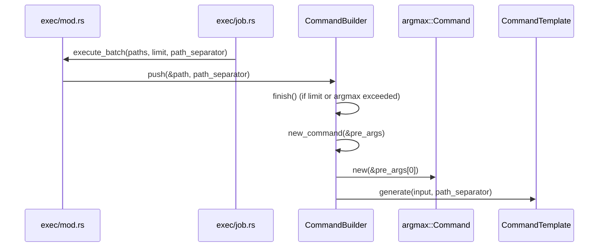
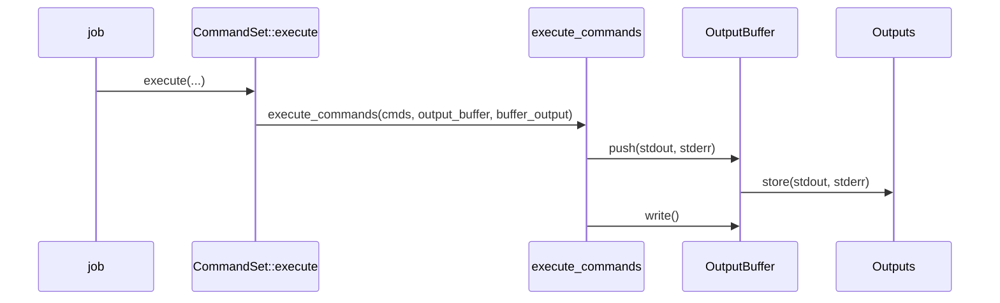

# Command Construction

<details>
<summary>Relevant source files</summary>

The following files were used as context for generating this wiki page:

- [src/main.rs](https://github.com/sharkdp/fd/blob/main/src/main.rs)
- [src/cli.rs](https://github.com/sharkdp/fd/blob/main/src/cli.rs)
- [src/walk.rs](https://github.com/sharkdp/fd/blob/main/src/walk.rs)
- [README.md](https://github.com/sharkdp/fd/blob/main/README.md)
- [src/exec/mod.rs](https://github.com/sharkdp/fd/blob/main/src/exec/mod.rs)
- [src/fmt/mod.rs](https://github.com/sharkdp/fd/blob/main/src/fmt/mod.rs)
- [src/exec/job.rs](https://github.com/sharkdp/fd/blob/main/src/exec/job.rs)
- [src/fmt/input.rs](https://github.com/sharkdp/fd/blob/main/src/fmt/input.rs)
- [src/exec/command.rs](https://github.com/sharkdp/fd/blob/main/src/exec/command.rs)
- [src/output.rs](https://github.com/sharkdp/fd/blob/main/src/output.rs)
- [scripts/create-deb.sh](https://github.com/sharkdp/fd/blob/main/scripts/create-deb.sh)
- [src/hyperlink.rs](https://github.com/sharkdp/fd/blob/main/src/hyperlink.rs)
- [src/dir_entry.rs](https://github.com/sharkdp/fd/blob/main/src/dir_entry.rs)
- [src/filter/owner.rs](https://github.com/sharkdp/fd/blob/main/src/filter/owner.rs)
- [src/filesystem.rs](https://github.com/sharkdp/fd/blob/main/src/filesystem.rs)
- [src/sanitize.rs](https://github.com/sharkdp/fd/blob/main/src/sanitize.rs)
- [doc/screencast.sh](https://github.com/sharkdp/fd/blob/main/doc/screencast.sh)
- [scripts/version-bump.sh](https://github.com/sharkdp/fd/blob/main/scripts/version-bump.sh)
</details>

## Overview

Command construction in `fd` powers the flexible execution of external processes against discovered filesystem entries via the `-x`/`--exec` and `-X`/`--exec-batch` command-line flags. This subsystem bridges search iteration and external automation by parsing user-defined command templates, interpolating path tokens into argument strings, managing batching constraints, and spawning child processes while handling their stdout and stderr streams.

Sources: [src/cli.rs:857-952](https://github.com/sharkdp/fd/blob/main/src/cli.rs#L857-L952), [src/exec/mod.rs:29-121](https://github.com/sharkdp/fd/blob/main/src/exec/mod.rs#L29-L121)

## CLI Command Extraction and Configuration

### Overview

Command configuration begins at the entry point of execution when raw command line arguments are parsed via the `Opts` struct derivative, defined with the `clap` parser framework. The application initializes by invoking `Opts::parse()` inside the `run()` function, collecting flags, positional search patterns, and filter criteria into a strongly typed options structure.

Sources: [src/main.rs:75-76](https://github.com/sharkdp/fd/blob/main/src/main.rs#L75-L76), [src/cli.rs:21-32](https://github.com/sharkdp/fd/blob/main/src/cli.rs#L21-L32)

```mermaid
graph TD
    A[Raw CLI Arguments] -->|Opts::parse()| B(Opts Struct)
    B --> C{extract_command}
    C -->|--exec / -x| D[CommandSet::new]
    C -->|--exec-batch / -X| E[CommandSet::new_batch]
    C -->|--list-details / -l| F[determine_ls_command]
    C -->|None| G[Standard Search Output]
    D --> H[Config Construction]
    E --> H
    F --> H
    G --> H
    H --> I[walk::scan]
```

Sources: [src/main.rs:76-112](https://github.com/sharkdp/fd/blob/main/src/main.rs#L76-L112), [src/cli.rs:861-874](https://github.com/sharkdp/fd/blob/main/src/cli.rs#L861-L874)

During configuration setup, `construct_config` coordinates option extraction and transforms raw user parameters into runtime validation rules and flags stored within the `Config` struct. The command-extraction pipeline extracts external process definitions via `extract_command`, inspecting whether the user supplied parallel execution arguments or long listing flags.

Sources: [src/main.rs:248-300](https://github.com/sharkdp/fd/blob/main/src/main.rs#L248-L300), [src/main.rs:395-410](https://github.com/sharkdp/fd/blob/main/src/main.rs#L395-L410)

### Execution Call-Chain Walkthrough

The transition from raw command line options to a validated configuration holding a ready-to-execute command proceeds through a clear sequence of helper functions:

1. `run()` invokes `Opts::parse()` to extract raw command-line arguments into the `Opts` structure.
2. `construct_config()` receives the parsed `Opts` and delegates subprocess specifications to `extract_command(&mut opts, colored_output)`.
3. `extract_command()` checks `opts.exec.command` via `opts.exec.command.take()`. If empty, it inspects `opts.list_details`; when active, it invokes `determine_ls_command(colored_output)` to construct an internal listing command set.
4. `determine_ls_command()` evaluates operating system compile-time flags (`cfg!(unix)` or `cfg!(windows)`) and executable availability (such as probing for GNU `ls` or `gls`) to assemble the platform-specific argument vector.
5. The resulting command set is wrapped in an `Arc` and stored in `Config::command`, which is subsequently passed to `walk::scan()` alongside search paths and compiled regex patterns.

Sources: [src/main.rs:75-112](https://github.com/sharkdp/fd/blob/main/src/main.rs#L75-L112), [src/main.rs:298-300](https://github.com/sharkdp/fd/blob/main/src/main.rs#L298-L300), [src/main.rs:395-410](https://github.com/sharkdp/fd/blob/main/src/main.rs#L395-L410), [src/main.rs:412-494](https://github.com/sharkdp/fd/blob/main/src/main.rs#L412-L494)

### Configuration Option Mapping

The `Opts` argument parser maps command line flags to specific configuration options and default fallback behaviors during setup.

| CLI Option / Flag | `Opts` Field / Method | Default Value | Purpose |
| :--- | :--- | :--- | :--- |
| `--exec` / `-x` | `exec.command` | `None` | Execute a command for each search result in parallel. |
| `--exec-batch` / `-X` | `exec.command` | `None` | Execute a command once with all search results as arguments. |
| `--list-details` / `-l` | `list_details` | `false` | Use detailed listing format via an alias for `--exec-batch ls -l`. |
| `--batch-size` | `batch_size` | `0` (unlimited) | Maximum number of arguments to pass to the command given with `-X`. |
| `--color` / `-c` | `color` | `ColorWhen::Auto` | Declare when to use color for pattern match output. |
| `--hyperlink` / `--hyper` | `hyperlink` | `HyperlinkWhen::Never` | Add terminal hyperlink to `file://` URL for output paths. |

Sources: [src/cli.rs:231-238](https://github.com/sharkdp/fd/blob/main/src/cli.rs#L231-L238), [src/cli.rs:498-508](https://github.com/sharkdp/fd/blob/main/src/cli.rs#L498-L508), [src/cli.rs:521-530](https://github.com/sharkdp/fd/blob/main/src/cli.rs#L521-L530), [src/cli.rs:537-548](https://github.com/sharkdp/fd/blob/main/src/cli.rs#L537-L548), [src/cli.rs:883-952](https://github.com/sharkdp/fd/blob/main/src/cli.rs#L883-L952)

> [!WARNING]
> The `--exec` (`-x`) and `--exec-batch` (`-X`) options mutually conflict with each other, with `--list-details` (`-l`), and with result-limiting flags such as `--max-results` and `--quiet`. Attempting to combine these flags triggers a command-line parsing error via `clap`.

Sources: [src/cli.rs:29-30](https://github.com/sharkdp/fd/blob/main/src/cli.rs#L29-L30), [src/cli.rs:270-272](https://github.com/sharkdp/fd/blob/main/src/cli.rs#L270-L272), [src/cli.rs:930-931](https://github.com/sharkdp/fd/blob/main/src/cli.rs#L930-L931)

### Design Trade-Offs in Command Extraction

| Design Choice | Benefit | Cost |
| :--- | :--- | :--- |
| Hand-rolled `FromArgMatches` implementation for `Exec` | Bypasses limitations in derivative parsing macros for grouped multi-value command termination. | Requires custom boilerplate logic to translate raw argument occurrences into `CommandSet` instances. |
| Platform-specific branch evaluation in `determine_ls_command` | Automatically detects GNU versus BSD `ls` variants across Linux, macOS, and Windows to support color output and formatting flags. | Adds considerable conditional compilation complexity and external binary probing overhead at startup. |
| Fallback to implicit `{}` placeholder insertion | Simplifies user command invocation (e.g., `fd -e zip -x unzip` works without explicit path arguments). | Implicit behavior can occasionally obscure exact argument positioning for complex multi-argument command templates. |

Sources: [src/cli.rs:855-880](https://github.com/sharkdp/fd/blob/main/src/cli.rs#L855-L880), [src/cli.rs:893-908](https://github.com/sharkdp/fd/blob/main/src/cli.rs#L893-L908), [src/main.rs:430-494](https://github.com/sharkdp/fd/blob/main/src/main.rs#L430-L494)

## Command Template Structures and Parsing

### Overview

Command templates encapsulate executable argument vectors containing literal strings and path substitution tokens. The core data structures managing templates are `CommandSet`, `CommandTemplate`, and `CommandBuilder`. `CommandSet` holds an `ExecutionMode` (`ExecutionMode::OneByOne` or `ExecutionMode::Batch`) alongside a vector of `CommandTemplate` instances. Each `CommandTemplate` stores a vector of `FormatTemplate` items representing individual arguments parsed from user inputs.

Sources: [src/exec/mod.rs:21-33](https://github.com/sharkdp/fd/blob/main/src/exec/mod.rs#L21-L33), [src/exec/mod.rs:214-217](https://github.com/sharkdp/fd/blob/main/src/exec/mod.rs#L214-L217)

### Template Parsing and Validation

Templates are created and validated through `CommandSet::new`, `CommandSet::new_batch`, and `CommandTemplate::new`. During parsing, each argument string is analyzed via `FormatTemplate::parse`. If a template receives an empty argument list, initialization fails. For batch commands (`ExecutionMode::Batch`), validation enforces that the first argument is a fixed executable rather than a placeholder, and restricts batch commands to a maximum of one token placeholder across the template. If no placeholder token is supplied in single execution mode (`--exec`), a default `Token::Placeholder` is automatically appended at the end of the argument vector.

Sources: [src/exec/mod.rs:36-70](https://github.com/sharkdp/fd/blob/main/src/exec/mod.rs#L36-L70), [src/exec/mod.rs:220-256](https://github.com/sharkdp/fd/blob/main/src/exec/mod.rs#L220-L256)

> [!WARNING]
> For `--exec-batch` (`-X`), supplying a placeholder token as the first argument (`argv[0]`) is explicitly rejected with an error stating that the first argument of `--exec-batch` must be a fixed executable. Additionally, batch commands allow at most one placeholder token total.

Sources: [src/exec/mod.rs:63-65](https://github.com/sharkdp/fd/blob/main/src/exec/mod.rs#L63-L65), [src/exec/mod.rs:246-248](https://github.com/sharkdp/fd/blob/main/src/exec/mod.rs#L246-L248)

### Command Template Data Structures

| Structure / Enum | Field / Variant | Type | Purpose |
| :--- | :--- | :--- | :--- |
| `ExecutionMode` | `OneByOne` | Enum variant | Command is executed individually for each search result. |
| `ExecutionMode` | `Batch` | Enum variant | Command is run in batches with multiple search results. |
| `CommandSet` | `mode` | `ExecutionMode` | Active execution mode for the command set. |
| `CommandSet` | `commands` | `Vec<CommandTemplate>` | List of command templates to be executed. |
| `CommandTemplate` | `args` | `Vec<FormatTemplate>` | Ordered vector of parsed argument templates. |
| `CommandBuilder` | `pre_args` | `Vec<OsString>` | Arguments preceding the path substitution placeholder. |
| `CommandBuilder` | `path_arg` | `FormatTemplate` | The format template containing the path token. |
| `CommandBuilder` | `post_args` | `Vec<OsString>` | Arguments following the path substitution placeholder. |

Sources: [src/exec/mod.rs:21-33](https://github.com/sharkdp/fd/blob/main/src/exec/mod.rs#L21-L33), [src/exec/mod.rs:124-133](https://github.com/sharkdp/fd/blob/main/src/exec/mod.rs#L124-L133), [src/exec/mod.rs:214-217](https://github.com/sharkdp/fd/blob/main/src/exec/mod.rs#L214-L217)

### Command Set Construction Walkthrough

The creation and validation flow for command sets proceeds through specific function calls:

1. `CommandSet::new()` or `CommandSet::new_batch()` iterates over input argument collections.
2. For each argument collection, `CommandTemplate::new(args, mode)` is invoked.
3. `FormatTemplate::parse(arg)` splits and identifies literal text segments and placeholder tokens using an `AhoCorasick` automaton.
4. `CommandTemplate::new()` checks that `args` is non-empty and validates that batch mode does not use a placeholder as its executable (`args[0]`). If no placeholders exist in non-batch mode, `Token::Placeholder` is appended.
5. In batch mode (`new_batch`), `CommandSet` verifies `cmd.number_of_tokens() > 1` and bails out if more than one placeholder is present.

Sources: [src/exec/mod.rs:36-70](https://github.com/sharkdp/fd/blob/main/src/exec/mod.rs#L36-L70), [src/exec/mod.rs:220-256](https://github.com/sharkdp/fd/blob/main/src/exec/mod.rs#L220-L256), [src/fmt/mod.rs:58-107](https://github.com/sharkdp/fd/blob/main/src/fmt/mod.rs#L58-L107)

## Placeholder Token Path Interpolation

### Overview

Path interpolation processes format tokens against search results to generate concrete path segments. The `FormatTemplate::generate` method evaluates individual tokens—such as basenames, parent directories, and extension-stripped paths—and replaces path separators when custom settings are supplied.

Sources: [src/fmt/mod.rs:109-141](https://github.com/sharkdp/fd/blob/main/src/fmt/mod.rs#L109-L141)

### Path Component Extraction Functions

Path component manipulation relies on helper functions defined in `src/fmt/input.rs` and `src/filesystem.rs` to extract specific segments from an input `Path`.

| Function | Input Parameter | Return Type | Purpose | Sources |
| :--- | :--- | :--- | :--- | :--- |
| `basename` | `path: &Path` | `&OsStr` | Removes the parent component and returns the file name or the fallback path. | [src/fmt/input.rs:7-9](https://github.com/sharkdp/fd/blob/main/src/fmt/input.rs#L7-L9) |
| `remove_extension` | `path: &Path` | `OsString` | Strips the file extension from the path while preserving its directory prefix and stripping current directory notation. | [src/fmt/input.rs:11-19](https://github.com/sharkdp/fd/blob/main/src/fmt/input.rs#L11-L19) |
| `dirname` | `path: &Path` | `OsString` | Removes the file name component, returning `.` if empty or the parent path. | [src/fmt/input.rs:21-32](https://github.com/sharkdp/fd/blob/main/src/fmt/input.rs#L21-L32) |
| `strip_current_dir` | `path: &Path` | `&Path` | Removes the leading `./` prefix from a path if present. | [src/filesystem.rs:118-121](https://github.com/sharkdp/fd/blob/main/src/filesystem.rs#L118-L121) |

Sources: [src/fmt/input.rs:7-32](https://github.com/sharkdp/fd/blob/main/src/fmt/input.rs#L7-L32), [src/filesystem.rs:118-121](https://github.com/sharkdp/fd/blob/main/src/filesystem.rs#L118-L121)

### Path Interpolation Call-Chain

When generating an interpolated string, `FormatTemplate::generate` matches each token and delegates to specific extraction and substitution routines:

1. `FormatTemplate::generate(path, path_separator)` iterates through each `Token` in `Self::Tokens`.
2. For each token variant, it obtains the raw path slice:
   - `Token::Basename` calls `basename(path)`.
   - `Token::BasenameNoExt` calls `remove_extension(basename(path).as_ref())`.
   - `Token::NoExt` calls `remove_extension(path)`.
   - `Token::Parent` calls `dirname(path)`.
   - `Token::Placeholder` uses `path.as_ref()`.
3. Each extracted path slice is passed to `FormatTemplate::replace_separator(slice, path_separator)`.
4. `replace_separator` inspects whether `path_separator` is `Some`. If `None`, it returns a borrowed `Cow::Borrowed(path)`. If `Some`, it iterates over path components via `Path::new(path).components()` to reconstruct the path using the custom separator.

Sources: [src/fmt/mod.rs:112-196](https://github.com/sharkdp/fd/blob/main/src/fmt/mod.rs#L112-L196), [src/fmt/input.rs:7-32](https://github.com/sharkdp/fd/blob/main/src/fmt/input.rs#L7-L32)

> [!NOTE]
> Windows absolute paths containing UNC prefixes (`Prefix::UNC(server, share)`) are specially handled during separator replacement by explicitly injecting the custom separator around the server and share identifiers.

Sources: [src/fmt/mod.rs:166-175](https://github.com/sharkdp/fd/blob/main/src/fmt/mod.rs#L166-L175)

### Design Trade-Offs in Path Substitution

| Design Choice | Benefit | Cost |
| :--- | :--- | :--- |
| `Cow<'a, OsStr>` return type | Avoids allocation overhead when no custom path separator replacement is requested. | Requires handling lifetime constraints and matching on borrowed versus owned variants. |
| Ignoring Windows verbatim prefixes (`\\?\`) | Keeps separator replacement logic simpler and avoids edge cases with unnormalized device paths. | Advanced Windows users working with verbatim device namespaces must handle path filtering externally. |
| `OnceLock` with `AhoCorasick` for parsing | Caches the compiled automaton across template parsing calls for high throughput. | Introduces global synchronization overhead via `OnceLock`. |

Sources: [src/fmt/mod.rs:47-52](https://github.com/sharkdp/fd/blob/main/src/fmt/mod.rs#L47-L52), [src/fmt/mod.rs:147-165](https://github.com/sharkdp/fd/blob/main/src/fmt/mod.rs#L147-L165)

## Batch Command Generation Flow

### Overview

Batch command generation collects discovered search path items and aggregates them into command line invocations managed by `CommandSet::execute_batch` and `CommandBuilder`. This execution mechanism optimizes command execution by packing multiple path arguments into fewer subprocess invocations up to argument length limits and batch size constraints.

Sources: [src/exec/mod.rs:90-121](https://github.com/sharkdp/fd/blob/main/src/exec/mod.rs#L90-L121)

### Batch Execution Call-Chain

When batch mode is enabled, the path iteration feeds into the `CommandBuilder` pipeline. The execution trace follows this specific sequence of operations:

1. `execute_batch` iterates over the supplied paths, invoking `CommandBuilder::push` for each incoming path entry.
2. `push` checks if `self.count` has reached the `self.limit` or if `args_would_fit` indicates the command line buffer is full, calling `finish` when flushing is required.
3. `finish` verifies if any arguments have been collected (`self.count > 0`), runs the command via `self.cmd.status()`, checks for failure, and prepares the next instance by calling `new_command`.
4. `new_command` creates a fresh `Command` instance, standardizing standard input, output, and error streams to `Stdio::inherit()`.
5. `CommandTemplate::new` validates that batch command templates do not use placeholders as the executable name and contain at most one placeholder token.
6. `generate` constructs individual argument tokens using `path_separator` settings for substitution.

Sources: [src/exec/mod.rs:61-69](https://github.com/sharkdp/fd/blob/main/src/exec/mod.rs#L61-L69), [src/exec/mod.rs:90-117](https://github.com/sharkdp/fd/blob/main/src/exec/mod.rs#L90-L117), [src/exec/mod.rs:164-203](https://github.com/sharkdp/fd/blob/main/src/exec/mod.rs#L164-L203), [src/exec/mod.rs:266-272](https://github.com/sharkdp/fd/blob/main/src/exec/mod.rs#L266-L272)



Sources: [src/exec/mod.rs:90-121](https://github.com/sharkdp/fd/blob/main/src/exec/mod.rs#L90-L121), [src/exec/job.rs:46-64](https://github.com/sharkdp/fd/blob/main/src/exec/job.rs#L46-L64)

> [!WARNING]
> `CommandTemplate::new_batch` enforces a strict constraint that batch command templates can contain at most one placeholder token (`cmd.number_of_tokens() > 1`) and cannot use a placeholder as the executable position (`args[0].has_tokens()`). Violating this rule immediately returns an error.

Sources: [src/exec/mod.rs:61-69](https://github.com/sharkdp/fd/blob/main/src/exec/mod.rs#L61-L69), [src/exec/mod.rs:246-248](https://github.com/sharkdp/fd/blob/main/src/exec/mod.rs#L246-L248)

### CommandBuilder Structure and State

The `CommandBuilder` struct tracks argument segments, execution limits, and accumulated child process state during batch generation.

| Field | Type | Purpose |
| :--- | :--- | :--- |
| `pre_args` | `Vec<OsString>` | Fixed arguments appearing before the placeholder token. |
| `path_arg` | `FormatTemplate` | The formatting template corresponding to the path placeholder token. |
| `post_args` | `Vec<OsString>` | Fixed arguments appearing after the path placeholder token. |
| `cmd` | `argmax::Command` | The underlying command runner tracking argument length constraints. |
| `count` | `usize` | Number of paths accumulated in the current batch instance. |
| `limit` | `usize` | Maximum number of path arguments allowed per batch invocation. |
| `exit_code` | `ExitCode` | Aggregated exit code status for batch execution jobs. |

Sources: [src/exec/mod.rs:124-133](https://github.com/sharkdp/fd/blob/main/src/exec/mod.rs#L124-L133)

> [!TIP]
> `CommandBuilder::push` evaluates `args_would_fit` against `self.post_args` before pushing new path arguments, automatically flushing the active command buffer if operating system argument length limits (`argmax`) would be exceeded.

Sources: [src/exec/mod.rs:179-184](https://github.com/sharkdp/fd/blob/main/src/exec/mod.rs#L179-L184)

## Subprocess Execution and Output Handling

### Overview

Executing generated command templates in one-by-one mode involves spawning child subprocesses, managing thread-safe stream buffers, and capturing standard output and standard error streams. The `job` function orchestrates file search result iteration, dispatching each entry to `CommandSet::execute`, which delegates processing to `execute_commands` and `OutputBuffer` within `src/exec/command.rs`.

Sources: [src/exec/job.rs:11-44](https://github.com/sharkdp/fd/blob/main/src/exec/job.rs#L11-L44), [src/exec/mod.rs:76-88](https://github.com/sharkdp/fd/blob/main/src/exec/mod.rs#L76-L88), [src/exec/command.rs:60-99](https://github.com/sharkdp/fd/blob/main/src/exec/command.rs#L60-L99)

### Execution Walkthroughs and Sequence

#### Overview

The execution subsystem follows two primary call paths depending on whether output buffering is enabled.

Sources: [src/exec/job.rs:11-44](https://github.com/sharkdp/fd/blob/main/src/exec/job.rs#L11-L44), [src/exec/mod.rs:76-88](https://github.com/sharkdp/fd/blob/main/src/exec/mod.rs#L76-L88)

#### Call-Chain 1: Buffering Output (`job` → `execute` → `execute_commands` → `push` → `Outputs`)

1. `job` iterates over search worker results, obtaining stripped paths and invoking `CommandSet::execute`.
2. `execute` generates individual command instances and calls `execute_commands` alongside an initialized `OutputBuffer`.
3. `execute_commands` evaluates each command result, spawning the child process and capturing its output streams into an `Output` struct when `enable_output_buffering` is active.
4. `push` appends captured `stdout` and `stderr` byte vectors into the internal `outputs` vector of `OutputBuffer`.
5. `Outputs` encapsulates the raw byte collections for standard output and standard error per executed command.

Sources: [src/exec/job.rs:11-44](https://github.com/sharkdp/fd/blob/main/src/exec/job.rs#L11-L44), [src/exec/mod.rs:76-88](https://github.com/sharkdp/fd/blob/main/src/exec/mod.rs#L76-L88), [src/exec/command.rs:9-28](https://github.com/sharkdp/fd/blob/main/src/exec/command.rs#L9-28), [src/exec/command.rs:60-85](https://github.com/sharkdp/fd/blob/main/src/exec/command.rs#L60-L85)

#### Call-Chain 2: Flushing Output (`job` → `execute` → `execute_commands` → `write`)

1. `job` processes each entry and calls `CommandSet::execute`.
2. `execute` passes commands and an `OutputBuffer` to `execute_commands`.
3. `execute_commands` runs the command stream and invokes `output_buffer.write()` upon completion or error handling.
4. `write` locks standard output and standard error streams, flushes buffered byte vectors sequentially, and optionally appends a null separator if `null_separator` is configured.

Sources: [src/exec/job.rs:11-44](https://github.com/sharkdp/fd/blob/main/src/exec/job.rs#L11-L44), [src/exec/mod.rs:76-88](https://github.com/sharkdp/fd/blob/main/src/exec/mod.rs#L76-L88), [src/exec/command.rs:30-57](https://github.com/sharkdp/fd/blob/main/src/exec/command.rs#L30-57), [src/exec/command.rs:60-99](https://github.com/sharkdp/fd/blob/main/src/exec/command.rs#L60-L99)



Sources: [src/exec/job.rs:11-44](https://github.com/sharkdp/fd/blob/main/src/exec/job.rs#L11-L44), [src/exec/mod.rs:76-88](https://github.com/sharkdp/fd/blob/main/src/exec/mod.rs#L76-L88), [src/exec/command.rs:9-57](https://github.com/sharkdp/fd/blob/main/src/exec/command.rs#L9-57), [src/exec/command.rs:60-99](https://github.com/sharkdp/fd/blob/main/src/exec/command.rs#L60-L99)

> [!NOTE]
> When `config.threads > 1`, output buffering is enabled (`enable_output_buffering = true`), causing `execute_commands` to call `cmd.output()` rather than `cmd.spawn().and_then(|c| c.wait_with_output())`. This prevents interlaced or garbled terminal output across parallel threads by holding stdout/stderr locks during `OutputBuffer::write`.

Sources: [src/exec/job.rs:11-17](https://github.com/sharkdp/fd/blob/main/src/exec/job.rs#L11-L17), [src/exec/command.rs:39-50](https://github.com/sharkdp/fd/blob/main/src/exec/command.rs#L39-50), [src/exec/command.rs:71-78](https://github.com/sharkdp/fd/blob/main/src/exec/command.rs#L71-L78), [README.md:212-214](https://github.com/sharkdp/fd/blob/main/README.md#L212-L214)

### Error Handling and Exit Status

Command execution failures, missing binaries, and non-zero child process exit statuses are managed by `handle_cmd_error` and `execute_commands`.

| Helper Function / Struct | Field / Parameter | Return Type | Meaning / Purpose | Sources |
| :--- | :--- | :--- | :--- | :--- |
| `Outputs` | `stdout: Vec<u8>` | `Vec<u8>` | Buffered standard output byte stream for a single command invocation. | [src/exec/command.rs:9-10](https://github.com/sharkdp/fd/blob/main/src/exec/command.rs#L9-L10) |
| `Outputs` | `stderr: Vec<u8>` | `Vec<u8>` | Buffered standard error byte stream for a single command invocation. | [src/exec/command.rs:10-11](https://github.com/sharkdp/fd/blob/main/src/exec/command.rs#L10-L11) |
| `OutputBuffer` | `null_separator: bool` | `bool` | Determines whether to append a `\0` delimiter after flushing outputs. | [src/exec/command.rs:13-16](https://github.com/sharkdp/fd/blob/main/src/exec/command.rs#L13-L16) |
| `handle_cmd_error` | `err: io::Error` | `ExitCode` | Inspects error kinds; prints "Command not found" if `ErrorKind::NotFound` matches the program name, or general execution problem errors otherwise. | [src/exec/command.rs:101-115](https://github.com/sharkdp/fd/blob/main/src/exec/command.rs#L101-L115) |

Sources: [src/exec/command.rs:9-16](https://github.com/sharkdp/fd/blob/main/src/exec/command.rs#L9-L16), [src/exec/command.rs:101-115](https://github.com/sharkdp/fd/blob/main/src/exec/command.rs#L101-L115)

> [!WARNING]
> If a spawned command exits with a non-zero exit code (`output.status.code() != Some(0)`), `execute_commands` immediately flushes any accumulated output buffer via `output_buffer.write()` and returns `ExitCode::GeneralError`.

Sources: [src/exec/command.rs:86-89](https://github.com/sharkdp/fd/blob/main/src/exec/command.rs#L86-L89)

## Related

- [[Execution Job Dispatch]]
- [[Path Formatting]]

