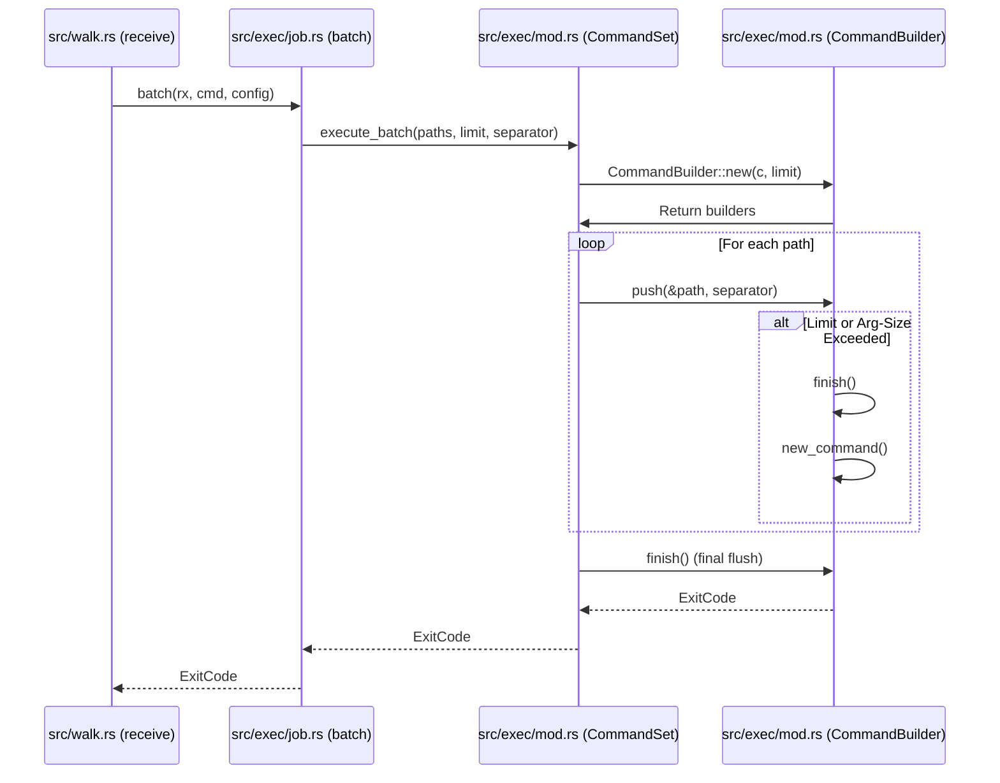
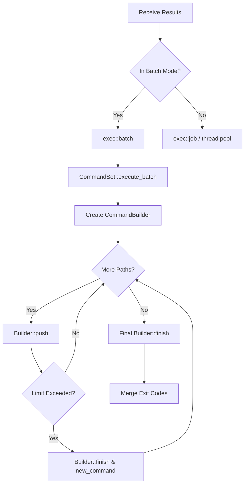

# Command Execution Flow

<details>
<summary>Relevant source files</summary>

The following files were used as context for generating this wiki page:

- [src/walk.rs](https://github.com/sharkdp/fd/blob/main/src/walk.rs)
- [src/exec/job.rs](https://github.com/sharkdp/fd/blob/main/src/exec/job.rs)
- [src/exec/mod.rs](https://github.com/sharkdp/fd/blob/main/src/exec/mod.rs)
</details>

## Overview

The execution flow from **Receive** to **CommandSet** manages how files discovered during a parallel directory walk (`fd`) are channeled into external command execution (via `--exec` or `--exec-batch`). When `fd` finds matching paths, they are sent across a crossbeam channel, picked up by the receiver routine, and dispatched into command templates managed by `CommandSet`.

> [!NOTE]
> This pipeline handles both individual execution (`--exec` running commands one-by-one or via background worker threads) and batch execution (`--exec-batch` grouping multiple paths into command-line argument limits using `argmax`).

---

### Step 1: receive

```rust
fn receive(&self, rx: Receiver<Batch>) -> ExitCode
```

The receiver function inspects the configuration to determine whether `--exec` was supplied. If a command is present, it branches into either batch mode (`exec::batch`) or individual thread-pool mode (`exec::job`). If no execution flag is provided, it falls back to standard output streaming via `ReceiverBuffer`.

Sources: [src/walk.rs:408-440](https://github.com/sharkdp/fd/blob/main/src/walk.rs#L408-L440)

---

### Step 2: batch

```rust
pub fn batch(
    results: impl IntoIterator<Item = WorkerResult>,
    cmd: &CommandSet,
    config: &Config,
) -> ExitCode
```

When operating in batch mode (`--exec-batch`), the `batch` function consumes the flattened `WorkerResult` iterator from the channel, filters out errors (optionally printing filesystem warnings), converts valid entries into stripped relative paths, and passes the resulting path iterator to `CommandSet::execute_batch`.

Sources: [src/exec/job.rs:46-64](https://github.com/sharkdp/fd/blob/main/src/exec/job.rs#L46-L64)

---

### Step 3: execute_batch

```rust
pub fn execute_batch<I>(&self, paths: I, limit: usize, path_separator: Option<&str>) -> ExitCode
where
    I: Iterator<Item = PathBuf>,
```

`execute_batch` iterates over the commands defined within the `CommandSet` and initializes a `CommandBuilder` for each template, applying the specified path limit and formatting options.

Sources: [src/exec/mod.rs:90-120](https://github.com/sharkdp/fd/blob/main/src/exec/mod.rs#L90-L120)

---

### Step 4: push

```rust
fn push(&mut self, path: &Path, separator: Option<&str>) -> io::Result<()>
```

As paths flow from the iterator, `push` appends each path argument to the active `Command` builder. If adding the path exceeds the argument count limit (`self.limit`) or violates argument length constraints (`args_would_fit`), it automatically flushes the current command execution via `finish()` and starts a new command batch.

Sources: [src/exec/mod.rs:173-189](https://github.com/sharkdp/fd/blob/main/src/exec/mod.rs#L173-L189)

---

### Step 5: finish

```rust
fn finish(&mut self) -> io::Result<()>
```

The `finish` method checks if any arguments have been accumulated. If so, it appends any post-arguments, executes the command process, checks its exit status (marking `ExitCode::GeneralError` on failure), and re-initializes the internal command template for subsequent batches.

Sources: [src/exec/mod.rs:191-203](https://github.com/sharkdp/fd/blob/main/src/exec/mod.rs#L191-L203)

---

### Step 6: new_command

```rust
fn new_command(pre_args: &[OsString]) -> io::Result<Command>
```

`new_command` constructs an underlying `argmax::Command` instance from pre-configured executable and prefix arguments, inheriting standard input, output, and error streams from the parent process.

Sources: [src/exec/mod.rs:164-171](https://github.com/sharkdp/fd/blob/main/src/exec/mod.rs#L164-L171)

---

### Step 7: new

```rust
pub fn new_batch<I, T, S>(input: I) -> Result<CommandSet>
```

The `CommandSet` constructor parses and validates command-line argument tokens, ensuring that batch commands contain at most one placeholder token and that placeholders are not used for the executable itself.

Sources: [src/exec/mod.rs:51-70](https://github.com/sharkdp/fd/blob/main/src/exec/mod.rs#L51-L70)

---

### Step 8: CommandSet

```rust
pub struct CommandSet
```

The core data structure holding the execution mode (`ExecutionMode::OneByOne` or `ExecutionMode::Batch`) and a collection of parsed `CommandTemplate` instances ready to process incoming search results.

Sources: [src/exec/mod.rs:29-33](https://github.com/sharkdp/fd/blob/main/src/exec/mod.rs#L29-L33)

---

## Execution Sequence



Sources: [src/walk.rs:408-440](https://github.com/sharkdp/fd/blob/main/src/walk.rs#L408-L440), [src/exec/job.rs:46-64](https://github.com/sharkdp/fd/blob/main/src/exec/job.rs#L46-L64), [src/exec/mod.rs:90-203](https://github.com/sharkdp/fd/blob/main/src/exec/mod.rs#L90-L203)

---

## Flowchart



Sources: [src/walk.rs:408-440](https://github.com/sharkdp/fd/blob/main/src/walk.rs#L408-L440), [src/exec/job.rs:11-64](https://github.com/sharkdp/fd/blob/main/src/exec/job.rs#L11-L64), [src/exec/mod.rs:76-120](https://github.com/sharkdp/fd/blob/main/src/exec/mod.rs#L76-L120)

---

## Key Observations

- **Cross-Module Boundaries:** The flow bridges traversal (`src/walk.rs`), job control (`src/exec/job.rs`), and command-line template expansion (`src/exec/mod.rs`).
- **Error Propagation:** Filesystem errors encountered during traversal or command execution are handled gracefully via `handle_cmd_error` and `merge_exitcodes`, ensuring that minor command failures do not prematurely crash the entire search unless specified.
- **Performance & Batching:** The `argmax` crate integration inside `CommandBuilder` guarantees that batch execution packs the maximum number of file paths into a single OS command invocation without exceeding system argument length limits.
