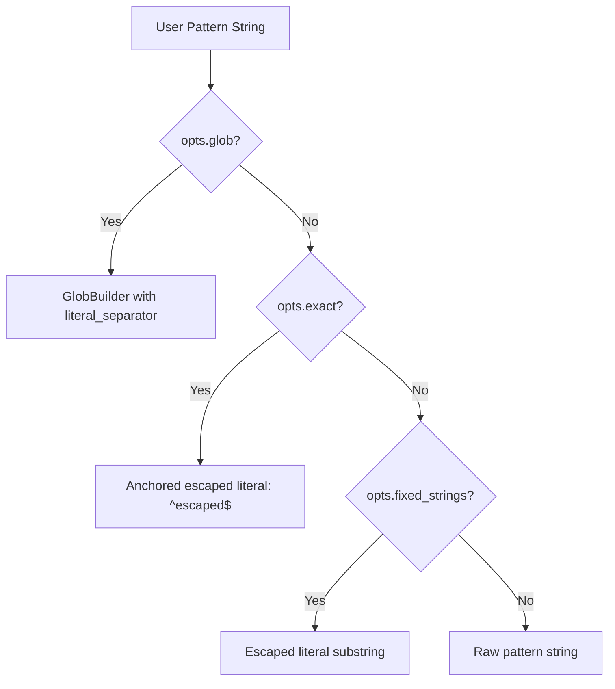
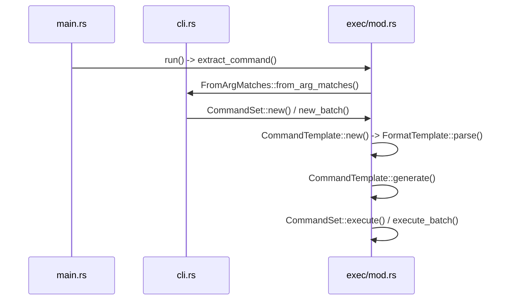
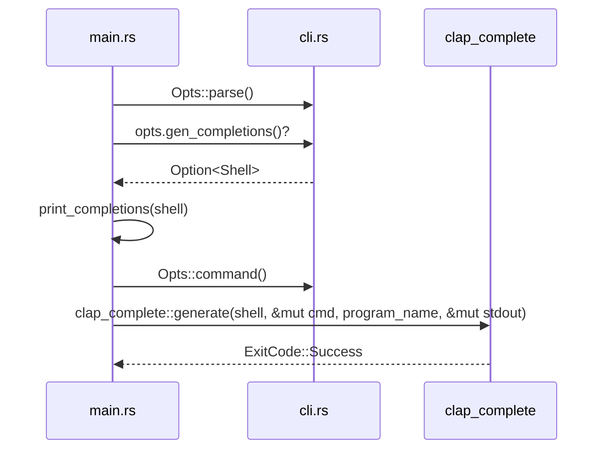

# Command Line Interface

<details>
<summary>Relevant source files</summary>

The following files were used as context for generating this wiki page:

- [src/main.rs](https://github.com/sharkdp/fd/blob/main/src/main.rs)
- [src/cli.rs](https://github.com/sharkdp/fd/blob/main/src/cli.rs)
- [src/walk.rs](https://github.com/sharkdp/fd/blob/main/src/walk.rs)
- [README.md](https://github.com/sharkdp/fd/blob/main/README.md)
- [src/exec/mod.rs](https://github.com/sharkdp/fd/blob/main/src/exec/mod.rs)
- [src/fmt/mod.rs](https://github.com/sharkdp/fd/blob/main/src/fmt/mod.rs)
- [src/exec/job.rs](https://github.com/sharkdp/fd/blob/main/src/exec/job.rs)
- [src/filter/size.rs](https://github.com/sharkdp/fd/blob/main/src/filter/size.rs)
- [Cargo.toml](https://github.com/sharkdp/fd/blob/main/Cargo.toml)
- [src/exec/command.rs](https://github.com/sharkdp/fd/blob/main/src/exec/command.rs)
- [src/fmt/input.rs](https://github.com/sharkdp/fd/blob/main/src/fmt/input.rs)
- [src/filter/owner.rs](https://github.com/sharkdp/fd/blob/main/src/filter/owner.rs)
- [src/filter/time.rs](https://github.com/sharkdp/fd/blob/main/src/filter/time.rs)
- [src/output.rs](https://github.com/sharkdp/fd/blob/main/src/output.rs)
- [src/regex_helper.rs](https://github.com/sharkdp/fd/blob/main/src/regex_helper.rs)
- [src/exit_codes.rs](https://github.com/sharkdp/fd/blob/main/src/exit_codes.rs)
- [src/config.rs](https://github.com/sharkdp/fd/blob/main/src/config.rs)
- [src/sanitize.rs](https://github.com/sharkdp/fd/blob/main/src/sanitize.rs)
- [src/filetypes.rs](https://github.com/sharkdp/fd/blob/main/src/filetypes.rs)
</details>

## Overview

### Introduction and System Role

The command-line interface subsystem acts as the entry point and orchestration layer for *fd*, translating raw user inputs, shell flags, and environment configurations into a fully structured runtime environment. Built around robust argument parsing structures, it bridges raw terminal commands with the parallel filesystem traversal engine by validating constraints, mapping search patterns, and assembling configuration states.

Sources: [src/main.rs:75-112](https://github.com/sharkdp/fd/blob/main/src/main.rs#L75-L112)

This module handles the ingestion of complex CLI options—including search paths, glob rules, regex patterns, execution templates, and file filters—while providing robust error management and shell completion generation. By normalizing directory inputs and assembling clean execution schemas, it establishes a reliable foundation for high-performance file discovery.

Sources: [src/cli.rs:21-31](https://github.com/sharkdp/fd/blob/main/src/cli.rs#L21-L31)

## CLI Argument Definition and Schema

### Overview of Argument Structure

The CLI argument definition layer uses the `clap` crate's derive API and manual trait implementations to define the top-level `Opts` struct, supporting flags, options, positional arguments, and flat arguments. Argument parsing configuration specifies `args_override_self = true` and enforces mutual exclusivity rules via `ArgGroup` configurations that prevent conflicting execution semantics.

Sources: [src/cli.rs:21-31](https://github.com/sharkdp/fd/blob/main/src/cli.rs#L21-L31)

### Option Structures and Custom Parsers

The `Opts` struct captures user flags and options, mapping command-line flags directly to typed fields. Complex argument groups like `--exec` and `--exec-batch` implement `clap::FromArgMatches` and `clap::Args` manually to handle occurrences and custom value terminators.

| Flag / Option | Rust Field | Type | Default / Behavior |
| :--- | :--- | :--- | :--- |
| `--hidden`, `-H` | `hidden` | `bool` | `false` (hidden files skipped) |
| `--no-ignore`, `-I` | `no_ignore` | `bool` | `false` (respect ignore files) |
| `--case-sensitive`, `-s` | `case_sensitive` | `bool` | Smart case (case-sensitive if uppercase present) |
| `--ignore-case`, `-i` | `ignore_case` | `bool` | Smart case |
| `--glob`, `-g` | `glob` | `bool` | `false` (regex matching default) |
| `--fixed-strings`, `-F` | `fixed_strings` | `bool` | `false` (substring literal match) |
| `--exact` | `exact` | `bool` | `false` (exact filename match) |
| `--and` | `exprs` | `Option<Vec<String>>` | Additional required search patterns |
| `--absolute-path`, `-a` | `absolute_path` | `bool` | `false` (relative paths default) |
| `--list-details`, `-l` | `list_details` | `bool` | `false` (alias for long listing format) |
| `--follow`, `-L` | `follow` | `bool` | `false` (do not descend into symlinked dirs) |
| `--full-path`, `-p` | `full_path` | `bool` | Match filename only by default |
| `--print0`, `-0` | `null_separator` | `bool` | Separate search results by null byte |
| `-d`, `--max-depth` | `max_depth` | `Option<usize>` | No depth limit |
| `--min-depth` | `min_depth` | `Option<usize>` | No minimum depth limit |
| `--exact-depth` | `exact_depth` | `Option<usize>` | Exact depth matching |
| `--exclude`, `-E` | `exclude` | `Vec<String>` | Glob patterns to exclude |
| `--prune` | `prune` | `bool` | Do not traverse directories matching criteria |
| `--type`, `-t` | `filetype` | `Option<Vec<FileType>>` | Filter by file type |
| `--extension`, `-e` | `extensions` | `Option<Vec<String>>` | Filter by file extension |
| `--size`, `-S` | `size` | `Vec<SizeFilter>` | Size constraints |
| `--changed-within` | `changed_within` | `Option<String>` | Modification time newer than |
| `--changed-before` | `changed_before` | `Option<String>` | Modification time older than |
| `--owner`, `-o` | `owner` | `Option<OwnerFilter>` | Unix owner/group filter |
| `--format` | `format` | `Option<String>` | Print results via template |
| `--batch-size` | `batch_size` | `usize` | `0` (unlimited batch size for `-X`) |
| `--ignore-file` | `ignore_file` | `VecathBuf>` | Custom ignore files |
| `--color`, `-c` | `color` | `ColorWhen` | `ColorWhen::Auto` |
| `--hyperlink` | `hyperlink` | `HyperlinkWhen` | `HyperlinkWhen::Never` |
| `--ignore-contain` | `ignore_contain` | `Vec<String>` | Ignore dirs containing named entry |
| `--threads`, `-j` | `threads` | `Option<NonZeroUsize>` | CPU core count (max 64) |
| `--max-buffer-time` | `max_buffer_time` | `Option<Duration>` | Buffer duration in milliseconds |
| `--max-results` | `max_results` | `Option<usize>` | Limit search results |
| `-1` | `max_one_result` | `bool` | Limit search to single result |
| `--quiet`, `-q` | `quiet` | `bool` | Exit code 0 on match, 1 otherwise |
| `--show-errors` | `show_errors` | `bool` | Display filesystem errors |
| `--base-directory`, `-C` | `base_directory` | `OptionathBuf>` | Change working directory |
| `pattern` | `pattern` | `String` | `""` (optional search pattern) |
| `--path-separator` | `path_separator` | `Option<String>` | Custom path separator |
| `path` | `path` | `VecathBuf>` | Root directories for search |
| `--search-path` | `search_path` | `VecathBuf>` | Alternative search paths |
| `--strip-cwd-prefix` | `strip_cwd_prefix` | `Option<Option<StripCwdWhen>>` | Strip `./` prefix on paths |
| `--one-file-system` | `one_file_system` | `bool` | Stay within starting file system |

Sources: [src/cli.rs:32-693](https://github.com/sharkdp/fd/blob/main/src/cli.rs#L32-L693)

> [!WARNING]
> The `Exec` struct relies on hand-rolled argument parsing via `clap::FromArgMatches` because `clap` does not natively support derive parsing for grouped slice values across `--exec` (`-x`) and `--exec-batch` (`-X`).

Sources: [src/cli.rs:855-880](https://github.com/sharkdp/fd/blob/main/src/cli.rs#L855-L880)

## Search Path and Directory Normalization

### Overview of Search Path Resolution

During CLI processing, `fd` resolves user-supplied search roots from either positional `ath>` arguments or alternative `--search-path` flags, validating that each entry exists and points to a directory before normalization.

Sources: [src/cli.rs:696-721](https://github.com/sharkdp/fd/blob/main/src/cli.rs#L696-L721)

### Execution Walkthrough (`Run -> CommandSet`)

The verified execution trace `Run -> CommandSet` proceeds through the following exact call chain: `run` (in `src/main.rs`) → `search_paths` (in `src/cli.rs`) → `normalize_path` (in `src/cli.rs`) → `new` (in `src/exec/mod.rs`) → `CommandSet` (in `src/exec/mod.rs`).

1. `run` invokes `let search_paths = opts.search_paths()?;` from `src/main.rs:74-111`.
Sources: [src/main.rs:74-111](https://github.com/sharkdp/fd/blob/main/src/main.rs#L74-L111)
2. `search_paths` evaluates whether `self.path` or `self.search_path` is populated, calling `ensure_current_directory_exists` and returning a filtered vector via `src/cli.rs:695-720`.
Sources: [src/cli.rs:695-720](https://github.com/sharkdp/fd/blob/main/src/cli.rs#L695-L720)
3. `normalize_path` processes each path item based on CLI flags (`--absolute-path`) and special tokens like `.` or `-` through `src/cli.rs:722-735`.
Sources: [src/cli.rs:722-735](https://github.com/sharkdp/fd/blob/main/src/cli.rs#L722-L735)
4. `CommandSet::new` or `new_batch` initializes the command set via `src/exec/mod.rs:219-255`.
Sources: [src/exec/mod.rs:219-255](https://github.com/sharkdp/fd/blob/main/src/exec/mod.rs#L219-L255)
5. The `CommandSet` struct is constructed and returned via `src/exec/mod.rs:29-32`.
Sources: [src/exec/mod.rs:29-32](https://github.com/sharkdp/fd/blob/main/src/exec/mod.rs#L29-32)

```mermaid
sequenceDiagram
    participant main as src/main.rs
    participant cli as src/cli.rs
    participant filesystem as src/filesystem
    participant exec as src/exec/mod.rs

    main->>cli: run() calls opts.search_paths()
    cli->>filesystem: inspects path existence via is_existing_directory()
    cli->>cli: normalize_path() applies absolute/relative rules
    cli->>exec: CommandSet::new() constructs execution set
    exec--returns->main: CommandSet instance
```

Sources: [src/main.rs:74-111](https://github.com/sharkdp/fd/blob/main/src/main.rs#L74-L111), [src/cli.rs:695-735](https://github.com/sharkdp/fd/blob/main/src/cli.rs#L695-L735), [src/exec/mod.rs:29-32](https://github.com/sharkdp/fd/blob/main/src/exec/mod.rs#L29-32), [src/exec/mod.rs:219-255](https://github.com/sharkdp/fd/blob/main/src/exec/mod.rs#L219-L255)

### Search Path Resolution Rules

| Condition / Input | Resolution Logic | Returned Path Form |
| :--- | :--- | :--- |
| `path` or `search_path` populated | Iterates items, checks `filesystem::is_existing_directory` | Normalized path if valid, prints error and drops if invalid |
| No paths given (empty) | Uses `Path::new("./")`, checks `ensure_current_directory_exists` | `./` normalized via `normalize_path` |
| `absolute_path` flag set | `filesystem::absolute_path(path.normalize().unwrap().as_path())` | Fully canonicalized absolute `PathBuf` |
| Path equals `.` | Replaced with `./` as a workaround for upstream parser quirks | `PathBuf::from("./")` |
| Path equals `-` | Prefixed with current directory join | `Path::new(".").join(path)` |

Sources: [src/cli.rs:696-736](https://github.com/sharkdp/fd/blob/main/src/cli.rs#L696-L736)

> [!WARNING]
> Passing `-` as a search path requires explicit prefixing with `.` via `Path::new(".").join(path)` so that the underlying walker treats it correctly as a path rather than an option flag.

Sources: [src/cli.rs:729-733](https://github.com/sharkdp/fd/blob/main/src/cli.rs#L729-L733)

## Configuration Translation and State Assembly

### Overview of Configuration Mapping

The translation stage maps raw parsed command-line options (`Opts`) and derived patterns into the application runtime configuration (`Config`), assembling settings for case sensitivity, color rendering, ignore rules, and execution constraints.

Sources: [src/main.rs:248-393](https://github.com/sharkdp/fd/blob/main/src/main.rs#L248-L393)

### Execution Walkthrough

1. `run` invokes `construct_config(opts, &pattern_regexps)` immediately after building pattern regexes.
Sources: [src/main.rs:102](https://github.com/sharkdp/fd/blob/main/src/main.rs#L102), [src/main.rs:248-393](https://github.com/sharkdp/fd/blob/main/src/main.rs#L248-L393)
2. `construct_config` evaluates case sensitivity via `!opts.ignore_case && (opts.case_sensitive || pattern_regexps.iter().any(|pat| pattern_has_uppercase_char(pat)))`.
Sources: [src/main.rs:251-255](https://github.com/sharkdp/fd/blob/main/src/main.rs#L251-L255), [src/main.rs:248-393](https://github.com/sharkdp/fd/blob/main/src/main.rs#L248-L393)
3. Path separators, size limits, time constraints, and terminal ANSI capabilities are resolved and bundled.
Sources: [src/main.rs:257-276](https://github.com/sharkdp/fd/blob/main/src/main.rs#L257-L276), [src/main.rs:248-393](https://github.com/sharkdp/fd/blob/main/src/main.rs#L248-L393)
4. Color rules evaluate `ColorWhen`, `NO_COLOR` environment variable presence, and stdout terminal capabilities.
Sources: [src/main.rs:279-286](https://github.com/sharkdp/fd/blob/main/src/main.rs#L279-L286), [src/main.rs:248-393](https://github.com/sharkdp/fd/blob/main/src/main.rs#L248-L393)
5. `extract_command` fetches execution settings or falls back to `determine_ls_command` when `--list-details` is active.
Sources: [src/main.rs:298](https://github.com/sharkdp/fd/blob/main/src/main.rs#L298), [src/main.rs:395-410](https://github.com/sharkdp/fd/blob/main/src/main.rs#L395-L410), [src/main.rs:248-393](https://github.com/sharkdp/fd/blob/main/src/main.rs#L248-L393)
6. Finally, `Config` struct is populated and returned to `run`.
Sources: [src/main.rs:310-392](https://github.com/sharkdp/fd/blob/main/src/main.rs#L310-L392), [src/main.rs:248-393](https://github.com/sharkdp/fd/blob/main/src/main.rs#L248-L393)

```mermaid
sequenceDiagram
    participant main as src/main.rs
    participant config as src/config.rs

    main->>main: construct_config(opts, pattern_regexps)
    main->>main: evaluates case_sensitive, color, hyperlink, command
    main->>config: instantiates Config struct
    config--returns->main: fully assembled Config runtime object
```

Sources: [src/main.rs:248-393](https://github.com/sharkdp/fd/blob/main/src/main.rs#L248-L393)

### Configuration Mapping Reference

| CLI Option / Context | Config Field | Field Type | Translation Logic |
| :--- | :--- | :--- | :--- |
| `--case-sensitive` / `--ignore-case` | `case_sensitive` | `bool` | Enabled if not ignored and flag or uppercase pattern present |
| `--hidden` / `--unrestricted` | `ignore_hidden` | `bool` | Inverts `opts.hidden || opts.rg_alias_ignore()` |
| `--no-ignore` / `--unrestricted` | `read_fdignore` | `bool` | Inverts `opts.no_ignore || opts.rg_alias_ignore()` |
| `--no-ignore-vcs` | `read_vcsignore` | `bool` | Inverts ignore and vcs flags |
| `--color` | `ls_colors` | `Option<LsColors>` | Instantiates environment or default LS colors if output is colored |
| `--hyperlink` | `hyperlink` | `bool` | Resolves `HyperlinkWhen::Always`, `Never`, or `Auto` (matches color) |
| `--type` | `file_types` | `Option<FileTypes>` | Maps filetype flags into boolean selectors (`files`, `directories`, etc.) |
| `--extension` | `extensions` | `Option<RegexSet>` | Escapes extensions and builds a case-insensitive regex set |
| `--exclude` | `exclude_patterns` | `Vec<String>` | Prefixes each exclude pattern with `!` |

Sources: [src/main.rs:310-392](https://github.com/sharkdp/fd/blob/main/src/main.rs#L310-L392)

> [!WARNING]
> On Windows platforms, custom path separators longer than a single byte trigger an explicit error requiring operators to use double slashes (`//`) instead.

Sources: [src/main.rs:234-246](https://github.com/sharkdp/fd/blob/main/src/main.rs#L234-L246)

## Filter Argument Parsing and Validation

### Size Filter Parsing and Evaluation

The size filtering subsystem parses expressions such as `+10k`, `-2Mi`, or `500b` into bound variants.

#### Execution Walkthrough

1. `SizeFilter::from_string(s)` calls `SizeFilter::parse_opt(s)` and maps any `None` result to an error message through `src/filter/size.rs:28-31`.
Sources: [src/filter/size.rs:28-31](https://github.com/sharkdp/fd/blob/main/src/filter/size.rs#L28-L31)
2. `parse_opt` matches input against a cached `OnceLock<Regex>` pattern `(?i)^([+-]?)(\d+)(b|[kmgt]i?b?)$` via `src/filter/size.rs:6-7`, [src/filter/size.rs:34-36](https://github.com/sharkdp/fd/blob/main/src/filter/size.rs#L34-L36).
Sources: [src/filter/size.rs:6-7](https://github.com/sharkdp/fd/blob/main/src/filter/size.rs#L6-7), [src/filter/size.rs:34-36](https://github.com/sharkdp/fd/blob/main/src/filter/size.rs#L34-L36)
3. Captures group 1 extracts the limit sign (`+`, `-`, or empty), group 2 parses the numeric quantity, and group 3 extracts the unit suffix via `src/filter/size.rs:40-44`.
Sources: [src/filter/size.rs:40-44](https://github.com/sharkdp/fd/blob/main/src/filter/size.rs#L40-L44)
4. The unit suffix resolves via case-insensitive matching to SI or binary multipliers (e.g., `ki` or `kib` maps to `KIBI` 1024; `k` or `kb` maps to `KILO` 1000) through `src/filter/size.rs:46-57`.
Sources: [src/filter/size.rs:46-57](https://github.com/sharkdp/fd/blob/main/src/filter/size.rs#L46-L57)
5. Multiplying quantity by the factor yields `size`, which is wrapped in `SizeFilter::Min`, `SizeFilter::Max`, or `SizeFilter::Equals` via `src/filter/size.rs:59-65`.
Sources: [src/filter/size.rs:59-65](https://github.com/sharkdp/fd/blob/main/src/filter/size.rs#L59-L65)

| Size Variant | Underlying Enum Variant | Evaluated Condition (`is_within`) |
| :--- | :--- | :--- |
| Maximum limit (`-N`) | `SizeFilter::Max(u64)` | `size <= limit` via `src/filter/size.rs:9-13`, [src/filter/size.rs:68-74](https://github.com/sharkdp/fd/blob/main/src/filter/size.rs#L68-L74) |
| Minimum limit (`+N`) | `SizeFilter::Min(u64)` | `size >= limit` via `src/filter/size.rs:9-13`, [src/filter/size.rs:68-74](https://github.com/sharkdp/fd/blob/main/src/filter/size.rs#L68-L74) |
| Exact match (`N`) | `SizeFilter::Equals(u64)` | `size == limit` via `src/filter/size.rs:9-13`, [src/filter/size.rs:68-74](https://github.com/sharkdp/fd/blob/main/src/filter/size.rs#L68-L74) |

Sources: [src/filter/size.rs:9-13](https://github.com/sharkdp/fd/blob/main/src/filter/size.rs#L9-L13), [src/filter/size.rs:68-74](https://github.com/sharkdp/fd/blob/main/src/filter/size.rs#L68-L74)

> [!WARNING]
> Binary prefixes (`ki`, `mi`, `gi`, `ti`) base their multipliers on powers of 1024, whereas SI prefixes (`k`, `m`, `g`, `t`) use powers of 1000. Double suffixes like `bb` or `bib` fail validation.
> 
> Sources: [src/filter/size.rs:16-25](https://github.com/sharkdp/fd/blob/main/src/filter/size.rs#L16-25), [src/filter/size.rs:46-57](https://github.com/sharkdp/fd/blob/main/src/filter/size.rs#L46-L57), [src/filter/size.rs:192-193](https://github.com/sharkdp/fd/blob/main/src/filter/size.rs#L192-L193)

### Owner Filter Parsing and Validation

Owner filters parse UID and GID constraints separated by a colon (`uid:gid`), supporting numeric identifiers, user/group names via `nix`, and negation via `!`.

#### Execution Walkthrough

1. `OwnerFilter::from_string(input)` splits the input string by `:` into at most two parts (`fst` and `snd`), returning an error if more than one colon is present through `src/filter/owner.rs:27-36`.
Sources: [src/filter/owner.rs:27-36](https://github.com/sharkdp/fd/blob/main/src/filter/owner.rs#L27-L36)
2. `Check::parse` evaluates the user/UID field (`fst`), stripping any leading `!` via `src/filter/owner.rs:38`, [src/filter/owner.rs:85-93](https://github.com/sharkdp/fd/blob/main/src/filter/owner.rs#L85-L93).
Sources: [src/filter/owner.rs:38](https://github.com/sharkdp/fd/blob/main/src/filter/owner.rs#L38), [src/filter/owner.rs:85-93](https://github.com/sharkdp/fd/blob/main/src/filter/owner.rs#L85-L93)
3. The lookup closure attempts numeric `u64`/`u32` parsing first, falling back to `User::from_name(s)` or `Group::from_name(s)` via `nix` through `src/filter/owner.rs:39-45`, [src/filter/owner.rs:48-54](https://github.com/sharkdp/fd/blob/main/src/filter/owner.rs#L48-L54).
Sources: [src/filter/owner.rs:39-45](https://github.com/sharkdp/fd/blob/main/src/filter/owner.rs#L39-45), [src/filter/owner.rs:48-54](https://github.com/sharkdp/fd/blob/main/src/filter/owner.rs#L48-L54)
4. Depending on the presence of `!`, `Check::parse` constructs `Check::Equal(x)` or `Check::NotEq(x)`, returning `Check::Ignore` if the input field is empty or absent via `src/filter/owner.rs:90`, [src/filter/owner.rs:95-101](https://github.com/sharkdp/fd/blob/main/src/filter/owner.rs#L95-101).
Sources: [src/filter/owner.rs:90](https://github.com/sharkdp/fd/blob/main/src/filter/owner.rs#L90), [src/filter/owner.rs:95-101](https://github.com/sharkdp/fd/blob/main/src/filter/owner.rs#L95-101)

Sources: [src/filter/owner.rs:27-58](https://github.com/sharkdp/fd/blob/main/src/filter/owner.rs#L27-L58)

### Time Filter Parsing and Resolution

Time filters support relative durations (`Span`), absolute RFC timestamps (`Timestamp`), calendar dates/times (`DateTime`), and UNIX epoch offsets prefixed with `@`.

#### Execution Walkthrough

1. `TimeFilter::from_str(s)` attempts to parse the input string sequentially through four candidate types via `src/filter/time.rs:29-47`.
Sources: [src/filter/time.rs:29-47](https://github.com/sharkdp/fd/blob/main/src/filter/time.rs#L29-L47)
2. If `s.parse::<Span>()` succeeds, `now().checked_sub(span)` computes the target threshold relative to the current time via `src/filter/time.rs:30-32`.
Sources: [src/filter/time.rs:30-32](https://github.com/sharkdp/fd/blob/main/src/filter/time.rs#L30-32)
3. If `s.parse::<Timestamp>()` succeeds, it converts directly to a `SystemTime` via `src/filter/time.rs:33-34`.
Sources: [src/filter/time.rs:33-34](https://github.com/sharkdp/fd/blob/main/src/filter/time.rs#L33-34)
4. If `s.parse::<DateTime>()` succeeds, system timezone resolution handles ambiguous local times via `.later()` through `src/filter/time.rs:35-42`.
Sources: [src/filter/time.rs:35-42](https://github.com/sharkdp/fd/blob/main/src/filter/time.rs#L35-L42)
5. Finally, if the string strips the `@` prefix and parses as a `u64` seconds count, it adds the offset to `UNIX_EPOCH` via `src/filter/time.rs:43-46`.
Sources: [src/filter/time.rs:43-46](https://github.com/sharkdp/fd/blob/main/src/filter/time.rs#L43-L46)

> [!NOTE]
> Time filtering tests utilize a thread-local `TESTTIME` variable to override `now()` deterministically during test executions without modifying system clocks.
> 
> Sources: [src/filter/time.rs:17-26](https://github.com/sharkdp/fd/blob/main/src/filter/time.rs#L17-L26)

## Pattern Regex and Search Rules

### Pattern Regex and Search Rules

User search patterns, glob syntax, exact match modes, and fixed strings are translated into regular expression rules before scanning. The process transforms positional and `--and` patterns through `build_pattern_regex()` and compiles them with case sensitivity handled dynamically by `build_regex()`.

Sources: [src/main.rs:94-110](https://github.com/sharkdp/fd/blob/main/src/main.rs#L94-L110), [src/main.rs:218-232](https://github.com/sharkdp/fd/blob/main/src/main.rs#L218-L232), [src/main.rs:541-555](https://github.com/sharkdp/fd/blob/main/src/main.rs#L541-L555)

### Pattern Translation Execution Walkthrough

1. `build_pattern_regex(pattern, opts)` checks configuration flags to determine how the input pattern string is compiled into a regex source string through `src/main.rs:218-232`.
Sources: [src/main.rs:218-232](https://github.com/sharkdp/fd/blob/main/src/main.rs#L218-L232)
2. If `opts.glob` is active and the pattern is non-empty, `GlobBuilder::new(pattern).literal_separator(true).build()` builds a glob set and extracts its regex representation via `.regex()` through `src/main.rs:219-232`.
Sources: [src/main.rs:219-232](https://github.com/sharkdp/fd/blob/main/src/main.rs#L219-L232)
3. If `opts.exact` is true, the pattern is escaped using `regex::escape(pattern)` and anchored with `^` and `$` to enforce a strict full-filename match via `src/main.rs:218-232`.
Sources: [src/main.rs:218-232](https://github.com/sharkdp/fd/blob/main/src/main.rs#L218-L232)
4. If `opts.fixed_strings` is true, `regex::escape(pattern)` is returned directly to match literal substrings via `src/main.rs:218-232`.
Sources: [src/main.rs:218-232](https://github.com/sharkdp/fd/blob/main/src/main.rs#L218-L232)
5. Otherwise, the raw pattern string is passed through unchanged via `src/main.rs:218-232`.
Sources: [src/main.rs:218-232](https://github.com/sharkdp/fd/blob/main/src/main.rs#L218-L232)

Sources: [src/main.rs:218-232](https://github.com/sharkdp/fd/blob/main/src/main.rs#L218-L232)

### Casing and Hidden File Detection

Case sensitivity is determined by `construct_config()`. By default, `fd` uses smart-case matching: it enables case sensitivity if `--case-sensitive` is passed or if any pattern contains an uppercase character, unless `--ignore-case` overrides it.

Sources: [src/main.rs:248-255](https://github.com/sharkdp/fd/blob/main/src/main.rs#L248-L255)



Sources: [src/main.rs:219-231](https://github.com/sharkdp/fd/blob/main/src/main.rs#L219-L231)

> [!NOTE]
> `pattern_has_uppercase_char()` parses the pattern using `regex_syntax` without UTF-8 validation (`utf8(false)`) and inspects the abstract syntax tree (HIR) to detect literal uppercase characters or uppercase unicode character classes.
> 
> Sources: [src/regex_helper.rs:1-12](https://github.com/sharkdp/fd/blob/main/src/regex_helper.rs#L1-12), [src/regex_helper.rs:15-37](https://github.com/sharkdp/fd/blob/main/src/regex_helper.rs#L15-37)

> [!WARNING]
> On Unix systems, if a pattern explicitly matches strings with a leading dot (such as `^\.gitignore`) while hidden files are ignored by default, `ensure_use_hidden_option_for_leading_dot_pattern()` returns an error advising the user to include `-H`/`--hidden`.
> 
> Sources: [src/main.rs:521-539](https://github.com/sharkdp/fd/blob/main/src/main.rs#L521-L539)

## Exec Argument Parsing and Template Creation

### Overview of Execution Argument Parsing

The execution subsystem converts command-line arguments specified with `-x`/`--exec` or `-X`/`--exec-batch` into structured command templates and execution sets. Because `clap` lacks built-in support for capturing arbitrary trailing argument groups terminating with a semicolon, custom parsing is implemented via `Exec::from_arg_matches` to build `CommandSet` instances containing one or more `CommandTemplate` objects.

Sources: [src/cli.rs:857-880](https://github.com/sharkdp/fd/blob/main/src/cli.rs#L857-L880), [src/exec/mod.rs:30-70](https://github.com/sharkdp/fd/blob/main/src/exec/mod.rs#L30-L70)

### Execution Mode and Template Parsing

`CommandSet` manages execution under two distinct modes defined by `ExecutionMode`: `OneByOne` for executing a command per file result, and `Batch` for aggregating multiple paths into argument batches. `CommandTemplate::new` parses each argument string into a `FormatTemplate`, checks for token placeholders like `{}`, `{/}`, `{//}`, `{.}`, and `{/.}` (or escaped curly braces `{{` and `}}`), and validates invariant conditions.

Sources: [src/exec/mod.rs:20-27](https://github.com/sharkdp/fd/blob/main/src/exec/mod.rs#L20-27), [src/exec/mod.rs:51-69](https://github.com/sharkdp/fd/blob/main/src/exec/mod.rs#L51-69), [src/exec/mod.rs:220-256](https://github.com/sharkdp/fd/blob/main/src/exec/mod.rs#L220-256)

| Execution Mode | Enum Variant | Validation Rules | Implicit Behavior |
| :--- | :--- | :--- | :--- |
| One-by-One | `ExecutionMode::OneByOne` | At least one argument required in `CommandTemplate::new` via `src/exec/mod.rs:21-27`, [src/exec/mod.rs:51-69](https://github.com/sharkdp/fd/blob/main/src/exec/mod.rs#L51-69), [src/exec/mod.rs:220-256](https://github.com/sharkdp/fd/blob/main/src/exec/mod.rs#L220-256). | Appends an implicit `{}` token if no placeholder is present. |
| Batch | `ExecutionMode::Batch` | First argument cannot be a placeholder token; at most one placeholder token allowed per template via `src/exec/mod.rs:21-27`, [src/exec/mod.rs:51-69](https://github.com/sharkdp/fd/blob/main/src/exec/mod.rs#L51-69), [src/exec/mod.rs:220-256](https://github.com/sharkdp/fd/blob/main/src/exec/mod.rs#L220-256). | Appends an implicit `{}` token if no placeholder is present. |

Sources: [src/exec/mod.rs:21-27](https://github.com/sharkdp/fd/blob/main/src/exec/mod.rs#L21-27), [src/exec/mod.rs:51-69](https://github.com/sharkdp/fd/blob/main/src/exec/mod.rs#L51-69), [src/exec/mod.rs:220-256](https://github.com/sharkdp/fd/blob/main/src/exec/mod.rs#L220-256)

### Call-Chain Execution Walkthrough and Sequence Diagram

1. `run()` extracts options and calls `extract_command(&mut opts, colored_output)` via `src/main.rs:74-111`, [src/main.rs:298](https://github.com/sharkdp/fd/blob/main/src/main.rs#L298), [src/main.rs:395-410](https://github.com/sharkdp/fd/blob/main/src/main.rs#L395-L410) to build the optional `CommandSet`.
Sources: [src/main.rs:74-111](https://github.com/sharkdp/fd/blob/main/src/main.rs#L74-L111), [src/main.rs:298](https://github.com/sharkdp/fd/blob/main/src/main.rs#L298), [src/main.rs:395-410](https://github.com/sharkdp/fd/blob/main/src/main.rs#L395-L410)
2. `CommandSet::new()` or `CommandSet::new_batch()` maps input argument lists into `CommandTemplate` structures via `src/cli.rs:861-874` and `src/exec/mod.rs:36-120`.
Sources: [src/cli.rs:861-874](https://github.com/sharkdp/fd/blob/main/src/cli.rs#L861-L874), [src/exec/mod.rs:36-120](https://github.com/sharkdp/fd/blob/main/src/exec/mod.rs#L36-120)
3. `CommandTemplate::new()` parses each argument string using `FormatTemplate::parse()` via `src/exec/mod.rs:220-272`.
Sources: [src/exec/mod.rs:220-272](https://github.com/sharkdp/fd/blob/main/src/exec/mod.rs#L220-272)
4. `CommandTemplate::generate()` builds and returns a process `Command` configured with formatted path arguments via `src/exec/mod.rs:220-272`.
Sources: [src/exec/mod.rs:220-272](https://github.com/sharkdp/fd/blob/main/src/exec/mod.rs#L220-272)
5. `CommandSet::execute()` or `CommandSet::execute_batch()` dispatches the generated commands through `execute_commands` or `CommandBuilder` via `src/exec/mod.rs:36-120`.
Sources: [src/exec/mod.rs:36-120](https://github.com/sharkdp/fd/blob/main/src/exec/mod.rs#L36-120)

Sources: [src/cli.rs:861-874](https://github.com/sharkdp/fd/blob/main/src/cli.rs#L861-L874), [src/main.rs:74-111](https://github.com/sharkdp/fd/blob/main/src/main.rs#L74-L111), [src/main.rs:298](https://github.com/sharkdp/fd/blob/main/src/main.rs#L298), [src/main.rs:395-410](https://github.com/sharkdp/fd/blob/main/src/main.rs#L395-L410), [src/exec/mod.rs:36-120](https://github.com/sharkdp/fd/blob/main/src/exec/mod.rs#L36-120), [src/exec/mod.rs:220-272](https://github.com/sharkdp/fd/blob/main/src/exec/mod.rs#L220-272)



Sources: [src/cli.rs:861-874](https://github.com/sharkdp/fd/blob/main/src/cli.rs#L861-L874), [src/main.rs:74-111](https://github.com/sharkdp/fd/blob/main/src/main.rs#L74-L111), [src/main.rs:298](https://github.com/sharkdp/fd/blob/main/src/main.rs#L298), [src/main.rs:395-410](https://github.com/sharkdp/fd/blob/main/src/main.rs#L395-L410), [src/exec/mod.rs:36-120](https://github.com/sharkdp/fd/blob/main/src/exec/mod.rs#L36-120), [src/exec/mod.rs:220-272](https://github.com/sharkdp/fd/blob/main/src/exec/mod.rs#L220-272)

> [!WARNING]
> In batch mode (`--exec-batch` / `-X`), `CommandSet::new_batch` enforces that exactly zero or one placeholder token exists across the template and rejects templates where the executable itself is a placeholder (`cmd.number_of_tokens() > 1`).
> 
> Sources: [src/exec/mod.rs:51-70](https://github.com/sharkdp/fd/blob/main/src/exec/mod.rs#L51-70), [src/exec/mod.rs:245-249](https://github.com/sharkdp/fd/blob/main/src/exec/mod.rs#L245-249)

### Design Trade-Offs in Command Building

| Design Choice | Benefit | Cost |
| :--- | :--- | :--- |
| Hand-rolled `FromArgMatches` parsing for `Exec` | Bypasses `clap` limitations on arbitrary argument groupings terminated by semicolons via `src/cli.rs:855-880`. | Requires manual maintenance of custom parsing logic alongside `clap` macros. |
| Implicit trailing placeholder insertion | Simplifies common user invocations like `fd -e zip -x unzip` via `src/exec/mod.rs:123-208`, [src/exec/mod.rs:250-254](https://github.com/sharkdp/fd/blob/main/src/exec/mod.rs#L250-L254). | Can make template expansion behavior less obvious if users omit explicit tokens. |
| Separate `CommandBuilder` buffering for batch mode | Automatically flushes argument batches when OS command line length limits or `batch_size` limits are reached via `src/exec/mod.rs:123-208`, [src/exec/mod.rs:250-254](https://github.com/sharkdp/fd/blob/main/src/exec/mod.rs#L250-L254). | Adds internal state complexity (`pre_args`, `post_args`, `count`, `limit`) during execution loops. |

Sources: [src/cli.rs:855-880](https://github.com/sharkdp/fd/blob/main/src/cli.rs#L855-L880), [src/exec/mod.rs:123-208](https://github.com/sharkdp/fd/blob/main/src/exec/mod.rs#L123-208), [src/exec/mod.rs:250-254](https://github.com/sharkdp/fd/blob/main/src/exec/mod.rs#L250-L254)

## Completion Generation and Exit Codes

### Shell Completion Generation and Exit Codes

`fd` supports generating shell auto-completion scripts via the `clap_complete` library when compiled with the `completions` feature. When a user requests completions via `--gen-completions [SHELL]`, `Opts::gen_completions` extracts the target shell or falls back to querying the environment (`Shell::from_env`).
Sources: [src/cli.rs:10-11](https://github.com/sharkdp/fd/blob/main/src/cli.rs#L10-11), [src/cli.rs:775-785](https://github.com/sharkdp/fd/blob/main/src/cli.rs#L775-785), [src/main.rs:78-81](https://github.com/sharkdp/fd/blob/main/src/main.rs#L78-81)

### Call-Chain Execution Walkthrough for Completions

1. `main()` calls `run()` via `src/main.rs:63`, which invokes `Opts::parse()` via `src/main.rs:76`.
Sources: [src/main.rs:63](https://github.com/sharkdp/fd/blob/main/src/main.rs#L63), [src/main.rs:76](https://github.com/sharkdp/fd/blob/main/src/main.rs#L76)
2. `run()` checks `opts.gen_completions()?` to obtain an optional `clap_complete::Shell` via `src/main.rs:78-81`.
Sources: [src/main.rs:78-81](https://github.com/sharkdp/fd/blob/main/src/main.rs#L78-81)
3. If a shell is present, `print_completions(shell)` extracts the program file stem from `env::args()` (defaulting to `"fd"`) via `src/main.rs:116-124`.
Sources: [src/main.rs:116-124](https://github.com/sharkdp/fd/blob/main/src/main.rs#L116-124)
4. `print_completions` builds the clap command via `Opts::command()`, runs `cmd.build()`, and invokes `clap_complete::generate()` to write the script to standard output before returning `ExitCode::Success` via `src/main.rs:125-129`.
Sources: [src/main.rs:125-129](https://github.com/sharkdp/fd/blob/main/src/main.rs#L125-129)

Sources: [src/main.rs:78-129](https://github.com/sharkdp/fd/blob/main/src/main.rs#L78-129)



Sources: [src/cli.rs:775-785](https://github.com/sharkdp/fd/blob/main/src/cli.rs#L775-785), [src/main.rs:78-129](https://github.com/sharkdp/fd/blob/main/src/main.rs#L78-129)

> [!NOTE]
> The `gen_completions` flag is configured in `Opts` with `exclusive = true`, meaning it cannot be combined with normal search flags or positional arguments.
> 
> Sources: [src/cli.rs:691-693](https://github.com/sharkdp/fd/blob/main/src/cli.rs#L691-693)

### Exit Code Mapping

Process termination states are governed by the `ExitCode` enum, which maps runtime outcomes to integer status codes via `From<ExitCode> for i32`.

| ExitCode Variant | Integer Value | Meaning |
| :--- | :--- | :--- |
| `ExitCode::Success` | `0` | Search completed normally with or without results (or completion script generated successfully) via `src/exit_codes.rs:6-23`, [src/exit_codes.rs:31-43](https://github.com/sharkdp/fd/blob/main/src/exit_codes.rs#L31-43). |
| `ExitCode::HasResults(bool)` | `!has_results as i32` (`1` if false, `0` if true) | Used with `--quiet` (`-q`/`--has-results`); exits with `0` if at least one match is found, otherwise `1` via `src/exit_codes.rs:6-23`, [src/exit_codes.rs:31-43](https://github.com/sharkdp/fd/blob/main/src/exit_codes.rs#L31-43). |
| `ExitCode::GeneralError` | `1` | Encountered command-line parsing failures, invalid paths, missing commands, or file write errors via `src/exit_codes.rs:6-23`, [src/exit_codes.rs:31-43](https://github.com/sharkdp/fd/blob/main/src/exit_codes.rs#L31-43). |
| `ExitCode::KilledBySigint` | `130` | Terminated by `SIGINT` (`Ctrl-C`), resetting the default signal handler on Unix and re-raising the signal via `src/exit_codes.rs:6-23`, [src/exit_codes.rs:31-43](https://github.com/sharkdp/fd/blob/main/src/exit_codes.rs#L31-43). |

Sources: [src/exit_codes.rs:6-23](https://github.com/sharkdp/fd/blob/main/src/exit_codes.rs#L6-23), [src/exit_codes.rs:31-43](https://github.com/sharkdp/fd/blob/main/src/exit_codes.rs#L31-43)

> [!WARNING]
> When `ExitCode::KilledBySigint` is processed on Unix systems, `ExitCode::exit()` temporarily restores `SigHandler::SigDfl` and calls `raise(Signal::SIGINT)` so that parent shells receive the correct signal termination status.
> 
> Sources: [src/exit_codes.rs:31-41](https://github.com/sharkdp/fd/blob/main/src/exit_codes.rs#L31-41)

## Related

- [[Search Configuration]]
- [[Regex & Pattern Matching]]

