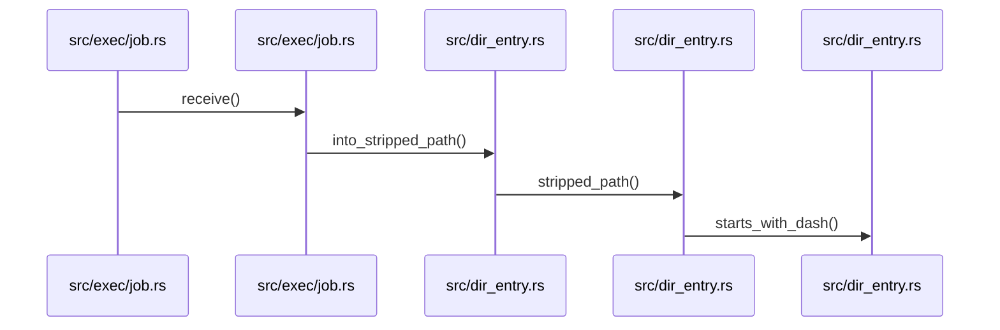
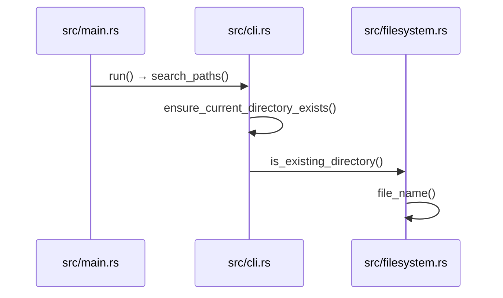
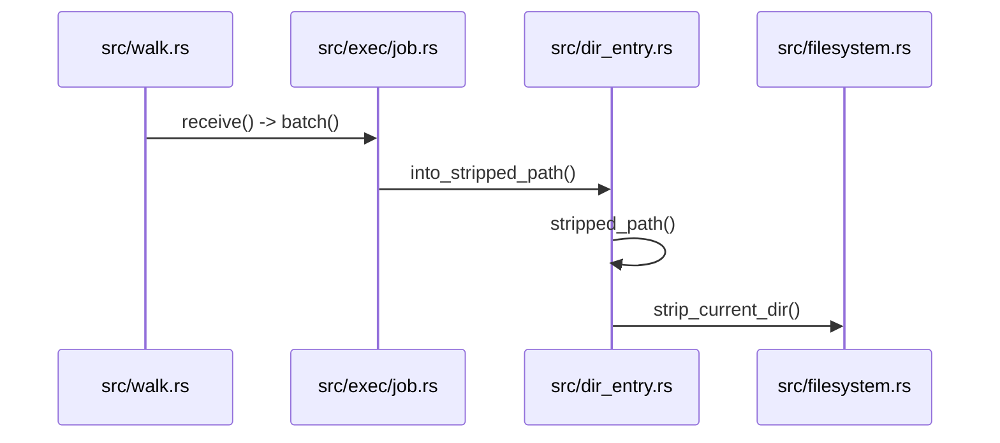
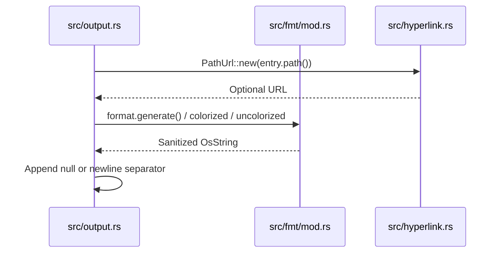

# Directory Entries

<details>
<summary>Relevant source files</summary>

The following files were used as context for generating this wiki page:

- [src/main.rs](https://github.com/sharkdp/fd/blob/main/src/main.rs)
- [src/walk.rs](https://github.com/sharkdp/fd/blob/main/src/walk.rs)
- [src/cli.rs](https://github.com/sharkdp/fd/blob/main/src/cli.rs)
- [README.md](https://github.com/sharkdp/fd/blob/main/README.md)
- [src/exec/job.rs](https://github.com/sharkdp/fd/blob/main/src/exec/job.rs)
- [src/exec/mod.rs](https://github.com/sharkdp/fd/blob/main/src/exec/mod.rs)
- [src/fmt/mod.rs](https://github.com/sharkdp/fd/blob/main/src/fmt/mod.rs)
- [src/dir_entry.rs](https://github.com/sharkdp/fd/blob/main/src/dir_entry.rs)
- [src/output.rs](https://github.com/sharkdp/fd/blob/main/src/output.rs)
- [src/filter/owner.rs](https://github.com/sharkdp/fd/blob/main/src/filter/owner.rs)
- [src/fmt/input.rs](https://github.com/sharkdp/fd/blob/main/src/fmt/input.rs)
- [src/filetypes.rs](https://github.com/sharkdp/fd/blob/main/src/filetypes.rs)
- [src/filesystem.rs](https://github.com/sharkdp/fd/blob/main/src/filesystem.rs)
- [src/hyperlink.rs](https://github.com/sharkdp/fd/blob/main/src/hyperlink.rs)
- [src/filter/mod.rs](https://github.com/sharkdp/fd/blob/main/src/filter/mod.rs)
- [src/filter/size.rs](https://github.com/sharkdp/fd/blob/main/src/filter/size.rs)
- [src/config.rs](https://github.com/sharkdp/fd/blob/main/src/config.rs)
</details>

## Overview

The `DirEntry` module serves as the foundational data abstraction for representing, querying, and managing filesystem objects discovered during recursive directory traversal. It encapsulates both standard walker entries and special structures such as broken symbolic links, bridging low-level operating system metadata with high-performance concurrent processing pipelines. By lazily resolving file attributes and providing robust path-presentation logic, this component ensures efficient resource utilization and safe formatting across diverse execution environments. Sources: [src/dir_entry.rs:11-110](https://github.com/sharkdp/fd/blob/main/src/dir_entry.rs#L11-L110), [src/walk.rs:485-506](https://github.com/sharkdp/fd/blob/main/src/walk.rs#L485-L506)

## Core Directory Entry Representation

### Structure and Inner Variants

The core data type representing a discovered path is `DirEntry`, which wraps an internal `DirEntryInner` enum. This enum distinguishes between standard filesystem entries yielded by the parallel walker and broken symbolic links where target resolution fails. Laziness is prioritized via `OnceCell` fields for file metadata and terminal styles, avoiding redundant system calls until inspection is strictly required.

```rust
#[derive(Debug)]
enum DirEntryInner {
    Normal(ignore::DirEntry),
    BrokenSymlink(PathBuf),
}

#[derive(Debug)]
pub struct DirEntry {
    inner: DirEntryInner,
    metadata: OnceCell<Option<Metadata>>,
    style: OnceCell<Option<Style>>,
}
```
Sources: [src/dir_entry.rs:11-22](https://github.com/sharkdp/fd/blob/main/src/dir_entry.rs#L11-L22)

> [!NOTE]
> Broken symbolic links do not produce depth metrics and require explicit `symlink_metadata` invocation rather than standard metadata lookups to successfully retrieve file attributes.
Sources: [src/dir_entry.rs:82-103](https://github.com/sharkdp/fd/blob/main/src/dir_entry.rs#L82-L103)

### Path Stripping and Dash-Prefix Safety

When presenting paths to the user or downstream processes, `fd` can strip the leading current-directory prefix (`./`). However, stripping `./` from a relative path might expose a leading hyphen (e.g., transforming `./-rf` into `-rf`), which downstream tools could misinterpret as a command-line flag. The path stripping logic prevents this by inspecting the stripped output for a dash prefix.


Sources: [src/dir_entry.rs:56-80](https://github.com/sharkdp/fd/blob/main/src/dir_entry.rs#L56-L80), [src/exec/job.rs:46-64](https://github.com/sharkdp/fd/blob/main/src/exec/job.rs#L46-L64)

The execution trace follows this exact sequence:
1. `receive` in `src/exec/job.rs` pulls worker results or delegates to batch execution. Sources: [src/exec/job.rs:46-64](https://github.com/sharkdp/fd/blob/main/src/exec/job.rs#L46-L64)
2. `batch` extracts paths utilizing `into_stripped_path`. Sources: [src/exec/job.rs:51-61](https://github.com/sharkdp/fd/blob/main/src/exec/job.rs#L51-L61), [src/dir_entry.rs:74-80](https://github.com/sharkdp/fd/blob/main/src/dir_entry.rs#L74-L80)
3. `into_stripped_path` conditionally invokes `stripped_path`. Sources: [src/dir_entry.rs:74-80](https://github.com/sharkdp/fd/blob/main/src/dir_entry.rs#L74-L80)
4. `stripped_path` computes the relative path via `strip_current_dir` and evaluates `starts_with_dash`. Sources: [src/dir_entry.rs:59-71](https://github.com/sharkdp/fd/blob/main/src/dir_entry.rs#L59-L71)
5. `starts_with_dash` checks encoded byte representation to verify whether the initial byte equals `b'-'`. Sources: [src/dir_entry.rs:111-113](https://github.com/sharkdp/fd/blob/main/src/dir_entry.rs#L111-L113)

### Entry Comparison and Metadata Accessors

`DirEntry` implements comparison traits (`PartialEq`, `Eq`, `PartialOrd`, and `Ord`) by directly comparing underlying paths. It also implements the `Colorable` trait to support terminal colorization and styling via `lscolors`.

| Method Name | Return Type | Description |
| :--- | :--- | :--- |
| `path` | `&Path` | Returns the reference to the internal path. |
| `into_path` | `PathBuf` | Consumes self and returns the owned path buffer. |
| `stripped_path` | `&Path` | Returns user-presentable path, preserving `./` if prefix starts with `-`. |
| `into_stripped_path` | `PathBuf` | Consumes self and returns the owned stripped path buffer. |
| `file_type` | `Option<FileType>` | Retrieves file type, querying metadata fallback for broken symlinks. |
| `metadata` | `Option<&Metadata>` | Lazily initializes and returns cached filesystem metadata. |
| `depth` | `Option<usize>` | Returns traversal depth if normal entry, `None` for broken symlinks. |
| `style` | `Option<&Style>` | Lazily computes and caches `LsColors` style configuration. |

Sources: [src/dir_entry.rs:42-110](https://github.com/sharkdp/fd/blob/main/src/dir_entry.rs#L42-L110), [src/dir_entry.rs:116-167](https://github.com/sharkdp/fd/blob/main/src/dir_entry.rs#L116-L167)

### Design Trade-Offs

| Design Choice | Benefit | Cost |
| :--- | :--- | :--- |
| **Enum-backed `DirEntryInner`** (`Normal` vs `BrokenSymlink`) | Captures invalid symlinks that would otherwise cause traversal failures while keeping standard path handling fast. | Requires match branches across accessor methods to handle missing depths or alternative metadata lookups. |
| **Lazy `OnceCell` Caching** for metadata and styles | Minimizes expensive filesystem stat calls and color-matching computations until entries match filtering predicates. | Introduces interior mutability patterns and requires immutable references to handle cell initialization. |
| **Byte-level Dash Check** (`as_encoded_bytes()`) | Accurately identifies option-like file names safely across platforms without full UTF-8 lossy decoding. | Operates directly on raw OS string byte representations, coupling path presentation logic to byte structures. |

Sources: [src/dir_entry.rs:11-22](https://github.com/sharkdp/fd/blob/main/src/dir_entry.rs#L11-L22), [src/dir_entry.rs:89-109](https://github.com/sharkdp/fd/blob/main/src/dir_entry.rs#L89-L109), [src/dir_entry.rs:111-113](https://github.com/sharkdp/fd/blob/main/src/dir_entry.rs#L111-L113)

## Path Resolution and Directory Check

### Overview

During startup, `fd` validates CLI arguments, resolves search paths, and checks that both explicit base directories and the current working directory exist on disk before initiating the filesystem walker. This subsystem prevents runtime panics and issues friendly errors when paths are invalid or have been deleted.

Sources: [src/main.rs:75-87](https://github.com/sharkdp/fd/blob/main/src/main.rs#L75-L87), [src/cli.rs:696-721](https://github.com/sharkdp/fd/blob/main/src/cli.rs#L696-L721), [src/filesystem.rs:38-42](https://github.com/sharkdp/fd/blob/main/src/filesystem.rs#L38-L42)

### Startup Validation Call Chain

The execution sequence during startup flows from the main routine through path processing and directory verification checks:

1. `run` in `src/main.rs` parses CLI options and initiates path resolution. Sources: [src/main.rs:75-84](https://github.com/sharkdp/fd/blob/main/src/main.rs#L75-L84)
2. `search_paths` in `src/cli.rs` evaluates positional paths or defaults to `./`. Sources: [src/cli.rs:696-706](https://github.com/sharkdp/fd/blob/main/src/cli.rs#L696-L706)
3. `ensure_current_directory_exists` in `src/cli.rs` verifies that fallback paths exist. Sources: [src/cli.rs:963-970](https://github.com/sharkdp/fd/blob/main/src/cli.rs#L963-L970)
4. `is_existing_directory` in `src/filesystem.rs` checks directory properties and file name presence. Sources: [src/filesystem.rs:38-42](https://github.com/sharkdp/fd/blob/main/src/filesystem.rs#L38-L42)
5. `file_name` inspects individual path components to ensure valid traversal roots. Sources: [src/filesystem.rs:41](https://github.com/sharkdp/fd/blob/main/src/filesystem.rs#L41)


Sources: [src/main.rs:75-84](https://github.com/sharkdp/fd/blob/main/src/main.rs#L75-L84), [src/cli.rs:696-706](https://github.com/sharkdp/fd/blob/main/src/cli.rs#L696-L706), [src/cli.rs:963-970](https://github.com/sharkdp/fd/blob/main/src/cli.rs#L963-L970), [src/filesystem.rs:38-42](https://github.com/sharkdp/fd/blob/main/src/filesystem.rs#L38-L42)

> [!NOTE]
> `is_existing_directory` explicitly avoids using standard `.exists()` checks because `.` always evaluates to true even if the current working directory has been deleted out from under the process.
> Sources: [src/filesystem.rs:38-42](https://github.com/sharkdp/fd/blob/main/src/filesystem.rs#L38-L42)

## Directory Entry Filtering Engine

### Overview

The directory entry filtering engine evaluates discovered entries against user-configured constraints including file types, size thresholds, time modification limits, and UNIX user or group ownership attributes. These filters inspect entry properties via metadata extensions and type helpers to determine whether a traversal candidate should be included or ignored.

Sources: [src/filetypes.rs:6-43](https://github.com/sharkdp/fd/blob/main/src/filetypes.rs#L6-L43), [src/filter/size.rs:8-75](https://github.com/sharkdp/fd/blob/main/src/filter/size.rs#L8-L75), [src/filter/owner.rs:5-74](https://github.com/sharkdp/fd/blob/main/src/filter/owner.rs#L5-L74)

### File Type Filtering

The `FileTypes` struct manages inclusion flags for specific category checks. When `should_ignore` evaluates an entry, it inspects file types and helper conditions to filter out non-matching paths.

```rust
pub struct FileTypes {
    pub files: bool,
    pub directories: bool,
    pub symlinks: bool,
    pub block_devices: bool,
    pub char_devices: bool,
    pub sockets: bool,
    pub pipes: bool,
    pub executables_only: bool,
    pub empty_only: bool,
}
```
Sources: [src/filetypes.rs:6-18](https://github.com/sharkdp/fd/blob/main/src/filetypes.rs#L6-L18)

| File Type / Constraint Flag | Description |
| :--- | :--- |
| `files` | Include regular files when true. |
| `directories` | Include directories when true. |
| `symlinks` | Include symbolic links when true. |
| `block_devices` | Include block devices when true. |
| `char_devices` | Include character devices when true. |
| `sockets` | Include UNIX domain sockets when true. |
| `pipes` | Include FIFO named pipes when true. |
| `executables_only` | Restrict files to those marked executable. |
| `empty_only` | Restrict entries to empty files or directories. |

Sources: [src/filetypes.rs:9-17](https://github.com/sharkdp/fd/blob/main/src/filetypes.rs#L9-L17)

> [!WARNING]
> If an entry lacks file type information (`entry.file_type()` returns `None`), `should_ignore` immediately returns `true` and drops the entry from search results.
> Sources: [src/filetypes.rs:21-42](https://github.com/sharkdp/fd/blob/main/src/filetypes.rs#L21-L42)

### Size Constraint Parsing and Evaluation

Size filters are parsed using regular expressions that capture an optional limit modifier (`+` for minimum size, `-` for maximum size, or empty for exact equality), a numeric quantity, and an optional SI or binary prefix unit.

```rust
pub enum SizeFilter {
    Max(u64),
    Min(u64),
    Equals(u64),
}
```
Sources: [src/filter/size.rs:8-13](https://github.com/sharkdp/fd/blob/main/src/filter/size.rs#L8-L13)

| Unit Constant | Multiplier Value | Description |
| :--- | :--- | :--- |
| `KILO` | `1000` | SI decimal kilo prefix |
| `MEGA` | `1000000` | SI decimal mega prefix |
| `GIGA` | `1000000000` | SI decimal giga prefix |
| `TERA` | `1000000000000` | SI decimal tera prefix |
| `KIBI` | `1024` | Binary kibi prefix (`ki` / `kib`) |
| `MEBI` | `1048576` | Binary mebi prefix (`mi` / `mib`) |
| `GIBI` | `1073741824` | Binary gibi prefix (`gi` / `gib`) |
| `TEBI` | `1099511627776` | Binary tebi prefix (`ti` / `tib`) |
| `b` | `1` | Raw byte units |

Sources: [src/filter/size.rs:15-25](https://github.com/sharkdp/fd/blob/main/src/filter/size.rs#L15-L25), [src/filter/size.rs:46-57](https://github.com/sharkdp/fd/blob/main/src/filter/size.rs#L46-L57)

### UNIX Owner Filtering

On UNIX platforms, `OwnerFilter` splits input strings on colons to construct UID and GID checks supporting equality, negation (`!`), and ignore variants.

```rust
pub struct OwnerFilter {
    uid: Check<u32>,
    gid: Check<u32>,
}

enum Check<T> {
    Equal(T),
    NotEq(T),
    Ignore,
}
```
Sources: [src/filter/owner.rs:5-16](https://github.com/sharkdp/fd/blob/main/src/filter/owner.rs#L5-L16)

> [!NOTE]
> `OwnerFilter::from_string` resolves both numeric IDs and named users or groups using `User::from_name` and `Group::from_name` system calls.
> Sources: [src/filter/owner.rs:38-55](https://github.com/sharkdp/fd/blob/main/src/filter/owner.rs#L38-L55)

## Traversal Stream and Pipeline Dispatch

### Overview

The pipeline dispatcher coordinates parallel filesystem traversal by streaming discovered directory entries from worker threads across a bounded crossbeam channel into either standard output buffering or execution job handlers. Concurrency is managed through `WorkerState`, which configures parallel walkers, ignore rules, overrides, and thread pools, while `ReceiverBuffer` handles dynamic switching between fast buffering and direct streaming.

Sources: [src/walk.rs:129-171](https://github.com/sharkdp/fd/blob/main/src/walk.rs#L129-L171), [src/walk.rs:305-328](https://github.com/sharkdp/fd/blob/main/src/walk.rs#L305-L328)

### Call-Chain Execution Walkthrough

When processing results in batch execution mode, entries flow through a precise sequence of transformation steps before reaching command execution.

1. `receive` — Receives batches from the worker channel and passes the flattened items into batch execution via `exec::batch`.
   Sources: [src/walk.rs:412-414](https://github.com/sharkdp/fd/blob/main/src/walk.rs#L412-L414)
2. `batch` — Iterates over worker results, filtering and mapping entries using `into_stripped_path`.
   Sources: [src/exec/job.rs:46-61](https://github.com/sharkdp/fd/blob/main/src/exec/job.rs#L46-L61)
3. `into_stripped_path` — Consumes the `DirEntry`, evaluating configuration flags to determine whether prefix stripping is required.
   Sources: [src/dir_entry.rs:74-80](https://github.com/sharkdp/fd/blob/main/src/dir_entry.rs#L74-L80)
4. `stripped_path` — Retrieves the internal path and checks whether removing current directory prefixes would expose a dash-prefixed argument.
   Sources: [src/dir_entry.rs:59-71](https://github.com/sharkdp/fd/blob/main/src/dir_entry.rs#L59-L71)
5. `strip_current_dir` — Strips the leading `.` prefix from the path using standard path prefix matching.
   Sources: [src/filesystem.rs:118-121](https://github.com/sharkdp/fd/blob/main/src/filesystem.rs#L118-L121)


Sources: [src/walk.rs:412-414](https://github.com/sharkdp/fd/blob/main/src/walk.rs#L412-L414), [src/exec/job.rs:46-61](https://github.com/sharkdp/fd/blob/main/src/exec/job.rs#L46-L61), [src/dir_entry.rs:59-80](https://github.com/sharkdp/fd/blob/main/src/dir_entry.rs#L59-L80), [src/filesystem.rs:118-121](https://github.com/sharkdp/fd/blob/main/src/filesystem.rs#L118-L121)

> [!NOTE]
> If stripping `./` from a path would result in a leading dash (e.g., `./-rf`), `stripped_path` preserves the original path with its prefix intact to prevent downstream command interpreters from misinterpreting the path as a command-line flag.
> Sources: [src/dir_entry.rs:57-68](https://github.com/sharkdp/fd/blob/main/src/dir_entry.rs#L57-L68)

### Pipeline Modes and Constants

The streaming subsystem operates under specific buffer length constraints and receiver modes to optimize terminal output latency.

| Constant / Enum | Value / Variant | Purpose |
| :--- | :--- | :--- |
| `MAX_BUFFER_LENGTH` | `1000` | Maximum size of the output buffer before flushing results to the console. |
| `DEFAULT_MAX_BUFFER_TIME` | `100` milliseconds | Default duration until output buffering switches to streaming mode. |
| `ReceiverMode::Buffering` | Enum Variant | Receiver buffers output to sort or batch results if the search finishes quickly. |
| `ReceiverMode::Streaming` | Enum Variant | Receiver directly writes results to standard output. |

Sources: [src/walk.rs:27-35](https://github.com/sharkdp/fd/blob/main/src/walk.rs#L27-L35), [src/walk.rs:124-127](https://github.com/sharkdp/fd/blob/main/src/walk.rs#L124-L127)

### Pipeline Dispatch Design Trade-Offs

| Design Choice | Benefit | Cost |
| :--- | :--- | :--- |
| Bounded crossbeam channels (`2 * config.threads`) | Provides natural backpressure against fast walking threads, bounding memory consumption. | Potential thread contention on channel send/receive operations under heavy parallelism. |
| Timed buffering (`DEFAULT_MAX_BUFFER_TIME`) | Allows rapid searches to be sorted or batched before output, improving initial response experience. | Introduces a minor fixed latency overhead before the first batch is flushed if results trickle slowly. |
| Mutex-wrapped batch pooling (`Batch`) | Enables efficient recycling and sharing of vector allocations across worker threads. | Lock acquisition overhead per batch submission. |

Sources: [src/walk.rs:48-63](https://github.com/sharkdp/fd/blob/main/src/walk.rs#L48-L63), [src/walk.rs:126-128](https://github.com/sharkdp/fd/blob/main/src/walk.rs#L126-L128), [src/walk.rs:636-637](https://github.com/sharkdp/fd/blob/main/src/walk.rs#L636-L637)

## Entry Formatting and Output Rendering

### Overview

Directory entry rendering manages how paths are formatted, colorized, separated, and emitted to standard output. When terminal hyperlinks are enabled via configuration, entries are wrapped in OSC 8 escape sequences containing absolute path URLs with percent-encoded non-ASCII bytes and hostname resolution. Output rendering branches depending on whether a command format template, `LS_COLORS` colorization, or uncolorized output is requested.
Sources: [src/output.rs:17-43](https://github.com/sharkdp/fd/blob/main/src/output.rs#L17-L43), [src/hyperlink.rs:8-62](https://github.com/sharkdp/fd/blob/main/src/hyperlink.rs#L8-L62)

### Formatting Templates and Placeholders

Format templates parse strings containing placeholder tokens using an Aho-Corasick automaton initialized via `OnceLock`. Escaped braces (`{{`, `}}`) are reduced to single braces, while unescaped tokens expand to specific path components during generation.
Sources: [src/fmt/mod.rs:13-107](https://github.com/sharkdp/fd/blob/main/src/fmt/mod.rs#L13-L107)

| Token Variant | Pattern String | Expanded Component / Meaning |
| :--- | :--- | :--- |
| `Placeholder` | `{}` | The full search result path. |
| `Basename` | `{/}` | The file name or final component of the path. |
| `Parent` | `{//}` | The parent directory of the path. |
| `NoExt` | `{/}` | The path with its file extension removed. |
| `BasenameNoExt` | `{/.}` | The basename with its file extension removed. |
| `Text` | Literal string | Fixed text segments outside placeholders. |

Sources: [src/fmt/mod.rs:18-36](https://github.com/sharkdp/fd/blob/main/src/fmt/mod.rs#L18-L36), [src/fmt/mod.rs:64-66](https://github.com/sharkdp/fd/blob/main/src/fmt/mod.rs#L64-L66)

Path input helpers manipulate path components for template generation and filtering.
Sources: [src/fmt/input.rs:6-32](https://github.com/sharkdp/fd/blob/main/src/fmt/input.rs#L6-L32)

| Input Helper Function | Target Signature | Action Performed |
| :--- | :--- | :--- |
| `basename` | `path: &Path -> &OsStr` | Extracts file name via `path.file_name()`, falling back to the full OS string. |
| `remove_extension` | `path: &Path -> OsString` | Strips file extension from the stem and joins it with the directory name, stripping current dir. |
| `dirname` | `path: &Path -> OsString` | Returns parent directory via `path.parent()`, defaulting empty to `.` and retaining root paths. |

Sources: [src/fmt/input.rs:7-32](https://github.com/sharkdp/fd/blob/main/src/fmt/input.rs#L7-L32)

### Call-Chain Execution Walkthrough

When an entry is written to stdout, `print_entry` coordinates hyperlinks, styling, and separators through the following call sequence:
1. `print_entry` checks `config.hyperlink` and constructs a `PathUrl` using `PathUrl::new`, writing OSC 8 escape sequences if present.
Sources: [src/output.rs:17-24](https://github.com/sharkdp/fd/blob/main/src/output.rs#L17-L24), [src/hyperlink.rs:8-10](https://github.com/sharkdp/fd/blob/main/src/hyperlink.rs#L8-L10)
2. `print_entry` branches on configuration: invoking `print_entry_format` if a format template is set, `print_entry_colorized` if `ls_colors` are available, or `print_entry_uncolorized` otherwise.
Sources: [src/output.rs:26-32](https://github.com/sharkdp/fd/blob/main/src/output.rs#L26-L32)
3. `print_entry_format` calls `format.generate` on the stripped path with optional custom separators, passing the result through `maybe_sanitize`.
Sources: [src/fmt/mod.rs:112-141](https://github.com/sharkdp/fd/blob/main/src/fmt/mod.rs#L112-L141), [src/output.rs:75-85](https://github.com/sharkdp/fd/blob/main/src/output.rs#L75-L85)
4. `print_entry` closes any active hyperlink and appends either a null byte (`\0`) or newline (`\n`) depending on `config.null_separator`.
Sources: [src/output.rs:34-43](https://github.com/sharkdp/fd/blob/main/src/output.rs#L34-L43)


Sources: [src/output.rs:17-43](https://github.com/sharkdp/fd/blob/main/src/output.rs#L17-L43), [src/fmt/mod.rs:112-141](https://github.com/sharkdp/fd/blob/main/src/fmt/mod.rs#L112-L141), [src/hyperlink.rs:8-10](https://github.com/sharkdp/fd/blob/main/src/hyperlink.rs#L8-L10)

> [!NOTE]
> On Unix systems with piped output and no custom path separator or interactive terminal flag, `print_entry_uncolorized` bypasses UTF-8 string lossy conversion entirely and writes raw OS bytes directly to stdout to preserve invalid UTF-8 filenames for downstream tools.
> Sources: [src/output.rs:167-182](https://github.com/sharkdp/fd/blob/main/src/output.rs#L167-L182)

### Rendering Design Trade-Offs

| Design Choice | Benefit | Cost |
| :--- | :--- | :--- |
| Aho-Corasick automaton (`OnceLock`) | Fast multi-pattern matching for placeholder parsing without regex overhead. | Initialization overhead on first template parse. |
| Raw byte output on Unix pipes | Preserves arbitrary non-UTF-8 filesystem byte sequences for downstream pipelines. | Bypasses character sanitization for non-interactive streams. |
| Component-based separator replacement | Correctly swaps path separators on Windows UNC paths, drive letters, and standard roots. | Higher iteration overhead during path component parsing. |

Sources: [src/fmt/mod.rs:51-66](https://github.com/sharkdp/fd/blob/main/src/fmt/mod.rs#L51-L66), [src/fmt/mod.rs:147-196](https://github.com/sharkdp/fd/blob/main/src/fmt/mod.rs#L147-L196), [src/output.rs:167-182](https://github.com/sharkdp/fd/blob/main/src/output.rs#L167-L182)

## Related

- [[Parallel Directory Traversal]]
- [[Filesystem Utilities]]

