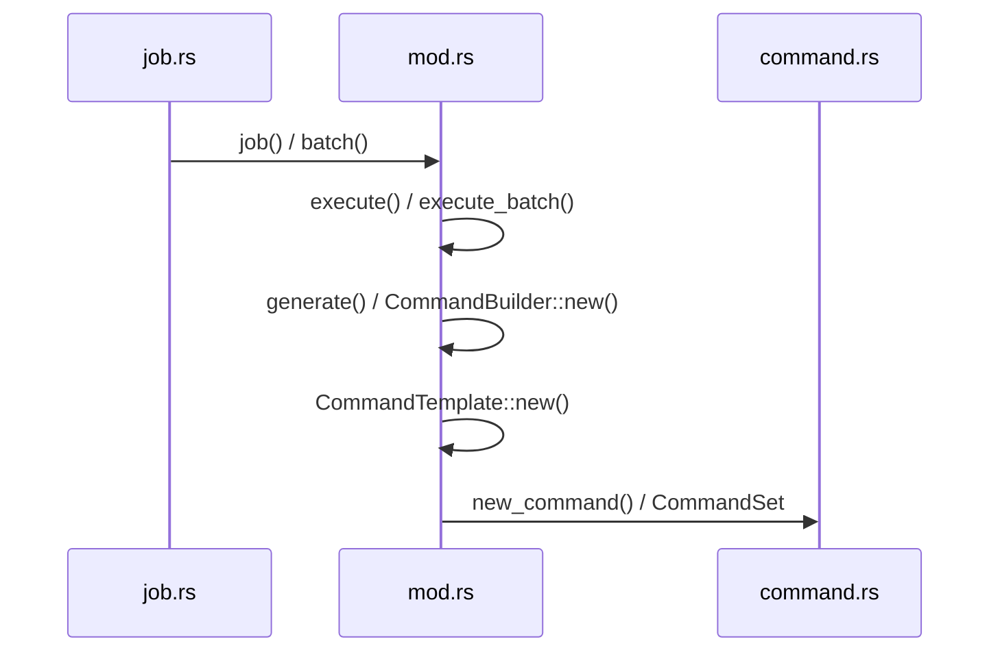
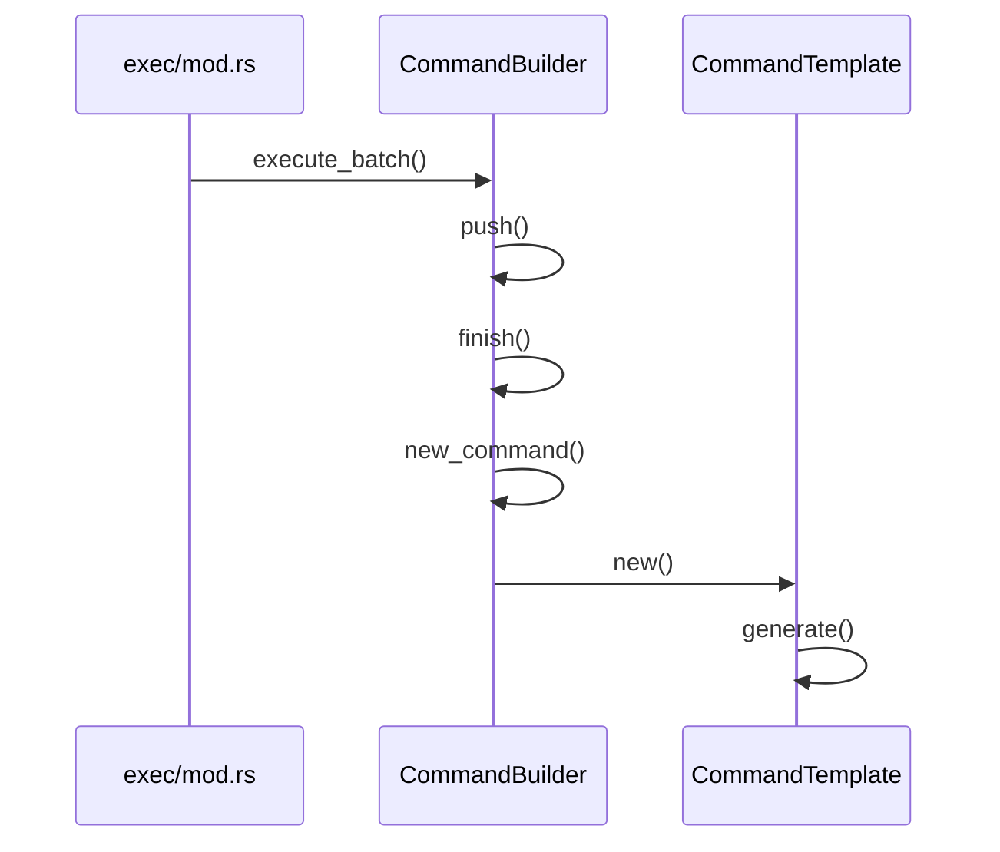
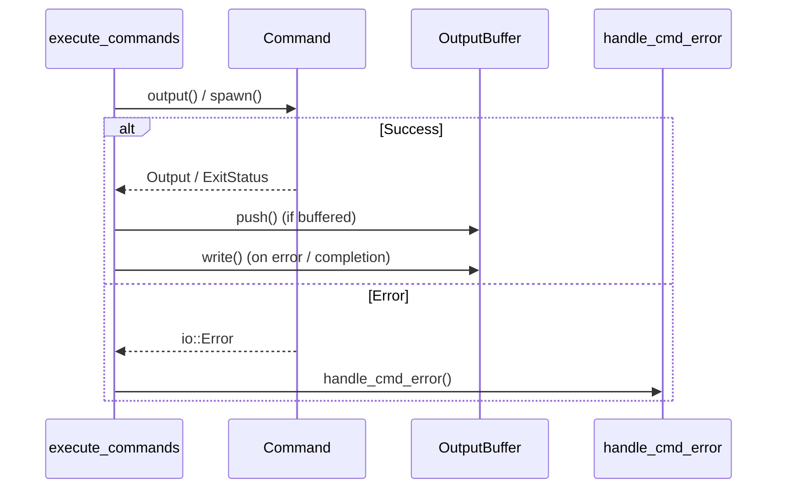

# Execution Job Dispatch

Relevant source files

The following files were used as context for generating this wiki page:

- [src/main.rs](https://github.com/sharkdp/fd/blob/main/src/main.rs)
- [src/walk.rs](https://github.com/sharkdp/fd/blob/main/src/walk.rs)
- [src/cli.rs](https://github.com/sharkdp/fd/blob/main/src/cli.rs)
- [README.md](https://github.com/sharkdp/fd/blob/main/README.md)
- [src/exec/job.rs](https://github.com/sharkdp/fd/blob/main/src/exec/job.rs)
- [src/exec/mod.rs](https://github.com/sharkdp/fd/blob/main/src/exec/mod.rs)
- [Cargo.toml](https://github.com/sharkdp/fd/blob/main/Cargo.toml)
- [src/exec/command.rs](https://github.com/sharkdp/fd/blob/main/src/exec/command.rs)
- [doc/screencast.sh](https://github.com/sharkdp/fd/blob/main/doc/screencast.sh)
- [src/config.rs](https://github.com/sharkdp/fd/blob/main/src/config.rs)
- [contrib/completion/fdfind.bash](https://github.com/sharkdp/fd/blob/main/contrib/completion/fdfind.bash)
- [doc/sponsors.md](https://github.com/sharkdp/fd/blob/main/doc/sponsors.md)

## Overview

The execution job dispatch subsystem in `fd` bridges filesystem discovery and external process management by translating search results into coordinated command-line executions. Operating alongside parallel directory traversal, it solves the challenge of safely and efficiently invoking external tools—either on individual items or across accumulated batches—without mangling console output or ignoring exit statuses. Key design choices include flexible command templates with placeholder substitution, crossbeam-channel-backed worker thread pools, robust command-line argument squeezing via `argmax`, and synchronized output buffering to prevent interleaving. This subsystem interacts directly with CLI parsing structures to extract command templates, the directory scanner to consume streaming entry results, and process execution handlers to spawn child processes and translate exit codes.

Sources: [src/main.rs:298-310](https://github.com/sharkdp/fd/blob/main/src/main.rs#L298-L310), [src/walk.rs:412-433](https://github.com/sharkdp/fd/blob/main/src/walk.rs#L412-L433), [src/exec/mod.rs:20-74](https://github.com/sharkdp/fd/blob/main/src/exec/mod.rs#L20-L74), [src/exec/job.rs:11-44](https://github.com/sharkdp/fd/blob/main/src/exec/job.rs#L11-L44), [src/exec/command.rs:59-99](https://github.com/sharkdp/fd/blob/main/src/exec/command.rs#L59-L99)

## CLI Command Extraction and Configuration Parsing

### Overview

CLI command extraction and configuration parsing bridges raw command-line arguments and internal execution rules by leveraging `clap` via `Opts` in `src/cli.rs` and lowering them into runtime configurations via `construct_config` in `src/main.rs`. This translation pipeline extracts execution flags, sets up working directories, parses command templates, and configures filtering constraints before handing the assembled `Config` object to the directory walker.

Sources: [src/main.rs:75-112](https://github.com/sharkdp/fd/blob/main/src/main.rs#L75-L112), [src/cli.rs:21-31](https://github.com/sharkdp/fd/blob/main/src/cli.rs#L21-L31)

### Configuration Parsing and Extraction Workflow

The configuration extraction pipeline transforms parsed CLI options into the runtime `Config` struct through a strict sequence of validation and transformation steps. 

The call-chain execution walkthrough for configuration initialization follows this exact order:
`Opts::parse()` → `set_working_dir()` → `opts.search_paths()` → `ensure_search_pattern_is_not_a_path()` → `build_pattern_regex()` → `construct_config()` → `extract_command()` → `walk::scan()`

1. `Opts::parse()` reads and validates raw command-line arguments using `clap`.
2. `set_working_dir()` evaluates `opts.base_directory`, checking if it is an existing directory via `filesystem::is_existing_directory()` before invoking `env::set_current_dir()`.
3. `opts.search_paths()` resolves target directories, validating each entry and normalizing them.
4. `ensure_search_pattern_is_not_a_path()` intercepts accidental path-as-pattern inputs, validating both the primary pattern and `--and` expressions via `ensure_single_search_pattern_is_not_a_path()`.
5. `build_pattern_regex()` constructs regex patterns based on options such as `--glob`, `--exact`, or `--fixed-strings`.
6. `construct_config()` aggregates options, computing case sensitivity (smart case), path separators, size and time constraints, color modes via `color` and `NO_COLOR`, and invoking `extract_command()` to capture execution commands.
7. `walk::scan()` receives the final `Config`, search paths, and compiled regexes to initiate traversal.

Sources: [src/main.rs:75-112](https://github.com/sharkdp/fd/blob/main/src/main.rs#L75-L112), [src/main.rs:131-147](https://github.com/sharkdp/fd/blob/main/src/main.rs#L131-L147), [src/cli.rs:696-721](https://github.com/sharkdp/fd/blob/main/src/cli.rs#L696-L721)

> [!WARNING]
> If a search pattern contains a path separator without `--full-path` enabled, `ensure_search_pattern_is_not_a_path` returns an error rather than searching silently with zero results. On Windows, native `\` separators trigger this warning only if the pattern resolves to an existing directory on disk to avoid breaking regex escapes like `\Ac`.

Sources: [src/main.rs:169-216](https://github.com/sharkdp/fd/blob/main/src/main.rs#L169-L216)

### Command Template Extraction and Flags

Execution flags like `--exec` (`-x`) and `--exec-batch` (`-X`) are handled via hand-rolled `clap::FromArgMatches` implementations on the `Exec` struct. `extract_command` inspects these arguments alongside `--list-details` to populate the `CommandSet` within the runtime configuration.

| CLI Option / Flag | Short Flag | Type / Value Name | Default / Behavior | Purpose |
| :--- | :--- | :--- | :--- | :--- |
| `--exec` | `-x` | `cmd` (multiple) | `None` | Execute a command for each search result in parallel. |
| `--exec-batch` | `-X` | `cmd` (multiple) | `None` | Execute a command once with all search results as arguments. |
| `--list-details` | `-l` | None | `false` | Alias for `--exec-batch ls -l` with additional metadata options. |
| `--batch-size` | None | `size` | `0` (unlimited) | Maximum number of arguments to pass to the command given with `-X`. |
| `--color` | `-c` | `when` | `ColorWhen::Auto` | Control when to use color for output (`auto`, `always`, `never`). |
| `--hyperlink` | `--hyper` | `when` | `HyperlinkWhen::Never` | Add terminal hyperlinks (`file://`) to paths in the output. |

Sources: [src/main.rs:279-299](https://github.com/sharkdp/fd/blob/main/src/main.rs#L279-L299), [src/main.rs:395-410](https://github.com/sharkdp/fd/blob/main/src/main.rs#L395-L410), [src/cli.rs:520-549](https://github.com/sharkdp/fd/blob/main/src/cli.rs#L520-L549), [src/cli.rs:857-951](https://github.com/sharkdp/fd/blob/main/src/cli.rs#L857-951)

> [!TIP]
> When `--list-details` is requested on platforms where GNU `ls` is absent or unsupported (such as Windows without `ls` installed), `determine_ls_command` explicitly returns an error halting configuration construction before filesystem traversal begins.

Sources: [src/main.rs:405-408](https://github.com/sharkdp/fd/blob/main/src/main.rs#L405-L408), [src/main.rs:470-493](https://github.com/sharkdp/fd/blob/main/src/main.rs#L470-L493)

## Command Template Representation and Token Expansion

### Overview

Command templates structure and translate user-supplied execution templates into concrete `Command` instances. The engine manages these templates through `CommandSet` and `CommandTemplate` definitions, parsing template strings, validating token occurrences, expanding path placeholders, and organizing batch buffer allocations via `CommandBuilder`.

Sources: [src/exec/mod.rs:30-74](https://github.com/sharkdp/fd/blob/main/src/exec/mod.rs#L30-L74), [src/exec/mod.rs:123-273](https://github.com/sharkdp/fd/blob/main/src/exec/mod.rs#L123-L273)

### Call-Chain Execution Walkthrough

The trace below maps command template generation and initialization steps.

1. `job` receives traversal worker results and loops over filesystem entries.
2. `execute` invokes `c.generate(input, path_separator)` across individual command templates.
3. `generate` calls `CommandTemplate::new` or executes argument template generation.
4. `new` parses template parameters and validates that arguments are non-empty.
5. `CommandSet` returns the initialized configuration set containing the execution mode and compiled command templates.

Sources: [src/exec/mod.rs:36-49](https://github.com/sharkdp/fd/blob/main/src/exec/mod.rs#L36-L49), [src/exec/mod.rs:76-88](https://github.com/sharkdp/fd/blob/main/src/exec/mod.rs#L76-L88), [src/exec/mod.rs:220-256](https://github.com/sharkdp/fd/blob/main/src/exec/mod.rs#L220-L256), [src/exec/job.rs:11-41](https://github.com/sharkdp/fd/blob/main/src/exec/job.rs#L11-L41)

The second call chain traces command builder initialization during batch operations:

1. `job` delegates batch inputs to `batch()`.
2. `execute` passes path iterators and batch limits to `execute_batch`.
3. `generate` initializes `CommandBuilder::new` via `CommandBuilder::new`.
4. `new` populates pre-arguments, path arguments, and post-arguments.
5. `new_command` configures standard I/O redirection bindings (`Stdio::inherit`) for stdin, stdout, and stderr.

Sources: [src/exec/mod.rs:90-120](https://github.com/sharkdp/fd/blob/main/src/exec/mod.rs#L90-L120), [src/exec/mod.rs:136-171](https://github.com/sharkdp/fd/blob/main/src/exec/mod.rs#L136-L171), [src/exec/job.rs:46-64](https://github.com/sharkdp/fd/blob/main/src/exec/job.rs#L46-L64)

Sources: [src/exec/mod.rs:36-171](https://github.com/sharkdp/fd/blob/main/src/exec/mod.rs#L36-L171), [src/exec/job.rs:11-64](https://github.com/sharkdp/fd/blob/main/src/exec/job.rs#L11-L64)

### Execution Modes and Validation Rules

`CommandSet` supports two explicit modes: `ExecutionMode::OneByOne` and `ExecutionMode::Batch`. Validation logic enforces strict token rules depending on the mode.

| Mode | Field / Rule | Validation Check | Failure Behavior |
| :--- | :--- | :--- | :--- |
| `OneByOne` | `args` | `args.is_empty()` | Bails with `"No executable provided for --exec or --exec-batch"` |
| `Batch` | `args[0]` | `args[0].has_tokens()` | Bails with `"First argument of --exec-batch must be a fixed executable, not a placeholder"` |
| `Batch` | token count | `cmd.number_of_tokens() > 1` | Bails with `"Only one placeholder allowed for batch commands"` |

Sources: [src/exec/mod.rs:20-70](https://github.com/sharkdp/fd/blob/main/src/exec/mod.rs#L20-L70), [src/exec/mod.rs:241-248](https://github.com/sharkdp/fd/blob/main/src/exec/mod.rs#L241-L248)

> [!CAUTION]
> If a template contains no placeholder tokens whatsoever, `CommandTemplate::new` automatically appends a default trailing placeholder token (`Token::Placeholder`) at the end of the argument list, transforming commands like `echo` into `echo {}`.

Sources: [src/exec/mod.rs:250-254](https://github.com/sharkdp/fd/blob/main/src/exec/mod.rs#L250-L254)

### Design Trade-Offs in Command Building

The command builder divides argument lists into pre-arguments, path templates, and post-arguments to support argument-length limit checks before spawning child processes.

| Design Choice | Benefit | Cost |
| :--- | :--- | :--- |
| Pre-argument extraction (`pre_args`) | Resolves fixed binaries and initial flags once per batch group. | Requires parsing every template argument twice during builder construction. |
| Automatic batch flushing (`args_would_fit`) | Prevents OS argument list length errors (`E2BIG`) on large path sets. | Splits single user batches across multiple separate spawned processes. |
| Inherited process I/O streams (`Stdio::inherit`) | Preserves interactive terminal state and formatting color detection. | Prevents fine-grained programmatic capture of stdout/stderr per sub-command. |

Sources: [src/exec/mod.rs:136-189](https://github.com/sharkdp/fd/blob/main/src/exec/mod.rs#L136-L189)

## Parallel Job Scheduling During Directory Traversal

### Overview

Parallel job scheduling bridges filesystem traversal and child process execution by streaming discovered entries across thread boundaries. When `--exec` or `--exec-batch` is invoked, `WorkerState::receive` routes results either to `exec::batch` for batch-mode groups or spawns worker threads running `exec::job` to process individual items concurrently.

Sources: [src/walk.rs:412-433](https://github.com/sharkdp/fd/blob/main/src/walk.rs#L412-L433), [src/exec/job.rs:11-64](https://github.com/sharkdp/fd/blob/main/src/exec/job.rs#L11-L64)

### Call-Chain Execution Walkthrough

The job scheduling flow proceeds through explicit channel operations and thread scopes:

1. `WorkerState::scan` sets up a bounded channel with capacity `2 * config.threads` via `bounded(2 * config.threads)`.
2. `WorkerState::scan` enters `thread::scope`, spawning the receiver thread via `scope.spawn(|| self.receive(rx))` alongside the sender walker via `self.spawn_senders(walker, tx)`.
3. `WorkerState::receive` evaluates whether `cmd.in_batch_mode()` is true; if false, it sets up a `thread::scope` over `config.threads`.
4. `WorkerState::receive` spawns each worker thread inside the scope using `scope.spawn(|| exec::job(rx.into_iter().flatten(), cmd, config))`.
5. `exec::job` iterates over the flattened receiver channel items, checks that each `WorkerResult` is an entry rather than a filesystem error, and invokes `cmd.execute(...)` to spawn and run the subprocess.

Sources: [src/walk.rs:412-433](https://github.com/sharkdp/fd/blob/main/src/walk.rs#L412-L433), [src/walk.rs:636-646](https://github.com/sharkdp/fd/blob/main/src/walk.rs#L636-L646), [src/exec/job.rs:11-41](https://github.com/sharkdp/fd/blob/main/src/exec/job.rs#L11-L41)

### Worker Result Dispatch and Error Handling

Worker threads communicate discovery events using `WorkerResult` variants packed into batches and transmitted across crossbeam channels. The receiver job handler filters and processes these results according to configuration flags.

| Variant | Data Payload | Handling Logic |
| :--- | :--- | :--- |
| `WorkerResult::Entry` | `DirEntry` | Strips path prefixes and dispatches to `cmd.execute` or batches paths for execution. |
| `WorkerResult::Error` | `ignore::Error` | Evaluates `config.show_filesystem_errors`; prints the error string if enabled, otherwise ignores. |

Sources: [src/walk.rs:40-45](https://github.com/sharkdp/fd/blob/main/src/walk.rs#L40-L45), [src/exec/job.rs:20-41](https://github.com/sharkdp/fd/blob/main/src/exec/job.rs#L20-L41)

> [!NOTE]
> When `config.threads > 1`, `exec::job` sets `buffer_output: bool = true` so that output streams from concurrently executing child processes are buffered rather than interleaved directly onto standard output.

Sources: [src/exec/job.rs:17-18](https://github.com/sharkdp/fd/blob/main/src/exec/job.rs#L17-L18)

## Batch Execution and Path Accumulation

### Overview

Batch execution collects discovered path entries across directory traversal workers to invoke single batch command executions. Instead of spawning a separate process for each individual file, `exec::batch` streams entries, filters errors, and hands path collections to `CommandSet::execute_batch`.

Sources: [src/exec/job.rs:46-64](https://github.com/sharkdp/fd/blob/main/src/exec/job.rs#L46-L64)

### Call-Chain Execution Walkthrough

The batch execution and path accumulation trace follows this exact call sequence:

1. `execute_batch`: Iterates over incoming paths and command templates, constructing a vector of `CommandBuilder` instances.
Sources: [src/exec/mod.rs:90-99](https://github.com/sharkdp/fd/blob/main/src/exec/mod.rs#L90-L99)
2. `push`: Appends each path to the active `CommandBuilder`, checking if the batch limit or argument length constraint has been exceeded.
Sources: [src/exec/mod.rs:173-189](https://github.com/sharkdp/fd/blob/main/src/exec/mod.rs#L173-L189)
3. `finish`: Invokes the pending command with its accumulated post-arguments and checks execution success.
Sources: [src/exec/mod.rs:191-203](https://github.com/sharkdp/fd/blob/main/src/exec/mod.rs#L191-L203)
4. `new_command`: Initializes a fresh OS command wrapper with inherited standard streams.
Sources: [src/exec/mod.rs:164-171](https://github.com/sharkdp/fd/blob/main/src/exec/mod.rs#L164-L171)
5. `new`: Parses template arguments into pre-arguments, path templates, and post-arguments.
Sources: [src/exec/mod.rs:136-162](https://github.com/sharkdp/fd/blob/main/src/exec/mod.rs#L136-L162)
6. `generate`: Produces argument strings using path format templates.
Sources: [src/exec/mod.rs:266-272](https://github.com/sharkdp/fd/blob/main/src/exec/mod.rs#L266-L272)

Sources: [src/exec/mod.rs:90-272](https://github.com/sharkdp/fd/blob/main/src/exec/mod.rs#L90-L272)

### Batch Accumulation and Flushing

As paths stream into `CommandBuilder::push`, two separate thresholds determine when a batch is flushed and executed: the user-configured batch limit (`config.batch_size`) and the operating system's argument list length limits.

| Condition | Threshold Check | Action on Exceeding Limit |
| :--- | :--- | :--- |
| Count limit | `self.limit > 0 && self.count >= self.limit` | Automatically invokes `self.finish()?` to execute the current batch. |
| Argument size limit | `!self.cmd.args_would_fit(...)` | Automatically flushes via `self.finish()?` before the argument buffer overflows. |

Sources: [src/exec/mod.rs:174-184](https://github.com/sharkdp/fd/blob/main/src/exec/mod.rs#L174-L184)

> [!WARNING]
> If `CommandSet::new_batch` encounters a command template containing more than one placeholder token, it immediately fails with a bail error stating `Only one placeholder allowed for batch commands`.

Sources: [src/exec/mod.rs:63-65](https://github.com/sharkdp/fd/blob/main/src/exec/mod.rs#L63-L65)

## Child Process Spawning and Execution Handling

### Overview

Child process spawning and execution handling coordinates the execution of generated commands, captures or streams output data, and translates operating system exit status codes into internal application exit statuses. The core logic resides in `src/exec/command.rs`, managing synchronization locks across concurrent execution threads and handling process invocation failures.

Sources: [src/exec/command.rs:1-115](https://github.com/sharkdp/fd/blob/main/src/exec/command.rs#L1-L115)

### Call-Chain Execution Walkthrough

The process execution and output handling trace follows this exact call sequence:

1. `execute_commands`: Iterates over command results, deciding whether to run with buffered output or live interactive execution.
Sources: [src/exec/command.rs:60-96](https://github.com/sharkdp/fd/blob/main/src/exec/command.rs#L60-L96)
2. `cmd.output()` or `cmd.spawn()`: Invokes the underlying command, either collecting stdout/stderr into memory or spawning for interactive streaming.
Sources: [src/exec/command.rs:72-78](https://github.com/sharkdp/fd/blob/main/src/exec/command.rs#L72-L78)
3. `output_buffer.push()`: Stores captured standard output and standard error bytes into the thread-safe output buffer when buffering is enabled.
Sources: [src/exec/command.rs:26-28](https://github.com/sharkdp/fd/blob/main/src/exec/command.rs#L26-L28), [src/exec/command.rs:83-85](https://github.com/sharkdp/fd/blob/main/src/exec/command.rs#L83-L85)
4. `output_buffer.write()`: Acquires locks on standard output and standard error, flushing buffered byte vectors sequentially to prevent stream interleaving.
Sources: [src/exec/command.rs:30-56](https://github.com/sharkdp/fd/blob/main/src/exec/command.rs#L30-L56)
5. `handle_cmd_error`: Inspects standard I/O errors, specifically catching `ErrorKind::NotFound` to print an explicit command-not-found diagnostic message.
Sources: [src/exec/command.rs:101-115](https://github.com/sharkdp/fd/blob/main/src/exec/command.rs#L101-L115)

Sources: [src/exec/command.rs:60-115](https://github.com/sharkdp/fd/blob/main/src/exec/command.rs#L60-L115)

### Output Buffering and Stream Synchronization

When parallel execution is active (`enable_output_buffering = true`), `OutputBuffer` accumulates output streams across tasks. When serial execution or interactive access is desired, commands spawn directly without buffering.

| Component / Function | Role | Mechanism |
| :--- | :--- | :--- |
| `OutputBuffer` | Struct holding accumulated output records | Stores `Vec<Outputs>` where each entry contains `stdout` and `stderr` byte vectors. |
| `OutputBuffer::write` | Flushes streams to standard handles | Locks `io::stdout()` and `io::stderr()` simultaneously, writing all buffered outputs in order, appending an optional `\0` separator if `null_separator` is set. |
| `handle_cmd_error` | Error translator | Maps `io::Error` instances to `ExitCode::GeneralError`, formatting specialized messages for missing programs. |

Sources: [src/exec/command.rs:9-56](https://github.com/sharkdp/fd/blob/main/src/exec/command.rs#L9-L56), [src/exec/command.rs:101-115](https://github.com/sharkdp/fd/blob/main/src/exec/command.rs#L101-L115)

> [!NOTE]
> If a spawned command exits with a non-zero status code, `execute_commands` immediately flushes the output buffer via `output_buffer.write()` and halts further execution by returning `ExitCode::GeneralError`.

Sources: [src/exec/command.rs:86-89](https://github.com/sharkdp/fd/blob/main/src/exec/command.rs#L86-L89)

## Related

- [[Command Construction]]
- [[Parallel Directory Traversal]]

