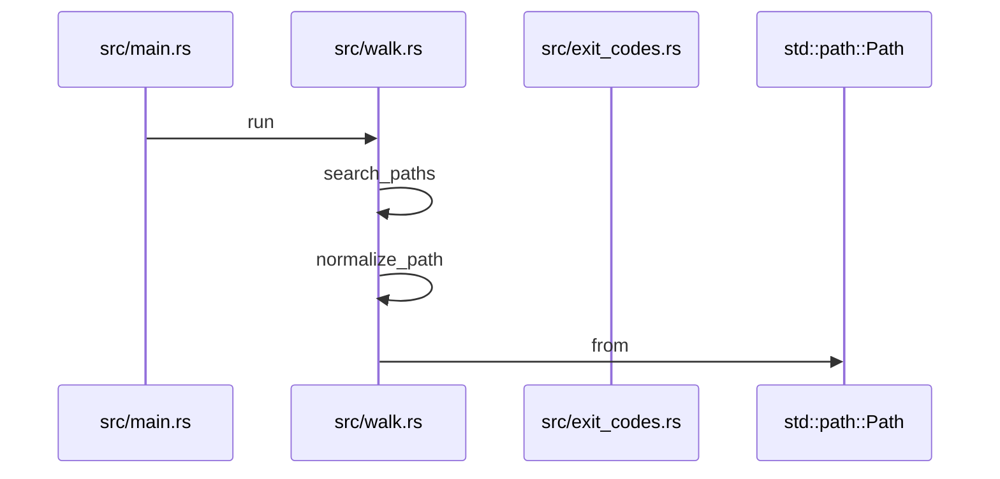
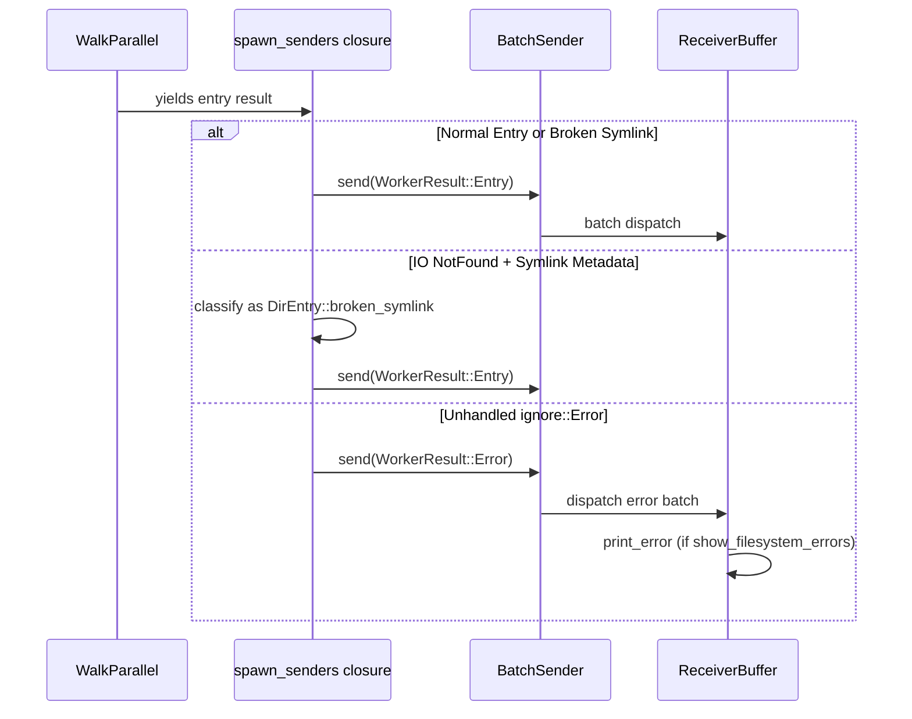
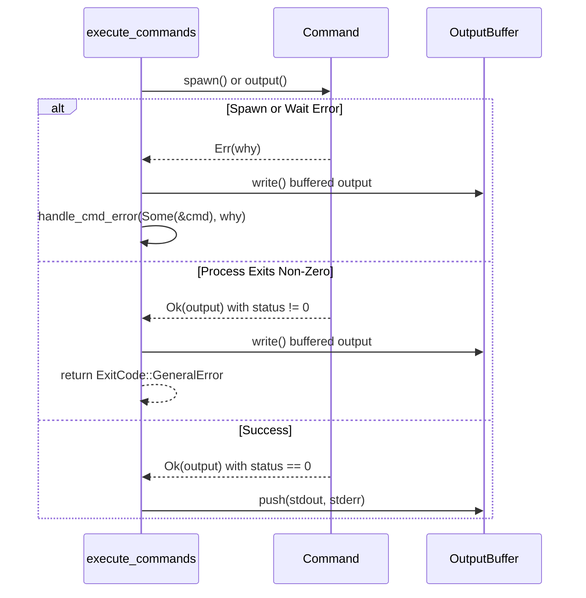
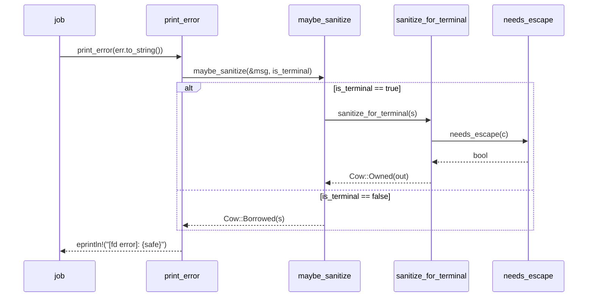

# Exit Codes & Error Handling

Relevant source files

The following files were used as context for generating this wiki page:

- [src/main.rs](https://github.com/sharkdp/fd/blob/main/src/main.rs)
- [src/walk.rs](https://github.com/sharkdp/fd/blob/main/src/walk.rs)
- [README.md](https://github.com/sharkdp/fd/blob/main/README.md)
- [src/exec/job.rs](https://github.com/sharkdp/fd/blob/main/src/exec/job.rs)
- [src/exec/mod.rs](https://github.com/sharkdp/fd/blob/main/src/exec/mod.rs)
- [src/cli.rs](https://github.com/sharkdp/fd/blob/main/src/cli.rs)
- [src/fmt/mod.rs](https://github.com/sharkdp/fd/blob/main/src/fmt/mod.rs)
- [src/exec/command.rs](https://github.com/sharkdp/fd/blob/main/src/exec/command.rs)
- [src/exit_codes.rs](https://github.com/sharkdp/fd/blob/main/src/exit_codes.rs)
- [src/filter/size.rs](https://github.com/sharkdp/fd/blob/main/src/filter/size.rs)
- [src/output.rs](https://github.com/sharkdp/fd/blob/main/src/output.rs)
- [src/fmt/input.rs](https://github.com/sharkdp/fd/blob/main/src/fmt/input.rs)
- [src/filesystem.rs](https://github.com/sharkdp/fd/blob/main/src/filesystem.rs)
- [src/hyperlink.rs](https://github.com/sharkdp/fd/blob/main/src/hyperlink.rs)
- [src/dir_entry.rs](https://github.com/sharkdp/fd/blob/main/src/dir_entry.rs)
- [src/error.rs](https://github.com/sharkdp/fd/blob/main/src/error.rs)
- [src/filter/owner.rs](https://github.com/sharkdp/fd/blob/main/src/filter/owner.rs)
- [src/sanitize.rs](https://github.com/sharkdp/fd/blob/main/src/sanitize.rs)
- [src/filetypes.rs](https://github.com/sharkdp/fd/blob/main/src/filetypes.rs)
- [Cargo.toml](https://github.com/sharkdp/fd/blob/main/Cargo.toml)
- [CONTRIBUTING.md](https://github.com/sharkdp/fd/blob/main/CONTRIBUTING.md)

## Overview

Robust error management and structured exit code reporting are fundamental to `fd`, ensuring that filesystem traversals, command executions, and CLI initialization failures are handled cleanly without crashing or corrupting the user's terminal environment. By isolating failures across concurrent search threads, capturing child process execution statuses, and sanitizing diagnostic messages against dangerous escape sequences, `fd` provides predictable and secure feedback under all operating conditions. Sources: [src/main.rs:62-72](https://github.com/sharkdp/fd/blob/main/src/main.rs#L62-L72), [src/walk.rs:227-231](https://github.com/sharkdp/fd/blob/main/src/walk.rs#L227-L231), [src/exec/command.rs:101-115](https://github.com/sharkdp/fd/blob/main/src/exec/command.rs#L101-L115), [src/exit_codes.rs:6-23](https://github.com/sharkdp/fd/blob/main/src/exit_codes.rs#L6-L23), [src/sanitize.rs:28-46](https://github.com/sharkdp/fd/blob/main/src/sanitize.rs#L28-L46), [src/error.rs:5-9](https://github.com/sharkdp/fd/blob/main/src/error.rs#L5-L9)

## Exit Status Code Management

### Overview

Exit status codes are centralized within the `ExitCode` enum, governing process termination behavior for both successful operations and error paths. When traversal threads or worker jobs conclude, their respective exit states are evaluated and merged using custom strategies to determine the final system-level integer returned to the operating system shell. Sources: [src/exit_codes.rs:6-51](https://github.com/sharkdp/fd/blob/main/src/exit_codes.rs#L6-L51), [src/walk.rs:430-432](https://github.com/sharkdp/fd/blob/main/src/walk.rs#L430-L432)

### Exit Code Representation & Mapping

The `ExitCode` enum defines four distinct operational variants: `Success`, `HasResults(bool)`, `GeneralError`, and `KilledBySigint`. Each variant maps to a specific integer status when converted via `From<ExitCode> for i32`. Sources: [src/exit_codes.rs:6-23](https://github.com/sharkdp/fd/blob/main/src/exit_codes.rs#L6-L23)

| ExitCode Variant | Numeric Value | Description |
| :--- | :--- | :--- |
| `ExitCode::Success` | `0` | Default successful execution with standard output or batch commands. |
| `ExitCode::HasResults(bool)` | `!has_results as i32` | Quiet mode (`-q` / `--has-results`): returns `0` if at least one match is found, otherwise `1`. |
| `ExitCode::GeneralError` | `1` | Fallback error status for general failures, broken pipes, or merge failures. |
| `ExitCode::KilledBySigint` | `130` | Terminated via interrupt signal (`SIGINT`), raising a default OS signal handler on Unix systems. |

Sources: [src/exit_codes.rs:6-23](https://github.com/sharkdp/fd/blob/main/src/exit_codes.rs#L6-L23), [src/cli.rs:588-601](https://github.com/sharkdp/fd/blob/main/src/cli.rs#L588-L601)

### Merging Strategy Across Threads

During parallel executions or multi-threaded background job pools (such as `--exec`), multiple `ExitCode` instances are generated across worker threads. The `merge_exitcodes` function aggregates these results by checking if any thread encountered an error status using `ExitCode::is_error`. If any individual result evaluates as an error, the entire set collapses into `ExitCode::GeneralError`; otherwise, it returns `ExitCode::Success`. Sources: [src/exit_codes.rs:26-51](https://github.com/sharkdp/fd/blob/main/src/exit_codes.rs#L26-L51), [src/walk.rs:430-432](https://github.com/sharkdp/fd/blob/main/src/walk.rs#L430-L432)

Sources: [src/main.rs:75-112](https://github.com/sharkdp/fd/blob/main/src/main.rs#L75-L112), [src/cli.rs:696-721](https://github.com/sharkdp/fd/blob/main/src/cli.rs#L696-L721), [src/cli.rs:723-736](https://github.com/sharkdp/fd/blob/main/src/cli.rs#L723-L736)

> [!NOTE]
> When `ExitCode::KilledBySigint` is invoked on Unix platforms, the process explicitly removes any active `Ctrl+C` signal handler, restores the default signal disposition via `SigHandler::SigDfl`, and re-raises `SIGINT` to ensure the host shell correctly registers the interruption signal. Sources: [src/exit_codes.rs:3-40](https://github.com/sharkdp/fd/blob/main/src/exit_codes.rs#L3-L40)

## Filesystem Traversal Error Handling

### Overview

Directory scanning operations encounter numerous runtime obstacles, including permission denied errors, missing target paths, and unreadable subdirectories. `fd` handles these conditions through a robust parallel walker integration that classifies errors at the worker boundary, manages broken symlinks explicitly, and logs filesystem warnings conditionally to standard error. Sources: [src/walk.rs:227-231](https://github.com/sharkdp/fd/blob/main/src/walk.rs#L227-L231), [src/walk.rs:485-506](https://github.com/sharkdp/fd/blob/main/src/walk.rs#L485-L506)

### Error Classification and Walk State Transitions

During parallel iteration via `WalkParallel::run`, incoming directory entries and iteration errors are intercepted by the closure spawned inside `spawn_senders`. Each event is evaluated as either a valid `DirEntry` or an `ignore::Error`. If an error occurs, `fd` inspects its structure to handle specific edge cases like broken symbolic links before falling back to general error transmission. Sources: [src/walk.rs:444-506](https://github.com/sharkdp/fd/blob/main/src/walk.rs#L444-L506)

Sources: [src/walk.rs:227-231](https://github.com/sharkdp/fd/blob/main/src/walk.rs#L227-L231), [src/walk.rs:485-506](https://github.com/sharkdp/fd/blob/main/src/walk.rs#L485-L506)

### Broken Symlink Handling

When an `ignore::Error::WithPath` variant is captured where the inner error represents an `io::ErrorKind::NotFound`, `fd` performs a secondary check on the path via `symlink_metadata()`. If the path is verified to be a symbolic link, it is transformed into a valid `DirEntry::broken_symlink(path)` instead of propagating as a fatal traversal error. Sources: [src/walk.rs:485-499](https://github.com/sharkdp/fd/blob/main/src/walk.rs#L485-L499)

> [!WARNING]
> Traversal errors that do not match the broken symlink criteria are wrapped as `WorkerResult::Error(err)` and pushed into the channel batch queue. The receiver thread checks `config.show_filesystem_errors` before printing these alerts to standard error via `print_error()`. Sources: [src/walk.rs:227-231](https://github.com/sharkdp/fd/blob/main/src/walk.rs#L227-L231), [src/walk.rs:500-505](https://github.com/sharkdp/fd/blob/main/src/walk.rs#L500-L505)

### Filesystem Error Handling Operations

| Operation / Check | Source Expression / Method | Action Taken |
| :--- | :--- | :--- |
| **Broken Symlink Detection** | `inner_err.io_error().is_some_and(\|e\| e.kind() == io::ErrorKind::NotFound) && path.symlink_metadata().ok().is_some_and(\|m\| m.file_type().is_symlink())` | Wraps path as `DirEntry::broken_symlink(path)` and continues scanning. |
| **General Read/Permission Error** | `Err(err)` | Sends `WorkerResult::Error(err)` to channel; worker continues with `WalkState::Continue` or aborts with `WalkState::Quit`. |
| **Filesystem Error Logging** | `if self.config.show_filesystem_errors { print_error(err.to_string()); }` | Emits formatted error message prefixed by `[fd error]:` to standard error when enabled. |

Sources: [src/walk.rs:227-231](https://github.com/sharkdp/fd/blob/main/src/walk.rs#L227-L231), [src/walk.rs:485-505](https://github.com/sharkdp/fd/blob/main/src/walk.rs#L485-L505), [src/error.rs:5-9](https://github.com/sharkdp/fd/blob/main/src/error.rs#L5-L9)

## Child Process Error Capture

### Overview

Child process execution failures and status code conversions occur when executing commands via the `--exec` or `--exec-batch` options. During iteration or batch building, commands can fail to spawn due to missing executables, fail at runtime with non-zero exit codes, or encounter input/output errors. `fd` catches these low-level `io::Error` and process status codes, formats helpful diagnostic messages, and translates them into centralized `ExitCode` variants. Sources: [src/exec/command.rs:59-115](https://github.com/sharkdp/fd/blob/main/src/exec/command.rs#L59-L115), [src/exec/mod.rs:90-120](https://github.com/sharkdp/fd/blob/main/src/exec/command.rs#L59-L115)

### Command Execution and Error Handling Flow

When executing commands one-by-one, `execute_commands` iterates over command results, spawns each process, and evaluates its outcome. If an `io::Error` occurs during spawning or waiting, or if the child exits with a non-zero status code, error buffers are flushed and an error exit code is returned. Sources: [src/exec/command.rs:60-99](https://github.com/sharkdp/fd/blob/main/src/exec/command.rs#L60-L99)

Sources: [src/exec/command.rs:72-95](https://github.com/sharkdp/fd/blob/main/src/exec/command.rs#L72-L95)

### Error Handling Functions and Status Conversions

The error capture layer uses dedicated functions to classify input/output errors and map them to appropriate application exit states. Specifically, `handle_cmd_error` handles `io::ErrorKind::NotFound` differently from generic I/O failures by printing a specific "Command not found" message using the program name. Sources: [src/exec/command.rs:101-115](https://github.com/sharkdp/fd/blob/main/src/exec/command.rs#L101-L115)

> [!WARNING]
> If a command's exit status code is non-zero (i.e., `output.status.code() != Some(0)`), any accumulated output buffers are immediately flushed via `output_buffer.write()`, and `ExitCode::GeneralError` is returned without evaluating remaining entries. Sources: [src/exec/command.rs:86-90](https://github.com/sharkdp/fd/blob/main/src/exec/command.rs#L86-L90)

### Child Process Error Mapping Table

| Error Condition / Trigger | Source Handler / Match Arm | Resulting Action & Exit Code |
| :--- | :--- | :--- |
| **Command Not Found** | `(Some(cmd), err) if err.kind() == io::ErrorKind::NotFound` | Prints `Command not found: rogram>` and returns `ExitCode::GeneralError`. |
| **Generic I/O Error** | `(_, err)` | Prints `Problem while executing command: {err}` and returns `ExitCode::GeneralError`. |
| **Non-Zero Exit Status** | `output.status.code() != Some(0)` | Flushes `OutputBuffer` and returns `ExitCode::GeneralError`. |
| **Batch Builder Push Failure** | `builder.push(&path, path_separator)` | Calls `handle_cmd_error(Some(&builder.cmd), e)` and returns `ExitCode::GeneralError`. |

Sources: [src/exec/command.rs:101-115](https://github.com/sharkdp/fd/blob/main/src/exec/command.rs#L101-L115), [src/exec/mod.rs:104-106](https://github.com/sharkdp/fd/blob/main/src/exec/mod.rs#L104-L106)

## Terminal Output Sanitization

### Overview

When filesystem traversal encounters errors (such as permission denied or missing directories), `fd` formats error messages and prints them to standard error. If an error message includes untrusted filenames containing terminal escape sequences, control characters, or bidirectional overrides, it could trigger terminal injection attacks (such as OSC 8 hyperlinks, OSC 52 clipboard writes, or character reordering). The sanitization subsystem inspects whether output is directed to an interactive terminal (`is_terminal`) and strips or escapes dangerous byte sequences before printing. Sources: [src/exec/job.rs:25-30](https://github.com/sharkdp/fd/blob/main/src/exec/job.rs#L25-L30), [src/error.rs:5-9](https://github.com/sharkdp/fd/blob/main/src/error.rs#L5-L9), [src/sanitize.rs:1-46](https://github.com/sharkdp/fd/blob/main/src/sanitize.rs#L1-L46)

### Call-Chain Execution Walkthrough

When a worker error is handled during traversal, the execution flows through a precise sequence of calls to inspect terminal status and sanitize text:

1. `job` — Iterates over worker results; upon encountering a `WorkerResult::Error(err)` and verifying `config.show_filesystem_errors`, calls `print_error`. Sources: [src/exec/job.rs:25-30](https://github.com/sharkdp/fd/blob/main/src/exec/job.rs#L25-L30)
2. `print_error` — Converts `err` into a `String`, queries whether standard error is an interactive terminal via `std::io::stderr().is_terminal()`, and passes both to `maybe_sanitize`. Sources: [src/error.rs:5-9](https://github.com/sharkdp/fd/blob/main/src/error.rs#L5-L9)
3. `maybe_sanitize` — Inspects the `is_terminal` boolean flag; if true, delegates to `sanitize_for_terminal`, otherwise returns a zero-copy borrowed `Cow::Borrowed`. Sources: [src/sanitize.rs:48-55](https://github.com/sharkdp/fd/blob/main/src/sanitize.rs#L48-L55)
4. `sanitize_for_terminal` — Scans the string characters via `needs_escape` and builds an owned, escaped copy if dangerous characters are found. Sources: [src/sanitize.rs:28-46](https://github.com/sharkdp/fd/blob/main/src/sanitize.rs#L28-L46)
5. `needs_escape` — Evaluates individual characters to return `true` for control codes, soft hyphens, zero-width spaces, bidi overrides, and language tags. Sources: [src/sanitize.rs:9-24](https://github.com/sharkdp/fd/blob/main/src/sanitize.rs#L9-L24)

Sources: [src/exec/job.rs:25-30](https://github.com/sharkdp/fd/blob/main/src/exec/job.rs#L25-L30), [src/error.rs:5-9](https://github.com/sharkdp/fd/blob/main/src/error.rs#L5-L9), [src/sanitize.rs:9-55](https://github.com/sharkdp/fd/blob/main/src/sanitize.rs#L9-L55)

Sources: [src/exec/job.rs:25-30](https://github.com/sharkdp/fd/blob/main/src/exec/job.rs#L25-L30), [src/error.rs:5-9](https://github.com/sharkdp/fd/blob/main/src/error.rs#L5-L9), [src/sanitize.rs:9-55](https://github.com/sharkdp/fd/blob/main/src/sanitize.rs#L9-L55)

### Sanitization Rules and Unicode Categories

The `needs_escape` function identifies specific control characters and invisible formatting ranges that pose terminal security risks. The table below outlines the categorized ranges handled by the escape scanner.

| Category / Target | Code Point Range / Value | Purpose & Threat Prevented |
| :--- | :--- | :--- |
| **Horizontal Tab** | `\t` (U+0009) | Permitted whitespace; explicitly preserved. |
| **Control Characters** | `c.is_control()` | Strips C0/C1 control codes, BEL, CR (`\r`), Null (`\0`), and DEL (`\x7F`). |
| **Soft Hyphen** | `\u{00AD}` | Invisible soft hyphen character. |
| **Mongolian Vowel Separator** | `\u{180E}` | Formatting separator whitespace. |
| **Zero-Width & BiDi Markers** | `\u{200B}`..=`\u{200F}` | Zero-width spaces, LRM, and RLM directional markers. |
| **Bidirectional Overrides** | `\u{202A}`..=`\u{202E}` | Trojan-Source style embedding and override codes (RLO/LRO) that alter text rendering order. |
| **Deprecated Formats & Joiners** | `\u{2060}`..=`\u{206F}` | Word joiner and deprecated format control characters. |
| **Zero-Width No-Break Space** | `\u{FEFF}` | Byte Order Mark / zero-width non-breaking space. |
| **Interlinear Annotations** | `\u{FFF9}`..=`\u{FFFB}` | Annotation terminators and separators. |
| **Language Tags** | `\u{E0000}`..=`\u{E007F}` | Supplementary multilingual plane language tags. |

Sources: [src/sanitize.rs:9-24](https://github.com/sharkdp/fd/blob/main/src/sanitize.rs#L9-L24)

> [!TIP]
> When output is piped to a file or another program (`is_terminal` is false), `maybe_sanitize` returns a `Cow::Borrowed` containing raw bytes without modification, preserving exact binary paths for downstream consumers. Sources: [src/sanitize.rs:48-55](https://github.com/sharkdp/fd/blob/main/src/sanitize.rs#L48-L55)

### Design Trade-Offs in Terminal Sanitization

| Design Choice | Benefit | Cost |
| :--- | :--- | :--- |
| **Conditional TTY Check (`is_terminal`)** | Zero-copy passthrough on pipes and redirects; safe output in interactive terminals. | Requires querying terminal stream state during error printing. |
| **Copy-on-Write (`Cow<'_, str>`)** | Avoids heap allocation entirely when strings contain no dangerous characters. | Slightly more complex return type handling than returning an owned `String`. |
| **Hex/Unicode Escaping (`\xNN` vs `\u{NNNN}`)** | Preserves readable inspection of malicious bytes by formatting small codes as hex and high codepoints with bracketed unicode. | Translates raw attack payloads into longer printable escape strings. |

Sources: [src/sanitize.rs:28-55](https://github.com/sharkdp/fd/blob/main/src/sanitize.rs#L28-L55)

## CLI Argument Error Handling

### Overview

Startup configuration and argument parsing errors are intercepted during the initial execution phase before filesystem traversal begins. When users supply malformed CLI flags, non-existent working directories, path-separator violations, or conflicting search arguments, `fd` halts execution, prints an error diagnostic to standard error, and returns a non-zero exit code. Sources: [src/main.rs:62-112](https://github.com/sharkdp/fd/blob/main/src/main.rs#L62-L112), [src/cli.rs:696-721](https://github.com/sharkdp/fd/blob/main/src/cli.rs#L696-L721)

### Startup Error Call-Chain Execution

Startup checks occur sequentially inside the `run` function and helper routines before any threads are spawned. The execution walkthrough follows this order:

1. `Opts::parse()` — Uses `clap` to parse command-line arguments according to the definitions in `src/cli.rs`. If parsing fails due to invalid flags, missing values, or unrecognized arguments, `clap` prints usage information and exits with an error code. Sources: [src/main.rs:76-76](https://github.com/sharkdp/fd/blob/main/src/main.rs#L76-L76), [src/cli.rs:21-693](https://github.com/sharkdp/fd/blob/main/src/cli.rs#L21-L693)
2. `set_working_dir(&opts)` — Checks if `--base-directory` was supplied via `opts.base_directory`. It verifies directory existence using `filesystem::is_existing_directory` and updates the process current working directory using `env::set_current_dir`. Sources: [src/main.rs:83-83](https://github.com/sharkdp/fd/blob/main/src/main.rs#L83-L83), [src/main.rs:131-147](https://github.com/sharkdp/fd/blob/main/src/main.rs#L131-L147)
3. `opts.search_paths()` — Resolves positional search paths or `--search-path` arguments. If none are provided, it validates the current working directory with `ensure_current_directory_exists` and normalizes paths. Sources: [src/main.rs:84-84](https://github.com/sharkdp/fd/blob/main/src/main.rs#L84-L84), [src/cli.rs:696-721](https://github.com/sharkdp/fd/blob/main/src/cli.rs#L696-L721)
4. `ensure_search_pattern_is_not_a_path(&opts)` — Inspects the primary pattern and any `--and` expressions to detect if a path separator was accidentally passed as a search pattern without `--full-path`. Sources: [src/main.rs:89-89](https://github.com/sharkdp/fd/blob/main/src/main.rs#L89-L89), [src/main.rs:169-181](https://github.com/sharkdp/fd/blob/main/src/main.rs#L169-L181)
5. `construct_config(opts, &pattern_regexps)` — Assembles the global `Config` struct, verifying size limits, time constraints, path separator byte length via `check_path_separator_length`, and color/hyperlink modes. Sources: [src/main.rs:102-102](https://github.com/sharkdp/fd/blob/main/src/main.rs#L102-L102), [src/main.rs:248-393](https://github.com/sharkdp/fd/blob/main/src/main.rs#L248-L393)

Sources: [src/main.rs:75-112](https://github.com/sharkdp/fd/blob/main/src/main.rs#L75-L112)

### Startup Validation Checks and Diagnostics

The application enforces several strict validation rules during initialization to prevent silent zero-result queries or configuration mismatches.

| Validation Check | Trigger Condition | Error Message / Action |
| :--- | :--- | :--- |
| **Empty Search Paths** | `search_paths.is_empty()` after resolution. | Aborts execution with `bail!("No valid search paths given.")`. Sources: [src/main.rs:85-87](https://github.com/sharkdp/fd/blob/main/src/main.rs#L85-L87) |
| **Path Separator in Pattern** | Pattern contains `/` (or Windows `\` pointing to a real directory) while `--full-path` is disabled. | Emits advice to use `fd . 'pattern'` or `fd --full-path 'pattern'`. Sources: [src/main.rs:169-216](https://github.com/sharkdp/fd/blob/main/src/main.rs#L169-L216) |
| **Path Separator Byte Length** | On Windows, custom `--path-separator` exceeds 1 byte in length. | Returns error: `"A path separator must be exactly one byte, but the given separator is N bytes..."`. Sources: [src/main.rs:234-246](https://github.com/sharkdp/fd/blob/main/src/main.rs#L234-L246) |
| **Leading Dot Pattern Mismatch** | On Unix, pattern matches leading-dot strings while `--hidden` is disabled. | Warns that hidden files are filtered by default and suggests `-H/--hidden`. Sources: [src/main.rs:521-539](https://github.com/sharkdp/fd/blob/main/src/main.rs#L521-L539) |
| **Invalid Base Directory** | `--base-directory` path is missing or not a directory. | Returns error: `"The '--base-directory' path '...' is not a directory."`. Sources: [src/main.rs:132-138](https://github.com/sharkdp/fd/blob/main/src/main.rs#L132-L138) |

Sources: [src/main.rs:85-87](https://github.com/sharkdp/fd/blob/main/src/main.rs#L85-L87), [src/main.rs:132-138](https://github.com/sharkdp/fd/blob/main/src/main.rs#L132-L138), [src/main.rs:169-216](https://github.com/sharkdp/fd/blob/main/src/main.rs#L169-L216), [src/main.rs:234-246](https://github.com/sharkdp/fd/blob/main/src/main.rs#L234-L246), [src/main.rs:521-539](https://github.com/sharkdp/fd/blob/main/src/main.rs#L521-L539)

> [!WARNING]
> On Windows, path separator validation for search patterns permits backslashes (`\`) only when the pattern successfully resolves to an existing directory via `Path::new(pattern).is_dir()`. This allows valid regex escape sequences like `\d+` or `\Ac` to execute without false positives. Sources: [src/main.rs:197-202](https://github.com/sharkdp/fd/blob/main/src/main.rs#L197-L202)

### Design Trade-Offs in Startup Verification

| Design Choice | Benefit | Cost |
| :--- | :--- | :--- |
| **Pre-Traversal Path Validation** | Catches missing directories and malformed paths immediately before launching worker threads. | Adds filesystem stat calls (`is_dir`, `is_existing_directory`) to startup sequence. |
| **Smart-Case Dynamic Inference** | Automatically switches case sensitivity based on uppercase characters in any search expression. | Requires compiling pattern regexes or scanning strings prior to config construction. |
| **Path-Separator Pattern Check** | Prevents the common user mistake of passing a full directory path as a search pattern. | Requires platform-specific branching for Windows backslash handling vs Unix forward slashes. |

Sources: [src/main.rs:83-104](https://github.com/sharkdp/fd/blob/main/src/main.rs#L83-L104), [src/main.rs:169-216](https://github.com/sharkdp/fd/blob/main/src/main.rs#L169-L216), [src/main.rs:251-255](https://github.com/sharkdp/fd/blob/main/src/main.rs#L251-L255)

## Related

- [[Result Output]]
- [[Parallel Directory Traversal]]

