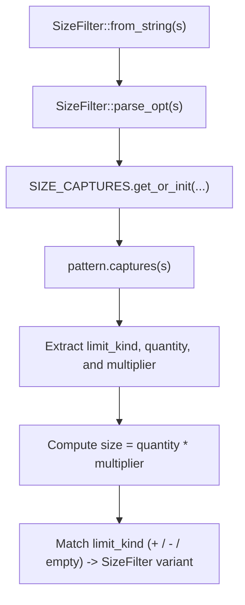

# File Size Filtering

<details>
<summary>Relevant source files</summary>

The following files were used as context for generating this wiki page:

- [src/main.rs](https://github.com/sharkdp/fd/blob/main/src/main.rs)
- [src/walk.rs](https://github.com/sharkdp/fd/blob/main/src/walk.rs)
- [src/cli.rs](https://github.com/sharkdp/fd/blob/main/src/cli.rs)
- [README.md](https://github.com/sharkdp/fd/blob/main/README.md)
- [src/filter/size.rs](https://github.com/sharkdp/fd/blob/main/src/filter/size.rs)
- [src/exec/job.rs](https://github.com/sharkdp/fd/blob/main/src/exec/job.rs)
- [src/fmt/mod.rs](https://github.com/sharkdp/fd/blob/main/src/fmt/mod.rs)
- [src/exec/mod.rs](https://github.com/sharkdp/fd/blob/main/src/exec/mod.rs)
- [src/filter/owner.rs](https://github.com/sharkdp/fd/blob/main/src/filter/owner.rs)
- [src/output.rs](https://github.com/sharkdp/fd/blob/main/src/output.rs)
- [src/filter/time.rs](https://github.com/sharkdp/fd/blob/main/src/filter/time.rs)
- [src/fmt/input.rs](https://github.com/sharkdp/fd/blob/main/src/fmt/input.rs)
- [src/dir_entry.rs](https://github.com/sharkdp/fd/blob/main/src/dir_entry.rs)
- [src/filetypes.rs](https://github.com/sharkdp/fd/blob/main/src/filetypes.rs)
- [src/regex_helper.rs](https://github.com/sharkdp/fd/blob/main/src/regex_helper.rs)
- [src/filter/mod.rs](https://github.com/sharkdp/fd/blob/main/src/filter/mod.rs)
- [src/filesystem.rs](https://github.com/sharkdp/fd/blob/main/src/filesystem.rs)
- [src/hyperlink.rs](https://github.com/sharkdp/fd/blob/main/src/hyperlink.rs)
- [src/config.rs](https://github.com/sharkdp/fd/blob/main/src/config.rs)
- [Cargo.toml](https://github.com/sharkdp/fd/blob/main/Cargo.toml)
</details>

## Overview

File size filtering enables precision control during directory traversals by restricting search outputs to files matching specific byte or unit-based boundaries. This subsystem integrates directly into the broader filtering architecture, allowing operators to scope searches by maximum limits, minimum thresholds, or exact sizes alongside time, owner, and filetype constraints. Sources: [src/cli.rs:395-417](https://github.com/sharkdp/fd/blob/main/src/cli.rs#L395-L417)

Sources: [src/walk.rs:557-575](https://github.com/sharkdp/fd/blob/main/src/walk.rs#L557-L575)

## CLI Size Option Parsing

### Overview

Command-line size options in *fd* are defined in the `Opts` struct via clap integration, mapping directly to `SizeFilter` collections that control filtering constraints. When parsing user input, the `--size` (or `-S`) flag accepts strings containing optional comparison operators and unit designators, delegating parsing to `SizeFilter::from_string`. Sources: [src/cli.rs:395-417](https://github.com/sharkdp/fd/blob/main/src/cli.rs#L395-L417)

### CLI Argument Definition

The size option is configured as a vector of `SizeFilter` items supporting negative sign values, custom name tags, and verbatim documentation strings. Sources: [src/cli.rs:412-417](https://github.com/sharkdp/fd/blob/main/src/cli.rs#L412-L417)

| Argument Field | Details | Sources |
| :--- | :--- | :--- |
| Long / Short Flag | `--size` / `-S` | [src/cli.rs:412-417](https://github.com/sharkdp/fd/blob/main/src/cli.rs#L412-L417) |
| Value Parser | `SizeFilter::from_string` | [src/cli.rs:412-412](https://github.com/sharkdp/fd/blob/main/src/cli.rs#L412-L412) |
| Value Name | `size` | [src/cli.rs:412-412](https://github.com/sharkdp/fd/blob/main/src/cli.rs#L412-L412) |
| Field Type | `Vec<SizeFilter>` | [src/cli.rs:417-417](https://github.com/sharkdp/fd/blob/main/src/cli.rs#L417-L417) |

Sources: [src/cli.rs:412-417](https://github.com/sharkdp/fd/blob/main/src/cli.rs#L412-L417)

### Configuration Pipeline

During application startup, command-line options parsed into `Opts` are transformed into an internal `Config` instance. The raw size limits vector is extracted and transferred into the configuration structure via `std::mem::take`. Sources: [src/main.rs:248-266](https://github.com/sharkdp/fd/blob/main/src/main.rs#L248-L266)

```rust
fn construct_config(mut opts: Opts, pattern_regexps: &[String]) -> Result<Config> {
    // ...
    let size_limits = std::mem::take(&mut opts.size);
    // ...
    Ok(Config {
        // ...
        size_constraints: size_limits,
        // ...
    })
}
```
Sources: [src/main.rs:380-382](https://github.com/sharkdp/fd/blob/main/src/main.rs#L380-L382)

> [!NOTE]
> The `prune` option explicitly conflicts with the `size` option configuration. Attempting to pass both `--prune` and `--size` on the command line triggers a clap parsing conflict. Sources: [src/cli.rs:328-331](https://github.com/sharkdp/fd/blob/main/src/cli.rs#L328-L331)

## Size Filter Construction and Parsing

### Overview

The internal representation of size filtering relies on the `SizeFilter` enum, which categorizes size checks into three variant types: `Max(u64)`, `Min(u64)`, and `Equals(u64)`. Each variant holds a raw byte quantity used when evaluating file metadata during traversal. Sources: [src/filter/size.rs:8-13](https://github.com/sharkdp/fd/blob/main/src/filter/size.rs#L8-L13)

### Enum Variants and Base Multipliers

`SizeFilter` distinguishes between inclusive maximum caps, inclusive minimum thresholds, and precise equality checks. The parsing engine maps textual units to absolute byte values using SI decimal multipliers (powers of 10) and binary multipliers (powers of 2). Sources: [src/filter/size.rs:15-25](https://github.com/sharkdp/fd/blob/main/src/filter/size.rs#L15-L25)

| Constant Name | Multiplier Value | Base / Unit Type | Sources |
| :--- | :--- | :--- | :--- |
| `KILO` | `1000` | SI decimal (10 to the 3rd power) | [src/filter/size.rs:16-16](https://github.com/sharkdp/fd/blob/main/src/filter/size.rs#L16-L16) |
| `MEGA` | `1000000` | SI decimal (10 to the 6th power) | [src/filter/size.rs:17-17](https://github.com/sharkdp/fd/blob/main/src/filter/size.rs#L17-L17) |
| `GIGA` | `1000000000` | SI decimal (10 to the 9th power) | [src/filter/size.rs:18-18](https://github.com/sharkdp/fd/blob/main/src/filter/size.rs#L18-L18) |
| `TERA` | `1000000000000` | SI decimal (10 to the 12th power) | [src/filter/size.rs:19-19](https://github.com/sharkdp/fd/blob/main/src/filter/size.rs#L19-L19) |
| `KIBI` | `1024` | Binary (2 to the 10th power) | [src/filter/size.rs:22-22](https://github.com/sharkdp/fd/blob/main/src/filter/size.rs#L22-L22) |
| `MEBI` | `1048576` | Binary (2 to the 20th power) | [src/filter/size.rs:23-23](https://github.com/sharkdp/fd/blob/main/src/filter/size.rs#L23-L23) |
| `GIBI` | `1073741824` | Binary (2 to the 30th power) | [src/filter/size.rs:24-24](https://github.com/sharkdp/fd/blob/main/src/filter/size.rs#L24-L24) |
| `TEBI` | `1099511627776` | Binary (2 to the 40th power) | [src/filter/size.rs:25-25](https://github.com/sharkdp/fd/blob/main/src/filter/size.rs#L25-L25) |

Sources: [src/filter/size.rs:15-25](https://github.com/sharkdp/fd/blob/main/src/filter/size.rs#L15-L25)

### String Parsing Call-Chain Execution

String inputs undergo transformation via a cached regular expression parser. The parsing operation flows through a specific sequence of internal functions and validation checks. Sources: [src/filter/size.rs:28-66](https://github.com/sharkdp/fd/blob/main/src/filter/size.rs#L28-L66)


Sources: [src/filter/size.rs:28-66](https://github.com/sharkdp/fd/blob/main/src/filter/size.rs#L28-L66)

During execution, `SizeFilter::from_string` wraps `parse_opt`, converting a `None` result into an `anyhow::Result` error containing diagnostic text. The underlying regex pattern validates string structures matching optional sign prefixes, numeric quantities, and unit identifiers. Sources: [src/filter/size.rs:28-38](https://github.com/sharkdp/fd/blob/main/src/filter/size.rs#L28-L38)

> [!WARNING]
> The regex matcher compiles lazily into a thread-safe `OnceLock<Regex>` static cache on first use. Invalid formats such as missing digits, unrecognized unit suffixes, or malformed double-suffixes fail validation and return `None` during `parse_opt`. Sources: [src/filter/size.rs:6-7](https://github.com/sharkdp/fd/blob/main/src/filter/size.rs#L6-L7)

Sources: [src/filter/size.rs:33-38](https://github.com/sharkdp/fd/blob/main/src/filter/size.rs#L33-L38)

Sources: [src/filter/size.rs:183-194](https://github.com/sharkdp/fd/blob/main/src/filter/size.rs#L183-L194)

### Evaluation Logic

Once constructed, a `SizeFilter` instance evaluates target file byte lengths via the `is_within` method. This method compares the provided `u64` file size against the internal limit according to the active enum variant. Sources: [src/filter/size.rs:68-74](https://github.com/sharkdp/fd/blob/main/src/filter/size.rs#L68-L74)

Sources: [src/filter/size.rs:68-74](https://github.com/sharkdp/fd/blob/main/src/filter/size.rs#L68-L74)

Sources: [src/filter/size.rs:68-74](https://github.com/sharkdp/fd/blob/main/src/filter/size.rs#L68-L74)

## Directory Entry Size Verification

### Overview

During parallel filesystem traversal, discovered entries undergo rigorous filtering checks before being queued for output or execution. The worker threads spawned by `WorkerState::spawn_senders` evaluate each `DirEntry` against size constraints stored in the configuration object. Sources: [src/walk.rs:443-444](https://github.com/sharkdp/fd/blob/main/src/walk.rs#L443-L444)

Sources: [src/walk.rs:557-559](https://github.com/sharkdp/fd/blob/main/src/walk.rs#L557-L559)

### Entry Size Verification Flow

When size constraints are active, traversal execution inspects path attributes to guarantee that size limits apply strictly to regular files. The verification call chain flows through specific inspection methods on path objects and directory entries. Sources: [src/walk.rs:557-575](https://github.com/sharkdp/fd/blob/main/src/walk.rs#L557-L575)

```mermaid
graph TD
    A["WalkParallel visitor callback"] --> B["entry_path.is_file()"]
    B -->|Yes| C["entry.metadata()"]
    C -->|Some(metadata)| D["metadata.len()"]
    D --> E["config.size_constraints.iter().any(...)"]
    E -->|Fails constraint| F["Return WalkState::Continue"]
    E -->|Passes constraint| G["Proceed to next filter stage"]
    B -->|No| H["Return WalkState::Continue"]
    C -->|None| I["Return WalkState::Continue"]
```
Sources: [src/walk.rs:557-575](https://github.com/sharkdp/fd/blob/main/src/walk.rs#L557-L575)

The verification process executes an ordered sequence of checks verifying regular file status, retrieving cached metadata, extracting byte lengths, and evaluating constraints. Sources: [src/walk.rs:557-575](https://github.com/sharkdp/fd/blob/main/src/walk.rs#L557-L575)

> [!WARNING]
> If a file's metadata cannot be retrieved due to permission errors or race conditions during traversal, the size verification check fails safe by rejecting the entry with `WalkState::Continue`. Sources: [src/walk.rs:569-571](https://github.com/sharkdp/fd/blob/main/src/walk.rs#L569-L571)

> [!NOTE]
> `DirEntry::metadata` uses an internal cell structure. Subsequent filter stages reuse this cached metadata lookup without triggering additional operating system `stat` calls. Sources: [src/dir_entry.rs:18-22](https://github.com/sharkdp/fd/blob/main/src/dir_entry.rs#L18-L22)

Sources: [src/dir_entry.rs:89-96](https://github.com/sharkdp/fd/blob/main/src/dir_entry.rs#L89-L96)

## Filter Pipeline and Type Constraints

### Overview

Beyond file size constraints, `fd` provides auxiliary filtering subsystems that enforce file type restrictions, ownership criteria, and modification time boundaries. These criteria cooperate within the directory traversal pipeline to prune traversal candidates before they reach output formatting or execution stages. Sources: [src/filetypes.rs:8-18](https://github.com/sharkdp/fd/blob/main/src/filetypes.rs#L8-L18)

Sources: [src/filter/owner.rs:6-9](https://github.com/sharkdp/fd/blob/main/src/filter/owner.rs#L6-L9)

Sources: [src/filter/time.rs:7-10](https://github.com/sharkdp/fd/blob/main/src/filter/time.rs#L7-L10)

### File Type Constraints

The `FileTypes` structure maintains boolean flags governing which entry categories to display or ignore during traversal. Each entry's file type is inspected against these permissions via the `should_ignore` method. Sources: [src/filetypes.rs:7-18](https://github.com/sharkdp/fd/blob/main/src/filetypes.rs#L7-L18)

Sources: [src/filetypes.rs:21-22](https://github.com/sharkdp/fd/blob/main/src/filetypes.rs#L21-L22)

| Field Name | Type | Purpose | Sources |
| :--- | :--- | :--- | :--- |
| `files` | `bool` | Include or exclude standard regular files | [src/filetypes.rs:9-9](https://github.com/sharkdp/fd/blob/main/src/filetypes.rs#L9-L9) |
| `directories` | `bool` | Include or exclude directory entries | [src/filetypes.rs:10-10](https://github.com/sharkdp/fd/blob/main/src/filetypes.rs#L10-L10) |
| `symlinks` | `bool` | Include or exclude symbolic links | [src/filetypes.rs:11-11](https://github.com/sharkdp/fd/blob/main/src/filetypes.rs#L11-L11) |
| `block_devices` | `bool` | Include or exclude block device files | [src/filetypes.rs:12-12](https://github.com/sharkdp/fd/blob/main/src/filetypes.rs#L12-L12) |
| `char_devices` | `bool` | Include or exclude character device files | [src/filetypes.rs:13-13](https://github.com/sharkdp/fd/blob/main/src/filetypes.rs#L13-L13) |
| `sockets` | `bool` | Include or exclude Unix domain sockets | [src/filetypes.rs:14-14](https://github.com/sharkdp/fd/blob/main/src/filetypes.rs#L14-L14) |
| `pipes` | `bool` | Include or exclude FIFO named pipes | [src/filetypes.rs:15-15](https://github.com/sharkdp/fd/blob/main/src/filetypes.rs#L15-L15) |
| `executables_only` | `bool` | Restrict results strictly to executable paths | [src/filetypes.rs:16-16](https://github.com/sharkdp/fd/blob/main/src/filetypes.rs#L16-L16) |
| `empty_only` | `bool` | Restrict results strictly to empty files or directories | [src/filetypes.rs:17-17](https://github.com/sharkdp/fd/blob/main/src/filetypes.rs#L17-L17) |

Sources: [src/filetypes.rs:8-18](https://github.com/sharkdp/fd/blob/main/src/filetypes.rs#L8-L18)

> [!NOTE]
> The `should_ignore` evaluation logic returns `true` if an entry type fails to match any enabled category flag, or if specialized predicates evaluate to false. Sources: [src/filetypes.rs:21-42](https://github.com/sharkdp/fd/blob/main/src/filetypes.rs#L21-L42)

### Owner and Time Filter Mechanics

The `OwnerFilter` structure evaluates Unix user ID and group ID restrictions, supporting negative matching via prefix rules. Sources: [src/filter/owner.rs:6-9](https://github.com/sharkdp/fd/blob/main/src/filter/owner.rs#L6-L9)

Sources: [src/filter/owner.rs:27-58](https://github.com/sharkdp/fd/blob/main/src/filter/owner.rs#L27-L58)

Sources: [src/filter/owner.rs:91-93](https://github.com/sharkdp/fd/blob/main/src/filter/owner.rs#L91-L93)

The internal check mechanism relies on the `Check<T>` enum, which resolves equality, inequality, or ignore states. Sources: [src/filter/owner.rs:13-15](https://github.com/sharkdp/fd/blob/main/src/filter/owner.rs#L13-L15)

Sources: [src/filter/owner.rs:79-81](https://github.com/sharkdp/fd/blob/main/src/filter/owner.rs#L79-L81)

Simultaneously, `TimeFilter` supports filtering modification timestamps relative to duration spans, fixed timestamps, calendar datetimes, or Unix epoch seconds. Sources: [src/filter/time.rs:7-10](https://github.com/sharkdp/fd/blob/main/src/filter/time.rs#L7-L10)

Sources: [src/filter/time.rs:29-47](https://github.com/sharkdp/fd/blob/main/src/filter/time.rs#L29-L47)

Sources: [src/filter/time.rs:57-62](https://github.com/sharkdp/fd/blob/main/src/filter/time.rs#L57-L62)

> [!TIP]
> `OwnerFilter::filter_ignore` checks if both UID and GID checks are set to ignore, returning `None` in that case to completely avoid performing unnecessary owner lookup syscalls during traversal. Sources: [src/filter/owner.rs:60-67](https://github.com/sharkdp/fd/blob/main/src/filter/owner.rs#L60-L67)

## Filtered Result Processing and Output

### Overview

Once entries pass filesystem size thresholds and metadata filters, they flow into output generation or command execution subsystems. `fd` handles these matching results through either standard terminal output formatting or parallel command execution via `job` and `batch` runners. Sources: [src/exec/job.rs:11-64](https://github.com/sharkdp/fd/blob/main/src/exec/job.rs#L11-L64)

Sources: [src/output.rs:17-43](https://github.com/sharkdp/fd/blob/main/src/output.rs#L17-L43)

### Output Formatting and Hyperlinks

The output pipeline processes individual directory entries through `print_entry`, which configures terminal hyperlinks and handles formatting, colorization, or raw byte streams. Sources: [src/output.rs:17-43](https://github.com/sharkdp/fd/blob/main/src/output.rs#L17-L43)

| Function | Purpose | Sources |
| :--- | :--- | :--- |
| `print_entry` | Coordinates hyperlink wrapping, format selection, and line/null termination. | [src/output.rs:17-43](https://github.com/sharkdp/fd/blob/main/src/output.rs#L17-L43) |
| `print_entry_format` | Generates text using custom format templates and sanitizes unsafe output. | [src/output.rs:69-86](https://github.com/sharkdp/fd/blob/main/src/output.rs#L69-L86) |
| `print_entry_colorized` | Applies styling to parent paths, base names, and directory indicators. | [src/output.rs:89-139](https://github.com/sharkdp/fd/blob/main/src/output.rs#L89-L139) |
| `print_entry_uncolorized` | Emits uncolorized paths, using raw bytes on Unix piped streams to preserve non-UTF-8 filenames. | [src/output.rs:142-182](https://github.com/sharkdp/fd/blob/main/src/output.rs#L142-L182) |

Sources: [src/output.rs:17-182](https://github.com/sharkdp/fd/blob/main/src/output.rs#L17-L182)

> [!NOTE]
> When hyperlinks are enabled, absolute paths are wrapped in OSC 8 ANSI hyperlink escape sequences before being passed to downstream formatters. Sources: [src/output.rs:18-24](https://github.com/sharkdp/fd/blob/main/src/output.rs#L18-L24)

Sources: [src/hyperlink.rs:8-11](https://github.com/sharkdp/fd/blob/main/src/hyperlink.rs#L8-L11)

### Command Execution and Batching

When command execution options like `-x` or `-X` are requested, filtered entries are dispatched to either `job()` for individual execution or `batch()` for batched arguments. Sources: [src/exec/job.rs:11-64](https://github.com/sharkdp/fd/blob/main/src/exec/job.rs#L11-L64)

The call-chain sequence for individual result execution flows from `job()` extracting entries, stripping prefixes, generating commands, and invoking execution handlers. Sources: [src/exec/job.rs:20-41](https://github.com/sharkdp/fd/blob/main/src/exec/job.rs#L20-L41)

Sources: [src/exec/mod.rs:76-88](https://github.com/sharkdp/fd/blob/main/src/exec/mod.rs#L76-L88)

In batch mode, `batch()` collects stripped paths via `CommandBuilder`, tracking argument limits and process exit codes before merging them. Sources: [src/exec/job.rs:46-64](https://github.com/sharkdp/fd/blob/main/src/exec/job.rs#L46-L64)

Sources: [src/exec/mod.rs:90-120](https://github.com/sharkdp/fd/blob/main/src/exec/mod.rs#L90-L120)

| Design Choice | Benefit | Cost | Sources |
| :--- | :--- | :--- | :--- |
| **Buffered output per thread** | Prevents terminal interleaving and garbled output across parallel threads. | Requires memory buffering prior to stdout writes when threads > 1. | [src/exec/job.rs:17-39](https://github.com/sharkdp/fd/blob/main/src/exec/job.rs#L17-L39) |
| **Raw byte writing on Unix pipes** | Preserves invalid UTF-8 filenames intact for downstream CLI tools. | Bypasses standard UTF-8 string conversions for non-interactive streams. | [src/output.rs:167-182](https://github.com/sharkdp/fd/blob/main/src/output.rs#L167-L182) |
| **Command argument fitting checks** | Automatically flushes and spawns batch processes before hitting system argument limits. | Adds overhead to track argument counts and lengths during batch accumulation. | [src/exec/mod.rs:90-119](https://github.com/sharkdp/fd/blob/main/src/exec/mod.rs#L90-L119) |

Sources: [src/exec/mod.rs:173-189](https://github.com/sharkdp/fd/blob/main/src/exec/mod.rs#L173-L189)

Sources: [README.md:212-213](https://github.com/sharkdp/fd/blob/main/README.md#L212-L213)

## Related

- [[Type & Extension Filtering]]
- [[Time-Based Filtering]]

