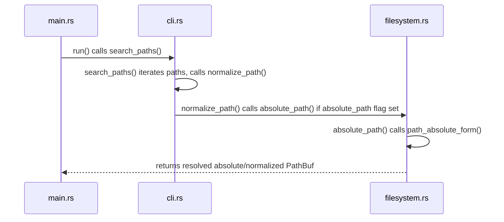
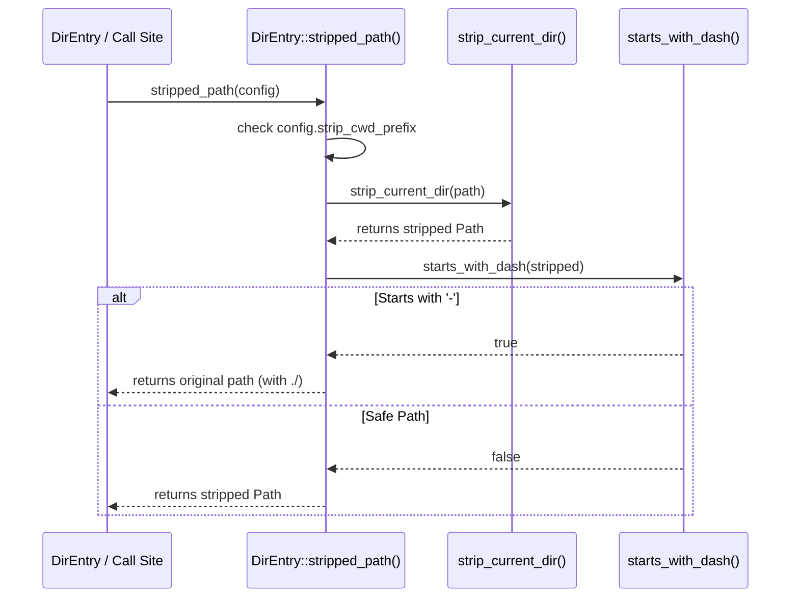
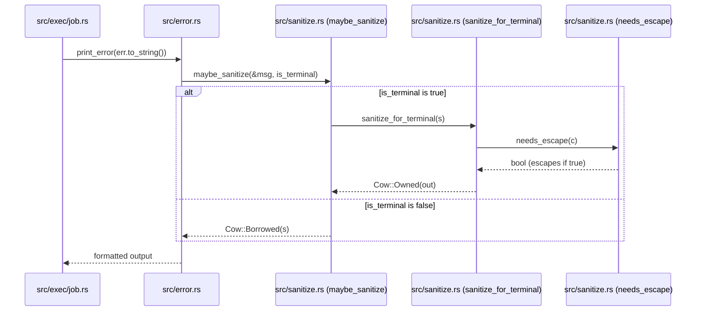
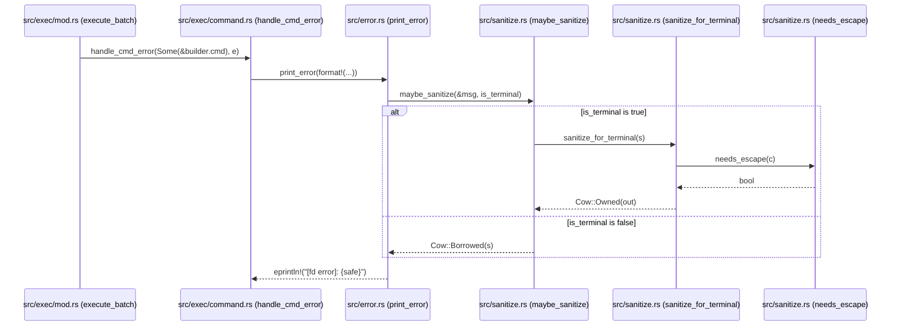

# Filesystem Utilities

<details>
<summary>Relevant source files</summary>

The following files were used as context for generating this wiki page:

- [src/main.rs](https://github.com/sharkdp/fd/blob/main/src/main.rs)
- [src/cli.rs](https://github.com/sharkdp/fd/blob/main/src/cli.rs)
- [README.md](https://github.com/sharkdp/fd/blob/main/README.md)
- [src/fmt/mod.rs](https://github.com/sharkdp/fd/blob/main/src/fmt/mod.rs)
- [Cargo.toml](https://github.com/sharkdp/fd/blob/main/Cargo.toml)
- [src/fmt/input.rs](https://github.com/sharkdp/fd/blob/main/src/fmt/input.rs)
- [src/filesystem.rs](https://github.com/sharkdp/fd/blob/main/src/filesystem.rs)
- [src/hyperlink.rs](https://github.com/sharkdp/fd/blob/main/src/hyperlink.rs)
- [src/output.rs](https://github.com/sharkdp/fd/blob/main/src/output.rs)
- [src/dir_entry.rs](https://github.com/sharkdp/fd/blob/main/src/dir_entry.rs)
- [src/sanitize.rs](https://github.com/sharkdp/fd/blob/main/src/sanitize.rs)
- [doc/sponsors.md](https://github.com/sharkdp/fd/blob/main/doc/sponsors.md)
- [src/filter/owner.rs](https://github.com/sharkdp/fd/blob/main/src/filter/owner.rs)
- [src/error.rs](https://github.com/sharkdp/fd/blob/main/src/error.rs)
- [src/filter/size.rs](https://github.com/sharkdp/fd/blob/main/src/filter/size.rs)
- [CONTRIBUTING.md](https://github.com/sharkdp/fd/blob/main/CONTRIBUTING.md)
- [SECURITY.md](https://github.com/sharkdp/fd/blob/main/SECURITY.md)
- [src/config.rs](https://github.com/sharkdp/fd/blob/main/src/config.rs)
- [src/exec/command.rs](https://github.com/sharkdp/fd/blob/main/src/exec/command.rs)
- [src/exec/job.rs](https://github.com/sharkdp/fd/blob/main/src/exec/job.rs)
- [src/exec/mod.rs](https://github.com/sharkdp/fd/blob/main/src/exec/mod.rs)
</details>

## Overview

The filesystem utilities layer provides core path processing, normalization, sanitization, and formatting capabilities that bridge underlying directory traversal engines with terminal display mechanisms and external command execution pipelines. It acts as the central subsystem responsible for interpreting user-specified search roots, decomposing and manipulating directory entry components, shielding terminal output against ANSI injection attacks, and encoding path strings into standardized template representations or file URIs.

Sources: [src/cli.rs:723-736](https://github.com/sharkdp/fd/blob/main/src/cli.rs#L723-L736), [src/dir_entry.rs:59-71](https://github.com/sharkdp/fd/blob/main/src/dir_entry.rs#L59-L71), [src/filesystem.rs:14-36](https://github.com/sharkdp/fd/blob/main/src/filesystem.rs#L14-L36), [src/fmt/mod.rs:112-141](https://github.com/sharkdp/fd/blob/main/src/fmt/mod.rs#L112-L141), [src/hyperlink.rs:5-22](https://github.com/sharkdp/fd/blob/main/src/hyperlink.rs#L5-L22), [src/sanitize.rs:28-55](https://github.com/sharkdp/fd/blob/main/src/sanitize.rs#L28-L55)

## Path Resolution and Canonicalization

### Overview

Path resolution and canonicalization processes user-supplied search roots from command line arguments, validates their existence on disk, and constructs normalized relative or absolute path representations suitable for filesystem traversal and output formatting across diverse operating systems.

Sources: [src/cli.rs:696-721](https://github.com/sharkdp/fd/blob/main/src/cli.rs#L696-L721), [src/filesystem.rs:14-36](https://github.com/sharkdp/fd/blob/main/src/filesystem.rs#L14-L36)

### Search Path Resolution Walkthrough

The pipeline for processing user-specified search roots follows an explicit sequence of calls starting from application initialization down to absolute form construction:

1. `run` initiates execution parsing in `src/main.rs`, invoking search path retrieval on options. Sources: [src/main.rs:84-84](https://github.com/sharkdp/fd/blob/main/src/main.rs#L84-L84)
2. `search_paths` in `src/cli.rs` evaluates positional and `--search-path` arguments, filtering non-directory paths and invoking normalization on valid entries. Sources: [src/cli.rs:696-721](https://github.com/sharkdp/fd/blob/main/src/cli.rs#L696-L721)
3. `normalize_path` inspects whether absolute paths are requested via `--absolute-path` or normalizes special tokens like `.` and `-`. Sources: [src/cli.rs:723-736](https://github.com/sharkdp/fd/blob/main/src/cli.rs#L723-L736)
4. `absolute_path` in `src/filesystem.rs` receives normalized paths and strips Windows extended-length path prefixes (`\\?\`) when running on Windows targets. Sources: [src/filesystem.rs:23-36](https://github.com/sharkdp/fd/blob/main/src/filesystem.rs#L23-L36)
5. `path_absolute_form` in `src/filesystem.rs` checks if the path is already absolute, or strips leading current-directory dots and joins the remaining suffix with the current working directory returned by `env::current_dir()`. Sources: [src/filesystem.rs:14-21](https://github.com/sharkdp/fd/blob/main/src/filesystem.rs#L14-L21)



Sources: [src/main.rs:84-84](https://github.com/sharkdp/fd/blob/main/src/main.rs#L84-L84), [src/cli.rs:696-736](https://github.com/sharkdp/fd/blob/main/src/cli.rs#L696-L736), [src/filesystem.rs:14-36](https://github.com/sharkdp/fd/blob/main/src/filesystem.rs#L14-L36)

### Canonicalization and Path Operations

| Function Name | File | Signature | Purpose |
| :--- | :--- | :--- | :--- |
| `path_absolute_form` | `src/filesystem.rs` | `pub fn path_absolute_form(path: &Path) -> io::ResultathBuf>` | Converts relative paths to absolute form by joining with `env::current_dir()`. |
| `absolute_path` | `src/filesystem.rs` | `pub fn absolute_path(path: &Path) -> io::ResultathBuf>` | Wraps `path_absolute_form` and strips Windows `\\?\` prefixes. |
| `is_existing_directory` | `src/filesystem.rs` | `pub fn is_existing_directory(path: &Path) -> bool` | Checks directory existence using `is_dir()` and normalized checks rather than `.exists()`. |
| `normalize_path` | `src/cli.rs` | `fn normalize_path(&self, path: &Path) -> PathBuf` | Adjusts path formatting based on `--absolute-path` flag and special markers like `.` or `-`. |
| `search_paths` | `src/cli.rs` | `pub fn search_paths(&self) -> anyhow::Result<VecathBuf>>` | Gathers and validates search roots from positional arguments or `--search-path`. |

Sources: [src/cli.rs:696-736](https://github.com/sharkdp/fd/blob/main/src/cli.rs#L696-L736), [src/filesystem.rs:14-42](https://github.com/sharkdp/fd/blob/main/src/filesystem.rs#L14-L42)

> [!NOTE]
> `is_existing_directory` intentionally avoids using `.exists()` because `.` always evaluates as existing even if the current working directory has been deleted from the underlying filesystem.
> Sources: [src/filesystem.rs:38-42](https://github.com/sharkdp/fd/blob/main/src/filesystem.rs#L38-L42)

### Design Trade-Offs

| Design Choice | Benefit | Cost |
| :--- | :--- | :--- |
| Normpath integration (`normpath::PathExt`) | Provides robust component normalization and symlink resolution across operating systems. | Introduces external crate dependency and overhead for path validation steps. |
| Stripping Windows `\\?\` prefix | Yields cleaner absolute paths in terminal output on Windows. | Requires additional string processing overhead on every absolute path query. |
| Fallback to `./` when paths are empty | Guarantees safe default traversal inside current directory when no arguments are provided. | Requires handling edge cases where working directory state changes or gets deleted. |

Sources: [src/cli.rs:702-706](https://github.com/sharkdp/fd/blob/main/src/cli.rs#L702-L706), [src/filesystem.rs:23-36](https://github.com/sharkdp/fd/blob/main/src/filesystem.rs#L23-L36)

## Directory Entry Path Manipulation

### Overview

Directory entry path manipulation centers around representing entries, stripping redundant current-directory prefixes, and transforming path components for terminal presentation. The `DirEntry` structure abstracts over normal directory entries and broken symlinks, coordinating with configuration flags to decide whether prefix stripping is safe. Sources: [src/dir_entry.rs:11-22](https://github.com/sharkdp/fd/blob/main/src/dir_entry.rs#L11-L22), [src/dir_entry.rs:59-71](https://github.com/sharkdp/fd/blob/main/src/dir_entry.rs#L59-L71)

### Prefix Stripping and Dash Protection

Path formatting utilities in `src/filesystem.rs` and `src/dir_entry.rs` manage relative path conversion and prefix safety. Specifically, `strip_current_dir` removes any leading `./` prefix from a path. When presenting paths to the user under a configuration where `strip_cwd_prefix` is enabled, `DirEntry::stripped_path` guards against rendering paths that start with a dash character (`-`). If stripping `./` would result in a path starting with `-`, the original path with `./` is preserved to prevent downstream command-line parsers from misinterpreting the filename as an option flag. Sources: [src/filesystem.rs:118-121](https://github.com/sharkdp/fd/blob/main/src/filesystem.rs#L118-L121), [src/dir_entry.rs:59-71](https://github.com/sharkdp/fd/blob/main/src/dir_entry.rs#L59-L71)

> [!WARNING]
> Stripping the current-directory prefix (`./`) from a file named `-rf` would yield `-rf`, which downstream tools might mistake for a command-line flag. `DirEntry::stripped_path` explicitly checks `starts_with_dash` and retains the `./` prefix when this condition occurs.
> Sources: [src/dir_entry.rs:59-71](https://github.com/sharkdp/fd/blob/main/src/dir_entry.rs#L59-L71), [src/dir_entry.rs:112-114](https://github.com/sharkdp/fd/blob/main/src/dir_entry.rs#L112-L114)

### Component Extraction and Path Manipulation

Path manipulation utilities located in `src/fmt/input.rs` operate on generic `&Path` references to extract or transform specific segments. The `basename` function retrieves the final file name component or falls back to the full OS string if none exists. The `remove_extension` function isolates the directory name and file stem, rejoins them into a `PathBuf`, strips current-directory prefixes, and returns an `OsString`. The `dirname` function evaluates the parent path, substituting a dot (`.`) when the parent equals an empty string. Sources: [src/fmt/input.rs:6-32](https://github.com/sharkdp/fd/blob/main/src/fmt/input.rs#L6-L32)



Sources: [src/filesystem.rs:118-121](https://github.com/sharkdp/fd/blob/main/src/filesystem.rs#L118-L121), [src/dir_entry.rs:59-71](https://github.com/sharkdp/fd/blob/main/src/dir_entry.rs#L59-L71), [src/dir_entry.rs:112-114](https://github.com/sharkdp/fd/blob/main/src/dir_entry.rs#L112-L114)

### Path Component Functions

| Function Name | File | Signature | Purpose |
| :--- | :--- | :--- | :--- |
| `basename` | `src/fmt/input.rs` | `pub fn basename(path: &Path) -> &OsStr` | Removes parent path components, returning the file name or full OS string. |
| `remove_extension` | `src/fmt/input.rs` | `pub fn remove_extension(path: &Path) -> OsString` | Strips the file extension from a path while preserving directory components. |
| `dirname` | `src/fmt/input.rs` | `pub fn dirname(path: &Path) -> OsString` | Extracts parent directory, falling back to `.` for empty parents or original path. |
| `strip_current_dir` | `src/filesystem.rs` | `pub fn strip_current_dir(path: &Path) -> &Path` | Strips leading `./` prefixes from paths when present. |
| `stripped_path` | `src/dir_entry.rs` | `pub fn stripped_path(&self, config: &Config) -> &Path` | Returns the entry path with CWD stripped unless it creates a dash-prefixed filename. |

Sources: [src/fmt/input.rs:6-32](https://github.com/sharkdp/fd/blob/main/src/fmt/input.rs#L6-L32), [src/filesystem.rs:118-121](https://github.com/sharkdp/fd/blob/main/src/filesystem.rs#L118-L121), [src/dir_entry.rs:59-71](https://github.com/sharkdp/fd/blob/main/src/dir_entry.rs#L59-L71)

## Terminal Escape Sanitization

### Overview

The terminal escape sanitization subsystem protects against ANSI injection vulnerabilities by inspecting path strings and error messages prior to terminal output. Malicious or malformed filenames containing control characters, terminal escape sequences, bidirectional overrides, or zero-width spaces can spoof terminal output or manipulate clipboard payloads when rendered without filtering. Sources: [src/sanitize.rs:1-24](https://github.com/sharkdp/fd/blob/main/src/sanitize.rs#L1-L24)

### Sanitization Call Chain and Sequence

The execution flow for sanitizing error messages or directory paths follows a strict sequence of checks across modules, determining whether control characters or dangerous Unicode ranges require explicit hexadecimal or unicode-escaped representations. Sources: [src/exec/job.rs:25-30](https://github.com/sharkdp/fd/blob/main/src/exec/job.rs#L25-L30), [src/error.rs:5-8](https://github.com/sharkdp/fd/blob/main/src/error.rs#L5-L8), [src/sanitize.rs:26-46](https://github.com/sharkdp/fd/blob/main/src/sanitize.rs#L26-L46), [src/sanitize.rs:48-55](https://github.com/sharkdp/fd/blob/main/src/sanitize.rs#L48-L55), [src/sanitize.rs:8-24](https://github.com/sharkdp/fd/blob/main/src/sanitize.rs#L8-L24)

1. `job` — Receives worker results, handling worker errors by invoking `print_error` when filesystem errors are enabled. Sources: [src/exec/job.rs:25-30](https://github.com/sharkdp/fd/blob/main/src/exec/job.rs#L25-L30)
2. `print_error` — Converts error messages into strings and checks whether standard error is an interactive terminal using `std::io::stderr().is_terminal()`. Sources: [src/error.rs:5-8](https://github.com/sharkdp/fd/blob/main/src/error.rs#L5-L8)
3. `maybe_sanitize` — Conditionally delegates to `sanitize_for_terminal` if `is_terminal` is true, otherwise returns a borrowed `Cow`. Sources: [src/sanitize.rs:48-55](https://github.com/sharkdp/fd/blob/main/src/sanitize.rs#L48-L55)
4. `sanitize_for_terminal` — Scans characters in the string, checking each against `needs_escape`, returning either a borrowed string or an owned escaped string buffer. Sources: [src/sanitize.rs:26-46](https://github.com/sharkdp/fd/blob/main/src/sanitize.rs#L26-L46)
5. `needs_escape` — Evaluates whether a character is a control code, soft hyphen, zero-width space, bidirectional override, language tag, or other invisible formatter. Sources: [src/sanitize.rs:8-24](https://github.com/sharkdp/fd/blob/main/src/sanitize.rs#L8-L24)



Sources: [src/exec/job.rs:25-30](https://github.com/sharkdp/fd/blob/main/src/exec/job.rs#L25-L30), [src/error.rs:5-8](https://github.com/sharkdp/fd/blob/main/src/error.rs#L5-L8), [src/sanitize.rs:26-55](https://github.com/sharkdp/fd/blob/main/src/sanitize.rs#L26-L55)

### Sanitization Rules and Functions

| Function Name | File | Signature | Purpose |
| :--- | :--- | :--- | :--- |
| `needs_escape` | `src/sanitize.rs` | `fn needs_escape(c: char) -> bool` | Returns true for control characters, bidi overrides, zero-width spaces, and format tags, excluding horizontal tab (`\t`). |
| `sanitize_for_terminal` | `src/sanitize.rs` | `pub fn sanitize_for_terminal(s: &str) -> Cow<'_, str>` | Escapes unsafe characters into `\xXX` or `\u{XXXX}` format, returning a `Cow`. |
| `maybe_sanitize` | `src/sanitize.rs` | `pub fn maybe_sanitize<'a>(s: &'a str, is_terminal: bool) -> Cow<'a, str>` | Applies terminal sanitization only when writing to an interactive terminal. |
| `print_error` | `src/error.rs` | `pub fn print_error(msg: impl Into<String>)` | Sanitizes and prints error messages to standard error with prefix `[fd error]:`. |

Sources: [src/sanitize.rs:8-55](https://github.com/sharkdp/fd/blob/main/src/sanitize.rs#L8-L55), [src/error.rs:5-9](https://github.com/sharkdp/fd/blob/main/src/error.rs#L5-L9)

### Design Trade-Offs in Terminal Sanitization

| Design Choice | Benefit | Cost |
| :--- | :--- | :--- |
| `Cow<'a, str>` return type | Zero-allocation fast path for safe filenames; avoids copying when no escapes are needed. | Slightly more complex API handling both borrowed and owned string variants. |
| Conditional `is_terminal` check | Preserves raw binary bytes on pipes and file redirections so downstream tools receive valid filenames. | Requires callers to pass terminal state flags or query terminal status. |
| Explicit hex/unicode formatting (`\xXX` / `\u{XXXX}`) | Retains full visual information for debugging without executing malicious control codes. | Alters output length and diverges from raw filename bytes on display. |

Sources: [src/sanitize.rs:26-55](https://github.com/sharkdp/fd/blob/main/src/sanitize.rs#L26-L55), [src/output.rs:169-182](https://github.com/sharkdp/fd/blob/main/src/output.rs#L169-L182)

> [!WARNING]
> Horizontal tab (`\t`, U+0009) is explicitly permitted by `needs_escape` and is not escaped, whereas carriage return (`\r`, U+000D), newlines (`\n`, U+000A), and other C0/C1 control codes are escaped into `\x0D` and `\x0A` representations.
> Sources: [src/sanitize.rs:9-12](https://github.com/sharkdp/fd/blob/main/src/sanitize.rs#L9-L12), [src/sanitize.rs:88-112](https://github.com/sharkdp/fd/blob/main/src/sanitize.rs#L88-L112)

## Execution Error Handling and Sanitization

### Overview

During command execution and batch processing, `fd` manages error propagation and terminal safety by intercepting operational failures, routing them through error formatting utilities, and applying output sanitization. When spawned child processes fail or command builders encounter argument limits, the execution subsystem coordinates error handling via specialized functions. Sources: [src/exec/command.rs:60-115](https://github.com/sharkdp/fd/blob/main/src/exec/command.rs#L60-L115), [src/exec/mod.rs:90-120](https://github.com/sharkdp/fd/blob/main/src/exec/mod.rs#L90-L120)

### Execution Error Call-Chain Walkthrough

The exact call-chain order when batch execution encounters an error flows through the following steps:

1. `execute_batch` — Orchestrates batch command building and processes search results, returning an `ExitCode` or routing errors. Sources: [src/exec/mod.rs:90-120](https://github.com/sharkdp/fd/blob/main/src/exec/mod.rs#L90-L120)
2. `handle_cmd_error` — Matches on command errors, formatting specialized messages for missing programs or general execution failures. Sources: [src/exec/command.rs:101-115](https://github.com/sharkdp/fd/blob/main/src/exec/command.rs#L101-L115)
3. `print_error` — Receives the error message and prepends the standard prefix `[fd error]:`. Sources: [src/error.rs:5-9](https://github.com/sharkdp/fd/blob/main/src/error.rs#L5-L9)
4. `maybe_sanitize` — Checks if standard error is connected to an interactive terminal device using `std::io::stderr().is_terminal()`. Sources: [src/error.rs:7-7](https://github.com/sharkdp/fd/blob/main/src/error.rs#L7-L7), [src/sanitize.rs:48-55](https://github.com/sharkdp/fd/blob/main/src/sanitize.rs#L48-L55)
5. `sanitize_for_terminal` — Scans the message string if running in a TTY context, allocating an owned escaped string when unsafe sequences are detected. Sources: [src/sanitize.rs:26-46](https://github.com/sharkdp/fd/blob/main/src/sanitize.rs#L26-L46)
6. `needs_escape` — Evaluates individual characters to determine whether they represent control codes, bidirectional overrides, or format tags. Sources: [src/sanitize.rs:8-24](https://github.com/sharkdp/fd/blob/main/src/sanitize.rs#L8-L24)



Sources: [src/exec/mod.rs:90-120](https://github.com/sharkdp/fd/blob/main/src/exec/mod.rs#L90-L120), [src/exec/command.rs:101-115](https://github.com/sharkdp/fd/blob/main/src/exec/command.rs#L101-L115), [src/error.rs:5-9](https://github.com/sharkdp/fd/blob/main/src/error.rs#L5-L9), [src/sanitize.rs:8-55](https://github.com/sharkdp/fd/blob/main/src/sanitize.rs#L8-L55)

### Execution Error Handling Functions

| Function Name | File | Signature | Purpose |
| :--- | :--- | :--- | :--- |
| `print_error` | `src/error.rs` | `pub fn print_error(msg: impl Into<String>)` | Converts input into a String, sanitizes it based on stderr terminal attachment, and prints it prefixed with `[fd error]:`. |
| `execute_commands` | `src/exec/command.rs` | `pub fn execute_commands<I>(cmds: I, output_buffer: OutputBuffer, enable_output_buffering: bool) -> ExitCode` | Iterates through generated commands, spawns or captures output, buffers streams, and returns general errors on non-zero exit codes. |
| `handle_cmd_error` | `src/exec/command.rs` | `pub fn handle_cmd_error(cmd: Option<&Command>, err: io::Error) -> ExitCode` | Formats command execution errors, reporting missing executables specifically or returning general execution failure codes. |
| `execute_batch` | `src/exec/mod.rs` | `pub fn execute_batch(&self, paths: I, limit: usize, path_separator: Option<&str>) -> ExitCode` | Builds multi-argument batch commands, flushing builders when limits or argument capacities are reached, and handles underlying builder errors. |

Sources: [src/error.rs:5-9](https://github.com/sharkdp/fd/blob/main/src/error.rs#L5-L9), [src/exec/command.rs:60-115](https://github.com/sharkdp/fd/blob/main/src/exec/command.rs#L60-L115), [src/exec/mod.rs:90-120](https://github.com/sharkdp/fd/blob/main/src/exec/mod.rs#L90-L120)

> [!WARNING]
> When `CommandBuilder` encounters an argument limit or argument size overflow via `args_would_fit`, it invokes `self.finish()?` synchronously within `push`. Any execution error occurring during this intermediate flush is immediately returned via `handle_cmd_error`.
> Sources: [src/exec/mod.rs:173-189](https://github.com/sharkdp/fd/blob/main/src/exec/mod.rs#L173-L189)

### Execution Design Trade-Offs

| Design Choice | Benefit | Cost |
| :--- | :--- | :--- |
| Deferred batch flushing (`CommandBuilder`) | Maximizes argument packing efficiency per spawned process invocation. | Delays error reporting until limits or stream closures occur. |
| Specialized `NotFound` error arm | Provides clear, actionable diagnostic messaging (`Command not found: ...`) for missing binaries. | Requires inspecting `io::ErrorKind` explicitly during error matching. |
| Standardized `ExitCode::GeneralError` return | Unifies diverse spawn and I/O failures into consistent exit status reporting. | Discards granular underlying operating system error codes in favor of generic status codes. |

Sources: [src/exec/command.rs:101-115](https://github.com/sharkdp/fd/blob/main/src/exec/command.rs#L101-L115), [src/exec/mod.rs:173-203](https://github.com/sharkdp/fd/blob/main/src/exec/mod.rs#L173-L203)

## Path Formatting and Terminal Hyperlinks

### Overview

Path formatting and terminal hyperlink emission handle how file paths are transformed into structured template tokens, modified with custom path separators, and wrapped in ANSI escape sequences for clickable terminal output. These subsystems operate during entry printing and command generation.
Sources: [src/fmt/mod.rs:13-196](https://github.com/sharkdp/fd/blob/main/src/fmt/mod.rs#L13-L196), [src/hyperlink.rs:5-41](https://github.com/sharkdp/fd/blob/main/src/hyperlink.rs#L5-L41), [src/output.rs:17-43](https://github.com/sharkdp/fd/blob/main/src/output.rs#L17-L43)

### Template Parsing and Tokenization

`FormatTemplate` parses format strings using an Aho-Corasick automaton initialized with pattern variants (`{{`, `}}`, `{}`, `{/}`, `{//}`, `{.}`, `{/.}`). Escaped braces are folded into plain text tokens, while placeholders map to specific enumeration variants.
Sources: [src/fmt/mod.rs:41-107](https://github.com/sharkdp/fd/blob/main/src/fmt/mod.rs#L41-L107), [src/fmt/mod.rs:201-211](https://github.com/sharkdp/fd/blob/main/src/fmt/mod.rs#L201-L211)

| Token Variant | Pattern String | Purpose |
| :--- | :--- | :--- |
| `Placeholder` | `{}` | Replaced with the full path of the search result. |
| `Basename` | `{/}` | Replaced with the file basename of the search result. |
| `Parent` | `{//}` | Replaced with the parent directory path of the result. |
| `NoExt` | `{}` | Replaced with the path with its file extension removed. |
| `BasenameNoExt` | `{/.}` | Replaced with the file basename with its extension removed. |
| `Text` | *Literal* | Static text segment preserved verbatim in the output. |

Sources: [src/fmt/mod.rs:18-39](https://github.com/sharkdp/fd/blob/main/src/fmt/mod.rs#L18-L39)

### Path Separator Substitution and Path Extraction

When generating output from a template or unformatted entry, custom path separators replace standard OS separators via `replace_separator` and `replace_path_separator`. The component-based path parsing logic handles Windows UNC prefixes and root directories explicitly.
Sources: [src/fmt/mod.rs:112-196](https://github.com/sharkdp/fd/blob/main/src/fmt/mod.rs#L112-L196), [src/fmt/input.rs:7-32](https://github.com/sharkdp/fd/blob/main/src/fmt/input.rs#L7-L32), [src/output.rs:12-14](https://github.com/sharkdp/fd/blob/main/src/output.rs#L12-L14)

| Path Component / Function | Handling Behavior |
| :--- | :--- |
| `Component::Prefix(prefix)` | If a UNC prefix (`\\server\share`), replaces backslashes with the custom separator; otherwise renders as-is. |
| `Component::RootDir` | Replaced entirely with the custom path separator string. |
| `basename(path)` | Extracts `file_name()`, falling back to the full path string if empty. |
| `dirname(path)` | Extracts `parent()`, converting empty parents to `.` or retaining the root path. |
| `remove_extension(path)` | Strips the extension from `file_stem()` joined with `dirname()`, then strips current directory prefixes. |

Sources: [src/fmt/mod.rs:166-194](https://github.com/sharkdp/fd/blob/main/src/fmt/mod.rs#L166-L194), [src/fmt/input.rs:7-32](https://github.com/sharkdp/fd/blob/main/src/fmt/input.rs#L7-L32)

> [!NOTE]
> `replace_separator` ignores verbatim path prefixes starting with `\\?\` because they are exceedingly rare and lack standard handling semantics, leaving advanced filtering of verbatim Windows paths to external tools like `sed`.
> Sources: [src/fmt/mod.rs:159-165](https://github.com/sharkdp/fd/blob/main/src/fmt/mod.rs#L159-L165)

### Terminal Hyperlink Encoding

`PathUrl` constructs absolute file URIs for terminal hyperlink emission. The encoding routine percent-encodes all non-ASCII bytes and special characters, while translating Windows backslashes (`\`) to forward slashes (`/`).
Sources: [src/hyperlink.rs:5-41](https://github.com/sharkdp/fd/blob/main/src/hyperlink.rs#L5-L41)

```mermaid
sequenceDiagram
    participant out as src/output.rs (print_entry)
    participant url as src/hyperlink.rs (PathUrl::new)
    participant abs as src/filesystem.rs (absolute_path)
    participant disp as src/hyperlink.rs (PathUrl::fmt)
    participant enc as src/hyperlink.rs (encode)

    out->>url: PathUrl::new(entry.path())
    url->>abs: absolute_path(path)
    abs-->>url: PathBuf
    url-->>out: Some(PathUrl)
    out->>disp: write!(stdout, "\x1B]8;;{url}\x1B\\")
    disp->>disp: host() + encoded bytes
    loop For each encoded byte
        disp->>enc: encode(f, byte)
        alt Safe ASCII (`a-z`, `/`, `.`, etc.)
            enc->>disp: f.write_char(byte)
        else Windows backslash (`\`)
            enc->>disp: f.write_char('/')
        else Non-ASCII or unsafe byte
            enc->>disp: write!(f, "%{byte:02X}")
        end
    end
    disp-->>out: fmt::Result
```

Sources: [src/hyperlink.rs:8-41](https://github.com/sharkdp/fd/blob/main/src/hyperlink.rs#L8-L41), [src/output.rs:18-24](https://github.com/sharkdp/fd/blob/main/src/output.rs#L18-L24)

> [!WARNING]
> On Windows operating systems, encoded path bytes may not represent valid UTF-8 sequences. To prevent decoding errors in terminal emulators, any byte greater than or equal to 128 is unconditionally percent-encoded.
> Sources: [src/hyperlink.rs:25-30](https://github.com/sharkdp/fd/blob/main/src/hyperlink.rs#L25-L30)

## Related

- [[Directory Entries]]
- [[Result Output]]

