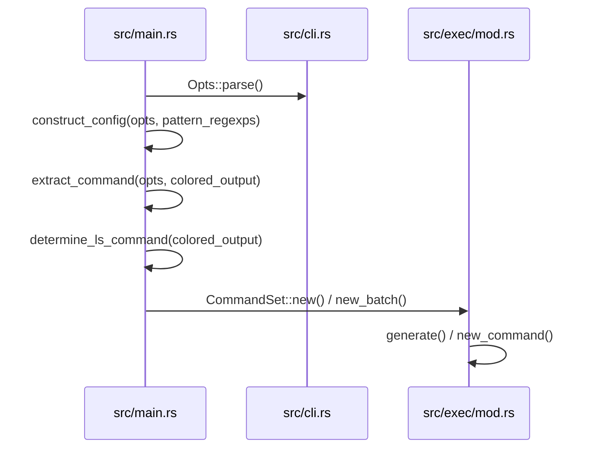

# Overview

<details>
<summary>Relevant source files</summary>

The following files were used as context for generating this wiki page:

- [src/main.rs](https://github.com/sharkdp/fd/blob/main/src/main.rs)
- [src/walk.rs](https://github.com/sharkdp/fd/blob/main/src/walk.rs)
- [src/cli.rs](https://github.com/sharkdp/fd/blob/main/src/cli.rs)
- [README.md](https://github.com/sharkdp/fd/blob/main/README.md)
- [src/exec/job.rs](https://github.com/sharkdp/fd/blob/main/src/exec/job.rs)
- [Cargo.toml](https://github.com/sharkdp/fd/blob/main/Cargo.toml)
- [src/fmt/mod.rs](https://github.com/sharkdp/fd/blob/main/src/fmt/mod.rs)
- [src/config.rs](https://github.com/sharkdp/fd/blob/main/src/config.rs)
- [src/filter/owner.rs](https://github.com/sharkdp/fd/blob/main/src/filter/owner.rs)
- [CONTRIBUTING.md](https://github.com/sharkdp/fd/blob/main/CONTRIBUTING.md)
- [doc/sponsors.md](https://github.com/sharkdp/fd/blob/main/doc/sponsors.md)
- [doc/screencast.sh](https://github.com/sharkdp/fd/blob/main/doc/screencast.sh)
- [src/exec/mod.rs](https://github.com/sharkdp/fd/blob/main/src/exec/mod.rs)
</details>

## Overview

`fd` is a high-performance command-line utility designed as a simple, fast, and user-friendly alternative to traditional file-finding tools like `find` [Sources: [README.md:8-9](https://github.com/sharkdp/fd/blob/main/README.md#L8-L9), [Cargo.toml:4](https://github.com/sharkdp/fd/blob/main/Cargo.toml#L4)]. Written in Rust, it provides sensible opinionated defaults—such as case-insensitive smart-case searching, automatic exclusion of hidden files, and respect for `.gitignore` rules—while delivering exceptional throughput through parallelized directory traversal and thread-safe batch processing [Sources: [README.md:10-26](https://github.com/sharkdp/fd/blob/main/README.md#L10-L26), [src/walk.rs:443-456](https://github.com/sharkdp/fd/blob/main/src/walk.rs#L443-L456)].

Sources: [README.md:8-26](https://github.com/sharkdp/fd/blob/main/README.md#L8-L26), [src/walk.rs:443-456](https://github.com/sharkdp/fd/blob/main/src/walk.rs#L443-L456), [Cargo.toml:4](https://github.com/sharkdp/fd/blob/main/Cargo.toml#L4)

## CLI Parsing and Configuration Building

### Overview

Command-line parsing and runtime configuration are handled by `clap` through the `Opts` structure in `src/cli.rs`, which subsequently populates the runtime `Config` struct defined in `src/config.rs`. The execution begins in `src/main.rs`, where `Opts::parse()` evaluates command-line arguments, validates working directories via `set_working_dir`, and builds search patterns before instantiating the core configuration instance.

Sources: [src/main.rs:75-103](https://github.com/sharkdp/fd/blob/main/src/main.rs#L75-L103), [src/cli.rs:21-32](https://github.com/sharkdp/fd/blob/main/src/cli.rs#L21-L32), [src/config.rs:13-16](https://github.com/sharkdp/fd/blob/main/src/config.rs#L13-L16)

### Configuration Construction Flow

The conversion from raw CLI options to the engine's internal `Config` instance involves an explicit sequence of helper functions that parse user intent, manage environment flags, and establish process constraints.

1. `construct_config` — Accepts parsed `Opts` and pattern regular expressions, evaluating case sensitivity, path separators, thread limits, and formatting preferences [Sources: [src/main.rs:248-292](https://github.com/sharkdp/fd/blob/main/src/main.rs#L248-L292)].
2. `extract_command` — Takes mutable `Opts` and color settings, determining whether an execution command (`-x` or `-X`) or detail listing (`-l`) was requested [Sources: [src/main.rs:395-410](https://github.com/sharkdp/fd/blob/main/src/main.rs#L395-L410)].
3. `determine_ls_command` — Inspects the operating system environment and GNU `ls` availability to configure default parameters for detailed listings [Sources: [src/main.rs:412-494](https://github.com/sharkdp/fd/blob/main/src/main.rs#L412-L494)].
4. `new` — Instantiates a `CommandSet` or `CommandTemplate` parsing command string tokens and placeholders [Sources: [src/exec/mod.rs:36-49](https://github.com/sharkdp/fd/blob/main/src/exec/mod.rs#L36-L49)].
5. `CommandSet` — Returns the fully validated command set container ready for downstream scheduling and invocation [Sources: [src/exec/mod.rs:29-34](https://github.com/sharkdp/fd/blob/main/src/exec/mod.rs#L29-L34)].

Alternatively, when generating commands or building command execution builders, the trailing phases resolve differently:

1. `construct_config` — Initiates the runtime setup phase [Sources: [src/main.rs:248-298](https://github.com/sharkdp/fd/blob/main/src/main.rs#L248-L298)].
2. `extract_command` — Extracts command templates from command-line arguments [Sources: [src/main.rs:395-410](https://github.com/sharkdp/fd/blob/main/src/main.rs#L395-L410)].
3. `determine_ls_command` — Selects platform-specific `ls` arguments [Sources: [src/main.rs:412-494](https://github.com/sharkdp/fd/blob/main/src/main.rs#L412-L494)].
4. `new` — Parses command arguments into format templates [Sources: [src/exec/mod.rs:36-49](https://github.com/sharkdp/fd/blob/main/src/exec/mod.rs#L36-L49)].
5. `generate` — Produces concrete system commands by replacing template tokens with target paths [Sources: [src/exec/mod.rs:266-273](https://github.com/sharkdp/fd/blob/main/src/exec/mod.rs#L266-L273)].

For batch-mode execution builders, the trailing call sequence resolves as:

1. `construct_config` — Sets up basic configuration rules [Sources: [src/main.rs:248-298](https://github.com/sharkdp/fd/blob/main/src/main.rs#L248-L298)].
2. `extract_command` — Pulls batch execution definitions [Sources: [src/main.rs:395-410](https://github.com/sharkdp/fd/blob/main/src/main.rs#L395-L410)].
3. `determine_ls_command` — Establishes OS-level file listing defaults [Sources: [src/main.rs:412-494](https://github.com/sharkdp/fd/blob/main/src/main.rs#L412-L494)].
4. `new` — Constructs batch templates from strings [Sources: [src/exec/mod.rs:50-70](https://github.com/sharkdp/fd/blob/main/src/exec/mod.rs#L50-L70)].
5. `new_command` — Initialises process standard streams and arguments for `argmax` batching [Sources: [src/exec/mod.rs:164-171](https://github.com/sharkdp/fd/blob/main/src/exec/mod.rs#L164-L171)].



Sources: [src/main.rs:75-103](https://github.com/sharkdp/fd/blob/main/src/main.rs#L75-L103), [src/main.rs:248-298](https://github.com/sharkdp/fd/blob/main/src/main.rs#L248-L298), [src/main.rs:395-494](https://github.com/sharkdp/fd/blob/main/src/main.rs#L395-L494), [src/exec/mod.rs:36-70](https://github.com/sharkdp/fd/blob/main/src/exec/mod.rs#L36-L70), [src/exec/mod.rs:164-171](https://github.com/sharkdp/fd/blob/main/src/exec/mod.rs#L164-L171), [src/exec/mod.rs:266-273](https://github.com/sharkdp/fd/blob/main/src/exec/mod.rs#L266-L273)

### CLI Options and File Type Enumerations

The CLI parser supports extensive filtering rules mapped to enumeration variants. The `FileType` values determine which filesystem entry categories are matched during walks.

| Variant | Value / Alias | Description |
| :--- | :--- | :--- |
| `File` | `f` | Regular files |
| `Directory` | `d`, `dir` | Directories |
| `Symlink` | `l` | Symbolic links |
| `BlockDevice` | `b` | Block device |
| `CharDevice` | `c` | Character device |
| `Executable` | `x` | Executable files |
| `Empty` | `e` | Empty files or directories |
| `Socket` | `s` | Socket |
| `Pipe` | `p` | Named pipe (FIFO) |

Sources: [src/cli.rs:803-823](https://github.com/sharkdp/fd/blob/main/src/cli.rs#L803-L823)

> [!WARNING]
> The `--type executable` and `--type empty` filters behave differently from standard type flags. Specifying `--type executable` implicitly enforces `--type file`. Meanwhile, `--type empty` scans both empty files and directories unless explicitly restricted by an accompanying `--type file` or `--type directory` flag.

Sources: [src/cli.rs:341-350](https://github.com/sharkdp/fd/blob/main/src/cli.rs#L341-L350)

## Directory Walking and Parallel Search

### Overview

Parallel filesystem traversal and worker communication coordinate through `WorkerState`, `BatchSender`, and `ReceiverBuffer` in `src/walk.rs`. Traversal begins with `scan()`, which constructs an parallel walker via `build_walker()`, sets up a bounded channel with capacity `2 * config.threads`, and spawns both receiver and sender threads using a scoped thread pool [Sources: [src/walk.rs:617-646](https://github.com/sharkdp/fd/blob/main/src/walk.rs#L617-L646)].

### Call-Chain Execution Walkthrough

The filesystem walking operation flows through a distinct sequence of functions from configuration building to result output:

1. `scan()` — Initializes worker state, registers SIGINT handlers if colors are enabled, and spawns threads [Sources: [src/walk.rs:617-646](https://github.com/sharkdp/fd/blob/main/src/walk.rs#L617-L646)].
2. `build_walker()` — Configures ignore rules, custom ignore files, depth limits, and thread counts on a `WalkBuilder` [Sources: [src/walk.rs:347-404](https://github.com/sharkdp/fd/blob/main/src/walk.rs#L347-L404)].
3. `spawn_senders()` — Executes the parallel walk, evaluating path patterns, file sizes, modification times, and ownership constraints per entry [Sources: [src/walk.rs:443-614](https://github.com/sharkdp/fd/blob/main/src/walk.rs#L443-L614)].
4. `BatchSender::send()` — Batches worker results and transmits them across the crossbeam channel, flushing when batch sizes reach their limit [Sources: [src/walk.rs:101-122](https://github.com/sharkdp/fd/blob/main/src/walk.rs#L101-L122)].
5. `ReceiverBuffer::process()` — Receives batches, buffering them briefly for sorting or streaming them directly to standard output [Sources: [src/walk.rs:174-181](https://github.com/sharkdp/fd/blob/main/src/walk.rs#L174-L181)].

> [!NOTE]
> During traversal, if an entry is a directory containing a file specified in `ignore_contain`, `spawn_senders()` returns `WalkState::Skip` to completely bypass traversing inside that directory [Sources: [src/walk.rs:470-478](https://github.com/sharkdp/fd/blob/main/src/walk.rs#L470-L478)].

Sources: [src/walk.rs:101-122](https://github.com/sharkdp/fd/blob/main/src/walk.rs#L101-L122), [src/walk.rs:174-181](https://github.com/sharkdp/fd/blob/main/src/walk.rs#L174-L181), [src/walk.rs:347-404](https://github.com/sharkdp/fd/blob/main/src/walk.rs#L347-L404), [src/walk.rs:443-614](https://github.com/sharkdp/fd/blob/main/src/walk.rs#L443-L614), [src/walk.rs:617-646](https://github.com/sharkdp/fd/blob/main/src/walk.rs#L617-L646)

### Receiver Modes and Buffering Constants

The receiver handles incoming batches using two operational modes governed by timing and buffer size limits.

| Constant / Enum | Value / Type | Purpose |
| :--- | :--- | :--- |
| `ReceiverMode::Buffering` | Enum Variant | Buffering initial results to allow sorted output if the search finishes within the deadline |
| `ReceiverMode::Streaming` | Enum Variant | Directly streaming and printing results to standard output |
| `MAX_BUFFER_LENGTH` | `1000` (usize) | Maximum capacity of the output buffer before forcing a flush to the console |
| `DEFAULT_MAX_BUFFER_TIME` | `100` milliseconds | Default duration window before output buffering switches to streaming mode |

Sources: [src/walk.rs:26-35](https://github.com/sharkdp/fd/blob/main/src/walk.rs#L26-L35), [src/walk.rs:124-127](https://github.com/sharkdp/fd/blob/main/src/walk.rs#L124-L127)

> [!WARNING]
> If execution terminates early while still in `ReceiverMode::Buffering`, `ReceiverBuffer::stop()` explicitly sorts the collected buffer before streaming results out, ensuring consistent ordering for fast searches [Sources: [src/walk.rs:282-286](https://github.com/sharkdp/fd/blob/main/src/walk.rs#L282-L286)].

Sources: [src/walk.rs:282-286](https://github.com/sharkdp/fd/blob/main/src/walk.rs#L282-L286)

### Design Trade-Offs in Walking and Batching

| Design Choice | Benefit | Cost |
| :--- | :--- | :--- |
| Bounded crossbeam channels (`2 * config.threads`) | Prevents unbounded memory growth if sender threads outpace the receiver | Creates backpressure that stalls slow walker threads when channels fill up |
| Result batching (`BatchSender` with size limits) | Reduces channel synchronization overhead and lock contention across threads | Adds minor latency for individual entries before a full batch triggers a send |
| Short-duration output buffering (`100ms`) | Enables sorted output for quick searches without hurting streaming throughput on long searches | Delays initial console output slightly during the buffering window |

Sources: [src/walk.rs:101-122](https://github.com/sharkdp/fd/blob/main/src/walk.rs#L101-L122), [src/walk.rs:124-128](https://github.com/sharkdp/fd/blob/main/src/walk.rs#L124-L128), [src/walk.rs:636-636](https://github.com/sharkdp/fd/blob/main/src/walk.rs#L636-L636)

## Command Execution and Batch Processing

### Overview

The execution subsystem handles spawning child processes against matched filesystem entries using either single-item (`job`) or grouped (`batch`) execution modes. Command templates support substitution placeholders and custom path separators.

Sources: [src/exec/job.rs:11-50](https://github.com/sharkdp/fd/blob/main/src/exec/job.rs#L11-L50), [src/exec/mod.rs:20-33](https://github.com/sharkdp/fd/blob/main/src/exec/mod.rs#L20-L33)

### Format Templates and Tokens

The `FormatTemplate` engine parses format strings via `AhoCorasick` pattern matching to identify tokens and literals.

| Token Variant | Syntax Pattern | Description |
| :--- | :--- | :--- |
| `Token::Placeholder` | `{}` | Full relative or absolute path of the matched entry |
| `Token::Basename` | `{/}` | The final component (file or directory name) of the path |
| `Token::Parent` | `{//}` | The parent directory path |
| `Token::NoExt` | `{.}` | Path with its file extension removed |
| `Token::BasenameNoExt` | `{/.}` | Basename with its file extension removed |
| `Token::Text` | Fixed string | Literal text segments or escaped braces (`{{`, `}}`) |

Sources: [src/fmt/mod.rs:17-38](https://github.com/sharkdp/fd/blob/main/src/fmt/mod.rs#L17-L38), [src/fmt/mod.rs:58-66](https://github.com/sharkdp/fd/blob/main/src/fmt/mod.rs#L58-L66)

> [!NOTE]
> If a command template contains no explicit placeholders, `CommandTemplate::new()` automatically appends a `Token::Placeholder` at the end of the argument list.
> 
> Sources: [src/exec/mod.rs:250-254](https://github.com/sharkdp/fd/blob/main/src/exec/mod.rs#L250-L254)

### Execution Flow and Call-Chain Walkthrough

Child process execution proceeds through a structured series of dispatcher and builder functions depending on whether one-by-one or batch mode is configured.

1. `job()` / `batch()` — Iterates over `WorkerResult` inputs from the worker channel, filtering out filesystem errors or extracting stripped paths.
2. `CommandSet::execute()` / `CommandSet::execute_batch()` — Dispatches generated argument vectors to single execution handles or instantiates `CommandBuilder` instances.
3. `CommandBuilder::new()` — Separates pre-arguments, path placeholders, and post-arguments, initializing standard I/O inheritance (`Stdio::inherit()`).
4. `CommandBuilder::push()` — Evaluates argument length limits via `args_would_fit()` and flushes the current command via `finish()` if limits are exceeded.
5. `CommandBuilder::finish()` — Spawns the child process, checks its exit status, and resets the command structure for subsequent batches.

Sources: [src/exec/job.rs:11-64](https://github.com/sharkdp/fd/blob/main/src/exec/job.rs#L11-L64), [src/exec/mod.rs:76-120](https://github.com/sharkdp/fd/blob/main/src/exec/mod.rs#L76-L120), [src/exec/mod.rs:135-208](https://github.com/sharkdp/fd/blob/main/src/exec/mod.rs#L135-L208)

### Design Trade-Offs in Command Execution

| Design Choice | Benefit | Cost |
| :--- | :--- | :--- |
| Automatic trailing placeholder injection | Simplifies CLI usage so users can run `fd pattern -x echo` without typing `{}` explicitly | Can lead to unexpected argument ordering if users misjudge default parameter placement |
| Strict single-placeholder rule in batch mode | Prevents malformed argument flattening across multiple files per execution batch | Restricts batch commands from interpolating the same filename into multiple distinct argument positions |
| Argument size checking (`args_would_fit`) | Prevents operating system `E2BIG` errors by splitting large batches before spawning child processes | Requires pre-evaluating path lengths and maintaining a running count per batch builder |

Sources: [src/exec/mod.rs:63-65](https://github.com/sharkdp/fd/blob/main/src/exec/mod.rs#L63-L65), [src/exec/mod.rs:174-184](https://github.com/sharkdp/fd/blob/main/src/exec/mod.rs#L174-L184), [src/exec/mod.rs:250-254](https://github.com/sharkdp/fd/blob/main/src/exec/mod.rs#L250-L254)

## Filtering and Output Formatting

### Overview

The filtering and formatting engine evaluates ownership constraints, resolves entry paths against base directories, and parses format templates with custom path separators.

Sources: [src/filter/owner.rs:27-58](https://github.com/sharkdp/fd/blob/main/src/filter/owner.rs#L27-L58), [src/walk.rs:656-678](https://github.com/sharkdp/fd/blob/main/src/walk.rs#L656-L678), [src/fmt/mod.rs:58-107](https://github.com/sharkdp/fd/blob/main/src/fmt/mod.rs#L58-L107)

### Ownership Filters and Constraints

The `OwnerFilter` struct parses ownership constraint strings formatted as `uid:gid`, supporting numeric IDs, named users or groups via `nix::unistd`, and negation prefixes (`!`).

| Variant / Rule | Syntax Example | Behavior / Resolution |
| :--- | :--- | :--- |
| `Check::Equal` | `5` or `9:3` | Matches metadata matching the exact numeric UID or GID |
| `Check::NotEq` | `!5` or `!4:!3` | Matches metadata where UID or GID is *not* equal to the value |
| `Check::Ignore` | `""`, `:`, or `5:` | Ignores UID or GID checks when the field is empty |

Sources: [src/filter/owner.rs:11-16](https://github.com/sharkdp/fd/blob/main/src/filter/owner.rs#L11-L16), [src/filter/owner.rs:27-58](https://github.com/sharkdp/fd/blob/main/src/filter/owner.rs#L27-L58), [src/filter/owner.rs:125-132](https://github.com/sharkdp/fd/blob/main/src/filter/owner.rs#L125-L132)

> [!WARNING]
> Parsing an owner string containing more than one colon separator (e.g., `"3:5:"`) or invalid non-numeric user/group names returns an explicit error.
> 
> Sources: [src/filter/owner.rs:31-36](https://github.com/sharkdp/fd/blob/main/src/filter/owner.rs#L31-L36), [src/filter/owner.rs:44-53](https://github.com/sharkdp/fd/blob/main/src/filter/owner.rs#L44-L53)

### Path Evaluation and Base Resolution

The `search_str_for_entry()` function determines the search target string for a given filesystem entry based on whether a full path base is supplied.

1. `search_str_for_entry()` — Inspects `full_path_base` and entry path properties.
2. Absolute Path Check — If `full_path_base` is `Some` and `entry_path.is_absolute()` is true, returns a borrowed `Cow` of the absolute path directly.
3. Relative Prefix Stripping — If `full_path_base` is `Some` and the path is relative, strips leading `.` prefixes via `entry_path.strip_prefix(".")` and joins the remainder with the base directory.
4. Basename Fallback — If `full_path_base` is `None`, extracts and returns the entry filename via `entry_path.file_name()`.

Sources: [src/walk.rs:656-678](https://github.com/sharkdp/fd/blob/main/src/walk.rs#L656-L678)

> [!NOTE]
> If `entry_path.file_name()` returns `None` during fallback without a base directory, it triggers an unrecoverable `unreachable!()` assertion for invalid paths like `foo/bar/..` or `/`.
> 
> Sources: [src/walk.rs:669-677](https://github.com/sharkdp/fd/blob/main/src/walk.rs#L669-L677)

### Format Template Generation and Separator Substitution

`FormatTemplate::generate()` processes paths using `FormatTemplate::replace_separator()` to substitute path components and custom separators.

```rust
let templ = FormatTemplate::parse("{//}/{/}");
let mut path = PathBuf::from("a/folder/file.txt");
let expanded = templ.generate(&path, Some("/"));
```

Sources: [src/fmt/mod.rs:112-141](https://github.com/sharkdp/fd/blob/main/src/fmt/mod.rs#L112-L141), [src/fmt/mod.rs:265-270](https://github.com/sharkdp/fd/blob/main/src/fmt/mod.rs#L265-L270)

## Project Architecture and Dependencies

### Overview

The `fd` project is packaged as a binary crate named `fd-find` with edition 2024 and minimum supported rust version 1.90.0, utilizing a modular layout split between binary execution and core library helpers.

Sources: [Cargo.toml:16-21](https://github.com/sharkdp/fd/blob/main/Cargo.toml#L16-L21), [Cargo.toml:29-31](https://github.com/sharkdp/fd/blob/main/Cargo.toml#L29-L31)

### Crate Package Structure and Workspace Dependencies

The package pulls in robust third-party crates for parallel directory iteration, regular expressions, pattern matching, terminal coloring, and process control.

| Dependency | Version Requirement | Purpose in Crate |
| :--- | :--- | :--- |
| `ignore` | `0.4.25` | Concurrent filesystem traversal and gitignore rule matching |
| `regex` | `1.12.2` | Regular expression search and pattern matching |
| `clap` | `4.6.1` | Command-line argument parsing with derive features |
| `lscolors` | `0.21` | File type coloring compatible with `LS_COLORS` |
| `crossbeam-channel` | `0.5.15` | Multi-producer multi-consumer worker thread communication |
| `etcetera` | `0.11` | Cross-platform configuration and home directory resolution |

Sources: [Cargo.toml:33-58](https://github.com/sharkdp/fd/blob/main/Cargo.toml#L33-L58)

### Configuration Options and Compilation Profiles

The package defines multiple build features and optimization profiles configured directly in `Cargo.toml`.

```toml
[features]
use-jemalloc = ["tikv-jemallocator"]
completions = ["clap_complete"]
base = ["use-jemalloc"]
default = ["completions"]
```

Sources: [Cargo.toml:94-99](https://github.com/sharkdp/fd/blob/main/Cargo.toml#L94-L99)

> [!NOTE]
> Jemalloc is conditionally disabled on macOS, Windows, Android, FreeBSD, OpenBSD, Illumos, musl 32-bit, and RISC-V 64 architectures due to platform-specific compatibility and allocator bugs.
> 
> Sources: [Cargo.toml:70-71](https://github.com/sharkdp/fd/blob/main/Cargo.toml#L70-L71)

## Related

- [[Quick Start]]
- [[Project Structure]]
- [[Parallel Directory Traversal]]

