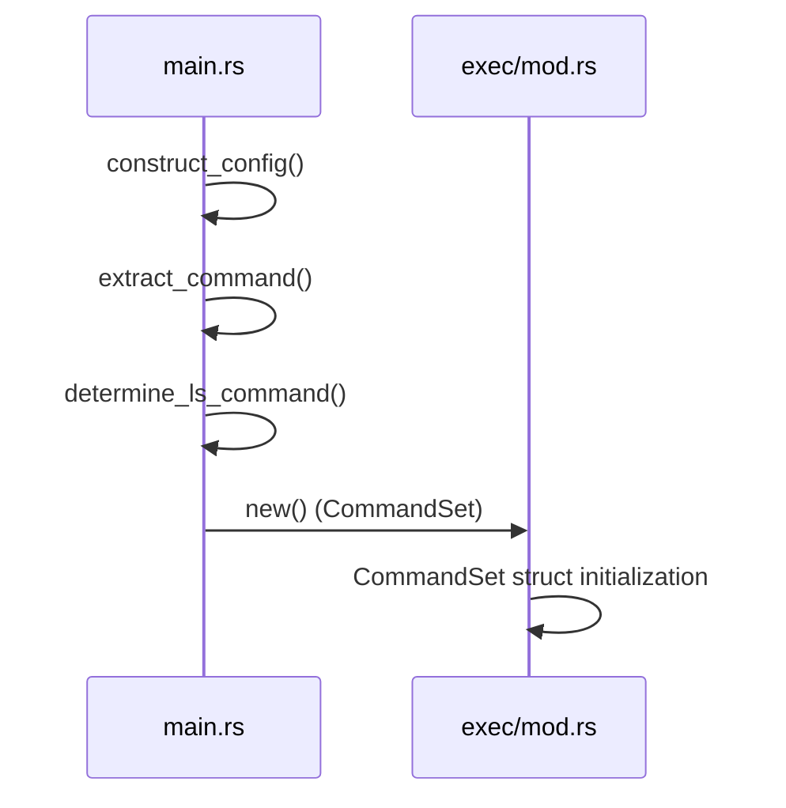

# Parallel Directory Traversal

Relevant source files

The following files were used as context for generating this wiki page:

- [src/main.rs](https://github.com/sharkdp/fd/blob/main/src/main.rs)
- [src/walk.rs](https://github.com/sharkdp/fd/blob/main/src/walk.rs)
- [src/cli.rs](https://github.com/sharkdp/fd/blob/main/src/cli.rs)
- [README.md](https://github.com/sharkdp/fd/blob/main/README.md)
- [src/exec/job.rs](https://github.com/sharkdp/fd/blob/main/src/exec/job.rs)
- [Cargo.toml](https://github.com/sharkdp/fd/blob/main/Cargo.toml)
- [src/config.rs](https://github.com/sharkdp/fd/blob/main/src/config.rs)
- [src/filter/owner.rs](https://github.com/sharkdp/fd/blob/main/src/filter/owner.rs)
- [doc/sponsors.md](https://github.com/sharkdp/fd/blob/main/doc/sponsors.md)
- [CONTRIBUTING.md](https://github.com/sharkdp/fd/blob/main/CONTRIBUTING.md)
- [src/filetypes.rs](https://github.com/sharkdp/fd/blob/main/src/filetypes.rs)
- [src/exec/mod.rs](https://github.com/sharkdp/fd/blob/main/src/exec/mod.rs)

## Overview

Parallel directory traversal powers `fd` by distributing filesystem exploration across multi-threaded worker pools and asynchronous crossbeam channels, achieving high-performance file discovery on multi-core systems.

Sources: [src/walk.rs:636-653](https://github.com/sharkdp/fd/blob/main/src/walk.rs#L636-L653), [README.md:19-19](https://github.com/sharkdp/fd/blob/main/README.md#L19-L19)

## CLI Parsing and Configuration Setup

### Overview

The execution flow begins in `main()`, which invokes `run()` to parse command-line options via `Opts::parse()` and initialize runtime structures. `construct_config` processes these parsed options to build the central `Config` struct that governs filtering, colorization, thread counts, and traversal parameters across the entire application.

Sources: [src/main.rs:62-103](https://github.com/sharkdp/fd/blob/main/src/main.rs#L62-L103)

### Configuration Construction Walkthrough

When `construct_config` builds command sets (such as resolving `--list-details`), it executes the verified call chain: `construct_config` calls `extract_command`, which evaluates whether listing details is requested and invokes `determine_ls_command` to retrieve platform-specific arguments before calling `CommandSet::new` (or `CommandSet::new_batch`) to instantiate the resulting `CommandSet`.

1. `construct_config` (src/main.rs:247-392) — Accepts parsed command-line `Opts` and pattern regex strings, initializing core constraints like case sensitivity and path separators.
Sources: [src/main.rs:247-392](https://github.com/sharkdp/fd/blob/main/src/main.rs#L247-L392)
2. `extract_command` (src/main.rs:394-409) — Inspects whether `--exec`, `--exec-batch`, or `--list-details` were provided in the options, extracting an optional execution set.
Sources: [src/main.rs:394-409](https://github.com/sharkdp/fd/blob/main/src/main.rs#L394-L409)
3. `determine_ls_command` (src/main.rs:411-493) — Evaluates platform characteristics (`cfg!(unix)` vs `cfg!(windows)`) and color support to construct the default argument vector for `--list-details`.
Sources: [src/main.rs:411-493](https://github.com/sharkdp/fd/blob/main/src/main.rs#L411-L493)
4. `new` (src/exec/mod.rs:219-255) — Instantiates a `CommandSet` via batch construction, mapping command arguments into structured templates.
Sources: [src/exec/mod.rs:219-255](https://github.com/sharkdp/fd/blob/main/src/exec/mod.rs#L219-L255)
5. `CommandSet` (src/exec/mod.rs:29-32) — Returns the fully validated command set containing execution mode and command templates back to `construct_config`.
Sources: [src/exec/mod.rs:29-32](https://github.com/sharkdp/fd/blob/main/src/exec/mod.rs#L29-L32)

Alternatively, when building individual execution commands or generating test fixtures, the flow follows `construct_config` → `extract_command` → `determine_ls_command` → `new` → `generate`. For batch execution command builders, the flow follows `construct_config` → `extract_command` → `determine_ls_command` → `new` → `new_command`, which configures standard input, output, and error redirection (`Stdio::inherit()`) on an underlying `argmax::Command`.

Sources: [src/main.rs:247-392](https://github.com/sharkdp/fd/blob/main/src/main.rs#L247-L392), [src/main.rs:394-409](https://github.com/sharkdp/fd/blob/main/src/main.rs#L394-L409), [src/main.rs:411-493](https://github.com/sharkdp/fd/blob/main/src/main.rs#L411-L493), [src/exec/mod.rs:29-32](https://github.com/sharkdp/fd/blob/main/src/exec/mod.rs#L29-L32), [src/exec/mod.rs:219-255](https://github.com/sharkdp/fd/blob/main/src/exec/mod.rs#L219-L255)

### CLI Options and Configuration Mappings

| CLI Flag / Option | Type / Variant | Default Value | Purpose in `Config` |
| :--- | :--- | :--- | :--- |
| `-H`, `--hidden` | `bool` | `false` | Controls whether hidden files and directories starting with a dot are skipped (`ignore_hidden`). |
| `-I`, `--no-ignore` | `bool` | `false` | Determines whether `.gitignore`, `.ignore`, and `.fdignore` rules are respected. |
| `-s`, `--case-sensitive` | `bool` | `false` (Smart Case) | Forces case-sensitive matching unless overridden or triggered by uppercase patterns. |
| `-g`, `--glob` | `bool` | `false` | Switches pattern matching from regular expressions to glob syntax. |
| `-F`, `--fixed-strings` | `bool` | `false` | Treats the search pattern as a literal substring rather than a regex. |
| `-L`, `--follow` | `bool` | `false` | Enables traversal into symbolic linked directories (`follow_links`). |
| `-d`, `--max-depth` | `Option<usize>` | `None` | Limits the maximum directory traversal depth (`max_depth`). |
| `-t`, `--type` | `Option<Vec<FileType>>` | `None` | Filters entries by file type (files, directories, symlinks, executables, empty, etc.). |
| `-c`, `--color` | `ColorWhen` | `ColorWhen::Auto` | Controls colorization of output (`Always`, `Never`, `Auto`). |
| `-j`, `--threads` | `Option<NonZeroUsize>` | CPU core count (max 64) | Sets worker thread pool size for searching and executing. |

Sources: [src/cli.rs:39-557](https://github.com/sharkdp/fd/blob/main/src/cli.rs#L39-L557), [src/config.rs:14-136](https://github.com/sharkdp/fd/blob/main/src/config.rs#L14-L136), [src/cli.rs:788-800](https://github.com/sharkdp/fd/blob/main/src/cli.rs#L788-L800)

> [!IMPORTANT]
> Smart case matching is automatically enabled unless `--case-sensitive` is explicitly set or `ignore_case` is passed; if any search pattern contains an uppercase character, `construct_config` switches `case_sensitive` to true regardless of flags.
> 
> Sources: [src/main.rs:251-255](https://github.com/sharkdp/fd/blob/main/src/main.rs#L251-L255)

### Design Trade-Offs

| Design Choice | Benefit | Cost |
| :--- | :--- | :--- |
| **Smart case default** | Provides intuitive search behavior matching uppercase queries without requiring manual `-s` flags. | Implicitly alters matching behavior based on pattern content, which may surprise users expecting strict case-insensitivity. |
| **Platform-specific `ls` detection** | Automatically utilizes GNU `ls` (`gls`) on BSD/macOS when installed to gain color and flag support. | Introduces subprocess probing overhead and platform branching logic during configuration setup. |
| **Pre-parsed regex and glob compilation** | Compiles patterns into regex sets and regexes once during configuration setup before traversal begins. | Upfront compilation latency prior to filesystem scanning; regex syntax errors abort execution before any traversal occurs. |

Sources: [src/main.rs:94-110](https://github.com/sharkdp/fd/blob/main/src/main.rs#L94-L110), [src/main.rs:251-255](https://github.com/sharkdp/fd/blob/main/src/main.rs#L251-L255), [src/main.rs:442-488](https://github.com/sharkdp/fd/blob/main/src/main.rs#L442-L488)

## Concurrent Directory Traversal Pipeline

### Overview

The concurrent traversal pipeline coordinates multi-threaded directory walking using the `ignore` crate's `WalkParallel`, custom crossbeam bounded channels, batching workers, and a dedicated receiver thread. Traversal begins when `scan()` initializes a `WorkerState`, establishes a bounded channel with capacity set to `2 * config.threads`, and spawns both the receiver thread and parallel sender threads via `thread::scope`.

Sources: [src/walk.rs:617-646](https://github.com/sharkdp/fd/blob/main/src/walk.rs#L617-L646)

### Traversal Pipeline Execution Walkthrough

The execution of the traversal pipeline flows through explicit lifecycle phases managed across the sender workers and receiver consumer:

1. **`scan()`**: Initializes shared state, sets up signal handlers for `ctrlc`, creates a bounded channel `(tx, rx)`, and enters `thread::scope`.
Sources: [src/walk.rs:617-647](https://github.com/sharkdp/fd/blob/main/src/walk.rs#L617-L647)
2. **`spawn_senders()`**: Invokes `walker.run()`, spinning up parallel workers that evaluate directory entries against ignore files, depth limits, regex patterns, and constraints.
Sources: [src/walk.rs:443-462](https://github.com/sharkdp/fd/blob/main/src/walk.rs#L443-L462)
3. **`BatchSender::send()`**: Wraps evaluated `WorkerResult` items (either a `DirEntry` or an `ignore::Error`) into batches controlled by a size limit (`0x100` normally, or `1` when multi-threaded execution is active) and dispatches them over `tx`.
Sources: [src/walk.rs:101-121](https://github.com/sharkdp/fd/blob/main/src/walk.rs#L101-L121), [src/walk.rs:449-457](https://github.com/sharkdp/fd/blob/main/src/walk.rs#L449-L457)
4. **`receive()`**: Inspects whether `--exec` is configured; if absent, delegates consumption to `ReceiverBuffer`.
Sources: [src/walk.rs:408-440](https://github.com/sharkdp/fd/blob/main/src/walk.rs#L408-L440)
5. **`ReceiverBuffer::process()`**: Polls incoming batches, alternating between `ReceiverMode::Buffering` (sorting and buffering results up to `DEFAULT_MAX_BUFFER_TIME` or `MAX_BUFFER_LENGTH`) and `ReceiverMode::Streaming` (directly writing entries to stdout via `output::print_entry`).
Sources: [src/walk.rs:174-218](https://github.com/sharkdp/fd/blob/main/src/walk.rs#L174-L218)

> [!NOTE]
> When executing without `--exec`, `ReceiverBuffer` starts in `ReceiverMode::Buffering` to collect short-lived fast searches and sort them before output. If execution exceeds `max_buffer_time` (default 100ms) or the buffer exceeds `MAX_BUFFER_LENGTH` (1000 items), it transitions to `ReceiverMode::Streaming` for immediate output.
> 
> Sources: [src/walk.rs:125-171](https://github.com/sharkdp/fd/blob/main/src/walk.rs#L125-L171), [src/walk.rs:208-218](https://github.com/sharkdp/fd/blob/main/src/walk.rs#L208-L218)

### Traversal Structures and States

| Structure / Enum | Field / Variant | Purpose / Behavior |
| :--- | :--- | :--- |
| `ReceiverMode` | `Buffering` | Buffers results internally to sort outputs if the search completes quickly. |
| `ReceiverMode` | `Streaming` | Directly flushes and prints results to console without sorting. |
| `WorkerResult::Entry` | `DirEntry` | Encapsulates a successfully validated filesystem entry. |
| `WorkerResult::Error` | `ignore::Error` | Encapsulates a traversal or permission error encountered by the walker. |
| `Batch` | `items: Arc<Mutex<Option<Vec<WorkerResult>>>>` | Thread-safe container holding a vector of worker results sent over the channel. |
| `BatchSender` | `limit: usize` | Controls batch flushing frequency (`0x100` standard, `1` for multi-receiver execution). |
| `ReceiverBuffer` | `deadline: Instant` | Timeout deadline enforcing the switch from buffering mode to streaming mode. |

Sources: [src/walk.rs:27-122](https://github.com/sharkdp/fd/blob/main/src/walk.rs#L27-L122), [src/walk.rs:129-170](https://github.com/sharkdp/fd/blob/main/src/walk.rs#L129-L170)

> [!WARNING]
> Pressing `Ctrl+C` once stores `true` in `quit_flag` to gracefully signal worker threads to halt via `WalkState::Quit`. Pressing `Ctrl+C` a second time triggers `interrupt_flag.fetch_or`, immediately forcing process termination via `ExitCode::KilledBySigint.exit()`.
> 
> Sources: [src/walk.rs:625-632](https://github.com/sharkdp/fd/blob/main/src/walk.rs#L625-L632)

## Filesystem Entry Filtering Mechanics

### Overview

As parallel worker threads evaluate directory entries produced by the underlying walker, each entry passes through a sequential validation pipeline. This filtering mechanism rejects entries that fail to meet criteria such as ignore specifications, depth constraints, regular expression patterns, file types, owner permissions, size limitations, and modification times. 

Sources: [src/walk.rs:460-592](https://github.com/sharkdp/fd/blob/main/src/walk.rs#L460-L592)

### Filtering Execution Walkthrough

The evaluation of each directory entry follows an explicit sequence of short-circuiting checks within the worker closure:

1. **`quit_flag` check**: Inspects whether global cancellation has been requested, returning `WalkState::Quit` if active.
Sources: [src/walk.rs:460-462](https://github.com/sharkdp/fd/blob/main/src/walk.rs#L460-L462)
2. **`ignore_contain` pruning**: If an entry is a directory, verifies whether any path specified in `config.ignore_contain` exists within it, returning `WalkState::Skip` to prune traversal.
Sources: [src/walk.rs:470-478](https://github.com/sharkdp/fd/blob/main/src/walk.rs#L470-L478)
3. **Root directory skip**: Discards entries where `e.depth() == 0` by returning `WalkState::Continue`.
Sources: [src/walk.rs:480-483](https://github.com/sharkdp/fd/blob/main/src/walk.rs#L480-L483)
4. **Error handling & symlink classification**: Matches entry results; IO errors indicating missing targets with valid symlink metadata are converted to `DirEntry::broken_symlink`, while other errors are transmitted over the batch channel.
Sources: [src/walk.rs:485-506](https://github.com/sharkdp/fd/blob/main/src/walk.rs#L485-L506)
5. **Depth filtering**: Enforces `min_depth` constraints, skipping entries below the threshold.
Sources: [src/walk.rs:508-512](https://github.com/sharkdp/fd/blob/main/src/walk.rs#L508-L512)
6. **Pattern matching**: Evaluates file paths against compiled regular expressions via `search_str_for_entry`.
Sources: [src/walk.rs:514-524](https://github.com/sharkdp/fd/blob/main/src/walk.rs#L514-L524)
7. **Extension, file type, owner, size, and time constraints**: Filters out unwanted extensions, file types (`FileTypes`), owner constraints (`OwnerFilter`), size bounds (`SizeFilter`), and modification times (`TimeFilter`).
Sources: [src/walk.rs:526-591](https://github.com/sharkdp/fd/blob/main/src/walk.rs#L526-L591)

Sources: [src/walk.rs:460-591](https://github.com/sharkdp/fd/blob/main/src/walk.rs#L460-L591)

### File Types and Ownership Filters

| Filter Component | Struct / Type | Config Field | Purpose / Behavior |
| :--- | :--- | :--- | :--- |
| File Types | `FileTypes` | `file_types` | Filters entries by type (`files`, `directories`, `symlinks`, `block_devices`, `char_devices`, `sockets`, `pipes`, `executables_only`, `empty_only`). |
| Owner Filter | `OwnerFilter` | `owner_constraint` | Unix-specific ownership filter verifying `uid` and `gid` match, mismatch (`!`), or ignore rules. |
| Size Filter | `SizeFilter` | `size_constraints` | Enforces byte-level size boundaries on file entries. |
| Time Filter | `TimeFilter` | `time_constraints` | Enforces last modification time constraints on file entries. |

Sources: [src/config.rs:106-114](https://github.com/sharkdp/fd/blob/main/src/config.rs#L106-L114), [src/filter/owner.rs:5-16](https://github.com/sharkdp/fd/blob/main/src/filter/owner.rs#L5-L16), [src/filetypes.rs:7-18](https://github.com/sharkdp/fd/blob/main/src/filetypes.rs#L7-L18)

> [!NOTE]
> `OwnerFilter` parses constraint strings containing an optional colon (`uid:gid`), supporting negated checks prefixed with `!`. For example, `!5` requires UID not equal to 5, while `:8` checks GID equality with 8, and empty or colon-only strings evaluate to `Check::Ignore`.
> 
> Sources: [src/filter/owner.rs:27-58](https://github.com/sharkdp/fd/blob/main/src/filter/owner.rs#L27-L58), [src/filter/owner.rs:125-139](https://github.com/sharkdp/fd/blob/main/src/filter/owner.rs#L125-L139)

### Filter Design Trade-Offs

| Design Choice | Benefit | Cost |
| :--- | :--- | :--- |
| Early file type checking before `ignore_contain` stat calls | Avoids expensive filesystem syscalls when file types are known | Requires accurate `file_type()` data from directory iterator |
| Short-circuiting filter evaluation chain | Rejects non-matching entries immediately without invoking metadata inspection | Order-dependent logic requires placing lightweight checks (name/depth) before heavy ones (metadata/owner/size) |
| Separate `Check` enum (`Equal`, `NotEq`, `Ignore`) for owner parsing | Explicitly distinguishes equality, negation, and unconstrained fields during owner validation | Adds pattern matching overhead per entry metadata check |

Sources: [src/filter/owner.rs:11-16](https://github.com/sharkdp/fd/blob/main/src/filter/owner.rs#L11-L16), [src/filter/owner.rs:76-83](https://github.com/sharkdp/fd/blob/main/src/filter/owner.rs#L76-83), [src/walk.rs:468-478](https://github.com/sharkdp/fd/blob/main/src/walk.rs#L468-L478), [src/walk.rs:514-591](https://github.com/sharkdp/fd/blob/main/src/walk.rs#L514-L591)

## Parallel Execution and Job Dispatch

### Overview

When the `--exec` or `--exec-batch` command-line argument is supplied, traversal results are handed off to parallel execution routines instead of being streamed directly to standard output. The `WorkerState::receive` function branches based on whether batch execution mode is requested. For per-entry execution (`--exec`), it spawns a scoped thread pool matching the configured thread count, where each thread runs an event loop that listens for inputs from the shared worker channel.
Sources: [src/walk.rs:412-433](https://github.com/sharkdp/fd/blob/main/src/walk.rs#L412-L433)

### Job Dispatch and Execution Modes

Commands are defined via `CommandSet`, which distinguishes between `ExecutionMode::OneByOne` and `ExecutionMode::Batch`. In one-by-one mode, `job()` processes each worker result individually, invoking `CommandSet::execute` with path separators, null-separator flags, and output buffering enabled when multiple threads are active. In batch mode, `batch()` collects paths, filters out errors, and delegates to `CommandSet::execute_batch` using a configured batch size limit.
Sources: [src/exec/job.rs:11-64](https://github.com/sharkdp/fd/blob/main/src/exec/job.rs#L11-L64), [src/exec/mod.rs:20-33](https://github.com/sharkdp/fd/blob/main/src/exec/mod.rs#L20-33), [src/exec/mod.rs:76-88](https://github.com/sharkdp/fd/blob/main/src/exec/mod.rs#L76-88)

| Execution Mode | Enum Variant | Core Method | Dispatch Behavior |
| :--- | :--- | :--- | :--- |
| One-By-One | `ExecutionMode::OneByOne` | `CommandSet::execute` | Generates and executes an individual command per path entry. |
| Batch | `ExecutionMode::Batch` | `CommandSet::execute_batch` | Packs multiple path arguments into command invocation batches up to a size or argument length limit. |

Sources: [src/exec/mod.rs:20-27](https://github.com/sharkdp/fd/blob/main/src/exec/mod.rs#L20-27), [src/exec/mod.rs:76-120](https://github.com/sharkdp/fd/blob/main/src/exec/mod.rs#L76-120)

### Command Building and Argument Constraints

The `CommandBuilder` struct manages incremental argument packing for batch commands. It separates template arguments into pre-execution arguments, path format templates, and post-execution arguments. As paths are pushed, `CommandBuilder` checks whether the argument count limit has been reached or if adding the next path argument would exceed operating system argument length limits via `args_would_fit`. If limits are exceeded, it flushes the current command execution via `finish()`, resets the command, and continues.
Sources: [src/exec/mod.rs:123-208](https://github.com/sharkdp/fd/blob/main/src/exec/mod.rs#L123-208)

> [!NOTE]
> `CommandTemplate::new` validates that batch commands contain at most one placeholder token (`number_of_tokens() <= 1`) and rejects placeholders used as the executable command itself in batch mode.
> 
> Sources: [src/exec/mod.rs:51-70](https://github.com/sharkdp/fd/blob/main/src/exec/mod.rs#L51-70), [src/exec/mod.rs:245-249](https://github.com/sharkdp/fd/blob/main/src/exec/mod.rs#L245-L249)

### Execution Trade-Offs

| Design Choice | Benefit | Cost |
| :--- | :--- | :--- |
| Scoped thread pool for per-entry job execution | Reuses worker threads safely with borrowed channel receivers | Requires joining all worker handles before returning exit codes |
| Argument size checking via `args_would_fit` | Prevents operating system `E2BIG` argument list too long errors | Adds argument length evaluation overhead per batched path |
| Strict token count restriction in batch mode | Ensures unambiguous mapping of batched paths to command arguments | Disallows multi-placeholder templates in `--exec-batch` |

Sources: [src/walk.rs:416-433](https://github.com/sharkdp/fd/blob/main/src/walk.rs#L416-L433), [src/exec/mod.rs:61-69](https://github.com/sharkdp/fd/blob/main/src/exec/mod.rs#L61-69), [src/exec/mod.rs:179-184](https://github.com/sharkdp/fd/blob/main/src/exec/mod.rs#L179-184)

## Error Handling and Exit Merging

### Overview

Directory traversal and parallel command execution encounter non-fatal errors such as permission denied issues, missing files, broken symlinks, and command execution failures. `fd` aggregates these errors through specialized result types and derives precise program exit codes. Non-fatal worker errors are either reported or filtered based on configuration flags, while exit codes from parallel job threads are merged to determine the final termination status.
Sources: [src/walk.rs:227-231](https://github.com/sharkdp/fd/blob/main/src/walk.rs#L227-L231), [src/exec/job.rs:25-30](https://github.com/sharkdp/fd/blob/main/src/exec/job.rs#L25-30), [src/exec/mod.rs:116](https://github.com/sharkdp/fd/blob/main/src/exec/mod.rs#L116)

### Worker Error Classification and Reporting

During parallel traversal, worker threads evaluate entries and wrap outcomes in `WorkerResult` variants: `WorkerResult::Entry(DirEntry)` for valid items and `WorkerResult::Error(ignore::Error)` for traversal faults. When a filesystem error occurs, the receiver buffer or job loop checks `config.show_filesystem_errors`. If enabled, the error message is printed to standard error via `print_error()`, and traversal or execution continues for subsequent entries.
Sources: [src/walk.rs:40-45](https://github.com/sharkdp/fd/blob/main/src/walk.rs#L40-L45), [src/walk.rs:227-231](https://github.com/sharkdp/fd/blob/main/src/walk.rs#L227-L231), [src/exec/job.rs:25-30](https://github.com/sharkdp/fd/blob/main/src/exec/job.rs#L25-30)

> [!WARNING]
> Broken symlinks pointing to non-existent targets generate an `ignore::Error::WithPath` containing a `NotFound` IO error. `spawn_senders` explicitly catches this specific error shape, verifies that the target path is a symlink via `symlink_metadata()`, and converts it into a valid `DirEntry::broken_symlink(path)` instead of treating it as a fatal failure.
> 
> Sources: [src/walk.rs:487-499](https://github.com/sharkdp/fd/blob/main/src/walk.rs#L487-L499)

### Exit Code Merging and Propagation

When running parallel execution jobs across multiple threads or command builders, individual worker threads and builders produce distinct `ExitCode` values. The `merge_exitcodes()` function combines these codes across threads, ensuring that any command failure propagates as a general error or failure status rather than being overwritten by successful worker results.
Sources: [src/walk.rs:430-431](https://github.com/sharkdp/fd/blob/main/src/walk.rs#L430-L431), [src/exec/job.rs:40](https://github.com/sharkdp/fd/blob/main/src/exec/job.rs#L40), [src/exec/mod.rs:116](https://github.com/sharkdp/fd/blob/main/src/exec/mod.rs#L116)

## Related

- [[Directory Entries]]
- [[Type & Extension Filtering]]
- [[Result Output]]

